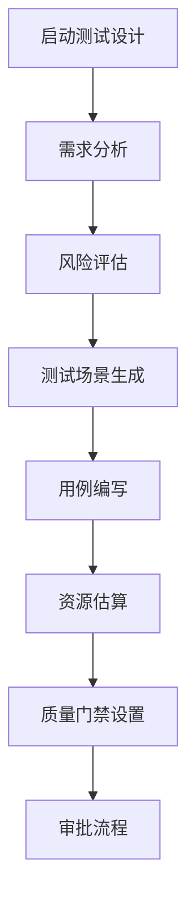
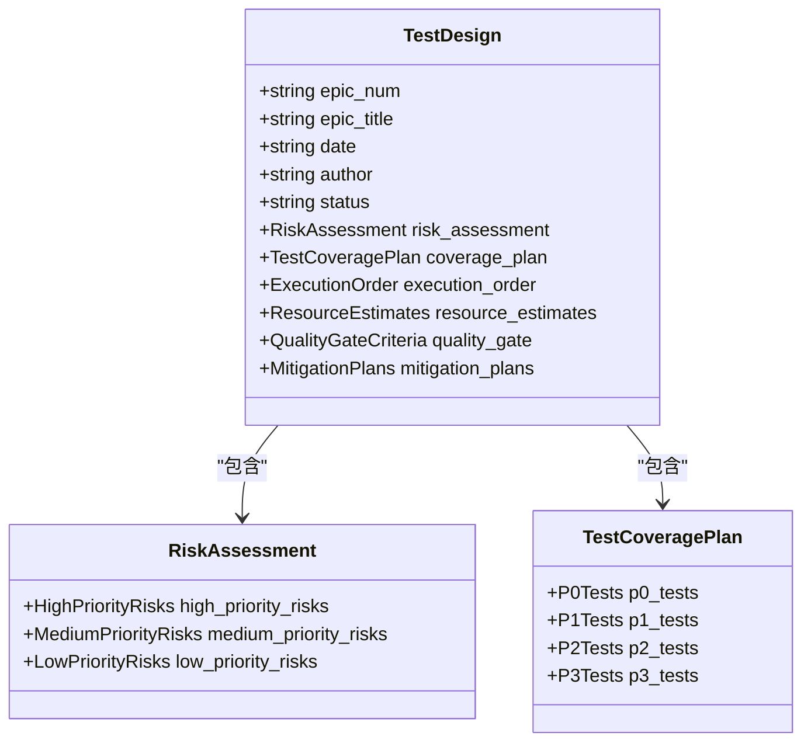
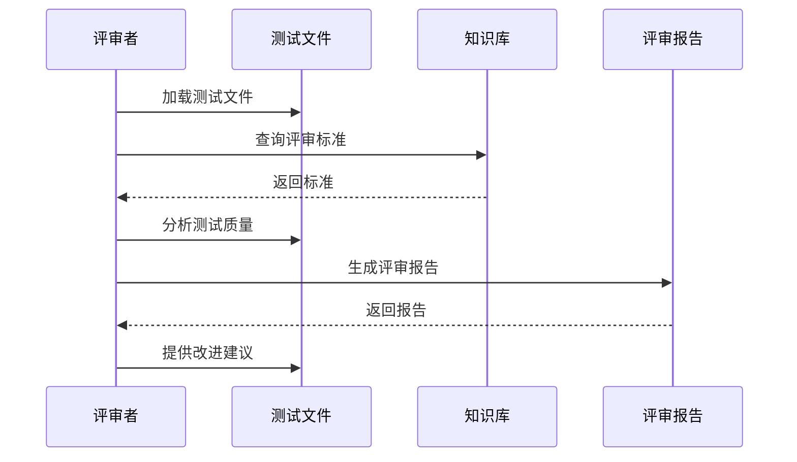
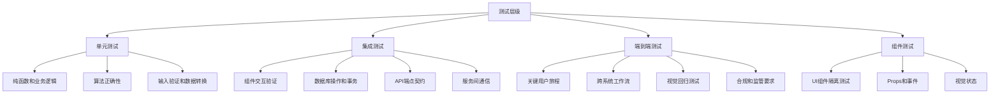
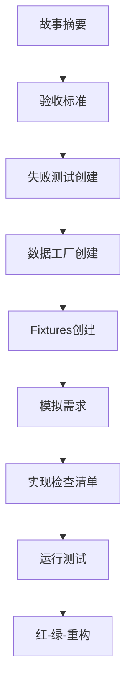
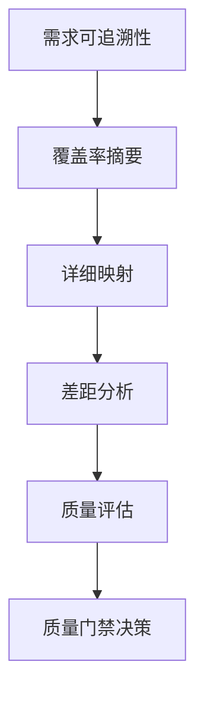

# 测试设计与开发

<cite>
**本文档中引用的文件**  
- [test-design-template.md](file://src/modules/bmm/workflows/testarch/test-design/test-design-template.md)
- [test-review-template.md](file://src/modules/bmm/workflows/testarch/test-review/test-review-template.md)
- [test-levels-framework.md](file://src/modules/bmm/testarch/knowledge/test-levels-framework.md)
- [atdd-checklist-template.md](file://src/modules/bmm/workflows/testarch/atdd/atdd-checklist-template.md)
- [trace-template.md](file://src/modules/bmm/workflows/testarch/trace/trace-template.md)
- [workflow.yaml](file://src/modules/bmm/workflows/testarch/test-design/workflow.yaml)
- [workflow.yaml](file://src/modules/bmm/workflows/testarch/test-review/workflow.yaml)
- [workflow.yaml](file://src/modules/bmm/workflows/testarch/framework/workflow.yaml)
</cite>

## 目录
1. [引言](#引言)
2. [测试设计工作流](#测试设计工作流)
3. [测试设计模板详解](#测试设计模板详解)
4. [测试评审工作流](#测试评审工作流)
5. [测试框架建立工作流](#测试框架建立工作流)
6. [测试层级框架](#测试层级框架)
7. [测试检查清单应用](#测试检查清单应用)
8. [测试设计模式最佳实践](#测试设计模式最佳实践)
9. [结论](#结论)

## 引言

本文档旨在系统化地阐述测试设计与开发的完整流程，重点介绍BMAD方法论中的测试工作流。文档将详细说明test-design工作流如何指导测试用例的设计，包括需求分析、风险评估和测试场景生成。同时，将结合test-review工作流说明测试用例的评审机制，以及framework工作流如何建立测试框架。通过test-levels-framework.md阐述不同层级的测试策略，并提供checklist.md中的关键检查项在实际项目中的应用指南。

## 测试设计工作流

test-design工作流是一个系统化的流程，用于指导测试用例的设计和开发。该工作流通过一系列步骤确保测试设计的全面性和有效性。



**Diagram sources**
- [workflow.yaml](file://src/modules/bmm/workflows/testarch/test-design/workflow.yaml)

**测试设计工作流步骤：**

1. **需求分析**：分析用户故事和需求文档，提取关键功能点和业务逻辑
2. **风险评估**：识别潜在风险，按概率和影响进行评分，确定高优先级风险
3. **测试场景生成**：基于风险评估结果，生成P0（关键）、P1（高）、P2（中）、P3（低）四个优先级的测试场景
4. **用例编写**：根据测试场景编写详细的测试用例，包括前置条件、执行步骤和预期结果
5. **资源估算**：估算测试开发所需的时间和资源，制定测试计划
6. **质量门禁设置**：定义测试通过的标准和质量要求
7. **审批流程**：提交测试设计文档，由产品经理、技术负责人和测试负责人审批

**Section sources**
- [workflow.yaml](file://src/modules/bmm/workflows/testarch/test-design/workflow.yaml)

## 测试设计模板详解

test-design-template.md提供了一个标准化的测试设计文档模板，确保测试设计的一致性和完整性。

### 模板结构



**Diagram sources**
- [test-design-template.md](file://src/modules/bmm/workflows/testarch/test-design/test-design-template.md)

### 模板关键部分

**执行摘要**
- 范围：定义测试设计的范围
- 风险摘要：统计识别的总风险数、高优先级风险数和关键类别
- 覆盖率摘要：统计各优先级场景的数量和预计工时

**风险评估**
- 高优先级风险（评分≥6）：列出高风险项，包括风险ID、类别、描述、概率、影响、评分、缓解措施、负责人和时间线
- 中优先级风险（评分3-4）：列出中等风险项
- 低优先级风险（评分1-2）：列出低风险项

**测试覆盖计划**
- P0（关键）：每次提交都运行的测试，标准为阻塞核心流程+高风险+无变通方案
- P1（高）：主分支PR时运行的测试，标准为重要功能+中等风险+常见工作流
- P2（中）：每晚/每周运行的测试，标准为次要功能+低风险+边缘情况
- P3（低）：按需运行的测试，标准为锦上添花+探索性+性能基准

**执行顺序**
- 烟雾测试（<5分钟）：快速反馈，捕获破坏构建的问题
- P0测试（<10分钟）：关键路径验证
- P1测试（<30分钟）：重要功能覆盖
- P2/P3测试（<60分钟）：完整回归覆盖

**资源估算**
- 测试开发工作量：按优先级统计测试数量、每项测试的工时和总工时
- 先决条件：包括测试数据、工具和环境要求

**质量门禁标准**
- 通过/失败阈值：定义各优先级测试的通过率要求
- 覆盖率目标：定义关键路径、安全场景、业务逻辑和边缘情况的覆盖率目标
- 不可协商要求：列出必须满足的非功能性要求

**Section sources**
- [test-design-template.md](file://src/modules/bmm/workflows/testarch/test-design/test-design-template.md)

## 测试评审工作流

test-review工作流用于对测试用例进行质量评审，确保测试用例符合最佳实践和质量标准。



**Diagram sources**
- [workflow.yaml](file://src/modules/bmm/workflows/testarch/test-review/workflow.yaml)

### 评审标准

**质量标准评估**
- BDD格式（Given-When-Then）
- 测试ID
- 优先级标记（P0/P1/P2/P3）
- 硬等待（sleep, waitForTimeout）
- 确定性（无条件语句）
- 隔离性（清理，无共享状态）
- Fixtures模式
- 数据工厂
- 网络优先模式
- 明确的断言
- 测试长度（≤300行）
- 测试时长（≤1.5分钟）
- 脆弱性模式

**质量评分体系**
- 起始分数：100分
- 扣分项：
  - 严重违规：-10分/项
  - 高级违规：-5分/项
  - 中级违规：-2分/项
  - 低级违规：-1分/项
- 加分项：
  - BDD优秀：+5分
  - Fixtures全面：+5分
  - 数据工厂：+5分
  - 网络优先：+5分
  - 完全隔离：+5分
  - 所有测试ID：+5分

**评审结果分类**
- 优秀：90-100分
- 良好：80-89分
- 可接受：70-79分
- 需要改进：60-69分
- 严重问题：<60分

**Section sources**
- [test-review-template.md](file://src/modules/bmm/workflows/testarch/test-review/test-review-template.md)

## 测试框架建立工作流

framework工作流用于建立和配置测试框架，确保测试环境的一致性和可维护性。


**Diagram sources**
- [workflow.yaml](file://src/modules/bmm/workflows/testarch/framework/workflow.yaml)

### 框架建立步骤

1. **选择测试框架**：根据项目需求选择合适的测试框架，如Playwright、Jest、Cypress等
2. **配置测试环境**：设置测试运行环境，包括浏览器、设备、分辨率等
3. **设置测试数据**：创建数据工厂和Fixtures，确保测试数据的一致性和可重复性
4. **定义测试模式**：确定测试组织结构、命名约定和最佳实践
5. **集成CI/CD**：将测试框架集成到持续集成/持续部署流程中
6. **验证框架**：运行验证测试，确保框架配置正确

**关键配置文件**
- `playwright.config.ts`：Playwright配置文件
- `jest.config.ts`：Jest配置文件
- `cypress.config.ts`：Cypress配置文件
- `test-environment.yaml`：测试环境配置

**Section sources**
- [workflow.yaml](file://src/modules/bmm/workflows/testarch/framework/workflow.yaml)

## 测试层级框架

test-levels-framework.md定义了不同层级的测试策略，帮助团队选择合适的测试级别。



**Diagram sources**
- [test-levels-framework.md](file://src/modules/bmm/testarch/knowledge/test-levels-framework.md)

### 测试层级决策矩阵

| 场景 | 单元测试 | 集成测试 | 端到端测试 |
|------|---------|---------|----------|
| 纯业务逻辑 | ✅ 主要 | ❌ 过度 | ❌ 过度 |
| 数据库操作 | ❌ 无法测试 | ✅ 主要 | ❌ 过度 |
| API契约 | ❌ 无法测试 | ✅ 主要 | ⚠️ 补充 |
| 用户旅程 | ❌ 无法测试 | ❌ 无法测试 | ✅ 主要 |
| 组件Props/事件 | ✅ 部分 | ⚠️ 组件测试 | ❌ 过度 |
| 视觉回归 | ❌ 无法测试 | ⚠️ 组件测试 | ✅ 主要 |
| 错误处理（逻辑） | ✅ 主要 | ⚠️ 集成 | ❌ 过度 |
| 错误处理（UI） | ❌ 部分 | ⚠️ 组件测试 | ✅ 主要 |

### 各层级测试特点

**单元测试**
- **适用场景**：纯函数和业务逻辑、算法正确性、输入验证和数据转换、错误处理在隔离组件中、复杂计算或状态机
- **特点**：执行速度快（即时反馈）、无外部依赖（数据库、API、文件系统）、高度可维护和稳定、易于调试失败
- **示例**：价格计算器的折扣计算逻辑

**集成测试**
- **适用场景**：组件交互验证、数据库操作和事务、API端点契约、服务间通信、中间件和拦截器行为
- **特点**：中等执行时间、测试组件边界、可能使用测试数据库或容器、验证系统集成点
- **示例**：用户服务创建用户并分配角色通过认证存储库

**端到端测试**
- **适用场景**：关键用户旅程、跨系统工作流、视觉回归测试、合规和监管要求、发布前最终验证
- **特点**：执行速度慢、测试完整工作流、需要完整的环境设置、最真实但最脆弱
- **示例**：完整的结账流程，用户使用保存的支付方式购买

**反模式避免**
- 避免使用端到端测试验证业务逻辑
- 避免对框架行为进行单元测试
- 避免对第三方库进行集成测试
- 避免跨层级的重复覆盖

**Section sources**
- [test-levels-framework.md](file://src/modules/bmm/testarch/knowledge/test-levels-framework.md)

## 测试检查清单应用

检查清单在测试过程中起着至关重要的作用，确保所有关键方面都得到考虑和验证。

### ATDD检查清单

ATDD（验收测试驱动开发）检查清单用于确保开发工作与业务需求对齐。



**Diagram sources**
- [atdd-checklist-template.md](file://src/modules/bmm/workflows/testarch/atdd/atdd-checklist-template.md)

**ATDD检查清单关键部分：**
- 故事摘要：简要描述用户故事
- 验收标准：列出所有可测试的验收标准
- 失败测试创建：创建所有测试并确保它们失败
- 数据工厂创建：创建用于生成测试数据的工厂
- Fixtures创建：创建测试Fixtures
- 模拟需求：记录需要模拟的外部服务
- 实现检查清单：将每个失败测试映射到具体的实现任务
- 红-绿-重构工作流：遵循TDD的红-绿-重构循环

### 追踪检查清单

追踪检查清单用于验证测试覆盖的完整性和质量。



**Diagram sources**
- [trace-template.md](file://src/modules/bmm/workflows/testarch/trace/trace-template.md)

**追踪检查清单关键部分：**
- 覆盖率摘要：按优先级统计覆盖率
- 详细映射：将每个验收标准映射到具体测试
- 差距分析：识别关键、高、中、低优先级的覆盖差距
- 质量评估：评估测试质量问题
- 质量门禁决策：基于证据做出通过、关注、失败或豁免的决策

**Section sources**
- [atdd-checklist-template.md](file://src/modules/bmm/workflows/testarch/atdd/atdd-checklist-template.md)
- [trace-template.md](file://src/modules/bmm/workflows/testarch/trace/trace-template.md)

## 测试设计模式最佳实践

### BDD（行为驱动开发）模式

BDD模式使用Given-When-Then结构来描述测试场景，使测试更具可读性和业务相关性。

```gherkin
Feature: 用户登录
  Scenario: 用户使用邮箱和密码登录
    Given 用户有有效的凭证
    When 用户提交登录表单
    Then 用户被重定向到仪表板
```

### 数据工厂模式

数据工厂模式使用工厂函数生成测试数据，确保数据的一致性和可重复性。

```typescript
// tests/support/factories/user.factory.ts
export const createUser = (overrides = {}) => ({
  id: faker.string.uuid(),
  email: faker.internet.email(),
  name: faker.person.fullName(),
  role: 'user',
  ...overrides
});

export const createUsers = (count) => 
  Array.from({ length: count }, () => createUser());
```

### Fixtures模式

Fixtures模式使用测试Fixtures来管理测试的设置和清理，确保测试的隔离性。

```typescript
// tests/support/fixtures/auth.fixture.ts
import { test as base } from '@playwright/test';

export const test = base.extend({
  authenticatedUser: async ({ page }, use) => {
    // 设置：创建用户并登录
    const user = createUser();
    await apiRequest.post('/api/users', { data: user });
    await page.goto('/login');
    await page.fill('[data-testid="email"]', user.email);
    await page.fill('[data-testid="password"]', 'password123');
    await page.click('[data-testid="login-button"]');
    
    // 提供：将用户传递给测试
    await use(user);
    
    // 清理：删除用户
    await apiRequest.delete(`/api/users/${user.id}`);
  }
});
```

### 网络优先模式

网络优先模式在导航前拦截网络请求，防止竞争条件。

```typescript
// 网络优先：在操作前拦截
const loginPromise = page.waitForResponse('**/api/auth/login');
await page.goto('/login');
await page.fill('[data-testid="email"]', user.email);
await page.fill('[data-testid="password"]', 'password123');
await page.click('[data-testid="login-button"]');
await loginPromise; // 等待响应
```

### 测试ID格式

统一的测试ID格式有助于追踪和管理测试。

`{EPIC}.{STORY}-{LEVEL}-{SEQ}`

示例：
- `1.3-UNIT-001`
- `1.3-INT-002`
- `1.3-E2E-001`

**Section sources**
- [test-review-template.md](file://src/modules/bmm/workflows/testarch/test-review/test-review-template.md)
- [test-levels-framework.md](file://src/modules/bmm/testarch/knowledge/test-levels-framework.md)

## 结论

本文档系统地介绍了BMAD方法论中的测试设计与开发流程。通过test-design工作流，团队可以系统化地进行需求分析、风险评估和测试场景生成。test-review工作流确保了测试用例的质量，而framework工作流则建立了可靠的测试框架基础。

test-levels-framework.md提供了清晰的测试层级决策指南，帮助团队选择合适的测试级别，避免反模式。检查清单在ATDD和追踪过程中发挥着关键作用，确保开发与业务需求对齐，并验证测试覆盖的完整性。

最佳实践如BDD模式、数据工厂、Fixtures和网络优先模式，为高质量的测试开发提供了具体指导。这些实践共同构成了一个完整的测试生态系统，支持敏捷开发和持续交付。

通过遵循这些流程和实践，团队可以建立一个高效、可靠和可维护的测试体系，确保软件质量并加速交付过程。