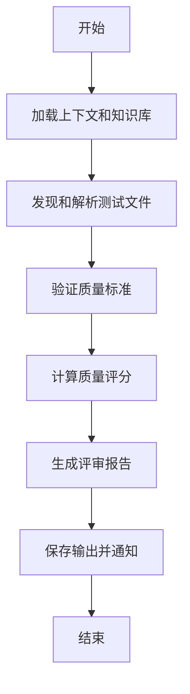
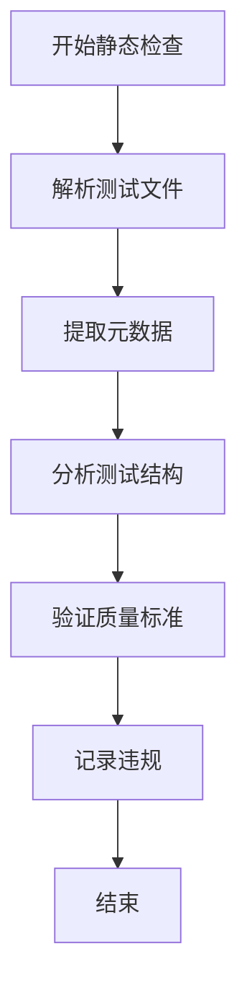
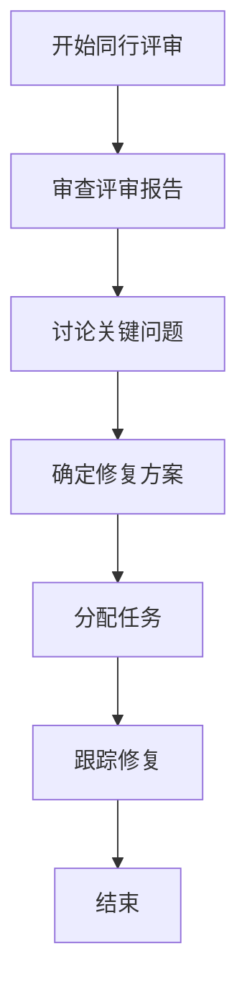
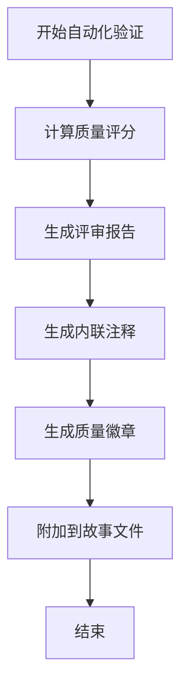

# 测试评审流程

<cite>
**本文档引用的文件**   
- [workflow.yaml](file://src/modules/bmm/workflows/testarch/test-review/workflow.yaml)
- [test-review-template.md](file://src/modules/bmm/workflows/testarch/test-review/test-review-template.md)
- [instructions.md](file://src/modules/bmm/workflows/testarch/test-review/instructions.md)
- [checklist.md](file://src/modules/bmm/workflows/testarch/test-review/checklist.md)
- [tea-index.csv](file://src/modules/bmm/testarch/tea-index.csv)
- [fixture-architecture.md](file://src/modules/bmm/testarch/knowledge/fixture-architecture.md)
- [network-first.md](file://src/modules/bmm/testarch/knowledge/network-first.md)
- [data-factories.md](file://src/modules/bmm/testarch/knowledge/data-factories.md)
- [test-quality.md](file://src/modules/bmm/testarch/knowledge/test-quality.md)
</cite>

## 目录
1. [引言](#引言)
2. [测试评审工作流](#测试评审工作流)
3. [静态检查机制](#静态检查机制)
4. [同行评审流程](#同行评审流程)
5. [自动化验证](#自动化验证)
6. [评审报告结构](#评审报告结构)
7. [评审标准](#评审标准)
8. [最佳实践](#最佳实践)
9. [与项目管理工具集成](#与项目管理工具集成)
10. [结论](#结论)

## 引言

测试评审流程是确保软件质量的关键环节，通过系统化的评审机制来评估测试用例的质量、覆盖率和可维护性。本文档详细阐述了test-review工作流的执行机制，包括静态检查、同行评审和自动化验证三个核心步骤。评审流程结合了test-review-template.md中定义的报告结构化输出格式，利用checklist.md中的评审标准指导团队进行系统化评估，并通过instructions.md中的最佳实践来组织高效的评审会议。整个流程旨在识别测试设计中的漏洞，跟踪问题修复，并与Jira或GitLab等项目管理工具集成，形成完整的评审工作流。

**Section sources**
- [workflow.yaml](file://src/modules/bmm/workflows/testarch/test-review/workflow.yaml#L1-L49)
- [instructions.md](file://src/modules/bmm/workflows/testarch/test-review/instructions.md#L1-L629)

## 测试评审工作流

测试评审工作流由workflow.yaml文件定义，是一个系统化的流程，旨在通过多个阶段的检查来确保测试代码的质量。工作流的核心是testarch-test-review，它使用TEA（Test Architect）的知识库和最佳实践来验证测试质量。工作流的执行从加载上下文和知识库开始，然后发现和解析测试文件，接着验证质量标准，计算质量评分，生成评审报告，最后保存输出并通知用户。

工作流支持多种评审范围，包括单个文件、目录或整个测试套件。它能够自动发现相关的工件，如用户故事文件和测试设计文档，以提供上下文。评审过程基于知识库片段，如test-quality.md、data-factories.md和fixture-architecture.md，确保反馈基于经过验证的模式。工作流的输出包括一个综合的评审报告，其中包含质量评分、关键问题、建议和最佳实践示例。

**Diagram sources**
- [workflow.yaml](file://src/modules/bmm/workflows/testarch/test-review/workflow.yaml#L1-L49)
- [instructions.md](file://src/modules/bmm/workflows/testarch/test-review/instructions.md#L46-L454)

**Section sources**
- [workflow.yaml](file://src/modules/bmm/workflows/testarch/test-review/workflow.yaml#L1-L49)
- [instructions.md](file://src/modules/bmm/workflows/testarch/test-review/instructions.md#L46-L454)

## 静态检查机制

静态检查是测试评审流程的第一步，它在不执行代码的情况下分析测试文件的结构和模式。这一阶段主要检查BDD格式、测试ID、优先级标记、硬等待、确定性、隔离性、夹具模式、数据工厂、网络优先模式、断言、测试长度、测试持续时间和脆弱性模式等质量标准。

静态检查通过解析测试文件的元数据和结构来工作。它会计算文件大小、检测测试框架、分析导入和依赖关系，并提取测试结构，如describe块和it块的数量。然后，它会根据预定义的标准验证每个质量准则。例如，对于BDD格式，它会检查测试是否使用了Given-When-Then结构；对于硬等待，它会检测是否存在sleep()或waitForTimeout()等可能导致脆弱性的模式。

**Diagram sources**
- [instructions.md](file://src/modules/bmm/workflows/testarch/test-review/instructions.md#L142-L333)
- [checklist.md](file://src/modules/bmm/workflows/testarch/test-review/checklist.md#L71-L176)

**Section sources**
- [instructions.md](file://src/modules/bmm/workflows/testarch/test-review/instructions.md#L142-L333)
- [checklist.md](file://src/modules/bmm/workflows/testarch/test-review/checklist.md#L71-L176)

## 同行评审流程

同行评审是测试评审流程的核心，它结合了自动化检查和人工判断。在静态检查完成后，评审流程会生成一个包含关键问题和建议的报告，供团队成员进行讨论。同行评审的目标是确保测试用例覆盖了所有验收标准，测试设计合理，并且代码质量高。

评审会议应由测试架构师（TEA）或资深开发人员主持，团队成员包括开发人员、测试人员和产品经理。会议中，主持人会引导团队审查评审报告，讨论关键问题，如硬等待、共享状态和脆弱性模式。团队应重点关注P0和P1级别的问题，这些问题必须在合并前修复。对于P2和P3级别的建议，团队可以讨论是否在当前迭代中解决，还是作为技术债务在后续处理。

**Diagram sources**
- [instructions.md](file://src/modules/bmm/workflows/testarch/test-review/instructions.md#L376-L433)
- [test-review-template.md](file://src/modules/bmm/workflows/testarch/test-review/test-review-template.md#L81-L277)

**Section sources**
- [instructions.md](file://src/modules/bmm/workflows/testarch/test-review/instructions.md#L376-L433)
- [test-review-template.md](file://src/modules/bmm/workflows/testarch/test-review/test-review-template.md#L81-L277)

## 自动化验证

自动化验证是测试评审流程的最后一步，它通过计算质量评分和生成评审报告来量化测试质量。质量评分基于违规和最佳实践的加权计算。起始分为100分，根据违规的严重性扣分：P0违规每个扣10分，P1违规每个扣5分，P2违规每个扣2分，P3违规每个扣1分。同时，对于符合最佳实践的情况，如优秀的BDD结构、全面的夹具和数据工厂等，会给予加分。

自动化验证还会生成一个详细的评审报告，该报告使用test-review-template.md作为模板。报告包含执行摘要、质量标准评估、关键问题、建议、最佳实践示例和知识库引用。此外，工作流还可以选择性地生成内联注释、质量徽章或将评审结果附加到用户故事文件中，以便于跟踪和集成。

**Diagram sources**
- [instructions.md](file://src/modules/bmm/workflows/testarch/test-review/instructions.md#L334-L433)
- [test-review-template.md](file://src/modules/bmm/workflows/testarch/test-review/test-review-template.md#L58-L377)

**Section sources**
- [instructions.md](file://src/modules/bmm/workflows/testarch/test-review/instructions.md#L334-L433)
- [test-review-template.md](file://src/modules/bmm/workflows/testarch/test-review/test-review-template.md#L58-L377)

## 评审报告结构

评审报告的结构由test-review-template.md定义，它提供了一个标准化的格式，确保所有评审都包含一致的信息。报告的头部包含测试文件名、质量评分、评审日期、评审范围和评审人。执行摘要部分提供整体评估、推荐意见、关键优势和弱点。

质量标准评估部分以表格形式列出所有评估的标准，包括状态（通过/警告/失败）、违规数量和备注。关键问题部分列出必须修复的P0和P1违规，每个问题都包含严重性、位置、问题描述、推荐修复方案和知识库引用。建议部分列出应修复的P2和P3违规。最佳实践示例部分突出显示测试中的良好模式。最后，报告列出所有引用的知识库片段，为团队提供详细的指导。

**Section sources**
- [test-review-template.md](file://src/modules/bmm/workflows/testarch/test-review/test-review-template.md#L1-L389)

## 评审标准

评审标准由checklist.md和instructions.md定义，它们提供了一个全面的清单，用于验证测试质量。标准分为多个类别，包括BDD格式、测试ID、优先级标记、硬等待、确定性、隔离性、夹具模式、数据工厂、网络优先模式、断言、测试长度、测试持续时间和脆弱性模式。

每个标准都有明确的通过、警告和失败条件。例如，对于硬等待，如果检测到sleep()或waitForTimeout()而没有正当理由，则为失败；如果有正当理由的注释，则为警告；如果没有硬等待，则为通过。这些标准确保评审过程客观且一致，帮助团队识别和修复潜在问题。

**Section sources**
- [checklist.md](file://src/modules/bmm/workflows/testarch/test-review/checklist.md#L75-L176)
- [instructions.md](file://src/modules/bmm/workflows/testarch/test-review/instructions.md#L148-L333)

## 最佳实践

最佳实践由TEA的知识库提供，包括fixture-architecture.md、network-first.md和data-factories.md等文档。这些实践旨在提高测试的可维护性、可靠性和效率。例如，夹具架构建议使用纯函数→夹具→mergeTests的模式，以确保测试的隔离性和可重用性。网络优先模式建议在导航前设置路由拦截，以防止竞争条件。数据工厂建议使用工厂函数来生成测试数据，避免硬编码。

团队应将这些最佳实践作为指导，而不是硬性规则。在某些情况下，特定的模式可能有正当理由，团队应在代码中添加注释来解释。持续改进是关键，团队应定期回顾和更新他们的测试实践，以适应新的挑战和技术。

**Section sources**
- [fixture-architecture.md](file://src/modules/bmm/testarch/knowledge/fixture-architecture.md)
- [network-first.md](file://src/modules/bmm/testarch/knowledge/network-first.md)
- [data-factories.md](file://src/modules/bmm/testarch/knowledge/data-factories.md)

## 与项目管理工具集成

测试评审流程可以与Jira或GitLab等项目管理工具集成，以实现无缝的跟踪和管理。当评审发现关键问题时，工作流可以自动生成任务或问题，并将其分配给相应的团队成员。例如，如果检测到硬等待，工作流可以创建一个Jira问题，描述问题并链接到评审报告。

在GitLab中，评审报告可以作为合并请求的评论添加，确保在合并代码前解决所有问题。团队可以使用标签来跟踪问题的状态，如"待修复"、"已修复"和"已验证"。这种集成确保了评审过程的透明度和问责制，有助于提高软件的整体质量。

**Section sources**
- [instructions.md](file://src/modules/bmm/workflows/testarch/test-review/instructions.md#L430-L433)
- [test-review-template.md](file://src/modules/bmm/workflows/testarch/test-review/test-review-template.md#L430-L433)

## 结论

测试评审流程是一个系统化的方法，用于确保测试代码的质量。通过结合静态检查、同行评审和自动化验证，团队可以识别和修复潜在问题，提高测试的可靠性和可维护性。评审报告的结构化输出和评审标准的系统化应用，确保了评审过程的一致性和客观性。最佳实践和与项目管理工具的集成，进一步增强了流程的有效性。最终，一个高效的测试评审流程是交付高质量软件的关键。