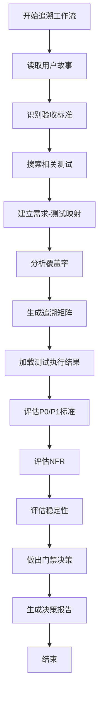
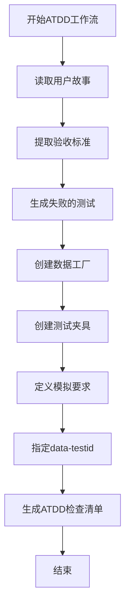
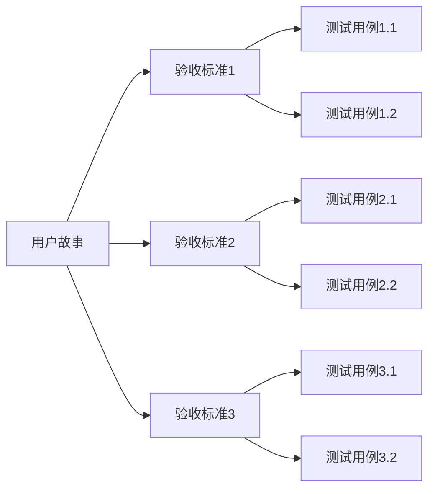
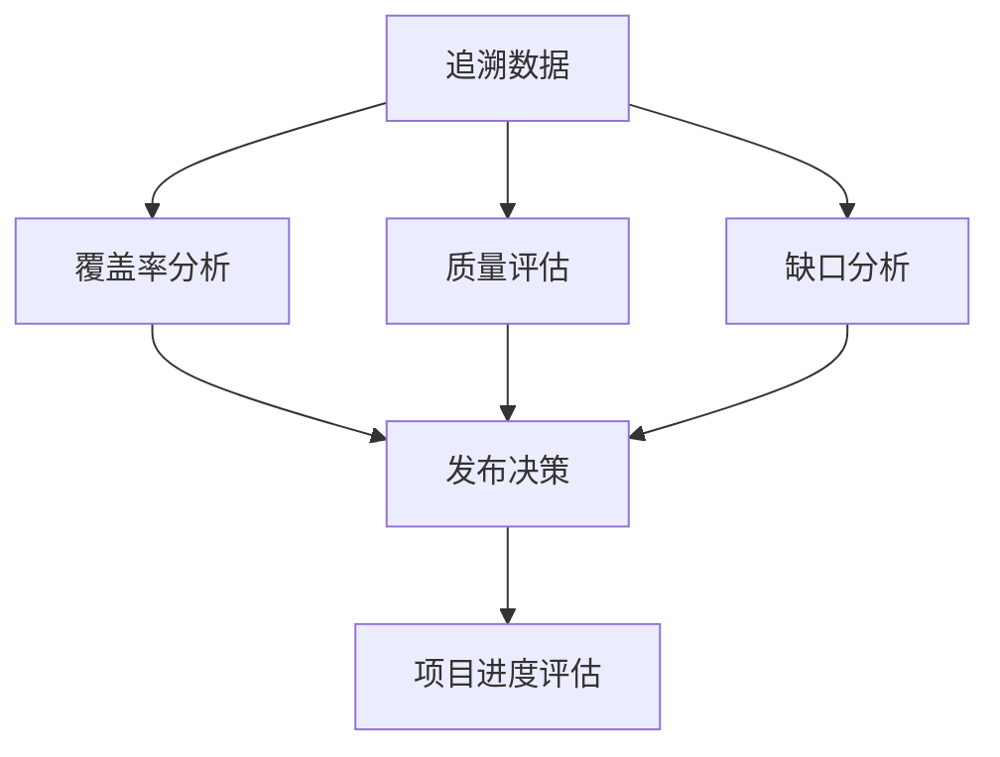

# 测试追溯与验收

<cite>
**本文档引用的文件**
- [trace-template.md](file://src/modules/bmm/workflows/testarch/trace/trace-template.md)
- [atdd-checklist-template.md](file://src/modules/bmm/workflows/testarch/atdd/atdd-checklist-template.md)
- [workflow.yaml](file://src/modules/bmm/workflows/testarch/trace/workflow.yaml)
- [workflow.yaml](file://src/modules/bmm/workflows/testarch/atdd/workflow.yaml)
- [instructions.md](file://src/modules/bmm/workflows/testarch/trace/instructions.md)
- [atdd/workflow.yaml](file://src/modules/bmm/workflows/testarch/atdd/workflow.yaml)
- [testarch/knowledge/overview.md](file://src/modules/bmm/testarch/knowledge/overview.md)
- [testarch/knowledge/test-quality.md](file://src/modules/bmm/testarch/knowledge/test-quality.md)
- [testarch/knowledge/test-levels-framework.md](file://src/modules/bmm/testarch/knowledge/test-levels-framework.md)
- [testarch/knowledge/data-factories.md](file://src/modules/bmm/testarch/knowledge/data-factories.md)
- [testarch/knowledge/fixture-architecture.md](file://src/modules/bmm/testarch/knowledge/fixture-architecture.md)
- [testarch/knowledge/component-tdd.md](file://src/modules/bmm/testarch/knowledge/component-tdd.md)
- [testarch/knowledge/network-first.md](file://src/modules/bmm/testarch/knowledge/network-first.md)
</cite>

## 目录
1. [引言](#引言)
2. [追溯工作流详解](#追溯工作流详解)
3. [ATDD工作流实现](#atdd工作流实现)
4. [端到端追溯示例](#端到端追溯示例)
5. [追溯数据应用](#追溯数据应用)
6. [结论](#结论)

## 引言
本文档详细阐述BMAD-METHOD框架中的测试追溯与验收机制，重点介绍如何通过trace工作流建立需求、代码和测试之间的完整追溯关系。文档将深入解析workflow.yaml中定义的追溯流程，包括需求标识、测试关联和报告生成，并结合trace-template.md提供实际的追溯文档模板使用示例。同时，本文档将说明atdd工作流如何实现验收测试驱动开发，包括客户协作、验收标准定义和自动化验收测试执行，使用atdd-checklist-template.md指导团队实施ATDD实践。

## 追溯工作流详解

追溯工作流（testarch-trace）是BMAD-METHOD框架中的核心质量保障机制，旨在生成需求到测试的追溯矩阵，分析覆盖率，并做出质量门禁决策（通过/关注/失败/豁免）。该工作流通过系统化的方法确保软件开发过程中的每个需求都有相应的测试覆盖，从而提高软件质量和可靠性。

追溯工作流的主要目标包括：
- 生成需求到测试的追溯矩阵
- 分析测试覆盖率
- 做出质量门禁决策
- 识别测试缺口和质量问题
- 提供改进建议

工作流通过两个主要阶段实现这些目标：追溯阶段和门禁决策阶段。追溯阶段关注需求与测试之间的映射关系，而门禁决策阶段则基于测试执行结果和非功能性需求评估做出发布决策。



**Diagram sources**
- [workflow.yaml](file://src/modules/bmm/workflows/testarch/trace/workflow.yaml#L1-L58)
- [instructions.md](file://src/modules/bmm/workflows/testarch/trace/instructions.md#L687-L1046)

**Section sources**
- [workflow.yaml](file://src/modules/bmm/workflows/testarch/trace/workflow.yaml#L1-L58)
- [instructions.md](file://src/modules/bmm/workflows/testarch/trace/instructions.md#L687-L1046)

## ATDD工作流实现

验收测试驱动开发（ATDD）工作流是BMAD-METHOD框架中的关键实践，旨在通过在开发前定义验收测试来确保开发成果符合业务需求。该工作流遵循红-绿-重构循环，确保每个功能在实现前都有明确的验收标准。

### ATDD工作流核心组件

ATDD工作流的核心是生成失败的验收测试，然后通过实现代码使其通过。工作流的主要组件包括：

1. **验收标准定义**：从用户故事中提取可测试的验收标准
2. **测试生成**：为每个验收标准生成失败的测试用例
3. **数据工厂**：创建用于测试的数据工厂
4. **测试夹具**：创建测试夹具以简化测试设置和清理
5. **模拟要求**：定义外部服务的模拟要求
6. **data-testid属性**：指定UI实现中需要的data-testid属性



**Diagram sources**
- [atdd/workflow.yaml](file://src/modules/bmm/workflows/testarch/atdd/workflow.yaml#L1-L48)
- [atdd-checklist-template.md](file://src/modules/bmm/workflows/testarch/atdd/atdd-checklist-template.md#L1-L364)

**Section sources**
- [atdd/workflow.yaml](file://src/modules/bmm/workflows/testarch/atdd/workflow.yaml#L1-L48)
- [atdd-checklist-template.md](file://src/modules/bmm/workflows/testarch/atdd/atdd-checklist-template.md#L1-L364)

### ATDD检查清单模板

ATDD检查清单模板提供了一个结构化的方法来实施验收测试驱动开发。模板包含以下关键部分：

- **用户故事摘要**：简要描述用户故事
- **验收标准**：列出所有可测试的验收标准
- **失败测试**：为每个验收标准创建的失败测试
- **数据工厂**：用于生成测试数据的工厂函数
- **测试夹具**：用于设置和清理测试环境的夹具
- **模拟要求**：外部服务的模拟要求
- **data-testid属性**：UI实现中需要的标识符
- **实施检查清单**：将每个测试映射到具体的实施任务

模板还包含了红-绿-重构工作流的指导，帮助开发团队理解如何从失败的测试开始，通过实施代码使其通过，最后进行重构以提高代码质量。

## 端到端追溯示例

本节提供一个从用户故事到测试用例的端到端追溯示例，展示如何在BMAD-METHOD框架中实现完整的追溯关系。

### 用户故事示例

考虑以下用户故事：
```
作为用户，我想要通过电子邮件和密码登录，以便访问我的账户。
```

验收标准：
1. 用户可以使用有效的电子邮件和密码登录
2. 系统应在登录失败时显示适当的错误消息
3. 用户会话应在登录后创建

### 追溯流程

追溯流程从读取用户故事开始，然后识别所有验收标准。对于每个验收标准，工作流会搜索相关的测试用例，并建立映射关系。



**Diagram sources**
- [trace-template.md](file://src/modules/bmm/workflows/testarch/trace/trace-template.md#L1-L674)
- [atdd-checklist-template.md](file://src/modules/bmm/workflows/testarch/atdd/atdd-checklist-template.md#L1-L364)

**Section sources**
- [trace-template.md](file://src/modules/bmm/workflows/testarch/trace/trace-template.md#L1-L674)
- [atdd-checklist-template.md](file://src/modules/bmm/workflows/testarch/atdd/atdd-checklist-template.md#L1-L364)

### 覆盖率分析

工作流会分析每个验收标准的测试覆盖率，并分类为完全覆盖、部分覆盖、无覆盖、仅单元测试覆盖或仅集成测试覆盖。覆盖率分析考虑了测试的优先级（P0/P1/P2/P3），并根据风险级别对缺口进行优先排序。

对于P0标准，覆盖率必须达到100%，否则将被视为阻塞问题。P1标准的覆盖率应达到90%以上，P2和P3标准的覆盖率则作为信息参考。

## 追溯数据应用

追溯数据在项目管理和质量保障中具有多种应用，包括测试覆盖率分析和项目进度评估。

### 测试覆盖率分析

追溯工作流生成的覆盖率数据可以用于：
- 识别关键功能的测试缺口
- 评估测试质量
- 指导测试优先级
- 支持发布决策

覆盖率分析不仅关注测试数量，还关注测试质量。工作流会评估测试是否存在质量问题，如执行时间过长、文件过大、缺少给定-当-那么结构等。

### 项目进度评估

追溯数据可以作为项目进度的重要指标：
- 高覆盖率表明功能实现接近完成
- 低覆盖率可能表明功能实现滞后
- P0标准的覆盖率是发布的关键指标

通过定期生成追溯报告，团队可以监控项目进度，识别潜在风险，并及时采取纠正措施。



**Diagram sources**
- [instructions.md](file://src/modules/bmm/workflows/testarch/trace/instructions.md#L687-L1046)
- [trace-template.md](file://src/modules/bmm/workflows/testarch/trace/trace-template.md#L1-L674)

**Section sources**
- [instructions.md](file://src/modules/bmm/workflows/testarch/trace/instructions.md#L687-L1046)
- [trace-template.md](file://src/modules/bmm/workflows/testarch/trace/trace-template.md#L1-L674)

## 结论

BMAD-METHOD框架中的测试追溯与验收机制提供了一套完整的解决方案，确保软件开发过程中的每个需求都有相应的测试覆盖。通过trace工作流和ATDD工作流的结合，团队可以建立需求、代码和测试之间的完整追溯关系，提高软件质量和可靠性。

追溯工作流不仅生成需求到测试的追溯矩阵，还通过质量门禁决策支持发布决策。ATDD工作流则通过在开发前定义验收测试，确保开发成果符合业务需求。这些机制共同构成了一个强大的质量保障体系，支持持续交付和敏捷开发。