# 需求-测试追溯

<cite>
**本文档引用的文件**
- [trace-template.md](file://src/modules/bmm/workflows/testarch/trace/trace-template.md)
- [instructions.md](file://src/modules/bmm/workflows/testarch/trace/instructions.md)
- [checklist.md](file://src/modules/bmm/workflows/testarch/trace/checklist.md)
- [test-levels-framework.md](file://src/modules/bmm/testarch/knowledge/test-levels-framework.md)
- [test-priorities-matrix.md](file://src/modules/bmm/testarch/knowledge/test-priorities-matrix.md)
- [risk-governance.md](file://src/modules/bmm/testarch/knowledge/risk-governance.md)
- [atdd/instructions.md](file://src/modules/bmm/workflows/testarch/atdd/instructions.md)
- [test-design/instructions.md](file://src/modules/bmm/workflows/testarch/test-design/instructions.md)
</cite>

## 目录
1. [概述](#概述)
2. [追溯工作流架构](#追溯工作流架构)
3. [需求标识与提取](#需求标识与提取)
4. [测试关联验证](#测试关联验证)
5. [追溯报告生成](#追溯报告生成)
6. [测试架构框架](#测试架构框架)
7. [端到端追溯示例](#端到端追溯示例)
8. [追溯矩阵分析](#追溯矩阵分析)
9. [项目进度跟踪](#项目进度跟踪)
10. [故障排除指南](#故障排除指南)
11. [最佳实践](#最佳实践)

## 概述

BMAD-METHOD项目实现了一个完整的端到端需求-测试追溯系统，通过`testarch-trace`工作流建立用户需求、代码实现和测试用例之间的完整追溯关系。该系统支持从产品需求文档到自动化测试的全流程追溯，确保测试覆盖率分析和变更影响评估的准确性。

追溯系统的核心价值在于：
- **完整性**：建立需求到测试的双向追溯链
- **可追溯性**：支持变更影响分析和回归测试规划
- **质量保证**：通过自动化门禁决策确保发布质量
- **风险管理**：基于风险优先级的测试策略

## 追溯工作流架构

### 工作流执行阶段

追溯工作流分为两个连续阶段：

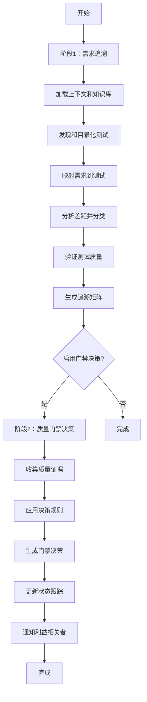

**图表来源**
- [instructions.md](file://src/modules/bmm/workflows/testarch/trace/instructions.md#L12-L17)

### 核心组件架构

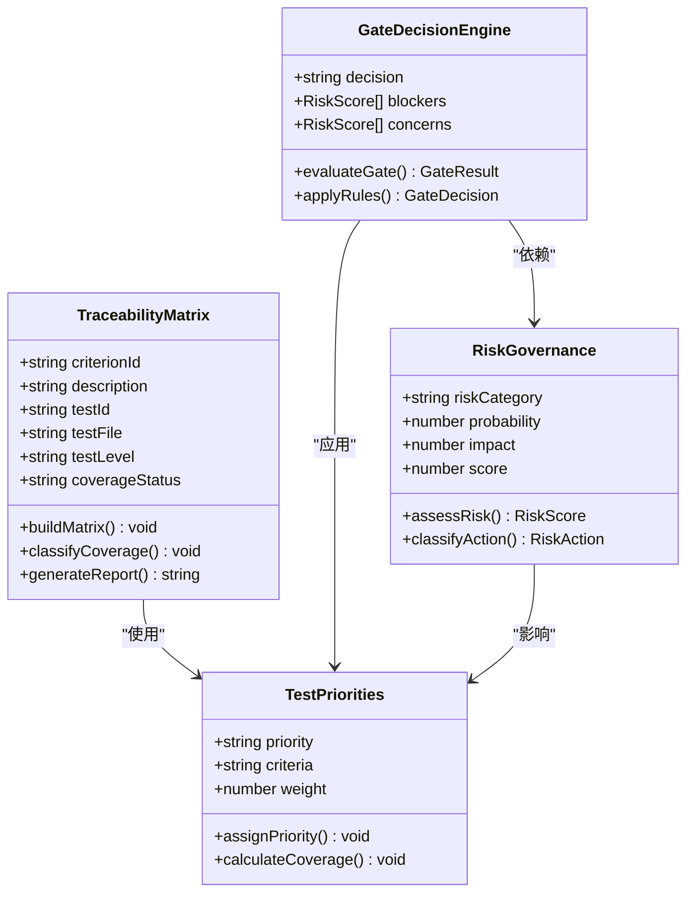

**图表来源**
- [risk-governance.md](file://src/modules/bmm/testarch/knowledge/risk-governance.md#L127-L208)
- [test-priorities-matrix.md](file://src/modules/bmm/testarch/knowledge/test-priorities-matrix.md#L1-L200)

**章节来源**
- [instructions.md](file://src/modules/bmm/workflows/testarch/trace/instructions.md#L1-L50)
- [checklist.md](file://src/modules/bmm/workflows/testarch/trace/checklist.md#L1-L50)

## 需求标识与提取

### 接受标准识别

追溯系统通过多种方式识别和提取需求：

1. **故事文件解析**：自动提取Markdown格式的故事文件中的接受标准
2. **内联需求输入**：支持直接在工作流中提供需求描述
3. **知识库集成**：从预定义的知识片段中加载需求模板

### 需求分类框架

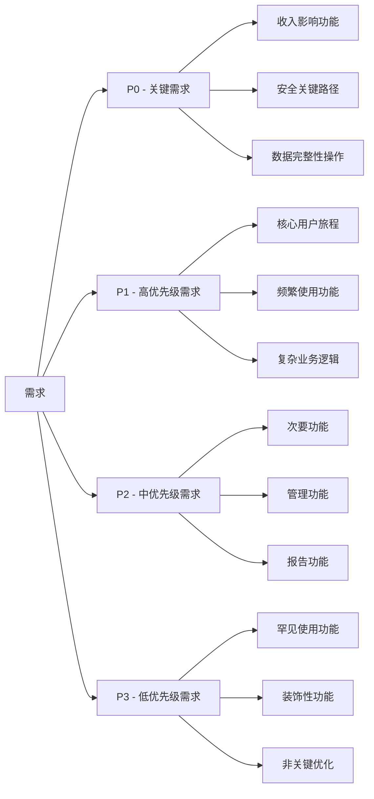

**图表来源**
- [test-priorities-matrix.md](file://src/modules/bmm/testarch/knowledge/test-priorities-matrix.md#L9-L104)

### 测试级别选择策略

追溯系统根据以下决策矩阵确定适当的测试级别：

| 场景类型 | 单元测试 | 集成测试 | 端到端测试 |
|----------|----------|----------|------------|
| 纯业务逻辑 | ✅ 主要 | ❌ 过度 | ❌ 过度 |
| 数据库操作 | ❌ 无法测试 | ✅ 主要 | ❌ 过度 |
| API契约 | ❌ 无法测试 | ✅ 主要 | ⚠️ 补充 |
| 用户旅程 | ❌ 无法测试 | ❌ 无法测试 | ✅ 主要 |
| 组件属性/事件 | ✅ 部分 | ⚠️ 组件测试 | ❌ 过度 |
| 视觉回归 | ❌ 无法测试 | ⚠️ 组件测试 | ✅ 主要 |

**章节来源**
- [test-levels-framework.md](file://src/modules/bmm/testarch/knowledge/test-levels-framework.md#L435-L447)
- [test-priorities-matrix.md](file://src/modules/bmm/testarch/knowledge/test-priorities-matrix.md#L127-L134)

## 测试关联验证

### 显式映射机制

追溯系统要求测试对需求进行显式映射，避免推断：

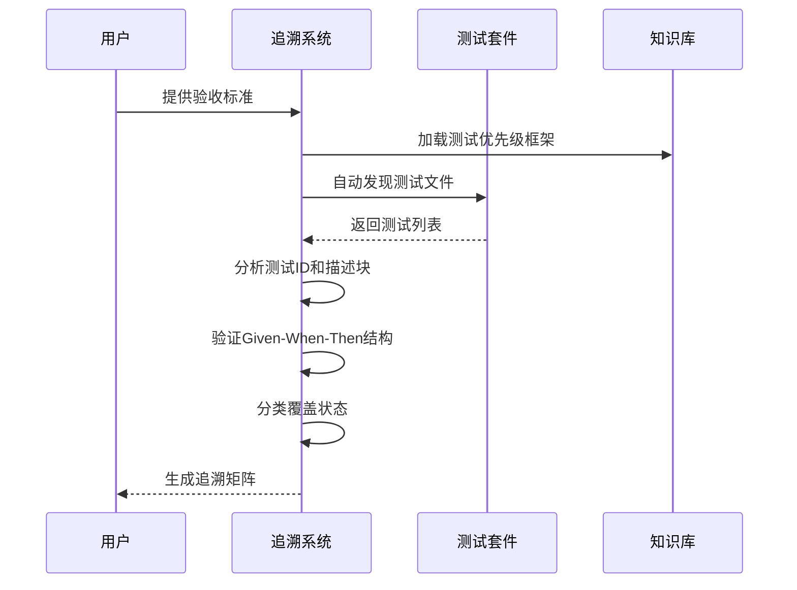

**图表来源**
- [instructions.md](file://src/modules/bmm/workflows/testarch/trace/instructions.md#L116-L146)

### 覆盖状态分类

系统支持五种覆盖状态分类：

1. **FULL** - 所有场景在适当级别得到验证
2. **PARTIAL** - 存在但缺少边缘情况或级别
3. **NONE** - 在任何级别都没有测试覆盖
4. **UNIT-ONLY** - 仅单元测试（缺少集成/端到端验证）
5. **INTEGRATION-ONLY** - 仅API/组件测试（缺少单元确认）

### 重复覆盖检测

系统应用选择性测试原则检测不必要的重复覆盖：

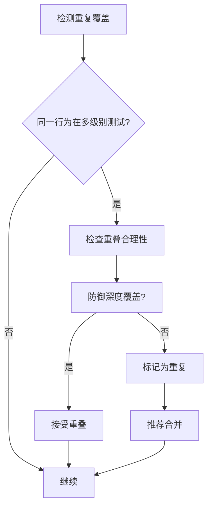

**图表来源**
- [instructions.md](file://src/modules/bmm/workflows/testarch/trace/instructions.md#L141-L145)

**章节来源**
- [instructions.md](file://src/modules/bmm/workflows/testarch/trace/instructions.md#L116-L146)
- [checklist.md](file://src/modules/bmm/workflows/testarch/trace/checklist.md#L50-L87)

## 追溯报告生成

### 报告模板结构

追溯报告采用标准化模板，包含以下核心部分：

```mermaid
mindmap
root((追溯报告))
摘要
覆盖率统计
关键指标
决策状态
详细映射
需求ID
描述
测试ID
文件路径
测试级别
覆盖状态
差距分析
关键差距
高优先级差距
中等优先级差距
低优先级差距
质量评估
问题测试
通过的质量测试
重复覆盖分析
建议行动
立即行动
短期行动
长期行动
门禁决策
决策结果
证据摘要
理由说明
```

**图表来源**
- [trace-template.md](file://src/modules/bmm/workflows/testarch/trace/trace-template.md#L1-L674)

### 质量门禁决策

系统支持四种门禁决策：

1. **PASS** - 符合所有质量标准，可部署
2. **CONCERNS** - 存在次要差距，需要监控部署
3. **FAIL** - 存在阻塞问题，禁止部署
4. **WAIVED** - 业务批准的例外情况

### 决策规则矩阵

| 场景 | P0覆盖率 | P1覆盖率 | 总体覆盖率 | P0通过率 | P1通过率 | 总体通过率 | NFRs | 决策 |
|------|----------|----------|------------|----------|----------|------------|------|------|
| 全绿 | 100% | ≥90% | ≥80% | 100% | ≥95% | ≥90% | 通过 | PASS |
| 小差距 | 100% | 80-89% | ≥80% | 100% | 90-94% | 85-89% | 通过 | CONCERNS |
| 缺失P0 | <100% | - | - | - | - | - | - | FAIL |
| P0测试失败 | 100% | - | - | <100% | - | - | - | FAIL |
| P1差距 | 100% | <80% | - | 100% | - | - | - | FAIL |
| NFR失败 | 100% | ≥90% | ≥80% | 100% | ≥95% | ≥90% | 失败 | FAIL |

**章节来源**
- [instructions.md](file://src/modules/bmm/workflows/testarch/trace/instructions.md#L308-L367)
- [trace-template.md](file://src/modules/bmm/workflows/testarch/trace/trace-template.md#L356-L480)

## 测试架构框架

### 测试金字塔模型

追溯系统遵循经典的测试金字塔模型，支持多层次测试策略：

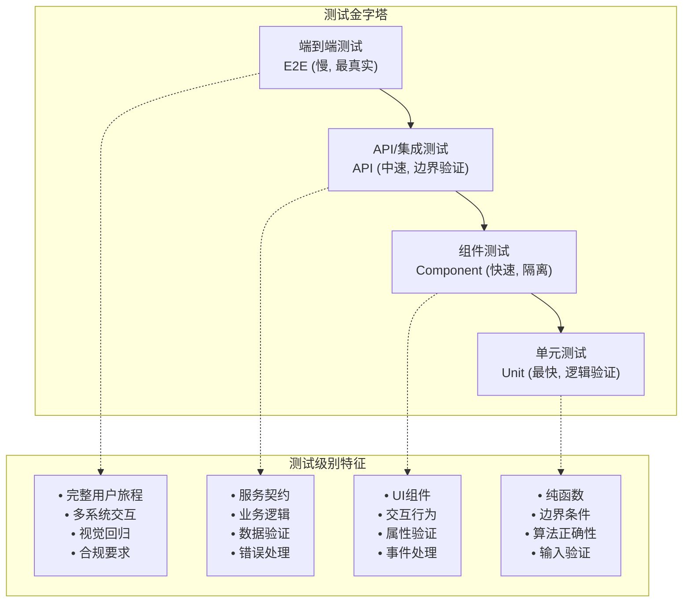

**图表来源**
- [test-levels-framework.md](file://src/modules/bmm/testarch/knowledge/test-levels-framework.md#L1-L100)

### 测试ID命名规范

系统采用统一的测试ID命名格式：
```
{EPIC}.{STORY}-{LEVEL}-{SEQ}
```

示例：
- `1.3-UNIT-001` - 单元测试
- `1.3-API-002` - API集成测试  
- `1.3-E2E-001` - 端到端测试

### 测试质量标准

追溯系统验证测试的五个关键质量维度：

1. **确定性** - 测试结果可预测且一致
2. **隔离性** - 测试独立运行，无副作用
3. **明确断言** - 包含显式的验证点
4. **长度限制** - 文件大小不超过300行
5. **时间限制** - 执行时间不超过90秒

**章节来源**
- [test-levels-framework.md](file://src/modules/bmm/testarch/knowledge/test-levels-framework.md#L140-L149)
- [instructions.md](file://src/modules/bmm/workflows/testarch/trace/instructions.md#L183-L206)

## 端到端追溯示例

### 从需求到测试的完整流程

以下是一个完整的追溯示例，展示如何从产品需求文档到自动化测试：

#### 需求阶段
```markdown
# 用户登录功能
## 接受标准
- P0: 用户可以使用有效凭据登录
- P0: 用户不能使用无效密码登录
- P1: 用户收到密码错误提示
- P2: 登录失败时记录审计日志
```

#### 测试设计阶段
基于需求，系统自动生成测试计划：

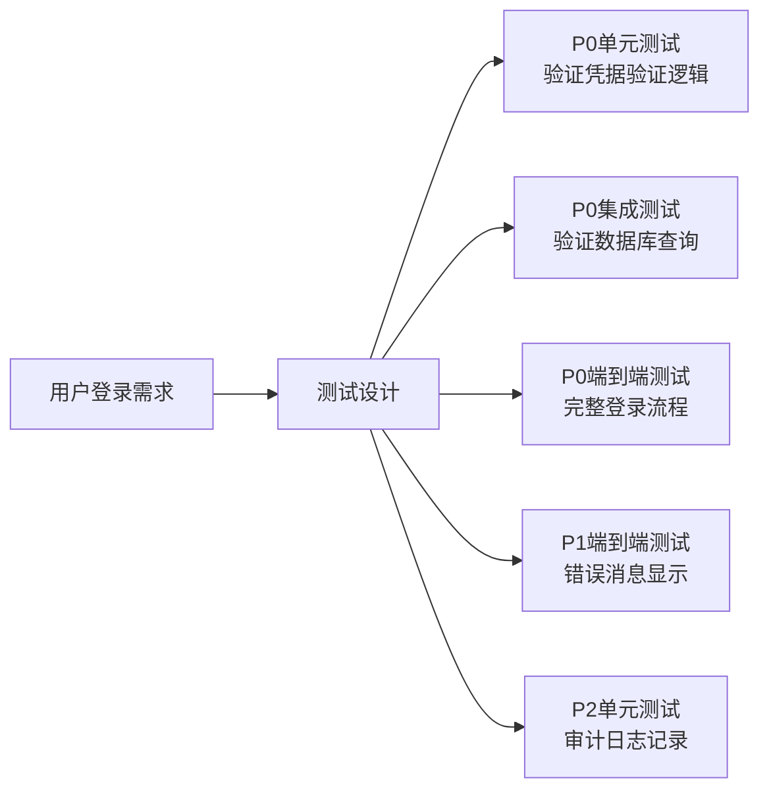

#### 测试执行阶段
追溯系统验证每个需求的测试覆盖：

| 需求ID | 描述 | 测试ID | 测试级别 | 覆盖状态 | 质量评分 |
|--------|------|--------|----------|----------|----------|
| AC-001 | 用户可以使用有效凭据登录 | 1.3-E2E-001 | E2E | FULL | ⭐⭐⭐⭐⭐ |
| AC-002 | 用户不能使用无效密码登录 | 1.3-UNIT-001 | Unit | FULL | ⭐⭐⭐⭐⭐ |
| AC-003 | 用户收到密码错误提示 | 1.3-E2E-002 | E2E | PARTIAL | ⭐⭐⭐ |
| AC-004 | 登录失败时记录审计日志 | 1.3-UNIT-002 | Unit | NONE | ❌❌❌❌❌ |

### 变更影响评估

当需求发生变更时，追溯系统能够：

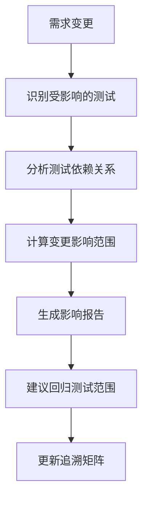

**图表来源**
- [instructions.md](file://src/modules/bmm/workflows/testarch/trace/instructions.md#L150-L180)

**章节来源**
- [instructions.md](file://src/modules/bmm/workflows/testarch/trace/instructions.md#L116-L180)
- [trace-template.md](file://src/modules/bmm/workflows/testarch/trace/trace-template.md#L50-L85)

## 追溯矩阵分析

### 覆盖率指标体系

追溯系统提供多层次的覆盖率指标：

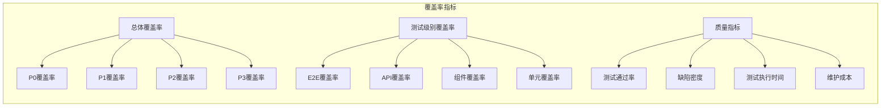

### 风险评估框架

系统基于概率-影响矩阵进行风险评估：

| 概率 \ 影响 | 低 | 中 | 高 |
|-------------|----|----|----|
| 低 | 低风险 | 中等风险 | 高风险 |
| 中 | 中等风险 | 高风险 | 极高风险 |
| 高 | 高风险 | 极高风险 | 严重风险 |

### 差距分析方法

追溯系统采用系统化的差距分析方法：

1. **识别差距**：列出所有未覆盖的需求
2. **优先级排序**：基于P0/P1/P2/P3框架分类
3. **影响评估**：分析未覆盖对业务的影响
4. **建议措施**：提供具体的测试添加建议

**章节来源**
- [instructions.md](file://src/modules/bmm/workflows/testarch/trace/instructions.md#L150-L180)
- [checklist.md](file://src/modules/bmm/workflows/testarch/trace/checklist.md#L90-L122)

## 项目进度跟踪

### 追溯数据的应用

追溯数据在项目进度跟踪中的关键应用：

#### 1. 测试覆盖率趋势分析
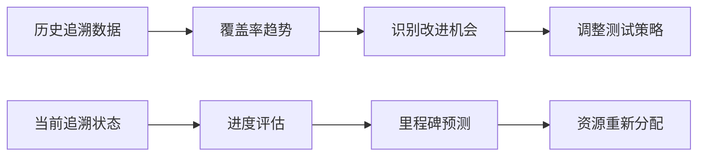

#### 2. 质量度量指标
- **需求覆盖率**：已测试需求占总需求的比例
- **测试质量指数**：基于测试质量标准的综合评分
- **回归风险**：新代码引入的潜在问题风险

#### 3. 团队绩效评估
- **测试设计效率**：单位时间内设计的测试数量
- **覆盖率提升速度**：测试覆盖率的增长趋势
- **质量改进效果**：缺陷密度的变化情况

### 自动化门禁集成

追溯系统支持与CI/CD流水线的深度集成：

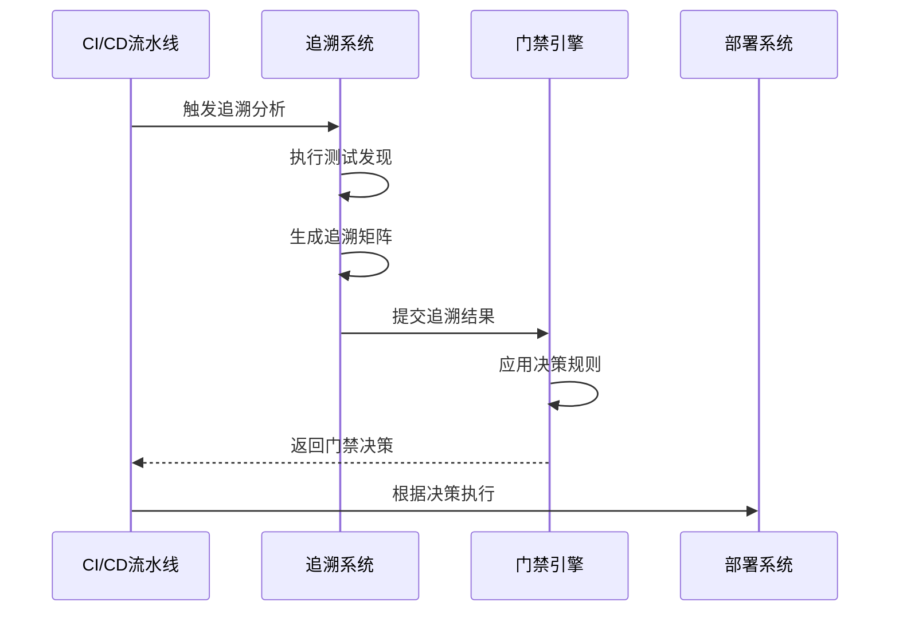

**图表来源**
- [instructions.md](file://src/modules/bmm/workflows/testarch/trace/instructions.md#L255-L306)

**章节来源**
- [instructions.md](file://src/modules/bmm/workflows/testarch/trace/instructions.md#L255-L306)
- [checklist.md](file://src/modules/bmm/workflows/testarch/trace/checklist.md#L404-L445)

## 故障排除指南

### 常见问题及解决方案

#### "找不到此故事的测试"
**原因**：测试文件命名不符合约定或测试目录路径错误
**解决方案**：
1. 运行`*atdd`工作流生成缺失的测试
2. 检查测试文件命名约定（可能不匹配故事ID模式）
3. 验证测试目录路径是否正确

#### "无法确定覆盖状态"
**原因**：测试缺乏对需求的显式映射（无测试ID，描述块不清晰）
**解决方案**：
1. 添加Given-When-Then叙事结构
2. 使用格式：`{STORY_ID}-{LEVEL}-{SEQ}`的测试ID（如1.3-E2E-001）

#### "P0覆盖率低于100%"
**原因**：关键功能测试缺失
**解决方案**：
1. 这是**阻塞器** - 不要发布
2. 在差距分析中识别缺失的P0测试
3. 运行`*atdd`工作流生成缺失测试
4. 与利益相关者确认P0分类是否正确

#### "检测到重复覆盖"
**原因**：相同验证在多个级别进行
**解决方案**：
1. 参考`selective-testing.md`中的选择性测试原则
2. 确定重叠是否可接受（防御深度）或浪费（多级别相同验证）
3. 在适当级别合并测试（逻辑→单元，集成→API，旅程→端到端）

### 配置验证清单

确保追溯工作流正常运行的关键配置：

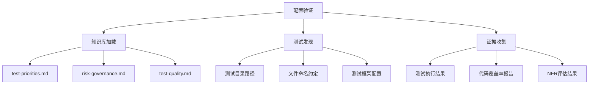

**图表来源**
- [checklist.md](file://src/modules/bmm/workflows/testarch/trace/checklist.md#L15-L50)

**章节来源**
- [instructions.md](file://src/modules/bmm/workflows/testarch/trace/instructions.md#L991-L1025)
- [checklist.md](file://src/modules/bmm/workflows/testarch/trace/checklist.md#L991-L1025)

## 最佳实践

### 追溯实施最佳实践

#### 1. 需求管理
- **明确性**：确保所有需求都是可测试的
- **完整性**：涵盖所有业务场景和边界条件
- **一致性**：使用统一的需求描述格式

#### 2. 测试设计
- **层次化**：遵循测试金字塔原则
- **独立性**：每个测试应该独立运行
- **可维护性**：使用清晰的测试ID和描述

#### 3. 质量保证
- **持续验证**：定期运行追溯分析
- **及时修复**：快速响应覆盖率下降
- **团队协作**：确保开发和测试团队的协同

#### 4. 工具集成
- **自动化**：尽可能自动化追溯过程
- **可视化**：使用图表和仪表板展示结果
- **报告**：生成详细的追溯报告用于决策

### 成功指标

衡量追溯系统成功的关键指标：

| 指标类别 | 具体指标 | 目标值 | 监控频率 |
|----------|----------|--------|----------|
| 覆盖率 | 总体覆盖率 | ≥90% | 每次发布前 |
| 质量 | 测试通过率 | ≥95% | 每日 |
| 效率 | 追溯分析时间 | <30分钟 | 每周 |
| 准确性 | 覆盖率准确率 | ≥95% | 每月 |

### 持续改进

追溯系统的持续改进应关注：

1. **技术债务管理**：定期重构追溯工具和算法
2. **流程优化**：简化追溯过程，提高效率
3. **团队培训**：确保团队成员理解追溯重要性
4. **工具增强**：集成新的分析和可视化工具

通过遵循这些最佳实践，组织可以建立一个强大而有效的需求-测试追溯系统，显著提高软件质量和交付效率。