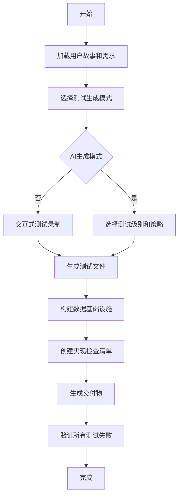
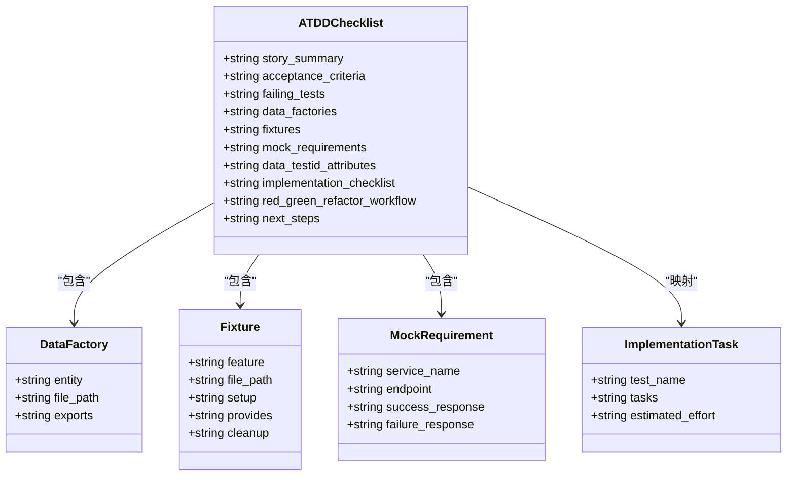
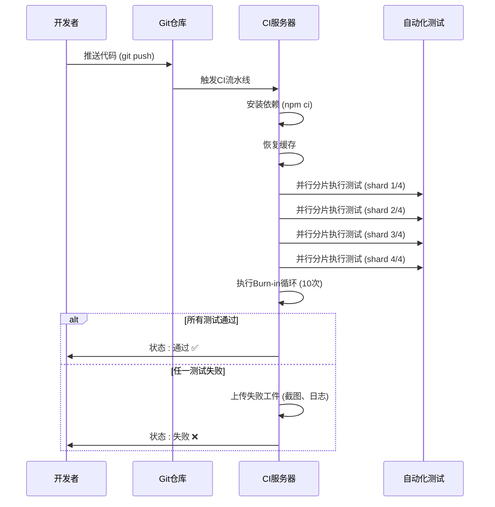

# 验收测试驱动开发(ATDD)

<cite>
**本文档引用的文件**  
- [atdd-checklist-template.md](file://src/modules/bmm/workflows/testarch/atdd/atdd-checklist-template.md)
- [workflow.yaml](file://src/modules/bmm/workflows/testarch/atdd/workflow.yaml)
- [checklist.md](file://src/modules/bmm/workflows/testarch/atdd/checklist.md)
- [instructions.md](file://src/modules/bmm/workflows/testarch/atdd/instructions.md)
- [ci/instructions.md](file://src/modules/bmm/workflows/testarch/ci/instructions.md)
- [ci/checklist.md](file://src/modules/bmm/workflows/testarch/ci/checklist.md)
- [ci-burn-in.md](file://src/modules/bmm/testarch/knowledge/ci-burn-in.md)
- [selective-testing.md](file://src/modules/bmm/testarch/knowledge/selective-testing.md)
</cite>

## 目录
1. [引言](#引言)
2. [ATDD工作流解析](#atdd工作流解析)
3. [ATDD检查清单模板](#atdd检查清单模板)
4. [协作会议与验收标准编写](#协作会议与验收标准编写)
5. [从用户故事到可执行测试的转化示例](#从用户故事到可执行测试的转化示例)
6. [ATDD与持续集成集成](#atdd与持续集成集成)
7. [ATDD实践价值](#atdd实践价值)
8. [结论](#结论)

## 引言

验收测试驱动开发（Acceptance Test-Driven Development, ATDD）是一种敏捷开发实践，它通过在开发开始前定义可执行的验收测试来促进业务、开发和测试三方的协作。ATDD的核心在于将业务需求转化为自动化测试，确保所有利益相关者对需求的理解一致，并为开发提供明确的目标。在BMAD-METHOD框架中，ATDD通过`testarch/atdd`工作流实现，该工作流自动生成失败的验收测试，遵循TDD的红-绿-重构循环，为开发团队提供清晰的实现路线图。

**Section sources**
- [instructions.md](file://src/modules/bmm/workflows/testarch/atdd/instructions.md#L10-L16)

## ATDD工作流解析

BMAD-METHOD中的ATDD工作流由`workflow.yaml`文件定义，它是一个系统化的流程，确保在开发开始前完成所有必要的测试准备工作。该工作流的核心是生成失败的验收测试（红阶段），然后指导开发团队实现功能使测试通过（绿阶段），最后进行代码重构。



**Diagram sources**
- [workflow.yaml](file://src/modules/bmm/workflows/testarch/atdd/workflow.yaml#L1-L48)
- [instructions.md](file://src/modules/bmm/workflows/testarch/atdd/instructions.md#L29-L606)

### 工作流关键步骤

1.  **加载用户故事和需求**：工作流首先读取用户故事的Markdown文件，提取验收标准，并加载测试框架配置。
2.  **选择测试生成模式**：系统支持两种模式：默认的AI生成模式和可选的交互式录制模式。AI生成模式适用于标准的CRUD、认证等场景；录制模式则用于复杂的UI交互，如拖放、多步骤表单等。
3.  **生成失败的测试**：根据验收标准，工作流生成遵循Given-When-Then格式的测试。测试分为E2E（端到端）、API和组件级别，并确保所有测试初始状态为失败。
4.  **构建数据基础设施**：创建数据工厂（使用`@faker-js/faker`生成随机数据）和测试夹具（带有自动清理功能），确保测试的独立性和可重复性。
5.  **创建实现检查清单**：生成一个详细的`atdd-checklist-{story_id}.md`文件，其中包含所有失败的测试、数据工厂、夹具、模拟要求、`data-testid`属性列表以及将每个测试映射到具体实现任务的清单。

**Section sources**
- [instructions.md](file://src/modules/bmm/workflows/testarch/atdd/instructions.md#L29-L386)
- [checklist.md](file://src/modules/bmm/workflows/testarch/atdd/checklist.md#L19-L296)

## ATDD检查清单模板

`atdd-checklist-template.md`是ATDD工作流生成的交付物模板，它为团队提供了一个标准化的文档结构，确保所有关键信息都被捕获。该模板不仅是一个文档，更是开发团队从红阶段到绿阶段的行动指南。



**Diagram sources**
- [atdd-checklist-template.md](file://src/modules/bmm/workflows/testarch/atdd/atdd-checklist-template.md#L1-L364)

### 模板核心部分

*   **故事摘要**：简要描述用户故事，明确角色、目标和业务价值。
*   **验收标准**：列出所有可测试的验收标准，这是测试的直接来源。
*   **失败的测试**：详细列出为E2E、API和组件级别创建的每个测试，确保它们处于“红”阶段。
*   **数据工厂和夹具**：提供创建测试数据的工具，确保测试不依赖硬编码数据，提高可维护性。
*   **实现检查清单**：这是最关键的协作部分。它将每个失败的测试分解为具体的实现任务（如创建路由、添加`data-testid`属性、实现业务逻辑等），并包含执行命令和预估工作量，为开发团队提供了清晰的路线图。

**Section sources**
- [atdd-checklist-template.md](file://src/modules/bmm/workflows/testarch/atdd/atdd-checklist-template.md#L1-L364)

## 协作会议与验收标准编写

ATDD的成功实施依赖于有效的协作。BMAD-METHOD框架通过结构化的会议和规范化的文档来促进业务、开发和测试三方的沟通。

### 协作会议组织

1.  **三方会议**：在用户故事进入开发队列前，组织由产品经理（业务代表）、开发人员和测试工程师（TEA代理）参加的会议。
2.  **需求澄清**：在会议上，共同审查用户故事，特别是验收标准。目标是确保所有参与者对“完成”的定义有完全一致的理解。
3.  **测试级别选择**：根据`test-levels-framework.md`知识库，讨论并确定每个验收标准最适合的测试级别（E2E、API或组件），避免不必要的重复测试。
4.  **启动ATDD工作流**：会议确认后，由TEA代理启动`testarch/atdd`工作流，自动生成检查清单和失败的测试。

### 验收标准编写规范

为了确保验收标准能够被有效转化为自动化测试，必须遵循以下规范：
*   **可测试性**：标准必须是明确的、可观察的，避免使用模糊的词汇如“用户友好”、“快速”。
*   **原子性**：每个标准应只描述一个独立的行为或结果。
*   **Given-When-Then格式**：在编写时就采用此格式，例如：“**Given** 用户已登录，**When** 用户点击‘登出’按钮，**Then** 用户应被重定向到登录页面”。

**Section sources**
- [instructions.md](file://src/modules/bmm/workflows/testarch/atdd/instructions.md#L198-L248)
- [checklist.md](file://src/modules/bmm/workflows/testarch/atdd/checklist.md#L38-L49)

## 从用户故事到可执行测试的转化示例

以下是一个将用户故事转化为可执行验收测试的完整示例。

### 用户故事
```
As a user
I want to log in with my email and password
So that I can access my private dashboard
```

### 验收标准
1.  当用户输入有效的邮箱和密码并提交时，应成功登录并重定向到仪表板。
2.  当用户输入无效的凭证时，应显示错误消息“无效的邮箱或密码”。

### 可执行测试脚本 (E2E)
```typescript
test('should display error for invalid credentials', async ({ page }) => {
  // GIVEN: User is on login page
  await page.goto('/login');

  // WHEN: User submits invalid credentials
  await page.fill('[data-testid="email-input"]', 'invalid@example.com');
  await page.fill('[data-testid="password-input"]', 'wrongpassword');
  await page.click('[data-testid="login-button"]');

  // THEN: Error message is displayed
  await expect(page.locator('[data-testid="error-message"]')).toHaveText('Invalid email or password');
});
```

### 实现检查清单片段
```markdown
### Test: should display error for invalid credentials

**Tasks to make this test pass:**
- [ ] 创建 `/login` 路由
- [ ] 实现登录表单组件
- [ ] 添加 `data-testid` 属性: `email-input`, `password-input`, `login-button`, `error-message`
- [ ] 实现错误状态管理并显示错误消息
- [ ] 运行测试: `npm run test:e2e -- login.spec.ts`
- [ ] ✅ 测试通过 (绿色阶段)
```

此示例清晰地展示了如何将业务语言（“显示错误消息”）转化为具体的、可执行的自动化测试脚本和开发任务。

**Section sources**
- [instructions.md](file://src/modules/bmm/workflows/testarch/atdd/instructions.md#L273-L294)
- [atdd-checklist-template.md](file://src/modules/bmm/workflows/testarch/atdd/atdd-checklist-template.md#L35-L59)

## ATDD与持续集成集成

ATDD的自动化测试是持续集成（CI）流程的核心。BMAD-METHOD通过`testarch/ci`工作流将ATDD测试无缝集成到CI/CD管道中，确保每次代码变更都能得到快速、可靠的验证。



**Diagram sources**
- [ci/instructions.md](file://src/modules/bmm/workflows/testarch/ci/instructions.md#L108-L114)
- [ci-burn-in.md](file://src/modules/bmm/testarch/knowledge/ci-burn-in.md#L5-L9)

### 关键集成策略

*   **并行分片 (Parallel Sharding)**：将测试套件分成多个分片（如4个），在CI服务器上并行运行，显著缩短反馈时间。
*   **Burn-in循环**：在合并到主分支前，将变更的测试运行多次（如10次），以检测和消除不稳定的“flaky”测试。
*   **智能缓存**：缓存Node模块和浏览器二进制文件，减少每次CI运行的安装时间。
*   **失败工件收集**：当测试失败时，自动上传截图、视频、日志等调试信息，便于快速定位问题。

**Section sources**
- [ci/instructions.md](file://src/modules/bmm/workflows/testarch/ci/instructions.md#L116-L168)
- [ci/checklist.md](file://src/modules/bmm/workflows/testarch/ci/checklist.md#L31-L45)
- [ci-burn-in.md](file://src/modules/bmm/testarch/knowledge/ci-burn-in.md#L1-L17)

## ATDD实践价值

实施ATDD为软件开发过程带来了显著的价值，主要体现在以下几个方面：

*   **减少需求误解**：通过三方协作会议和可执行的验收测试，确保了业务、开发和测试对需求的理解完全一致，从根本上减少了因沟通不畅导致的返工。
*   **提高软件质量**：在开发开始前就定义了全面的测试，确保了代码从一开始就是为满足需求而编写的。自动化测试提供了持续的质量保障。
*   **加速反馈循环**：开发人员可以立即运行自动化测试来验证他们的代码是否满足要求，无需等待手动测试，极大地缩短了开发-测试的反馈周期。
*   **促进团队协作**：ATDD打破了部门壁垒，让业务、开发和测试在项目的早期就紧密合作，共同对交付成果负责。
*   **提供活文档**：自动化测试本身就是系统行为的精确文档，它始终与代码保持同步，比静态文档更具价值。

**Section sources**
- [instructions.md](file://src/modules/bmm/workflows/testarch/atdd/instructions.md#L609-L629)

## 结论

验收测试驱动开发（ATDD）是BMAD-METHOD框架中确保软件质量与团队协作的核心实践。通过`testarch/atdd`工作流，它将模糊的业务需求转化为具体的、可执行的自动化测试，并生成详细的实现检查清单，为开发团队提供了清晰的行动指南。与`testarch/ci`工作流的集成，确保了这些测试能够在持续集成环境中高效运行，快速提供反馈。ATDD不仅是一种技术实践，更是一种促进业务、开发和测试三方深度协作的文化，它能有效减少误解、提高质量并加速交付，是现代敏捷开发不可或缺的一部分。