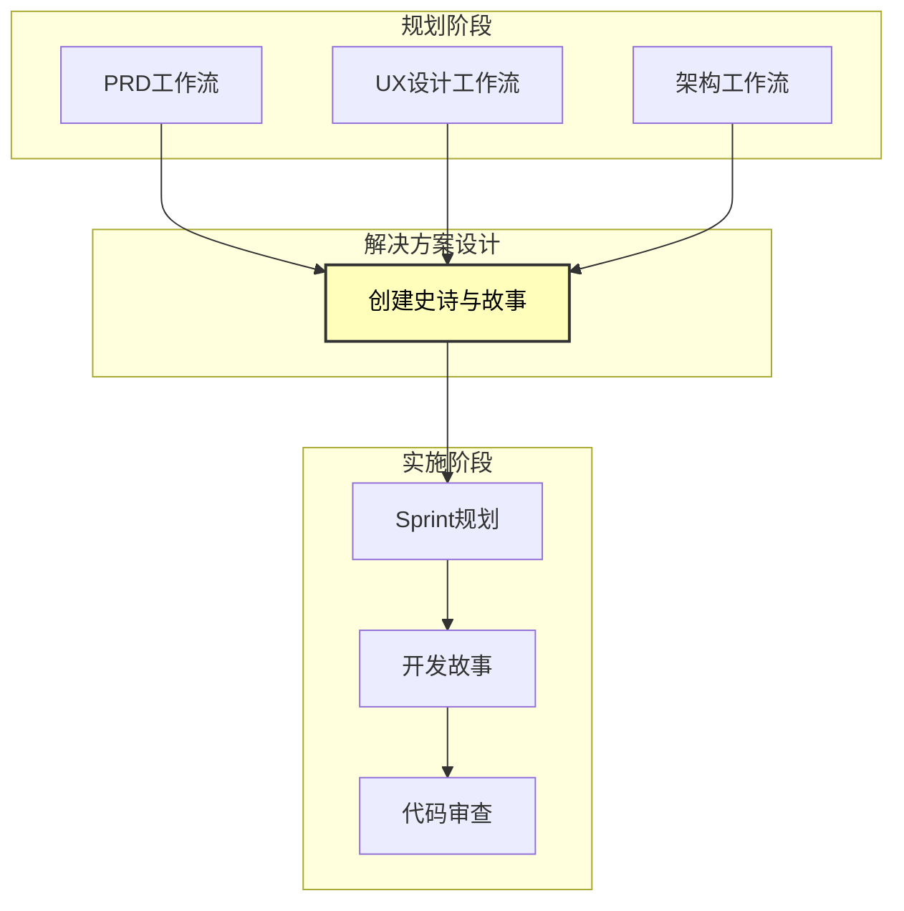
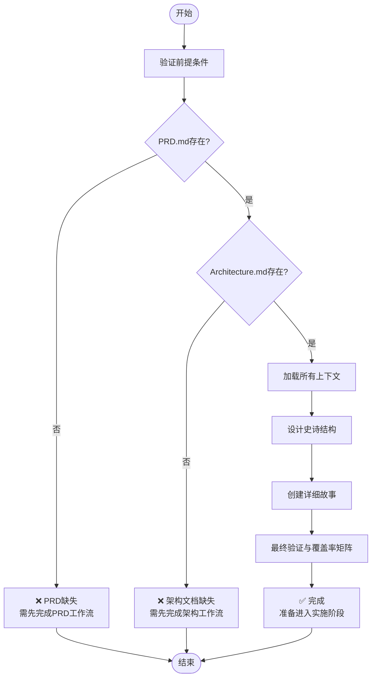
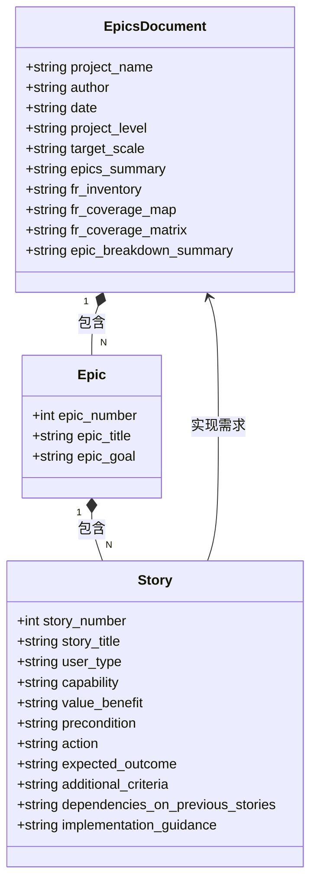
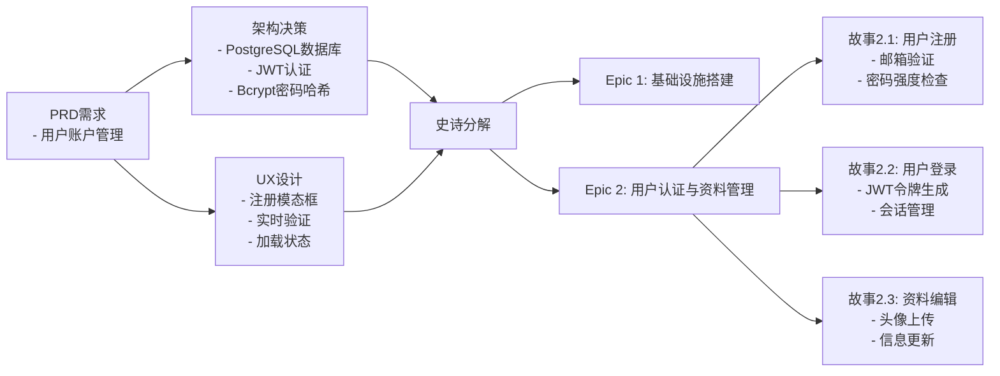
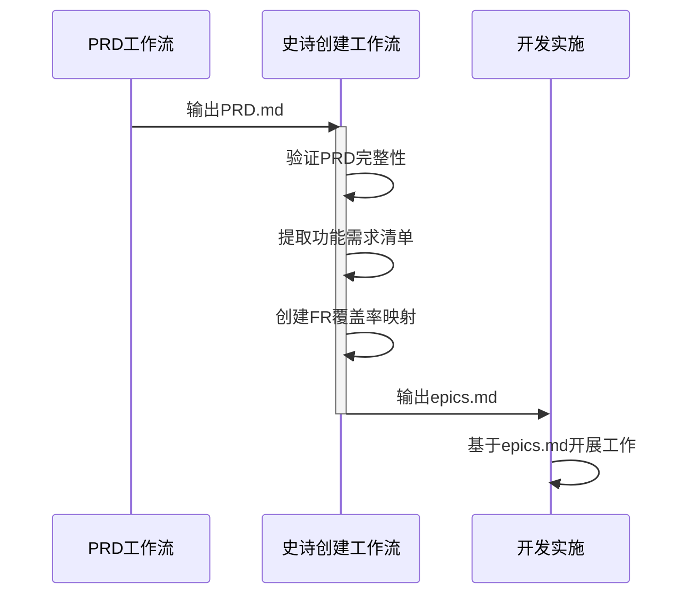
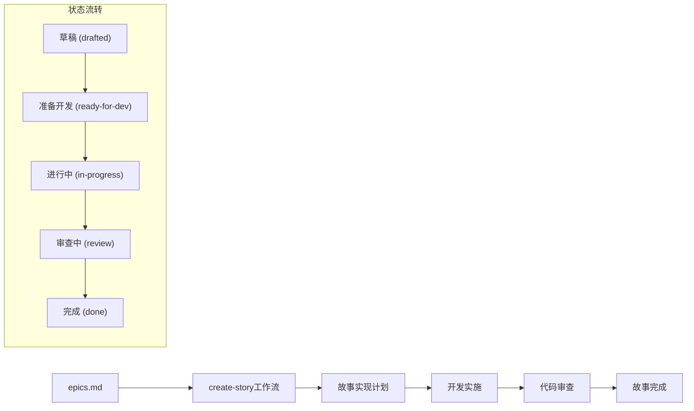
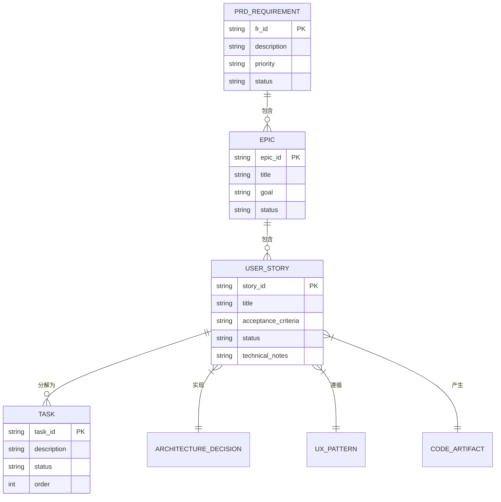

# 创建史诗与故事

<cite>
**本文档引用的文件**   
- [epics-template.md](file://src/modules/bmm/workflows/3-solutioning/create-epics-and-stories/epics-template.md)
- [instructions.md](file://src/modules/bmm/workflows/3-solutioning/create-epics-and-stories/instructions.md)
- [workflow.yaml](file://src/modules/bmm/workflows/3-solutioning/create-epics-and-stories/workflow.yaml)
- [prd-template.md](file://src/modules/bmm/workflows/2-plan-workflows/prd/prd-template.md)
- [create-story/template.md](file://src/modules/bmgd/workflows/4-production/create-story/template.md)
- [story-context/context-template.xml](file://src/modules/bmgd/workflows/4-production/story-context/context-template.xml)
- [sprint-planning/instructions.md](file://src/modules/bmm/workflows/4-implementation/sprint-planning/instructions.md)
</cite>

## 目录
1. [引言](#引言)
2. [工作流概述](#工作流概述)
3. [史诗与故事创建流程](#史诗与故事创建流程)
4. [史诗模板结构详解](#史诗模板结构详解)
5. [PRD到任务分解的转换示例](#prd到任务分解的转换示例)
6. [与PRD和实施阶段的衔接](#与prd和实施阶段的衔接)
7. [完整性与可追踪性保障](#完整性与可追踪性保障)
8. [优先级排序机制](#优先级排序机制)
9. [结论](#结论)

## 引言
本文档详细阐述了如何将产品需求文档（PRD）中的需求转化为可执行的开发任务，重点介绍史诗（Epics）与用户故事（Stories）的创建流程。该流程是BMAD方法论中从需求到实施的关键转换环节，确保产品愿景能够被准确、完整地转化为开发团队可执行的具体任务。

## 工作流概述
史诗与故事创建工作流是BMAD方法论中"解决方案设计"阶段的核心组成部分，位于PRD工作流之后、实施阶段之前。该工作流通过系统化的方法，将高层次的产品需求分解为具体的、可实施的开发任务。

**图示来源**
- [instructions.md](file://src/modules/bmm/workflows/3-solutioning/create-epics-and-stories/instructions.md#L1-L388)
- [workflow.yaml](file://src/modules/bmm/workflows/3-solutioning/create-epics-and-stories/workflow.yaml#L1-L54)

**本节来源**
- [instructions.md](file://src/modules/bmm/workflows/3-solutioning/create-epics-and-stories/instructions.md#L1-L388)
- [workflow.yaml](file://src/modules/bmm/workflows/3-solutioning/create-epics-and-stories/workflow.yaml#L1-L54)

## 史诗与故事创建流程
史诗与故事创建工作流遵循严格的三步流程，确保需求分解的完整性和质量。

### 流程步骤
1. **前提条件验证与上下文加载**：验证PRD.md和Architecture.md等必要文档已完成
2. **史诗结构设计**：基于完整上下文设计史诗结构，确保每个史诗都交付用户价值
3. **详细故事创建**：为每个史诗创建包含完整实现上下文的详细故事

**图示来源**
- [instructions.md](file://src/modules/bmm/workflows/3-solutioning/create-epics-and-stories/instructions.md#L18-L110)
- [workflow.yaml](file://src/modules/bmm/workflows/3-solutioning/create-epics-and-stories/workflow.yaml#L18-L33)

**本节来源**
- [instructions.md](file://src/modules/bmm/workflows/3-solutioning/create-epics-and-stories/instructions.md#L1-L388)

## 史诗模板结构详解
epics-template.md文件定义了史诗文档的结构化格式和内容要求，确保所有史诗和故事的一致性和完整性。

### 模板核心组件

**图示来源**
- [epics-template.md](file://src/modules/bmm/workflows/3-solutioning/create-epics-and-stories/epics-template.md#L1-L81)
- [instructions.md](file://src/modules/bmm/workflows/3-solutioning/create-epics-and-stories/instructions.md#L174-L300)

**本节来源**
- [epics-template.md](file://src/modules/bmm/workflows/3-solutioning/create-epics-and-stories/epics-template.md#L1-L81)

### 关键字段说明
- **项目名称**（project_name）：项目的唯一标识
- **作者**（user_name）：创建文档的人员
- **日期**（date）：文档创建日期
- **功能需求清单**（fr_inventory）：从PRD提取的所有功能需求
- **FR覆盖率映射**（fr_coverage_map）：功能需求到史诗的映射关系
- **用户故事格式**：采用"As a... I want... So that..."的标准格式
- **验收标准**：采用BDD（行为驱动开发）格式，包含完整的实现细节

## PRD到任务分解的转换示例
以下示例展示了一个从PRD需求到史诗与故事的完整转换过程。

### 示例场景：用户账户系统
假设PRD中包含以下功能需求：
- FR1：用户可以创建账户
- FR2：用户可以登录系统
- FR3：用户可以管理个人资料

#### 转换过程

**图示来源**
- [instructions.md](file://src/modules/bmm/workflows/3-solutioning/create-epics-and-stories/instructions.md#L189-L191)
- [epics-template.md](file://src/modules/bmm/workflows/3-solutioning/create-epics-and-stories/epics-template.md#L40-L57)

**本节来源**
- [instructions.md](file://src/modules/bmm/workflows/3-solutioning/create-epics-and-stories/instructions.md#L1-L388)
- [epics-template.md](file://src/modules/bmm/workflows/3-solutioning/create-epics-and-stories/epics-template.md#L1-L81)

### 实际故事示例
根据模板，"用户注册"功能将被分解为如下故事：

**故事2.1：用户注册**

作为新用户，我希望使用邮箱创建账户，以便访问平台功能。

**验收标准：**
- 给定我在登录页面
- 当我点击"注册"按钮
- 那么注册模态框打开
- 并且我看到邮箱和密码输入字段
- 并且邮箱字段实时验证RFC 5322格式
- 当我提交有效注册数据
- 那么调用POST /api/v1/auth/register
- 并且用户记录创建于users表中，密码使用bcrypt哈希
- 并且通过SendGrid发送验证邮件

**技术说明：**
- 使用PostgreSQL users表（架构文档6.2节）
- 实现速率限制：每小时每IP 3次尝试
- 成功验证后返回JWT令牌

## 与PRD和实施阶段的衔接
史诗与故事创建工作流在BMAD方法论中起到了承上启下的关键作用，确保需求到开发的平滑过渡。

### 与PRD工作流的衔接

**图示来源**
- [instructions.md](file://src/modules/bmm/workflows/3-solutioning/create-epics-and-stories/instructions.md#L23-L29)
- [workflow.yaml](file://src/modules/bmm/workflows/3-solutioning/create-epics-and-stories/workflow.yaml#L19-L23)

**本节来源**
- [instructions.md](file://src/modules/bmm/workflows/3-solutioning/create-epics-and-stories/instructions.md#L1-L388)

### 与实施阶段的衔接
史诗与故事文档直接作为实施阶段的输入，通过create-story工作流生成具体实施计划。

**图示来源**
- [create-story/template.md](file://src/modules/bmgd/workflows/4-production/create-story/template.md#L1-L52)
- [sprint-planning/instructions.md](file://src/modules/bmm/workflows/4-implementation/sprint-planning/instructions.md#L219-L235)

**本节来源**
- [create-story/template.md](file://src/modules/bmgd/workflows/4-production/create-story/template.md#L1-L52)
- [story-context/context-template.xml](file://src/modules/bmgd/workflows/4-production/story-context/context-template.xml#L1-L35)

## 完整性与可追踪性保障
该工作流通过多种机制确保任务分解的完整性和可追踪性。

### 完整性验证机制
- **功能需求覆盖率矩阵**：确保每个PRD中的功能需求都被映射到至少一个故事
- **架构决策整合验证**：验证所有架构决策都在故事中得到实施
- **用户体验模式验证**：确保UX设计模式在故事中得到体现
- **故事质量验证**：检查故事是否可由单个开发代理在一个专注会话中完成

### 可追踪性实现
- **双向追踪**：从PRD需求到具体故事，以及从故事回溯到原始需求
- **上下文引用**：在故事中明确引用PRD、架构和UX设计文档的相关部分
- **状态管理**：通过sprint-status文件跟踪每个故事的生命周期状态
- **变更影响分析**：当PRD变更时，能够快速识别受影响的史诗和故事

**图示来源**
- [instructions.md](file://src/modules/bmm/workflows/3-solutioning/create-epics-and-stories/instructions.md#L303-L353)
- [story-context/context-template.xml](file://src/modules/bmgd/workflows/4-production/story-context/context-template.xml#L1-L35)

**本节来源**
- [instructions.md](file://src/modules/bmm/workflows/3-solutioning/create-epics-and-stories/instructions.md#L303-L385)
- [story-context/context-template.xml](file://src/modules/bmgd/workflows/4-production/story-context/context-template.xml#L1-L35)

## 优先级排序机制
史诗与故事的优先级排序遵循用户价值递增的原则，确保产品能够快速交付核心价值。

### 优先级排序原则
1. **用户价值优先**：每个史诗都应交付可感知的用户价值
2. **基础先行**：第一个史诗通常包含技术基础设置
3. **逻辑依赖**：后续史诗依赖于前面史诗的成果
4. **增量交付**：每个史诗都应在前一个史诗的基础上增加新的用户功能

### 排序示例
| 史诗编号 | 史诗标题 | 用户价值 | 依赖关系 |
|---------|--------|--------|--------|
| 1 | 基础设施搭建 | 为系统运行提供基础 | 无 |
| 2 | 用户认证与资料管理 | 用户可以注册和登录 | 依赖史诗1 |
| 3 | 内容创建与管理 | 用户可以创建和管理内容 | 依赖史诗2 |
| 4 | 内容发现与互动 | 用户可以浏览和互动内容 | 依赖史诗3 |

**本节来源**
- [instructions.md](file://src/modules/bmm/workflows/3-solutioning/create-epics-and-stories/instructions.md#L119-L123)
- [instructions.md](file://src/modules/bmm/workflows/3-solutioning/create-epics-and-stories/instructions.md#L134-L137)

## 结论
史诗与故事创建工作流是BMAD方法论中连接产品愿景与技术实现的关键桥梁。通过系统化的方法，该工作流确保了：
- PRD需求被完整、准确地转化为可执行的开发任务
- 每个史诗都交付真实的用户价值，而非仅仅是技术能力
- 故事包含完整的实现上下文，包括PRD需求、架构决策和UX设计
- 任务分解具有完整的可追踪性，从需求到代码的每个环节都可追溯
- 优先级排序遵循用户价值递增的原则，支持增量交付

该工作流与PRD工作流和实施阶段工作流无缝衔接，形成了从需求到实现的完整闭环，确保了产品开发的高效性和质量。