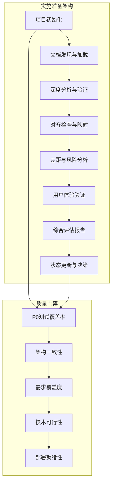
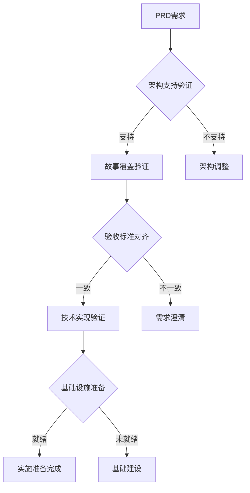
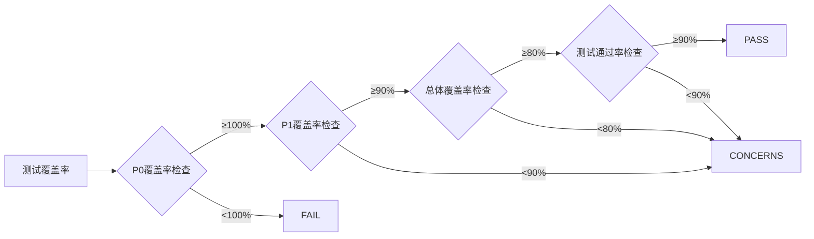
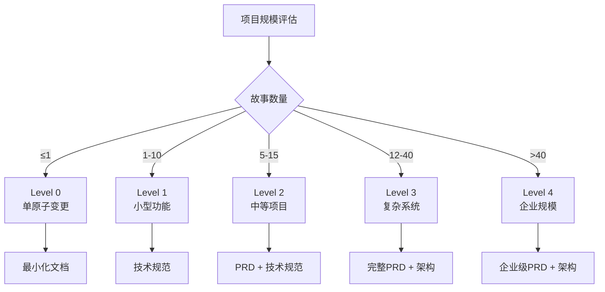
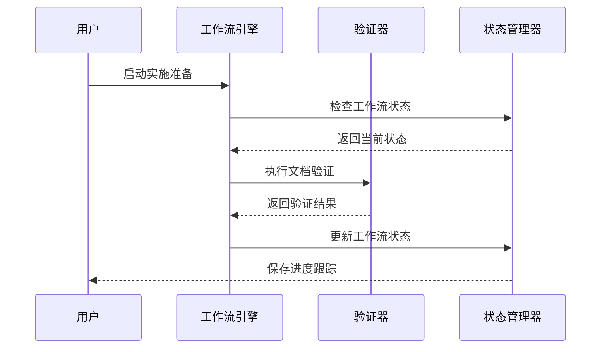

# 实施准备

<cite>
**本文档中引用的文件**
- [checklist.md](file://src/modules/bmm/workflows/3-solutioning/implementation-readiness/checklist.md)
- [template.md](file://src/modules/bmm/workflows/3-solutioning/implementation-readiness/template.md)
- [instructions.md](file://src/modules/bmm/workflows/3-solutioning/implementation-readiness/instructions.md)
- [project-levels.yaml](file://src/modules/bmm/workflows/workflow-status/project-levels.yaml)
- [game-checklist.md](file://src/modules/bmgd/workflows/3-technical/game-architecture/checklist.md)
- [document-checklist.md](file://src/modules/bmm/workflows/document-project/checklist.md)
- [trace-checklist.md](file://src/modules/bmm/workflows/testarch/trace/checklist.md)
- [trace-instructions.md](file://src/modules/bmm/workflows/testarch/trace/instructions.md)
</cite>

## 目录
1. [概述](#概述)
2. [项目结构与工作流](#项目结构与工作流)
3. [实施准备检查清单详解](#实施准备检查清单详解)
4. [质量门禁机制](#质量门禁机制)
5. [项目规模分类与适配](#项目规模分类与适配)
6. [工作流执行流程](#工作流执行流程)
7. [实际案例分析](#实际案例分析)
8. [最佳实践指南](#最佳实践指南)
9. [故障排除与优化](#故障排除与优化)
10. [总结](#总结)

## 概述

BMAD方法论的实施准备阶段是确保项目具备充分开发条件的关键环节。该阶段通过系统化的检查清单、质量门禁和工作流验证，确保项目从解决方案阶段顺利过渡到实现阶段。实施准备不仅关注技术栈和环境配置，更强调文档完整性、架构一致性、风险评估和资源可用性。

实施准备的核心目标是：
- 验证项目文档的完整性和质量
- 确保架构设计的可实施性
- 识别和解决潜在的技术风险
- 建立清晰的项目状态跟踪机制
- 提供可操作的改进建议

## 项目结构与工作流

BMAD方法论采用模块化架构，每个模块都包含专门的实施准备工作流。核心组件包括：

**图表来源**
- [instructions.md](file://src/modules/bmm/workflows/3-solutioning/implementation-readiness/instructions.md#L1-L50)

**章节来源**
- [instructions.md](file://src/modules/bmm/workflows/3-solutioning/implementation-readiness/instructions.md#L1-L333)

## 实施准备检查清单详解

### 文档完整性验证

实施准备的核心是确保所有关键文档的存在和质量。检查清单涵盖了从PRD到技术规范的完整文档链路：

#### 核心规划文档
- **PRD（产品需求文档）**：必须包含可测量的成功标准和明确的范围边界
- **架构文档**：涵盖系统设计决策和技术栈选择
- **技术规范**：提供详细的实现指导
- **史诗和故事分解**：将需求细化为可执行的任务

#### 文档质量标准
- 无占位符内容残留
- 技术决策包含充分的权衡分析
- 明确记录假设和风险
- 清晰识别外部依赖

### 对齐验证机制

**图表来源**
- [checklist.md](file://src/modules/bmm/workflows/3-solutioning/implementation-readiness/checklist.md#L25-L42)

### 故事质量和序列化

检查清单特别关注用户故事的质量和逻辑顺序：

#### 故事完整性要求
- 清晰的验收标准
- 明确定义的完成条件
- 包含错误处理和边缘情况
- 适当的工作量大小（避免史诗级故事）

#### 序列化和依赖关系
- 逻辑上正确的实施顺序
- 明确的故事间依赖关系
- 无循环依赖
- 基础设施故事优先于功能故事

**章节来源**
- [checklist.md](file://src/modules/bmm/workflows/3-solutioning/implementation-readiness/checklist.md#L1-L170)

## 质量门禁机制

BMAD方法论实现了多层次的质量门禁系统，确保只有达到特定标准的项目才能进入下一阶段。

### 测试架构质量门禁

测试架构工作流提供了严格的门禁标准：

#### 决策规则体系
- **PASS**：满足所有关键指标阈值
- **CONCERNS**：轻微差距但不影响部署
- **FAIL**：严重问题需要修复
- **WAIVED**：特殊情况下业务批准的豁免

#### 关键指标阈值
- P0覆盖率 ≥ 100%（关键路径必须完全测试）
- P1覆盖率 ≥ 90%（重要功能测试覆盖率）
- 总体覆盖率 ≥ 80%（整体测试覆盖）
- 测试通过率 ≥ 90%（质量保证）

**图表来源**
- [trace-instructions.md](file://src/modules/bmm/workflows/testarch/trace/instructions.md#L314-L344)

### 架构文档质量门禁

游戏架构工作流专注于架构文档本身的完整性和可实施性：

#### 决策完整性
- 所有关键决策类别均已解决
- 无待定事项或占位符文本
- 可选决策已明确记录理由

#### 版本特异性
- 每个技术选择都有具体版本号
- 版本经过Web搜索验证
- 兼容性得到确认

**章节来源**
- [trace-instructions.md](file://src/modules/bmm/workflows/testarch/trace/instructions.md#L314-L705)
- [game-checklist.md](file://src/modules/bmgd/workflows/3-technical/game-architecture/checklist.md#L1-L241)

## 项目规模分类与适配

BMAD方法论根据项目复杂度和规模提供不同的实施策略。

### 项目级别定义

| 级别 | 名称 | 故事数量 | 描述 | 文档要求 | 架构需求 |
|------|------|----------|------|----------|----------|
| 0 | 单原子变更 | 1个故事 | 错误修复、小功能 | 最小化 - 仅技术规范 | 否 |
| 1 | 小型功能 | 1-10个故事 | 小型连贯功能 | 技术规范 | 否 |
| 2 | 中等项目 | 5-15个故事 | 多个功能、聚焦PRD | PRD + 可选技术规范 | 否 |
| 3 | 复杂系统 | 12-40个故事 | 子系统、集成、完整架构 | PRD + 架构 + JIT技术规范 | 是 |
| 4 | 企业规模 | 40+个故事 | 多产品、企业架构 | PRD + 架构 + JIT技术规范 | 是 |

### 规模适配策略

**图表来源**
- [project-levels.yaml](file://src/modules/bmm/workflows/workflow-status/project-levels.yaml#L1-L60)

**章节来源**
- [project-levels.yaml](file://src/modules/bmm/workflows/workflow-status/project-levels.yaml#L1-L60)

## 工作流执行流程

实施准备工作流遵循严格的执行顺序和质量控制机制。

### 工作流状态管理

**图表来源**
- [instructions.md](file://src/modules/bmm/workflows/3-solutioning/implementation-readiness/instructions.md#L12-L85)

### 检查点协议

每个步骤完成后都必须执行检查点协议：

1. **内容保存**：立即保存生成的内容到文件
2. **检查点分隔符**：显示分隔线标记
3. **内容展示**：显示生成的内容
4. **选项呈现**：提供继续、高级提取、派对模式或YOLO模式的选择

### 自动化与人工验证结合

工作流采用自动化扫描与人工验证相结合的方式：

- **自动化扫描**：快速检测文档完整性、格式规范
- **人工深度验证**：对关键决策和架构设计进行专家评审
- **交叉验证**：多个维度验证文档的一致性

**章节来源**
- [instructions.md](file://src/modules/bmm/workflows/3-solutioning/implementation-readiness/instructions.md#L1-L333)

## 实际案例分析

### 案例1：Level 3 复杂系统项目

某电商平台升级项目属于Level 3复杂系统，包含以下特点：

#### 准备要求
- 完整的产品需求文档
- 微服务架构设计文档
- 数据迁移计划
- 性能基准测试方案

#### 检查清单应用
- 验证PRD中所有功能需求都有对应的架构支持
- 确保数据库迁移故事覆盖所有数据模型变更
- 检查API网关和认证授权机制的实现计划
- 验证监控和可观测性方案的完整性

#### 结果
项目通过实施准备检查，识别出3个关键差距：
1. 缺少缓存层设计
2. 数据库索引优化计划缺失
3. 异步消息队列配置不完整

这些问题在进入开发阶段前得到解决，确保了后续开发的顺利进行。

### 案例2：Level 1 小型功能项目

某内部工具的小功能增强属于Level 1项目：

#### 准备要求
- 技术规范文档
- 用户界面原型
- 基本的API设计

#### 检查清单应用
- 验证技术规范的完整性和准确性
- 确认用户界面设计符合现有风格指南
- 检查API设计的向后兼容性

#### 结果
项目通过快速验证流程，在2天内完成实施准备，直接进入开发阶段。

### 案例3：Level 4 企业规模项目

某大型企业的数字化转型项目属于Level 4：

#### 准备要求
- 企业级PRD文档
- 多租户架构设计
- 数据安全合规方案
- 跨部门协调机制

#### 检查清单应用
- 验证多租户架构的可行性和安全性
- 确保数据合规性要求得到满足
- 检查跨部门沟通和协作流程
- 评估技术栈的长期维护性

**章节来源**
- [project-levels.yaml](file://src/modules/bmm/workflows/workflow-status/project-levels.yaml#L1-L60)

## 最佳实践指南

### 文档准备最佳实践

#### PRD编写指南
- 使用SMART原则定义成功标准
- 明确范围边界和排除项
- 包含业务价值和ROI分析
- 建立需求优先级矩阵

#### 架构文档指南
- 采用标准架构模式
- 明确技术决策的权衡
- 提供具体的实现指导
- 包含风险缓解措施

### 团队协作最佳实践

#### 跨职能团队参与
- 产品负责人全程参与需求验证
- 架构师主导技术方案评审
- 开发团队参与可行性评估
- 运维团队提供部署经验

#### 沟通机制
- 建立定期的状态同步会议
- 使用共享文档跟踪进展
- 建立问题升级和决策机制
- 维护知识库和经验分享

### 质量保证最佳实践

#### 检查清单使用
- 制定项目特定的补充检查项
- 建立定期的文档审查机制
- 实施渐进式验证策略
- 维护历史检查结果对比

#### 风险管理
- 建立风险登记册
- 制定风险缓解计划
- 建立风险监控机制
- 准备应急响应预案

## 故障排除与优化

### 常见问题及解决方案

#### 文档缺失问题
**问题**：关键文档未找到或内容不完整
**解决方案**：
- 使用文档发现机制重新扫描项目
- 联系相关团队成员获取缺失文档
- 创建临时文档模板填补空白
- 建立文档收集的标准流程

#### 对齐验证失败
**问题**：PRD与架构文档不一致
**解决方案**：
- 重新梳理需求和架构设计
- 组织跨职能团队讨论会
- 更新相关文档保持一致
- 建立文档版本控制机制

#### 技术栈兼容性问题
**问题**：选定技术栈存在兼容性风险
**解决方案**：
- 进行技术栈验证测试
- 寻求技术专家咨询
- 考虑替代技术方案
- 制定技术债务管理计划

### 性能优化建议

#### 工作流执行优化
- 并行处理多个文档的验证
- 缓存中间结果减少重复计算
- 优化内存使用避免大文件处理
- 实现增量验证机制

#### 检查清单优化
- 根据项目类型定制检查项
- 建立检查项优先级体系
- 实现智能推荐功能
- 添加自定义标签和过滤

**章节来源**
- [document-checklist.md](file://src/modules/bmm/workflows/document-project/checklist.md#L1-L246)

## 总结

BMAD方法论的实施准备阶段通过系统化的方法和严格的质量控制，确保项目具备充分的开发条件。该阶段的核心价值在于：

### 关键收益

1. **降低项目风险**：通过全面的检查和验证，提前识别和解决潜在问题
2. **提高交付质量**：建立标准化的文档和流程，确保项目质量一致性
3. **优化资源配置**：明确项目需求和约束，合理分配开发资源
4. **加速项目推进**：建立清晰的里程碑和决策点，加快项目进度

### 实施要点

- **文档驱动**：以完整的文档为基础进行决策和验证
- **质量优先**：坚持高标准的质量要求，不妥协于短期进度
- **持续改进**：根据项目反馈不断优化检查清单和工作流程
- **团队协作**：建立跨职能团队的协同工作机制

### 未来发展方向

随着AI技术的发展，实施准备阶段将进一步智能化：
- 自动化文档生成和验证
- 智能风险预测和评估
- 自适应的检查清单生成
- 基于历史数据的决策支持

实施准备作为BMAD方法论的重要组成部分，为项目的成功奠定了坚实的基础。通过持续的实践和完善，这一机制将为企业数字化转型提供强有力的支持。