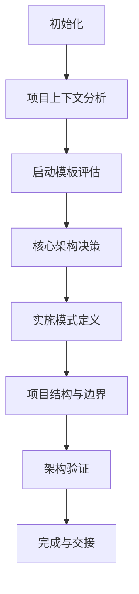
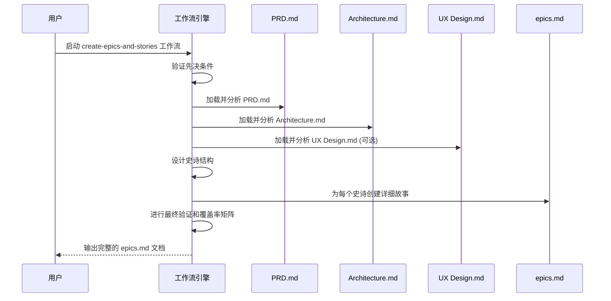
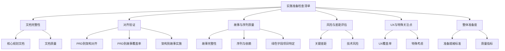
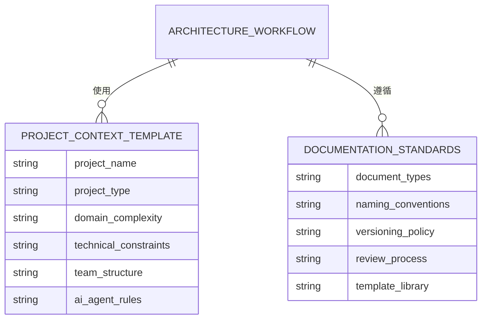

# 解决方案阶段

<cite>
**本文档中引用的文件**  
- [architecture.md](file://src/modules/bmm/workflows/3-solutioning/architecture/workflow.md)
- [architecture-decision-template.md](file://src/modules/bmm/workflows/3-solutioning/architecture/architecture-decision-template.md)
- [step-01-init.md](file://src/modules/bmm/workflows/3-solutioning/architecture/steps/step-01-init.md)
- [step-02-context.md](file://src/modules/bmm/workflows/3-solutioning/architecture/steps/step-02-context.md)
- [step-04-decisions.md](file://src/modules/bmm/workflows/3-solutioning/architecture/steps/step-04-decisions.md)
- [step-06-structure.md](file://src/modules/bmm/workflows/3-solutioning/architecture/steps/step-06-structure.md)
- [step-08-complete.md](file://src/modules/bmm/workflows/3-solutioning/architecture/steps/step-08-complete.md)
- [create-epics-and-stories/instructions.md](file://src/modules/bmm/workflows/3-solutioning/create-epics-and-stories/instructions.md)
- [implementation-readiness/checklist.md](file://src/modules/bmm/workflows/3-solutioning/implementation-readiness/checklist.md)
- [data/project-context-template.md](file://src/modules/bmm/data/project-context-template.md)
- [data/documentation-standards.md](file://src/modules/bmm/data/documentation-standards.md)
</cite>

## 目录
1. [引言](#引言)
2. [架构设计工作流](#架构设计工作流)
3. [史诗故事创建工作流](#史诗故事创建工作流)
4. [实施准备检查清单](#实施准备检查清单)
5. [输出规范与模板](#输出规范与模板)
6. [域复杂性与项目类型数据集成](#域复杂性与项目类型数据集成)
7. [解决方案阶段的交付成果](#解决方案阶段的交付成果)

## 引言

解决方案阶段是连接产品需求与开发实现的关键桥梁。该阶段通过三个核心工作流——架构设计、史诗故事创建和实施准备，将PRD（产品需求文档）转化为可执行的技术方案和开发任务。本阶段采用结构化、协作式的方法，确保技术决策的完整性、一致性，并为AI代理提供清晰的实施指导。通过微文件架构和逐步发现机制，解决方案阶段实现了技术决策的透明化和可追溯性，为后续的实现阶段奠定了坚实基础。

## 架构设计工作流

架构设计工作流通过8个步骤完成技术决策、架构模式选择和系统结构设计。该工作流采用微文件架构，每个步骤都是一个独立的文件，包含嵌入式规则，确保执行的纪律性。工作流强调协作式决策，将架构师与领域专家置于平等地位，共同做出防止实施冲突的决策。

### 架构决策的8步流程



**图示来源**  
- [workflow.md](file://src/modules/bmm/workflows/3-solutioning/architecture/workflow.md#L1-L49)
- [step-01-init.md](file://src/modules/bmm/workflows/3-solutioning/architecture/steps/step-01-init.md#L1-L195)

#### 步骤1：初始化
初始化阶段负责检测现有工作流状态、发现输入文档并设置文档。该步骤首先检查`architecture.md`文件是否存在，若存在则进入续期模式，否则进行全新工作流设置。通过智能发现机制，系统会优先查找分片文档，然后是主文档，确保获取最完整的上下文。

**本节来源**  
- [step-01-init.md](file://src/modules/bmm/workflows/3-solutioning/architecture/steps/step-01-init.md#L1-L195)

#### 步骤2：项目上下文分析
此步骤深入分析已加载的项目文档，理解架构范围、需求和约束。它从PRD中提取功能需求（FRs）和非功能需求（NFRs），从史诗故事中映射用户故事到架构组件，并从UX设计中提取技术含义。分析完成后，会生成项目上下文分析内容，并提供高级探索（A）、派对模式（P）或继续（C）的选项。

**本节来源**  
- [step-02-context.md](file://src/modules/bmm/workflows/3-solutioning/architecture/steps/step-02-context.md#L1-L224)

#### 步骤3：启动模板评估
该步骤评估并选择合适的启动模板，为项目提供生产就绪的基础。它会根据项目类型（绿色字段、棕色字段、迁移）推荐最佳模板，并验证模板的技术决策是否符合项目需求。

#### 步骤4：核心架构决策
这是工作流的核心环节，通过协作方式做出关键架构决策。决策分为五个优先级类别：数据架构、认证与安全、API与通信、前端架构（如适用）以及基础设施与部署。对于每个决策，系统会根据用户技能水平提供不同深度的解释，并使用WebSearch验证技术版本。

**本节来源**  
- [step-04-decisions.md](file://src/modules/bmm/workflows/3-solutioning/architecture/steps/step-04-decisions.md#L1-L318)

#### 步骤5：实施模式定义
此步骤定义实施模式和一致性规则，确保AI代理在实现时保持一致。它会记录所有决策的版本、理由和影响范围，并识别决策之间的级联影响。

#### 步骤6：项目结构与边界
该步骤定义完整的项目结构和架构边界。它会生成一个详尽的项目树，映射需求到具体的文件和目录，并定义API、组件、服务和数据边界。此步骤确保项目结构与所选技术栈对齐。

**本节来源**  
- [step-06-structure.md](file://src/modules/bmm/workflows/3-solutioning/architecture/steps/step-06-structure.md#L1-L379)

#### 步骤7：架构验证
此步骤验证架构的连贯性和完整性。它会检查所有决策是否协同工作，无冲突，技术选择是否兼容，模式是否支持架构决策，结构是否与所有选择对齐。

#### 步骤8：完成与交接
作为最终步骤，该阶段提供完整的架构交付物总结，并指导用户进入下一阶段。它会生成一个包含所有架构决策、实施模式和项目结构的综合文档，并提供清晰的实施指导。

**本节来源**  
- [step-08-complete.md](file://src/modules/bmm/workflows/3-solutioning/architecture/steps/step-08-complete.md#L1-L352)

## 史诗故事创建工作流

`create-epics-and-stories`工作流将PRD需求转化为可执行的开发任务。该工作流严格依赖于PRD.md和Architecture.md的完成，确保故事创建时具备完整的上下文。

### 工作流执行流程



**图示来源**  
- [instructions.md](file://src/modules/bmm/workflows/3-solutioning/create-epics-and-stories/instructions.md#L1-L388)

#### 先决条件验证
工作流首先验证PRD.md和Architecture.md是否已完成。缺少任一文档，工作流将无法继续。UX Design.md虽非必需，但强烈推荐，尤其当产品包含用户界面时。

#### 史诗结构设计
在拥有全部上下文（PRD + 架构 + UX）后，设计以用户价值为核心的史诗。每个史诗必须使用户能够完成有意义的任务，而非按技术层（数据库、API、前端）组织。例如，"用户认证与个人资料管理"是正确的史诗，而"数据库模式与模型"则是错误的。

#### 详细故事创建
为每个史诗创建细粒度的故事，每个故事都包含完整的实现上下文：
- **做什么**（来自PRD功能需求）
- **如何做**（来自架构决策）
- **用户如何交互**（来自UX模式，如适用）

每个故事必须足够小，以便单个开发代理在一次专注会话中完成。

#### 最终验证
工作流结束时，会创建一个完整的FR覆盖率矩阵，确保PRD中的每个功能需求都被至少一个故事覆盖。同时验证架构决策是否在故事中得到正确实施。

**本节来源**  
- [instructions.md](file://src/modules/bmm/workflows/3-solutioning/create-epics-and-stories/instructions.md#L1-L388)

## 实施准备检查清单

`implementation-readiness`工作流提供了一个全面的检查清单和模板，确保项目具备开发条件。该检查清单分为多个维度，系统性地验证项目的准备状态。

### 检查清单结构



**图示来源**  
- [checklist.md](file://src/modules/bmm/workflows/3-solutioning/implementation-readiness/checklist.md#L1-L170)

#### 文档完整性
验证所有核心规划文档（PRD、架构文档、技术规范、史诗故事文档）是否存在且完整。检查文档是否包含可衡量的成功标准、明确的范围边界，并且没有占位符部分。

#### 对齐验证
确保PRD、架构和故事之间的一致性：
- 每个PRD功能需求在架构中都有支持
- 所有PRD需求都映射到至少一个故事
- 架构中的所有组件都有对应的实施故事

#### 故事与序列质量
检查故事是否具有清晰的验收标准，是否适当划分大小，以及序列是否逻辑合理。确保基础/基础设施故事在功能故事之前。

#### 风险与差距评估
识别关键差距，如缺少核心PRD需求的故事覆盖，或缺少架构决策的实施故事。评估技术风险，如技术选择是否一致，性能要求是否可实现。

**本节来源**  
- [checklist.md](file://src/modules/bmm/workflows/3-solutioning/implementation-readiness/checklist.md#L1-L170)

## 输出规范与模板

`architecture-decision-template.md`是架构决策文档的输出规范模板。该模板采用YAML前言来跟踪工作流状态，确保文档的可追溯性。

### 模板结构

```markdown
---
stepsCompleted: []
inputDocuments: []
workflowType: 'architecture'
lastStep: 0
project_name: '{{project_name}}'
user_name: '{{user_name}}'
date: '{{date}}'
---
# 架构决策文档

_此文档通过逐步发现协作构建。随着我们共同完成每个架构决策，各部分将被追加。_
```

该模板的前言部分记录了工作流的执行状态，包括已完成的步骤、输入文档、工作流类型、最后执行的步骤以及项目元数据。文档主体是追加式的，随着工作流的推进，各部分内容（如项目上下文分析、核心架构决策等）将被逐步添加。

**本节来源**  
- [architecture-decision-template.md](file://src/modules/bmm/workflows/3-solutioning/architecture/architecture-decision-template.md#L1-L14)

## 域复杂性与项目类型数据集成

`data/`目录下的文件为解决方案阶段提供了标准化的数据支持。`project-context-template.md`定义了项目上下文文件的结构，而`documentation-standards.md`则规定了文档编写的标准。

### 数据文件集成



**图示来源**  
- [project-context-template.md](file://src/modules/bmm/data/project-context-template.md)
- [documentation-standards.md](file://src/modules/bmm/data/documentation-standards.md)

`project-context-template.md`为`generate-project-context`工作流提供模板，帮助创建一个AI代理专用的上下文文件，其中包含语言特定模式、测试规则和实施指南。`documentation-standards.md`则确保所有生成的文档遵循一致的术语、格式和质量标准。

**本节来源**  
- [project-context-template.md](file://src/modules/bmm/data/project-context-template.md)
- [documentation-standards.md](file://src/modules/bmm/data/documentation-standards.md)

## 解决方案阶段的交付成果

解决方案阶段为实现阶段提供了完整的技术方案和任务分解。其核心交付成果包括：
1.  **架构决策文档** (`architecture.md`)：包含所有技术决策、实施模式和项目结构的单一事实来源。
2.  **史诗与故事文档** (`epics.md`)：将PRD需求分解为可执行的、细粒度的开发任务。
3.  **实施准备报告**：通过检查清单验证项目已具备开发条件。
4.  **项目上下文文件** (`project_context.md`)：为AI代理提供优化的实施指南。

这些交付成果共同构成了一个自洽的系统，确保开发工作在正确的技术框架内进行，从而实现高质量、一致性的产品交付。

**本节来源**  
- [workflow.md](file://src/modules/bmm/workflows/3-solutioning/architecture/workflow.md#L1-L49)
- [instructions.md](file://src/modules/bmm/workflows/3-solutioning/create-epics-and-stories/instructions.md#L1-L388)
- [checklist.md](file://src/modules/bmm/workflows/3-solutioning/implementation-readiness/checklist.md#L1-L170)