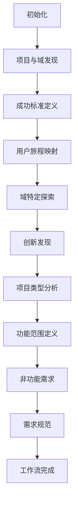

# PRD工作流

<cite>
**本文档中引用的文件**  
- [step-02-discovery.md](file://src/modules/bmm/workflows/2-plan-workflows/prd/steps/step-02-discovery.md)
- [step-03-success.md](file://src/modules/bmm/workflows/2-plan-workflows/prd/steps/step-03-success.md)
- [step-04-journeys.md](file://src/modules/bmm/workflows/2-plan-workflows/prd/steps/step-04-journeys.md)
- [step-05-domain.md](file://src/modules/bmm/workflows/2-plan-workflows/prd/steps/step-05-domain.md)
- [step-06-innovation.md](file://src/modules/bmm/workflows/2-plan-workflows/prd/steps/step-06-innovation.md)
- [step-07-project-type.md](file://src/modules/bmm/workflows/2-plan-workflows/prd/steps/step-07-project-type.md)
- [step-08-features.md](file://src/modules/bmm/workflows/2-plan-workflows/prd/steps/step-08-features.md)
- [step-09-nfr.md](file://src/modules/bmm/workflows/2-plan-workflows/prd/steps/step-09-nfr.md)
- [step-10-requirements.md](file://src/modules/bmm/workflows/2-plan-workflows/prd/steps/step-10-requirements.md)
- [step-11-complete.md](file://src/modules/bmm/workflows/2-plan-workflows/prd/steps/step-11-complete.md)
- [prd-template.md](file://src/modules/bmm/workflows/2-plan-workflows/prd/prd-template.md)
- [workflow.md](file://src/modules/bmm/workflows/2-plan-workflows/prd/workflow.md)
- [project-types.csv](file://src/modules/bmm/workflows/2-plan-workflows/prd/project-types.csv)
- [domain-complexity.csv](file://src/modules/bmm/workflows/2-plan-workflows/prd/domain-complexity.csv)
</cite>

## 目录
1. [简介](#简介)
2. [PRD工作流架构](#prd工作流架构)
3. [核心步骤详解](#核心步骤详解)
4. [项目类型与域复杂性决策机制](#项目类型与域复杂性决策机制)
5. [PRD模板使用指南](#prd模板使用指南)
6. [与UX设计工作流的集成](#与ux设计工作流的集成)
7. [实际使用示例](#实际使用示例)
8. [常见问题解决方案](#常见问题解决方案)
9. [结论](#结论)

## 简介

PRD（产品需求文档）工作流是一个系统化的11步流程，旨在通过协作式发现过程捕获项目需求。该工作流采用步骤文件架构，确保每个步骤都得到精确执行。工作流从需求发现开始，逐步构建功能与非功能需求规范，最终形成完整的产品需求文档。该流程强调与UX设计工作流的集成，并为解决方案阶段提供输入。

**文档来源**  
- [workflow.md](file://src/modules/bmm/workflows/2-plan-workflows/prd/workflow.md)

## PRD工作流架构

PRD工作流采用微文件设计架构，每个步骤都是一个自包含的指令文件。工作流遵循严格的执行规则，包括仅在需要时加载、按顺序执行和状态跟踪。该架构确保了流程的纪律性和可重复性。



**图表来源**  
- [workflow.md](file://src/modules/bmm/workflows/2-plan-workflows/prd/workflow.md)

**文档来源**  
- [workflow.md](file://src/modules/bmm/workflows/2-plan-workflows/prd/workflow.md)

## 核心步骤详解

### 步骤2：项目与域发现

步骤2的目标是进行项目发现，利用现有输入文档并允许用户完善，同时进行数据驱动的分类。该步骤加载项目类型和域复杂性CSV数据，分析输入文档，并与用户合作生成执行摘要。

**关键活动**：
- 加载分类数据
- 利用输入文档加速发现
- 倾听分类信号
- 识别产品独特性
- 生成执行摘要内容

**输入**：项目名称、输入文档（产品简报、研究、头脑风暴结果）
**输出**：执行摘要、项目分类、产品独特性声明

**文档来源**  
- [step-02-discovery.md](file://src/modules/bmm/workflows/2-plan-workflows/prd/steps/step-02-discovery.md)

### 步骤3：成功标准定义

步骤3的目标是定义用户成功、业务成功和技术成功标准。该步骤利用输入文档作为基础，同时允许用户完善。工作流引导用户从模糊的指标转向具体的、可衡量的成功标准。

**关键活动**：
- 开始成功定义对话
- 探索用户成功指标
- 定义业务成功
- 挑战模糊指标
- 连接产品独特性
- 智能范围谈判

**输入**：执行摘要、项目分类
**输出**：成功标准、产品范围（MVP、增长功能、愿景）

**文档来源**  
- [step-03-success.md](file://src/modules/bmm/workflows/2-plan-workflows/prd/steps/step-03-success.md)

### 步骤4：用户旅程映射

步骤4的目标是创建引人入胜的叙事性用户旅程，利用产品简报中的现有角色，并识别需要全面覆盖的额外用户类型。该步骤强调故事叙述，将用户旅程分为开场场景、上升动作、高潮和结局。

**关键活动**：
- 利用现有用户并识别额外类型
- 创建基于叙事的旅程
- 指导旅程探索
- 连接旅程与需求
- 实现全面覆盖

**输入**：成功标准、产品范围
**输出**：用户旅程叙事、旅程需求摘要

**文档来源**  
- [step-04-journeys.md](file://src/modules/bmm/workflows/2-plan-workflows/prd/steps/step-04-journeys.md)

### 步骤5：域特定探索

步骤5是一个可选步骤，仅在域复杂性为"高"时执行。该步骤探索复杂域的特定要求，包括合规性、法规和行业特定约束。它加载域特定配置数据，并与用户合作记录关键域关注点。

**关键活动**：
- 加载域配置数据
- 呈现域复杂性上下文
- 探索域特定要求
- 综合域要求
- 处理特殊部分

**输入**：用户旅程、域复杂性级别
**输出**：域特定要求、合规要求、行业标准

**文档来源**  
- [step-05-domain.md](file://src/modules/bmm/workflows/2-plan-workflows/prd/steps/step-05-domain.md)

### 步骤6：创新发现

步骤6的目标是检测和探索产品的创新模式。该步骤是可选的，仅在检测到创新信号时执行。它加载项目类型创新数据，并与用户合作识别创新领域。

**关键活动**：
- 加载项目类型创新数据
- 倾听创新指标
- 进行初步创新筛选
- 深入创新探索
- 生成创新内容

**输入**：域特定要求、项目类型
**输出**：检测到的创新领域、市场背景、验证方法

**文档来源**  
- [step-06-innovation.md](file://src/modules/bmm/workflows/2-plan-workflows/prd/steps/step-06-innovation.md)

### 步骤7：项目类型分析

步骤7的目标是根据项目类型进行深入分析，识别特定于项目类型的需求和约束。该步骤利用项目类型CSV中的关键问题和必需部分来指导发现过程。

**关键活动**：
- 加载项目类型详细信息
- 探索项目类型特定问题
- 识别必需部分
- 跳过不相关部分
- 生成项目类型分析内容

**输入**：创新发现、项目类型
**输出**：项目类型特定要求、技术约束

**文档来源**  
- [step-07-project-type.md](file://src/modules/bmm/workflows/2-plan-workflows/prd/steps/step-07-project-type.md)

### 步骤8：功能范围定义

步骤8的目标是定义功能范围，将用户旅程和成功标准转化为具体的功能需求。该步骤指导用户区分MVP功能、增长功能和未来愿景功能。

**关键活动**：
- 连接旅程与功能
- 定义MVP功能集
- 识别增长功能
- 规划未来功能
- 生成功能范围内容

**输入**：项目类型分析、用户旅程
**输出**：功能范围文档、MVP功能列表

**文档来源**  
- [step-08-features.md](file://src/modules/bmm/workflows/2-plan-workflows/prd/steps/step-08-features.md)

### 步骤9：非功能需求

步骤9的目标是定义非功能需求（NFR），包括性能、安全性、可用性和可维护性要求。该步骤根据项目类型和域复杂性指导NFR定义。

**关键活动**：
- 定义性能要求
- 确定安全性需求
- 规定可用性标准
- 规划可维护性
- 生成NFR内容

**输入**：功能范围、项目类型
**输出**：非功能需求规范

**文档来源**  
- [step-09-nfr.md](file://src/modules/bmm/workflows/2-plan-workflows/prd/steps/step-09-nfr.md)

### 步骤10：需求规范

步骤10的目标是将所有发现的需求转化为标准化的规范文档。该步骤整合功能需求和非功能需求，创建完整的需求规范。

**关键活动**：
- 整合需求
- 结构化需求文档
- 验证需求完整性
- 生成需求规范内容

**输入**：功能范围、非功能需求
**输出**：完整的需求规范文档

**文档来源**  
- [step-10-requirements.md](file://src/modules/bmm/workflows/2-plan-workflows/prd/steps/step-10-requirements.md)

### 步骤11：工作流完成

步骤11是PRD工作流的最后一步，负责完成文档、更新状态文件并建议项目的下一步。该步骤执行最终的质量检查，确认文档完整性，并建议后续工作流。

**关键活动**：
- 宣布工作流完成
- 建议下一步工作流
- 执行文档质量检查
- 确认完成
- 更新工作流状态

**输入**：完整的需求规范
**输出**：完成的PRD文档、下一步建议

**文档来源**  
- [step-11-complete.md](file://src/modules/bmm/workflows/2-plan-workflows/prd/steps/step-11-complete.md)

## 项目类型与域复杂性决策机制

PRD工作流使用两个关键的决策机制来指导需求发现过程：项目类型分类和域复杂性评估。

### 项目类型分类

项目类型分类基于`project-types.csv`文件，该文件定义了不同项目类型的检测信号、关键问题和必需部分。当用户描述他们的产品时，系统会监听与预定义信号匹配的关键词。

**项目类型包括**：
- API后端
- 移动应用
- SaaS B2B
- 开发者工具
- CLI工具
- Web应用
- 桌面应用
- IoT嵌入式
- 区块链Web3

每个项目类型都有特定的关键问题和必需部分，这有助于引导发现过程并确保捕获所有相关需求。

**文档来源**  
- [project-types.csv](file://src/modules/bmm/workflows/2-plan-workflows/prd/project-types.csv)

### 域复杂性评估

域复杂性评估基于`domain-complexity.csv`文件，该文件定义了不同领域的信号、复杂性级别和关键关注点。该机制帮助识别需要特殊考虑的复杂领域。

**高复杂性领域包括**：
- 医疗保健：FDA批准、临床验证、HIPAA合规
- 金融科技：区域合规、安全标准、审计要求
- 政府科技：采购规则、安全许可、可访问性
- 航空航天：安全认证、DO-178C合规
- 汽车：安全标准、ISO 26262

当检测到高复杂性领域时，工作流会触发额外的域特定探索步骤，确保捕获所有合规性和监管要求。

**文档来源**  
- [domain-complexity.csv](file://src/modules/bmm/workflows/2-plan-workflows/prd/domain-complexity.csv)

## PRD模板使用指南

`prd-template.md`文件提供了PRD文档的标准化结构。该模板使用前端物料（frontmatter）来跟踪工作流状态和输入文档。

### 模板结构

```markdown
---
stepsCompleted: []
inputDocuments: []
---
# 产品需求文档 - {{project_name}}

**作者：** {{user_name}}
**日期：** {{date}}
```

### 使用方法

1. **初始化**：创建工作流时，系统会创建基于此模板的新文档
2. **状态跟踪**：`stepsCompleted`数组记录已完成的步骤
3. **内容追加**：每个步骤完成后，相关内容会追加到文档中
4. **变量替换**：模板中的变量（如`{{project_name}}`）会被实际值替换

### 内容组织

PRD文档按以下顺序组织：
1. 执行摘要
2. 成功标准
3. 用户旅程
4. 域特定要求
5. 创新与新颖模式
6. 项目类型分析
7. 功能范围
8. 非功能需求
9. 需求规范

**文档来源**  
- [prd-template.md](file://src/modules/bmm/workflows/2-plan-workflows/prd/prd-template.md)

## 与UX设计工作流的集成

PRD工作流与UX设计工作流紧密集成，确保产品需求能够有效指导用户体验设计。

### 集成点

1. **用户旅程**：PRD中的用户旅程直接为UX设计提供输入
2. **成功标准**：用户体验设计以用户成功标准为导向
3. **功能范围**：UX设计团队根据MVP功能集确定设计优先级

### 并行工作

PRD工作流完成后，UX设计和架构规划可以并行进行：
- UX设计团队根据用户旅程创建线框图和原型
- 架构团队根据技术要求设计系统架构
- 两者都以PRD文档作为单一事实来源

### 输出作为输入

PRD文档的输出为解决方案阶段提供了关键输入：
- 功能需求指导开发优先级和冲刺规划
- 非功能需求指导技术架构决策
- 用户旅程指导用户体验设计

**文档来源**  
- [workflow.md](file://src/modules/bmm/workflows/2-plan-workflows/prd/workflow.md)

## 实际使用示例

### 示例1：SaaS B2B产品

**场景**：一家公司想要开发一个面向企业的SaaS平台，用于团队协作。

**工作流执行**：
1. **项目发现**：系统检测到"平台"、"团队"等关键词，分类为SaaS B2B项目
2. **成功标准**：定义用户成功（团队效率提升30%）、业务成功（6个月内获得100个付费客户）
3. **用户旅程**：创建主要用户（团队成员）、管理员（IT经理）和API消费者（集成开发者）的旅程
4. **域探索**：由于是B2B产品，复杂性为中等，跳过域特定探索
5. **创新发现**：检测到"AI驱动的自动化工作流"创新信号，深入探索AI功能
6. **项目类型分析**：基于SaaS B2B类型，关注多租户、权限模型和订阅层级
7. **需求规范**：整合所有发现，生成完整的需求文档

### 示例2：医疗保健应用

**场景**：开发一个用于患者诊断的移动医疗应用。

**工作流执行**：
1. **项目发现**：检测到"医疗"、"诊断"等关键词，分类为医疗保健领域
2. **域复杂性**：医疗保健领域复杂性为"高"，触发域特定探索步骤
3. **域探索**：深入探讨FDA批准、HIPAA合规、患者安全等关键关注点
4. **成功标准**：包括临床验证里程碑和合规审批时间表
5. **用户旅程**：创建患者、医生和医疗管理员的旅程
6. **需求规范**：将所有合规要求整合到非功能需求中

## 常见问题解决方案

### 问题1：如何处理模糊的成功指标？

**解决方案**：使用工作流中的"挑战模糊指标"协议，将模糊的指标转化为具体的、可衡量的目标。

**示例**：
- 模糊："用户满意"
- 具体："用户完成关键操作的时间少于2分钟"
- 可衡量："用户满意度评分达到4.5/5"

### 问题2：如何确保用户旅程的全面性？

**解决方案**：使用工作流中的"全面覆盖"指南，确保涵盖所有用户类型：
- 主要用户 - 成功路径
- 主要用户 - 边缘情况
- 次要用户（管理员、支持人员）
- API消费者（如适用）

### 问题3：如何处理高复杂性领域的合规要求？

**解决方案**：当检测到高复杂性领域时，自动触发域特定探索步骤。该步骤使用`domain-complexity.csv`中的关键关注点列表，系统地探讨每个合规要求。

### 问题4：如何处理创新与风险的平衡？

**解决方案**：在创新发现步骤中，不仅探讨创新机会，还探讨风险缓解策略：
- 验证方法：如何验证创新功能有效
- 回退计划：如果创新功能失败的备选方案
- 分阶段实施：先在小范围内测试创新功能

## 结论

PRD工作流提供了一个系统化的方法来捕获项目需求，从需求发现到功能与非功能需求规范。通过11个精心设计的步骤，该工作流确保了需求的完整性、一致性和可追溯性。项目类型分类和域复杂性评估等决策机制使工作流能够适应不同类型的项目。PRD模板确保了文档的标准化，而与UX设计工作流的集成确保了需求能够有效指导后续的开发活动。该工作流不仅是一个文档创建工具，更是一个结构化的思考框架，帮助产品团队系统地思考和定义产品需求。