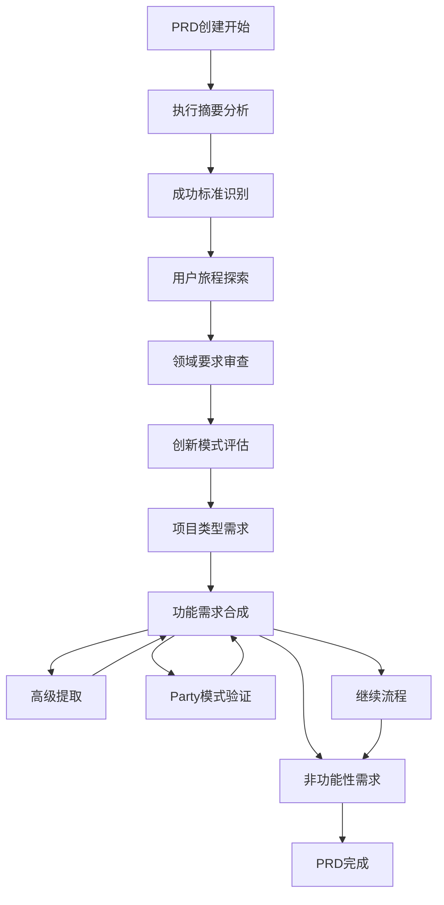
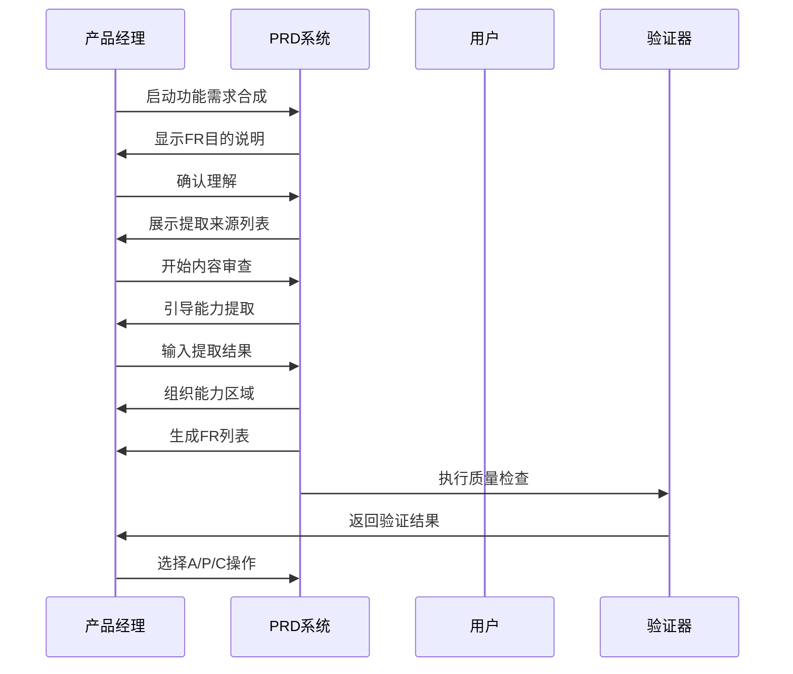
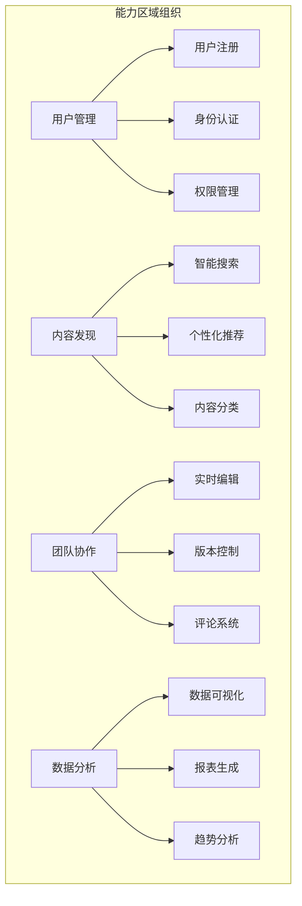
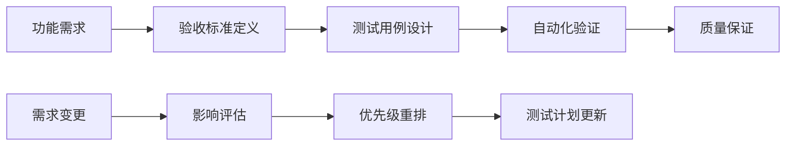
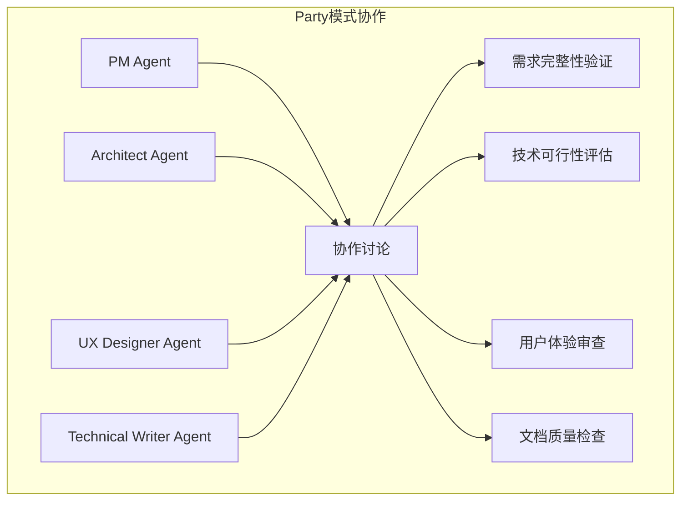
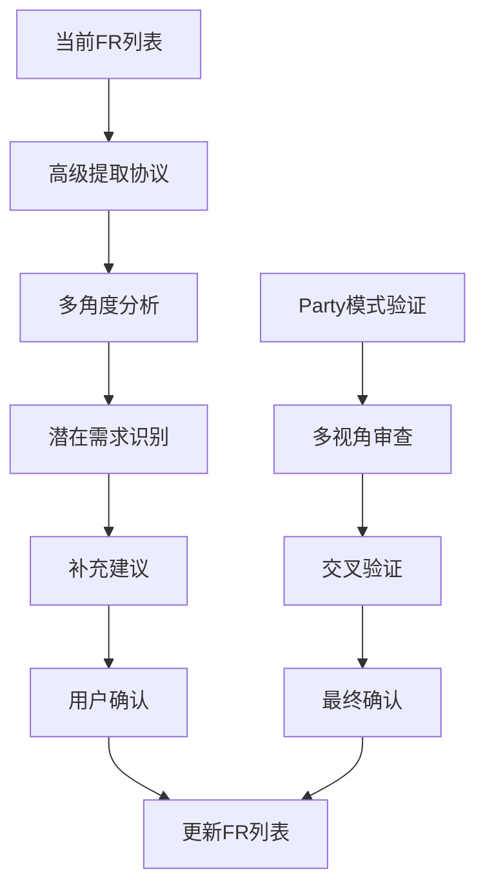
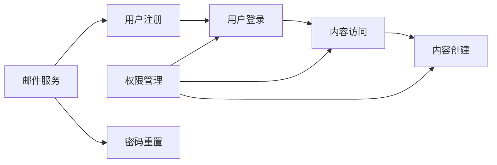
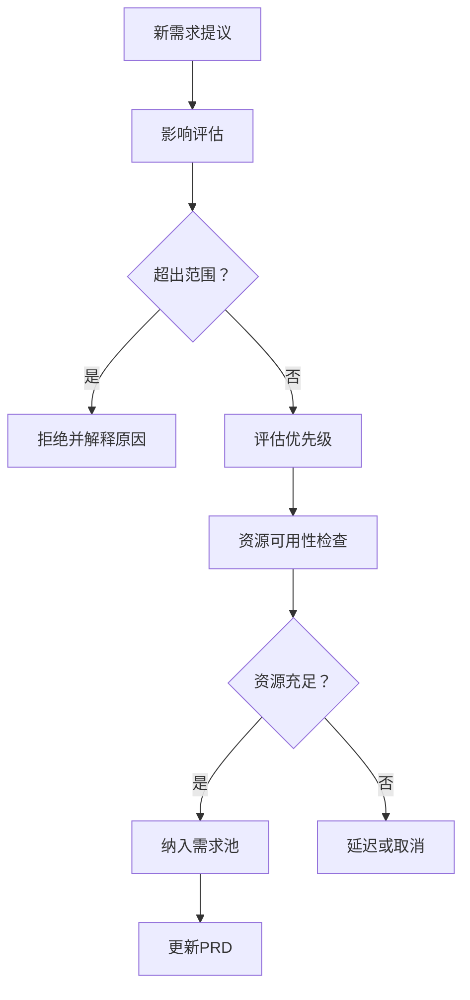

# 功能需求规范

<cite>
**本文档引用的文件**
- [step-09-functional.md](file://src/modules/bmm/workflows/2-plan-workflows/prd/steps/step-09-functional.md)
- [step-10-nonfunctional.md](file://src/modules/bmm/workflows/2-plan-workflows/prd/steps/step-10-nonfunctional.md)
- [prd-template.md](file://src/modules/bmm/workflows/2-plan-workflows/prd/prd-template.md)
- [party-mode.md](file://src/modules/bmm/docs/party-mode.md)
- [advanced-elicitation.xml](file://src/core/tasks/advanced-elicitation.xml)
- [test-priorities-matrix.md](file://src/modules/bmm/testarch/knowledge/test-priorities-matrix.md)
- [risk-governance.md](file://src/modules/bmm/testarch/knowledge/risk-governance.md)
- [coverage-traceability.ts](file://src/modules/bmm/testarch/knowledge/risk-governance.md)
</cite>

## 目录
1. [概述](#概述)
2. [PRD工作流中的功能需求捕获](#prd工作流中的功能需求捕获)
3. [功能需求收集的实施机制](#功能需求收集的实施机制)
4. [功能需求模板结构](#功能需求模板结构)
5. [优先级排序与验收标准](#优先级排序与验收标准)
6. [协作验证机制](#协作验证机制)
7. [最佳实践指南](#最佳实践指南)
8. [风险控制与预防策略](#风险控制与预防策略)
9. [总结](#总结)

## 概述

功能需求规范是产品需求文档（PRD）的核心组成部分，它定义了产品必须具备的用户可见能力和系统行为。在BMAD-METHOD框架中，功能需求的捕获和结构化遵循严格的流程化方法，确保需求的完整性、可测试性和可追溯性。

功能需求规范的主要目标是：
- 建立完整的能力清单，作为后续设计和开发的基础
- 确保需求的实现无关性，支持多种技术方案
- 提供明确的验收标准，便于测试验证
- 避免需求蔓延，保持项目范围的可控性

## PRD工作流中的功能需求捕获

### 工作流架构概览

BMAD-METHOD采用分阶段的工作流来捕获和结构化功能需求：



**图表来源**
- [step-09-functional.md](file://src/modules/bmm/workflows/2-plan-workflows/prd/steps/step-09-functional.md#L1-L50)
- [step-10-nonfunctional.md](file://src/modules/bmm/workflows/2-plan-workflows/prd/steps/step-10-nonfunctional.md#L1-L50)

### 功能需求合成的关键步骤

功能需求合成过程包含以下核心环节：

1. **理解FR目的和用途**：明确功能需求在整个产品开发中的关键作用
2. **回顾现有内容提取能力**：系统性地从前期文档中提取潜在的功能需求
3. **按能力区域组织需求**：将功能需求分类到逻辑能力组中
4. **生成全面的FR列表**：按照标准格式创建完整的需求清单
5. **自我验证过程**：确保需求的完整性和质量
6. **生成功能需求内容**：准备符合文档格式的内容

**章节来源**
- [step-09-functional.md](file://src/modules/bmm/workflows/2-plan-workflows/prd/steps/step-09-functional.md#L56-L177)

## 功能需求收集的实施机制

### 系统化提问获取机制

功能需求收集采用系统化的提问机制，确保不遗漏任何重要能力：



**图表来源**
- [step-09-functional.md](file://src/modules/bmm/workflows/2-plan-workflows/prd/steps/step-09-functional.md#L78-L109)

### 能力提取来源

系统从多个维度提取功能需求：

| 提取来源 | 描述 | 示例 |
|---------|------|------|
| 执行摘要 | 核心产品差异化能力 | "AI驱动的内容推荐引擎" |
| 成功标准 | 支持成功的启用能力 | "用户留存率提升20%" |
| 用户旅程 | 旅程揭示的能力 | "个性化学习路径规划" |
| 领域要求 | 合规和监管能力 | "数据隐私保护合规" |
| 创新模式 | 创新特性能力 | "实时协作编辑功能" |
| 项目类型需求 | 技术能力需求 | "高并发处理能力" |

**章节来源**
- [step-09-functional.md](file://src/modules/bmm/workflows/2-plan-workflows/prd/steps/step-09-functional.md#L81-L89)

### 能力区域组织原则

功能需求按逻辑能力区域组织，而非技术层面：



**图表来源**
- [step-09-functional.md](file://src/modules/bmm/workflows/2-plan-workflows/prd/steps/step-09-functional.md#L92-L101)

## 功能需求模板结构

### 标准格式规范

功能需求采用统一的格式规范：

```
FR#: [Actor] can [capability] [context/constraint if needed]
```

### 正确示例 vs 错误示例

| 类型 | 正确示例 | 错误示例 | 说明 |
|------|----------|----------|------|
| ✅ 正确 | "用户可以自定义外观设置" | "用户可以切换亮色/暗色主题，包含3种字体大小选项存储在LocalStorage中" | 实现无关，关注能力本身 |
| ✅ 正确 | "管理员可以管理用户角色" | "管理员界面包含用户管理表格和批量操作按钮" | 不包含UI细节 |
| ❌ 错误 | "系统应该快速响应" | "页面加载时间不超过2秒" | 使用模糊术语 |
| ❌ 错误 | "应用应该易于使用" | "用户界面直观，导航简单" | 缺乏可测试性 |

**章节来源**
- [step-09-functional.md](file://src/modules/bmm/workflows/2-plan-workflows/prd/steps/step-09-functional.md#L108-L119)

### 文档结构模板

功能需求部分的标准文档结构：

```markdown
## 功能需求

### 用户管理
- FR1: 用户可以注册新账户
- FR2: 用户可以登录和注销
- FR3: 用户可以修改个人资料

### 内容管理
- FR4: 内容创作者可以上传多媒体内容
- FR5: 管理员可以审核内容发布
- FR6: 系统自动检测违规内容

### 协作功能
- FR7: 团队成员可以邀请其他用户加入项目
- FR8: 实时协作编辑文档
- FR9: 版本历史记录和恢复功能
```

**章节来源**
- [step-09-functional.md](file://src/modules/bmm/workflows/2-plan-workflows/prd/steps/step-09-functional.md#L149-L168)

## 优先级排序与验收标准

### 验收标准定义

每个功能需求都应有明确的验收标准，确保可测试性：



**图表来源**
- [test-priorities-matrix.md](file://src/modules/bmm/testarch/knowledge/test-priorities-matrix.md#L99-L271)

### 风险驱动的优先级评估

基于风险矩阵的功能需求优先级评估：

| 优先级 | 收入影响 | 用户影响 | 安全风险 | 复杂度 | 使用频率 | 计算规则 |
|--------|----------|----------|----------|--------|----------|----------|
| P0 | 关键 | 全部 | 是 | 高 | 频繁 | 关键业务功能 |
| P1 | 高 | 大部分 | 是 | 中 | 高频 | 核心用户体验 |
| P2 | 中 | 部分 | 否 | 低 | 偶尔 | 辅助功能 |
| P3 | 低 | 少数 | 否 | 低 | 很少 | 可选功能 |

**章节来源**
- [test-priorities-matrix.md](file://src/modules/bmm/testarch/knowledge/test-priorities-matrix.md#L128-L134)

### 可测试性验证清单

确保功能需求可测试性的验证清单：

1. **清晰度检查**：是否足够清晰，让测试人员能够判断需求是否存在
2. **独立性检查**：是否独立存在，不需要阅读其他需求就能理解
3. **具体性检查**：是否避免使用"好"、"快"、"容易"等模糊词汇
4. **实现无关性**：是否关注能力而非具体实现方式
5. **完整性检查**：是否覆盖所有讨论过的用户行为和系统行为

**章节来源**
- [step-09-functional.md](file://src/modules/bmm/workflows/2-plan-workflows/prd/steps/step-09-functional.md#L140-L144)

## 协作验证机制

### Party模式协作验证

Party模式提供了多Agent协作验证机制：



**图表来源**
- [party-mode.md](file://src/modules/bmm/docs/party-mode.md#L167-L180)

### 高级提取机制

系统提供高级提取功能，通过专门的技术方法确保需求覆盖的完整性：



**图表来源**
- [advanced-elicitation.xml](file://src/core/tasks/advanced-elicitation.xml#L96-L116)

**章节来源**
- [step-09-functional.md](file://src/modules/bmm/workflows/2-plan-workflows/prd/steps/step-09-functional.md#L192-L206)

## 最佳实践指南

### 避免歧义的编写原则

1. **使用明确的行动动词**：描述具体的用户行为或系统动作
2. **限定明确的边界**：清楚界定需求的应用范围和限制条件
3. **避免技术术语**：使用业务语言而非技术实现细节
4. **提供具体场景**：通过具体使用场景说明需求价值

### 处理依赖关系

功能需求间的依赖关系需要清晰标识：



### 可追溯性建立

建立需求与测试用例、设计文档之间的追溯关系：

| 需求ID | 测试用例 | 设计文档 | 实现组件 | 验收状态 |
|--------|----------|----------|----------|----------|
| FR1 | TC1-1, TC1-2 | Design-1 | UserModule | 已完成 |
| FR2 | TC2-1 | Design-2 | AuthService | 进行中 |
| FR3 | TC3-1, TC3-2, TC3-3 | Design-3 | ContentModule | 未开始 |

**章节来源**
- [coverage-traceability.ts](file://src/modules/bmm/testarch/knowledge/risk-governance.md#L459-L557)

## 风险控制与预防策略

### 需求蔓延预防

通过以下机制预防需求蔓延：

1. **能力合同约束**：明确已确定的能力范围
2. **范围边界定义**：清晰界定需求的边界
3. **变更影响评估**：对新增需求进行全面评估
4. **优先级决策机制**：基于业务价值和资源分配决策



### 风险治理框架

建立完善的风险治理框架：

| 风险等级 | 分数范围 | 处理策略 | 责任人 |
|----------|----------|----------|--------|
| 极高 | 9 | 必须解决，立即行动 | 产品负责人 |
| 高 | 6-8 | 需要解决，制定计划 | 技术负责人 |
| 中 | 3-5 | 考虑解决，评估成本 | 项目经理 |
| 低 | 1-2 | 监控观察 | 团队成员 |

**章节来源**
- [risk-governance.md](file://src/modules/bmm/testarch/knowledge/risk-governance.md#L272-L458)

### 质量保证机制

确保功能需求质量的多重保障：

1. **同行评审**：多角色参与的需求审查
2. **原型验证**：通过原型验证需求的可行性
3. **用户故事映射**：从用户角度验证需求价值
4. **技术可行性评估**：确保需求在技术上可实现

## 总结

BMAD-METHOD的功能需求规范体系提供了一套完整的方法论，确保功能需求的捕获、结构化和验证过程的科学性和有效性。该体系的核心优势包括：

1. **系统化流程**：从PRD创建工作流的各个环节确保需求的完整性
2. **协作验证**：通过Party模式和高级提取机制确保需求质量
3. **可测试性保证**：通过严格的验证清单确保每个需求都可测试
4. **风险控制**：通过完善的治理框架预防需求蔓延
5. **可追溯性**：建立需求与设计、实现之间的完整追溯关系

这套功能需求规范不仅适用于BMAD-METHOD框架，其核心理念和方法论也可以广泛应用于其他敏捷开发和产品管理实践中，为高质量的产品需求奠定坚实基础。