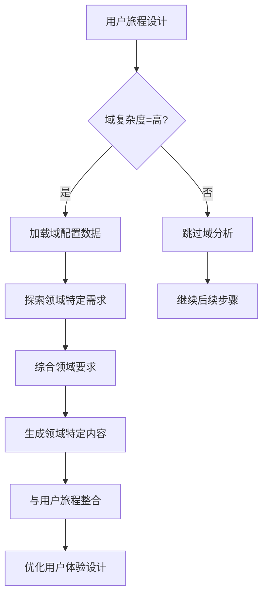
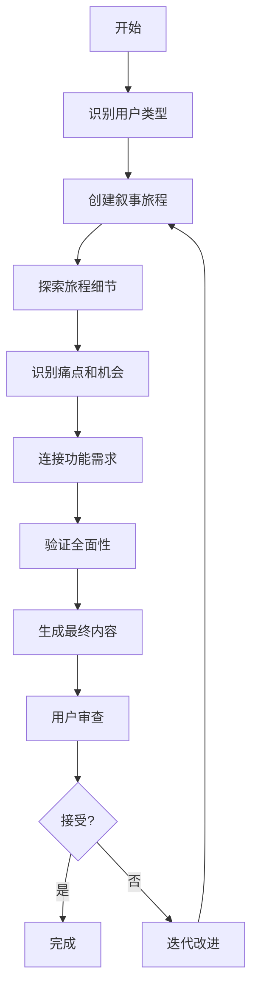
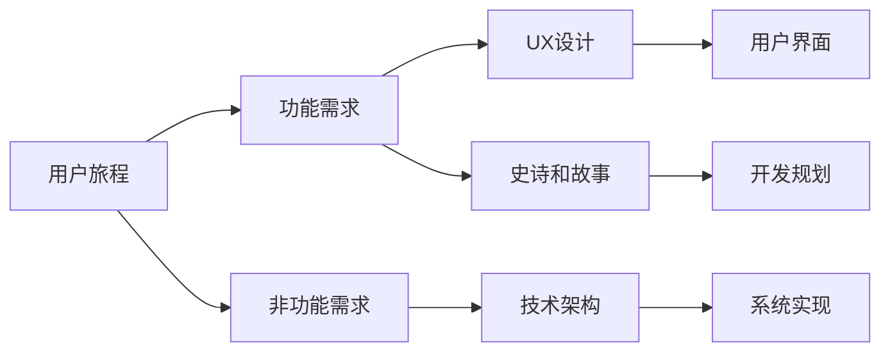

# 用户旅程设计

<cite>
**本文档引用的文件**
- [step-04-journeys.md](file://src/modules/bmm/workflows/2-plan-workflows/prd/steps/step-04-journeys.md)
- [step-05-domain.md](file://src/modules/bmm/workflows/2-plan-workflows/prd/steps/step-05-domain.md)
- [step-10-user-journeys.md](file://src/modules/bmm/workflows/2-plan-workflows/create-ux-design/steps/step-10-user-journeys.md)
- [user-journey-mapper.md](file://src/modules/bmm/sub-modules/claude-code/sub-agents/bmad-planning/user-journey-mapper.md)
- [domain-complexity.csv](file://src/modules/bmm/workflows/2-plan-workflows/prd/domain-complexity.csv)
</cite>

## 目录
1. [引言](#引言)
2. [用户旅程设计实施步骤](#用户旅程设计实施步骤)
3. [与域分析的集成关系](#与域分析的集成关系)
4. [用户旅程图创建指南](#用户旅程图创建指南)
5. [实际案例与产品需求转化](#实际案例与产品需求转化)
6. [复杂场景与边缘情况处理](#复杂场景与边缘情况处理)
7. [结论](#结论)

## 引言

用户旅程设计是产品开发流程中的关键环节，它通过系统化的方法将用户需求转化为具体的产品功能。在BMAD方法论中，用户旅程设计作为PRD（产品需求文档）工作流的核心步骤，不仅帮助识别关键用户角色和行为路径，还为后续的用户体验设计和系统架构提供重要输入。本文档详细阐述了step-04-journeys.md中用户旅程设计的完整过程，包括如何识别用户角色、绘制行为路径以及发现痛点和机会点。

**Section sources**
- [step-04-journeys.md](file://src/modules/bmm/workflows/2-plan-workflows/prd/steps/step-04-journeys.md)

## 用户旅程设计实施步骤

### 识别关键用户角色

用户旅程设计的第一步是全面识别所有与系统交互的用户类型。根据step-04-journeys.md的指导，这一过程需要从产品简报中的现有用户画像开始，并扩展到其他可能的用户类型：

1. **利用现有用户画像**：分析产品简报、研究和头脑风暴文档中已定义的用户画像
2. **识别额外用户类型**：基于产品类型和范围，考虑管理员、审核员、支持人员、API消费者和内部运营人员等
3. **确保全面覆盖**：必须涵盖主要用户、次要用户和特殊用户类型

该步骤强调协作式发现，通过A/P/C菜单（高级探索/团队模式/继续）促进深入讨论，确保不遗漏任何重要用户群体。

### 绘制用户行为路径

在确定用户角色后，需要创建基于叙事的用户旅程，将用户故事转化为具体的行为路径：

1. **叙事旅程创建**：
   - 为每个用户类型创建引人入胜的叙事旅程
   - 使用故事结构：开场场景（当前痛点）、上升动作（采取的步骤）、高潮（产品提供价值的关键时刻）、结局（改善后的新现实）
   - 采用具体示例格式，如"玛丽亚·桑托斯 - 重拾她的创意时间"

2. **旅程探索引导**：
   - 在每个旅程中探讨具体问题：每一步发生什么？可能出错的地方？需要什么信息？
   - 考虑用户在每个点的情感状态
   - 识别旅程成功或失败的关键点

3. **连接旅程与需求**：
   - 明确每个旅程揭示的功能需求领域
   - 帮助用户理解不同旅程如何对应不同的功能集

### 识别痛点和机会点

用户旅程设计的核心价值在于识别用户体验中的痛点和改进机会：

1. **痛点识别**：
   - 在旅程的每个决策点识别可能的困惑或障碍
   - 识别错误恢复路径和失败场景
   - 发现认知负荷过高的环节

2. **机会点发现**：
   - 识别可以创造用户愉悦感的时刻
   - 发现简化流程、减少步骤的机会
   - 识别提供清晰反馈和进度指示的机会

3. **全面覆盖要求**：
   - 主要用户的成功路径（核心体验）
   - 主要用户的边缘情况（错误恢复、替代目标）
   - 管理员/运营用户（管理、配置、监控）
   - 支持/故障排除（帮助、调查、问题解决）
   - API/集成（开发者/技术用户旅程）

**Section sources**
- [step-04-journeys.md](file://src/modules/bmm/workflows/2-plan-workflows/prd/steps/step-04-journeys.md)

## 与域分析的集成关系

### 业务域理解转化为用户体验设计

用户旅程设计与域分析（step-05-domain.md）紧密集成，确保用户体验设计符合特定业务领域的合规性和专业要求：

1. **域复杂性验证**：
   - 只有当复杂度级别为"高"或领域有特定监管/合规需求时，才进行域探索
   - 使用domain-complexity.csv文件中的配置数据指导分析

2. **领域特定要求整合**：
   - 将监管要求、合规需求和行业标准融入用户体验设计
   - 确保安全/风险因素在用户旅程中得到适当处理
   - 考虑必要的验证和专业知识需求

3. **实施考虑**：
   - 确定哪些功能是强制性的
   - 明确关键的非功能性需求（NFRs）
   - 规划开发顺序
   - 确定需要的验证类型

### 集成流程



**Diagram sources**
- [step-05-domain.md](file://src/modules/bmm/workflows/2-plan-workflows/prd/steps/step-05-domain.md)
- [domain-complexity.csv](file://src/modules/bmm/workflows/2-plan-workflows/prd/domain-complexity.csv)

**Section sources**
- [step-05-domain.md](file://src/modules/bmm/workflows/2-plan-workflows/prd/steps/step-05-domain.md)

## 用户旅程图创建指南

### 最佳实践

1. **叙事驱动**：使用故事结构（开场、上升动作、高潮、结局）创建引人入胜的用户旅程
2. **情感弧线**：包含用户在旅程中的情感变化，使旅程更具说服力
3. **全面覆盖**：确保涵盖成功路径、边缘情况和错误恢复
4. **协作式设计**：利用A/P/C菜单促进团队讨论和深入探索
5. **可追溯性**：确保每个旅程步骤都能追溯到具体的功能需求

### 常见模式

1. **UI产品模式**：
   ```
   发现 → 评估 → 注册 → 激活 → 使用 → 保留 → 扩展
   ```

2. **API产品模式**：
   ```
   文档 → 认证 → 测试 → 集成 → 生产 → 扩展
   ```

3. **CLI工具模式**：
   ```
   安装 → 配置 → 首次使用 → 自动化 → 高级功能
   ```

### 验证方法

1. **覆盖率检查**：确保所有用户类型都有对应的旅程
2. **完整性检查**：旅程是否涵盖边缘情况
3. **可追溯性检查**：每个步骤是否映射到具体需求
4. **价值导向检查**：是否有明确的价值交付点
5. **可行性检查**：路径是否技术上可实现



**Diagram sources**
- [user-journey-mapper.md](file://src/modules/bmm/sub-modules/claude-code/sub-agents/bmad-planning/user-journey-mapper.md)

**Section sources**
- [user-journey-mapper.md](file://src/modules/bmm/sub-modules/claude-code/sub-agents/bmad-planning/user-journey-mapper.md)

## 实际案例与产品需求转化

### 用户旅程洞察转化为产品需求

用户旅程设计的输出直接指导后续的产品开发工作：

1. **UX设计指导**：
   - 用户旅程洞察指导交互设计
   - 功能需求定义设计范围
   - 在create-ux-design工作流中，基于PRD中的用户旅程设计详细交互流程

2. **技术架构指导**：
   - 项目类型需求指导技术决策
   - 非功能性需求影响架构选择
   - 在create-architecture工作流中，基于用户旅程和需求进行技术规划

3. **史诗和故事分解**：
   - 功能需求转化为史诗和用户故事
   - 范围定义指导冲刺规划
   - 在create-epics-and-stories工作流中，基于用户旅程创建开发任务

### 转化流程



**Diagram sources**
- [step-10-user-journeys.md](file://src/modules/bmm/workflows/2-plan-workflows/create-ux-design/steps/step-10-user-journeys.md)

**Section sources**
- [step-10-user-journeys.md](file://src/modules/bmm/workflows/2-plan-workflows/create-ux-design/steps/step-10-user-journeys.md)

## 复杂场景与边缘情况处理

### 复杂用户场景处理

1. **多角色交互**：考虑不同用户角色之间的交互和数据共享
2. **跨平台体验**：确保在不同设备和平台上的体验一致性
3. **国际化需求**：考虑语言、文化和时区差异
4. **可访问性**：确保残障用户能够顺利使用产品

### 边缘情况处理

1. **错误恢复**：设计清晰的错误消息和恢复路径
2. **网络问题**：考虑离线模式和网络恢复策略
3. **数据异常**：处理无效输入和数据边界情况
4. **性能瓶颈**：识别可能的性能问题并设计缓解措施

### 处理策略

1. **提前识别**：在用户旅程设计阶段就识别可能的边缘情况
2. **优先级排序**：根据发生频率和影响程度确定处理优先级
3. **渐进式增强**：先确保核心功能稳定，再逐步完善边缘情况处理
4. **用户反馈**：建立机制收集用户在边缘情况下的体验反馈

**Section sources**
- [step-04-journeys.md](file://src/modules/bmm/workflows/2-plan-workflows/prd/steps/step-04-journeys.md)

## 结论

用户旅程设计是连接用户需求与产品实现的关键桥梁。通过系统化的用户角色识别、叙事驱动的行为路径绘制以及痛点和机会点的深入分析，可以创建出既符合用户期望又满足业务目标的产品。与域分析的紧密集成确保了产品在特定业务领域的合规性和专业性，而详细的用户旅程图则为后续的UX设计、技术架构和开发规划提供了坚实的基础。通过遵循最佳实践和验证方法，可以确保用户旅程设计的质量，最终转化为成功的产品。