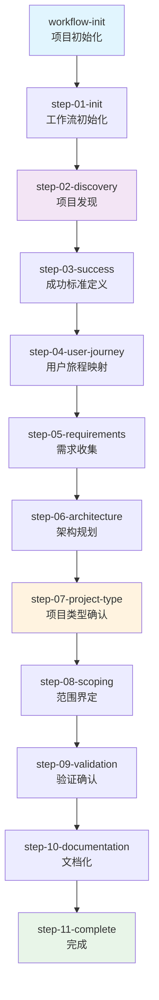
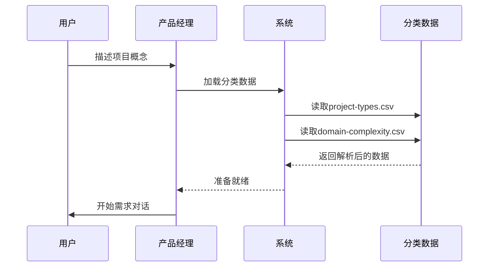
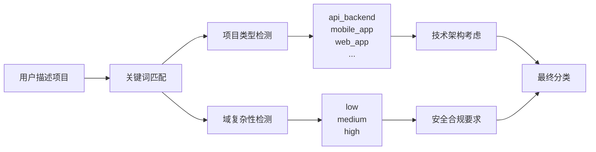
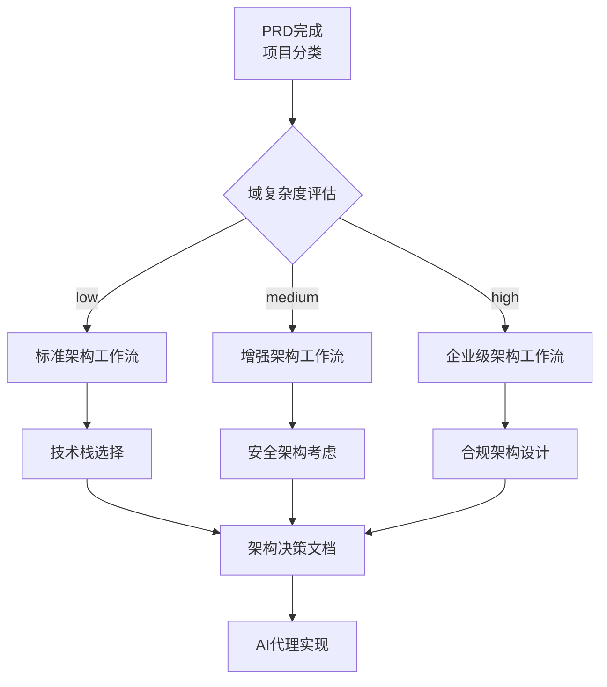
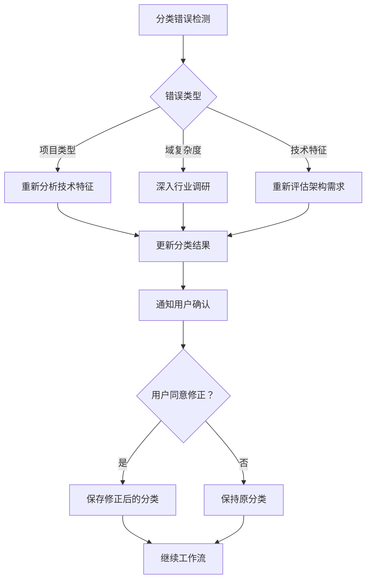

# 需求发现与项目类型

<cite>
**本文档引用的文件**
- [step-02-discovery.md](file://src/modules/bmm/workflows/2-plan-workflows/prd/steps/step-02-discovery.md)
- [project-types.csv](file://src/modules/bmm/workflows/2-plan-workflows/prd/project-types.csv)
- [domain-complexity.csv](file://src/modules/bmm/workflows/2-plan-workflows/prd/domain-complexity.csv)
- [workflow.md](file://src/modules/bmm/workflows/2-plan-workflows/prd/workflow.md)
- [step-03-success.md](file://src/modules/bmm/workflows/2-plan-workflows/prd/steps/step-03-success.md)
- [workflows-planning.md](file://src/modules/bmm/docs/workflows-planning.md)
- [architecture/workflow.md](file://src/modules/bmm/workflows/3-solutioning/architecture/workflow.md)
- [step-07-project-type.md](file://src/modules/bmm/workflows/2-plan-workflows/prd/steps/step-07-project-type.md)
</cite>

## 目录
1. [引言](#引言)
2. [PRD工作流概述](#prd工作流概述)
3. [需求发现机制详解](#需求发现机制详解)
4. [项目类型分类体系](#项目类型分类体系)
5. [域复杂性评估标准](#域复杂性评估标准)
6. [工作流集成与应用](#工作流集成与应用)
7. [实际案例分析](#实际案例分析)
8. [常见分类错误与纠正](#常见分类错误与纠正)
9. [总结与最佳实践](#总结与最佳实践)

## 引言

BMAD-METHOD的PRD工作流是一个高度智能化的需求发现与项目分类系统，旨在通过对话引导和数据驱动的方式帮助产品团队明确定义项目愿景、范围和类型。该系统的核心价值在于将传统的静态文档创建转变为动态的协作发现过程，确保项目从一开始就建立在准确的理解基础之上。

## PRD工作流概述

BMAD-METHOD的PRD工作流采用分阶段的微文件架构设计，每个步骤都是自包含的指令文件，必须严格按照顺序执行。这种设计确保了工作的纪律性和可追溯性。

**图表来源**
- [workflow.md](file://src/modules/bmm/workflows/2-plan-workflows/prd/workflow.md#L1-L62)

**章节来源**
- [workflow.md](file://src/modules/bmm/workflows/2-plan-workflows/prd/workflow.md#L1-L62)
- [workflows-planning.md](file://src/modules/bmm/docs/workflows-planning.md#L1-L200)

## 需求发现机制详解

### step-02-discovery.md的核心功能

需求发现是PRD工作流的第二步，也是最关键的一步之一。该步骤通过以下机制实现深度的需求挖掘：

#### 1. 分类数据加载与准备

系统首先加载两个核心CSV文件：
- **project-types.csv**: 定义了11种项目类型及其检测信号
- **domain-complexity.csv**: 提供了域复杂性评估标准

**图表来源**
- [step-02-discovery.md](file://src/modules/bmm/workflows/2-plan-workflows/prd/steps/step-02-discovery.md#L54-L60)

#### 2. 输入文档分析与利用

系统会分析现有的输入文档（产品简报、研究文档、头脑风暴结果等），为发现过程提供起点：

- **产品简报分析**: 提取愿景、问题、目标用户和差异化要素
- **研究文档审查**: 发现已有的成功指标和业务目标
- **头脑风暴结果**: 整合创意和想法

#### 3. 分类信号监听机制

系统在用户描述项目时持续监听分类信号：

**图表来源**
- [step-02-discovery.md](file://src/modules/bmm/workflows/2-plan-workflows/prd/steps/step-02-discovery.md#L103-L149)

#### 4. 增强分类与上下文融合

系统结合用户输入和文档分析进行增强分类，确保分类的准确性：

- **文档上下文**: 利用现有文档内容提供背景信息
- **对话上下文**: 基于实时对话调整分类判断
- **用户验证**: 要求用户确认分类结果

**章节来源**
- [step-02-discovery.md](file://src/modules/bmm/workflows/2-plan-workflows/prd/steps/step-02-discovery.md#L1-L276)

## 项目类型分类体系

### project-types.csv结构分析

项目类型分类体系定义了11种主要的软件项目类型，每种类型都有其特定的技术特征和开发考虑。

| 项目类型 | 检测信号 | 关键问题 | 必需章节 | 跳过章节 | 网络搜索触发器 | 创新信号 |
|---------|---------|---------|---------|---------|---------------|---------|
| api_backend | API,REST,GraphQL,backend,service,endpoints | 端点需求？认证方法？数据格式？速率限制？版本控制？SDK需求？ | endpoint_specs;auth_model;data_schemas;error_codes;rate_limits;api_docs | ux_ui;visual_design;user_journeys | framework best practices;OpenAPI standards | API组合；新协议 |
| mobile_app | iOS,Android,app,mobile,iPhone,iPad | 原生还是跨平台？离线支持？推送通知？设备特性？应用商店合规？ | platform_reqs;device_permissions;offline_mode;push_strategy;store_compliance | desktop_features;cli_commands | app store guidelines;platform requirements | 手势创新；AR/VR功能 |
| saas_b2b | SaaS,B2B,platform,dashboard,teams,enterprise | 多租户？权限模型？订阅层级？集成？合规？ | tenant_model;rbac_matrix;subscription_tiers;integration_list;compliance_reqs | cli_interface;mobile_first | 多租户架构；企业级安全 | 工作流自动化；AI代理 |
| developer_tool | SDK,library,package,npm,pip,framework | 语言支持？包管理器？IDE集成？文档？示例？ | language_matrix;installation_methods;api_surface;code_examples;migration_guide | visual_design;store_compliance | 包管理器最佳实践；API设计模式 | 新范式；DSL创建 |

### 绿色field与棕色field项目

系统特别关注绿色field（全新项目）和棕色field（现有系统扩展）项目的区别：

#### 绿色field项目特征
- **全新开始**: 从零开始构建
- **架构自由度**: 可以选择最适合的技术栈
- **创新机会**: 更多的创新空间
- **学习曲线**: 需要更多的技术决策

#### 棕色field项目特征
- **现有系统**: 基于现有代码库
- **约束条件**: 需要考虑现有架构和技术债务
- **集成需求**: 需要与现有系统集成
- **迁移考虑**: 可能需要渐进式迁移策略

**章节来源**
- [project-types.csv](file://src/modules/bmm/workflows/2-plan-workflows/prd/project-types.csv#L1-L11)

## 域复杂性评估标准

### domain-complexity.csv评估框架

域复杂性评估提供了对项目所在领域的复杂程度进行量化评估的标准。

| 域类别 | 关键词信号 | 复杂度等级 | 关键关注点 | 所需知识 | 建议工作流 | 网络搜索主题 | 特殊章节 |
|-------|-----------|----------|----------|---------|----------|------------|---------|
| healthcare | medical,diagnostic,clinical,FDA,patient,treatment,HIPAA,therapy,pharma,drug | high | FDA审批；临床验证；HIPAA合规；患者安全；医疗设备分类；责任 | 法规路径；临床试验设计；医疗标准；数据隐私；集成要求 | domain-research | FDA软件医疗设备指南；HIPAA合规软件要求；医疗软件标准 | 临床要求；法规路径；验证方法；安全措施 |
| fintech | payment,banking,trading,investment,crypto,wallet,transaction,KYC,AML,funds,fintech | high | 地区合规；安全标准；审计要求；欺诈预防；数据保护 | KYC/AML要求；PCI DSS；开放银行；地区法律（美国/欧盟/亚太）；加密货币法规 | domain-research | fintech法规；支付处理合规；开放银行API标准；加密货币法规 | 合规矩阵；安全架构；审计要求；欺诈预防 |
| government | government,federal,civic,public sector,citizen,municipal,voting | high | 采购规则；安全清查；无障碍（508）；FedRAMP；隐私；透明度 | 政府采购；安全框架；无障碍标准；隐私法律；开放数据要求 | domain-research | 政府软件采购；FedRAMP合规要求；第508节无障碍；政府安全标准 | 采购合规；安全清查；无障碍标准；透明度要求 |

### 复杂度等级的影响

#### 低复杂度项目
- **特点**: 标准软件实践，基本安全要求
- **工作流**: 继续标准流程
- **网络搜索**: 软件开发最佳实践

#### 中等复杂度项目
- **特点**: 需要特定领域的知识和最佳实践
- **工作流**: 标准或增强流程
- **网络搜索**: 领域特定的最佳实践

#### 高复杂度项目
- **特点**: 需要深入的领域专业知识和严格的合规要求
- **工作流**: 增强或企业级流程
- **网络搜索**: 详细的法规和标准要求

**章节来源**
- [domain-complexity.csv](file://src/modules/bmm/workflows/2-plan-workflows/prd/domain-complexity.csv#L1-L13)

## 工作流集成与应用

### 架构工作流的衔接

项目类型和域复杂性的分类结果直接影响后续的架构工作流：

**图表来源**
- [architecture/workflow.md](file://src/modules/bmm/workflows/3-solutioning/architecture/workflow.md#L1-L49)

### 项目类型对后续流程的影响

不同的项目类型会影响以下方面：

#### 技术架构考虑
- **API后端**: 强调端点设计、认证模型、数据模式
- **移动应用**: 关注平台要求、设备权限、离线模式
- **Web应用**: 重视浏览器兼容性、响应式设计、性能目标

#### 实施考虑
- **开发者工具**: 语言矩阵、安装方法、API表面
- **桌面应用**: 平台支持、系统集成、更新策略
- **IoT嵌入式**: 硬件要求、连接协议、电源配置

**章节来源**
- [step-07-project-type.md](file://src/modules/bmm/workflows/2-plan-workflows/prd/steps/step-07-project-type.md#L120-L168)

## 实际案例分析

### 案例1：电商支付网关项目

**项目描述**: 一个全新的电商平台需要集成支付网关功能

**发现过程**:
1. **用户描述**: "我们要为我们的电商平台添加支付功能"
2. **关键词匹配**: 检测到"payment,transaction,checkout"信号
3. **分类结果**: 
   - 项目类型: api_backend
   - 域复杂度: medium
   - 关键关注点: 支付安全、交易处理、合规要求

**后续流程**:
- 启动API后端架构工作流
- 重点关注端点规范、认证模型、错误处理
- 考虑PCI DSS合规要求
- 设计速率限制和防欺诈机制

### 案例2：医疗健康应用

**项目描述**: 开发一款面向糖尿病患者的健康管理应用

**发现过程**:
1. **用户描述**: "我们想开发一个帮助糖尿病患者管理血糖的应用"
2. **关键词匹配**: 检测到"medical,clinical,patient,HIPAA"信号
3. **分类结果**:
   - 项目类型: mobile_app
   - 域复杂度: high
   - 关键关注点: HIPAA合规、患者数据安全、临床验证

**后续流程**:
- 启动增强架构工作流
- 重点关注数据隐私保护
- 考虑FDA合规要求
- 设计临床验证流程

### 案例3：企业内部管理系统

**项目描述**: 为大型企业提供人力资源管理系统的升级

**发现过程**:
1. **用户描述**: "我们需要升级现有的HR系统，支持多租户和SaaS模式"
2. **关键词匹配**: 检测到"SaaS,enterprise,teams"信号
3. **分类结果**:
   - 项目类型: saas_b2b
   - 域复杂度: medium
   - 关键关注点: 多租户架构、RBAC、订阅管理

**后续流程**:
- 启动标准架构工作流
- 重点关注租户隔离和权限控制
- 设计订阅层级和计费系统
- 考虑企业级安全要求

## 常见分类错误与纠正

### 错误类型识别

#### 1. 项目类型误判

**常见错误**:
- 将移动应用误判为Web应用
- 将CLI工具误判为桌面应用
- 将游戏项目误判为普通应用

**纠正方法**:
- 重新审视检测信号
- 检查技术栈特征
- 与用户确认项目本质

#### 2. 域复杂度低估

**常见错误**:
- 将金融项目低估为中等复杂度
- 将医疗项目低估为低复杂度
- 将政府项目低估为中等复杂度

**纠正方法**:
- 深入了解行业法规要求
- 咨询领域专家意见
- 进行更全面的网络搜索

#### 3. 技术特征混淆

**常见错误**:
- 将全栈应用误判为单一技术栈
- 将微服务架构误判为单体应用
- 将实时应用误判为传统Web应用

**纠正方法**:
- 明确技术架构要求
- 识别系统集成需求
- 考虑性能和可扩展性要求

### 纠正流程

**章节来源**
- [step-02-discovery.md](file://src/modules/bmm/workflows/2-plan-workflows/prd/steps/step-02-discovery.md#L250-L262)

## 总结与最佳实践

### 核心原则

1. **数据驱动**: 基于CSV数据和关键词匹配进行分类
2. **用户协作**: 强调与用户的共同发现过程
3. **上下文融合**: 结合现有文档和实时对话
4. **验证确认**: 要求用户确认分类结果
5. **灵活适应**: 支持分类修正和重新评估

### 最佳实践建议

#### 对产品经理的建议
- **充分准备**: 在开始前准备好所有相关文档
- **深入理解**: 对项目的技术特征有清晰认识
- **积极反馈**: 及时确认和修正分类结果
- **关注细节**: 注意项目的技术特性和业务需求

#### 对系统的改进建议
- **智能提示**: 基于历史数据提供分类建议
- **专家集成**: 集成领域专家知识库
- **自动化验证**: 自动验证分类的一致性
- **学习优化**: 基于使用情况不断优化分类算法

### 成功指标

成功的项目类型发现应该达到以下标准：
- **准确性**: 分类结果与项目实际情况高度吻合
- **完整性**: 覆盖所有重要的技术特征
- **实用性**: 对后续工作流产生积极影响
- **可验证性**: 用户能够理解和接受分类结果

BMAD-METHOD的PRD工作流通过其智能化的需求发现机制和精确的项目类型分类，为产品团队提供了一个强大的工具，确保项目从一开始就建立在准确的理解基础之上，为后续的成功实施奠定坚实的基础。