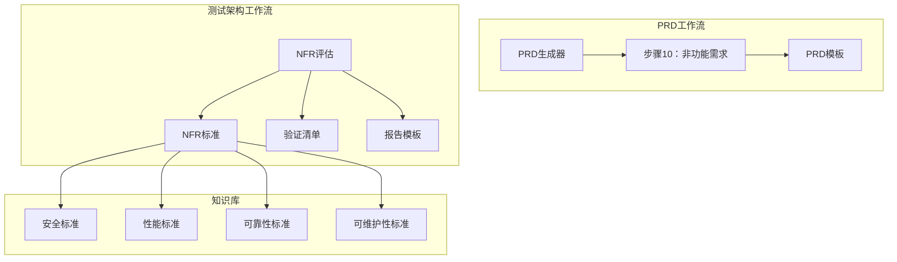
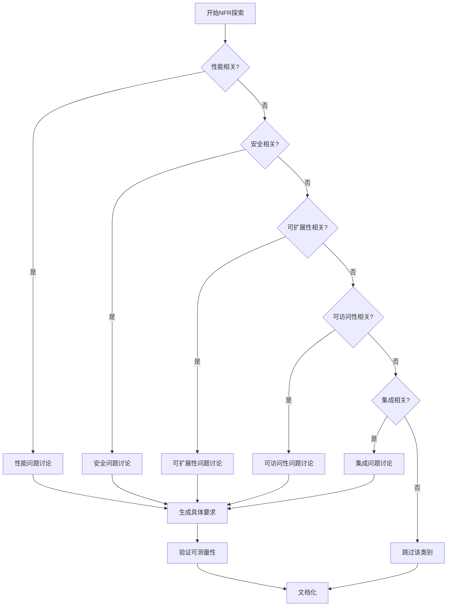
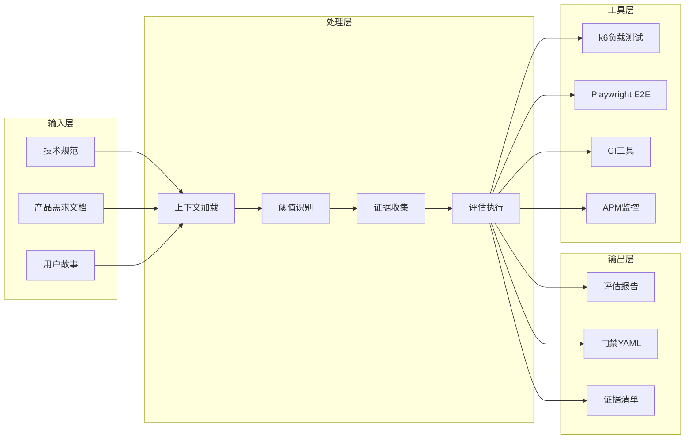
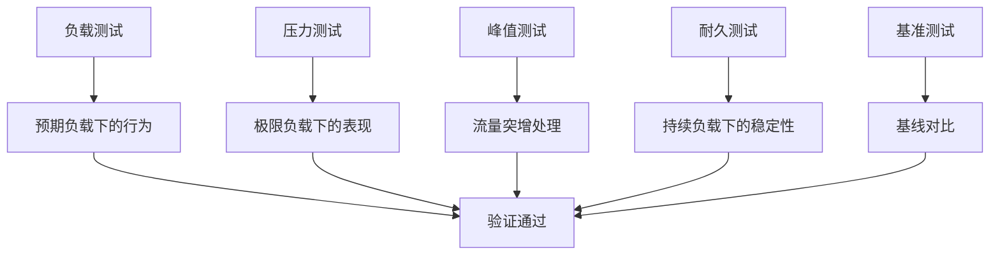
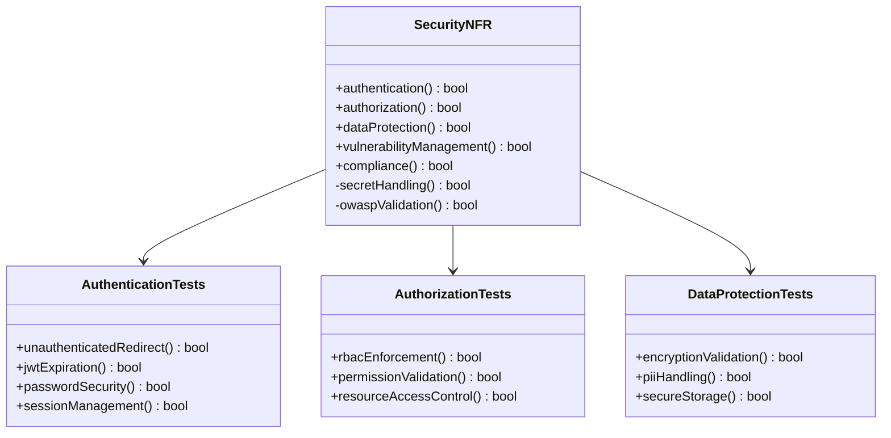
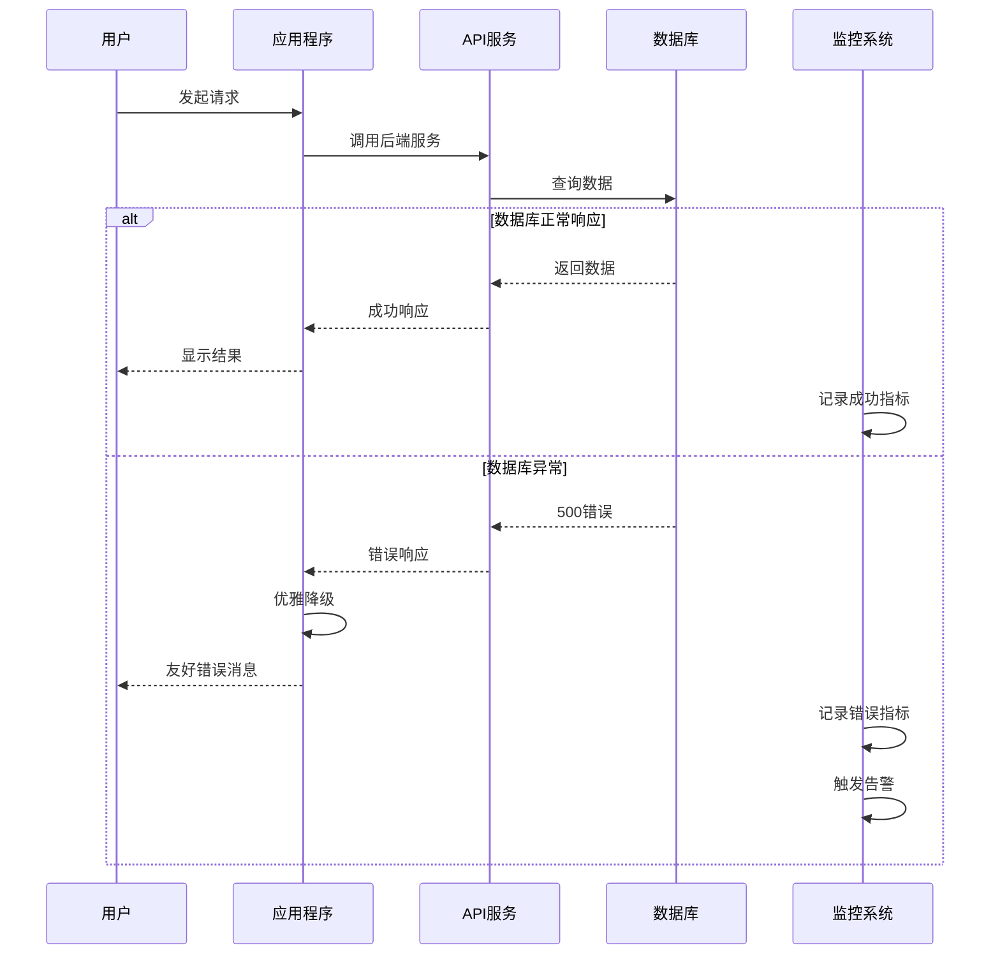
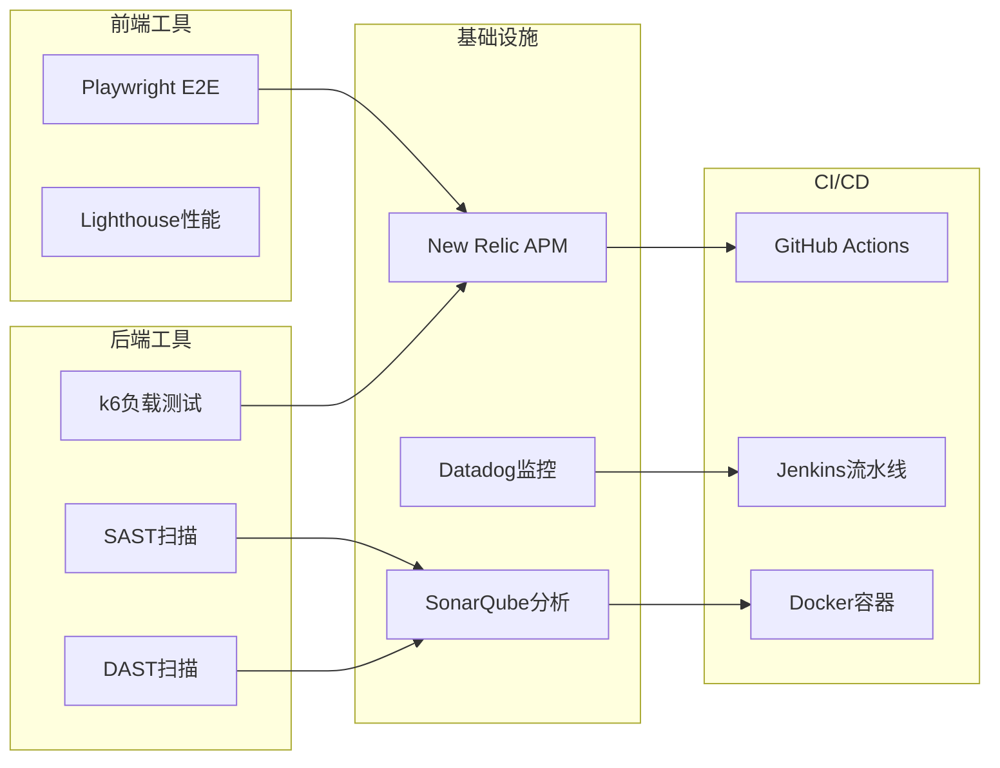
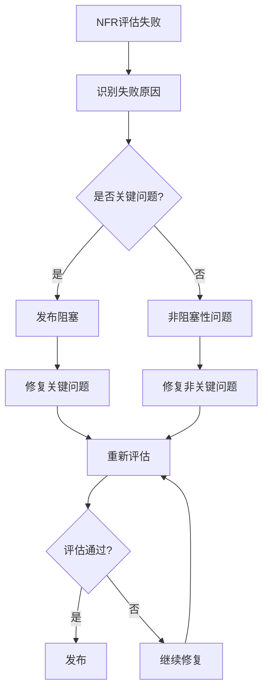

# 非功能需求规范

<cite>
**本文档引用的文件**
- [step-10-nonfunctional.md](file://src/modules/bmm/workflows/2-plan-workflows/prd/steps/step-10-nonfunctional.md)
- [prd-template.md](file://src/modules/bmm/workflows/2-plan-workflows/prd/prd-template.md)
- [nfr-criteria.md](file://src/modules/bmm/testarch/knowledge/nfr-criteria.md)
- [instructions.md](file://src/modules/bmm/workflows/testarch/nfr-assess/instructions.md)
- [checklist.md](file://src/modules/bmm/workflows/testarch/nfr-assess/checklist.md)
- [nfr-report-template.md](file://src/modules/bmm/workflows/testarch/nfr-assess/nfr-report-template.md)
</cite>

## 目录
1. [引言](#引言)
2. [项目结构概述](#项目结构概述)
3. [核心组件分析](#核心组件分析)
4. [架构概览](#架构概览)
5. [详细组件分析](#详细组件分析)
6. [依赖关系分析](#依赖关系分析)
7. [性能考虑](#性能考虑)
8. [故障排除指南](#故障排除指南)
9. [结论](#结论)

## 引言

BMAD（Brainstorming Methodology for Agile Development）方法论提供了一套完整的非功能需求（NFR）捕获和评估框架。该框架专注于通过自动化测试而非检查清单来验证安全、性能、可靠性和可维护性等非功能属性。本文档详细阐述了PRD工作流中性能、安全、可用性等非功能需求的捕获过程，以及如何在BMAD系统中实施这些要求。

## 项目结构概述

BMAD方法论采用模块化架构，将非功能需求处理分散到多个专门的工作流程中：

**图表来源**
- [step-10-nonfunctional.md](file://src/modules/bmm/workflows/2-plan-workflows/prd/steps/step-10-nonfunctional.md#L1-L50)
- [instructions.md](file://src/modules/bmm/workflows/testarch/nfr-assess/instructions.md#L1-L100)

**章节来源**
- [step-10-nonfunctional.md](file://src/modules/bmm/workflows/2-plan-workflows/prd/steps/step-10-nonfunctional.md#L1-L276)
- [prd-template.md](file://src/modules/bmm/workflows/2-plan-workflows/prd/prd-template.md#L1-L10)

## 核心组件分析

### 非功能需求捕获机制

BMAD系统中的非功能需求捕获遵循严格的执行规则和协作协议：

#### 执行规则体系

系统定义了五大强制执行规则：
- **完整性规则**：必须完整理解当前步骤文件才能继续
- **协作规则**：作为PM同行进行协作发现
- **选择性规则**：只记录对特定产品实际重要的NFR
- **验证规则**：通过自动化测试而非手动检查清单验证
- **工具匹配规则**：为每个NFR类别选择合适的工具

#### 探索框架

对于每个相关的NFR类别，系统会进行针对性的探索：

**图表来源**
- [step-10-nonfunctional.md](file://src/modules/bmm/workflows/2-plan-workflows/prd/steps/step-10-nonfunctional.md#L83-L134)

**章节来源**
- [step-10-nonfunctional.md](file://src/modules/bmm/workflows/2-plan-workflows/prd/steps/step-10-nonfunctional.md#L5-L45)

## 架构概览

### NFR评估架构

BMAD的NFR评估采用分层架构，每层负责不同的验证任务：

**图表来源**
- [instructions.md](file://src/modules/bmm/workflows/testarch/nfr-assess/instructions.md#L48-L100)
- [nfr-criteria.md](file://src/modules/bmm/testarch/knowledge/nfr-criteria.md#L660-L671)

## 详细组件分析

### 性能NFR评估

#### 性能标准定义

BMAD定义了明确的性能阈值和评估标准：

| 性能指标 | 默认阈值 | 评估标准 | 工具推荐 |
|---------|---------|---------|---------|
| 响应时间p95 | 500ms | 必须满足SLO/SLA | k6负载测试 |
| 吞吐量 | 100 RPS | 超出目标2.5倍 | 性能监控 |
| CPU使用率 | <70%平均 | 系统资源健康 | APM工具 |
| 内存使用率 | <80%最大 | 避免内存泄漏 | 监控告警 |

#### 性能测试层次

系统支持多种性能测试场景：

**图表来源**
- [nfr-criteria.md](file://src/modules/bmm/testarch/knowledge/nfr-criteria.md#L280-L289)

**章节来源**
- [instructions.md](file://src/modules/bmm/workflows/testarch/nfr-assess/instructions.md#L284-L308)
- [nfr-criteria.md](file://src/modules/bmm/testarch/knowledge/nfr-criteria.md#L280-L289)

### 安全NFR评估

#### 安全验证矩阵

BMAD建立了全面的安全验证框架：

**图表来源**
- [nfr-criteria.md](file://src/modules/bmm/testarch/knowledge/nfr-criteria.md#L22-L161)

#### 安全评估决策矩阵

| 安全类别 | PASS标准 | CONCERNS标准 | FAIL标准 |
|---------|---------|-------------|---------|
| 认证授权 | 全部测试通过 | 少量缺陷有修复计划 | 关键暴露或缺失控制 |
| 密钥处理 | 不泄露密码或错误信息 | 无严重安全漏洞 | 敏感数据泄露 |
| OWASP验证 | SQL注入和XSS防护 | 部分防护措施 | 攻击向量存在 |

**章节来源**
- [nfr-criteria.md](file://src/modules/bmm/testarch/knowledge/nfr-criteria.md#L22-L161)
- [instructions.md](file://src/modules/bmm/workflows/testarch/nfr-assess/instructions.md#L311-L335)

### 可靠性NFR评估

#### 可靠性验证要素

BMAD定义了多层次的可靠性验证标准：

**图表来源**
- [nfr-criteria.md](file://src/modules/bmm/testarch/knowledge/nfr-criteria.md#L292-L447)

#### 可靠性阈值标准

| 可靠性指标 | 默认阈值 | 评估标准 | 监控方式 |
|-----------|---------|---------|---------|
| 可用性 | >=99.9% | 三九可用性标准 | Uptime监控 |
| 错误率 | <0.1% | 千分之一错误率 | 错误日志分析 |
| 平均恢复时间 | <15分钟 | 快速故障恢复 | Incident管理 |
| CI稳定性 | 100连续成功 | 持续集成稳定 | 燃尽测试 |

**章节来源**
- [instructions.md](file://src/modules/bmm/workflows/testarch/nfr-assess/instructions.md#L338-L359)
- [nfr-criteria.md](file://src/modules/bmm/testarch/knowledge/nfr-criteria.md#L338-L447)

### 可维护性NFR评估

#### 可维护性验证框架

BMAD通过CI工具链验证代码质量和可维护性：

```mermaid
graph TB
subgraph "构建时检查"
Coverage[测试覆盖率≥80%]
Duplication[代码重复率<5%]
Vulnerabilities[无关键/高危漏洞]
end
subgraph "运行时验证"
Observability[可观测性验证]
Logging[结构化日志]
ErrorTracking[错误跟踪]
end
subgraph "质量度量"
CodeQuality[代码质量评分≥85/100]
TechnicalDebt[技术债务比率<5%]
Documentation[文档完整度≥90%]
end
Coverage --> Observability
Duplication --> Observability
Vulnerabilities --> Observability
Observability --> CodeQuality
Logging --> TechnicalDebt
ErrorTracking --> Documentation
```

**图表来源**
- [nfr-criteria.md](file://src/modules/bmm/testarch/knowledge/nfr-criteria.md#L449-L610)

**章节来源**
- [instructions.md](file://src/modules/bmm/workflows/testarch/nfr-assess/instructions.md#L365-L388)
- [nfr-criteria.md](file://src/modules/bmm/testarch/knowledge/nfr-criteria.md#L449-L610)

## 依赖关系分析

### 工具链集成

BMAD的NFR评估依赖于完善的工具链集成：

**图表来源**
- [nfr-criteria.md](file://src/modules/bmm/testarch/knowledge/nfr-criteria.md#L664-L669)

**章节来源**
- [nfr-criteria.md](file://src/modules/bmm/testarch/knowledge/nfr-criteria.md#L660-L671)

## 性能考虑

### 自动化验证的重要性

BMAD强调通过自动化测试验证非功能需求的重要性：

- **客观性**：避免主观判断，提供可重复的验证结果
- **一致性**：确保所有团队遵循相同的评估标准
- **效率**：减少手动检查的工作量和错误率
- **可追溯性**：提供完整的审计轨迹和证据链

### 阈值定义策略

系统采用渐进式阈值定义策略：

1. **从技术规范提取**：优先使用已定义的阈值
2. **从PRD推导**：根据产品目标推断性能要求
3. **使用默认值**：当阈值未定义时使用行业标准
4. **标记为CONCERNS**：无法确定阈值时强制澄清

## 故障排除指南

### 常见问题诊断

#### NFR评估失败处理

当NFR评估失败时，系统提供详细的诊断和修复指导：

**图表来源**
- [instructions.md](file://src/modules/bmm/workflows/testarch/nfr-assess/instructions.md#L474-L497)

#### 证据收集问题解决

当缺乏必要证据时，系统提供证据缺口清单和建议：

- **自动识别缺失证据**：列出所有需要但缺失的证据
- **分配责任人**：为每个证据缺口指定负责人
- **提供证据来源建议**：指导如何生成所需证据
- **设置截止日期**：确保问题及时解决

**章节来源**
- [instructions.md](file://src/modules/bmm/workflows/testarch/nfr-assess/instructions.md#L687-L708)
- [checklist.md](file://src/modules/bmm/workflows/testarch/nfr-assess/checklist.md#L383-L406)

## 结论

BMAD方法论提供了一个全面而实用的非功能需求规范框架。通过自动化测试、明确的评估标准和可操作的修复建议，该框架能够有效确保软件产品的质量属性达到预期要求。

### 最佳实践总结

1. **选择性记录**：只记录对特定产品实际重要的非功能需求
2. **可测量性**：确保所有非功能需求都是可测量和可验证的
3. **工具匹配**：为每个NFR类别选择最适合的验证工具
4. **自动化优先**：优先使用自动化测试而非手动检查
5. **持续改进**：基于评估结果持续优化系统质量

### 实施建议

- **渐进式采用**：从最关键的NFR类别开始逐步推广
- **团队培训**：确保团队成员理解NFR评估的重要性和方法
- **工具集成**：将NFR评估工具集成到现有的CI/CD流水线中
- **持续监控**：建立长期的NFR监控和改进机制

通过遵循BMAD的非功能需求规范，组织能够建立更加可靠、安全和高性能的软件系统，同时确保开发过程的质量和可预测性。