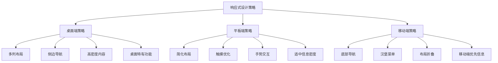
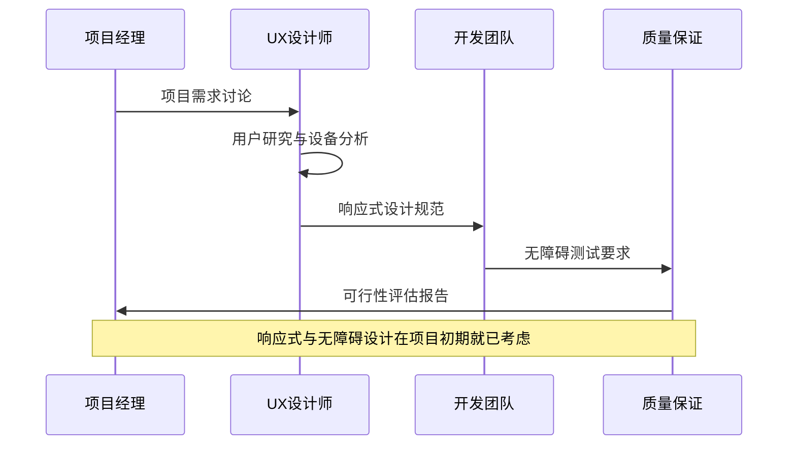
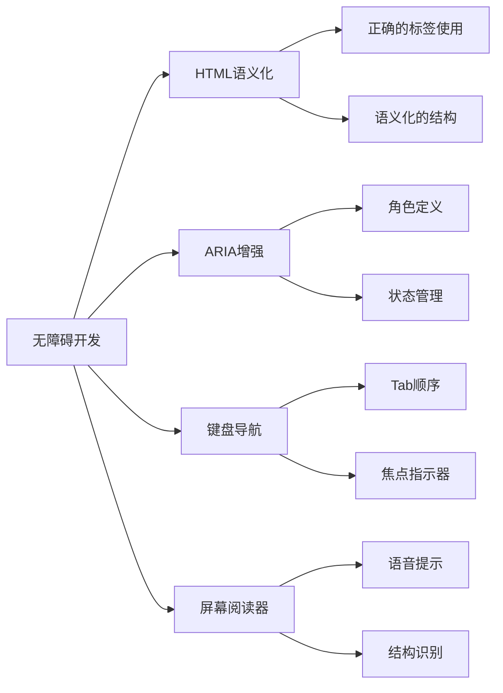
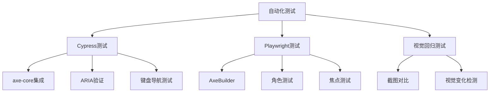
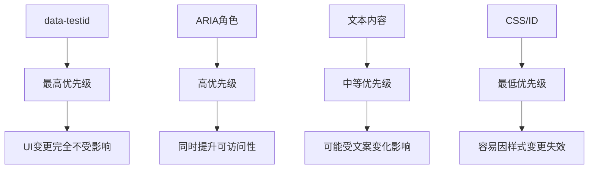

# 响应式与无障碍设计

<cite>
**本文档引用的文件**
- [step-13-responsive-accessibility.md](file://src/modules/bmm/workflows/2-plan-workflows/create-ux-design/steps/step-13-responsive-accessibility.md)
- [step-02-discovery.md](file://src/modules/bmm/workflows/2-plan-workflows/create-ux-design/steps/step-02-discovery.md)
- [step-01-init.md](file://src/modules/bmm/workflows/2-plan-workflows/create-ux-design/steps/step-01-init.md)
- [component-tdd.md](file://src/modules/bmm/testarch/knowledge/component-tdd.md)
- [selector-resilience.md](file://src/modules/bmm/testarch/knowledge/selector-resilience.md)
- [checklist.md](file://src/modules/bmm/workflows/testarch/automate/checklist.md)
- [instructions.md](file://src/modules/bmm/workflows/testarch/automate/instructions.md)
</cite>

## 目录
1. [引言](#引言)
2. [项目结构概述](#项目结构概述)
3. [响应式设计核心概念](#响应式设计核心概念)
4. [无障碍设计标准与实践](#无障碍设计标准与实践)
5. [工作流程集成策略](#工作流程集成策略)
6. [技术实现指南](#技术实现指南)
7. [测试与验证体系](#测试与验证体系)
8. [最佳实践与检查清单](#最佳实践与检查清单)
9. [总结与建议](#总结与建议)

## 引言

在BMAD方法论中，响应式与无障碍设计是确保产品成功的关键质量属性。本文档基于BMAD框架的step-13-responsive-accessibility.md文件，系统化地阐述了如何在产品开发过程中全面考虑跨设备适应性和可访问性需求。

响应式设计确保产品能够在各种屏幕尺寸和设备类型上提供一致的用户体验，而无障碍设计则致力于为所有用户提供平等的访问机会，包括残障人士。这两个方面不仅影响用户体验，也是法律合规和企业社会责任的重要组成部分。

## 项目结构概述

BMAD方法论采用模块化的工作流程架构，其中响应式与无障碍设计贯穿于整个UX设计过程：

```mermaid
graph TB
subgraph "UX设计工作流程"
A[step-01-init 初始化] --> B[step-02-discovery 发现]
B --> C[step-03-core-experience 核心体验]
C --> D[step-04-visual-design 视觉设计]
D --> E[step-05-interaction-design 交互设计]
E --> F[step-06-information-architecture 信息架构]
F --> G[step-07-navigation-design 导航设计]
G --> H[step-08-content-strategy 内容策略]
H --> I[step-09-design-direction 设计方向]
I --> J[step-10-style-guide 样式指南]
J --> K[step-11-component-library 组件库]
K --> L[step-12-usability-testing 可用性测试]
L --> M[step-13-responsive-accessibility 响应式与无障碍]
M --> N[step-14-complete 完成]
end
```



**图表来源**
- [step-01-init.md](file://src/modules/bmm/workflows/2-plan-workflows/create-ux-design/steps/step-01-init.md#L1-L160)
- [step-02-discovery.md](file://src/modules/bmm/workflows/2-plan-workflows/create-ux-design/steps/step-02-discovery.md#L1-L210)

**章节来源**
- [step-01-init.md](file://src/modules/bmm/workflows/2-plan-workflows/create-ux-design/steps/step-01-init.md#L1-L160)
- [step-02-discovery.md](file://src/modules/bmm/workflows/2-plan-workflows/create-ux-design/steps/step-02-discovery.md#L1-L210)

## 响应式设计核心概念

### 断点策略与移动优先设计

BMAD方法论强调移动端优先的设计原则，这是现代响应式设计的核心理念：

#### 标准断点定义

| 设备类型 | 屏幕宽度范围 | 设计重点 |
|---------|-------------|---------|
| 移动设备 | 320px - 767px | 单列布局，触摸优化 |
| 平板设备 | 768px - 1023px | 简化布局，手势支持 |
| 桌面设备 | 1024px+ | 多列布局，功能丰富 |

#### 响应式设计策略矩阵



**图表来源**
- [step-13-responsive-accessibility.md](file://src/modules/bmm/workflows/2-plan-workflows/create-ux-design/steps/step-13-responsive-accessibility.md#L50-L74)

### 流式布局与弹性网格

响应式设计的核心在于使用相对单位和弹性布局系统：

- **相对单位优先**：使用rem、%、vw、vh替代固定像素值
- **弹性盒子**：利用Flexbox实现灵活的布局排列
- **网格系统**：建立基于断点的响应式网格框架
- **图片优化**：使用srcset和picture元素提供多分辨率图像

**章节来源**
- [step-13-responsive-accessibility.md](file://src/modules/bmm/workflows/2-plan-workflows/create-ux-design/steps/step-13-responsive-accessibility.md#L50-L92)

## 无障碍设计标准与实践

### WCAG标准遵循

BMAD方法论严格遵循Web内容无障碍指南（WCAG）标准：

#### WCAG级别对比

| WCAG级别 | 要求程度 | 适用场景 | 实现难度 |
|---------|---------|---------|---------|
| A级 | 基础无障碍 | 法律合规最低要求 | 较低 |
| AA级 | 行业标准 | 推荐的用户体验 | 中等 |
| AAA级 | 最高无障碍 | 特殊场景需求 | 较高 |

#### 关键无障碍考虑因素

```mermaid
mindmap
root((无障碍设计))
语义化HTML
标签语义化
结构清晰
导航逻辑
ARIA标签
角色定义
属性标注
状态管理
键盘导航
Tab顺序
快捷键
焦点管理
屏幕阅读器
兼容性
语音提示
结构识别
视觉设计
对比度
字体大小
颜色使用
```

**图表来源**
- [step-13-responsive-accessibility.md](file://src/modules/bmm/workflows/2-plan-workflows/create-ux-design/steps/step-13-responsive-accessibility.md#L93-L115)

### 语义化HTML与ARIA应用

#### 语义化HTML最佳实践

- **标题层次**：正确使用h1-h6标签建立文档结构
- **列表标记**：使用ul、ol、dl准确表达数据关系
- **表单元素**：合理使用label、fieldset、legend增强可访问性
- **链接描述**：提供有意义的链接文本而非"点击这里"

#### ARIA角色与属性配置

| ARIA角色 | 使用场景 | 注意事项 |
|---------|---------|---------|
| `role="navigation"` | 导航区域 | 应包含主要导航链接 |
| `role="banner"` | 页面头部 | 包含网站标识和主要导航 |
| `role="main"` | 主要内容区 | 每页只能有一个 |
| `role="complementary"` | 附加内容 | 提供补充信息 |
| `role="alert"` | 错误通知 | 自动朗读给屏幕阅读器 |

**章节来源**
- [step-13-responsive-accessibility.md](file://src/modules/bmm/workflows/2-plan-workflows/create-ux-design/steps/step-13-responsive-accessibility.md#L93-L140)

## 工作流程集成策略

### 早期阶段集成

响应式与无障碍设计需要从项目初期就开始考虑：

#### 发现阶段的考虑要点



**图表来源**
- [step-02-discovery.md](file://src/modules/bmm/workflows/2-plan-workflows/create-ux-design/steps/step-02-discovery.md#L80-L92)
- [step-13-responsive-accessibility.md](file://src/modules/bmm/workflows/2-plan-workflows/create-ux-design/steps/step-13-responsive-accessibility.md#L37-L43)

#### 初始化阶段的关键检查点

- **设备调研**：了解目标用户的设备使用习惯
- **平台要求**：明确各平台的响应式设计标准
- **用户画像**：考虑不同能力用户的需求差异
- **法律合规**：评估相关无障碍法规要求

**章节来源**
- [step-01-init.md](file://src/modules/bmm/workflows/2-plan-workflows/create-ux-design/steps/step-01-init.md#L55-L92)
- [step-02-discovery.md](file://src/modules/bmm/workflows/2-plan-workflows/create-ux-design/steps/step-02-discovery.md#L66-L92)

## 技术实现指南

### 开发阶段的实施策略

#### 响应式开发原则

1. **移动优先**：先设计小屏幕，再扩展到大屏幕
2. **渐进增强**：基础功能在所有设备上可用
3. **优雅降级**：高级功能在不支持的环境中正常工作
4. **性能优化**：针对不同设备优化资源加载

#### 无障碍开发规范



**图表来源**
- [component-tdd.md](file://src/modules/bmm/testarch/knowledge/component-tdd.md#L1-L50)

### 组件测试驱动开发

BMAD方法论采用组件级别的TDD（测试驱动开发）来确保无障碍特性：

#### 红绿重构循环

1. **红色阶段**：编写失败的无障碍测试
2. **绿色阶段**：实现最小可行的无障碍功能
3. **重构阶段**：优化代码质量和用户体验
4. **扩展阶段**：添加更多无障碍场景测试

**章节来源**
- [component-tdd.md](file://src/modules/bmm/testarch/knowledge/component-tdd.md#L1-L100)

## 测试与验证体系

### 自动化测试策略

#### 可访问性自动化测试

BMAD提供了完整的自动化可访问性测试工具链：



**图表来源**
- [component-tdd.md](file://src/modules/bmm/testarch/knowledge/component-tdd.md#L267-L370)

#### 测试覆盖矩阵

| 测试类型 | 覆盖范围 | 优先级 | 执行频率 |
|---------|---------|-------|---------|
| 可访问性扫描 | WCAG合规性 | P0 | 每次提交 |
| 键盘导航 | 所有交互元素 | P0 | 每次提交 |
| 屏幕阅读器测试 | 核心功能路径 | P1 | 每日 |
| 色彩对比度 | 文本和界面元素 | P1 | 每日 |
| 触摸目标测试 | 移动端交互 | P2 | 每周 |

### 手动测试与用户验证

#### 用户测试计划

- **真实用户测试**：邀请残障用户参与产品测试
- **辅助技术测试**：验证与各种辅助技术的兼容性
- **设备专项测试**：在不同设备上验证响应式效果
- **长时间使用测试**：评估长时间使用的舒适度

**章节来源**
- [step-13-responsive-accessibility.md](file://src/modules/bmm/workflows/2-plan-workflows/create-ux-design/steps/step-13-responsive-accessibility.md#L117-L140)

## 最佳实践与检查清单

### 选择器韧性指南

BMAD强调选择器的韧性原则，这对无障碍测试至关重要：

#### 选择器优先级层次



**图表来源**
- [selector-resilience.md](file://src/modules/bmm/testarch/knowledge/selector-resilience.md#L1-L50)

#### 测试质量保证清单

根据BMAD的测试架构知识，以下是关键的质量保证检查点：

- **测试隔离性**：每个测试独立运行，无状态污染
- **确定性测试**：结果可预测，无随机性
- **自清理机制**：测试后自动清理环境
- **可读性**：测试代码清晰易懂
- **维护性**：易于修改和扩展

**章节来源**
- [checklist.md](file://src/modules/bmm/workflows/testarch/automate/checklist.md#L44-L467)
- [instructions.md](file://src/modules/bmm/workflows/testarch/automate/instructions.md#L128-L1324)

### 实施检查清单

#### 响应式设计检查清单

- [ ] 断点定义符合行业标准
- [ ] 移动优先设计原则得到贯彻
- [ ] 图片和媒体元素响应式处理
- [ ] 字体和间距在不同设备上合适
- [ ] 触摸目标大小符合标准

#### 无障碍设计检查清单

- [ ] HTML语义化结构完整
- [ ] ARIA标签使用正确
- [ ] 键盘导航路径完整
- [ ] 屏幕阅读器兼容性良好
- [ ] 色彩对比度满足WCAG要求
- [ ] 焦点指示器清晰可见

## 总结与建议

BMAD方法论为响应式与无障碍设计提供了一个系统化的方法论框架。通过将这些设计原则融入到项目的工作流程中，可以确保产品在发布时就具备良好的跨设备适应性和可访问性。

### 关键成功因素

1. **早期集成**：在项目初期就考虑响应式和无障碍需求
2. **持续测试**：建立自动化测试流水线，确保质量持续改进
3. **用户参与**：真实用户反馈是验证设计效果的最佳方式
4. **团队协作**：设计师、开发者、测试人员的紧密配合
5. **标准遵循**：严格遵循WCAG等国际标准

### 实施建议

- **培训投入**：为团队提供响应式设计和无障碍设计的专业培训
- **工具支持**：投资合适的开发和测试工具
- **文档维护**：保持设计规范和测试文档的及时更新
- **持续改进**：根据用户反馈和技术发展不断优化设计

通过遵循BMAD方法论的响应式与无障碍设计指导原则，团队可以创建出既美观又实用、既创新又包容的产品，真正实现"让每个人都能使用我们的产品"这一愿景。