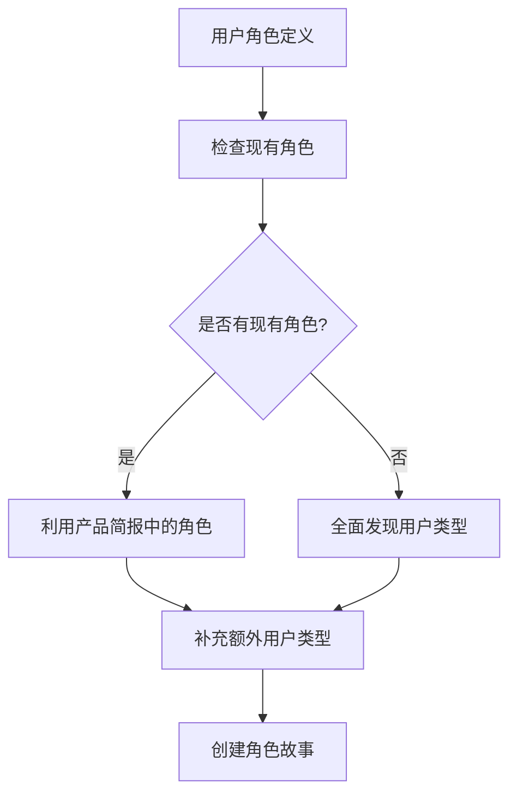
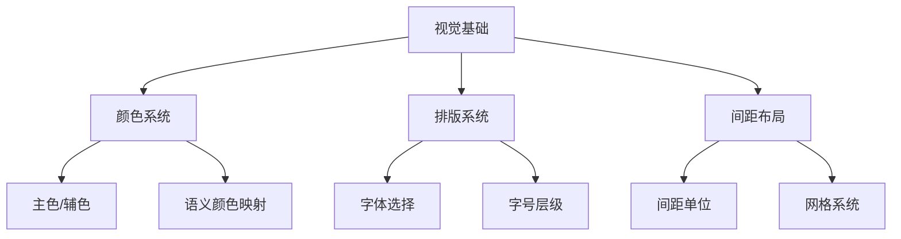
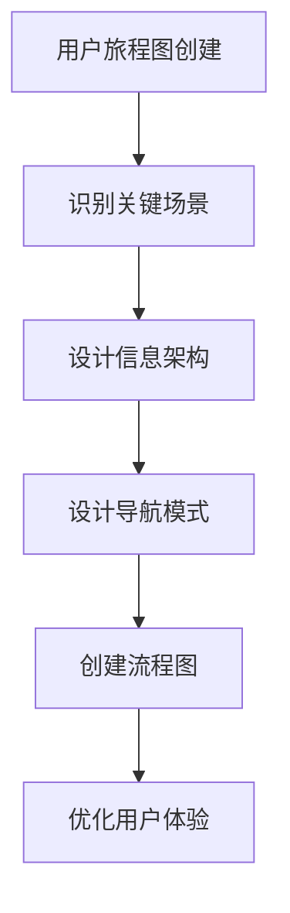

# 用户旅程与交互设计

<cite>
**本文档中引用的文件**  
- [step-10-user-journeys.md](file://src/modules/bmm/workflows/2-plan-workflows/create-ux-design/steps/step-10-user-journeys.md)
- [step-08-visual-foundation.md](file://src/modules/bmm/workflows/2-plan-workflows/create-ux-design/steps/step-08-visual-foundation.md)
- [step-09-design-directions.md](file://src/modules/bmm/workflows/2-plan-workflows/create-ux-design/steps/step-09-design-directions.md)
- [step-04-journeys.md](file://src/modules/bmm/workflows/2-plan-workflows/prd/steps/step-04-journeys.md)
- [prd-template.md](file://src/modules/bmm/workflows/2-plan-workflows/prd/prd-template.md)
- [workflow.md](file://src/modules/bmm/workflows/2-plan-workflows/prd/workflow.md)
- [create-ux-design/workflow.md](file://src/modules/bmm/workflows/2-plan-workflows/create-ux-design/workflow.md)
</cite>

## 目录
1. [引言](#引言)
2. [用户旅程建模方法论](#用户旅程建模方法论)
3. [视觉基础与设计方向的整合](#视觉基础与设计方向的整合)
4. [用户旅程图创建指南](#用户旅程图创建指南)
5. [从用户旅程到交互设计](#从用户旅程到交互设计)
6. [案例研究：用户旅程到线框图的转化](#案例研究：用户旅程到线框图的转化)
7. [结论](#结论)

## 引言
本文档系统化地介绍了如何通过用户旅程映射来指导产品的交互设计。基于BMAD方法论中的工作流程，详细阐述了用户旅程建模的方法论，包括用户角色定义、触点识别、痛点分析和机会点挖掘。文档解释了如何将用户旅程与视觉基础和设计方向相结合，确保交互设计与整体设计语言的一致性。通过实际案例展示如何将用户旅程洞察转化为具体的线框图和交互原型，并与PRD文档中的功能需求相对应。

## 用户旅程建模方法论

用户旅程建模是产品设计过程中的关键环节，它帮助团队理解用户与产品交互的全过程。在BMAD方法论中，用户旅程建模分为两个主要阶段：PRD阶段的用户旅程映射和UX设计阶段的用户旅程流程设计。

### 用户角色定义
用户角色定义是用户旅程建模的起点。在PRD工作流程的第4步（用户旅程映射）中，系统首先检查输入文档中的现有用户角色，然后识别需要补充的额外用户类型。用户角色不仅包括主要用户，还应涵盖管理员、支持人员、API消费者等所有与系统交互的用户类型。

**图源**  
- [step-04-journeys.md](file://src/modules/bmm/workflows/2-plan-workflows/prd/steps/step-04-journeys.md#L52-L87)

### 触点识别
触点识别是用户旅程建模的核心环节。每个用户与系统的交互点都需要被详细记录和分析。在PRD阶段，系统通过叙事式旅程映射来识别触点，将用户旅程视为一个故事，包含开场场景、上升行动、高潮和结局。

### 痛点分析和机会点挖掘
痛点分析和机会点挖掘是用户旅程建模的重要产出。通过分析用户在每个触点的体验，可以识别出用户可能遇到的困难和障碍，同时发现改进产品的机会。在UX设计阶段，这些痛点和机会点将直接指导交互设计的优化。

**本节来源**  
- [step-04-journeys.md](file://src/modules/bmm/workflows/2-plan-workflows/prd/steps/step-04-journeys.md#L88-L122)

## 视觉基础与设计方向的整合

用户旅程设计需要与视觉基础和设计方向紧密结合，以确保最终产品在功能和形式上的统一性。

### 视觉基础的建立
视觉基础的建立包括颜色系统、排版系统和间距布局三个主要方面。在UX设计工作流程的第8步中，系统首先评估品牌指南，然后建立相应的视觉设计基础。

**图源**  
- [step-08-visual-foundation.md](file://src/modules/bmm/workflows/2-plan-workflows/create-ux-design/steps/step-08-visual-foundation.md#L48-L124)

### 设计方向的确定
设计方向的确定是连接视觉基础和用户旅程的关键环节。在UX设计工作流程的第9步中，系统生成6-8个不同的设计方向变体，探索不同的布局方法、交互模式和视觉权重。

### 一致性维护
为确保交互设计与整体设计语言的一致性，系统在设计过程中遵循以下原则：
- 所有设计决策都基于已建立的视觉基础
- 设计方向的选择考虑用户旅程的需求
- 交互模式与视觉风格相匹配

**本节来源**  
- [step-08-visual-foundation.md](file://src/modules/bmm/workflows/2-plan-workflows/create-ux-design/steps/step-08-visual-foundation.md#L48-L124)
- [step-09-design-directions.md](file://src/modules/bmm/workflows/2-plan-workflows/create-ux-design/steps/step-09-design-directions.md#L48-L124)

## 用户旅程图创建指南

用户旅程图是将用户旅程可视化的重要工具，它帮助团队更好地理解用户与产品的交互过程。

### 关键交互场景识别
在创建用户旅程图之前，需要首先识别关键交互场景。这些场景通常包括：
- 用户开始旅程的入口点
- 用户需要做出重要决策的节点
- 用户可能遇到错误或困惑的环节
- 用户达成目标的成功路径

### 信息架构设计
信息架构设计是用户旅程图的重要组成部分。它包括：
- 内容的组织方式
- 导航结构
- 信息的层级关系
- 用户获取信息的路径

### 导航模式设计
导航模式设计需要考虑用户的使用习惯和心理模型。常见的导航模式包括：
- 顶部导航
- 侧边栏导航
- 面包屑导航
- 标签式导航

**图源**  
- [step-10-user-journeys.md](file://src/modules/bmm/workflows/2-plan-workflows/create-ux-design/steps/step-10-user-journeys.md#L48-L143)

**本节来源**  
- [step-10-user-journeys.md](file://src/modules/bmm/workflows/2-plan-workflows/create-ux-design/steps/step-10-user-journeys.md#L48-L143)

## 从用户旅程到交互设计

将用户旅程洞察转化为具体的交互设计是产品开发的关键步骤。

### 流程优化原则
在将用户旅程转化为交互设计时，需要遵循以下优化原则：
- 最小化到达价值的步骤
- 减少每个决策点的认知负荷
- 提供清晰的反馈和进度指示
- 创建令人愉悦或有成就感的时刻
- 优雅地处理边缘情况和错误恢复

### 交互模式提取
通过分析多个用户旅程，可以提取出可重用的交互模式，包括：
- 导航模式
- 决策模式
- 反馈模式
- 错误处理模式

这些模式将确保所有用户体验的一致性。

**本节来源**  
- [step-10-user-journeys.md](file://src/modules/bmm/workflows/2-plan-workflows/create-ux-design/steps/step-10-user-journeys.md#L103-L143)

## 案例研究：用户旅程到线框图的转化

本案例研究展示了如何将用户旅程洞察转化为具体的线框图和交互原型。

### PRD用户旅程到UX流程的转化
在PRD阶段创建的叙事式用户旅程为UX设计提供了基础。UX设计师需要将这些故事性的描述转化为具体的交互流程。

### 功能需求对应
每个用户旅程中的关键触点都对应着PRD文档中的具体功能需求。通过建立这种对应关系，可以确保设计覆盖所有必要的功能。

### 原型验证
创建的线框图和交互原型需要与用户旅程进行验证，确保：
- 所有关键场景都已覆盖
- 用户痛点得到解决
- 机会点得到充分利用
- 与视觉基础保持一致

**本节来源**  
- [step-10-user-journeys.md](file://src/modules/bmm/workflows/2-plan-workflows/create-ux-design/steps/step-10-user-journeys.md#L48-L143)
- [step-04-journeys.md](file://src/modules/bmm/workflows/2-plan-workflows/prd/steps/step-04-journeys.md#L88-L122)

## 结论
用户旅程映射是指导产品交互设计的重要方法论。通过系统化的用户角色定义、触点识别、痛点分析和机会点挖掘，团队可以深入理解用户需求。将用户旅程与视觉基础和设计方向相结合，可以确保交互设计与整体设计语言的一致性。创建用户旅程图的指南帮助团队识别关键交互场景、设计信息架构和导航模式。最后，通过实际案例展示了如何将用户旅程洞察转化为具体的线框图和交互原型，并与PRD文档中的功能需求相对应。这一系统化的方法有助于创建以用户为中心、功能完整且视觉一致的产品。