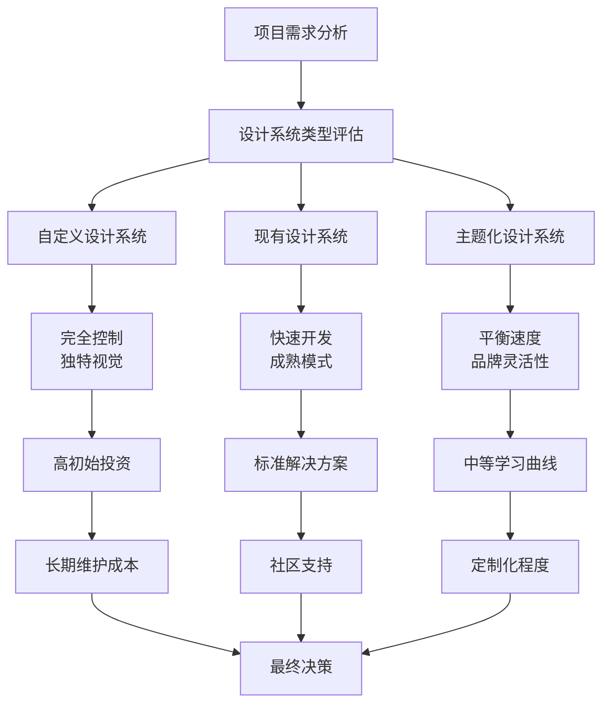
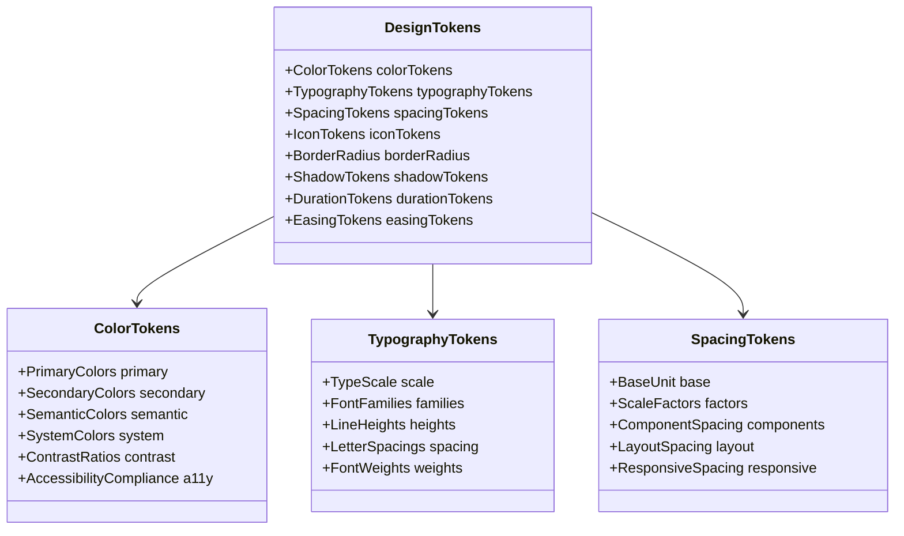
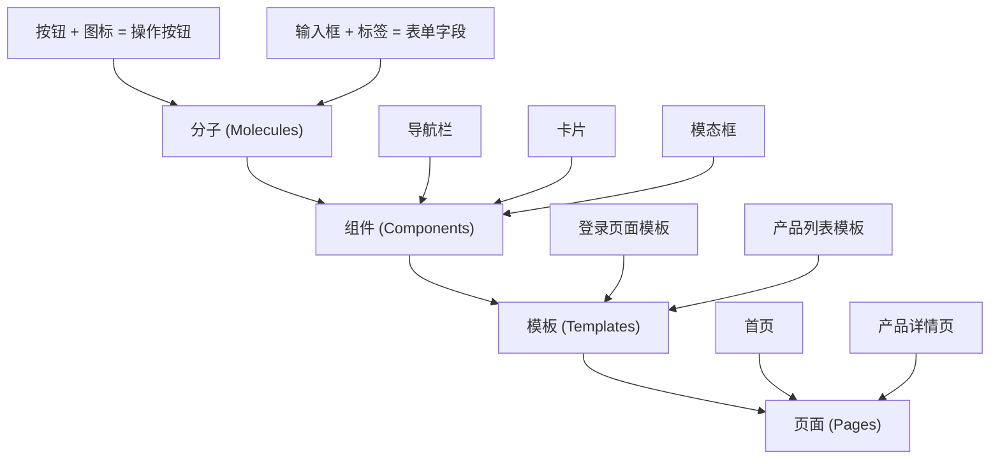
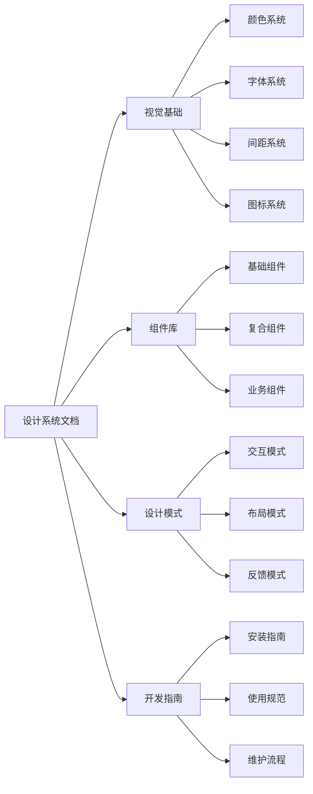
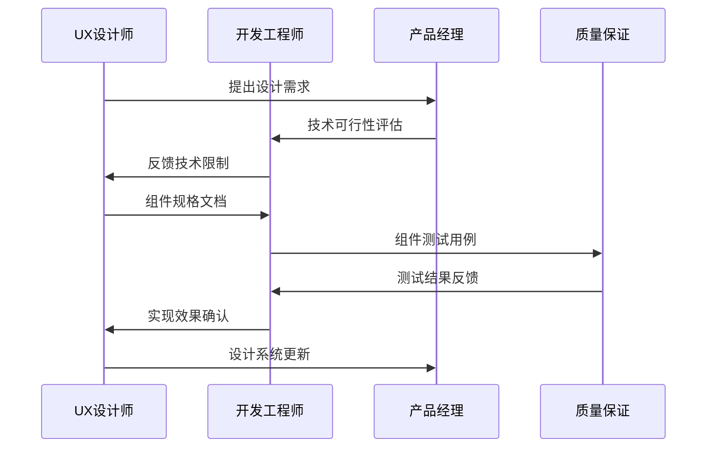

# 设计系统与组件策略

<cite>
**本文档引用的文件**
- [step-06-design-system.md](file://src/modules/bmm/workflows/2-plan-workflows/create-ux-design/steps/step-06-design-system.md)
- [step-11-component-strategy.md](file://src/modules/bmm/workflows/2-plan-workflows/create-ux-design/steps/step-11-component-strategy.md)
- [step-12-ux-patterns.md](file://src/modules/bmm/workflows/2-plan-workflows/create-ux-design/steps/step-12-ux-patterns.md)
- [ux-design-template.md](file://src/modules/bmm/workflows/2-plan-workflows/create-ux-design/ux-design-template.md)
- [step-08-visual-foundation.md](file://src/modules/bmm/workflows/2-plan-workflows/create-ux-design/steps/step-08-visual-foundation.md)
- [step-09-design-directions.md](file://src/modules/bmm/workflows/2-plan-workflows/create-ux-design/steps/step-09-design-directions.md)
</cite>

## 目录
1. [引言](#引言)
2. [设计系统基础](#设计系统基础)
3. [设计令牌与视觉基础](#设计令牌与视觉基础)
4. [组件策略制定](#组件策略制定)
5. [UX模式库建立](#ux模式库建立)
6. [设计系统文档化](#设计系统文档化)
7. [团队协作与一致性](#团队协作与一致性)
8. [最佳实践与建议](#最佳实践与建议)
9. [总结](#总结)

## 引言

设计系统是现代软件开发中的核心基础设施，它为产品的一致性、可维护性和开发效率提供了坚实的基础。本文档基于BMAD方法论中的设计系统与组件策略工作流程，深入探讨如何构建可复用的设计系统和组件库，确保设计与开发的一致性，并通过系统化的方法提高团队协作效率。

设计系统不仅仅是视觉元素的集合，更是整个产品设计语言的体现，包括颜色、字体、间距、图标等设计令牌的定义与管理，以及基于原子设计原则的组件分类和复用策略。

## 设计系统基础

### 设计系统选择框架

设计系统的选择是一个战略性决策，需要综合考虑项目需求、团队能力、技术约束等多个因素。BMAD方法论提供了系统化的设计系统选择框架：



**图表来源**
- [step-06-design-system.md](file://src/modules/bmm/workflows/2-plan-workflows/create-ux-design/steps/step-06-design-system.md#L50-L119)

### 设计系统选项详解

#### 1. 自定义设计系统
- **优势**: 完全的视觉独特性，对每个组件的完全控制
- **适用场景**: 建立品牌的独特需求，已有明确视觉识别的品牌
- **挑战**: 高初始开发成本，需要完整的组件库和文档

#### 2. 现有设计系统（如Material Design、Ant Design）
- **优势**: 快速开发，内置的可访问性支持，成熟的模式
- **适用场景**: 启动项目，内部工具，需要快速交付的产品
- **考虑因素**: 视觉差异化程度，品牌契合度

#### 3. 主题化设计系统（如MUI、Chakra UI、Tailwind UI）
- **优势**: 强大的基础，良好的可定制性，平衡的速度与独特性
- **适用场景**: 需要快速原型但保持一定品牌特色的项目
- **学习曲线**: 中等，需要理解主题化概念

**章节来源**
- [step-06-design-system.md](file://src/modules/bmm/workflows/2-plan-workflows/create-ux-design/steps/step-06-design-system.md#L50-L119)

## 设计令牌与视觉基础

### 设计令牌体系

设计令牌是设计系统的核心，它们定义了产品中所有视觉元素的基础参数。BMAD方法论强调建立完整的设计令牌体系：



**图表来源**
- [step-08-visual-foundation.md](file://src/modules/bmm/workflows/2-plan-workflows/create-ux-design/steps/step-08-visual-foundation.md#L77-L148)

### 视觉基础要素

#### 颜色系统
颜色系统是设计语言的重要组成部分，需要考虑：
- **语义化颜色映射**: 主色、辅助色、成功、警告、错误等
- **对比度合规性**: 确保可访问性要求得到满足
- **色彩心理学**: 颜色对用户情感的影响
- **品牌一致性**: 与现有品牌指南的协调

#### 字体系统
字体系统建立清晰的层级关系：
- **字体选择**: 主字体和辅助字体的搭配
- **字号体系**: 标题、正文、辅助文本的层级
- **行高与间距**: 可读性和阅读体验
- **响应式排版**: 不同设备上的字体适配

#### 间距与布局
间距系统确保界面元素的合理分布：
- **基础间距单位**: 4px、8px、12px等基准值
- **网格系统**: 布局的基础结构
- **组件间距**: 元素之间的相对距离
- **响应式间距**: 移动端的特殊考虑

**章节来源**
- [step-08-visual-foundation.md](file://src/modules/bmm/workflows/2-plan-workflows/create-ux-design/steps/step-08-visual-foundation.md#L77-L148)

## 组件策略制定

### 原子设计原则应用

BMAD方法论采用原子设计原则来组织组件层次结构：



**图表来源**
- [step-11-component-strategy.md](file://src/modules/bmm/workflows/2-plan-workflows/create-ux-design/steps/step-11-component-strategy.md#L50-L130)

### 组件分类与复用策略

#### 基础组件（Foundation Components）
来自设计系统的现成组件：
- **按钮系统**: 基础按钮、链接、状态变体
- **表单控件**: 输入框、选择器、验证反馈
- **布局容器**: 卡片、面板、网格系统
- **导航组件**: 导航栏、面包屑、侧边栏

#### 自定义组件（Custom Components）
根据项目需求设计的组件：
- **业务特定组件**: 订单状态、评分系统、购物车
- **交互增强组件**: 拖拽排序、富文本编辑器
- **数据展示组件**: 图表、表格、仪表板
- **用户体验组件**: 提示框、引导教程、加载状态

### 组件规格文档化

每个组件都需要详细的规格文档：

```markdown
### 组件名称

**用途**: 清晰的用途描述  
**使用场景**: 何时以及如何使用该组件  
**组成**: 视觉分解部分  
**状态**: 所有可能的状态及描述  
**变体**: 不同尺寸或样式（如适用）  
**可访问性**: ARIA标签、键盘导航支持  
**内容指导**: 最佳内容格式  
**交互行为**: 用户如何与之交互
```

**章节来源**
- [step-11-component-strategy.md](file://src/modules/bmm/workflows/2-plan-workflows/create-ux-design/steps/step-11-component-strategy.md#L86-L130)

### 实施路线图规划

组件实施需要分阶段进行：

#### 第一阶段 - 核心组件
- **优先级**: 关键用户流程必需的组件
- **目标**: 支撑主要功能实现
- **示例**: 导航、表单、数据展示

#### 第二阶段 - 支持组件
- **优先级**: 增强用户体验的组件
- **目标**: 提升产品可用性
- **示例**: 搜索、过滤、排序

#### 第三阶段 - 增强组件
- **优先级**: 特殊功能和优化
- **目标**: 完善产品体验
- **示例**: 动画、高级交互、个性化

**章节来源**
- [step-11-component-strategy.md](file://src/modules/bmm/workflows/2-plan-workflows/create-ux-design/steps/step-11-component-strategy.md#L128-L147)

## UX模式库建立

### 模式分类体系

UX模式库是对常见用户交互模式的标准化定义：

```mermaid
mindmap
root((UX模式库))
按钮层次
主要操作
次要操作
危险操作
辅助功能
反馈模式
成功提示
错误信息
警告提醒
信息通知
表单模式
输入验证
错误处理
字段组合
条件显示
导航模式
顶部导航
侧边栏
面包屑
返回机制
模态模式
对话框
通知层
加载覆盖
全屏模式
状态模式
空状态
加载状态
错误状态
成功状态
```

**图表来源**
- [step-12-ux-patterns.md](file://src/modules/bmm/workflows/2-plan-workflows/create-ux-design/steps/step-12-ux-patterns.md#L50-L89)

### 关键模式定义

#### 按钮层次模式
- **视觉层次**: 主按钮最突出，次要按钮次之
- **行动优先级**: 明确区分主要和次要操作
- **错误恢复**: 危险操作需要确认机制
- **可访问性**: 确保键盘导航和屏幕阅读器支持

#### 反馈模式
- **即时反馈**: 操作后的立即响应
- **错误恢复**: 提供错误解决指导
- **进度指示**: 复杂操作的进度显示
- **成功确认**: 操作完成的明确标识

#### 表单模式
- **验证时机**: 实时验证vs提交时验证
- **错误展示**: 清晰的错误消息和位置
- **字段关联**: 相关字段的条件显示
- **移动优化**: 移动端的输入体验

**章节来源**
- [step-12-ux-patterns.md](file://src/modules/bmm/workflows/2-plan-workflows/create-ux-design/steps/step-12-ux-patterns.md#L67-L130)

### 模式文档化模板

每个UX模式都需要标准化的文档格式：

```markdown
### 模式类型

**使用时机**: 清晰的使用指南  
**视觉设计**: 应该如何呈现  
**行为**: 应该如何交互  
**可访问性**: A11y要求  
**移动端考虑**: 移动端特定需求  
**变体**: 不同状态或样式（如适用）
```

**章节来源**
- [step-12-ux-patterns.md](file://src/modules/bmm/workflows/2-plan-workflows/create-ux-design/steps/step-12-ux-patterns.md#L94-L165)

## 设计系统文档化

### 文档结构体系

设计系统文档应该采用结构化的组织方式：



**图表来源**
- [ux-design-template.md](file://src/modules/bmm/workflows/2-plan-workflows/create-ux-design/ux-design-template.md#L6-L14)

### 文档内容规范

#### 视觉设计基础
- **颜色系统**: 包含所有颜色变量、语义化映射、对比度测试
- **字体系统**: 字体族、字号、行高、字重的完整规范
- **间距系统**: 基础单位、比例因子、组件间距关系
- **图标系统**: 图标库、使用规范、尺寸标准

#### 组件库文档
- **组件规格**: 每个组件的详细使用说明
- **状态管理**: 组件的各种状态及其转换规则
- **交互行为**: 用户与组件的交互方式
- **可访问性**: ARIA标签、键盘导航支持

#### 设计模式指南
- **交互模式**: 常见交互的标准化处理
- **布局模式**: 页面布局的最佳实践
- **反馈模式**: 用户反馈的统一处理方式
- **移动端适配**: 移动端的特殊考虑

**章节来源**
- [ux-design-template.md](file://src/modules/bmm/workflows/2-plan-workflows/create-ux-design/ux-design-template.md#L6-L14)

## 团队协作与一致性

### 协作工作流程

BMAD方法论提供了多种协作模式来确保设计系统的一致性：



**图表来源**
- [step-06-design-system.md](file://src/modules/bmm/workflows/2-plan-workflows/create-ux-design/steps/step-06-design-system.md#L195-L212)

### 决策支持机制

#### 高级探索（Advanced Elicitation）
- **目的**: 深入挖掘设计系统的潜在价值
- **方法**: 使用发现协议开发更深层次的设计洞察
- **输出**: 改进的设计系统决策

#### 团队模式（Party Mode）
- **目的**: 引入多角度视角评估设计方案
- **方法**: 带来多个视角来评估设计系统选项
- **输出**: 更全面的设计系统方案

**章节来源**
- [step-06-design-system.md](file://src/modules/bmm/workflows/2-plan-workflows/create-ux-design/steps/step-06-design-system.md#L195-L212)

### 一致性保障机制

#### 设计系统覆盖率分析
- **现有组件评估**: 分析设计系统提供的组件
- **需求差距识别**: 识别未被覆盖的功能需求
- **自定义组件规划**: 制定补充组件的开发计划

#### 可访问性集成
- **WCAG合规性**: 确保符合Web内容可访问性指南
- **ARIA标签**: 为复杂组件提供适当的ARIA支持
- **键盘导航**: 确保所有功能可通过键盘访问

#### 移动优先策略
- **响应式设计**: 从移动端开始的设计思路
- **触摸友好**: 考虑触摸交互的最佳实践
- **性能优化**: 移动端的性能考虑

**章节来源**
- [step-11-component-strategy.md](file://src/modules/bmm/workflows/2-plan-workflows/create-ux-design/steps/step-11-component-strategy.md#L37-L42)

## 最佳实践与建议

### 设计系统演进建议

#### 渐进式实施策略
1. **第一阶段**: 建立基础视觉系统
2. **第二阶段**: 构建核心组件库
3. **第三阶段**: 完善模式和最佳实践
4. **第四阶段**: 扩展到整个产品线

#### 质量保证流程
- **设计审查**: 定期的设计系统审查会议
- **开发验证**: 组件实现的质量检查
- **用户测试**: 实际用户的使用验证
- **持续改进**: 基于反馈的迭代优化

#### 技术栈选择
- **CSS预处理器**: Sass/Less/Stylus
- **组件框架**: React/Vue/Angular
- **状态管理**: Redux/MobX/Vuex
- **构建工具**: Webpack/Vite/Gulp

### 团队培训与发展

#### 设计系统培训
- **基础概念**: 设计系统的基本原理和价值
- **使用规范**: 如何正确使用设计系统组件
- **贡献指南**: 如何为设计系统做出贡献
- **最佳实践**: 设计和开发的最佳实践分享

#### 知识共享机制
- **定期分享**: 设计系统进展和最佳实践分享
- **案例研究**: 成功应用设计系统的案例分析
- **问题解答**: 常见问题的解答和指导
- **社区建设**: 设计系统社区的建设和维护

### 工具链集成

#### 开发工具集成
- **版本控制**: 设计系统的版本管理和发布
- **自动化测试**: 组件的自动化测试和回归测试
- **持续集成**: 设计系统的持续集成和部署
- **监控告警**: 设计系统使用的监控和告警

#### 设计工具集成
- **设计系统平台**: Figma、Sketch、Adobe XD等工具的集成
- **代码生成**: 设计到代码的自动转换
- **实时同步**: 设计和开发的实时同步
- **协作平台**: 设计师和开发者的协作平台

## 总结

设计系统与组件策略是现代软件开发中不可或缺的基础设施。通过BMAD方法论中的系统化工作流程，我们可以：

1. **建立科学的设计系统选择框架**，根据项目特点选择最适合的设计系统类型
2. **构建完整的设计令牌体系**，确保视觉元素的一致性和可维护性
3. **制定有效的组件策略**，平衡现成组件和自定义组件的使用
4. **建立标准化的UX模式库**，提升用户体验的一致性
5. **完善设计系统文档**，确保知识的有效传递和传承
6. **优化团队协作流程**，提高跨职能团队的协作效率

设计系统的成功实施需要持续的关注和投入，但它带来的产品一致性、开发效率提升和用户体验改善是值得的。通过遵循本文档中的原则和最佳实践，团队可以构建出高质量、可持续发展的设计系统，为产品的长期成功奠定坚实基础。