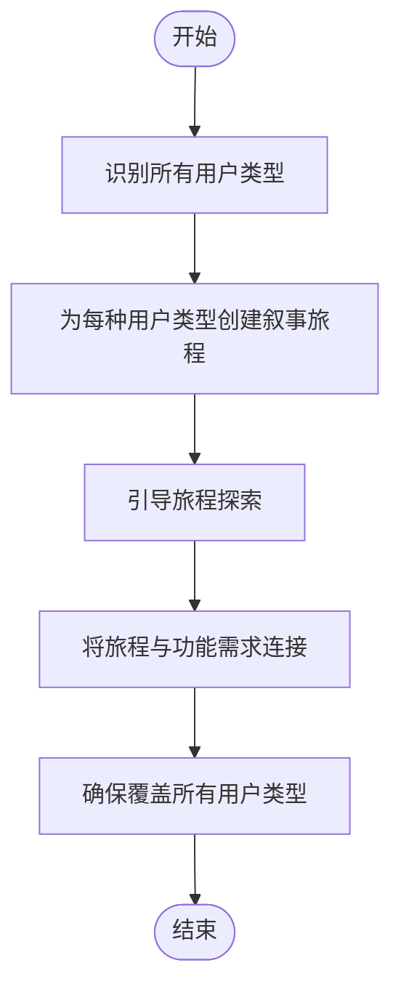
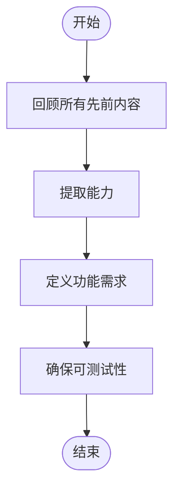
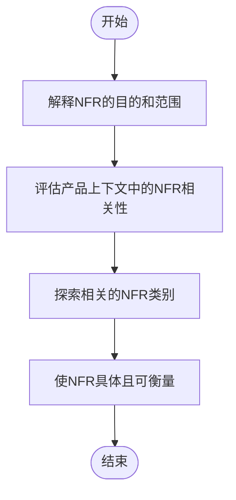
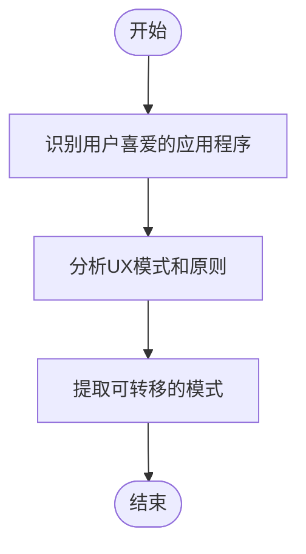
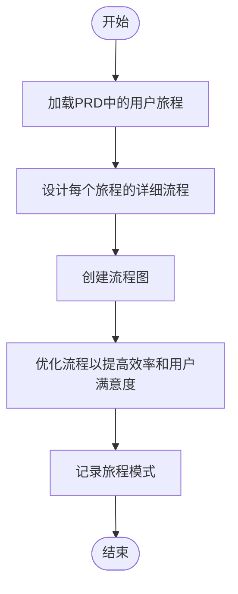
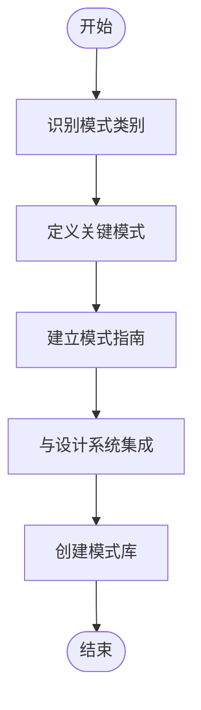

# 计划阶段

<cite>
**本文档中引用的文件**  
- [step-04-journeys.md](file://src/modules/bmm/workflows/2-plan-workflows/prd/steps/step-04-journeys.md)
- [step-10-user-journeys.md](file://src/modules/bmm/workflows/2-plan-workflows/create-ux-design/steps/step-10-user-journeys.md)
- [step-13-responsive-accessibility.md](file://src/modules/bmm/workflows/2-plan-workflows/create-ux-design/steps/step-13-responsive-accessibility.md)
- [step-12-ux-patterns.md](file://src/modules/bmm/workflows/2-plan-workflows/create-ux-design/steps/step-12-ux-patterns.md)
- [step-05-domain.md](file://src/modules/bmm/workflows/2-plan-workflows/prd/steps/step-05-domain.md)
- [step-09-functional.md](file://src/modules/bmm/workflows/2-plan-workflows/prd/steps/step-09-functional.md)
- [step-10-nonfunctional.md](file://src/modules/bmm/workflows/2-plan-workflows/prd/steps/step-10-nonfunctional.md)
- [step-11-complete.md](file://src/modules/bmm/workflows/2-plan-workflows/prd/steps/step-11-complete.md)
- [workflow.md](file://src/modules/bmm/workflows/2-plan-workflows/prd/workflow.md)
- [create-ux-design/workflow.md](file://src/modules/bmm/workflows/2-plan-workflows/create-ux-design/workflow.md)
- [domain-complexity.csv](file://src/modules/bmm/workflows/2-plan-workflows/prd/domain-complexity.csv)
- [project-types.csv](file://src/modules/bmm/workflows/2-plan-workflows/prd/project-types.csv)
</cite>

## 目录
1. [引言](#引言)
2. [PRD工作流](#prd工作流)
3. [UX设计工作流](#ux设计工作流)
4. [域复杂性评估](#域复杂性评估)
5. [项目类型分类](#项目类型分类)
6. [用户旅程定义](#用户旅程定义)
7. [功能与非功能需求](#功能与非功能需求)
8. [响应式设计与可访问性](#响应式设计与可访问性)
9. [输出作为解决方案阶段的输入](#输出作为解决方案阶段的输入)

## 引言
计划阶段是产品开发过程中的关键环节，它通过系统化的方法将模糊的需求转化为清晰、可执行的产品蓝图。本阶段主要涵盖产品需求文档（PRD）和用户体验（UX）设计工作流，旨在通过11个步骤的PRD工作流系统化地捕获项目需求，并通过UX设计工作流引导用户体验设计。该阶段不仅关注需求的发现和定义，还强调域复杂性评估和项目类型分类，以确保后续开发工作的高效性和准确性。

**文档来源**
- [workflow.md](file://src/modules/bmm/workflows/2-plan-workflows/prd/workflow.md#L1-L62)

## PRD工作流
PRD工作流是一个协作式、逐步发现的过程，旨在创建全面的产品需求文档。该工作流通过11个步骤，确保从需求发现到最终文档完成的每一个环节都得到充分考虑和记录。

### 11步PRD工作流
PRD工作流由11个步骤组成，每个步骤都有明确的目标和执行规则。这些步骤包括初始化、需求发现、用户旅程映射、域需求分析、创新机会识别、项目类型分析、功能需求定义、非功能需求定义、文档质量检查和最终完成确认。

**文档来源**
- [workflow.md](file://src/modules/bmm/workflows/2-plan-workflows/prd/workflow.md#L1-L62)
- [step-11-complete.md](file://src/modules/bmm/workflows/2-plan-workflows/prd/steps/step-11-complete.md#L1-L211)

### 需求发现
需求发现是PRD工作流的第一步，旨在通过与利益相关者的深入交流，收集和理解产品的核心需求。这一步骤强调使用开放式问题和引导性对话，以激发用户的深层需求和期望。

**文档来源**
- [step-01-init.md](file://src/modules/bmm/workflows/2-plan-workflows/prd/steps/step-01-init.md)

### 用户旅程映射
用户旅程映射是PRD工作流中的关键步骤，旨在通过叙事方式描绘用户与产品交互的全过程。这一步骤不仅帮助团队理解用户的需求和痛点，还能揭示潜在的功能需求。

**图表来源**
- [step-04-journeys.md](file://src/modules/bmm/workflows/2-plan-workflows/prd/steps/step-04-journeys.md#L1-L273)

**文档来源**
- [step-04-journeys.md](file://src/modules/bmm/workflows/2-plan-workflows/prd/steps/step-04-journeys.md#L1-L273)

### 域需求分析
域需求分析是针对特定行业或领域的复杂性进行评估，以确定项目的关键关注点和合规要求。这一步骤利用`domain-complexity.csv`文件中的数据，为不同领域提供定制化的指导。

**文档来源**
- [step-05-domain.md](file://src/modules/bmm/workflows/2-plan-workflows/prd/steps/step-05-domain.md#L1-L115)

### 创新机会识别
创新机会识别旨在发现产品中可能存在的创新点，这些创新点可以成为产品的差异化优势。这一步骤鼓励团队思考如何通过新技术或新方法提升用户体验。

**文档来源**
- [step-06-innovation.md](file://src/modules/bmm/workflows/2-plan-workflows/prd/steps/step-06-innovation.md)

### 项目类型分析
项目类型分析是根据项目的具体特征（如API后端、移动应用、SaaS B2B等）来确定其特定的需求和挑战。这一步骤利用`project-types.csv`文件中的数据，为不同类型的项目提供针对性的指导。

**文档来源**
- [step-07-project-type.md](file://src/modules/bmm/workflows/2-plan-workflows/prd/steps/step-07-project-type.md)

### 功能需求定义
功能需求定义是PRD工作流的核心部分，旨在明确产品必须具备的所有功能。这一步骤强调每个功能需求都应该是可测试的，并且不涉及具体的实现细节。

**图表来源**
- [step-09-functional.md](file://src/modules/bmm/workflows/2-plan-workflows/prd/steps/step-09-functional.md#L1-L79)

**文档来源**
- [step-09-functional.md](file://src/modules/bmm/workflows/2-plan-workflows/prd/steps/step-09-functional.md#L1-L79)

### 非功能需求定义
非功能需求定义关注产品的质量属性，如性能、安全性、可扩展性和可访问性。这一步骤强调只记录对特定产品重要的非功能需求，避免需求膨胀。

**图表来源**
- [step-10-nonfunctional.md](file://src/modules/bmm/workflows/2-plan-workflows/prd/steps/step-10-nonfunctional.md#L1-L134)

**文档来源**
- [step-10-nonfunctional.md](file://src/modules/bmm/workflows/2-plan-workflows/prd/steps/step-10-nonfunctional.md#L1-L134)

### 文档质量检查
文档质量检查是PRD工作流的倒数第二步，旨在确保文档的完整性和一致性。这一步骤包括完整性检查和一致性检查，以确保所有部分都符合产品差异化的要求。

**文档来源**
- [step-11-complete.md](file://src/modules/bmm/workflows/2-plan-workflows/prd/steps/step-11-complete.md#L1-L211)

### 最终完成确认
最终完成确认是PRD工作流的最后一步，旨在确认文档已完成并准备进入下一阶段。这一步骤提供明确的下一步指导，帮助团队顺利过渡到UX设计或技术架构规划。

**文档来源**
- [step-11-complete.md](file://src/modules/bmm/workflows/2-plan-workflows/prd/steps/step-11-complete.md#L1-L211)

## UX设计工作流
UX设计工作流是一个协作式的视觉探索过程，旨在通过与产品利益相关者的合作，创建全面的UX设计规范。该工作流从核心体验定义到响应式设计模式，确保用户体验的一致性和高质量。

### 核心体验定义
核心体验定义是UX设计工作流的第一步，旨在明确产品希望为用户带来的核心情感和体验。这一步骤通过与利益相关者的对话，确定产品的情感目标和用户体验的关键时刻。

**文档来源**
- [step-07-core-experience.md](file://src/modules/bmm/workflows/2-plan-workflows/create-ux-design/steps/step-07-core-experience.md)

### 灵感分析
灵感分析是通过研究用户喜爱的应用程序和UX模式，提取可借鉴的设计原则和模式。这一步骤帮助团队从现有成功案例中学习，为当前项目提供设计灵感。

**图表来源**
- [step-05-inspiration.md](file://src/modules/bmm/workflows/2-plan-workflows/create-ux-design/steps/step-05-inspiration.md#L1-L87)

**文档来源**
- [step-05-inspiration.md](file://src/modules/bmm/workflows/2-plan-workflows/create-ux-design/steps/step-05-inspiration.md#L1-L87)

### 用户旅程流设计
用户旅程流设计是将PRD中定义的用户旅程转化为详细的交互流程图。这一步骤使用Mermaid图表来可视化每个旅程的入口点、决策点、成功路径和错误恢复机制。

**图表来源**
- [step-10-user-journeys.md](file://src/modules/bmm/workflows/2-plan-workflows/create-ux-design/steps/step-10-user-journeys.md#L1-L241)

**文档来源**
- [step-10-user-journeys.md](file://src/modules/bmm/workflows/2-plan-workflows/create-ux-design/steps/step-10-user-journeys.md#L1-L241)

### UX一致性模式
UX一致性模式是建立在常见情境下的设计一致性，如按钮层次、反馈模式、表单模式和导航模式。这一步骤确保用户在不同交互中获得一致的体验。

**图表来源**
- [step-12-ux-patterns.md](file://src/modules/bmm/workflows/2-plan-workflows/create-ux-design/steps/step-12-ux-patterns.md#L1-L206)

**文档来源**
- [step-12-ux-patterns.md](file://src/modules/bmm/workflows/2-plan-workflows/create-ux-design/steps/step-12-ux-patterns.md#L1-L206)

## 域复杂性评估
域复杂性评估是通过分析`domain-complexity.csv`文件中的数据，为不同领域的项目提供定制化的指导。该文件包含多个字段，如`domain`（领域）、`signals`（信号词）、`complexity`（复杂性）、`key_concerns`（关键关注点）、`required_knowledge`（所需知识）、`suggested_workflow`（建议工作流）等。

### 使用指南
1. **识别领域**：根据项目的特点，从`domain`列中选择最匹配的领域。
2. **评估复杂性**：查看`complexity`列，了解该领域的复杂性级别。
3. **确定关键关注点**：参考`key_concerns`列，识别项目的关键关注点。
4. **获取所需知识**：查阅`required_knowledge`列，了解项目所需的特定知识。
5. **遵循建议工作流**：根据`suggested_workflow`列，选择适合的建议工作流。

**文档来源**
- [domain-complexity.csv](file://src/modules/bmm/workflows/2-plan-workflows/prd/domain-complexity.csv#L1-L13)

## 项目类型分类
项目类型分类是通过分析`project-types.csv`文件中的数据，为不同类型的项目提供针对性的指导。该文件包含多个字段，如`project_type`（项目类型）、`detection_signals`（检测信号）、`key_questions`（关键问题）、`required_sections`（必需部分）、`skip_sections`（跳过部分）、`web_search_triggers`（网络搜索触发器）等。

### 使用指南
1. **识别项目类型**：根据项目的特点，从`project_type`列中选择最匹配的项目类型。
2. **检测信号**：查看`detection_signals`列，确认项目是否符合该类型的特征。
3. **回答关键问题**：参考`key_questions`列，回答与项目类型相关的关键问题。
4. **确定必需部分**：查阅`required_sections`列，了解项目必需的部分。
5. **跳过不相关部分**：根据`skip_sections`列，跳过不相关的部分。

**文档来源**
- [project-types.csv](file://src/modules/bmm/workflows/2-plan-workflows/prd/project-types.csv#L1-L11)

## 用户旅程定义
用户旅程定义是通过叙事方式描绘用户与产品交互的全过程，帮助团队理解用户的需求和痛点。这一步骤不仅关注主要用户，还考虑管理员、支持人员等次要用户。

### 叙事旅程创建过程
1. **利用现有用户**：如果产品简报中有已定义的用户画像，则直接使用这些画像。
2. **识别额外用户类型**：基于产品类型和范围，识别可能需要考虑的额外用户类型。
3. **创建叙事旅程**：为每个用户类型创建一个故事，描述他们的背景、目标、障碍以及产品如何帮助他们解决问题。
4. **引导旅程探索**：通过提问引导用户深入探讨每个旅程的细节。
5. **连接旅程与需求**：明确指出每个旅程揭示的功能需求。

**文档来源**
- [step-04-journeys.md](file://src/modules/bmm/workflows/2-plan-workflows/prd/steps/step-04-journeys.md#L1-L273)

## 功能与非功能需求
功能与非功能需求是产品需求文档的核心内容，分别定义了产品必须具备的能力和质量属性。

### 功能需求
功能需求定义了产品必须具备的所有功能，每个需求都应该是可测试的，并且不涉及具体的实现细节。功能需求的定义基于所有先前的内容，包括执行摘要、成功标准、用户旅程、域需求、创新机会和项目类型。

**文档来源**
- [step-09-functional.md](file://src/modules/bmm/workflows/2-plan-workflows/prd/steps/step-09-functional.md#L1-L79)

### 非功能需求
非功能需求定义了产品的质量属性，如性能、安全性、可扩展性和可访问性。非功能需求的定义基于产品上下文，只记录对特定产品重要的需求。

**文档来源**
- [step-10-nonfunctional.md](file://src/modules/bmm/workflows/2-plan-workflows/prd/steps/step-10-nonfunctional.md#L1-L134)

## 响应式设计与可访问性
响应式设计与可访问性是确保产品在不同设备上都能良好运行，并且对所有用户都可访问的关键步骤。

### 响应式设计策略
响应式设计策略定义了产品如何适应不同的屏幕尺寸和设备。这包括桌面、平板和移动设备的布局策略，以及断点策略。

**文档来源**
- [step-13-responsive-accessibility.md](file://src/modules/bmm/workflows/2-plan-workflows/create-ux-design/steps/step-13-responsive-accessibility.md#L1-L264)

### 可访问性策略
可访问性策略定义了产品需要达到的WCAG合规级别，以及关键的可访问性考虑因素，如颜色对比度、键盘导航支持、屏幕阅读器兼容性等。

**文档来源**
- [step-13-responsive-accessibility.md](file://src/modules/bmm/workflows/2-plan-workflows/create-ux-design/steps/step-13-responsive-accessibility.md#L1-L264)

## 输出作为解决方案阶段的输入
计划阶段的输出是解决方案阶段的重要输入，为后续的开发工作提供了明确的指导。PRD文档中的功能需求和非功能需求将直接指导UX设计、技术架构规划和开发优先级排序。

**文档来源**
- [step-11-complete.md](file://src/modules/bmm/workflows/2-plan-workflows/prd/steps/step-11-complete.md#L1-L211)