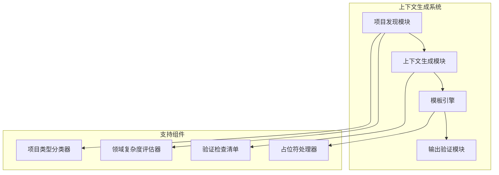
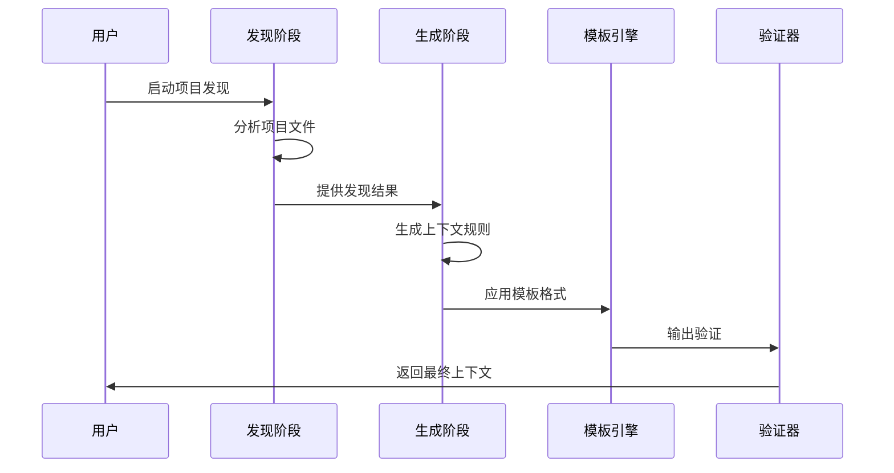
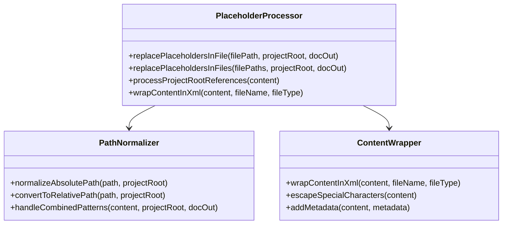
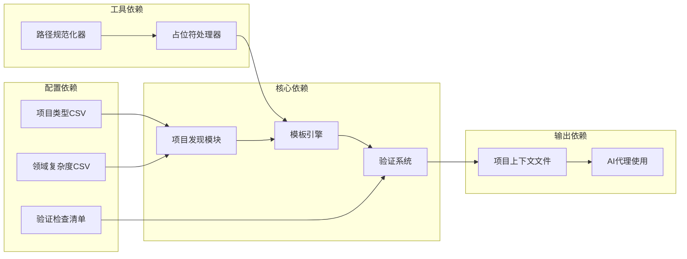

# 上下文生成逻辑

<cite>
**本文档引用的文件**
- [project-context-template.md](file://src/modules/bmm/workflows/generate-project-context/project-context-template.md)
- [project-context-template.md](file://src/modules/bmm/data/project-context-template.md)
- [step-01-discover.md](file://src/modules/bmm/workflows/generate-project-context/steps/step-01-discover.md)
- [step-02-generate.md](file://src/modules/bmm/workflows/generate-project-context/steps/step-02-generate.md)
- [template-engine.js](file://tools/cli/lib/agent/template-engine.js)
- [replace-project-root.js](file://tools/cli/lib/replace-project-root.js)
- [project-types.csv](file://src/modules/bmm/workflows/2-plan-workflows/prd/project-types.csv)
- [domain-complexity.csv](file://src/modules/bmm/workflows/2-plan-workflows/prd/domain-complexity.csv)
- [checklist.md](file://src/modules/bmm/workflows/document-project/checklist.md)
</cite>

## 目录
1. [简介](#简介)
2. [项目结构概览](#项目结构概览)
3. [核心组件分析](#核心组件分析)
4. [架构概览](#架构概览)
5. [详细组件分析](#详细组件分析)
6. [依赖关系分析](#依赖关系分析)
7. [性能考虑](#性能考虑)
8. [故障排除指南](#故障排除指南)
9. [结论](#结论)

## 简介

BMAD方法的上下文生成逻辑是一个高度智能化的系统，专门设计用于将发现阶段收集的原始数据转换为结构化的项目上下文文档。该系统通过两阶段流程（发现和生成）结合模板引擎，实现了对不同项目特征的动态响应和定制化输出。

本文档深入探讨了step-02-generate.md中定义的上下文构建过程，以及project-context-template.md模板的设计原理，详细说明了信息分类、优先级排序和内容组织策略的实现机制。

## 项目结构概览

BMAD方法的上下文生成系统采用模块化架构，主要包含以下核心模块：



**图表来源**
- [step-01-discover.md](file://src/modules/bmm/workflows/generate-project-context/steps/step-01-discover.md#L1-L194)
- [step-02-generate.md](file://src/modules/bmm/workflows/generate-project-context/steps/step-02-generate.md#L1-L318)

**章节来源**
- [step-01-discover.md](file://src/modules/bmm/workflows/generate-project-context/steps/step-01-discover.md#L1-L194)
- [step-02-generate.md](file://src/modules/bmm/workflows/generate-project-context/steps/step-02-generate.md#L1-L318)

## 核心组件分析

### 发现阶段组件

发现阶段负责从现有项目文件中提取关键信息，包括技术栈、代码模式和实施规则。该阶段的核心功能包括：

- **技术栈识别**：自动检测项目使用的编程语言、框架和工具版本
- **代码模式分析**：识别命名约定、文件组织结构和编码规范
- **实施规则提取**：发现项目特定的开发约束和最佳实践

### 生成阶段组件

生成阶段基于发现的数据创建结构化的项目上下文，采用协作式方法确保内容质量：

- **规则分类系统**：将发现的规则按技术栈、语言特性、框架模式等维度分类
- **内容优化机制**：确保输出内容适合LLM处理，保持简洁高效
- **协作菜单系统**：提供A/P/C选项，支持专家提炼和团队评审

**章节来源**
- [step-01-discover.md](file://src/modules/bmm/workflows/generate-project-context/steps/step-01-discover.md#L30-L194)
- [step-02-generate.md](file://src/modules/bmm/workflows/generate-project-context/steps/step-02-generate.md#L44-L318)

## 架构概览

上下文生成系统采用分层架构设计，确保各组件间的松耦合和高内聚：



**图表来源**
- [step-01-discover.md](file://src/modules/bmm/workflows/generate-project-context/steps/step-01-discover.md#L46-L49)
- [step-02-generate.md](file://src/modules/bmm/workflows/generate-project-context/steps/step-02-generate.md#L46-L49)

## 详细组件分析

### 模板引擎工作机制

模板引擎是上下文生成系统的核心组件，负责处理复杂的变量替换和条件渲染逻辑：

```mermaid
flowchart TD
A[输入内容] --> B{是否包含条件块?}
B --> |是| C[处理条件语句]
B --> |否| D[处理变量替换]
C --> E{条件类型}
E --> |布尔条件| F[{{#if variable}}]
E --> |否定条件| G[{{#unless variable}}]
E --> |相等条件| H[{{#if variable == "value"}}]
F --> I[执行布尔检查]
G --> J[执行否定检查]
H --> K[执行字符串比较]
I --> L[条件满足?]
J --> L
K --> L
L --> |是| M[保留内容]
L --> |否| N[移除内容]
D --> O[变量替换]
M --> P[合并结果]
N --> P
O --> P
P --> Q[清理空行]
Q --> R[输出最终内容]
```

**图表来源**
- [template-engine.js](file://tools/cli/lib/agent/template-engine.js#L12-L77)

#### 变量替换规则

模板引擎支持多种变量替换模式：

1. **简单变量替换**：`{{variable}}` → 实际值
2. **布尔条件渲染**：`{{#if variable}}...{{/if}}` → 条件满足时显示内容
3. **否定条件渲染**：`{{#unless variable}}...{{/unless}}` → 条件不满足时显示内容
4. **相等条件渲染**：`{{#if variable == "value"}}...{{/if}}` → 特定值匹配时显示内容

#### 条件渲染逻辑

条件渲染系统提供了灵活的逻辑控制能力：

- **布尔真值判断**：true、非空字符串、非零数字被视为真值
- **否定值判断**：false、空字符串、null、undefined、0被视为假值
- **字符串比较**：支持精确字符串匹配的条件判断

**章节来源**
- [template-engine.js](file://tools/cli/lib/agent/template-engine.js#L1-L77)

### 占位符处理机制

系统使用智能占位符处理机制，确保路径和配置的正确替换：



**图表来源**
- [replace-project-root.js](file://tools/cli/lib/replace-project-root.js#L17-L171)

#### 路径规范化策略

系统采用多层次的路径规范化策略：

1. **组合模式处理**：优先处理`{project-root}{output_folder}/`组合模式
2. **独立替换**：分别处理单独的`{project-root}`和`{output_folder}/`占位符
3. **相对路径转换**：将绝对路径转换为相对于项目根目录的相对路径

**章节来源**
- [replace-project-root.js](file://tools/cli/lib/replace-project-root.js#L17-L171)

### 项目分类和要求系统

系统基于CSV配置文件实现智能的项目分类和要求识别：

| 项目类型 | 检测信号 | 关键问题 | 必需章节 | 跳过章节 |
|---------|---------|---------|---------|---------|
| API后端 | API,REST,GraphQL | 端点需求、认证方式、数据格式 | endpoint_specs,auth_model | ux_ui,visual_design |
| 移动应用 | iOS,Android,app | 平台选择、离线需求、推送通知 | platform_reqs,device_permissions | desktop_features |
| SaaS平台 | SaaS,B2B,platform | 多租户模型、权限管理、订阅 | tenant_model,rbac_matrix | mobile_features |

**章节来源**
- [project-types.csv](file://src/modules/bmm/workflows/2-plan-workflows/prd/project-types.csv#L1-L11)

### 验证和质量保证

系统内置了全面的验证机制，确保生成的上下文文档质量：

```mermaid
flowchart TD
A[生成的上下文] --> B{语法验证}
B --> |通过| C{内容完整性检查}
B --> |失败| D[报告语法错误]
C --> |完整| E{一致性验证]
C --> |缺失| F[标记缺失信息]
E --> |一致| G{实用性评估]
E --> |矛盾| H[报告冲突]
G --> |实用| I[质量评分]
G --> |不实用| J[改进建议]
D --> K[修复建议]
F --> K
H --> K
J --> K
I --> L[发布准备就绪]
K --> M[重新生成]
M --> A
```

**图表来源**
- [checklist.md](file://src/modules/bmm/workflows/document-project/checklist.md#L74-L246)

**章节来源**
- [checklist.md](file://src/modules/bmm/workflows/document-project/checklist.md#L74-L246)

## 依赖关系分析

上下文生成系统的依赖关系呈现清晰的层次结构：



**图表来源**
- [project-types.csv](file://src/modules/bmm/workflows/2-plan-workflows/prd/project-types.csv#L1-L11)
- [domain-complexity.csv](file://src/modules/bmm/workflows/2-plan-workflows/prd/domain-complexity.csv#L1-L13)

**章节来源**
- [project-types.csv](file://src/modules/bmm/workflows/2-plan-workflows/prd/project-types.csv#L1-L11)
- [domain-complexity.csv](file://src/modules/bmm/workflows/2-plan-workflows/prd/domain-complexity.csv#L1-L13)

## 性能考虑

上下文生成系统在设计时充分考虑了性能优化：

### 内存管理
- 采用流式处理减少内存占用
- 及时释放临时变量和中间结果
- 支持大文件的分块处理

### 缓存策略
- 缓存项目发现结果避免重复分析
- 模板编译结果缓存提高重用效率
- 验证规则缓存加速质量检查

### 并发处理
- 支持多文件并行处理
- 异步验证机制提升响应速度
- 工作流状态持久化支持断点续传

## 故障排除指南

### 常见问题及解决方案

#### 模板变量未替换
**症状**：生成的上下文中包含原始模板语法而非实际值
**原因**：变量映射不完整或类型不匹配
**解决方案**：
1. 检查变量名称拼写
2. 验证变量类型与预期匹配
3. 确认变量在作用域内可用

#### 条件渲染异常
**症状**：条件块内容意外显示或隐藏
**原因**：条件表达式语法错误或逻辑判断失误
**解决方案**：
1. 验证条件语法格式
2. 检查变量值的实际类型
3. 使用调试模式查看条件评估过程

#### 路径处理错误
**症状**：生成的文件路径不正确或包含无效引用
**原因**：项目根目录设置错误或路径规范化失败
**解决方案**：
1. 确认项目根目录配置
2. 检查路径分隔符一致性
3. 验证相对路径计算逻辑

**章节来源**
- [template-engine.js](file://tools/cli/lib/agent/template-engine.js#L40-L77)
- [replace-project-root.js](file://tools/cli/lib/replace-project-root.js#L17-L171)

## 结论

BMAD方法的上下文生成逻辑代表了软件工程自动化的重要进展。通过精心设计的两阶段流程、智能的模板引擎和全面的质量保证机制，该系统能够：

1. **自动化程度高**：从项目发现到上下文生成完全自动化
2. **适应性强**：支持多种项目类型和领域复杂度
3. **质量可靠**：内置验证机制确保输出质量
4. **扩展性好**：模块化设计便于功能扩展

该系统不仅提高了AI代理的开发效率，还为软件项目的标准化和规范化奠定了坚实基础。随着人工智能技术的不断发展，这种智能化的上下文生成机制将在软件开发过程中发挥越来越重要的作用。