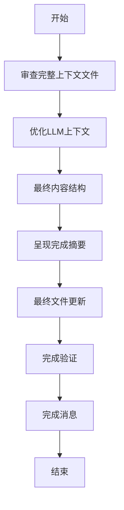
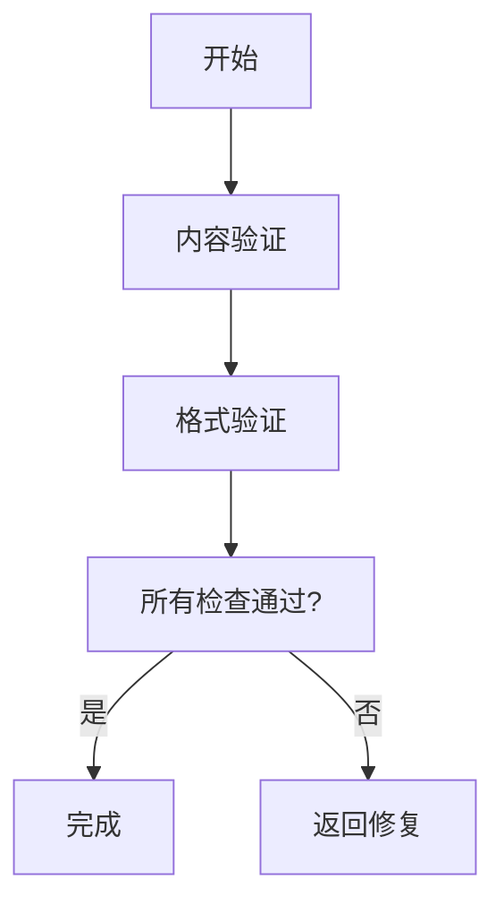

# 结果整合流程

<cite>
**本文档中引用的文件**  
- [step-03-complete.md](file://src/modules/bmm/workflows/generate-project-context/steps/step-03-complete.md)
- [workflow.md](file://src/modules/bmm/workflows/generate-project-context/workflow.md)
- [project-context-template.md](file://src/modules/bmm/workflows/generate-project-context/project-context-template.md)
- [instructions.md](file://src/modules/bmm/workflows/workflow-status/instructions.md)
</cite>

## 目录
1. [引言](#引言)
2. [结果整合流程概述](#结果整合流程概述)
3. [输出整合机制](#输出整合机制)
4. [工作流状态管理](#工作流状态管理)
5. [完成条件判断](#完成条件判断)
6. [错误回滚机制](#错误回滚机制)
7. [成功通知策略](#成功通知策略)
8. [实际案例分析](#实际案例分析)
9. [结论](#结论)

## 引言

结果整合流程是AI项目开发中的关键阶段，负责将生成的上下文内容进行最终验证、格式化和持久化存储。该流程确保生成结果的完整性，处理可能的异常情况，并将最终的项目上下文文档交付给用户或下游系统。本文档详细介绍了`step-03-complete.md`中定义的输出整合机制和`workflow.md`中描述的工作流状态管理。

## 结果整合流程概述

结果整合流程是生成项目上下文工作流的最后一步，负责完成项目上下文文件的最终化、优化和交付。该流程确保AI代理在实施代码时遵循项目的关键规则和模式。



**Diagram sources**
- [step-03-complete.md](file://src/modules/bmm/workflows/generate-project-context/steps/step-03-complete.md)

## 输出整合机制

输出整合机制是结果整合流程的核心，负责将生成的上下文内容进行最终验证、格式化和持久化存储。

### 内容审查与优化

在结果整合流程中，首先需要审查完整的上下文文件，分析内容和结构，确保其适合LLM消费。

**内容分析：**
- 总长度和LLM可读性
- 规则的清晰度和具体性
- 关键领域的覆盖范围
- 每条规则的可操作性

**结构分析：**
- 部分的逻辑组织
- 格式的统一性
- 冗余或明显信息的缺失
- 快速扫描的优化

### 格式化与持久化

确保文件简洁高效，优化内容和格式以适应LLM上下文。

**内容优化：**
- 删除任何冗余规则或明显信息
- 将相关规则合并为简洁的要点
- 使用具体、可操作的语言
- 确保每条规则提供独特价值

**格式优化：**
- 使用一致的Markdown格式
- 实现清晰的章节层次
- 通过战略性加粗确保可扫描性
- 在保持可读性的同时最大化信息密度

**Section sources**
- [step-03-complete.md](file://src/modules/bmm/workflows/generate-project-context/steps/step-03-complete.md#L32-L67)

## 工作流状态管理

工作流状态管理是确保流程正确执行的关键机制，通过YAML文件跟踪项目进度和状态。

### 状态文件结构

工作流状态文件（`bmm-workflow-status.yaml`）包含项目元数据和工作流状态，用于跟踪项目进度。

```yaml
project: "项目名称"
project_type: "项目类型"
project_level: "项目级别"
field_type: "领域类型"
workflow_path: "工作流路径"
workflow_status:
  workflow1: "required"
  workflow2: "completed"
  workflow3: "skipped"
```

### 状态检查模式

工作流状态检查支持多种模式，包括交互式、验证、数据提取、初始化检查和更新。

**交互模式：**
- 显示当前状态和选项
- 提供开始下一个工作流、运行可选工作流、查看完整状态YAML、更新工作流状态等选项

**服务模式：**
- **验证模式**：检查调用工作流是否应继续
- **数据模式**：提取特定信息
- **初始化检查模式**：简单存在性检查
- **更新模式**：集中状态文件更新

**Section sources**
- [instructions.md](file://src/modules/bmm/workflows/workflow-status/instructions.md#L1-L396)

## 完成条件判断

完成条件判断是结果整合流程的重要组成部分，确保所有必要条件都已满足。

### 内容验证

确保所有关键技术和版本都已记录，语言特定规则具体且可操作，框架规则涵盖项目约定，测试规则确保一致性，代码质量规则维护标准，工作流规则防止冲突，反模式规则防止常见错误。

### 格式验证

确保内容简洁，针对LLM优化，结构逻辑且可扫描，无冗余或明显信息，格式一致。



**Diagram sources**
- [step-03-complete.md](file://src/modules/bmm/workflows/generate-project-context/steps/step-03-complete.md#L208-L222)

## 错误回滚机制

错误回滚机制确保在出现问题时能够安全地恢复到先前状态。

### 状态回滚

当工作流执行失败时，系统会回滚到上一个已知的良好状态，保留所有结构和注释。

### 数据完整性

确保在回滚过程中数据完整性不受影响，所有更改都被正确撤销。

**Section sources**
- [instructions.md](file://src/modules/bmm/workflows/workflow-status/instructions.md#L327-L393)

## 成功通知策略

成功通知策略确保用户和下游系统及时了解工作流的完成状态。

### 完成消息

呈现最终完成消息给用户，包括项目上下文生成完成的确认、输出文件路径、上下文摘要、关键好处和下一步骤。

### 模式化响应

根据用户技能水平提供不同模式的完成摘要：
- **专家模式**：简洁的技术摘要
- **中级模式**：包含创建内容和关键好处的详细摘要
- **初学者模式**：易于理解的友好摘要

**Section sources**
- [step-03-complete.md](file://src/modules/bmm/workflows/generate-project-context/steps/step-03-complete.md#L227-L252)

## 实际案例分析

### 项目上下文生成案例

假设我们正在为一个Web开发项目生成项目上下文。流程如下：

1. **发现阶段**：分析项目文件，识别技术栈（React 18, TypeScript 4.9, Node.js 18）
2. **生成阶段**：创建包含关键实现规则的上下文文件
3. **完成阶段**：优化文件，确保其适合LLM消费

最终生成的`project_context.md`文件包含：
- 技术栈和版本
- 语言特定规则
- 框架特定规则
- 测试规则
- 代码质量和风格规则
- 开发工作流规则
- 关键不要错过的规则

### 工作流状态管理案例

假设项目有三个工作流：PRD、架构设计和实现准备。工作流状态文件跟踪其进度：

```yaml
workflow_status:
  prd: "docs/prd.md"
  architecture: "required"
  implementation-readiness: "optional"
```

当PRD工作流完成后，系统自动更新状态文件，并提示用户下一个工作流。

**Section sources**
- [step-03-complete.md](file://src/modules/bmm/workflows/generate-project-context/steps/step-03-complete.md)
- [workflow.md](file://src/modules/bmm/workflows/generate-project-context/workflow.md)

## 结论

结果整合流程是确保AI项目成功的关键环节。通过严格的输出整合机制和工作流状态管理，系统能够确保生成结果的完整性，处理可能的异常情况，并将最终的项目上下文文档可靠地交付给用户或下游系统。该流程的完成条件判断、错误回滚机制和成功通知策略共同构成了一个健壮、可靠的系统，为AI代理提供了一致的"道路规则"，确保代码实现符合项目标准和模式。