# 项目上下文生成技术文档

<cite>
**本文档引用的文件**
- [workflow.md](file://src/modules/bmm/workflows/generate-project-context/workflow.md)
- [project-context-template.md](file://src/modules/bmm/data/project-context-template.md)
- [step-01-discover.md](file://src/modules/bmm/workflows/generate-project-context/steps/step-01-discover.md)
- [step-02-generate.md](file://src/modules/bmm/workflows/generate-project-context/steps/step-02-generate.md)
- [step-03-complete.md](file://src/modules/bmm/workflows/generate-project-context/steps/step-03-complete.md)
- [architecture.md](file://src/modules/bmb/docs/workflows/architecture.md)
- [workflow-template.md](file://src/modules/bmb/docs/workflows/workflow-template.md)
</cite>

## 目录
1. [简介](#简介)
2. [工作流架构概述](#工作流架构概述)
3. [三步执行流程详解](#三步执行流程详解)
4. [项目信息发现机制](#项目信息发现机制)
5. [上下文生成逻辑](#上下文生成逻辑)
6. [结果整合过程](#结果整合过程)
7. [模板文件结构设计](#模板文件结构设计)
8. [实际使用案例](#实际使用案例)
9. [最佳实践指南](#最佳实践指南)
10. [故障排除](#故障排除)

## 简介

项目上下文生成（Generate Project Context）是BMAD方法论中的核心工作流之一，专门用于为AI代理创建标准化的项目上下文文档。该工作流通过自动化的方式提取项目元数据、技术栈信息和架构特征，生成优化的项目上下文文件，确保所有AI代理在实现代码时都能遵循一致的标准和模式。

该项目上下文文件作为AI代理的"行为准则"，包含了关键的实现规则、编码约定和最佳实践，帮助避免常见的实现错误和不一致性问题。

## 工作流架构概述

### 微文件架构设计

generate-project-context工作流采用微文件架构（Micro-file Architecture），这是BMAD方法论的核心设计理念：

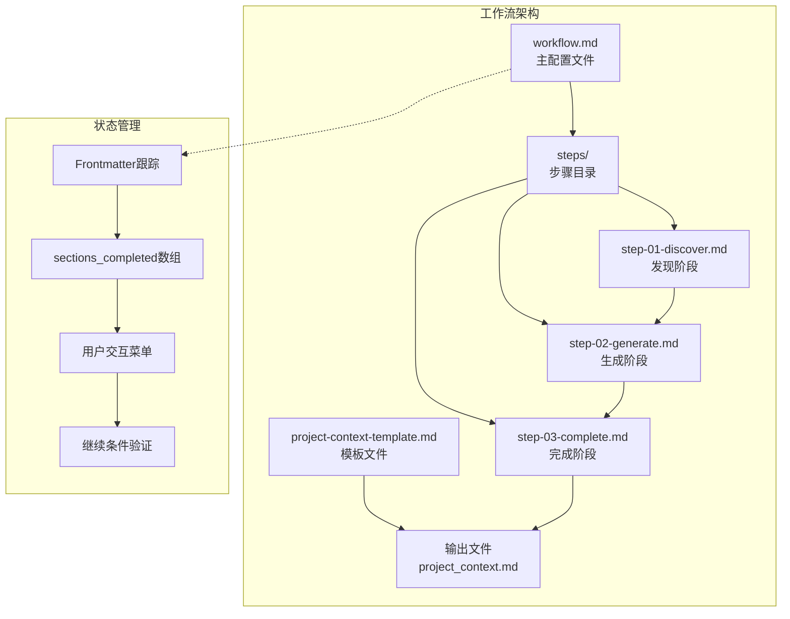

**图表来源**
- [workflow.md](file://src/modules/bmm/workflows/generate-project-context/workflow.md#L1-L49)
- [architecture.md](file://src/modules/bmb/docs/workflows/architecture.md#L1-L52)

### 核心原则

1. **单文件即时加载（Just-In-Time Loading）**：每次只加载当前步骤文件
2. **顺序执行（Sequential Enforcement）**：严格按顺序执行步骤，不允许跳过或优化
3. **状态跟踪（State Tracking）**：通过输出文档frontmatter跟踪进度
4. **追加构建（Append-Only Building）**：通过追加内容构建文档

**章节来源**
- [workflow.md](file://src/modules/bmm/workflows/generate-project-context/workflow.md#L16-L22)
- [architecture.md](file://src/modules/bmb/docs/workflows/architecture.md#L25-L38)

## 三步执行流程详解

### 第一步：项目信息发现（step-01-discover.md）

发现阶段是整个工作流的基础，负责全面分析现有项目环境并识别关键的实现规则。

#### 发现序列

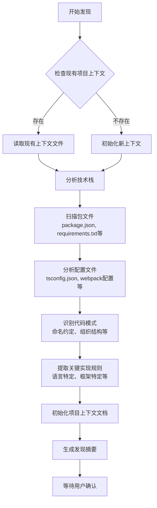

**图表来源**
- [step-01-discover.md](file://src/modules/bmm/workflows/generate-project-context/steps/step-01-discover.md#L30-L194)

#### 关键发现要素

| 发现类别 | 具体内容 | 重要性 |
|---------|---------|--------|
| 技术栈 | 框架版本、依赖项、构建工具 | 高 - 确保兼容性 |
| 命名约定 | 文件命名、组件命名、变量命名 | 中 - 保持一致性 |
| 代码组织 | 目录结构、模块划分、测试组织 | 高 - 影响可维护性 |
| 实现规则 | 错误处理、异步模式、导入导出 | 高 - 避免常见错误 |
| 开发流程 | 分支策略、提交规范、部署流程 | 中 - 提高协作效率 |

**章节来源**
- [step-01-discover.md](file://src/modules/bmm/workflows/generate-project-context/steps/step-01-discover.md#L40-L119)

### 第二步：上下文规则生成（step-02-generate.md）

生成阶段专注于从发现的信息中提炼出具体的、可操作的规则，形成完整的项目上下文内容。

#### 规则生成序列

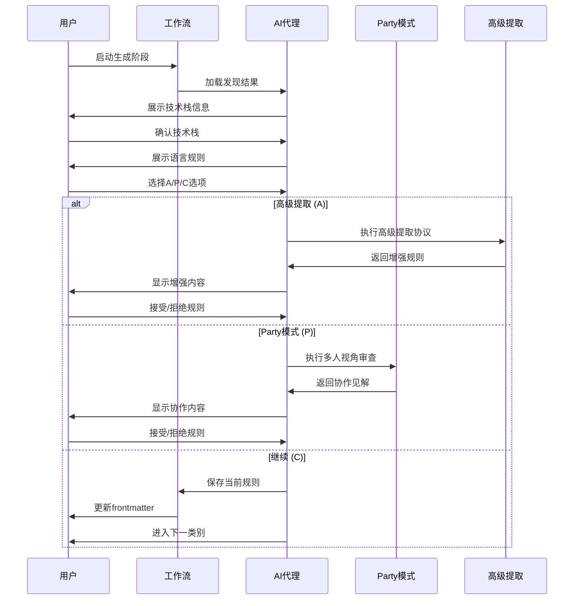

**图表来源**
- [step-02-generate.md](file://src/modules/bmm/workflows/generate-project-context/steps/step-02-generate.md#L21-L318)

#### 内容分类体系

| 类别 | 子类别 | 包含内容 |
|------|--------|----------|
| 技术栈 | 版本信息、依赖管理 | 具体的技术版本和依赖关系 |
| 语言规则 | TypeScript配置、导入模式 | 语言特定的编码规范 |
| 框架规则 | 组件结构、状态管理 | 框架特有的开发模式 |
| 测试规则 | 结构要求、覆盖率 | 测试编写和质量标准 |
| 代码质量 | Linting规则、命名约定 | 代码风格和质量控制 |
| 开发流程 | Git规范、部署流程 | 团队协作和发布流程 |
| 关键规则 | 反模式、性能考虑 | 避免常见陷阱的重要规则 |

**章节来源**
- [step-02-generate.md](file://src/modules/bmm/workflows/generate-project-context/steps/step-02-generate.md#L48-L210)

### 第三步：结果整合与完成（step-03-complete.md）

完成阶段对生成的内容进行最终审查、优化和格式化，确保项目上下文文件达到最优的LLM可消费状态。

#### 完成序列


**图表来源**
- [step-03-complete.md](file://src/modules/bmm/workflows/generate-project-context/steps/step-03-complete.md#L30-L278)

#### 最终优化要点

1. **内容精简**：移除冗余信息，保留关键规则
2. **格式统一**：确保Markdown格式的一致性
3. **层次清晰**：建立逻辑分明的章节结构
4. **扫描友好**：便于AI代理快速检索信息
5. **价值最大化**：每个规则都提供独特价值

**章节来源**
- [step-03-complete.md](file://src/modules/bmm/workflows/generate-project-context/steps/step-03-complete.md#L50-L130)

## 项目信息发现机制

### 技术栈识别

发现机制通过多层次的文件扫描来识别项目的技术栈：

#### 包管理器检测

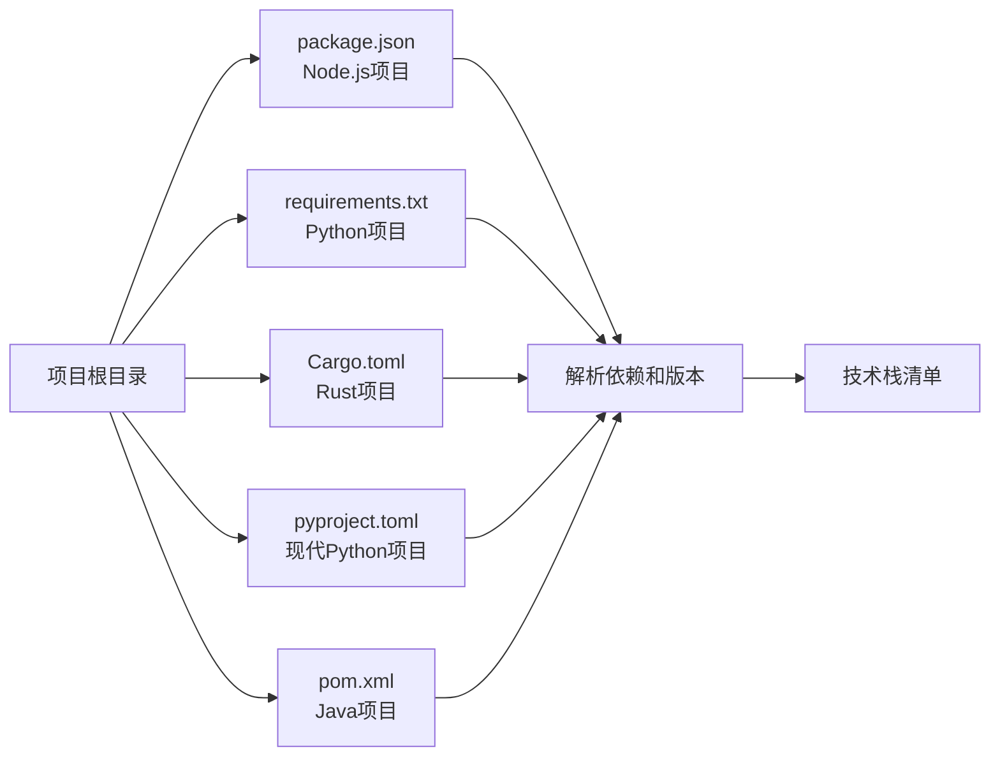

**图表来源**
- [step-01-discover.md](file://src/modules/bmm/workflows/generate-project-context/steps/step-01-discover.md#L50-L55)

#### 配置文件分析

系统会深度分析各种配置文件以提取技术决策：

| 配置文件类型 | 分析内容 | 用途 |
|-------------|---------|------|
| tsconfig.json | 编译选项、模块系统、严格模式 | TypeScript配置规则 |
| webpack.config.js | 构建配置、加载器、插件 | 前端构建规则 |
| jest.config.js | 测试配置、覆盖率、模拟 | 测试框架规则 |
| .eslintrc | 代码规范、插件、扩展 | 代码质量规则 |
| next.config.js | Next.js特定配置 | 框架特有规则 |

**章节来源**
- [step-01-discover.md](file://src/modules/bmm/workflows/generate-project-context/steps/step-01-discover.md#L56-L62)

### 代码模式识别

通过静态代码分析识别项目的编码模式和约定：

#### 命名约定检测

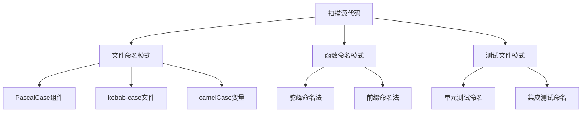

**图表来源**
- [step-01-discover.md](file://src/modules/bmm/workflows/generate-project-context/steps/step-01-discover.md#L67-L73)

#### 架构模式识别

系统会识别项目采用的设计模式和架构决策：

- **分层架构**：控制器-服务-仓储模式
- **模块化设计**：功能模块划分
- **组件化架构**：React/Vue组件组织
- **微服务模式**：API边界和服务划分

**章节来源**
- [step-01-discover.md](file://src/modules/bmm/workflows/generate-project-context/steps/step-01-discover.md#L74-L86)

## 上下文生成逻辑

### 协作式生成机制

生成阶段采用协作式的方法，结合人类专家知识和AI智能来创建高质量的项目上下文：

#### A/P/C菜单系统

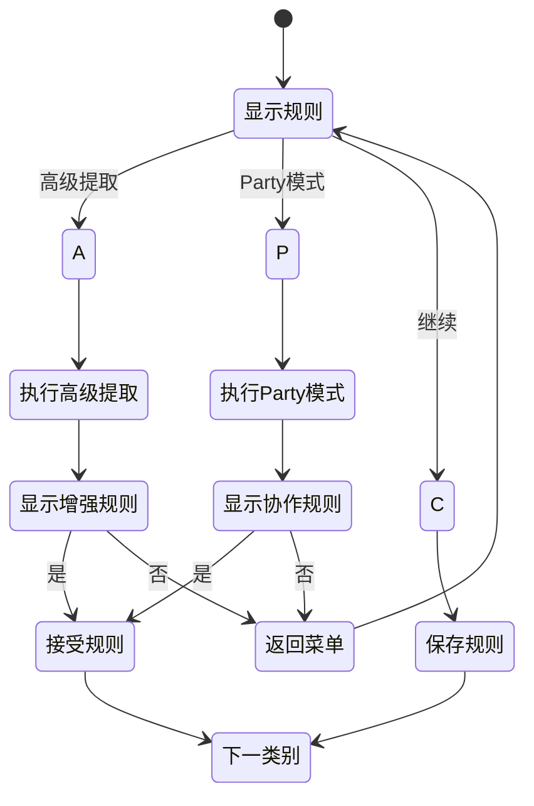

**图表来源**
- [step-02-generate.md](file://src/modules/bmm/workflows/generate-project-context/steps/step-02-generate.md#L21-L35)

#### 高级提取协议

当选择"A"选项时，系统会执行高级提取协议，利用更复杂的推理来发现深层次的实现规则：

- **反向工程分析**：从现有代码推断隐藏的模式
- **最佳实践匹配**：对比行业标准和项目实际情况
- **风险评估**：识别潜在的实现陷阱和反模式
- **性能考量**：分析代码的性能特征和优化机会

**章节来源**
- [step-02-generate.md](file://src/modules/bmm/workflows/generate-project-context/steps/step-02-generate.md#L267-L274)

#### Party模式协作

"Party模式"允许引入多个视角来审查和验证规则：

- **多角色模拟**：不同开发角色的视角
- **跨团队协作**：模拟真实团队讨论
- **专家评审**：引入领域专家意见
- **社区反馈**：参考开源社区的最佳实践

**章节来源**
- [step-02-generate.md](file://src/modules/bmm/workflows/generate-project-context/steps/step-02-generate.md#L275-L281)

### 内容优化策略

生成的规则需要经过严格的优化才能成为有效的项目上下文：

#### 规则筛选原则

1. **独特性原则**：每个规则必须提供独特的价值
2. **实用性原则**：规则必须是可操作的
3. **必要性原则**：避免显而易见的常识
4. **一致性原则**：与项目整体风格保持一致

#### 内容结构化

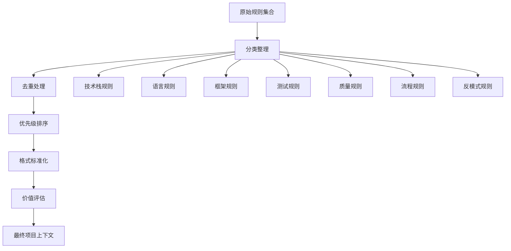

**图表来源**
- [step-02-generate.md](file://src/modules/bmm/workflows/generate-project-context/steps/step-02-generate.md#L212-L248)

## 结果整合过程

### 最终审查与优化

完成阶段的重点是对生成的内容进行全面的质量检查和优化：

#### 内容质量检查

| 检查维度 | 检查项目 | 质量标准 |
|---------|---------|----------|
| 完整性 | 是否覆盖所有关键领域 | 无遗漏的关键规则 |
| 准确性 | 规则描述是否准确 | 与实际项目一致 |
| 清晰度 | 表达是否简洁明了 | 易于理解和应用 |
| 一致性 | 格式和术语是否统一 | 整体风格一致 |
| 实用性 | 是否具有实际指导价值 | 可直接应用于开发 |

**章节来源**
- [step-03-complete.md](file://src/modules/bmm/workflows/generate-project-context/steps/step-03-complete.md#L205-L222)

#### 格式优化

系统会自动优化文档格式以提高AI代理的可消费性：

- **Markdown标准化**：统一标题级别和列表格式
- **段落优化**：确保适当的段落长度
- **标记强化**：使用粗体突出关键信息
- **链接规范化**：确保相对路径正确

**章节来源**
- [step-03-complete.md](file://src/modules/bmm/workflows/generate-project-context/steps/step-03-complete.md#L61-L67)

### 使用指南集成

最终的项目上下文文件包含详细的使用指南：

#### AI代理使用指南

```markdown
## 对AI代理的使用指南

- 在实现任何代码之前阅读此文件
- 严格按照文档中的规则执行
- 当不确定时，选择更严格的选项
- 如有新模式出现，请更新此文件
```

#### 人类维护指南

```markdown
## 对人类的维护指南

- 保持文件简洁，专注于代理需求
- 当技术栈变更时更新此文件
- 定期审查（每季度）以优化和移除过时规则
- 移除随着时间变得明显的规则
```

**章节来源**
- [step-03-complete.md](file://src/modules/bmm/workflows/generate-project-context/steps/step-03-complete.md#L111-L126)

## 模板文件结构设计

### 模板文件架构

项目上下文模板采用了精心设计的结构来支持不同复杂度和需求的项目：

#### 标准模板结构

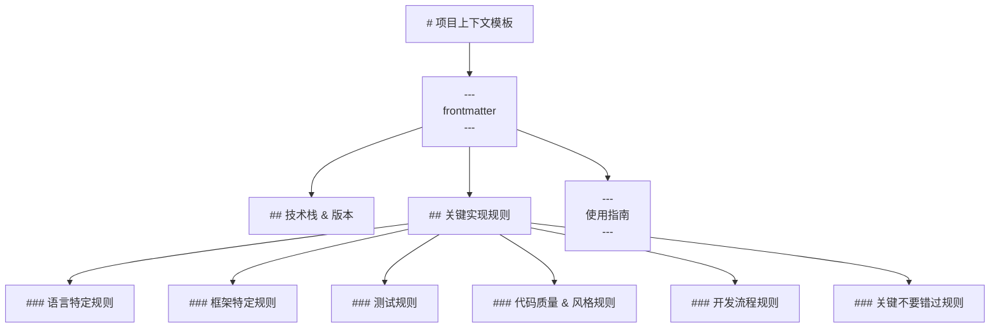

**图表来源**
- [project-context-template.md](file://src/modules/bmm/data/project-context-template.md#L1-L41)

#### 变量使用规范

模板文件支持多种占位符变量：

| 变量类型 | 格式 | 示例 | 用途 |
|---------|------|------|------|
| 项目变量 | `{{variable_name}}` | `{{project_name}}` | 动态替换项目信息 |
| 数值变量 | `{ {number} }` | `{ {rule_count} }` | 动态计算数值 |
| 条件变量 | `{if_condition}` | `{if_existing_context}` | 条件内容显示 |
| 多行变量 | `{{variable_name}}` | `{{technology_list}}` | 大段文本替换 |

**章节来源**
- [step-01-discover.md](file://src/modules/bmm/workflows/generate-project-context/steps/step-01-discover.md#L128-L136)

### 模板定制机制

模板支持根据项目特点进行定制：

#### 项目特定定制

- **焦点区域调整**：根据项目类型调整关注点
- **集成流程适配**：适应不同的开发流程
- **预期成果定义**：明确期望的产出物

#### 输出语言适配

模板支持多语言输出：

- **沟通语言**：用户界面语言设置
- **文档语言**：输出文档的语言
- **技能水平适配**：针对不同技能水平的用户

**章节来源**
- [project-context-template.md](file://src/modules/bmm/data/project-context-template.md#L18-L41)

## 实际使用案例

### 案例1：React全栈项目

#### 项目背景
一个使用React、Node.js、Express和MongoDB的全栈Web应用项目。

#### 发现过程

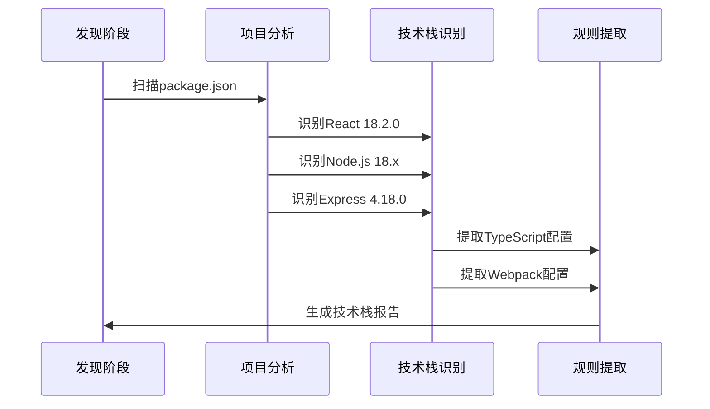

**图表来源**
- [step-01-discover.md](file://src/modules/bmm/workflows/generate-project-context/steps/step-01-discover.md#L40-L62)

#### 生成的上下文规则

**技术栈部分**：
- React 18.2.0 with TypeScript
- Node.js 18.17.1 with Express 4.18.0
- MongoDB with Mongoose ODM
- Webpack 5.75.0 for frontend bundling

**语言规则部分**：
- 必须使用严格模式的TypeScript配置
- 导入语句必须使用ES模块语法
- 异步函数必须使用async/await而非Promise链
- 错误处理必须遵循统一的错误边界模式

**框架规则部分**：
- React组件必须使用函数式组件和Hooks
- API路由必须遵循RESTful设计原则
- 状态管理使用Redux Toolkit
- 组件必须实现完整的TypeScript类型定义

**章节来源**
- [step-02-generate.md](file://src/modules/bmm/workflows/generate-project-context/steps/step-02-generate.md#L49-L210)

### 案例2：Python微服务项目

#### 项目特点
基于FastAPI的Python微服务架构，使用PostgreSQL数据库。

#### 关键发现

- **技术栈**：FastAPI 0.95.0, PostgreSQL 14.0, SQLAlchemy 1.4.0
- **开发模式**：异步编程为主，使用Pydantic进行数据验证
- **测试策略**：单元测试与集成测试分离
- **部署方式**：Docker容器化部署

#### 生成的上下文重点

**语言特定规则**：
- 异步函数必须使用async def语法
- 数据模型必须继承自BaseModel
- API路由必须使用async def定义
- 错误处理必须使用HTTPException

**框架特定规则**：
- FastAPI依赖注入必须使用Depends
- 数据库会话必须使用AsyncSession
- 请求验证必须使用Pydantic模型
- 响应格式必须符合OpenAPI规范

**章节来源**
- [step-02-generate.md](file://src/modules/bmm/workflows/generate-project-context/steps/step-02-generate.md#L84-L127)

### 案例3：混合技术栈项目

#### 项目组合
前端：Vue.js + TypeScript  
后端：Go + Gin  
数据库：MySQL  
消息队列：RabbitMQ

#### 复杂性处理

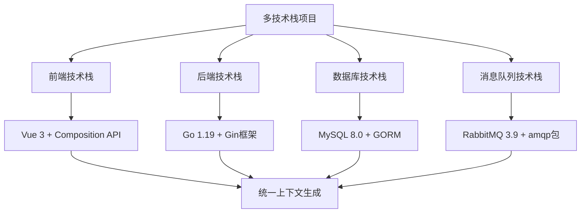

**图表来源**
- [step-01-discover.md](file://src/modules/bmm/workflows/generate-project-context/steps/step-01-discover.md#L40-L62)

#### 统一上下文策略

虽然涉及多种技术栈，但上下文文件采用统一的结构：

- **技术栈概览**：列出所有技术及其版本
- **语言规则**：针对每种语言的特定规则
- **框架规则**：各框架的独特约定
- **集成规则**：跨技术栈的协作规则
- **部署规则**：统一的部署和运维规则

**章节来源**
- [step-02-generate.md](file://src/modules/bmm/workflows/generate-project-context/steps/step-02-generate.md#L212-L248)

## 最佳实践指南

### 工作流执行最佳实践

#### 发现阶段最佳实践

1. **充分准备**：
   - 确保项目处于稳定状态
   - 收集所有相关文档
   - 准备必要的开发环境访问权限

2. **全面扫描**：
   - 不要遗漏任何配置文件
   - 检查所有源代码目录
   - 注意隐藏的配置文件（如`.env`）

3. **深度分析**：
   - 不仅识别技术栈，还要理解使用原因
   - 分析现有的代码模式和约定
   - 识别潜在的问题和改进点

#### 生成阶段最佳实践

1. **协作式生成**：
   - 鼓励团队成员参与规则制定
   - 利用A/P/C菜单系统获取多方意见
   - 重视经验丰富的开发者建议

2. **内容质量控制**：
   - 确保每个规则都有实际意义
   - 避免重复和矛盾的规则
   - 保持规则的可操作性

3. **持续改进**：
   - 将项目上下文视为活文档
   - 定期审查和更新规则
   - 根据项目发展调整内容

#### 完成阶段最佳实践

1. **最终审查**：
   - 确保所有关键领域都被覆盖
   - 验证规则的准确性和完整性
   - 检查格式和排版的一致性

2. **用户验收**：
   - 获取团队对上下文的认可
   - 确保上下文易于理解和使用
   - 收集反馈以改进未来版本

### 维护和更新策略

#### 定期维护计划

| 维护周期 | 主要任务 | 重点关注 |
|---------|---------|----------|
| 每月 | 内容审查 | 新增规则、过时规则 |
| 每季度 | 全面更新 | 技术栈变更、流程优化 |
| 每年 | 重大重构 | 架构调整、技术升级 |
| 项目里程碑 | 特殊更新 | 重大变更、新特性 |

#### 变更管理流程


**图表来源**
- [step-03-complete.md](file://src/modules/bmm/workflows/generate-project-context/steps/step-03-complete.md#L205-L222)

### AI代理集成指南

#### 集成步骤

1. **文件准备**：
   - 确保项目上下文文件位于正确位置
   - 验证文件格式和内容完整性
   - 设置适当的访问权限

2. **代理配置**：
   - 配置AI代理读取上下文文件
   - 设置适当的上下文窗口大小
   - 实现上下文缓存机制

3. **实施监控**：
   - 监控代理对上下文的使用情况
   - 收集实施效果数据
   - 持续优化上下文内容

#### 性能优化建议

- **内容压缩**：定期清理过时规则
- **索引优化**：为常用规则建立索引
- **增量更新**：只更新变更的部分
- **版本控制**：使用版本控制系统管理变更

## 故障排除

### 常见问题及解决方案

#### 发现阶段问题

**问题1：技术栈识别不准确**
- **症状**：识别的技术版本与实际不符
- **原因**：配置文件损坏或版本号格式特殊
- **解决方案**：手动检查配置文件，验证版本号格式

**问题2：缺少关键规则**
- **症状**：生成的上下文缺少某些重要规则
- **原因**：代码模式过于隐晦或项目规模较小
- **解决方案**：启用高级提取协议，增加Party模式讨论

**问题3：重复规则**
- **症状**：上下文中存在重复的规则
- **原因**：多个源文件产生相似规则
- **解决方案**：在生成阶段进行去重处理

#### 生成阶段问题

**问题4：规则过于冗长**
- **症状**：生成的规则描述过于复杂
- **原因**：缺乏内容优化
- **解决方案**：使用A/P/C菜单进行内容精简

**问题5：规则冲突**
- **症状**：不同类别的规则相互矛盾
- **原因**：项目历史遗留问题
- **解决方案**：通过Party模式进行协商解决

**问题6：格式不一致**
- **症状**：规则格式混乱，难以阅读
- **原因**：缺乏统一的格式标准
- **解决方案**：在完成阶段进行格式化处理

#### 完成阶段问题

**问题7：文件过大**
- **症状**：生成的上下文文件体积过大
- **原因**：内容过于详细或包含冗余信息
- **解决方案**：进行内容压缩和优化

**问题8：缺少使用指南**
- **症状**：最终文件缺少使用说明
- **原因**：忘记添加使用指南部分
- **解决方案**：在完成阶段自动添加使用指南

### 调试和诊断工具

#### 工作流状态检查

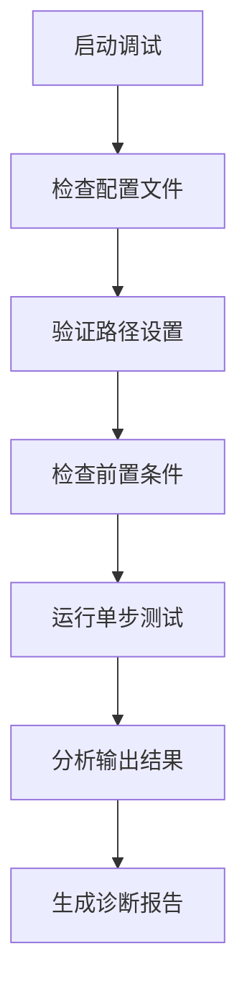

#### 日志和监控

- **详细日志记录**：记录每个步骤的执行情况
- **性能监控**：监控工作流执行时间
- **错误追踪**：捕获和分析异常情况
- **用户反馈**：收集用户使用体验

### 回滚和恢复策略

#### 自动回滚机制

当工作流执行失败时，系统会自动执行回滚：

1. **状态恢复**：恢复到上一个稳定状态
2. **文件备份**：保留失败前的文件副本
3. **配置重置**：重置工作流配置
4. **通知用户**：告知失败原因和恢复措施

#### 手动恢复程序

如果自动回滚失败，可以执行手动恢复：

1. **检查文件完整性**：验证关键文件是否存在
2. **重建状态文件**：重新生成frontmatter
3. **清理临时文件**：删除中间生成的文件
4. **重新启动工作流**：从头开始执行

## 结论

项目上下文生成工作流是BMAD方法论中的重要组成部分，它通过系统化的方法帮助团队创建高质量的项目上下文文档。该工作流的三个阶段——发现、生成、完成——形成了一个完整的闭环，确保项目上下文既全面又实用。

通过采用微文件架构和协作式生成机制，该工作流不仅提高了效率，还保证了内容的质量和一致性。模板文件的设计支持灵活的定制，能够适应不同类型的项目和技术栈。

对于AI代理来说，项目上下文文件提供了必要的"行为准则"，确保所有代理在实现代码时都能遵循一致的标准和最佳实践。这不仅提高了代码质量，还减少了团队协作中的摩擦和误解。

随着项目的演进，项目上下文也需要持续维护和更新。通过建立完善的维护流程和监控机制，可以确保项目上下文始终反映项目的最新状态，为AI代理提供最准确的指导信息。