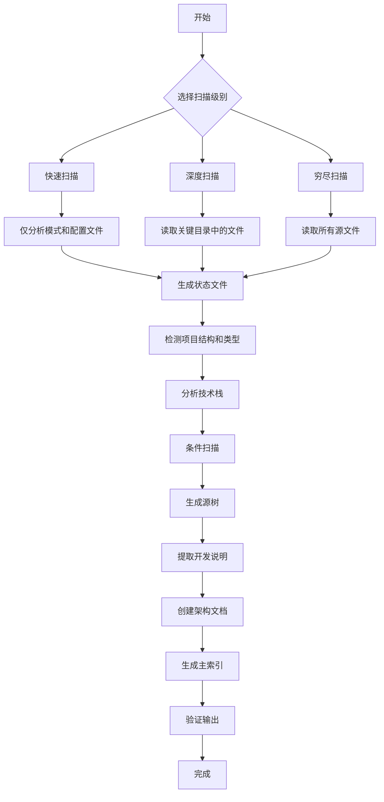
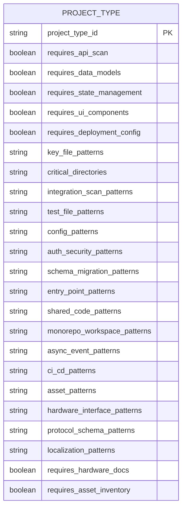
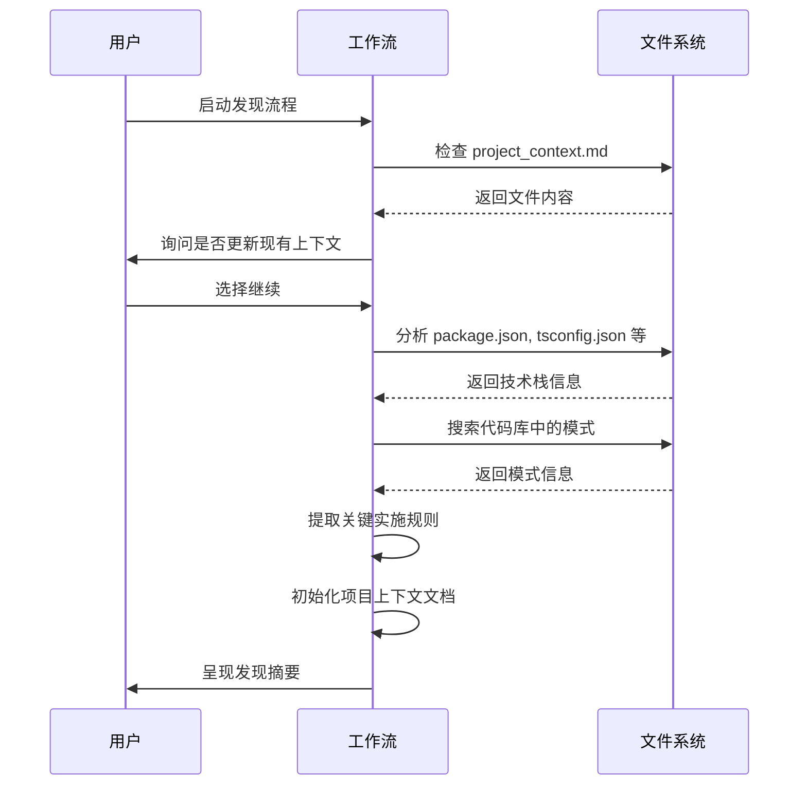
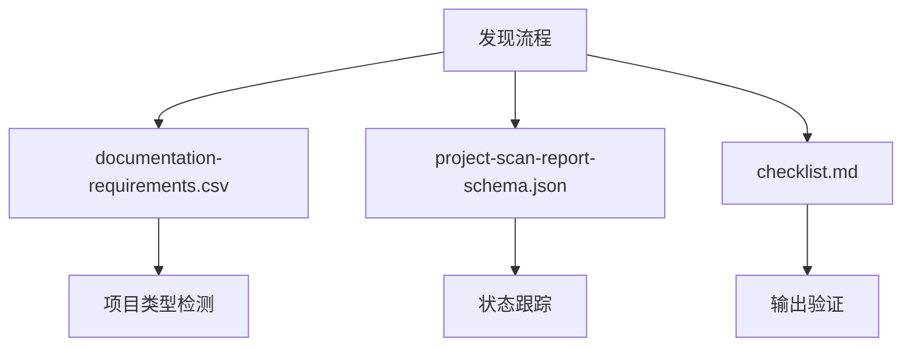

# 项目信息发现

<cite>
**本文档中引用的文件**  
- [step-01-discover.md](file://src/modules/bmm/workflows/generate-project-context/steps/step-01-discover.md)
- [full-scan-instructions.md](file://src/modules/bmm/workflows/document-project/workflows/full-scan-instructions.md)
- [documentation-requirements.csv](file://src/modules/bmm/workflows/document-project/documentation-requirements.csv)
- [project-scan-report-schema.json](file://src/modules/bmm/workflows/document-project/templates/project-scan-report-schema.json)
- [checklist.md](file://src/modules/bmm/workflows/document-project/checklist.md)
- [workflow-document-project-reference.md](file://src/modules/bmm/docs/workflow-document-project-reference.md)
</cite>

## 目录
1. [引言](#引言)
2. [项目结构分析](#项目结构分析)
3. [核心组件](#核心组件)
4. [架构概述](#架构概述)
5. [详细组件分析](#详细组件分析)
6. [依赖分析](#依赖分析)
7. [性能考虑](#性能考虑)
8. [故障排除指南](#故障排除指南)
9. [结论](#结论)

## 引言

项目信息发现机制是BMAD方法论中的关键初始阶段，旨在通过静态分析和动态探测相结合的方式，系统性地提取项目的技术栈信息、依赖关系、代码结构和配置特征。该机制为后续的生成阶段提供结构化的输入数据，确保AI代理能够基于准确的项目上下文进行开发和决策。

## 项目结构分析

项目信息发现流程主要依赖于`document-project`工作流，该工作流通过多级扫描策略对项目进行全面分析。流程首先检测项目结构并分类项目类型，然后根据项目类型加载相应的文档需求，执行条件扫描，并最终生成综合索引文件。



**图表来源**  
- [full-scan-instructions.md](file://src/modules/bmm/workflows/document-project/workflows/full-scan-instructions.md#L1-L160)
- [workflow-document-project-reference.md](file://src/modules/bmm/docs/workflow-document-project-reference.md#L90-L145)

**章节来源**  
- [full-scan-instructions.md](file://src/modules/bmm/workflows/document-project/workflows/full-scan-instructions.md#L1-L160)
- [workflow-document-project-reference.md](file://src/modules/bmm/docs/workflow-document-project-reference.md#L90-L145)

## 核心组件

项目信息发现的核心组件包括`step-01-discover.md`中定义的发现流程，该流程负责发现项目的技术栈、现有模式和关键实施规则。流程首先检查是否存在现有的项目上下文，然后分析项目文件以识别技术栈，搜索代码库以识别模式，并提取关键实施规则。

**章节来源**  
- [step-01-discover.md](file://src/modules/bmm/workflows/generate-project-context/steps/step-01-discover.md#L1-L194)

## 架构概述

项目信息发现的架构基于一个自包含的CSV文件`documentation-requirements.csv`，该文件结合了项目类型检测和文档需求。该文件包含12种项目类型（web、mobile、backend等）和24列，包括检测列、需求列和模式列。架构模式从技术栈中推断，无需外部注册表。



**图表来源**  
- [documentation-requirements.csv](file://src/modules/bmm/workflows/document-project/documentation-requirements.csv#L1-L13)
- [workflow-document-project-reference.md](file://src/modules/bmm/docs/workflow-document-project-reference.md#L182-L190)

**章节来源**  
- [documentation-requirements.csv](file://src/modules/bmm/workflows/document-project/documentation-requirements.csv#L1-L13)
- [workflow-document-project-reference.md](file://src/modules/bmm/docs/workflow-document-project-reference.md#L182-L190)

## 详细组件分析

### 发现流程分析

发现流程通过以下步骤执行：

1. **检查现有项目上下文**：查找`project_context.md`文件，如果存在则读取以了解现有规则。
2. **发现项目技术栈**：分析架构文档、包文件和配置文件以识别技术选择和版本。
3. **识别现有代码模式**：搜索代码库以识别命名约定、代码组织和文档模式。
4. **提取关键实施规则**：查找语言特定规则、框架特定规则、测试规则和开发工作流规则。
5. **初始化项目上下文文档**：基于发现创建或更新上下文文档。
6. **呈现发现摘要**：向用户报告发现的技术栈、现有模式和关键规则。

#### 发现流程序列图


**图表来源**  
- [step-01-discover.md](file://src/modules/bmm/workflows/generate-project-context/steps/step-01-discover.md#L32-L172)
- [full-scan-instructions.md](file://src/modules/bmm/workflows/document-project/workflows/full-scan-instructions.md#L151-L160)

**章节来源**  
- [step-01-discover.md](file://src/modules/bmm/workflows/generate-project-context/steps/step-01-discover.md#L32-L172)
- [full-scan-instructions.md](file://src/modules/bmm/workflows/document-project/workflows/full-scan-instructions.md#L151-L160)

### 扫描级别分析

项目信息发现支持三种扫描级别：

- **快速扫描**：基于模式的分析，不读取源文件，适用于快速项目概览。
- **深度扫描**：读取关键目录中的文件，适用于全面文档化。
- **穷尽扫描**：读取所有源文件，适用于完整项目分析。

#### 扫描级别决策流程图
```mermaid
flowchart TD
A[选择扫描级别] --> B{用户选择}
B --> C[快速扫描]
B --> D[深度扫描]
B --> E[穷尽扫描]
C --> F[设置 scan_level = "quick"]
D --> G[设置 scan_level = "deep"]
E --> H[设置 scan_level = "exhaustive"]
F --> I[仅分析模式和配置文件]
G --> J[读取关键目录中的文件]
H --> K[读取所有源文件]
I --> L[生成状态文件]
J --> L
K --> L
```

**图表来源**  
- [full-scan-instructions.md](file://src/modules/bmm/workflows/document-project/workflows/full-scan-instructions.md#L98-L128)
- [workflow-document-project-reference.md](file://src/modules/bmm/docs/workflow-document-project-reference.md#L44-L87)

**章节来源**  
- [full-scan-instructions.md](file://src/modules/bmm/workflows/document-project/workflows/full-scan-instructions.md#L98-L128)
- [workflow-document-project-reference.md](file://src/modules/bmm/docs/workflow-document-project-reference.md#L44-L87)

## 依赖分析

项目信息发现机制依赖于多个组件和文件，包括`documentation-requirements.csv`用于项目类型检测，`project-scan-report-schema.json`用于状态跟踪，以及`checklist.md`用于验证输出完整性。



**图表来源**  
- [documentation-requirements.csv](file://src/modules/bmm/workflows/document-project/documentation-requirements.csv#L1-L13)
- [project-scan-report-schema.json](file://src/modules/bmm/workflows/document-project/templates/project-scan-report-schema.json#L1-L42)
- [checklist.md](file://src/modules/bmm/workflows/document-project/checklist.md#L1-L34)

**章节来源**  
- [documentation-requirements.csv](file://src/modules/bmm/workflows/document-project/documentation-requirements.csv#L1-L13)
- [project-scan-report-schema.json](file://src/modules/bmm/workflows/document-project/templates/project-scan-report-schema.json#L1-L42)
- [checklist.md](file://src/modules/bmm/workflows/document-project/checklist.md#L1-L34)

## 性能考虑

项目信息发现机制通过以下方式优化性能：

- **写入时架构**：每个文档在生成后立即写入磁盘，避免内存中积累大量数据。
- **批处理策略**：深度和穷尽扫描应用批处理，按子文件夹组织批次，每个批次读取文件、提取信息、写入输出、验证并清除上下文。
- **状态文件**：使用`project-scan-report.json`跟踪进度，支持中断后恢复。

## 故障排除指南

### 常见问题

- **项目类型识别错误**：确保`documentation-requirements.csv`中的`key_file_patterns`正确匹配项目文件。
- **扫描级别选择不当**：根据项目大小和分析需求选择合适的扫描级别。
- **状态文件损坏**：删除`project-scan-report.json`并重新开始扫描。

### 验证清单

- [ ] 扫描级别选择提供（快速/深度/穷尽）
- [ ] 状态文件在工作流开始时创建
- [ ] 每个文档在生成后立即写入磁盘
- [ ] 批处理应用于深度和穷尽扫描级别
- [ ] 项目类型正确识别并匹配实际技术栈

**章节来源**  
- [checklist.md](file://src/modules/bmm/workflows/document-project/checklist.md#L1-L72)
- [workflow-document-project-reference.md](file://src/modules/bmm/docs/workflow-document-project-reference.md#L91-L99)

## 结论

项目信息发现机制通过系统性的静态分析和动态探测，为BMAD方法论提供了坚实的基础。该机制不仅能够准确识别项目的技术栈和架构模式，还能提取关键实施规则，确保后续生成阶段的输出与项目标准一致。通过支持多种扫描级别和状态跟踪，该机制在性能和完整性之间取得了良好平衡，适用于从简单项目到复杂企业系统的各种场景。