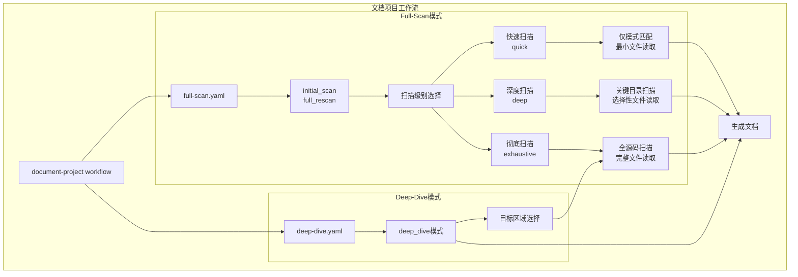
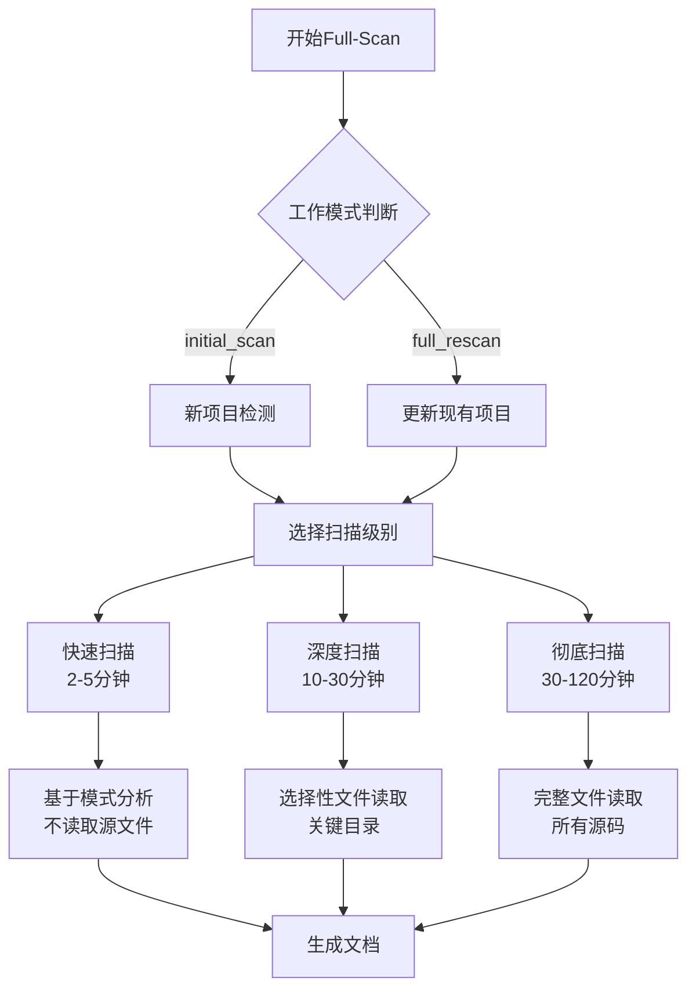
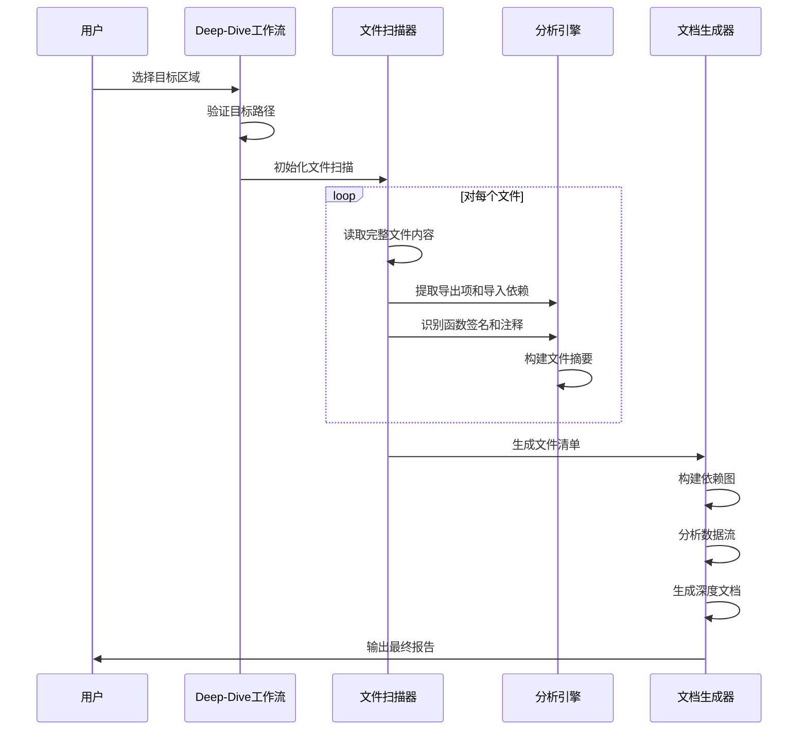
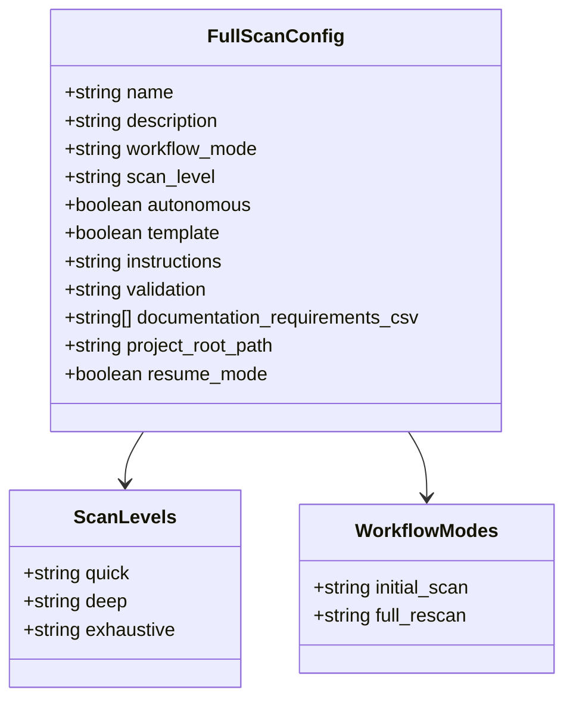
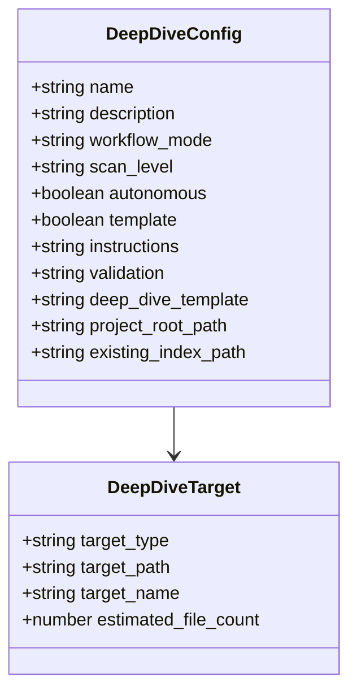
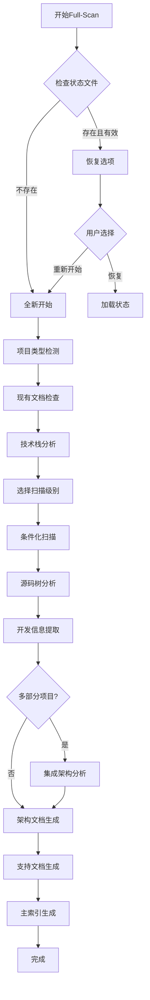
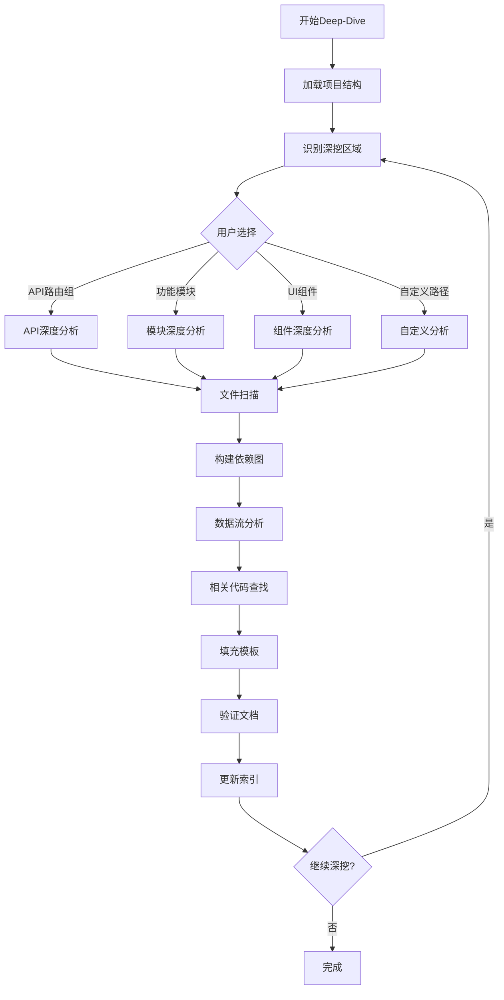
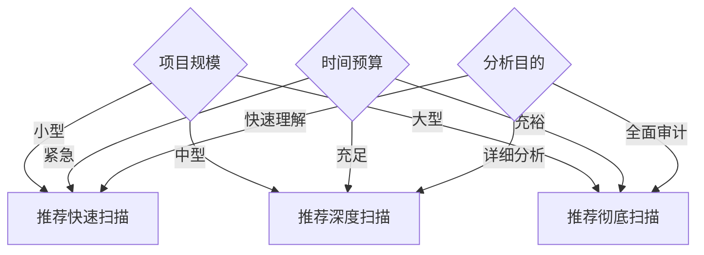

# 文档扫描模式

<cite>
**本文档引用的文件**
- [full-scan.yaml](file://src/modules/bmm/workflows/document-project/workflows/full-scan.yaml)
- [deep-dive.yaml](file://src/modules/bmm/workflows/document-project/workflows/deep-dive.yaml)
- [full-scan-instructions.md](file://src/modules/bmm/workflows/document-project/workflows/full-scan-instructions.md)
- [deep-dive-instructions.md](file://src/modules/bmm/workflows/document-project/workflows/deep-dive-instructions.md)
- [workflow.yaml](file://src/modules/bmm/workflows/document-project/workflow.yaml)
- [documentation-requirements.csv](file://src/modules/bmm/workflows/document-project/documentation-requirements.csv)
- [checklist.md](file://src/modules/bmm/workflows/document-project/checklist.md)
- [project-scan-report-schema.json](file://src/modules/bmm/workflows/document-project/templates/project-scan-report-schema.json)
- [deep-dive-template.md](file://src/modules/bmm/workflows/document-project/templates/deep-dive-template.md)
</cite>

## 目录
1. [概述](#概述)
2. [扫描模式架构](#扫描模式架构)
3. [Full-Scan模式详解](#full-scan模式详解)
4. [Deep-Dive模式详解](#deep-dive模式详解)
5. [配置文件对比分析](#配置文件对比分析)
6. [操作流程差异](#操作流程差异)
7. [应用场景与选择标准](#应用场景与选择标准)
8. [性能特征对比](#性能特征对比)
9. [最佳实践建议](#最佳实践建议)
10. [总结](#总结)

## 概述

BMAD-METHOD项目提供了两种核心的文档生成扫描模式：**Full-Scan**（全面扫描）和**Deep-Dive**（深度挖掘）。这两种模式针对不同的项目规模和文档需求，提供了灵活的文档生成解决方案。

### 核心设计理念

两种扫描模式都遵循以下核心原则：
- **渐进式文档生成**：每个文档在生成后立即写入磁盘并验证
- **内存优化**：扫描结果在写入后从内存中清理，保持低内存占用
- **可恢复性**：通过状态文件实现工作流中断后的恢复能力
- **批量处理策略**：对深度和彻底扫描采用子文件夹批处理机制

## 扫描模式架构



**图表来源**
- [workflow.yaml](file://src/modules/bmm/workflows/document-project/workflow.yaml#L1-L32)
- [full-scan.yaml](file://src/modules/bmm/workflows/document-project/workflows/full-scan.yaml#L1-L32)
- [deep-dive.yaml](file://src/modules/bmm/workflows/document-project/workflows/deep-dive.yaml#L1-L32)

## Full-Scan模式详解

### 工作流配置特点

Full-Scan模式是项目的主要文档生成入口，支持三种扫描级别，适用于全面的项目分析。

#### 配置参数详解

| 参数 | 值 | 说明 |
|------|-----|------|
| `name` | "document-project-full-scan" | 工作流名称标识 |
| `description` | "Complete project documentation workflow" | 完整项目文档工作流描述 |
| `workflow_mode` | "" | 运行时动态设置：initial_scan或full_rescan |
| `scan_level` | "" | 运行时动态设置：quick、deep或exhaustive |
| `autonomous` | false | 需要用户在关键决策点输入 |
| `template` | false | 行动工作流，生成多个输出文件 |

#### 扫描级别策略



**图表来源**
- [full-scan-instructions.md](file://src/modules/bmm/workflows/document-project/workflows/full-scan-instructions.md#L88-L128)

### 数据收集策略

Full-Scan模式采用分层的数据收集策略：

#### 1. 项目类型检测
基于`documentation-requirements.csv`中的关键文件模式进行项目类型识别，涵盖12种项目类型。

#### 2. 条件化扫描
根据项目类型要求，只扫描必要的文档领域：
- API扫描：路由文件、控制器、中间件
- 数据模型：数据库表、实体、迁移文件
- 状态管理：Redux、Context、状态容器
- UI组件：组件库、设计系统、布局组件

#### 3. 批量处理机制
对于深度和彻底扫描，采用子文件夹批处理：
- 按目录组织扫描批次
- 大文件（>5000 LOC）特殊处理
- 每个批次完成后清理上下文

**章节来源**
- [full-scan.yaml](file://src/modules/bmm/workflows/document-project/workflows/full-scan.yaml#L1-L32)
- [full-scan-instructions.md](file://src/modules/bmm/workflows/document-project/workflows/full-scan-instructions.md#L1-L800)

## Deep-Dive模式详解

### 工作流配置特点

Deep-Dive模式专为特定区域的深度分析设计，始终使用彻底扫描策略。

#### 配置参数详解

| 参数 | 值 | 说明 |
|------|-----|------|
| `name` | "document-project-deep-dive" | 深度挖掘工作流名称 |
| `workflow_mode` | "deep_dive" | 固定深度挖掘模式 |
| `scan_level` | "exhaustive" | 强制彻底扫描级别 |
| `autonomous` | false | 需要用户选择目标区域 |
| `template` | false | 行动工作流 |
| `deep_dive_template` | 模板路径 | 深度挖掘文档模板 |

### 深度分析流程



**图表来源**
- [deep-dive-instructions.md](file://src/modules/bmm/workflows/document-project/workflows/deep-dive-instructions.md#L83-L146)

### 深度分析特性

#### 1. 全面文件审查
- **强制彻底扫描**：必须阅读目标区域内每个文件的每一行
- **禁止采样**：不允许依赖工具输出或猜测
- **逐行分析**：提取每个导出项的详细信息

#### 2. 关联分析能力
- **依赖关系图**：构建完整的导入/导出关系网络
- **数据流追踪**：跟踪函数调用和数据转换过程
- **集成点识别**：发现外部API和服务接口

#### 3. 智能目标识别
系统自动分析现有文档结构，提供以下深挖选项：
- API路由组（按端点数量排序）
- 功能模块（按文件数量排序）
- UI组件区域（按组件数量排序）
- 服务/业务逻辑（按路径组织）

**章节来源**
- [deep-dive.yaml](file://src/modules/bmm/workflows/document-project/workflows/deep-dive.yaml#L1-L32)
- [deep-dive-instructions.md](file://src/modules/bmm/workflows/document-project/workflows/deep-dive-instructions.md#L1-L299)

## 配置文件对比分析

### Full-Scan配置文件结构



**图表来源**
- [full-scan.yaml](file://src/modules/bmm/workflows/document-project/workflows/full-scan.yaml#L1-L32)

### Deep-Dive配置文件结构



**图表来源**
- [deep-dive.yaml](file://src/modules/bmm/workflows/document-project/workflows/deep-dive.yaml#L1-L32)

### 关键差异对比

| 特性 | Full-Scan | Deep-Dive |
|------|-----------|-----------|
| **工作模式** | initial_scan \| full_rescan | deep_dive |
| **扫描级别** | 可选：quick/deep/exhaustive | 固定：exhaustive |
| **自主性** | 需要用户输入 | 需要用户选择目标 |
| **模板系统** | 无 | 使用深度挖掘模板 |
| **目标范围** | 整个项目 | 特定区域 |
| **文件处理** | 批量处理 | 单文件深度分析 |
| **输出格式** | 多文档集合 | 单一深度分析报告 |

**章节来源**
- [full-scan.yaml](file://src/modules/bmm/workflows/document-project/workflows/full-scan.yaml#L1-L32)
- [deep-dive.yaml](file://src/modules/bmm/workflows/document-project/workflows/deep-dive.yaml#L1-L32)

## 操作流程差异

### Full-Scan操作流程



**图表来源**
- [full-scan-instructions.md](file://src/modules/bmm/workflows/document-project/workflows/full-scan-instructions.md#L150-L800)

### Deep-Dive操作流程



**图表来源**
- [deep-dive-instructions.md](file://src/modules/bmm/workflows/document-project/workflows/deep-dive-instructions.md#L13-L299)

**章节来源**
- [full-scan-instructions.md](file://src/modules/bmm/workflows/document-project/workflows/full-scan-instructions.md#L1-L800)
- [deep-dive-instructions.md](file://src/modules/bmm/workflows/document-project/workflows/deep-dive-instructions.md#L1-L299)

## 应用场景与选择标准

### Full-Scan适用场景

#### 1. 新项目初始化
- **场景描述**：首次对项目进行全面文档化
- **优势**：提供完整的项目概览和结构分析
- **输出**：项目总览、架构文档、开发指南等

#### 2. 项目重构前分析
- **场景描述**：在大规模重构前了解项目结构
- **优势**：识别关键依赖关系和潜在风险点
- **推荐扫描级别**：deep或exhaustive

#### 3. 团队交接文档
- **场景描述**：新团队成员入职时的项目理解
- **优势**：提供标准化的项目理解和学习路径
- **推荐扫描级别**：quick或deep

### Deep-Dive适用场景

#### 1. 特定功能深入理解
- **场景描述**：需要深入了解某个具体功能模块
- **优势**：提供该功能的完整实现细节和最佳实践
- **典型应用**：复杂业务逻辑、核心算法、第三方集成

#### 2. 代码质量评估
- **场景描述**：评估特定代码区域的质量和可维护性
- **优势**：详细的代码分析和改进建议
- **输出**：代码质量报告和重构建议

#### 3. 技术债务分析
- **场景描述**：识别和分析项目中的技术债务
- **优势**：深入的技术债务识别和量化分析
- **关注重点**：重复代码、复杂度高、缺乏测试的区域

### 决策矩阵

| 项目特征 | Full-Scan推荐 | Deep-Dive推荐 | 理由 |
|----------|---------------|---------------|------|
| **项目规模** | 小型(<1000LOC) | 中大型(>1000LOC) | 大项目需要更精细的分析 |
| **时间预算** | 紧急(1小时内) | 充足(数小时以上) | 深度分析需要更多时间 |
| **分析目的** | 快速理解 | 深入理解 | 目的不同导致方法选择不同 |
| **团队经验** | 新手团队 | 经验团队 | 经验团队更适合深度分析 |
| **文档需求** | 概览性文档 | 详细技术文档 | 需求层次不同 |

**章节来源**
- [full-scan-instructions.md](file://src/modules/bmm/workflows/document-project/workflows/full-scan-instructions.md#L63-L78)
- [deep-dive-instructions.md](file://src/modules/bmm/workflows/document-project/workflows/deep-dive-instructions.md#L14-L81)

## 性能特征对比

### 时间复杂度分析

```mermaid
graph LR
subgraph "扫描级别性能对比"
QUICK[快速扫描<br/>O(n)] --> Q_TIME[2-5分钟]
DEEP[深度扫描<br/>O(k×m)] --> D_TIME[10-30分钟]
EXHAUSTIVE[彻底扫描<br/>O(n×m)] --> E_TIME[30-120分钟]
Q_TIME --> Q_MEM[低内存占用]
D_TIME --> D_MEM[中等内存占用]
E_TIME --> E_MEM[高内存占用]
end
subgraph "Deep-Dive性能特征"
DD_TARGET[目标区域大小] --> DD_TIME[线性增长]
DD_MEM[内存占用] --> DD_FILE_COUNT[文件数量相关]
end
```

### 资源消耗对比

| 指标 | Quick Scan | Deep Scan | Exhaustive Scan | Deep-Dive |
|------|------------|-----------|-----------------|-----------|
| **CPU使用** | 低 | 中等 | 高 | 中等 |
| **内存使用** | 低 | 中等 | 高 | 中等 |
| **磁盘IO** | 低 | 中等 | 高 | 中等 |
| **网络请求** | 无 | 无 | 无 | 无 |
| **并发处理** | 不支持 | 支持 | 支持 | 不支持 |

### 扫描效率优化

#### Full-Scan优化策略
1. **智能缓存**：项目类型检测结果缓存
2. **批量处理**：子文件夹级批处理机制
3. **内存管理**：扫描后立即清理上下文
4. **增量更新**：支持断点续传和增量扫描

#### Deep-Dive优化策略
1. **目标聚焦**：只分析选定区域
2. **并行处理**：文件级并行分析
3. **智能过滤**：排除无关文件类型
4. **结果缓存**：分析结果本地缓存

**章节来源**
- [checklist.md](file://src/modules/bmm/workflows/document-project/checklist.md#L1-L34)

## 最佳实践建议

### Full-Scan最佳实践

#### 1. 扫描级别选择指南


#### 2. 项目类型检测优化
- **准确配置**：确保`documentation-requirements.csv`中的关键文件模式准确
- **多语言支持**：考虑项目中的多种编程语言
- **框架识别**：正确识别使用的前端和后端框架

#### 3. 输出质量保证
- **定期验证**：使用`checklist.md`中的验证清单
- **文档完整性**：确保所有必需的文档类型都已生成
- **链接有效性**：验证所有内部链接的有效性

### Deep-Dive最佳实践

#### 1. 目标区域选择策略
- **业务价值优先**：优先分析对公司业务有重大影响的功能
- **技术复杂度**：重点关注技术难度高、风险大的模块
- **变更频率**：分析经常变更的代码区域
- **测试覆盖率**：优先分析测试覆盖不足的区域

#### 2. 深度分析质量控制
- **完整性检查**：确保所有相关文件都被分析
- **一致性验证**：保持分析风格和格式的一致性
- **知识传递**：确保分析结果易于其他开发者理解

#### 3. 结果应用指导
- **文档结构化**：使用标准模板确保文档结构清晰
- **版本管理**：跟踪深度分析结果的版本变化
- **持续更新**：建立定期重新分析的机制

### 通用最佳实践

#### 1. 工作流管理
- **状态文件保护**：定期备份项目扫描状态文件
- **错误处理**：建立完善的错误恢复机制
- **进度监控**：实时监控扫描进度和资源使用情况

#### 2. 输出管理
- **命名规范**：统一的文件命名和目录结构
- **版本控制**：将生成的文档纳入版本控制系统
- **访问权限**：合理设置文档的访问权限和分享策略

#### 3. 团队协作
- **知识共享**：建立文档评审和反馈机制
- **培训支持**：为团队成员提供扫描模式使用培训
- **持续改进**：根据使用反馈不断优化扫描策略

**章节来源**
- [checklist.md](file://src/modules/bmm/workflows/document-project/checklist.md#L1-L34)
- [project-scan-report-schema.json](file://src/modules/bmm/workflows/document-project/templates/project-scan-report-schema.json#L1-L42)

## 总结

BMAD-METHOD的文档扫描模式提供了灵活而强大的项目文档生成解决方案。通过Full-Scan和Deep-Dive两种模式的有机结合，能够满足从快速项目概览到深度技术分析的各种需求。

### 核心优势

1. **灵活性**：两种模式可以独立使用，也可以组合使用
2. **可扩展性**：支持多种项目类型和技术栈
3. **质量保证**：完善的验证机制和质量控制流程
4. **用户体验**：直观的操作界面和清晰的指导流程

### 发展方向

随着项目的不断发展，这两种扫描模式将继续演进：
- **智能化增强**：引入AI辅助的分析和建议
- **性能优化**：进一步提升大项目的扫描效率
- **生态整合**：与其他开发工具和平台的更好集成
- **定制化支持**：提供更多定制化的扫描策略和模板

通过合理选择和使用这两种扫描模式，开发团队可以显著提升项目文档的质量和可用性，为项目的长期维护和发展奠定坚实的基础。