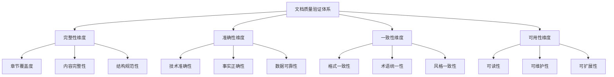
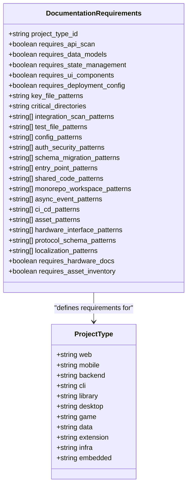
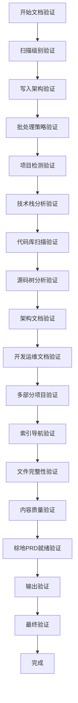
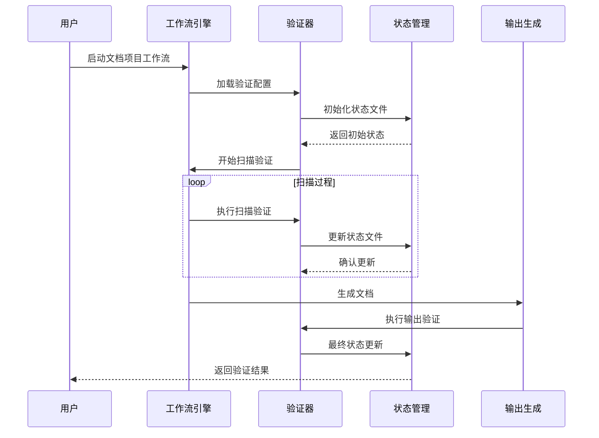
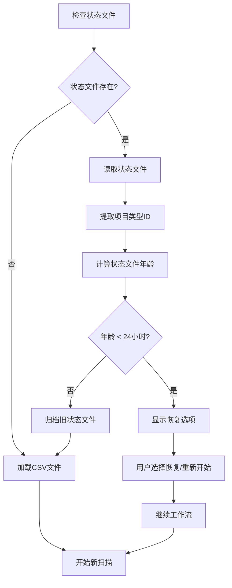
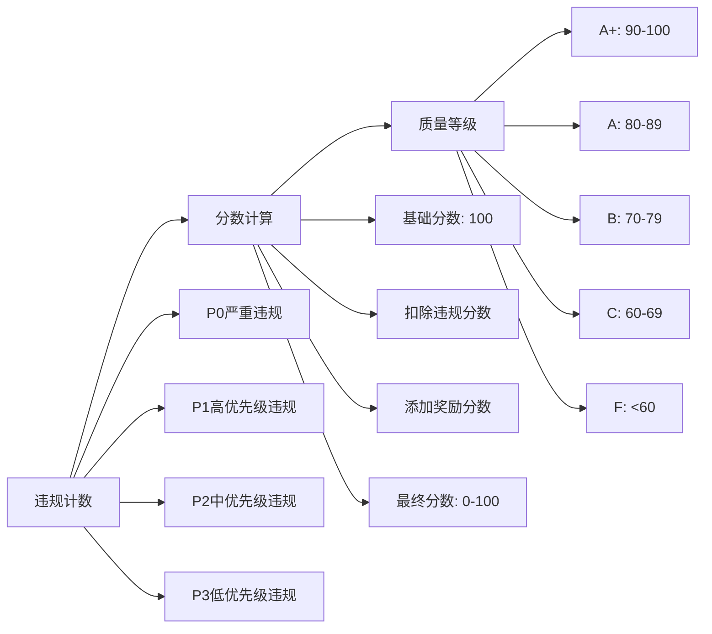
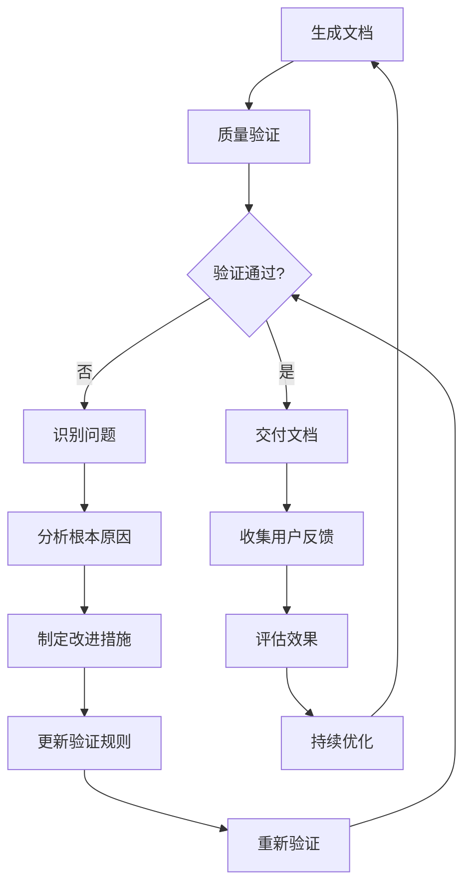
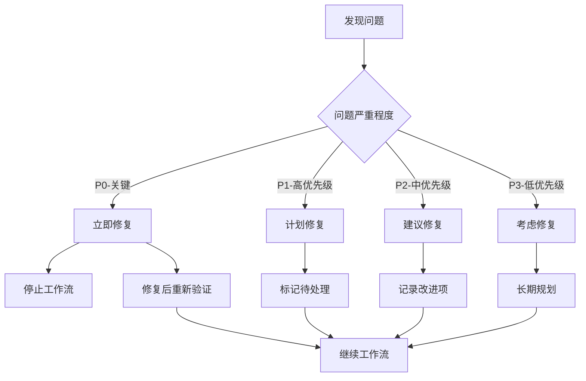

# 文档质量验证机制

<cite>
**本文档引用的文件**
- [documentation-requirements.csv](file://src/modules/bmm/workflows/document-project/documentation-requirements.csv)
- [checklist.md](file://src/modules/bmm/workflows/document-project/checklist.md)
- [workflow.yaml](file://src/modules/bmm/workflows/document-project/workflow.yaml)
- [instructions.md](file://src/modules/bmm/workflows/document-project/instructions.md)
- [documentation-standards.md](file://src/modules/bmm/data/documentation-standards.md)
- [agent-validation-checklist.md](file://src/modules/bmb/workflows/create-agent/data/agent-validation-checklist.md)
- [step-07-validation.md](file://src/modules/bmm/workflows/3-solutioning/architecture/steps/step-07-validation.md)
- [workflow-status-template.yaml](file://src/modules/bmm/workflows/workflow-status/workflow-status-template.yaml)
- [workflow-status.yaml](file://src/modules/bmm/workflows/workflow-status/workflow-status-template.yaml)
</cite>

## 目录
1. [引言](#引言)
2. [文档质量标准体系](#文档质量标准体系)
3. [documentation-requirements.csv深度解析](#documentation-requirementscsv深度解析)
4. [checklist.md完整性检查机制](#checklistmd完整性检查机制)
5. [workflow.yaml集成验证架构](#workflowyaml集成验证架构)
6. [自动化质量验证流程](#自动化质量验证流程)
7. [验证报告与质量度量](#验证报告与质量度量)
8. [质量改进与迭代机制](#质量改进与迭代机制)
9. [实际应用示例](#实际应用示例)
10. [总结](#总结)

## 引言

BMAD方法论构建了一套完整的文档质量验证机制，通过多层次、多维度的质量控制体系，确保生成的文档符合预设标准。该机制的核心在于将质量验证嵌入到文档生成的每个环节，实现从项目扫描到最终交付的全程质量保障。

## 文档质量标准体系

### 质量维度框架

BMAD的文档质量验证涵盖了以下核心维度：

**图表来源**
- [documentation-standards.md](file://src/modules/bmm/data/documentation-standards.md#L1-L50)

### 质量标准层次

系统采用分层的质量标准体系：

1. **基础合规层**：遵循CommonMark严格规范
2. **内容质量层**：确保技术准确性与实用性
3. **结构规范层**：保证文档组织的一致性
4. **用户体验层**：优化可读性与可维护性

**段落来源**
- [documentation-standards.md](file://src/modules/bmm/data/documentation-standards.md#L8-L70)

## documentation-requirements.csv深度解析

### 标准化文档要求矩阵

documentation-requirements.csv是BMAD质量验证的核心配置文件，定义了针对不同项目类型的标准化文档要求。

**图表来源**
- [documentation-requirements.csv](file://src/modules/bmm/workflows/document-project/documentation-requirements.csv#L1-L13)

### 关键质量指标

#### 技术栈识别维度

| 指标类别 | 描述 | 验证方式 |
|---------|------|----------|
| API扫描要求 | 是否需要API端点文档 | 基于项目类型自动判断 |
| 数据模型要求 | 是否需要数据架构文档 | 检查数据库相关模式 |
| 状态管理 | 是否需要状态管理模式文档 | 分析前端状态库使用 |
| UI组件 | 是否需要组件库文档 | 检查UI框架存在性 |
| 部署配置 | 是否需要部署架构文档 | 分析部署工具链 |

#### 文件模式匹配

系统通过精确的文件模式匹配来识别项目特征：

- **关键配置文件**：package.json、tsconfig.json、各种配置文件
- **源码目录**：src/、app/、components/等标准目录结构
- **测试文件**：*.test.ts、*.spec.ts等测试文件模式
- **配置文件**：.env*、config/*、*.config.*等配置模式

**段落来源**
- [documentation-requirements.csv](file://src/modules/bmm/workflows/document-project/documentation-requirements.csv#L2-L12)

## checklist.md完整性检查机制

### 全面的质量检查清单

checklist.md提供了详细的文档质量验证清单，涵盖从项目扫描到最终交付的各个阶段。

**图表来源**
- [checklist.md](file://src/modules/bmm/workflows/document-project/checklist.md#L1-L246)

### 关键验证项目

#### 扫描级别与可恢复性验证

- [ ] 扫描级别选择（快速/深度/彻底）提供给initial_scan和full_rescan模式
- [ ] 深度挖掘模式自动使用彻底扫描（不提供选择）
- [ ] 快速扫描不读取源文件（仅读取模式、配置、清单）
- [ ] 深度扫描读取项目类型的关键目录中的文件
- [ ] 彻底扫描读取所有源文件（排除node_modules、dist、build）

#### 写作即验证架构

- [ ] 每个文档立即写入磁盘后生成
- [ ] 在写入后进行文档验证（节级）
- [ ] 每次文档写入后更新状态文件
- [ ] 写入后从上下文中清除详细发现（仅保留摘要）
- [ ] 上下文仅包含高级摘要（每节1-2句话）

#### 多部分项目特定验证

- [ ] 每个部分单独记录
- [ ] 为每个部分创建特定的架构文件（architecture-{part_id}.md）
- [ ] 创建特定的组件库存（如果适用）
- [ ] 创建特定的开发指南
- [ ] 创建集成架构文档
- [ ] 明确定义集成点及其类型和详情

**段落来源**
- [checklist.md](file://src/modules/bmm/workflows/document-project/checklist.md#L1-L120)

## workflow.yaml集成验证架构

### 工作流配置框架

workflow.yaml定义了文档项目的完整工作流配置，集成了质量验证机制。

**图表来源**
- [workflow.yaml](file://src/modules/bmm/workflows/document-project/workflow.yaml#L1-L32)
- [instructions.md](file://src/modules/bmm/workflows/document-project/instructions.md#L1-L223)

### 配置参数体系

#### 核心配置变量

| 参数名称 | 类型 | 描述 | 默认值 |
|---------|------|------|--------|
| config_source | string | 配置源路径 | {project-root}/{bmad_folder}/bmm/config.yaml |
| output_folder | string | 输出文件夹路径 | 动态配置 |
| user_name | string | 用户名 | 动态配置 |
| communication_language | string | 通信语言 | 动态配置 |
| document_output_language | string | 文档输出语言 | 动态配置 |
| user_skill_level | string | 用户技能水平 | 动态配置 |

#### 验证组件配置

- **验证清单**：{installed_path}/checklist.md
- **文档要求CSV**：{installed_path}/documentation-requirements.csv
- **指令文件**：{installed_path}/instructions.md

**段落来源**
- [workflow.yaml](file://src/modules/bmm/workflows/document-project/workflow.yaml#L7-L25)

## 自动化质量验证流程

### 智能加载策略

系统采用智能加载策略，优先检查状态文件而非CSV文件：

**图表来源**
- [instructions.md](file://src/modules/bmm/workflows/document-project/instructions.md#L58-L120)

### 状态文件管理系统

#### 状态文件结构

状态文件（project-scan-report.json）包含以下关键字段：

- **工作流版本**：验证工作流的版本号
- **时间戳**：启动、最后更新、完成时间
- **模式**：工作流执行模式（initial_scan、full_rescan、deep_dive）
- **扫描级别**：快照深度级别（quick、deep、exhaustive）
- **已完成步骤**：完成步骤列表及时间戳
- **当前步骤**：当前执行的步骤
- **项目分类**：缓存的项目类型ID

#### 可恢复性机制

- **进度跟踪**：每个步骤完成后更新状态文件
- **断点续传**：支持从任意步骤恢复
- **状态验证**：确保状态文件的完整性和有效性
- **自动归档**：超过24小时的状态文件自动归档

**段落来源**
- [instructions.md](file://src/modules/bmm/workflows/document-project/instructions.md#L60-L120)

## 验证报告与质量度量

### 多维度质量评估

#### 测试审查质量评分系统

系统实现了完整的质量评分机制：

**图表来源**
- [checklist.md](file://src/modules/bmm/workflows/testarch/test-review/checklist.md#L175-L215)

#### 质量度量指标

| 度量维度 | 计算方式 | 权重 | 目标值 |
|---------|----------|------|--------|
| 完整性评分 | 关键检查项完成率 | 30% | ≥95% |
| 准确性评分 | 技术内容正确率 | 35% | ≥90% |
| 一致性评分 | 格式和风格一致性 | 20% | ≥90% |
| 可用性评分 | 用户体验满意度 | 15% | ≥85% |

### 实时质量监控

#### 进度跟踪机制

- **实时更新**：每次步骤完成后立即更新状态
- **进度可视化**：显示已完成步骤和总步骤比例
- **异常检测**：自动识别验证失败或遗漏项
- **提醒机制**：对关键问题及时提醒用户

#### 质量报告生成

系统自动生成详细的验证报告，包含：

- **总体质量评分**
- **各维度得分分布**
- **具体问题列表**
- **改进建议**
- **完成状态确认**

**段落来源**
- [checklist.md](file://src/modules/bmm/workflows/testarch/test-review/checklist.md#L175-L220)

## 质量改进与迭代机制

### 持续改进循环

#### 质量反馈闭环

#### 迭代优化策略

1. **问题分类系统**：
   - **关键问题**：必须修复的问题
   - **重要问题**：建议修复的问题  
   - **次要问题**：可选改进的问题

2. **知识积累机制**：
   - **最佳实践库**：积累成功的验证模式
   - **常见问题库**：记录典型问题及其解决方案
   - **模板库**：提供标准化的文档模板

3. **智能推荐系统**：
   - **个性化建议**：基于项目特征提供定制化改进建议
   - **优先级排序**：按影响程度对问题进行优先级排序
   - **自动化修复**：对简单问题提供自动修复选项

**段落来源**
- [agent-validation-checklist.md](file://src/modules/bmb/workflows/create-agent/data/agent-validation-checklist.md#L160-L175)

## 实际应用示例

### 验证流程实例

#### Web应用项目验证

对于典型的Web应用项目，系统会：

1. **项目类型识别**：通过package.json和关键文件识别为Web项目
2. **文档要求加载**：加载对应的文档要求配置
3. **扫描范围确定**：识别src/、app/、components/等关键目录
4. **技术栈分析**：检测React、Vue、Angular等前端框架
5. **API端点识别**：扫描API服务和路由定义
6. **数据模型提取**：识别数据库模式和GraphQL schema
7. **状态管理分析**：检测Redux、MobX等状态管理方案

#### 移动应用项目验证

对于移动应用项目：

1. **平台识别**：通过package.json、pubspec.yaml等识别iOS/Android
2. **架构分析**：检测MVVM、MVP等架构模式
3. **组件库验证**：识别UI组件库和设计系统
4. **API集成检查**：验证网络请求和数据同步
5. **权限管理分析**：检查认证授权机制

### 不符合项处理流程

#### 问题分类与处理

#### 处理决策矩阵

| 问题类型 | 处理策略 | 时间要求 | 影响范围 |
|---------|----------|----------|----------|
| 缺失关键章节 | 立即补充 | 当前批次 | 整个工作流 |
| 格式不规范 | 批量修正 | 下次运行 | 相关文档 |
| 内容不准确 | 单独修复 | 立即 | 相关章节 |
| 性能问题 | 优化重构 | 计划内 | 整体系统 |

### 验证报告解读

#### 报告结构分析

验证报告包含以下关键部分：

1. **执行摘要**：总体质量状况和主要发现
2. **详细检查结果**：每个验证项目的具体结果
3. **问题分类统计**：按严重程度分类的问题数量
4. **改进建议**：针对发现的问题的具体建议
5. **下一步行动**：后续需要采取的措施

#### 质量评分解读

- **90-100分**：优秀质量，文档完整且准确
- **80-89分**：良好质量，基本满足要求
- **70-79分**：合格质量，有少量改进空间
- **60-69分**：需改进，存在一定质量问题
- **<60分**：不合格，需要大量修改

**段落来源**
- [step-07-validation.md](file://src/modules/bmm/workflows/3-solutioning/architecture/steps/step-07-validation.md#L175-L220)

## 总结

BMAD的文档质量验证机制通过多层次、多维度的质量控制体系，实现了文档生成全过程的质量保障。该机制的核心优势包括：

1. **全面性**：覆盖从项目扫描到最终交付的完整生命周期
2. **自动化**：减少人工干预，提高验证效率和一致性
3. **智能化**：基于项目特征自动调整验证策略
4. **可追溯**：完整的状态跟踪和变更记录
5. **可扩展**：支持新项目类型和验证需求的扩展

通过这套完善的质量验证机制，BMAD确保生成的文档不仅符合技术标准，更能满足实际使用需求，为AI辅助开发提供高质量的基础支撑。随着系统的不断迭代优化，这一质量验证机制将继续提升文档质量和开发效率。