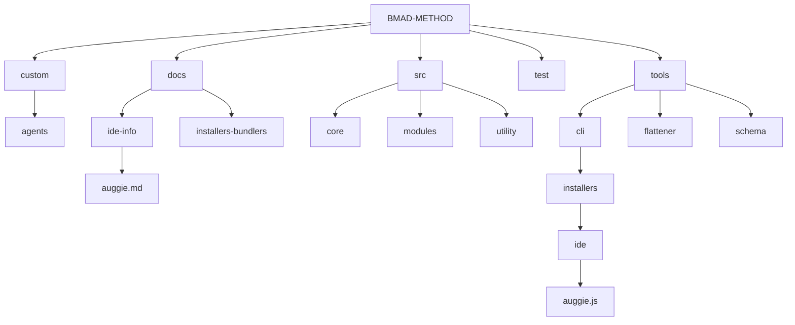
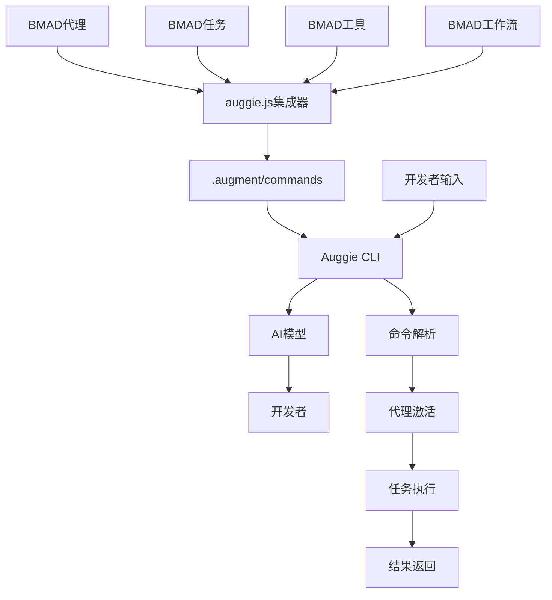
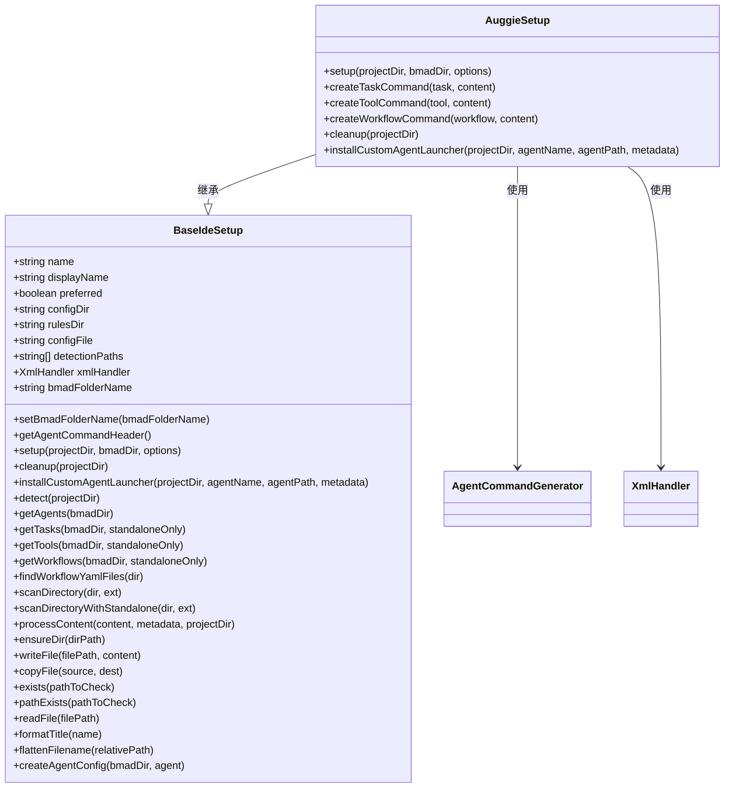
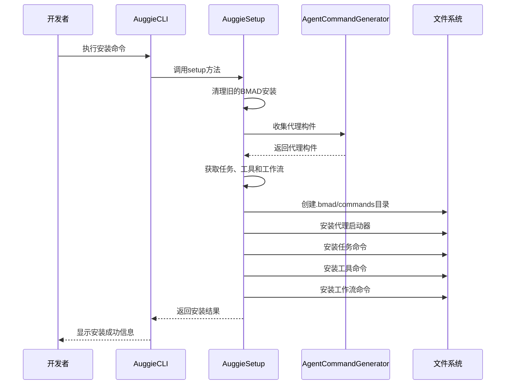
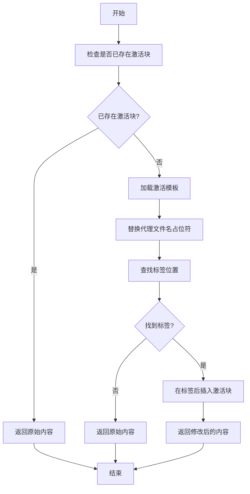
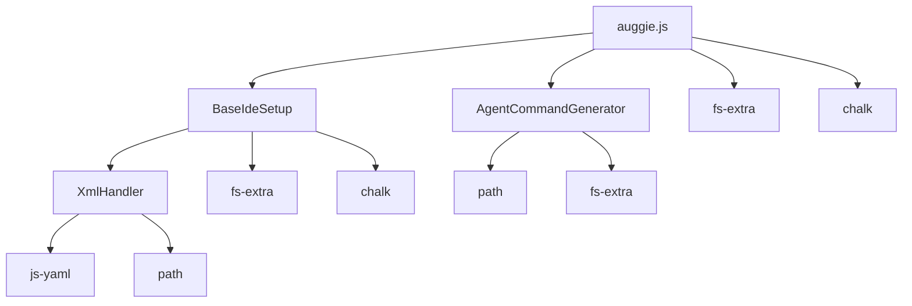

# Auggie 集成指南

<cite>
**本文档中引用的文件**  
- [auggie.md](file://docs/ide-info/auggie.md)
- [auggie.js](file://tools/cli/installers/lib/ide/auggie.js)
- [_base-ide.js](file://tools/cli/installers/lib/ide/_base-ide.js)
- [agent-command-header.md](file://src/utility/models/agent-command-header.md)
- [gemini-agent-command.toml](file://tools/cli/installers/lib/ide/templates/gemini-agent-command.toml)
- [agent-command-template.md](file://tools/cli/installers/lib/ide/templates/agent-command-template.md)
- [xml-handler.js](file://tools/cli/lib/xml-handler.js)
- [agent-activation-ide.xml](file://src/utility/models/agent-activation-ide.xml)
</cite>

## 目录
1. [简介](#简介)
2. [项目结构](#项目结构)
3. [核心组件](#核心组件)
4. [架构概述](#架构概述)
5. [详细组件分析](#详细组件分析)
6. [依赖分析](#依赖分析)
7. [性能考虑](#性能考虑)
8. [故障排除指南](#故障排除指南)
9. [结论](#结论)

## 简介
本指南详细说明了BMAD-METHOD在Auggie IDE环境中的集成流程。Auggie作为一款AI辅助开发工具，通过命令注入和状态同步机制与BMAD框架协同工作，为开发者提供智能代理系统支持。本指南将深入解析auggie.js集成器的工作原理，涵盖安装配置、使用流程、实际案例以及常见问题的诊断与解决方法。

## 项目结构
BMAD-METHOD项目采用模块化设计，主要包含自定义代理、文档、核心模块、测试和工具等目录。Auggie集成主要涉及`tools/cli/installers/lib/ide/`目录下的集成器实现，以及`docs/ide-info/`目录下的使用说明。

**Diagram sources**
- [auggie.md](file://docs/ide-info/auggie.md)
- [auggie.js](file://tools/cli/installers/lib/ide/auggie.js)

**Section sources**
- [auggie.md](file://docs/ide-info/auggie.md)
- [auggie.js](file://tools/cli/installers/lib/ide/auggie.js)

## 核心组件
Auggie集成的核心组件包括auggie.js集成器、命令生成器、状态同步机制和代理激活系统。这些组件协同工作，确保BMAD代理能够在Auggie环境中正确加载和执行。

**Section sources**
- [auggie.js](file://tools/cli/installers/lib/ide/auggie.js)
- [_base-ide.js](file://tools/cli/installers/lib/ide/_base-ide.js)

## 架构概述
Auggie集成架构基于命令注入模式，通过将BMAD代理、任务、工具和工作流转换为Auggie可识别的命令格式，实现与Auggie AI功能的无缝集成。

**Diagram sources**
- [auggie.js](file://tools/cli/installers/lib/ide/auggie.js)
- [auggie.md](file://docs/ide-info/auggie.md)

## 详细组件分析

### Auggie集成器分析
Auggie集成器（auggie.js）是BMAD-METHOD与Auggie IDE之间的桥梁，负责将BMAD组件转换为Auggie可识别的格式。

#### 对象导向组件

**Diagram sources**
- [auggie.js](file://tools/cli/installers/lib/ide/auggie.js)
- [_base-ide.js](file://tools/cli/installers/lib/ide/_base-ide.js)

### 命令注入机制
Auggie集成器通过命令注入机制将BMAD组件注入到Auggie环境中，确保代理能够正确激活和执行。

#### API/服务组件

**Diagram sources**
- [auggie.js](file://tools/cli/installers/lib/ide/auggie.js)
- [agent-command-generator.js](file://tools/cli/installers/lib/ide/shared/agent-command-generator.js)

### 状态同步方式
Auggie集成器通过状态同步机制确保代理在激活时能够正确加载其配置和定义文件。

#### 复杂逻辑组件

**Diagram sources**
- [xml-handler.js](file://tools/cli/lib/xml-handler.js)
- [agent-activation-ide.xml](file://src/utility/models/agent-activation-ide.xml)

**Section sources**
- [auggie.js](file://tools/cli/installers/lib/ide/auggie.js)
- [_base-ide.js](file://tools/cli/installers/lib/ide/_base-ide.js)
- [xml-handler.js](file://tools/cli/lib/xml-handler.js)

## 依赖分析
Auggie集成器依赖于多个核心组件和工具库，这些依赖关系确保了集成器的正常运行。

**Diagram sources**
- [auggie.js](file://tools/cli/installers/lib/ide/auggie.js)
- [_base-ide.js](file://tools/cli/installers/lib/ide/_base-ide.js)
- [xml-handler.js](file://tools/cli/lib/xml-handler.js)

**Section sources**
- [auggie.js](file://tools/cli/installers/lib/ide/auggie.js)
- [_base-ide.js](file://tools/cli/installers/lib/ide/_base-ide.js)
- [xml-handler.js](file://tools/cli/lib/xml-handler.js)

## 性能考虑
Auggie集成器在设计时考虑了性能优化，通过批量操作和异步处理提高安装效率。

- **批量操作**：集成器一次性处理所有代理、任务、工具和工作流的安装，减少文件系统操作次数。
- **异步处理**：所有文件操作均采用异步方式，避免阻塞主线程。
- **缓存机制**：代理构件在收集时进行缓存，避免重复读取和处理。
- **错误处理**：完善的错误处理机制确保在部分失败时仍能完成大部分安装任务。

## 故障排除指南
本节提供Auggie集成过程中常见问题的诊断和解决方法。

### 常见问题及解决方案

| 问题 | 可能原因 | 解决方案 |
|------|---------|---------|
| 代理无法激活 | 代理文件未正确安装 | 检查.baugment/commands/bmad/agents目录是否存在代理文件 |
| 命令不识别 | Auggie配置未正确加载 | 确认项目根目录存在.augment目录 |
| 激活检查表未执行 | 激活块未正确注入 | 检查代理文件是否包含激活块 |
| 依赖缺失 | npm包未正确安装 | 运行npm install安装所有依赖 |
| 路径错误 | 相对路径计算错误 | 检查项目根目录和BMAD安装目录的相对关系 |

**Section sources**
- [auggie.js](file://tools/cli/installers/lib/ide/auggie.js)
- [auggie.md](file://docs/ide-info/auggie.md)

## 结论
Auggie集成指南详细介绍了BMAD-METHOD在Auggie环境中的安装配置和使用流程。通过深入分析auggie.js集成器的工作原理，我们了解了其与Auggie AI功能的协同工作机制、命令注入机制以及状态同步方式。提供的实际使用案例和配置示例展示了代理系统在Auggie中的具体表现，而常见问题的诊断和解决方法则确保用户能够顺利集成和使用框架功能。本指南为开发者提供了全面的参考，帮助他们充分利用BMAD-METHOD的强大功能。