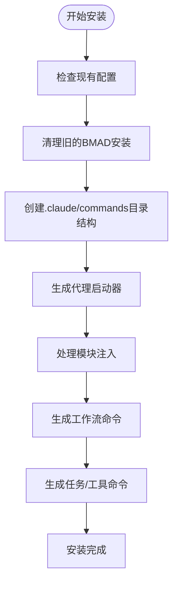
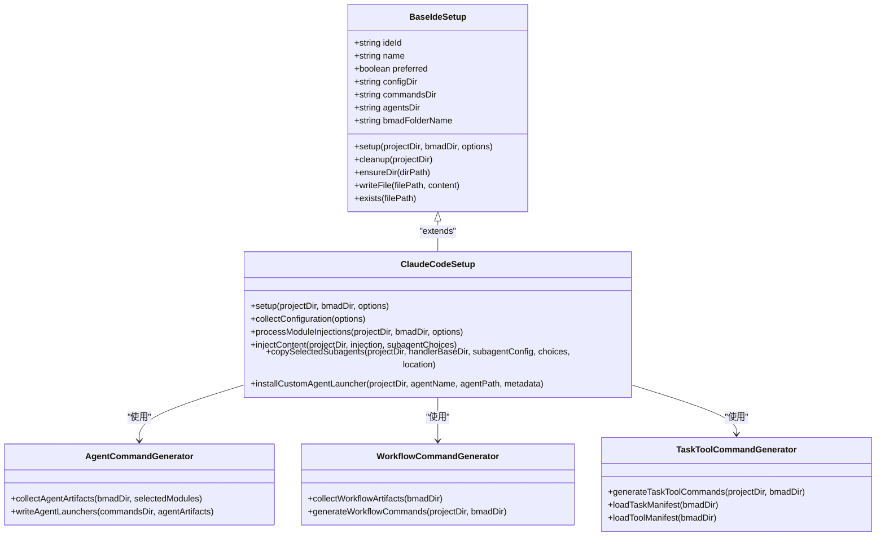
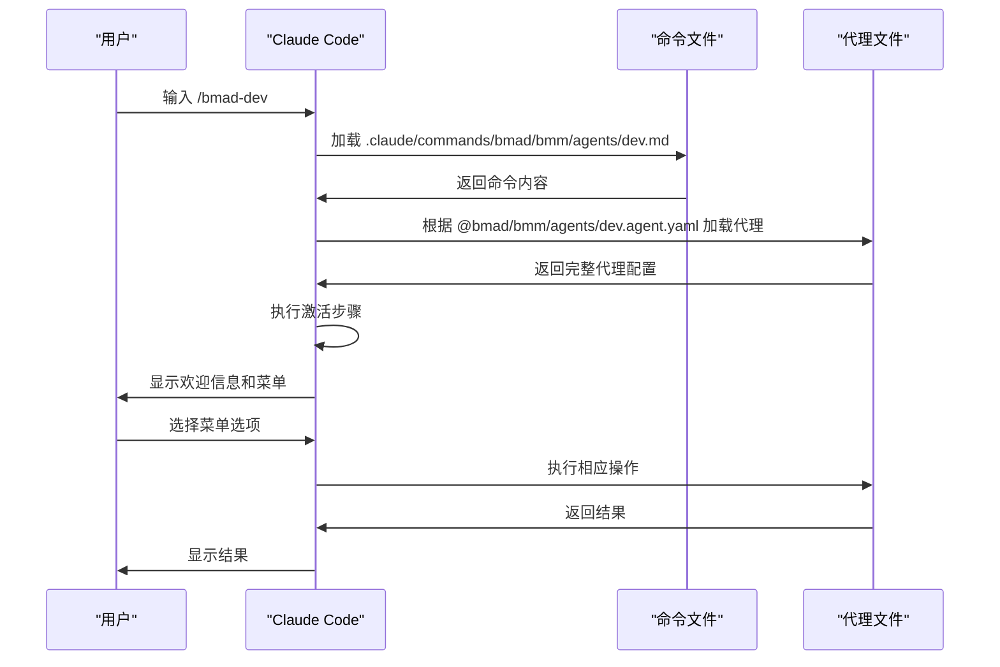
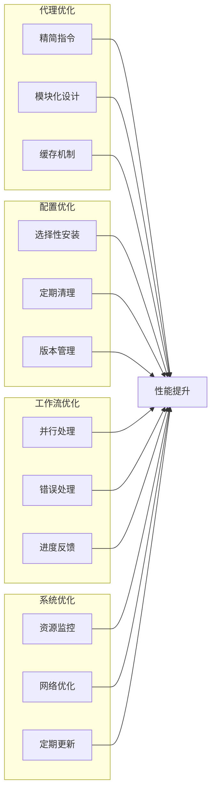

# Claude Code 集成指南

<cite>
**本文档中引用的文件**  
- [claude-code.md](file://docs/ide-info/claude-code.md)
- [claude-code.js](file://tools/cli/installers/lib/ide/claude-code.js)
- [injections.yaml](file://src/modules/bmm/sub-modules/claude-code/injections.yaml)
- [agent-command-template.md](file://tools/cli/installers/lib/ide/templates/agent-command-template.md)
- [installer.js](file://tools/cli/lib/agent/installer.js)
</cite>

## 目录
1. [简介](#简介)
2. [安装与配置](#安装与配置)
3. [核心工作机制](#核心工作机制)
4. [上下文加载流程](#上下文加载流程)
5. [通信协议与命令注入](#通信协议与命令注入)
6. [配置示例与命令模板](#配置示例与命令模板)
7. [常见问题排查](#常见问题排查)
8. [特有功能与限制](#特有功能与限制)
9. [性能优化建议](#性能优化建议)
10. [结论](#结论)

## 简介

BMAD-METHOD框架为Claude Code提供了深度集成支持，通过专门的集成器实现智能代理、工作流和工具的无缝集成。本指南详细说明了如何在Claude Code环境中安装、配置和使用BMAD-METHOD框架，涵盖从基础安装到高级功能的各个方面。

该集成利用Claude Code的slash命令系统，将BMAD-METHOD的代理和工作流暴露为可直接调用的命令，使用户能够通过简单的命令触发复杂的开发工作流。集成的核心是`claude-code.js`文件，它作为平台特定的安装器，负责配置项目环境并注入必要的命令和上下文。

**Section sources**
- [claude-code.md](file://docs/ide-info/claude-code.md#L1-L26)

## 安装与配置

在Claude Code中安装BMAD-METHOD框架需要执行一系列配置步骤，这些步骤由专门的安装器自动处理。安装过程主要通过`claude-code.js`文件中的`ClaudeCodeSetup`类实现。

安装器首先创建必要的目录结构`.claude/commands/bmad/`，然后生成代理启动器文件。这些启动器是轻量级的Markdown文件，它们引用存储在`.bmad/`目录中的实际代理文件。安装器还处理模块特定的注入，允许不同模块为Claude Code提供定制化的功能扩展。

配置过程中，系统会提示用户选择是否安装子代理以及安装位置（项目级别或用户级别）。子代理提供专业化的功能，如市场研究、需求分析和技术评估，可以根据项目需求选择性安装。



**Diagram sources**
- [claude-code.js](file://tools/cli/installers/lib/ide/claude-code.js#L104-L189)

**Section sources**
- [claude-code.js](file://tools/cli/installers/lib/ide/claude-code.js#L20-L26)
- [claude-code.js](file://tools/cli/installers/lib/ide/claude-code.js#L104-L189)

## 核心工作机制

Claude Code集成器的核心工作机制基于代理命令的注入和上下文管理。`ClaudeCodeSetup`类继承自`BaseIdeSetup`，实现了Claude Code特定的配置逻辑。

集成器的主要功能包括：
- 创建和管理`.claude/commands/bmad/`目录结构
- 生成代理、工作流和任务/工具的启动命令
- 处理模块特定的内容注入
- 管理子代理的安装和配置

当用户在Claude Code中输入斜杠(`/`)时，系统会自动检测`.claude/commands/`目录下的命令文件，并提供自动补全功能。每个命令文件都是一个Markdown文档，包含元数据和激活指令，指导Claude如何加载和执行相应的代理或工作流。



**Diagram sources**
- [claude-code.js](file://tools/cli/installers/lib/ide/claude-code.js#L20-L509)
- [agent-command-generator.js](file://tools/cli/installers/lib/ide/shared/agent-command-generator.js)
- [workflow-command-generator.js](file://tools/cli/installers/lib/ide/shared/workflow-command-generator.js)
- [task-tool-command-generator.js](file://tools/cli/installers/lib/ide/shared/task-tool-command-generator.js)

**Section sources**
- [claude-code.js](file://tools/cli/installers/lib/ide/claude-code.js#L20-L509)

## 上下文加载流程

BMAD-METHOD框架在Claude Code中的上下文加载流程是一个精心设计的过程，确保代理能够正确加载其完整的配置和指令。当用户调用一个代理命令时，会发生以下步骤：

1. Claude Code加载相应的命令文件（如`/bmad:bmm:agents:dev.md`）
2. 解析文件中的元数据和激活指令
3. 根据`<agent-activation>`指令中的路径加载完整的代理文件
4. 执行代理文件中定义的激活步骤
5. 显示欢迎信息和菜单选项
6. 等待用户输入以继续交互

关键的上下文加载机制体现在代理启动器模板中，该模板使用`{project-root}`占位符来确保路径的正确解析。`processContent`方法被重写以保留这个占位符，直到运行时才进行实际的路径替换。



**Diagram sources**
- [agent-command-template.md](file://tools/cli/installers/lib/ide/templates/agent-command-template.md#L1-L15)
- [claude-code.js](file://tools/cli/installers/lib/ide/claude-code.js#L208-L211)

**Section sources**
- [agent-command-template.md](file://tools/cli/installers/lib/ide/templates/agent-command-template.md#L1-L15)
- [claude-code.js](file://tools/cli/installers/lib/ide/claude-code.js#L208-L211)

## 通信协议与命令注入

BMAD-METHOD框架与Claude Code之间的通信协议基于标准化的命令文件格式和内容注入机制。核心通信协议包含以下几个关键组件：

### 命令文件协议
每个命令文件遵循统一的Markdown格式，包含YAML元数据和激活指令。元数据部分定义了命令的名称和描述，而激活指令部分则规定了如何加载和执行代理。

### 内容注入协议
`injections.yaml`文件定义了模块特定的内容注入规则，允许在安装过程中将定制化的内容注入到工作流和模板文件中。这种机制支持条件性注入，根据用户的选择决定是否注入特定内容。

### 子代理通信协议
子代理通过特定的调用语法与主代理通信，形成一个协作的智能代理网络。主代理可以在执行过程中调用子代理来完成特定的专业任务。

```mermaid
flowchart TD
subgraph "命令文件结构"
Metadata["YAML元数据\nname: 'dev'\ndescription: '开发代理'"]
Activation["<agent-activation>\n1. LOAD代理文件\n2. READ内容\n3. 执行激活步骤\n4. 显示菜单\n5. 等待输入\n</agent-activation>"]
end
subgraph "内容注入机制"
InjectionConfig["injections.yaml\n- file: 路径\n- point: 注入点\n- requires: 条件\n- content: 内容"]
InjectionProcess["注入过程\n1. 检查注入点\n2. 验证条件\n3. 执行注入"]
end
subgraph "子代理通信"
MainAgent["主代理\n(如: dev)"]
SubAgent1["子代理\n(如: requirements-analyst)"]
SubAgent2["子代理\n(如: technical-evaluator)"]
SubAgent3["子代理\n(如: document-reviewer)"]
end
Metadata --> Activation
InjectionConfig --> InjectionProcess
MainAgent --> SubAgent1 : "调用"
MainAgent --> SubAgent2 : "调用"
MainAgent --> SubAgent3 : "调用"
style Metadata fill:#f9f,stroke:#333
style Activation fill:#f9f,stroke:#333
style InjectionConfig fill:#bbf,stroke:#333
style InjectionProcess fill:#bbf,stroke:#333
style MainAgent fill:#f96,stroke:#333
style SubAgent1 fill:#6f9,stroke:#333
style SubAgent2 fill:#6f9,stroke:#333
style SubAgent3 fill:#6f9,stroke:#333
```

**Diagram sources**
- [injections.yaml](file://src/modules/bmm/sub-modules/claude-code/injections.yaml#L12-L243)
- [agent-command-template.md](file://tools/cli/installers/lib/ide/templates/agent-command-template.md#L1-L15)

**Section sources**
- [injections.yaml](file://src/modules/bmm/sub-modules/claude-code/injections.yaml#L12-L243)
- [agent-command-template.md](file://tools/cli/installers/lib/ide/templates/agent-command-template.md#L1-L15)

## 配置示例与命令模板

本节提供具体的配置示例和命令模板，展示如何在Claude Code界面中触发和执行工作流。

### 代理命令示例
```markdown
---
name: 'dev'
description: '开发代理'
---
You must fully embody this agent's persona and follow all activation instructions exactly as specified. NEVER break character until given an exit command.

<agent-activation CRITICAL="TRUE">
1. LOAD the FULL agent file from @bmad/bmm/agents/dev.agent.yaml
2. READ its entire contents - this contains the complete agent persona, menu, and instructions
3. FOLLOW every step in the <activation> section precisely
4. DISPLAY the welcome/greeting as instructed
5. PRESENT the numbered menu
6. WAIT for user input before proceeding
</agent-activation>
```

### 工作流执行命令
用户可以在Claude Code中使用以下命令来激活不同的代理和工作流：

```
/bmad:bmm:agents:dev - 激活开发代理
/bmad:bmm:agents:architect - 激活架构师代理
/bmad:bmm:workflows:dev-story - 执行开发故事工作流
/bmad:custom:agents:commit-poet - 激活自定义提交诗人代理
```

### 自定义代理安装
通过`createIdeSlashCommands`函数，系统可以为自定义代理创建相应的命令文件：

```javascript
async function createIdeSlashCommands(projectRoot, agentName, agentPath, metadata) {
  // 读取manifest.yaml获取已安装的IDE
  const manifestPath = path.join(projectRoot, '.bmad', '_cfg', 'manifest.yaml');
  let installedIdes = ['claude-code']; // 默认为Claude Code
  
  if (fs.existsSync(manifestPath)) {
    const yamlLib = require('yaml');
    const manifestContent = fs.readFileSync(manifestPath, 'utf8');
    const manifest = yamlLib.parse(manifestContent);
    if (manifest.ides && Array.isArray(manifest.ides)) {
      installedIdes = manifest.ides;
    }
  }
  
  // 使用IdeManager为所有配置的IDE安装自定义代理启动器
  const { IdeManager } = require('../../installers/lib/ide/manager');
  const ideManager = new IdeManager();
  
  const results = await ideManager.installCustomAgentLaunchers(installedIdes, projectRoot, agentName, agentPath, metadata);
  
  return results;
}
```

**Section sources**
- [agent-command-template.md](file://tools/cli/installers/lib/ide/templates/agent-command-template.md#L1-L15)
- [claude-code.md](file://docs/ide-info/claude-code.md#L9-L25)
- [installer.js](file://tools/cli/lib/agent/installer.js#L590-L611)

## 常见问题排查

本节解决常见的集成问题，提供有效的解决方案。

### 命令不显示
**问题**: 在Claude Code中输入斜杠(`/`)后，BMAD命令未显示。

**解决方案**:
1. 确认`.claude/commands/bmad/`目录已正确创建
2. 检查命令文件是否具有正确的`.md`扩展名
3. 验证文件权限是否允许读取
4. 重启Claude Code以刷新命令缓存

### 上下文解析失败
**问题**: 代理无法正确加载其配置文件，出现上下文解析错误。

**解决方案**:
1. 检查代理文件路径是否正确，特别是`{project-root}`占位符的处理
2. 确认代理文件是否存在且可读
3. 验证YAML格式是否正确，无语法错误
4. 检查网络连接，确保远程资源可访问

### 子代理调用失败
**问题**: 主代理无法成功调用子代理。

**解决方案**:
1. 确认子代理已正确安装到`.claude/agents/`目录
2. 检查子代理文件名是否匹配调用名称
3. 验证子代理文件格式是否正确
4. 确保主代理和子代理版本兼容

### 性能缓慢
**问题**: 代理响应缓慢，加载时间过长。

**解决方案**:
1. 检查代理文件大小，避免过大
2. 优化代理指令，减少不必要的步骤
3. 确保网络连接稳定
4. 考虑本地缓存常用资源

**Section sources**
- [claude-code.js](file://tools/cli/installers/lib/ide/claude-code.js#L473-L507)
- [claude-code.js](file://tools/cli/installers/lib/ide/claude-code.js#L394-L413)

## 特有功能与限制

### 特有功能
1. **子代理系统**: 支持专业化的子代理，可在主工作流中按需调用
2. **条件性注入**: 根据用户选择动态注入相关内容
3. **多级命令结构**: 支持模块化命令组织，便于管理大量代理和工作流
4. **项目级与用户级安装**: 灵活的安装选项，支持不同范围的配置

### 限制
1. **文件大小限制**: 过大的代理文件可能导致加载缓慢或失败
2. **路径解析依赖**: 依赖正确的路径解析机制，跨平台时可能出现问题
3. **版本兼容性**: 不同版本的代理和框架可能存在兼容性问题
4. **网络依赖**: 某些功能依赖网络连接，离线环境可能受限

### 功能对比
| 功能 | Claude Code | 其他IDE |
|------|------------|--------|
| 子代理支持 | ✓ | ✗ |
| 条件性注入 | ✓ | △ |
| 多级命令结构 | ✓ | △ |
| 项目级安装 | ✓ | ✓ |
| 用户级安装 | ✓ | ✗ |
| 实时协作 | ✗ | ✓ |

**Section sources**
- [injections.yaml](file://src/modules/bmm/sub-modules/claude-code/injections.yaml#L6-L11)
- [claude-code.js](file://tools/cli/installers/lib/ide/claude-code.js#L34-L78)

## 性能优化建议

为了确保BMAD-METHOD框架在Claude Code中的最佳性能，建议遵循以下优化策略：

### 代理优化
1. **精简指令**: 保持代理指令简洁明了，避免冗余步骤
2. **模块化设计**: 将复杂代理分解为多个专业化的子代理
3. **缓存机制**: 对常用资源实现本地缓存，减少重复加载

### 配置优化
1. **选择性安装**: 只安装项目所需的模块和子代理
2. **定期清理**: 清理不再使用的代理和工作流
3. **版本管理**: 保持框架和代理的版本一致性

### 工作流优化
1. **并行处理**: 设计支持并行执行的工作流步骤
2. **错误处理**: 实现健壮的错误处理机制，避免工作流中断
3. **进度反馈**: 提供清晰的进度反馈，提高用户体验

### 系统优化
1. **资源监控**: 监控系统资源使用情况，及时发现性能瓶颈
2. **网络优化**: 确保稳定的网络连接，特别是对于远程资源
3. **定期更新**: 及时更新框架和依赖，获取性能改进



**Diagram sources**
- [claude-code.js](file://tools/cli/installers/lib/ide/claude-code.js#L136-L138)
- [claude-code.js](file://tools/cli/installers/lib/ide/claude-code.js#L164-L166)

**Section sources**
- [claude-code.js](file://tools/cli/installers/lib/ide/claude-code.js#L136-L188)

## 结论

BMAD-METHOD框架与Claude Code的集成提供了一个强大而灵活的开发辅助系统。通过深入理解安装配置、工作机制、上下文加载、通信协议等核心概念，开发者可以充分利用这一集成的优势，提高开发效率和质量。

集成器的设计体现了模块化、可扩展和用户友好的原则，支持从简单代理调用到复杂工作流执行的各种场景。通过合理配置和优化，可以实现高效、可靠的智能开发辅助。

未来的发展方向包括进一步优化性能、增强跨平台兼容性、扩展子代理生态系统，以及深化与Claude Code原生功能的集成。

[无来源，因为本节为总结性内容]