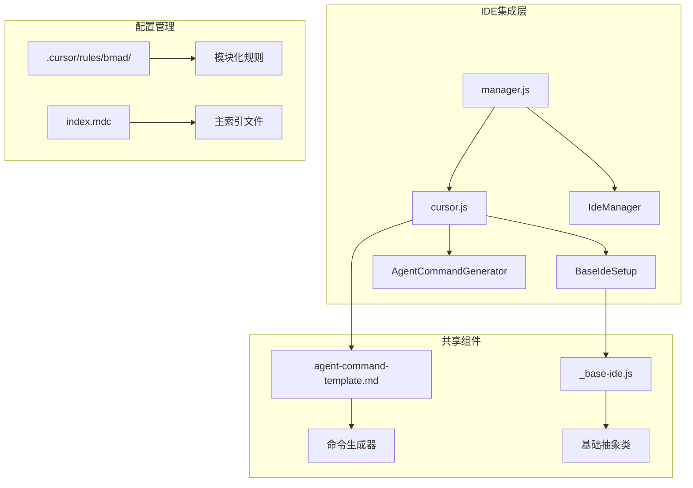
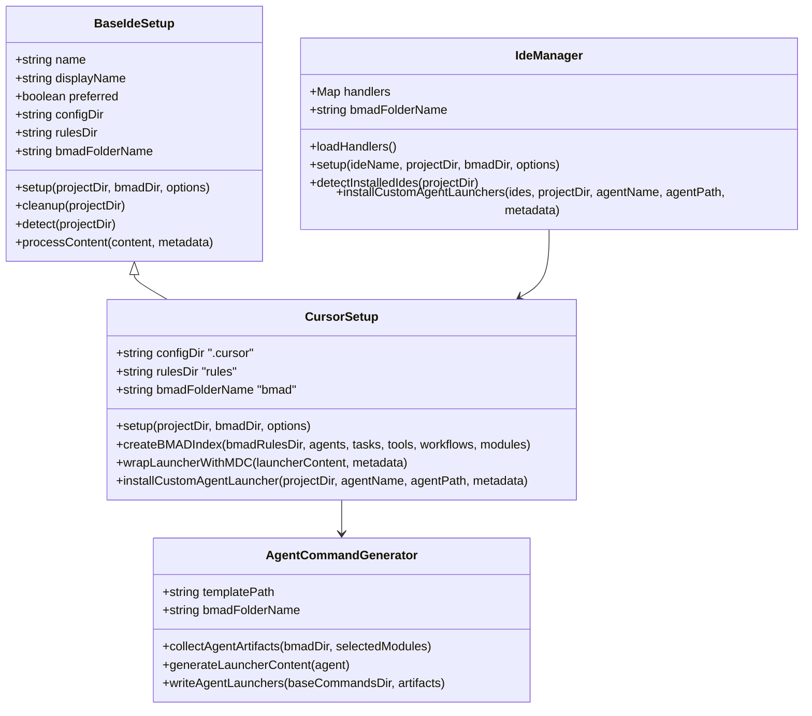
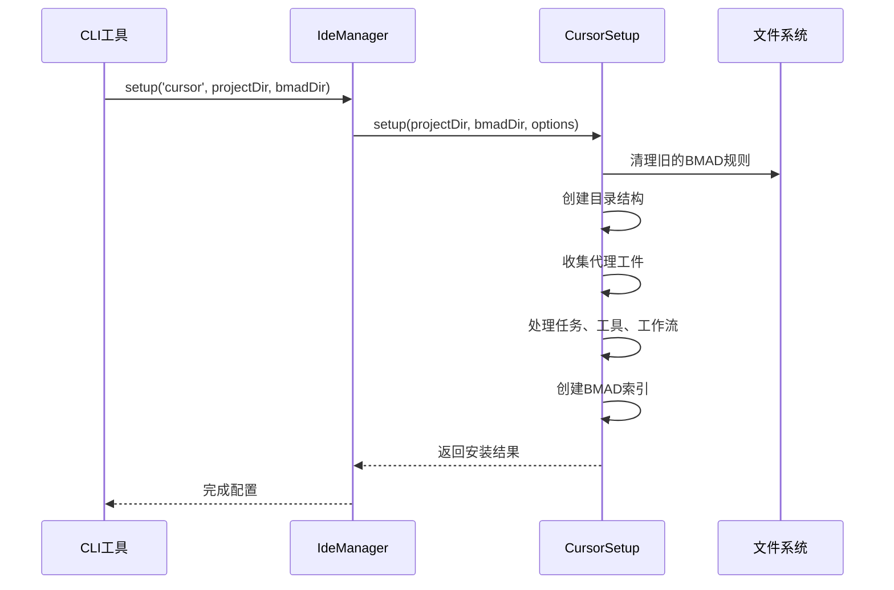
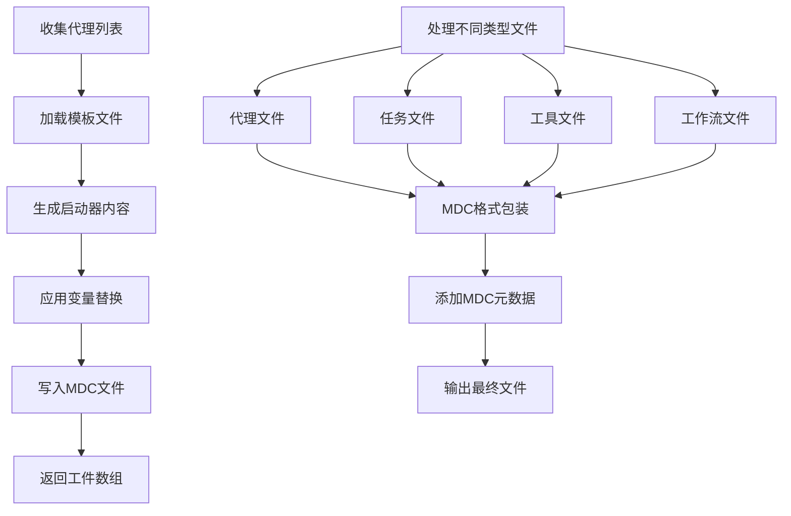
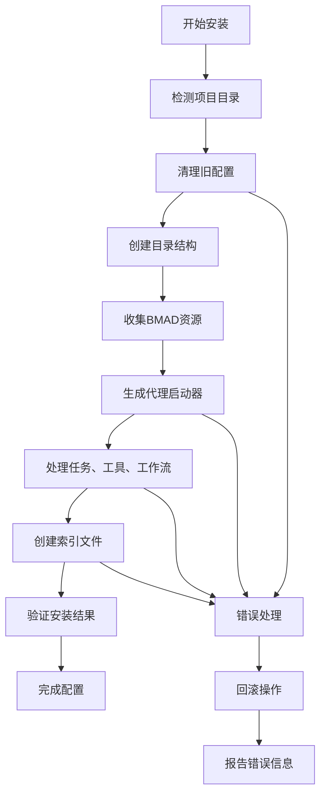
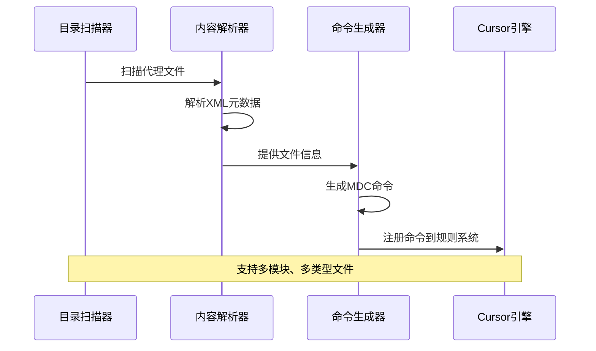
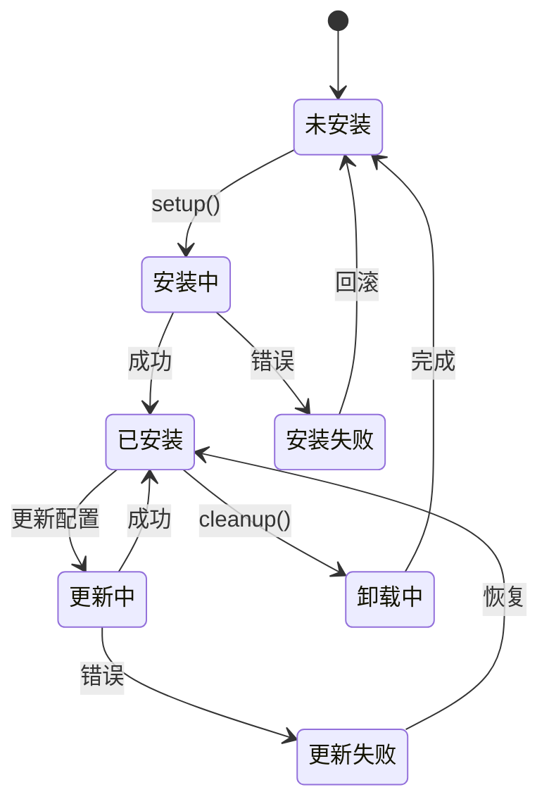
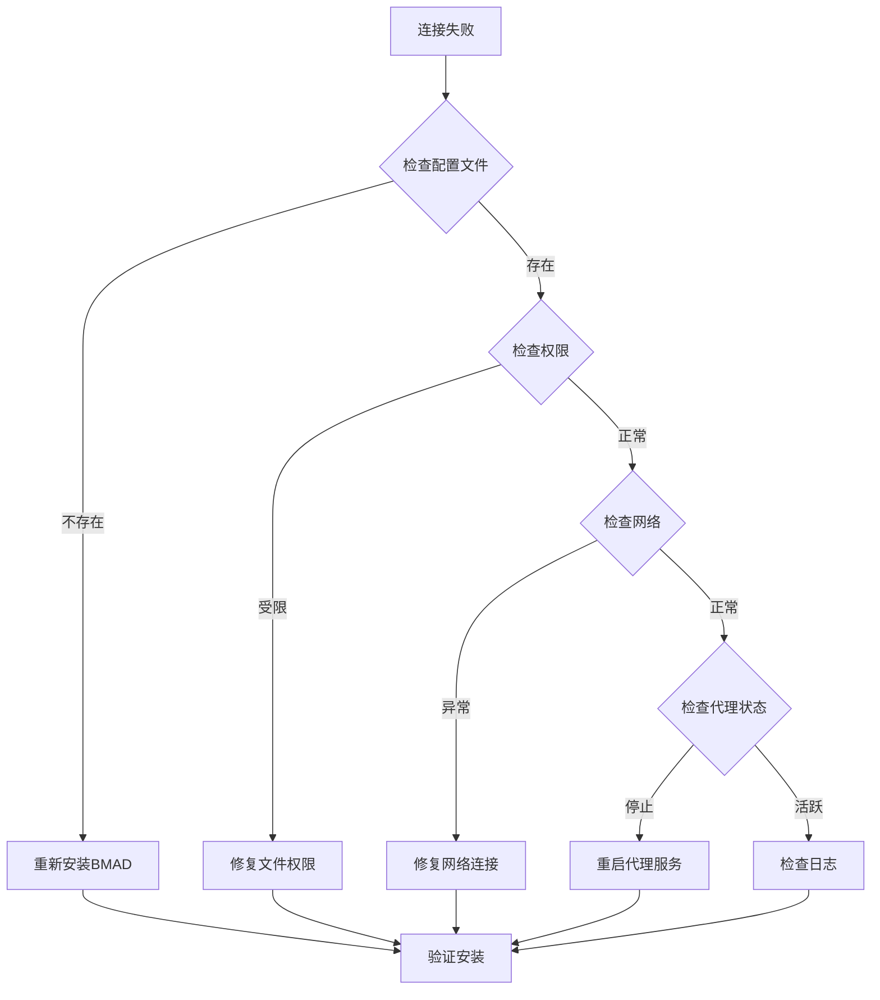
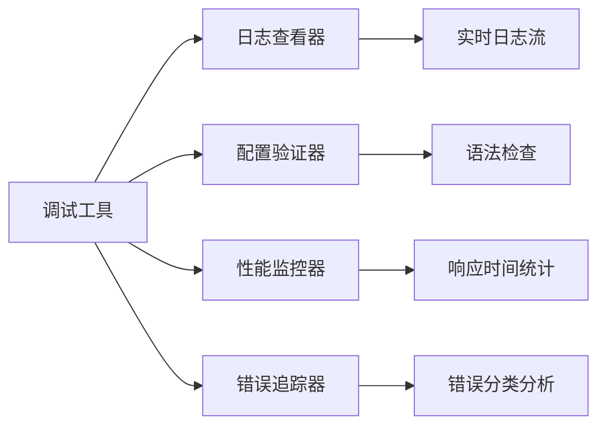

# Cursor 集成指南

<cite>
**本文档中引用的文件**
- [cursor.js](file://tools/cli/installers/lib/ide/cursor.js)
- [cursor.md](file://docs/ide-info/cursor.md)
- [_base-ide.js](file://tools/cli/installers/lib/ide/_base-ide.js)
- [manager.js](file://tools/cli/installers/lib/ide/manager.js)
- [agent-command-generator.js](file://tools/cli/installers/lib/ide/shared/agent-command-generator.js)
- [dev.agent.yaml](file://src/modules/bmm/agents/dev.agent.yaml)
- [installers.md](file://custom/src/agents/toolsmith/toolsmith-sidecar/knowledge/installers.md)
</cite>

## 目录
1. [简介](#简介)
2. [项目结构概览](#项目结构概览)
3. [Cursor集成架构](#cursor集成架构)
4. [核心组件分析](#核心组件分析)
5. [安装和配置流程](#安装和配置流程)
6. [命令注册机制](#命令注册机制)
7. [状态管理](#状态管理)
8. [使用场景示例](#使用场景示例)
9. [故障排除](#故障排除)
10. [与其他IDE集成的比较](#与其他ide集成的比较)
11. [最佳实践](#最佳实践)
12. [总结](#总结)

## 简介

BMAD-METHOD为Cursor IDE提供了完整的集成支持，通过专门的cursor.js处理器实现与Cursor的深度集成。该集成利用Cursor的MDC（Markdown Command）格式，实现了智能的规则管理和自动化的代理部署。

Cursor集成的核心优势在于其基于规则的智能激活系统，所有BMAD规则均为Manual类型，确保用户对上下文污染的完全控制。这种设计使得BMAD能够在保持高性能的同时，提供灵活且可预测的功能体验。

## 项目结构概览

BMAD-METHOD的Cursor集成遵循模块化架构设计，主要组件分布在以下目录结构中：



**图表来源**
- [cursor.js](file://tools/cli/installers/lib/ide/cursor.js#L1-L50)
- [manager.js](file://tools/cli/installers/lib/ide/manager.js#L1-L50)

**章节来源**
- [cursor.js](file://tools/cli/installers/lib/ide/cursor.js#L1-L401)
- [manager.js](file://tools/cli/installers/lib/ide/manager.js#L1-L245)

## Cursor集成架构

### 整体架构设计

Cursor集成采用分层架构模式，确保了高度的可扩展性和维护性：



**图表来源**
- [_base-ide.js](file://tools/cli/installers/lib/ide/_base-ide.js#L11-L30)
- [cursor.js](file://tools/cli/installers/lib/ide/cursor.js#L9-L20)
- [manager.js](file://tools/cli/installers/lib/ide/manager.js#L9-L28)

### 核心特性

Cursor集成具备以下关键特性：

1. **MDC格式兼容性**：完全支持Cursor的Markdown Command格式
2. **模块化组织**：按模块、代理、任务、工具和工作流分类管理
3. **智能激活**：所有规则均为Manual类型，避免自动上下文污染
4. **动态生成**：运行时生成命令文件，支持增量更新
5. **错误处理**：完善的错误检测和恢复机制

**章节来源**
- [cursor.js](file://tools/cli/installers/lib/ide/cursor.js#L10-L20)
- [_base-ide.js](file://tools/cli/installers/lib/ide/_base-ide.js#L11-L30)

## 核心组件分析

### CursorSetup类实现

CursorSetup类是Cursor集成的核心实现，继承自BaseIdeSetup基类：



**图表来源**
- [cursor.js](file://tools/cli/installers/lib/ide/cursor.js#L36-L147)
- [manager.js](file://tools/cli/installers/lib/ide/manager.js#L137-L152)

#### 关键方法解析

**清理功能**：
- 删除旧的BMAD规则目录
- 避免版本冲突和配置混乱
- 确保干净的安装环境

**目录结构创建**：
- `.cursor/rules/bmad/`作为根目录
- 按模块、类型（agents/tasks/tools/workflows）组织
- 支持嵌套子目录结构

**内容处理**：
- 应用MDC元数据头部
- 处理不同类型的文件（代理、任务、工具、工作流）
- 维护文件完整性

**章节来源**
- [cursor.js](file://tools/cli/installers/lib/ide/cursor.js#L20-L147)

### 命令生成器

AgentCommandGenerator负责为每个代理生成启动器文件：



**图表来源**
- [agent-command-generator.js](file://tools/cli/installers/lib/ide/shared/agent-command-generator.js#L15-L47)

**章节来源**
- [agent-command-generator.js](file://tools/cli/installers/lib/ide/shared/agent-command-generator.js#L1-L91)

### MDC元数据处理

Cursor集成使用专门的MDC（Markdown Command）格式来定义规则属性：

| 属性 | 类型 | 描述 | 示例值 |
|------|------|------|--------|
| description | string | 规则描述信息 | "BMAD bmm Agent: Amelia" |
| globs | string | 文件匹配模式 | ""（空字符串） |
| alwaysApply | boolean | 是否自动应用 | false |

这种设计确保了Cursor能够正确识别和处理BMAD规则，同时保持与原生Cursor功能的兼容性。

**章节来源**
- [cursor.js](file://tools/cli/installers/lib/ide/cursor.js#L310-L349)

## 安装和配置流程

### 安装步骤

Cursor集成的安装过程包含以下关键步骤：



**图表来源**
- [cursor.js](file://tools/cli/installers/lib/ide/cursor.js#L36-L147)

### 配置选项

安装过程中支持多种配置选项：

| 选项 | 类型 | 默认值 | 描述 |
|------|------|--------|------|
| selectedModules | Array | [] | 选择要安装的模块列表 |
| bmadFolderName | string | "bmad" | BMAD文件夹名称 |
| projectRoot | string | 当前目录 | 项目根目录路径 |

### 目录结构

安装完成后，Cursor配置目录结构如下：

```
.project-root/
├── .cursor/
│   ├── rules/
│   │   └── bmad/
│   │       ├── index.mdc          # 主索引文件
│   │       ├── core/
│   │       │   ├── agents/
│   │       │   ├── tasks/
│   │       │   ├── tools/
│   │       │   └── workflows/
│   │       ├── bmm/
│   │       │   ├── agents/
│   │       │   ├── tasks/
│   │       │   ├── tools/
│   │       │   └── workflows/
│   │       └── custom/
│   │           └── agents/
```

**章节来源**
- [cursor.js](file://tools/cli/installers/lib/ide/cursor.js#L42-L71)

## 命令注册机制

### 自动命令发现

Cursor集成通过扫描BMAD安装目录自动发现可用的命令：



**图表来源**
- [_base-ide.js](file://tools/cli/installers/lib/ide/_base-ide.js#L124-L191)

### 命令格式规范

BMAD命令遵循统一的命名和格式规范：

| 命令类型 | 格式 | 示例 | 描述 |
|----------|------|------|------|
| 代理命令 | `@bmad/{module}/agents/{agent-name}` | `@bmad/core/agents/dev` | 启动特定代理 |
| 任务命令 | `@bmad/{module}/tasks/{task-name}` | `@bmad/bmm/tasks/build` | 执行特定任务 |
| 工具命令 | `@bmad/{module}/tools/{tool-name}` | `@bmad/core/tools/git` | 调用特定工具 |
| 工作流命令 | `@bmad/{module}/workflows/{workflow-name}` | `@bmad/bmm/workflows/sprint` | 启动完整工作流 |
| 模块命令 | `@bmad/{module}` | `@bmad/bmm` | 包含整个模块 |
| 索引命令 | `@bmad/index` | `@bmad/index` | 访问主索引 |

### 自定义代理支持

Cursor集成还支持自定义代理的安装：

```mermaid
flowchart LR
A[自定义代理] --> B[编译代理文件]
B --> C[生成启动器]
C --> D[应用MDC格式]
D --> E[安装到.bcursor/rules/bmad/custom/agents/]
E --> F[可用的@agent-name命令]
```

**图表来源**
- [cursor.js](file://tools/cli/installers/lib/ide/cursor.js#L352-L397)

**章节来源**
- [cursor.js](file://tools/cli/installers/lib/ide/cursor.js#L352-L397)
- [cursor.md](file://docs/ide-info/cursor.md#L1-L26)

## 状态管理

### 规则生命周期

Cursor集成的状态管理涵盖了规则的完整生命周期：



### 上下文管理

Cursor集成采用Manual类型的规则，确保精确的上下文控制：

- **手动触发**：只有明确引用时才激活规则
- **无自动污染**：避免不必要的上下文加载
- **按需加载**：根据具体需求动态加载相关规则

### 版本控制

集成支持版本跟踪和变更检测：

| 功能 | 实现方式 | 用途 |
|------|----------|------|
| 文件哈希 | MD5校验和 | 检测文件变更 |
| 时间戳记录 | ISO格式时间 | 跟踪最后修改时间 |
| 模块依赖 | 显式声明 | 管理模块间关系 |
| 兼容性检查 | 版本比较 | 确保功能兼容性 |

**章节来源**
- [cursor.js](file://tools/cli/installers/lib/ide/cursor.js#L149-L160)

## 使用场景示例

### 日常开发工作流

以下是典型的Cursor集成使用场景：

#### 场景1：代码审查代理
```markdown
# 在Chat中输入
@bmad/bmm/agents/dev

# 代理激活后
You must fully embody this agent's persona and follow all activation instructions exactly as specified. NEVER break character until given an exit command.

<agent-activation CRITICAL="TRUE">
1. LOAD the FULL agent file from @bmad/bmm/agents/dev
2. READ its entire contents - this contains the complete agent persona, menu, and instructions
3. FOLLOW every step in the <activation> section precisely
4. DISPLAY the welcome/greeting as instructed
5. PRESENT the numbered menu
6. WAIT for user input before proceeding
</agent-activation>
```

#### 场景2：项目初始化
```bash
# 安装BMAD到项目
bmad install --ide cursor

# 使用预设的开发代理
@bmad/bmm/agents/dev - Activate developer agent
@bmad/bmm - Include all BMM agents/tasks
@bmad/index - Access main index
```

#### 场景3：自定义代理集成
```bash
# 安装自定义代理
bmad install --agent my-custom-agent

# 在Cursor中使用
@my-custom-agent - 启动自定义代理
```

### 高级使用模式

#### 组合多个代理
```markdown
# 同时激活多个代理
@bmad/core/agents/dev @bmad/bmm/agents/architect @bmad/core/agents/test
```

#### 模块级访问
```markdown
# 访问整个模块
@bmad/bmm - 包含BMM模块的所有功能
@bmad/core - 包含核心模块的所有功能
```

**章节来源**
- [dev.agent.yaml](file://src/modules/bmm/agents/dev.agent.yaml#L1-L45)
- [cursor.md](file://docs/ide-info/cursor.md#L15-L25)

## 故障排除

### 常见问题及解决方案

#### 连接失败问题

**问题症状**：
- 代理无法启动
- 命令无响应
- 规则不生效

**诊断步骤**：


**解决方案**：
1. **配置文件检查**：确认`.cursor/rules/bmad/`目录存在且可访问
2. **权限修复**：确保当前用户对配置目录有读写权限
3. **网络验证**：检查代理所需的外部服务连接
4. **代理状态**：验证代理进程是否正常运行

#### 命令响应延迟

**性能优化策略**：

| 优化项 | 方法 | 效果 |
|--------|------|------|
| 缓存机制 | 预加载常用代理 | 减少启动时间 |
| 并行处理 | 异步加载规则 | 提高响应速度 |
| 智能缓存 | 基于使用频率缓存 | 减少重复加载 |
| 压缩传输 | 压缩规则文件 | 减少网络开销 |

#### 文件格式问题

**常见格式错误**：
- XML语法错误
- YAML格式不正确
- MDC元数据缺失

**修复方法**：
```bash
# 验证代理文件
bmad validate --agent my-agent

# 重新生成规则文件
bmad install --force --ide cursor
```

### 调试工具

Cursor集成提供了多种调试工具：



**章节来源**
- [cursor.js](file://tools/cli/installers/lib/ide/cursor.js#L20-L28)

## 与其他IDE集成的比较

### 集成差异对比

| 特性 | Cursor | VSCode | IntelliJ IDEA | WebStorm |
|------|--------|--------|---------------|----------|
| 配置格式 | MDC Markdown | JSON/YAML | XML | JavaScript |
| 规则类型 | Manual | Auto/Manual | Auto | Auto |
| 激活方式 | 显式引用 | 快捷键/菜单 | 快捷键/插件 | 快捷键/工具窗口 |
| 性能影响 | 最小 | 中等 | 较大 | 中等 |
| 学习曲线 | 低 | 中等 | 高 | 中等 |
| 社区生态 | 新兴 | 成熟 | 成熟 | 成熟 |

### Cursor集成的优势

#### 1. 精确的上下文控制
- **Manual规则类型**：避免自动上下文污染
- **显式激活**：用户完全控制何时加载规则
- **细粒度控制**：支持按需加载特定功能

#### 2. 简洁的配置管理
- **单一配置文件**：集中管理所有BMAD规则
- **模块化组织**：清晰的目录结构便于维护
- **自动更新**：支持增量更新和版本管理

#### 3. 强大的代理系统
- **Persona驱动**：基于角色的智能交互
- **多模态支持**：文本、代码、图像等多种输入
- **上下文感知**：理解项目语境和开发阶段

#### 4. 开发者体验优化
- **即时反馈**：快速的命令响应
- **智能提示**：基于上下文的建议
- **错误恢复**：优雅的错误处理和恢复机制

### 适用场景分析

#### Cursor特别适合的场景：
- **轻量级开发**：需要最小化上下文干扰的场景
- **多语言项目**：需要跨语言协作的复杂项目
- **敏捷开发**：频繁切换任务和角色的团队
- **远程协作**：需要标准化开发流程的分布式团队

#### 其他IDE的优势：
- **VSCode**：丰富的插件生态和强大的编辑器功能
- **IntelliJ IDEA**：优秀的Java生态系统和企业级功能
- **WebStorm**：专业的前端开发工具链

**章节来源**
- [installers.md](file://custom/src/agents/toolsmith/toolsmith-sidecar/knowledge/installers.md#L69-L114)

## 最佳实践

### 配置最佳实践

#### 1. 模块化安装策略
```bash
# 推荐：按需安装特定模块
bmad install --ide cursor --modules bmm,core

# 不推荐：安装所有模块（除非确实需要）
bmad install --ide cursor --all-modules
```

#### 2. 自定义代理管理
```bash
# 创建自定义代理时的最佳实践
# 1. 使用有意义的名称
@my-company/custom-agent

# 2. 提供详细的描述信息
description: "My Company Custom Agent - Specialized for internal workflows"

# 3. 遵循命名约定
@company/team-name/agent-name
```

#### 3. 规则组织原则
- **按功能分组**：将相关规则组织在同一模块内
- **避免命名冲突**：使用唯一的代理名称
- **文档化重要规则**：为复杂规则提供使用说明

### 性能优化建议

#### 1. 启动优化
- **延迟加载**：只在需要时加载代理
- **缓存策略**：合理使用本地缓存
- **预热机制**：在空闲时预加载常用代理

#### 2. 内存管理
- **定期清理**：清理不再使用的代理实例
- **资源监控**：监控内存使用情况
- **垃圾回收**：及时释放不需要的对象

#### 3. 网络优化
- **连接池**：重用网络连接
- **超时设置**：合理设置请求超时
- **重试机制**：实现指数退避重试

### 安全考虑

#### 1. 权限控制
- **最小权限原则**：只授予必要的权限
- **沙箱隔离**：在安全环境中运行代理
- **审计日志**：记录所有代理活动

#### 2. 数据保护
- **敏感信息过滤**：避免泄露敏感数据
- **加密传输**：使用HTTPS等安全协议
- **本地存储**：最小化云端数据存储

#### 3. 输入验证
- **参数校验**：严格验证用户输入
- **内容过滤**：防止恶意内容注入
- **边界检查**：防止缓冲区溢出等攻击

## 总结

BMAD-METHOD的Cursor集成提供了一个强大而灵活的AI辅助开发平台。通过专门的cursor.js处理器，实现了与Cursor IDE的深度集成，充分利用了Cursor的MDC格式和规则系统。

### 核心价值

1. **精确控制**：Manual规则类型确保用户对上下文的完全控制
2. **模块化设计**：支持灵活的模块化安装和管理
3. **智能代理**：基于Persona的智能代理系统
4. **易于使用**：简洁的命令语法和直观的操作界面

### 技术优势

- **高性能**：最小化的上下文影响和快速的响应时间
- **可扩展性**：支持自定义代理和模块的无缝集成
- **稳定性**：完善的错误处理和恢复机制
- **兼容性**：良好的向后兼容性和版本管理

### 发展前景

随着AI辅助开发技术的不断发展，BMAD-METHOD的Cursor集成将继续演进，为开发者提供更智能、更高效的开发体验。未来的改进方向包括：

- **增强学习**：基于用户行为的智能推荐
- **多模态交互**：支持更多类型的输入和输出
- **云原生支持**：更好的云端开发环境集成
- **社区生态**：丰富的第三方插件和扩展

通过持续的技术创新和社区贡献，BMAD-METHOD的Cursor集成将成为AI辅助开发领域的重要基础设施，为全球开发者提供卓越的开发体验。