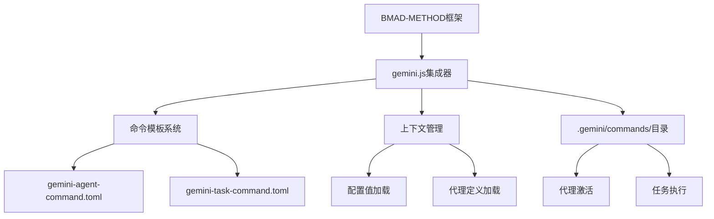
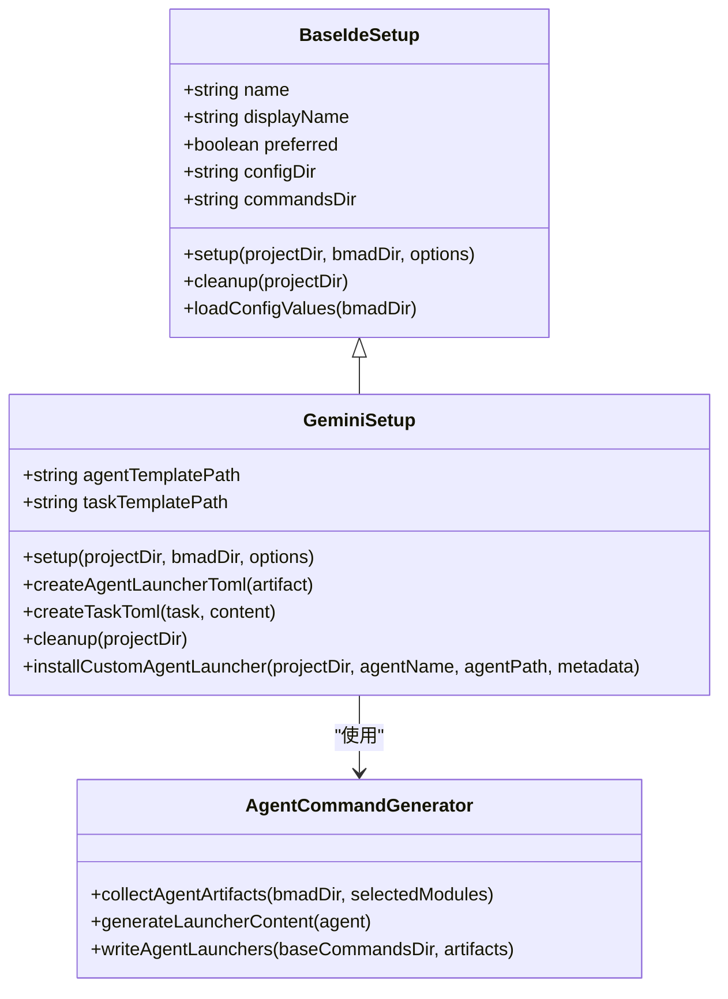
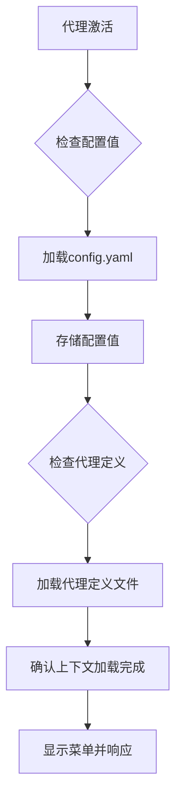

# Gemini 集成指南

<cite>
**本文档中引用的文件**  
- [gemini.js](file://tools/cli/installers/lib/ide/gemini.js#L1-L254)
- [gemini-agent-command.toml](file://tools/cli/installers/lib/ide/templates/gemini-agent-command.toml#L1-L15)
- [gemini-task-command.toml](file://tools/cli/installers/lib/ide/templates/gemini-task-command.toml#L1-L13)
- [gemini.md](file://docs/ide-info/gemini.md#L1-L26)
- [web-bundles-gemini-gpt-guide.md](file://docs/web-bundles-gemini-gpt-guide.md#L1-L474)
</cite>

## 目录
1. [简介](#简介)
2. [Gemini集成架构](#gemini集成架构)
3. [gemini.js集成器实现](#geminijs集成器实现)
4. [命令模板详解](#命令模板详解)
5. [上下文管理机制](#上下文管理机制)
6. [配置步骤](#配置步骤)
7. [使用示例](#使用示例)
8. [认证与权限问题](#认证与权限问题)
9. [性能优化](#性能优化)
10. [故障排除](#故障排除)

## 简介

BMAD-METHOD框架提供了与Gemini IDE的深度集成能力，使开发者能够充分利用Gemini的AI功能来增强开发工作流。本指南详细说明了如何将BMAD-METHOD与Gemini集成，包括核心集成器的实现细节、命令模板的使用方式以及上下文管理机制。通过这种集成，开发者可以激活各种专业代理（如开发代理、架构代理等），执行复杂的开发任务，并利用AI能力提高开发效率。

Gemini集成支持两种主要模式：本地IDE集成和Web Bundles集成。本地集成通过`.gemini/commands/`目录中的TOML文件提供代理和任务的激活功能，而Web Bundles则允许将完整的代理功能打包为XML文件，在Gemini Gems或自定义GPT中使用。

**Section sources**
- [gemini.md](file://docs/ide-info/gemini.md#L1-L26)
- [web-bundles-gemini-gpt-guide.md](file://docs/web-bundles-gemini-gpt-guide.md#L1-L474)

## Gemini集成架构

Gemini集成架构基于模块化的设计，通过专门的集成器处理与Gemini的交互。核心组件包括gemini.js集成器、命令模板系统和上下文管理机制。



**Diagram sources**
- [gemini.js](file://tools/cli/installers/lib/ide/gemini.js#L1-L254)
- [gemini-agent-command.toml](file://tools/cli/installers/lib/ide/templates/gemini-agent-command.toml#L1-L15)
- [gemini-task-command.toml](file://tools/cli/installers/lib/ide/templates/gemini-task-command.toml#L1-L13)

**Section sources**
- [gemini.js](file://tools/cli/installers/lib/ide/gemini.js#L1-L254)

## gemini.js集成器实现

gemini.js集成器是BMAD-METHOD与Gemini IDE之间的桥梁，负责配置Gemini环境并生成必要的命令文件。该集成器继承自BaseIdeSetup类，实现了Gemini特定的设置逻辑。

集成器的主要功能包括：
- 创建`.gemini/commands/`目录结构
- 生成代理和任务的TOML命令文件
- 处理配置值的加载和替换
- 提供清理功能以移除现有的BMAD文件



**Diagram sources**
- [gemini.js](file://tools/cli/installers/lib/ide/gemini.js#L1-L254)
- [_base-ide.js](file://tools/cli/installers/lib/ide/_base-ide.js#L1-L652)
- [agent-command-generator.js](file://tools/cli/installers/lib/ide/shared/agent-command-generator.js#L1-L91)

**Section sources**
- [gemini.js](file://tools/cli/installers/lib/ide/gemini.js#L1-L254)

## 命令模板详解

Gemini集成使用TOML格式的命令模板来定义代理和任务的激活方式。这些模板位于`tools/cli/installers/lib/ide/templates/`目录下，通过变量替换机制生成最终的命令文件。

### 代理命令模板

`gemini-agent-command.toml`模板定义了代理激活的预检清单和执行流程：

```toml
description = "Activates the {{title}} agent from the BMad Method."
prompt = """
CRITICAL: You are now the BMad '{{title}}' agent.

PRE-FLIGHT CHECKLIST:
1.  [ ] IMMEDIATE ACTION: Load and parse @{{bmad_folder}}/{{module}}/config.yaml - store ALL config values in memory for use throughout the session.
2.  [ ] IMMEDIATE ACTION: Read and internalize the full agent definition at @{{bmad_folder}}/{{module}}/agents/{{name}}.md.
3.  [ ] CONFIRM: The user's name from config is {user_name}.

Only after all checks are complete, greet the user by name and display the menu.
Acknowledge this checklist is complete in your first response.

AGENT DEFINITION: @{{bmad_folder}}/{{module}}/agents/{{name}}.md
"""
```

模板中的变量包括：
- `{{title}}`: 代理的标题
- `{{bmad_folder}}`: BMAD文件夹名称
- `{{module}}`: 模块名称
- `{{name}}`: 代理名称
- `{user_name}`: 从配置中获取的用户名

### 任务命令模板

`gemini-task-command.toml`模板定义了任务执行的流程：

```toml
description = "Executes the {{taskName}} task from the BMad Method."
prompt = """
Execute the following BMad Method task workflow:

PRE-FLIGHT CHECKLIST:
1.  [ ] IMMEDIATE ACTION: Load and parse @{{bmad_folder}}/{{module}}/config.yaml.
2.  [ ] IMMEDIATE ACTION: Read and load the task definition at @{{bmad_folder}}/{{module}}/tasks/{{filename}}.

Follow all instructions and complete the task as defined.

TASK DEFINITION: @{{bmad_folder}}/{{module}}/tasks/{{filename}}
"""
```

**Diagram sources**
- [gemini-agent-command.toml](file://tools/cli/installers/lib/ide/templates/gemini-agent-command.toml#L1-L15)
- [gemini-task-command.toml](file://tools/cli/installers/lib/ide/templates/gemini-task-command.toml#L1-L13)

**Section sources**
- [gemini-agent-command.toml](file://tools/cli/installers/lib/ide/templates/gemini-agent-command.toml#L1-L15)
- [gemini-task-command.toml](file://tools/cli/installers/lib/ide/templates/gemini-task-command.toml#L1-L13)

## 上下文管理机制

Gemini集成的上下文管理机制确保代理在激活时能够正确加载所需的配置和定义文件。该机制通过预检清单（PRE-FLIGHT CHECKLIST）实现，强制代理在响应前完成必要的上下文加载。

### 上下文加载流程



上下文管理的关键特性包括：
- **配置值加载**: 从`config.yaml`文件中加载用户配置，如用户名、通信语言等
- **代理定义加载**: 加载完整的代理定义文件，确保代理了解其角色和职责
- **状态确认**: 代理必须确认预检清单完成才能开始交互
- **变量替换**: 在运行时替换模板中的变量，如`{user_name}`

**Diagram sources**
- [gemini-agent-command.toml](file://tools/cli/installers/lib/ide/templates/gemini-agent-command.toml#L1-L15)
- [gemini.js](file://tools/cli/installers/lib/ide/gemini.js#L26-L47)

**Section sources**
- [gemini-agent-command.toml](file://tools/cli/installers/lib/ide/templates/gemini-agent-command.toml#L1-L15)
- [gemini.js](file://tools/cli/installers/lib/ide/gemini.js#L26-L47)

## 配置步骤

配置BMAD-METHOD与Gemini的集成需要以下步骤：

### 1. 安装BMAD-METHOD

```bash
npx bmad-method@alpha install
```

### 2. 设置Gemini集成

运行BMAD CLI工具选择Gemini作为目标IDE：

```bash
npx bmad-method setup
# 选择Gemini作为IDE
```

### 3. 验证配置

检查项目根目录下是否创建了`.gemini/commands/`目录，并包含以下文件：
- `bmad-agent-*.toml`: 代理命令文件
- `bmad-task-*.toml`: 任务命令文件

### 4. 激活代理

在Gemini中使用以下语法激活代理：
```
*{agent-name}
```

例如：
```
*dev
*architect
*pm
```

**Section sources**
- [gemini.js](file://tools/cli/installers/lib/ide/gemini.js#L55-L113)
- [gemini.md](file://docs/ide-info/gemini.md#L9-L19)

## 使用示例

### Web Bundles使用示例

Web Bundles允许将BMAD代理打包为XML文件，在Gemini Gems或自定义GPT中使用。

#### 1. 获取Web Bundle文件

**选项A：下载预打包文件**
访问[BMAD Web Bundles下载页面](https://bmad-code-org.github.io/bmad-bundles/)下载所需的XML文件。

**选项B：从本地安装生成**
```bash
# 生成所有代理包
npm run bundle

# 或生成特定包
node tools/cli/bundlers/bundle-web.js module bmm
node tools/cli/bundlers/bundle-web.js agent bmm dev
```

#### 2. 上传到Gemini Gems

1. 访问[Google AI Studio](https://aistudio.google.com/)
2. 创建新的Gem
3. 在系统指令中添加配置值：
```
CONFIG.YAML Values:
- user_name: [Your Name]
- communication_language: English
- user_skill_level: [Beginner|Intermediate|Expert]
- document_output_language: English
- bmm-workflow-status: standalone (no workflow)
```
4. 上传XML文件
5. 启用代码执行功能

#### 3. 使用代理

在Gem中输入以下命令：
```
*help
*prd
*architecture
```

**Section sources**
- [web-bundles-gemini-gpt-guide.md](file://docs/web-bundles-gemini-gpt-guide.md#L33-L137)

## 认证与权限问题

Gemini集成可能遇到的认证和权限问题包括：

### 1. Google账户要求
Gemini Gems需要Google账户才能使用。确保已登录有效的Google账户。

### 2. API配额限制
免费层级的Gemini可能有API调用限制。对于频繁使用，考虑升级到付费计划。

### 3. 文件访问权限
确保Gemini能够访问项目中的必要文件。对于私有仓库，可能需要配置适当的访问权限。

### 4. 配置值验证
确保`config.yaml`文件中的配置值正确无误，特别是`user_name`等关键字段。

**Section sources**
- [web-bundles-gemini-gpt-guide.md](file://docs/web-bundles-gemini-gpt-guide.md#L295-L298)
- [gemini.js](file://tools/cli/installers/lib/ide/gemini.js#L26-L47)

## 性能优化

为了优化Gemini集成的性能，建议采取以下措施：

### 1. 使用Gemini 2.5 Pro+
对于复杂的多代理协作，使用Gemini 2.5 Pro或更高版本以获得更好的性能。

### 2. 启用代码执行
在Gemini设置中启用代码执行功能，这对于文档生成工作流至关重要。

### 3. 分阶段工作流
采用"Web规划→本地实现"的策略：
- 在Web上完成分析、规划和架构阶段
- 在本地IDE中进行实现阶段

### 4. 单代理Gem
为每个代理创建单独的Gem，而不是尝试在单个Gem中组合多个代理。

**Section sources**
- [web-bundles-gemini-gpt-guide.md](file://docs/web-bundles-gemini-gpt-guide.md#L284-L307)
- [gemini.js](file://tools/cli/installers/lib/ide/gemini.js#L58-L62)

## 故障排除

### 常见问题及解决方案

#### 代理未正确响应
- **检查**: 确保整个XML文件已上传
- **验证**: 检查是否有截断（Gemini/GPT有字符限制）
- **测试**: 先尝试简单的代理（如analyst, pm）

#### 菜单项无法工作
- **使用**: `*`前缀作为快捷方式，如`*prd`而不是`prd`
- **尝试**: 使用自然语言："运行PRD工作流"
- **检查**: 使用`*help`查看代理菜单

#### 工作流失败
- **注意**: 某些工作流期望项目文件（在Web上下文中不可用）
- **建议**: 在Web包中使用专为规划/分析设计的工作流
- **实现**: 对于实现工作流，使用本地IDE安装

#### 文件太大无法上传到GPT
- **拆分**: 分成多个部分并使用多个GPT
- **替代**: 使用Gemini Gems（更适合大文件）
- **简化**: 生成单代理包而不是团队包

**Section sources**
- [web-bundles-gemini-gpt-guide.md](file://docs/web-bundles-gemini-gpt-guide.md#L354-L378)