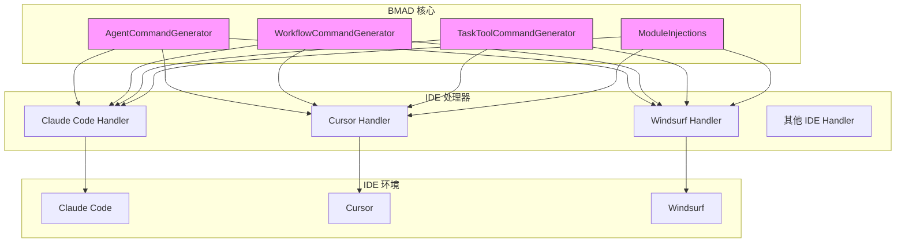
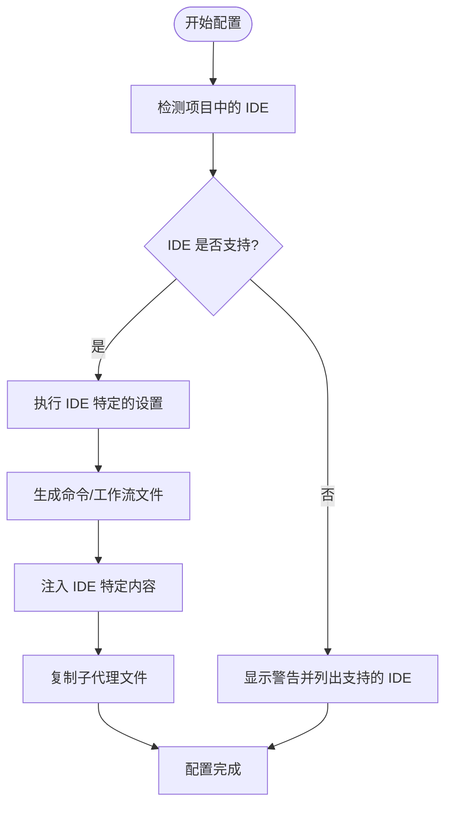
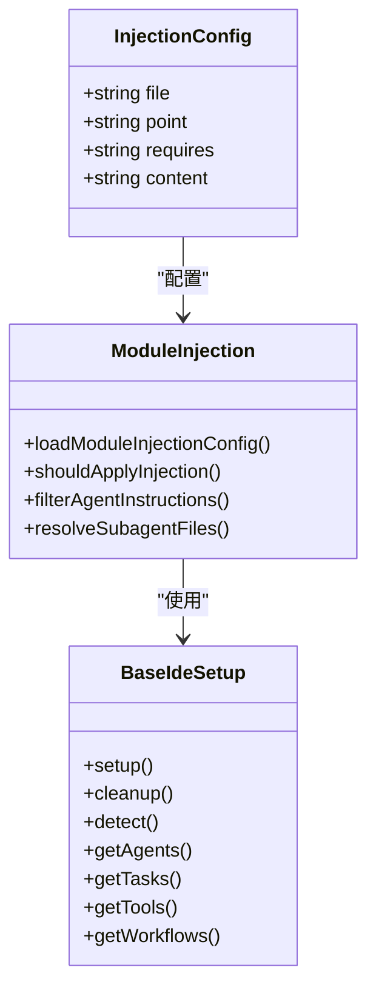
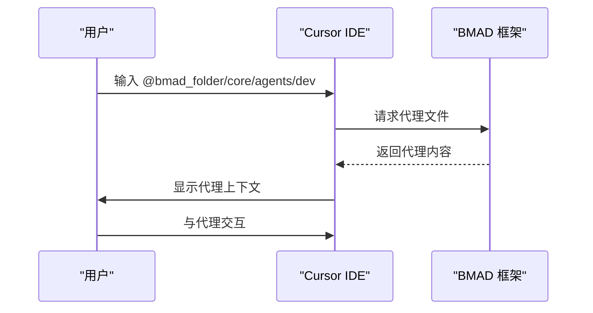
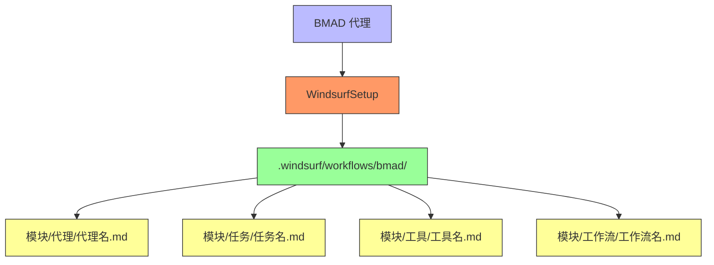
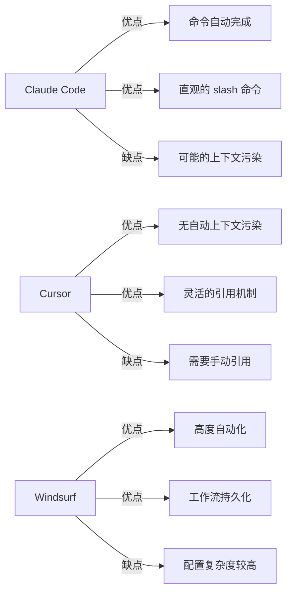

# IDE 集成指南

<cite>
**本文档中引用的文件**  
- [claude-code.md](file://docs/ide-info/claude-code.md)
- [cursor.md](file://docs/ide-info/cursor.md)
- [windsurf.md](file://docs/ide-info/windsurf.md)
- [ide-injections.md](file://docs/installers-bundlers/ide-injections.md)
- [claude-code.js](file://tools/cli/installers/lib/ide/claude-code.js)
- [windsurf.js](file://tools/cli/installers/lib/ide/windsurf.js)
- [agent-command-generator.js](file://tools/cli/installers/lib/ide/shared/agent-command-generator.js)
- [module-injections.js](file://tools/cli/installers/lib/ide/shared/module-injections.js)
- [agent-command-template.md](file://tools/cli/installers/lib/ide/templates/agent-command-template.md)
- [workflow-command-template.md](file://tools/cli/installers/lib/ide/templates/workflow-command-template.md)
- [BaseIdeSetup.js](file://tools/cli/installers/lib/ide/_base-ide.js)
- [platform-specifics/claude-code.js](file://src/modules/bmm/_module-installer/platform-specifics/claude-code.js)
- [platform-specifics/windsurf.js](file://src/modules/bmm/_module-installer/platform-specifics/windsurf.js)
</cite>

## 目录
1. [简介](#简介)
2. [核心集成架构](#核心集成架构)
3. [IDE 集成配置](#ide-集成配置)
4. [Claude Code 集成](#claude-code-集成)
5. [Cursor 集成](#cursor-集成)
6. [Windsurf 集成](#windsurf-集成)
7. [IDE 间功能对比](#ide-间功能对比)
8. [故障排除指南](#故障排除指南)
9. [结论](#结论)

## 简介

BMAD-METHOD 框架提供了一套统一的 IDE 集成系统，支持多种主流 AI 开发环境，包括 Claude Code、Cursor、Windsurf 等。本指南详细说明了如何在各种 IDE 中设置和使用该框架，涵盖安装步骤、配置要求、使用说明以及故障排除方法。通过标准化的集成架构，BMAD-METHOD 能够在不同 IDE 之间提供一致的用户体验，同时利用各 IDE 的独特功能来增强开发效率。

## 核心集成架构

BMAD-METHOD 的 IDE 集成基于一套模块化的架构设计，通过统一的接口与不同 IDE 进行通信。核心组件包括命令生成器、内容注入系统和平台特定的安装程序。



**图示来源**
- [agent-command-generator.js](file://tools/cli/installers/lib/ide/shared/agent-command-generator.js)
- [module-injections.js](file://tools/cli/installers/lib/ide/shared/module-injections.js)
- [BaseIdeSetup.js](file://tools/cli/installers/lib/ide/_base-ide.js)

**本节来源**
- [BaseIdeSetup.js](file://tools/cli/installers/lib/ide/_base-ide.js)
- [ide-injections.md](file://docs/installers-bundlers/ide-injections.md)

## IDE 集成配置

BMAD-METHOD 的 IDE 集成配置遵循一套标准化的流程，确保在不同开发环境中的一致性。系统通过 `IdeManager` 类动态发现和加载各个 IDE 处理器，实现灵活的扩展性。

### 配置流程



**图示来源**
- [manager.js](file://tools/cli/installers/lib/ide/manager.js)
- [BaseIdeSetup.js](file://tools/cli/installers/lib/ide/_base-ide.js)

**本节来源**
- [manager.js](file://tools/cli/installers/lib/ide/manager.js)

### 内容注入系统

BMAD-METHOD 使用内容注入系统将 IDE 特定的指令注入到核心模板中，而不会污染源文件。这一系统通过 `injections.yaml` 配置文件定义注入规则。



**图示来源**
- [module-injections.js](file://tools/cli/installers/lib/ide/shared/module-injections.js)
- [injections.yaml](file://docs/installers-bundlers/ide-injections.md)

**本节来源**
- [module-injections.js](file://tools/cli/installers/lib/ide/shared/module-injections.js)
- [ide-injections.md](file://docs/installers-bundlers/ide-injections.md)

## Claude Code 集成

Claude Code 是 BMAD-METHOD 的首选集成 IDE 之一，通过 slash 命令系统提供直观的代理激活方式。

### 安装步骤

1. **运行安装命令**：使用 BMAD CLI 工具安装 Claude Code 集成
2. **选择模块**：在交互式提示中选择要安装的模块
3. **配置子代理**：根据需要选择安装特定的子代理
4. **选择安装位置**：决定将子代理安装在项目级别还是用户级别

### 配置要求

- 项目根目录下存在 `.claude` 配置文件夹
- 具备写入 `.claude/commands/` 和 `.claude/agents/` 目录的权限
- BMAD-METHOD 核心框架已正确安装

### 使用说明

在 Claude Code 中，BMAD 代理通过 slash 命令激活：

```markdown
/bmad:{module}:agents:{agent-name} - 激活指定代理
/bmad:{module}:workflows:{workflow-name} - 执行指定工作流
```

例如：
```
/bmad:bmm:agents:dev - 激活开发代理
/bmad:bmm:workflows:dev-story - 执行开发故事工作流
```

### 命令生成机制

Claude Code 的命令生成器创建小型启动文件，这些文件引用主 BMAD 目录中的实际代理文件。


**图示来源**
- [claude-code.js](file://tools/cli/installers/lib/ide/claude-code.js)
- [agent-command-generator.js](file://tools/cli/installers/lib/ide/shared/agent-command-generator.js)

**本节来源**
- [claude-code.md](file://docs/ide-info/claude-code.md)
- [claude-code.js](file://tools/cli/installers/lib/ide/claude-code.js)

## Cursor 集成

Cursor IDE 通过 MDC 规则系统与 BMAD-METHOD 集成，提供灵活的代理引用机制。

### 安装步骤

1. **运行安装命令**：使用 BMAD CLI 工具安装 Cursor 集成
2. **选择模块**：在交互式提示中选择要安装的模块
3. **完成安装**：系统自动在 `.cursor/rules/bmad/` 目录下创建规则文件

### 配置要求

- 项目根目录下存在 `.cursor` 配置文件夹
- 具备写入 `.cursor/rules/` 目录的权限
- Cursor IDE 已正确配置并可识别 MDC 规则

### 使用说明

在 Cursor 中，通过 `@` 符号引用 BMAD 代理：

```markdown
@{bmad_folder}/{module}/agents/{agent-name} - 引用特定代理
@{bmad_folder}/{module} - 引用整个模块
@{bmad_folder}/index - 引用所有可用代理
```

例如：
```
@{bmad_folder}/core/agents/dev - 激活开发代理
@{bmad_folder}/bmm/agents/architect - 激活架构师代理
```

### 集成特点

Cursor 集成采用手动规则类型，只有在明确引用时才会加载相关内容，避免了上下文污染。



**图示来源**
- [cursor.md](file://docs/ide-info/cursor.md)

**本节来源**
- [cursor.md](file://docs/ide-info/cursor.md)

## Windsurf 集成

Windsurf IDE 通过工作流系统与 BMAD-METHOD 集成，提供高度自动化的代理执行环境。

### 安装步骤

1. **运行安装命令**：使用 BMAD CLI 工具安装 Windsurf 集成
2. **选择模块**：在交互式提示中选择要安装的模块
3. **完成安装**：系统自动在 `.windsurf/workflows/` 目录下创建工作流文件

### 配置要求

- 项目根目录下存在 `.windsurf` 配置文件夹
- 具备写入 `.windsurf/workflows/` 目录的权限
- Windsurf IDE 已正确配置并可识别工作流

### 使用说明

在 Windsurf 中，BMAD 代理作为工作流执行：

1. **打开工作流**：通过 Windsurf 菜单或命令面板访问
2. **选择工作流**：选择要激活的代理或任务工作流
3. **执行**：运行工作流以激活代理角色

### 工作流类型

Windsurf 支持两种主要的工作流类型：

- **代理工作流**：`{module}-{agent}.md` (auto_execution_mode: 3)
- **任务工作流**：`task-{module}-{task}.md` (auto_execution_mode: 2)



**图示来源**
- [windsurf.js](file://tools/cli/installers/lib/ide/windsurf.js)
- [windsurf.md](file://docs/ide-info/windsurf.md)

**本节来源**
- [windsurf.md](file://docs/ide-info/windsurf.md)
- [windsurf.js](file://tools/cli/installers/lib/ide/windsurf.js)

## IDE 间功能对比

不同 IDE 在集成 BMAD-METHOD 时展现出各自的特点和优势。

### 功能特性对比

| 特性 | Claude Code | Cursor | Windsurf |
|------|-------------|--------|----------|
| **激活方式** | Slash 命令 | @引用 | 工作流 |
| **上下文管理** | 命令自动完成 | 手动引用 | 工作流执行 |
| **自动化程度** | 中等 | 低 | 高 |
| **配置位置** | .claude/commands/ | .cursor/rules/ | .windsurf/workflows/ |
| **子代理支持** | 是 | 否 | 否 |
| **内容注入** | 是 | 否 | 否 |

### 性能特点



**本节来源**
- [claude-code.md](file://docs/ide-info/claude-code.md)
- [cursor.md](file://docs/ide-info/cursor.md)
- [windsurf.md](file://docs/ide-info/windsurf.md)

## 故障排除指南

### 常见问题及解决方案

#### 命令不显示

**问题**：在 IDE 中输入 `/` 或 `@` 后，BMAD 命令未显示。

**解决方案**：
1. 确认 BMAD-METHOD 已正确安装
2. 检查 IDE 配置目录（如 `.claude/`、`.cursor/`、`.windsurf/`）是否存在
3. 验证命令文件是否已正确生成
4. 重启 IDE 以重新加载配置

#### 上下文加载失败

**问题**：代理无法正确加载上下文或执行步骤。

**解决方案**：
1. 检查代理文件路径是否正确
2. 验证 `{bmad_folder}` 占位符是否已正确替换
3. 确认网络连接是否正常（如果涉及远程资源）
4. 检查文件权限是否允许读取

#### 子代理安装失败

**问题**：在 Claude Code 中安装子代理时失败。

**解决方案**：
1. 确认有足够磁盘空间
2. 检查目标目录写入权限
3. 验证网络连接（如果从远程源下载）
4. 尝试以管理员权限运行安装命令

### 调试技巧

- 使用 `bmad-cli status` 命令检查安装状态
- 查看 IDE 的日志文件以获取详细错误信息
- 在干净的项目中测试集成，排除项目特定问题
- 逐步安装模块，定位问题来源

**本节来源**
- [claude-code.js](file://tools/cli/installers/lib/ide/claude-code.js)
- [windsurf.js](file://tools/cli/installers/lib/ide/windsurf.js)
- [BaseIdeSetup.js](file://tools/cli/installers/lib/ide/_base-ide.js)

## 结论

BMAD-METHOD 框架通过标准化的集成架构，成功实现了在多种 IDE 环境中的无缝集成。每种 IDE 都利用其独特的功能特性来增强用户体验：Claude Code 通过 slash 命令提供直观的代理激活方式，Cursor 通过手动引用机制避免上下文污染，而 Windsurf 则通过工作流系统实现高度自动化。

选择合适的 IDE 集成方案应基于具体需求：
- 对于需要快速访问和直观操作的用户，Claude Code 是理想选择
- 对于注重上下文纯净性和灵活性的用户，Cursor 提供了最佳体验
- 对于追求自动化和工作流持久化的用户，Windsurf 展现出强大优势

未来，BMAD-METHOD 框架将继续扩展对更多 IDE 的支持，同时优化现有集成的性能和用户体验。