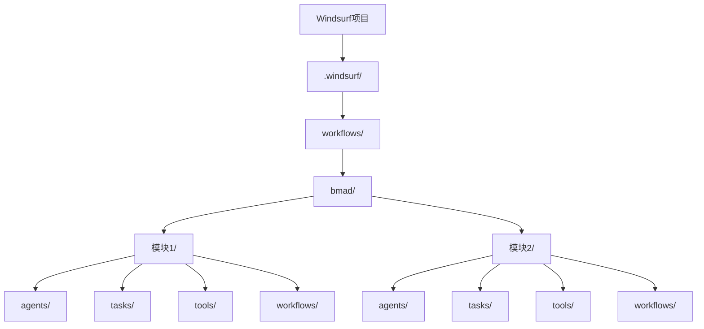
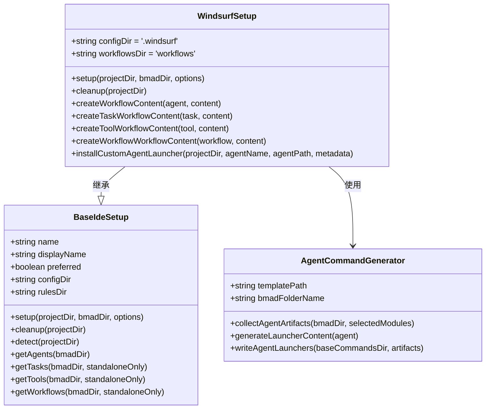
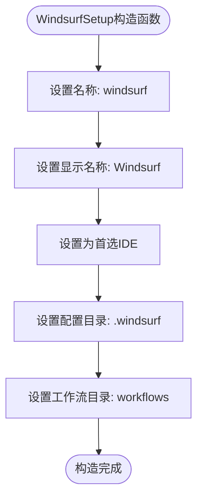
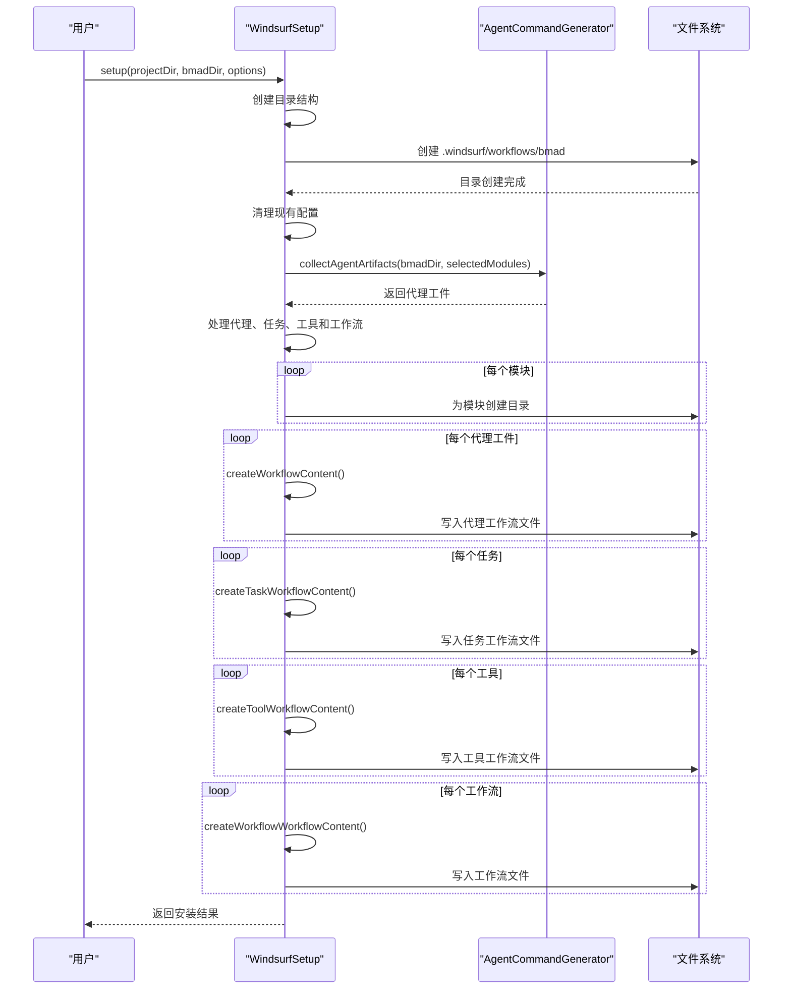
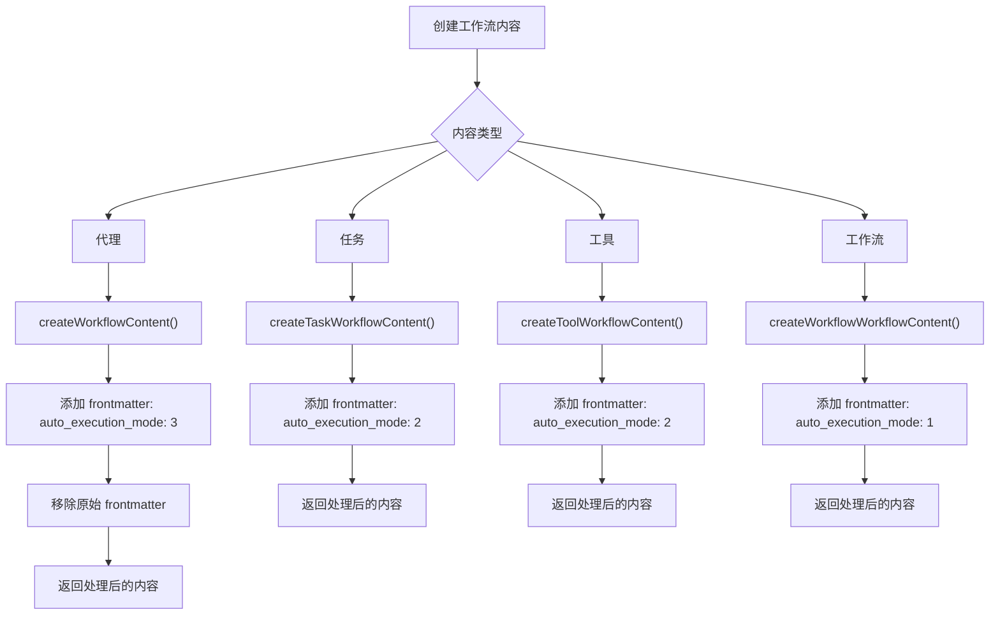
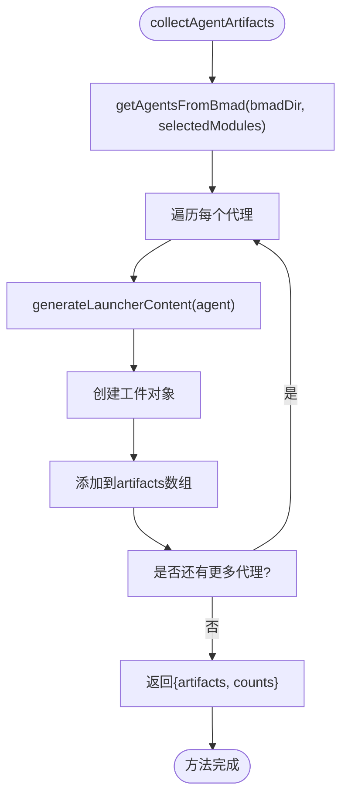
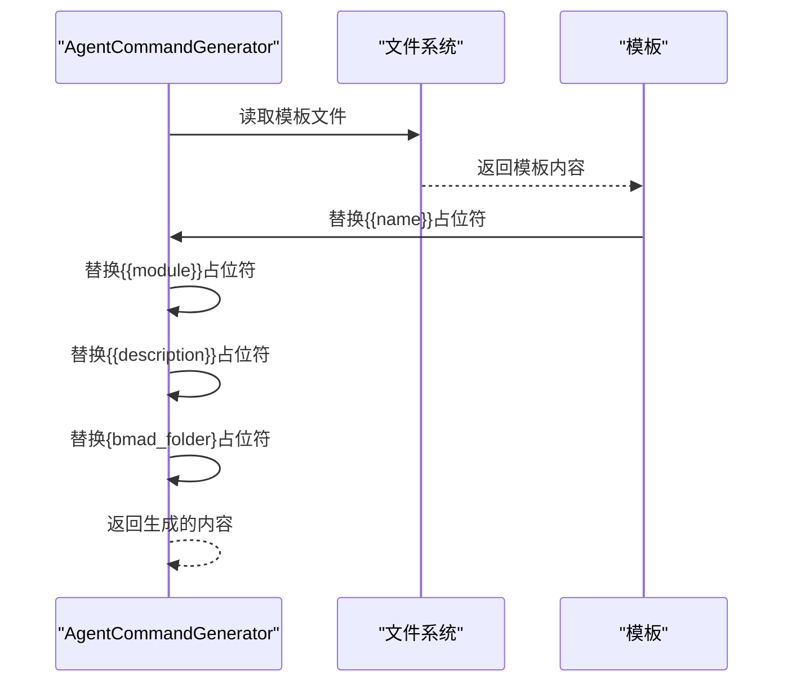
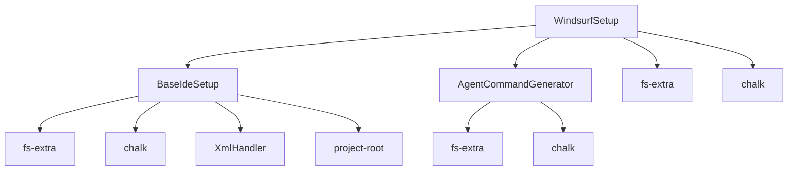

# Windsurf 集成指南

<cite>
**本文档中引用的文件**  
- [windsurf.js](file://tools/cli/installers/lib/ide/windsurf.js)
- [agent-command-generator.js](file://tools/cli/installers/lib/ide/shared/agent-command-generator.js)
- [BaseIdeSetup.js](file://tools/cli/installers/lib/ide/_base-ide.js)
- [windsurf.md](file://docs/ide-info/windsurf.md)
- [install-config.yaml](file://src/modules/bmm/_module-installer/install-config.yaml)
</cite>

## 目录
1. [简介](#简介)
2. [项目结构](#项目结构)
3. [核心组件](#核心组件)
4. [架构概述](#架构概述)
5. [详细组件分析](#详细组件分析)
6. [依赖分析](#依赖分析)
7. [性能考虑](#性能考虑)
8. [故障排除指南](#故障排除指南)
9. [结论](#结论)

## 简介
本指南详细说明了如何将BMAD-METHOD框架集成到Windsurf IDE中。Windsurf作为首选IDE之一，通过其工作流系统与BMAD方法论深度集成，为开发者提供了一套完整的AI驱动开发体验。本指南将深入解析集成器的架构设计，包括命令生成、上下文注入和事件监听机制，并提供具体的配置示例和操作流程。

**Section sources**
- [windsurf.md](file://docs/ide-info/windsurf.md)

## 项目结构
BMAD-METHOD框架在Windsurf中的集成主要通过特定的目录结构和配置文件实现。集成后，BMAD组件被组织在Windsurf的配置目录中，形成清晰的模块化结构。

**Diagram sources**
- [windsurf.js](file://tools/cli/installers/lib/ide/windsurf.js#L25-L57)

**Section sources**
- [windsurf.js](file://tools/cli/installers/lib/ide/windsurf.js#L10-L14)

## 核心组件
Windsurf集成的核心组件包括集成器、命令生成器和配置管理器。这些组件协同工作，将BMAD方法论的代理、任务和工作流转换为Windsurf可识别的工作流格式。

**Section sources**
- [windsurf.js](file://tools/cli/installers/lib/ide/windsurf.js#L9-L259)
- [agent-command-generator.js](file://tools/cli/installers/lib/ide/shared/agent-command-generator.js#L1-L91)

## 架构概述
Windsurf集成器的架构基于模块化设计，继承自BaseIdeSetup基类，实现了特定于Windsurf的配置逻辑。该架构确保了BMAD组件能够以最佳方式在Windsurf环境中运行。

**Diagram sources**
- [windsurf.js](file://tools/cli/installers/lib/ide/windsurf.js#L9-L259)
- [_base-ide.js](file://tools/cli/installers/lib/ide/_base-ide.js#L11-L652)
- [agent-command-generator.js](file://tools/cli/installers/lib/ide/shared/agent-command-generator.js#L9-L90)

## 详细组件分析

### WindsurfSetup 类分析
WindsurfSetup类是Windsurf IDE集成的核心，负责处理所有与Windsurf相关的配置和安装逻辑。

#### 构造函数
WindsurfSetup的构造函数初始化了Windsurf特定的配置参数，包括配置目录和工作流目录。

**Diagram sources**
- [windsurf.js](file://tools/cli/installers/lib/ide/windsurf.js#L10-L14)

**Section sources**
- [windsurf.js](file://tools/cli/installers/lib/ide/windsurf.js#L10-L14)

#### Setup 方法
setup方法是Windsurf集成的主要入口点，负责创建目录结构、清理现有配置并安装所有BMAD组件。

**Diagram sources**
- [windsurf.js](file://tools/cli/installers/lib/ide/windsurf.js#L22-L130)

**Section sources**
- [windsurf.js](file://tools/cli/installers/lib/ide/windsurf.js#L22-L130)

#### 工作流内容创建方法
WindsurfSetup提供了多个方法来创建不同类型的工作流内容，这些方法确保了正确的元数据和执行模式被应用。

**Diagram sources**
- [windsurf.js](file://tools/cli/installers/lib/ide/windsurf.js#L135-L194)

**Section sources**
- [windsurf.js](file://tools/cli/installers/lib/ide/windsurf.js#L135-L194)

### AgentCommandGenerator 类分析
AgentCommandGenerator类负责生成代理启动器，这是将BMAD代理转换为Windsurf可执行工作流的关键组件。

#### 收集代理工件
collectAgentArtifacts方法从BMAD安装目录中收集所有代理，并生成相应的启动器内容。

**Diagram sources**
- [agent-command-generator.js](file://tools/cli/installers/lib/ide/shared/agent-command-generator.js#L21-L47)

**Section sources**
- [agent-command-generator.js](file://tools/cli/installers/lib/ide/shared/agent-command-generator.js#L21-L47)

#### 生成启动器内容
generateLauncherContent方法使用模板生成代理启动器的实际内容，包括必要的占位符替换。

**Diagram sources**
- [agent-command-generator.js](file://tools/cli/installers/lib/ide/shared/agent-command-generator.js#L54-L64)

**Section sources**
- [agent-command-generator.js](file://tools/cli/installers/lib/ide/shared/agent-command-generator.js#L54-L64)

## 依赖分析
Windsurf集成器依赖于多个核心组件和共享工具，这些依赖关系确保了集成的稳定性和可维护性。

**Diagram sources**
- [windsurf.js](file://tools/cli/installers/lib/ide/windsurf.js#L1-L5)
- [_base-ide.js](file://tools/cli/installers/lib/ide/_base-ide.js#L1-L6)
- [agent-command-generator.js](file://tools/cli/installers/lib/ide/shared/agent-command-generator.js#L1-L4)

**Section sources**
- [windsurf.js](file://tools/cli/installers/lib/ide/windsurf.js#L1-L5)
- [_base-ide.js](file://tools/cli/installers/lib/ide/_base-ide.js#L1-L6)
- [agent-command-generator.js](file://tools/cli/installers/lib/ide/shared/agent-command-generator.js#L1-L4)

## 性能考虑
Windsurf集成在设计时考虑了性能优化，通过模块化组织和适当的执行模式设置来确保高效运行。

- **代理执行模式**: 设置为3，允许代理在最少用户干预下自主执行
- **任务/工具执行模式**: 设置为2，提供指导式执行，平衡自动化和用户控制
- **工作流执行模式**: 设置为1，需要用户明确触发，适合复杂流程
- **目录结构优化**: 按模块组织文件，便于快速查找和加载
- **内存使用**: 采用流式处理，避免一次性加载所有文件到内存

**Section sources**
- [windsurf.js](file://tools/cli/installers/lib/ide/windsurf.js#L115-L121)
- [windsurf.md](file://docs/ide-info/windsurf.md#L15-L21)

## 故障排除指南
本节提供Windsurf集成常见问题的解决方案和最佳实践。

### 常见问题
- **集成未生效**: 确保Windsurf配置目录(.windsurf)存在且可写
- **代理无法启动**: 检查工作流文件的frontmatter是否正确，特别是auto_execution_mode设置
- **权限问题**: 确保BMAD安装目录和项目目录具有适当的读写权限
- **版本兼容性**: 确认BMAD-METHOD框架版本与Windsurf IDE版本兼容

### 最佳实践
- **定期清理**: 使用cleanup命令清除旧的BMAD配置，避免冲突
- **模块选择**: 只安装需要的模块，减少不必要的文件和潜在冲突
- **备份配置**: 在重大更改前备份.windsurf目录
- **日志监控**: 关注安装过程中的日志输出，及时发现潜在问题

**Section sources**
- [windsurf.js](file://tools/cli/installers/lib/ide/windsurf.js#L199-L208)
- [windsurf.md](file://docs/ide-info/windsurf.md)

## 结论
Windsurf与BMAD-METHOD框架的集成提供了一套强大而灵活的AI驱动开发环境。通过深入理解集成器的架构设计和工作机制，开发者可以充分利用这一集成的优势，提高开发效率和代码质量。本指南详细介绍了集成的各个方面，从核心组件到实际操作，为成功实施提供了全面的指导。