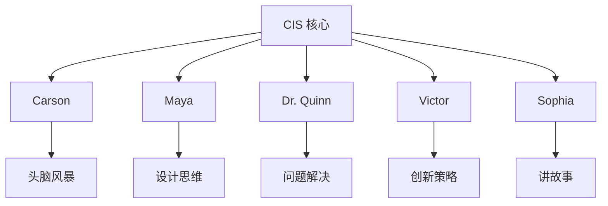
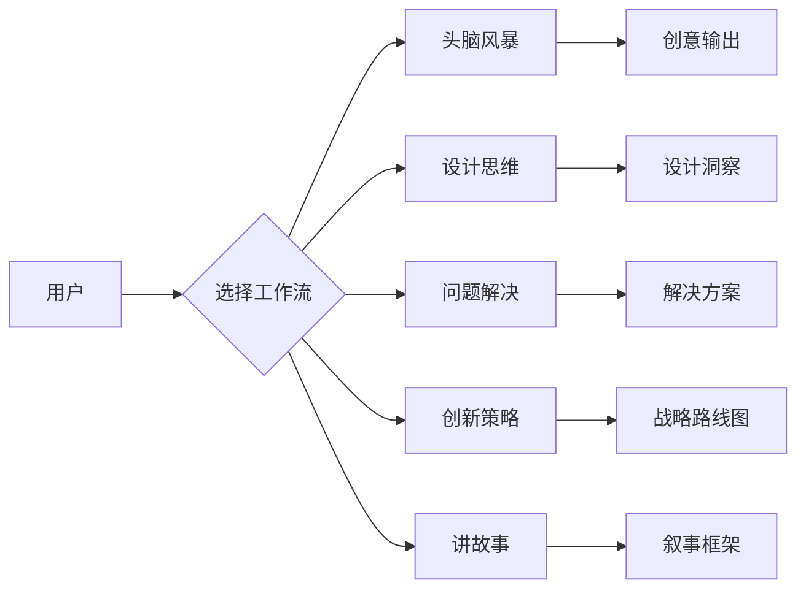
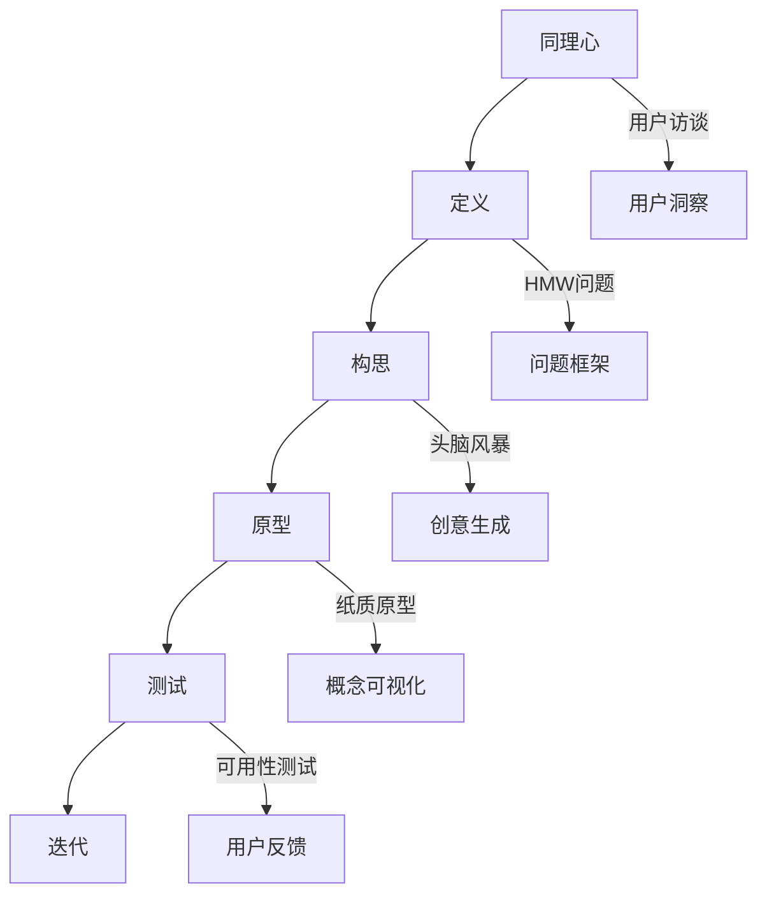
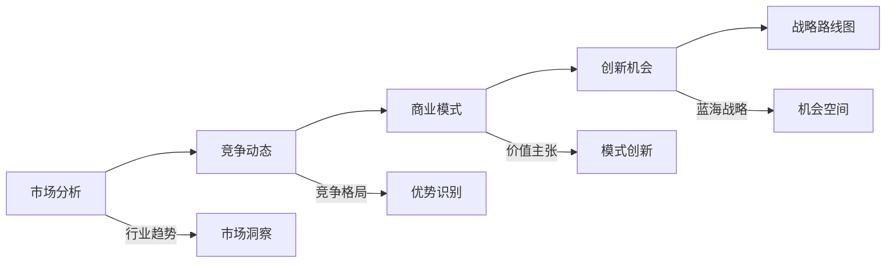
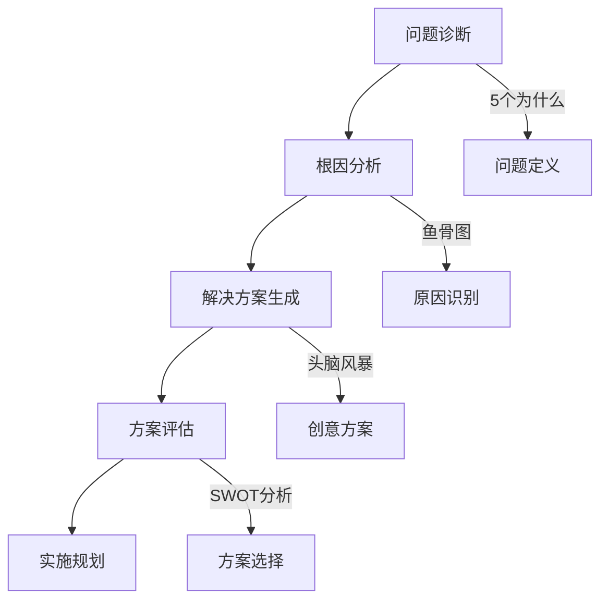
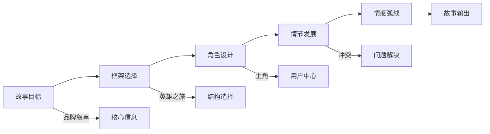
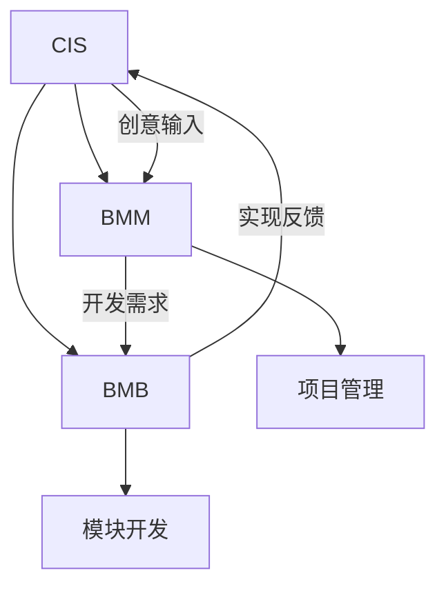

# 创意智能套件 (CIS)

<cite>
**本文档引用文件**  
- [readme.md](file://src/modules/cis/readme.md)
- [workflows/README.md](file://src/modules/cis/workflows/README.md)
- [agents/README.md](file://src/modules/cis/agents/README.md)
- [workflows/design-thinking/workflow.yaml](file://src/modules/cis/workflows/design-thinking/workflow.yaml)
- [workflows/design-thinking/instructions.md](file://src/modules/cis/workflows/design-thinking/instructions.md)
- [workflows/design-thinking/design-methods.csv](file://src/modules/cis/workflows/design-thinking/design-methods.csv)
- [workflows/innovation-strategy/workflow.yaml](file://src/modules/cis/workflows/innovation-strategy/workflow.yaml)
- [workflows/problem-solving/workflow.yaml](file://src/modules/cis/workflows/problem-solving/workflow.yaml)
- [workflows/storytelling/workflow.yaml](file://src/modules/cis/workflows/storytelling/workflow.yaml)
- [teams/creative-squad.yaml](file://src/modules/cis/teams/creative-squad.yaml)
</cite>

## 目录
1. [简介](#简介)
2. [核心能力与角色](#核心能力与角色)
3. [工作流概览](#工作流概览)
4. [设计思维工作流](#设计思维工作流)
5. [创新策略工作流](#创新策略工作流)
6. [问题解决工作流](#问题解决工作流)
7. [讲故事工作流](#讲故事工作流)
8. [头脑风暴工作流](#头脑风暴工作流)
9. [与其他模块的集成](#与其他模块的集成)
10. [配置与使用](#配置与使用)

## 简介

创意智能套件 (Creative Intelligence Suite, CIS) 是一个基于人工智能的创造性促进系统，旨在通过专家级指导提升创新和问题解决能力。CIS 不直接生成解决方案，而是通过结构化的引导式提问，帮助用户发现自己的洞察。该系统包含五个专门的工作流：头脑风暴、设计思维、问题解决、创新策略和讲故事，每个工作流都集成了多种经过验证的方法论和技巧库。

CIS 的核心理念是“引导而非生成”，它通过独特的代理角色（Agent Personas）提供个性化的创造性支持。这些代理作为专业教练，利用丰富的技术库和适应性流程，帮助用户在不同创造性任务中取得突破。

**Section sources**
- [readme.md](file://src/modules/cis/readme.md#L1-L154)

## 核心能力与角色

CIS 通过五个专业代理提供跨领域的创造性支持，每个代理都具有独特的个性和专长领域：

- **Carson（头脑风暴专家）**：以充满活力的方式引导创意发散，擅长营造心理安全环境，激发突破性想法。
- **Maya（设计思维大师）**：以爵士乐即兴演奏般的节奏引导人性化设计流程，专注于同理心和原型设计。
- **Dr. Quinn（问题解决专家）**：采用侦探与科学家结合的思维方式，运用TRIZ、约束理论等系统性方法解决复杂挑战。
- **Victor（创新战略家）**：作为战略颠覆专家，专注于商业模式创新和可持续竞争优势的构建。
- **Sophia（故事大师）**：以富有诗意和想象力的风格指导叙事创作，擅长情感共鸣和受众吸引。

所有代理均为模块化代理（Module Agents），共享统一的配置系统和工作流调用机制，并提供标准化的命令接口（如 `*help` 和 `*exit`）。



**Diagram sources**
- [agents/README.md](file://src/modules/cis/agents/README.md#L1-L105)
- [readme.md](file://src/modules/cis/readme.md#L18-L27)

**Section sources**
- [agents/README.md](file://src/modules/cis/agents/README.md#L1-L105)
- [readme.md](file://src/modules/cis/readme.md#L18-L27)

## 工作流概览

CIS 提供五个交互式工作流，涵盖150多种创造性技术，支持从创意萌发到战略制定的完整过程：

| 工作流 | 目的 | 核心方法 | 输出 |
|--------|------|---------|------|
| 头脑风暴 | 交互式创意生成 | 36种技术，7个类别 | 创意集合与组织 |
| 设计思维 | 以人为本的设计 | 同理心→定义→构思→原型→测试 | 用户洞察与快速原型 |
| 问题解决 | 系统性挑战解决 | 5个为什么、鱼骨图、根因分析 | 根本原因识别与解决方案策略 |
| 创新策略 | 商业模式颠覆 | 蓝海战略、待办任务理论 | 战略创新路线图 |
| 讲故事 | 构建引人入胜的叙事 | 英雄之旅、三幕结构 | 情感共鸣的故事框架 |

所有工作流共享以下特性：
- **交互式引导**：通过提问而非生成来引导用户
- **技术库支持**：基于CSV数据库的成熟方法库
- **上下文集成**：支持输入文档以增强领域相关性
- **结构化输出**：生成包含洞察和行动项的综合报告
- **能量监控**：根据参与度自适应调整节奏



**Diagram sources**
- [workflows/README.md](file://src/modules/cis/workflows/README.md#L1-L140)
- [readme.md](file://src/modules/cis/readme.md#L32-L73)

**Section sources**
- [workflows/README.md](file://src/modules/cis/workflows/README.md#L1-L140)
- [readme.md](file://src/modules/cis/readme.md#L32-L73)

## 设计思维工作流

设计思维工作流遵循五阶段人性化设计流程：同理心 → 定义 → 构思 → 原型 → 测试。该工作流通过系统性引导，帮助用户深入理解用户需求，并转化为可行的解决方案。

### 方法论与流程

工作流基于 `design-methods.csv` 文件中的技术库，包含31种设计方法，按阶段分类：

- **同理心阶段**：用户访谈、同理心映射、旅程映射
- **定义阶段**：问题框架、如何可能（HMW）问题、观点陈述
- **构思阶段**：头脑风暴、疯狂8法、SCAMPER设计
- **原型阶段**：纸质原型、角色扮演、向后服务（Wizard of Oz）
- **测试阶段**：可用性测试、反馈捕获网格、假设测试

### 使用场景

1. **新产品开发**：通过用户旅程映射识别痛点
2. **服务优化**：使用服务蓝图改进客户体验
3. **用户体验改进**：通过可用性测试验证设计假设

### 预期结果

- 用户洞察报告
- 问题定义陈述
- 创意概念集合
- 低保真原型描述
- 测试学习与迭代计划



**Diagram sources**
- [workflows/design-thinking/instructions.md](file://src/modules/cis/workflows/design-thinking/instructions.md#L1-L203)
- [workflows/design-thinking/design-methods.csv](file://src/modules/cis/workflows/design-thinking/design-methods.csv#L1-L31)

**Section sources**
- [workflows/design-thinking/workflow.yaml](file://src/modules/cis/workflows/design-thinking/workflow.yaml#L1-L39)
- [workflows/design-thinking/instructions.md](file://src/modules/cis/workflows/design-thinking/instructions.md#L1-L203)
- [workflows/design-thinking/design-methods.csv](file://src/modules/cis/workflows/design-thinking/design-methods.csv#L1-L31)

## 创新策略工作流

创新策略工作流专注于识别颠覆机会和构建商业模式创新。该工作流引导用户进行市场、竞争动态和商业模式的战略分析，以发现可持续的竞争优势。

### 战略框架

工作流集成多种创新框架，包括：
- **蓝海战略**：创造无竞争的市场空间
- **待办任务理论**（Jobs-to-be-Done）：理解用户雇佣产品完成的任务
- **价值链示范**：分析行业价值创造环节
- **颠覆性创新模式**：识别潜在的市场颠覆机会

### 使用场景

1. **业务转型**：重新定义现有业务模式
2. **新产品定位**：寻找未被满足的市场需求
3. **竞争分析**：识别竞争对手的弱点和机会

### 预期结果

- 战略创新路线图
- 商业模式画布
- 市场机会评估
- 竞争优势分析



**Diagram sources**
- [workflows/innovation-strategy/workflow.yaml](file://src/modules/cis/workflows/innovation-strategy/workflow.yaml#L1-L39)

**Section sources**
- [workflows/innovation-strategy/workflow.yaml](file://src/modules/cis/workflows/innovation-strategy/workflow.yaml#L1-L39)

## 问题解决工作流

问题解决工作流采用系统性方法解决复杂挑战，引导用户完成问题诊断、根因分析、解决方案生成和实施规划的完整过程。

### 解决方法

工作流集成多种问题解决方法，包括：
- **TRIZ理论**：发明问题解决理论
- **约束理论**（TOC）：识别系统瓶颈
- **系统思维**：理解复杂系统动态
- **根因分析**：5个为什么、鱼骨图

### 使用场景

1. **技术难题**：解决复杂的工程问题
2. **运营瓶颈**：识别和消除流程障碍
3. **组织挑战**：解决团队协作问题

### 预期结果

- 问题根本原因分析
- 解决方案选项评估
- 实施行动计划
- 风险缓解策略



**Diagram sources**
- [workflows/problem-solving/workflow.yaml](file://src/modules/cis/workflows/problem-solving/workflow.yaml#L1-L39)

**Section sources**
- [workflows/problem-solving/workflow.yaml](file://src/modules/cis/workflows/problem-solving/workflow.yaml#L1-L39)

## 讲故事工作流

讲故事工作流指导用户使用25种叙事框架创建引人入胜的叙事。该工作流帮助用户将想法转化为情感共鸣的故事，适用于品牌叙事、产品发布和影响力沟通。

### 叙事框架

工作流提供多种故事框架，包括：
- **英雄之旅**：经典的叙事结构
- **三幕结构**：开端-发展-结局
- **故事品牌**（Story Brand）：以客户为中心的叙事
- **故事圈**：循环叙事结构

### 使用场景

1. **品牌叙事**：构建品牌故事和价值观
2. **产品发布**：创建引人入胜的产品介绍
3. **影响力沟通**：说服利益相关者

### 预期结果

- 叙事结构设计
- 故事框架选择
- 情感共鸣点识别
- 受众适应策略



**Diagram sources**
- [workflows/storytelling/workflow.yaml](file://src/modules/cis/workflows/storytelling/workflow.yaml#L1-L39)

**Section sources**
- [workflows/storytelling/workflow.yaml](file://src/modules/cis/workflows/storytelling/workflow.yaml#L1-L39)

## 头脑风暴工作流

头脑风暴工作流提供36种创意生成技术，涵盖7个类别，包括发散/收敛思维、横向连接和强制关联。该工作流通过"是的，而且..."（Yes, and...）的方法论，营造心理安全环境，激发突破性想法。

### 技术选择模式

用户可以选择不同的技术选择模式：
- **用户选择**：手动选择特定技术
- **AI推荐**：根据上下文推荐合适技术
- **随机选择**：随机选择创意技术
- **渐进流程**：按预设顺序进行创意阶段

### 使用场景

1. **创意发散**：生成大量初始想法
2. **团队协作**：促进团队创意交流
3. **突破瓶颈**：打破思维定势

### 预期结果

- 创意集合
- 创意组织框架
- 最佳概念选择
- 创意发展路径

**Section sources**
- [readme.md](file://src/modules/cis/readme.md#L34-L41)

## 与其他模块的集成

CIS 与 BMM（业务模块管理器）和 BMB（业务模块构建器）模块协同工作，将创意转化为可执行的开发计划。

### 与BMM集成

- **项目头脑风暴**：为BMM项目提供创意输入
- **需求分析**：通过设计思维工作流深化用户需求理解
- **解决方案设计**：将创新策略转化为具体功能

### 与BMB集成

- **模块设计**：使用CIS工作流指导创意模块设计
- **工作流创建**：将CIS方法论应用于自定义工作流
- **团队协作**：通过 `creative-squad.yaml` 配置创意团队



**Diagram sources**
- [teams/creative-squad.yaml](file://src/modules/cis/teams/creative-squad.yaml#L1-L8)
- [readme.md](file://src/modules/cis/readme.md#L133-L135)

**Section sources**
- [readme.md](file://src/modules/cis/readme.md#L133-L135)
- [teams/creative-squad.yaml](file://src/modules/cis/teams/creative-squad.yaml#L1-L8)

## 配置与使用

### 配置

编辑 `/{bmad_folder}/cis/config.yaml` 文件进行配置：

```yaml
output_folder: ./creative-outputs
user_name: Your Name
communication_language: english
```

### 使用方法

#### 直接调用工作流

```bash
# 启动交互式会话
workflow brainstorming

# 带上下文文档
workflow design-thinking --data /path/to/context.md
```

#### 通过代理调用

```bash
# 加载代理
agent cis/brainstorming-coach

# 启动工作流
> *brainstorm
```

### 最佳实践

1. **设定明确目标**：在开始会话前明确目标
2. **提供上下文**：输入背景文档以获得更好结果
3. **信任流程**：让引导过程指导发现
4. **适时休息**：当精力下降时暂停
5. **记录洞察**：及时记录涌现的见解

**Section sources**
- [readme.md](file://src/modules/cis/readme.md#L76-L144)
- [workflows/README.md](file://src/modules/cis/workflows/README.md#L76-L97)