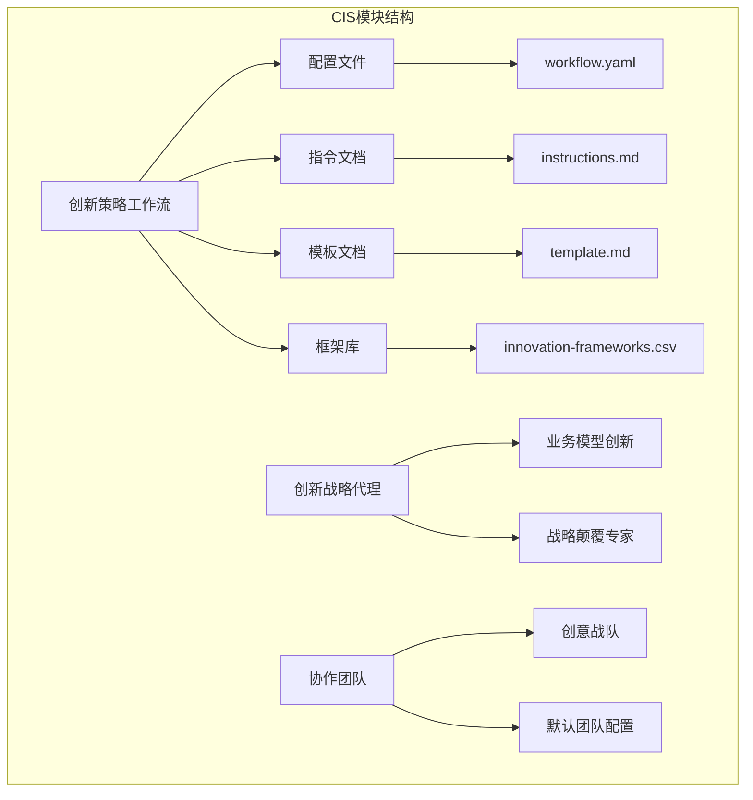
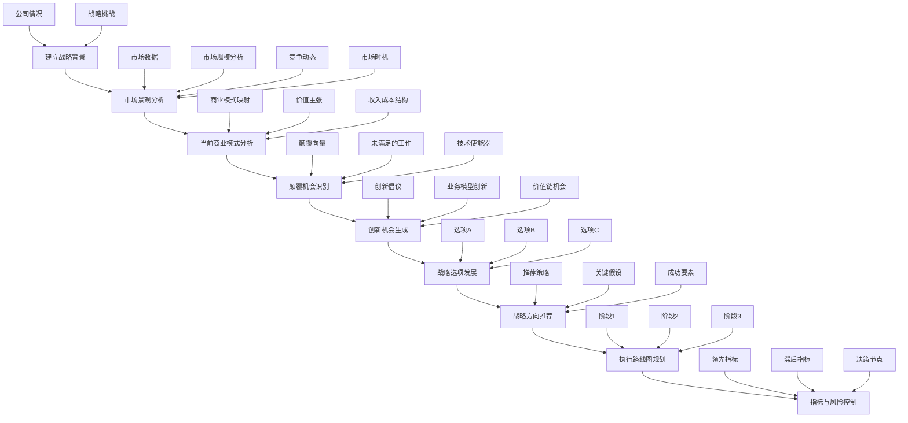
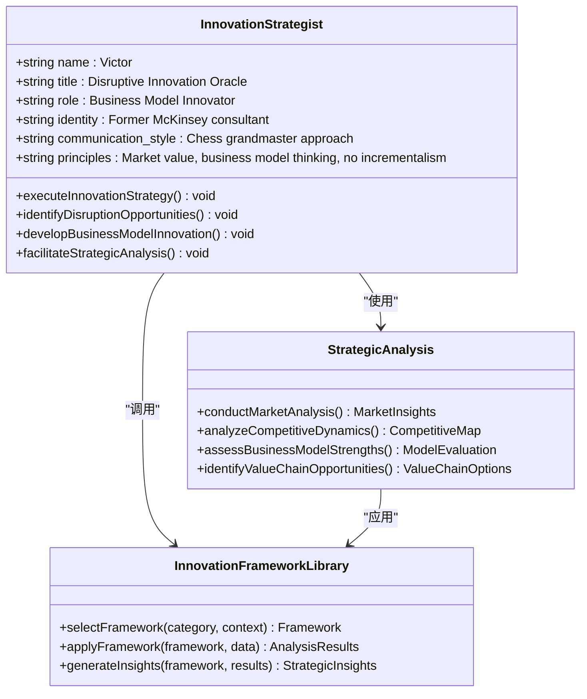
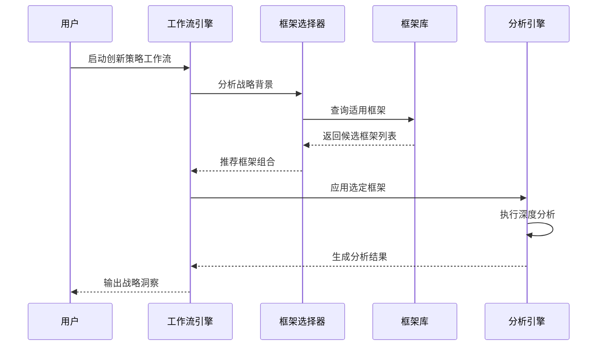
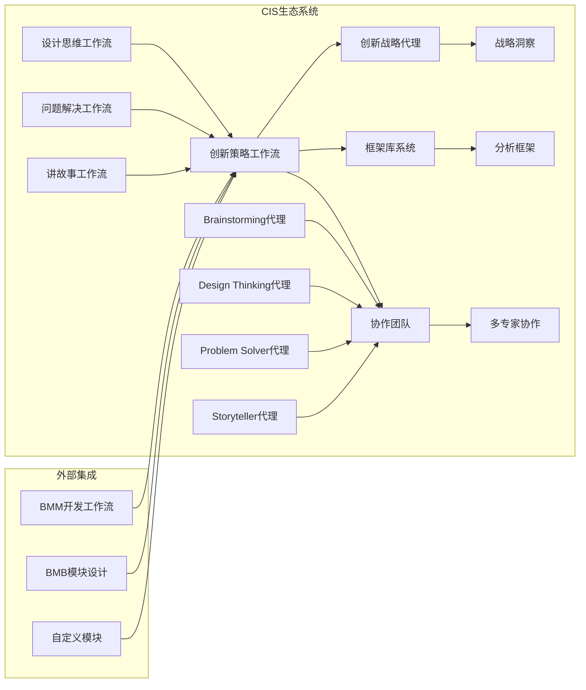

# 创新策略工作流

<cite>
**本文档中引用的文件**
- [workflow.yaml](file://src/modules/cis/workflows/innovation-strategy/workflow.yaml)
- [innovation-frameworks.csv](file://src/modules/cis/workflows/innovation-strategy/innovation-frameworks.csv)
- [instructions.md](file://src/modules/cis/workflows/innovation-strategy/instructions.md)
- [template.md](file://src/modules/cis/workflows/innovation-strategy/template.md)
- [README.md](file://src/modules/cis/workflows/innovation-strategy/README.md)
- [innovation-strategist.agent.yaml](file://src/modules/cis/agents/innovation-strategist.agent.yaml)
- [readme.md](file://src/modules/cis/readme.md)
- [default-party.csv](file://src/modules/cis/teams/default-party.csv)
- [creative-squad.yaml](file://src/modules/cis/teams/creative-squad.yaml)
</cite>

## 目录
1. [简介](#简介)
2. [项目结构](#项目结构)
3. [核心组件](#核心组件)
4. [架构概览](#架构概览)
5. [详细组件分析](#详细组件分析)
6. [依赖关系分析](#依赖关系分析)
7. [性能考虑](#性能考虑)
8. [故障排除指南](#故障排除指南)
9. [结论](#结论)

## 简介

创新策略工作流是BMAD方法论中Creative Intelligence System (CIS)模块的核心组成部分，专门用于识别颠覆性机会并构建业务模型创新。该工作流通过系统化的战略分析，引导企业深入理解市场动态、竞争格局和价值创造机制，从而发现可持续的竞争优势和突破性机会。

该工作流的独特之处在于其强调业务模型创新而非功能创新，采用经过验证的创新框架库，包括Jobs-to-be-Done理论、蓝海战略、颠覆式创新等经典理论。通过结构化的方法论，它能够帮助企业从战略高度审视当前业务模式，识别潜在的颠覆机会，并制定切实可行的创新路线图。

## 项目结构

创新策略工作流在CIS模块中的组织结构体现了其作为综合性战略工具的设计理念：

**图表来源**
- [workflow.yaml](file://src/modules/cis/workflows/innovation-strategy/workflow.yaml#L1-L39)
- [innovation-strategist.agent.yaml](file://src/modules/cis/agents/innovation-strategist.agent.yaml#L1-L30)
- [creative-squad.yaml](file://src/modules/cis/teams/creative-squad.yaml#L1-L8)

**章节来源**
- [README.md](file://src/modules/cis/workflows/innovation-strategy/README.md#L1-L57)
- [readme.md](file://src/modules/cis/readme.md#L1-L154)

## 核心组件

### 工作流配置引擎

创新策略工作流的核心配置定义了其执行环境和资源需求：

| 配置项 | 描述 | 默认值 |
|--------|------|--------|
| 名称 | 工作流标识符 | "innovation-strategy" |
| 描述 | 工作流目的说明 | 战略分析和业务模型创新 |
| 输出格式 | 结果文件命名规则 | `{output_folder}/innovation-strategy-{{date}}.md` |
| 执行模式 | 是否独立运行 | true |

### 框架库系统

创新框架库是工作流的核心知识资产，包含31个经过精心分类的战略分析框架：

| 类别 | 框架名称 | 主要用途 | 关键问题 |
|------|----------|----------|----------|
| 颠覆性创新 | 失败理论 | 识别被忽视的细分市场 | 非消费者是谁？什么是足够好的解决方案？ |
| 颠覆性创新 | Jobs to be Done | 发现未满足的客户需求 | 客户雇佣产品解决什么问题？ |
| 颠覆性创新 | 蓝海战略 | 创建无竞争市场空间 | 如何消除现有因素？如何提升价值？ |
| 商业模型 | 商业模式画布 | 全面映射价值创造机制 | 客户细分是什么？价值主张如何？ |
| 市场分析 | 五力分析 | 行业结构评估 | 供应商议价能力如何？替代品威胁多大？ |
| 技术创新 | 技术生命周期 | 创新扩散理解 | 创新者是谁？早期采用者何时出现？ |

**章节来源**
- [workflow.yaml](file://src/modules/cis/workflows/innovation-strategy/workflow.yaml#L1-L39)
- [innovation-frameworks.csv](file://src/modules/cis/workflows/innovation-strategy/innovation-frameworks.csv#L1-L31)

## 架构概览

创新策略工作流采用分阶段的线性架构，每个阶段都有明确的目标和产出：

**图表来源**
- [instructions.md](file://src/modules/cis/workflows/innovation-strategy/instructions.md#L19-L277)
- [template.md](file://src/modules/cis/workflows/innovation-strategy/template.md#L1-L190)

## 详细组件分析

### 创新战略代理

创新战略代理（Victor）是工作流的主要执行者，具有独特的战略洞察能力和颠覆性思维：

**图表来源**
- [innovation-strategist.agent.yaml](file://src/modules/cis/agents/innovation-strategist.agent.yaml#L1-L30)

### 框架选择机制

工作流采用智能框架选择机制，根据具体的战略情境自动推荐最合适的分析框架：

**图表来源**
- [instructions.md](file://src/modules/cis/workflows/innovation-strategy/instructions.md#L42-L70)
- [innovation-frameworks.csv](file://src/modules/cis/workflows/innovation-strategy/innovation-frameworks.csv#L1-L31)

### 模板输出系统

工作流采用标准化的输出模板，确保分析结果的结构化和可读性：

| 输出部分 | 模板变量 | 内容描述 |
|----------|----------|----------|
| 战略背景 | company_name, strategic_focus | 公司概况和战略重点 |
| 市场分析 | market_landscape, competitive_dynamics | 市场环境和竞争态势 |
| 商业模式 | current_business_model, value_proposition | 当前商业模式和价值主张 |
| 颠覆机会 | disruption_vectors, unmet_jobs | 颠覆性机会和未满足需求 |
| 创新机会 | innovation_initiatives, business_model_innovation | 具体创新机会和业务模型创新 |
| 战略选项 | option_a_name, option_b_name, option_c_name | 三个备选战略方案 |
| 推荐策略 | recommended_strategy, success_factors | 最终推荐的战略和成功要素 |
| 执行计划 | phase_1, phase_2, phase_3 | 分阶段实施计划 |
| 成功指标 | leading_indicators, lagging_indicators | 关键绩效指标 |
| 风险管理 | key_risks, risk_mitigation | 风险识别和缓解措施 |

**章节来源**
- [template.md](file://src/modules/cis/workflows/innovation-strategy/template.md#L1-L190)
- [instructions.md](file://src/modules/cis/workflows/innovation-strategy/instructions.md#L25-L277)

## 依赖关系分析

创新策略工作流与CIS生态系统中的其他组件存在密切的依赖关系：

**图表来源**
- [default-party.csv](file://src/modules/cis/teams/default-party.csv#L1-L13)
- [creative-squad.yaml](file://src/modules/cis/teams/creative-squad.yaml#L1-L8)

### 与其他创造性工作流的互补关系

创新策略工作流与CIS中的其他创造性工作流形成完整的创新生态系统：

| 工作流 | 角色 | 互补性 | 集成方式 |
|--------|------|--------|----------|
| 设计思维 | 用户中心设计 | 提供用户洞察基础 | 在市场分析阶段整合用户研究 |
| 问题解决 | 根本原因分析 | 支持战略决策验证 | 在战略选项评估中应用系统思维 |
| 故事讲述 | 战略叙事构建 | 强化战略传播效果 | 在推荐策略阶段构建说服性叙述 |
| 头脑风暴 | 创意生成 | 激发创新想法 | 在创新机会生成阶段提供创意输入 |

**章节来源**
- [readme.md](file://src/modules/cis/readme.md#L28-L66)

## 性能考虑

创新策略工作流在设计时充分考虑了性能优化和用户体验：

### 执行效率优化

- **增量式输出机制**：每次步骤完成后立即保存，避免长时间等待
- **智能框架选择**：基于上下文自动选择最相关框架，减少不必要的计算
- **内存友好的处理**：采用流式处理大量数据分析，支持大型市场数据集

### 用户体验设计

- **能量感知会话**：根据用户参与度调整对话节奏
- **检查点协议**：每完成一个主要步骤都进行内容保存和确认
- **灵活的交互模式**：支持逐步推进、高级提取和聚会模式等多种参与方式

### 可扩展性设计

- **模块化框架库**：支持动态添加新的分析框架
- **可配置的输出格式**：适应不同的报告需求和集成场景
- **并行处理能力**：支持多个分析维度同时进行

## 故障排除指南

### 常见问题及解决方案

#### 框架选择不当
**症状**：分析结果与实际情况不符
**原因**：选择了不适用于当前情境的分析框架
**解决方案**：重新审视战略背景，手动选择更合适的框架组合

#### 数据输入不足
**症状**：分析深度不够或缺乏针对性
**原因**：提供的市场数据或背景信息过于简略
**解决方案**：准备详细的行业分析报告或竞争情报作为输入数据

#### 输出质量不高
**症状**：生成的战略建议缺乏可操作性
**原因**：用户参与度不足或提供了模糊的输入信息
**解决方案**：确保提供清晰的战略目标和约束条件，积极参与讨论过程

**章节来源**
- [instructions.md](file://src/modules/cis/workflows/innovation-strategy/instructions.md#L6-L8)

## 结论

创新策略工作流代表了BMAD方法论在战略创新领域的深度应用，通过系统化的分析框架和专业的战略洞察，为企业提供了从概念到执行的完整创新路径。其独特价值体现在：

1. **理论与实践结合**：基于成熟的创新理论，但注重实际应用效果
2. **系统性方法论**：提供完整的战略分析流程，避免碎片化思考
3. **专业代理支持**：通过专门的创新战略代理提供深度指导
4. **生态系统集成**：与CIS其他工作流无缝协作，形成创新合力

该工作流不仅能够帮助企业识别颠覆性机会，更重要的是能够将这些机会转化为具体的、可执行的战略行动，真正实现从创新概念到商业成功的转化。随着市场竞争的加剧和技术创新的加速，这种系统性的创新战略能力将成为企业保持竞争优势的关键要素。