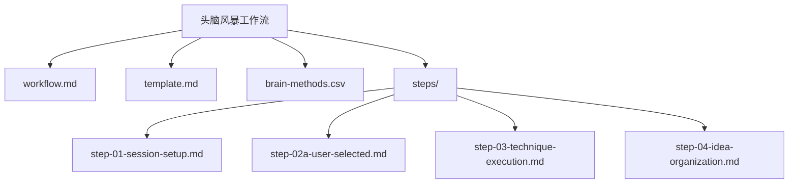
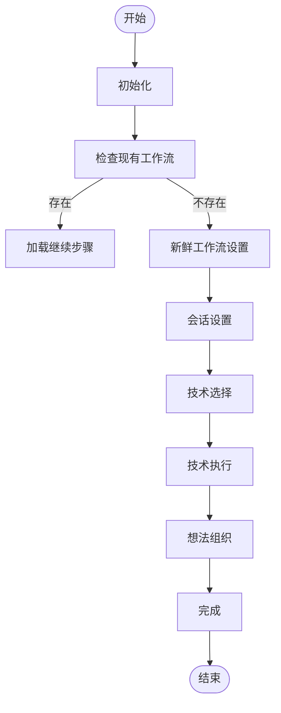
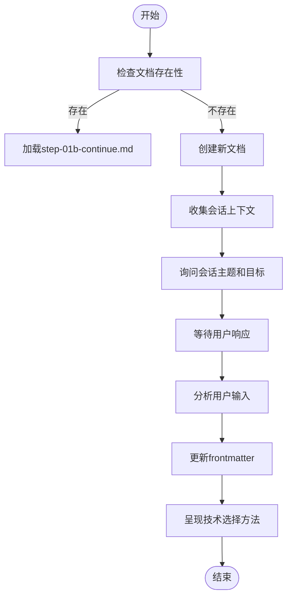
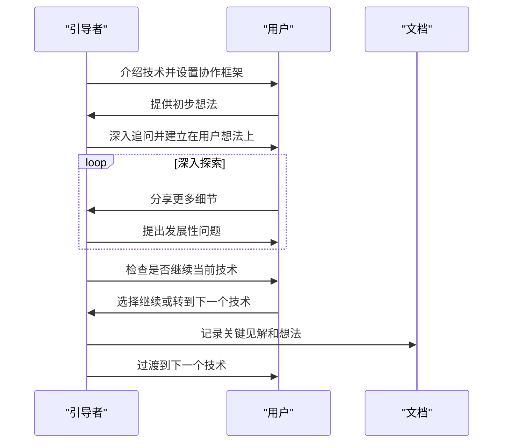
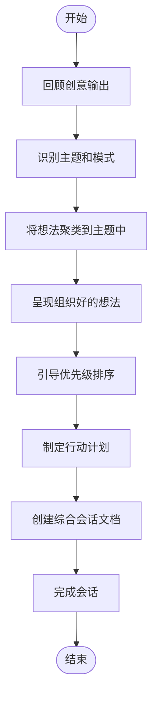
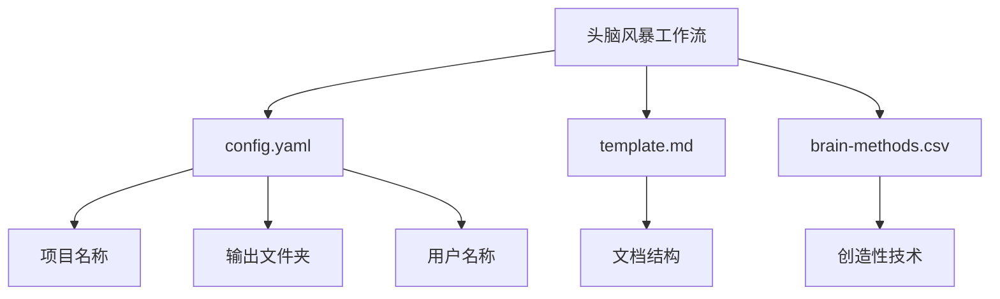

# 头脑风暴

<cite>
**本文档中引用的文件**  
- [workflow.md](file://src/core/workflows/brainstorming/workflow.md)
- [template.md](file://src/core/workflows/brainstorming/template.md)
- [brain-methods.csv](file://src/core/workflows/brainstorming/brain-methods.csv)
- [step-01-session-setup.md](file://src/core/workflows/brainstorming/steps/step-01-session-setup.md)
- [step-02a-user-selected.md](file://src/core/workflows/brainstorming/steps/step-02a-user-selected.md)
- [step-03-technique-execution.md](file://src/core/workflows/brainstorming/steps/step-03-technique-execution.md)
- [step-04-idea-organization.md](file://src/core/workflows/brainstorming/steps/step-04-idea-organization.md)
- [workflow.yaml](file://src/modules/cis/workflows/problem-solving/workflow.yaml)
- [solving-methods.csv](file://src/modules/cis/workflows/problem-solving/solving-methods.csv)
</cite>

## 目录
1. [简介](#简介)
2. [项目结构](#项目结构)
3. [核心组件](#核心组件)
4. [架构概述](#架构概述)
5. [详细组件分析](#详细组件分析)
6. [依赖分析](#依赖分析)
7. [性能考虑](#性能考虑)
8. [故障排除指南](#故障排除指南)
9. [结论](#结论)

## 简介
本文档详细阐述了BMAD-METHOD框架中的头脑风暴子系统，该系统通过结构化的创造性技术引导用户生成创新想法。文档深入解释了工作流如何通过solving-methods.csv中定义的系统化问题解决方法（如Five Whys、SCAMPER等）来促进创意发散。结合problem-solving工作流的YAML定义和指令文件，展示了其执行流程、步骤编排和决策逻辑。文档还提供了在项目初期进行创意发散的实际使用示例，阐述了该子系统如何与CIS（Creative Innovation System）其他模块协同工作，以及如何将产生的想法转化为可执行方案。最后，文档包含了常见问题及解决方案，如创意瓶颈的突破策略。

## 项目结构
头脑风暴子系统位于`src/core/workflows/brainstorming/`目录下，采用微文件架构（micro-file architecture）实现模块化和可维护性。该系统由多个自包含的Markdown文件组成，每个文件负责工作流的一个特定步骤，确保了职责分离和清晰的执行路径。

**图源**  
- [workflow.md](file://src/core/workflows/brainstorming/workflow.md)
- [steps/](file://src/core/workflows/brainstorming/steps/)

**本节来源**  
- [workflow.md](file://src/core/workflows/brainstorming/workflow.md)
- [steps/](file://src/core/workflows/brainstorming/steps/)

## 核心组件
头脑风暴子系统的核心组件包括工作流定义文件、模板文件、技术库CSV文件以及一系列步骤文件。这些组件共同协作，引导用户完成从会话设置到想法组织的完整创意过程。

**本节来源**  
- [workflow.md](file://src/core/workflows/brainstorming/workflow.md)
- [template.md](file://src/core/workflows/brainstorming/template.md)
- [brain-methods.csv](file://src/core/workflows/brainstorming/brain-methods.csv)

## 架构概述
头脑风暴子系统采用基于步骤的微文件架构，每个步骤都是一个自包含的文件，具有嵌入式规则。工作流按顺序执行，用户在每个步骤都有控制权。文档状态通过frontmatter进行跟踪，采用追加式文档构建方式。创造性技术从CSV文件中按需加载，确保了系统的灵活性和可扩展性。

**图源**  
- [workflow.md](file://src/core/workflows/brainstorming/workflow.md)
- [step-01-session-setup.md](file://src/core/workflows/brainstorming/steps/step-01-session-setup.md)

## 详细组件分析
### 组件A分析
#### 会话设置分析
会话设置步骤（step-01-session-setup.md）是整个工作流的入口点，负责初始化会话并收集用户输入。该步骤首先检查是否存在现有的工作流文档，如果存在则直接进入继续模式；如果不存在，则创建新的文档并从模板初始化。

**图源**  
- [step-01-session-setup.md](file://src/core/workflows/brainstorming/steps/step-01-session-setup.md)

**本节来源**  
- [step-01-session-setup.md](file://src/core/workflows/brainstorming/steps/step-01-session-setup.md)

#### 技术执行分析
技术执行步骤（step-03-technique-execution.md）是整个工作流的核心，负责引导用户通过选定的创造性技术进行深入探索。该步骤采用真正的交互式辅导方式，而不是简单的问答序列。

**图源**  
- [step-03-technique-execution.md](file://src/core/workflows/brainstorming/steps/step-03-technique-execution.md)

**本节来源**  
- [step-03-technique-execution.md](file://src/core/workflows/brainstorming/steps/step-03-technique-execution.md)

#### 想法组织分析
想法组织步骤（step-04-idea-organization.md）负责将发散阶段产生的创意进行收敛和结构化。该步骤首先对所有生成的想法进行主题识别和聚类，然后引导用户进行优先级排序，并为高优先级的想法制定具体的行动计划。

**图源**  
- [step-04-idea-organization.md](file://src/core/workflows/brainstorming/steps/step-04-idea-organization.md)

**本节来源**  
- [step-04-idea-organization.md](file://src/core/workflows/brainstorming/steps/step-04-idea-organization.md)

## 依赖分析
头脑风暴子系统依赖于多个外部组件和配置文件。它从`config.yaml`文件中加载项目配置，包括项目名称、输出文件夹、用户名称等。工作流使用`template.md`作为输出文档的模板，并从`brain-methods.csv`中按需加载创造性技术。

**图源**  
- [workflow.md](file://src/core/workflows/brainstorming/workflow.md)
- [config.yaml](file://src/core/workflows/brainstorming/config.yaml)

**本节来源**  
- [workflow.md](file://src/core/workflows/brainstorming/workflow.md)

## 性能考虑
由于头脑风暴子系统主要基于文件读写和文本处理，其性能主要受文件I/O操作的影响。系统采用按需加载创造性技术的策略，避免了在会话开始时加载所有技术，从而减少了内存占用和启动时间。微文件架构也使得每个步骤的执行更加高效，因为只需要加载和处理当前步骤的文件。

## 故障排除指南
### 创意瓶颈突破策略
当用户在头脑风暴过程中遇到创意瓶颈时，可以采用以下策略：
1. **切换技术**：从当前使用的创造性技术切换到另一种技术，如从"SCAMPER方法"切换到"What If场景"。
2. **角色扮演**：让用户从不同的利益相关者视角思考问题，这可以带来全新的见解。
3. **随机刺激**：引入随机词或图像作为创意催化剂，强制建立意想不到的联系。
4. **反向头脑风暴**：生成问题而不是解决方案，以识别隐藏的机会和意外的路径。
5. **时间旅行**：想象过去或未来的自己会如何解决这个问题，获得跨时间的智慧。

**本节来源**  
- [brain-methods.csv](file://src/core/workflows/brainstorming/brain-methods.csv)
- [step-03-technique-execution.md](file://src/core/workflows/brainstorming/steps/step-03-technique-execution.md)

## 结论
头脑风暴子系统是一个结构化且灵活的创意生成框架，它通过一系列精心设计的步骤引导用户从模糊的问题陈述到具体的可执行方案。该系统结合了多种经过验证的创造性技术，如SCAMPER、六顶思考帽和Five Whys，为用户提供了一个全面的创新工具箱。通过微文件架构和追加式文档构建，系统确保了工作流的清晰性和可追溯性。与CIS其他模块的集成使得产生的想法可以无缝地转化为实际项目，从而实现了从创意到实施的完整闭环。