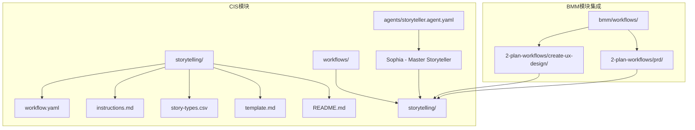
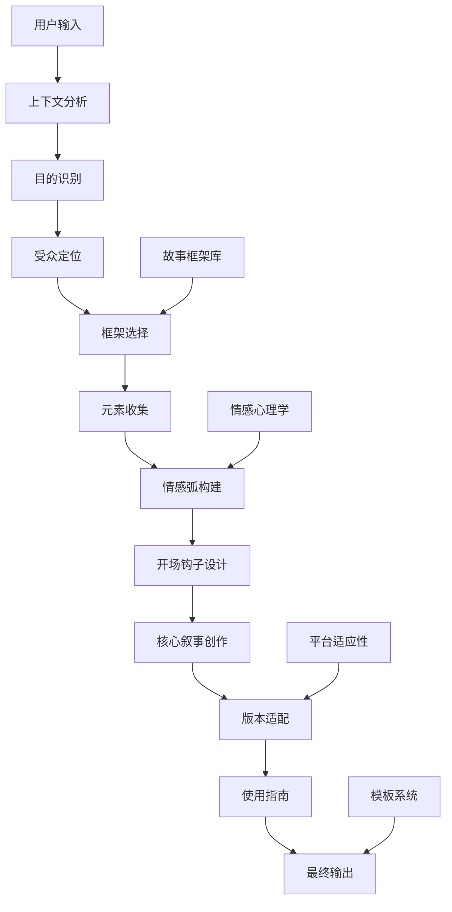
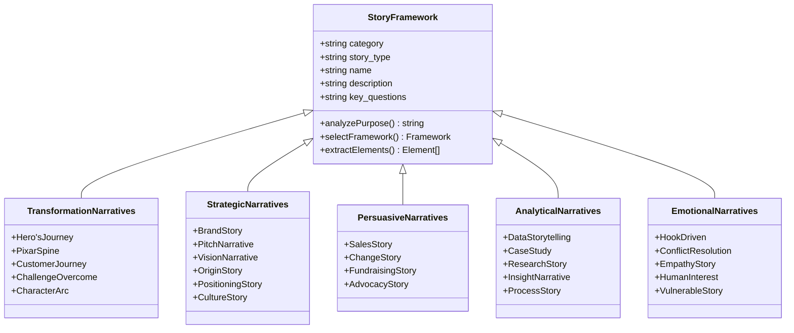
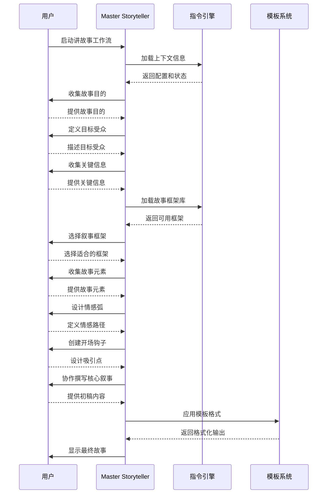
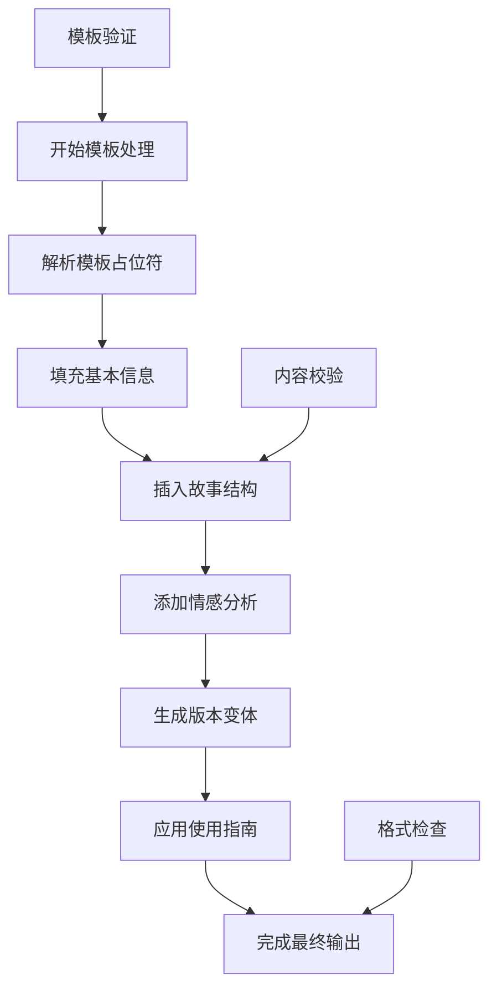
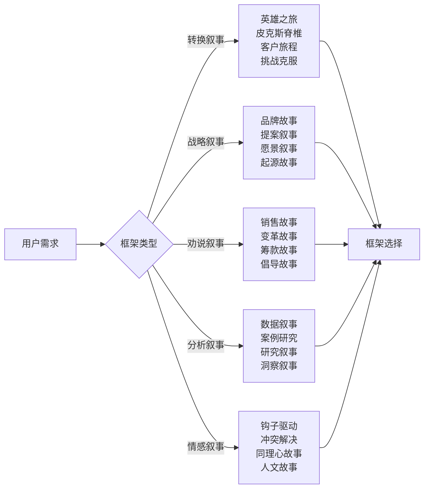
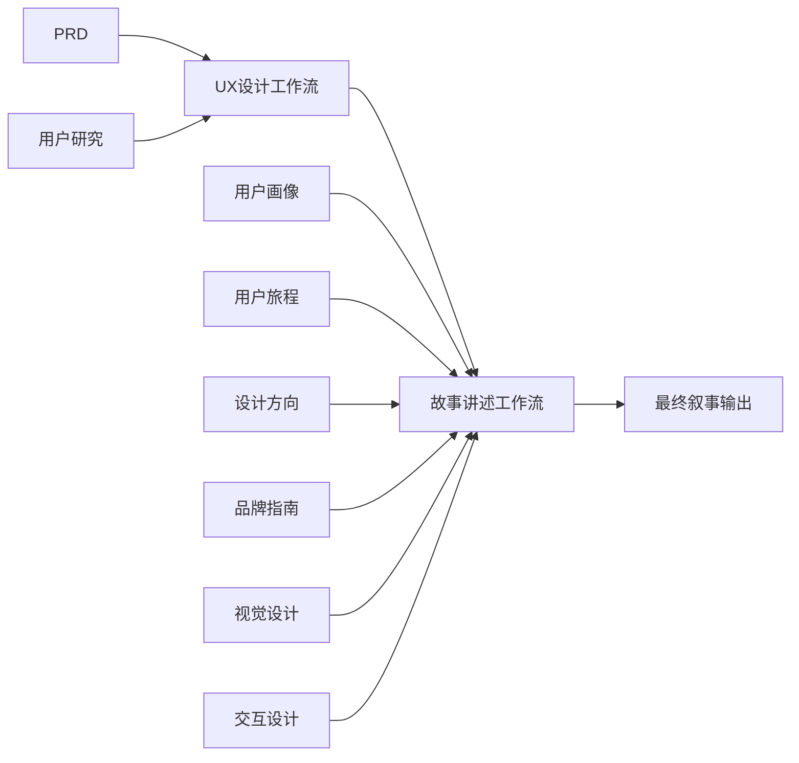

# 讲故事工作流详细文档

<cite>
**本文档中引用的文件**
- [instructions.md](file://src/modules/cis/workflows/storytelling/instructions.md)
- [story-types.csv](file://src/modules/cis/workflows/storytelling/story-types.csv)
- [template.md](file://src/modules/cis/workflows/storytelling/template.md)
- [workflow.yaml](file://src/modules/cis/workflows/storytelling/workflow.yaml)
- [storyteller.agent.yaml](file://src/modules/cis/agents/storyteller.agent.yaml)
- [README.md](file://src/modules/cis/workflows/storytelling/README.md)
- [create-ux-design/workflow.md](file://src/modules/bmm/workflows/2-plan-workflows/create-ux-design/workflow.md)
- [prd/workflow.md](file://src/modules/bmm/workflows/2-plan-workflows/prd/workflow.md)
</cite>

## 目录
1. [简介](#简介)
2. [项目结构](#项目结构)
3. [核心组件](#核心组件)
4. [架构概览](#架构概览)
5. [详细组件分析](#详细组件分析)
6. [叙事框架库](#叙事框架库)
7. [工作流程详解](#工作流程详解)
8. [与UX设计工作流的协同](#与ux设计工作流的协同)
9. [市场营销应用价值](#市场营销应用价值)
10. [使用示例](#使用示例)
11. [最佳实践](#最佳实践)
12. [总结](#总结)

## 简介

讲故事工作流是BMAD方法论中Creative Intelligence System (CIS)模块的核心组成部分，专门设计用于通过系统化的方法创建引人入胜的叙事内容。该工作流利用经过验证的故事框架和技巧，指导用户从核心信息提炼到多渠道内容创作的全过程，特别适用于产品发布、用户案例和品牌故事的创作。

该工作流的独特之处在于其结合了情感心理学原理、平台适应性策略和富有感染力的引导风格，能够创造出既符合商业目标又具有情感共鸣的叙事作品。

## 项目结构

讲故事工作流在代码库中的组织结构体现了其模块化设计理念：

**图表来源**
- [workflow.yaml](file://src/modules/cis/workflows/storytelling/workflow.yaml#L1-L39)
- [storyteller.agent.yaml](file://src/modules/cis/agents/storyteller.agent.yaml#L1-L30)

**章节来源**
- [README.md](file://src/modules/cis/workflows/storytelling/README.md#L1-L59)

## 核心组件

讲故事工作流由四个核心组件构成，每个组件都承担着特定的功能和职责：

### 1. 故事框架库 (story-types.csv)
包含25种经过验证的叙事框架，涵盖从经典英雄之旅到现代数据故事的各种结构。

### 2. 指导式指令系统 (instructions.md)
提供详细的叙事发展指导，采用苏格拉底式提问方法引导用户发掘故事内容。

### 3. 结构化模板系统 (template.md)
定义标准化的输出格式，确保故事内容的完整性和一致性。

### 4. 工作流配置引擎 (workflow.yaml)
管理整个叙事创作过程的执行流程和资源配置。

**章节来源**
- [story-types.csv](file://src/modules/cis/workflows/storytelling/story-types.csv#L1-L26)
- [instructions.md](file://src/modules/cis/workflows/storytelling/instructions.md#L1-L294)
- [template.md](file://src/modules/cis/workflows/storytelling/template.md#L1-L114)

## 架构概览

讲故事工作流采用了分层架构设计，确保了灵活性和可扩展性：

**图表来源**
- [instructions.md](file://src/modules/cis/workflows/storytelling/instructions.md#L12-L294)
- [workflow.yaml](file://src/modules/cis/workflows/storytelling/workflow.yaml#L1-L39)

## 详细组件分析

### 故事框架库深度解析

故事框架库是整个工作流的核心知识基础，包含了精心分类的25种叙事框架：

**图表来源**
- [story-types.csv](file://src/modules/cis/workflows/storytelling/story-types.csv#L1-L26)

#### 主要叙事类别分析

| 类别 | 框架数量 | 适用场景 | 核心特点 |
|------|----------|----------|----------|
| 转换叙事 | 5个 | 用户体验转变、产品采用 | 强调个人成长和变化 |
| 战略叙事 | 6个 | 品牌建设、市场定位 | 突出价值观和愿景 |
| 劝说叙事 | 4个 | 销售推广、融资 | 以说服为目标 |
| 分析叙事 | 5个 | 数据展示、案例研究 | 基于事实和洞察 |
| 情感叙事 | 5个 | 品牌故事、用户共鸣 | 注重情感连接 |

**章节来源**
- [story-types.csv](file://src/modules/cis/workflows/storytelling/story-types.csv#L1-L26)

### 指导式指令系统架构

指令系统采用交互式文档工作流模式，通过精心设计的问题序列引导用户完成叙事创作：

**图表来源**
- [instructions.md](file://src/modules/cis/workflows/storytelling/instructions.md#L12-L294)

**章节来源**
- [instructions.md](file://src/modules/cis/workflows/storytelling/instructions.md#L1-L294)

### 结构化模板系统

模板系统提供了标准化的输出格式，确保故事内容的完整性和专业性：

**图表来源**
- [template.md](file://src/modules/cis/workflows/storytelling/template.md#L1-L114)

**章节来源**
- [template.md](file://src/modules/cis/workflows/storytelling/template.md#L1-L114)

## 叙事框架库

故事框架库是讲故事工作流的知识核心，包含了经过时间检验的25种叙事结构：

### 转换叙事框架

转换叙事框架专注于人物或情境的转变过程，强调成长和进化：

- **英雄之旅**: 经典的冒险和回归结构
- **皮克斯故事脊椎**: 情感张力构建到解决的结构
- **客户旅程**: 从痛点到解决方案的转化
- **挑战克服**: 障碍到胜利的戏剧性结构
- **角色弧**: 个人演化的成长故事

### 战略叙事框架

战略叙事框架用于品牌建设和市场定位：

- **品牌故事**: 传达品牌价值观和独特定位
- **提案叙事**: 说服性的问题到解决方案结构
- **愿景叙事**: 展望未来状态和实现路径
- **起源故事**: 解释事物的诞生和发展
- **定位故事**: 建立市场竞争优势

### 劝说叙事框架

劝说叙事框架旨在激发行动和投资：

- **销售故事**: 客户为中心的价值演示
- **变革故事**: 推动转型和动员的叙事
- **筹款故事**: 情感驱动的使命连接
- **倡导故事**: 为事业、运动或政策变革发声

### 分析叙事框架

分析叙事框架专注于数据洞察和事实呈现：

- **数据叙事**: 将洞察转化为引人入胜的故事
- **案例研究**: 实际应用结果和经验教训
- **研究叙事**: 以易懂有趣的方式呈现研究成果
- **洞察叙事**: 揭示非显而易见的真理或模式
- **过程叙事**: 展示创造或完成某事的过程

### 情感叙事框架

情感叙事框架注重建立情感连接：

- **钩子驱动**: 最大化情感参与的结构
- **冲突解决**: 中心冲突的紧张构建和满足性解决
- **同理心故事**: 创造对其他观点的理解和共鸣
- **人文故事**: 强调普遍人类经验和情感
- **脆弱故事**: 真实的个人叙述分享挣扎、失败或原始真相

**章节来源**
- [story-types.csv](file://src/modules/cis/workflows/storytelling/story-types.csv#L1-L26)

## 工作流程详解

讲故事工作流遵循严格的步骤序列，确保叙事创作的质量和一致性：

### 第一步：故事上下文设置

工作流从全面的上下文分析开始，包括：

- **目的识别**: 明确故事的商业目标（营销、提案、品牌叙事等）
- **受众定位**: 精确定义目标受众特征
- **关键信息收集**: 提取需要传达的核心信息
- **约束条件分析**: 考虑长度、语气、媒介等限制因素

### 第二步：选择故事框架

基于第一步的分析，系统提供多种叙事框架选项：

**图表来源**
- [instructions.md](file://src/modules/cis/workflows/storytelling/instructions.md#L38-L82)

### 第三步：收集故事元素

根据选定的框架，系统引导用户收集关键故事元素：

- **角色发展**: 主角、配角及其动机
- **情节结构**: 冲突、高潮、转折点
- **主题深化**: 核心信息和价值观
- **视觉元素**: 具象化的描述和细节

### 第四步：构建情感弧

情感弧是故事的情感核心，确保读者能够产生共鸣：

- **情绪起始点**: 开始时希望引发的情绪
- **情感转折**: 关键时刻的情绪变化
- **情绪终点**: 结尾时希望留下的感受
- **情感峰值**: 故事中最激动人心的时刻

### 第五步：设计开场钩子

开场钩子决定是否继续阅读，必须具备以下特征：

- **意外性**: 打破预期或假设
- **相关性**: 与目标受众直接相关
- **紧迫性**: 创造立即关注的理由
- **具体性**: 使用生动具体的描述

### 第六步：撰写核心叙事

核心叙事阶段采用协作方式：

- **用户主导**: 用户自行撰写并获得指导
- **AI辅助**: AI基于讨论内容生成初稿
- **共创模式**: 逐步迭代共同创作

### 第七步：创建故事变体

为了适应不同的传播渠道和长度要求：

- **短版本**: 适合社交媒体和快速传递
- **中版本**: 适合邮件正文和博客摘要
- **长版本**: 适合文章、演讲和完整案例

### 第八步：使用指南

提供战略性的部署建议：

- **最佳渠道**: 针对不同框架推荐传播渠道
- **受众考虑**: 针对不同受众的调整建议
- **声音一致性**: 保持品牌声音的一致性
- **多媒体增强**: 视觉或多媒体元素的建议

### 第九步：完善和下一步

最后阶段进行故事优化和规划：

- **强化部分**: 确定最有力的部分
- **改进机会**: 识别需要完善的领域
- **关键决议**: 明确故事的核心结论
- **额外版本**: 是否需要为其他受众创建版本
- **反馈测试**: 制定与受众测试的计划

### 第十步：生成最终输出

整合所有元素生成结构化的故事文档：

- **完整性检查**: 确保所有必要部分都已包含
- **格式验证**: 验证模板格式的正确性
- **一致性审查**: 检查语气和声音的一致性
- **文件保存**: 将最终故事保存到指定位置

**章节来源**
- [instructions.md](file://src/modules/cis/workflows/storytelling/instructions.md#L12-L294)

## 与UX设计工作流的协同

讲故事工作流与BMM模块中的UX设计工作流形成了强大的协同效应：

### 协同架构

**图表来源**
- [create-ux-design/workflow.md](file://src/modules/bmm/workflows/2-plan-workflows/create-ux-design/workflow.md#L1-L54)
- [prd/workflow.md](file://src/modules/bmm/workflows/2-plan-workflows/prd/workflow.md#L1-L62)

### 协同机制

1. **信息共享**: UX设计工作流产出的用户研究和用户画像为故事讲述提供丰富的背景信息
2. **视角互补**: UX设计关注用户体验，故事讲述关注情感连接，两者相辅相成
3. **内容整合**: UX设计的视觉元素和交互概念可以融入故事叙述中
4. **目标一致**: 两者都致力于提升用户参与度和品牌认知

### 实际应用场景

- **产品发布**: UX设计定义用户体验，故事讲述创造情感共鸣
- **用户案例**: UX设计展示功能特性，故事讲述突出用户体验
- **品牌建设**: UX设计建立视觉识别，故事讲述建立情感连接
- **用户培训**: UX设计提供操作指导，故事讲述建立学习动机

**章节来源**
- [create-ux-design/workflow.md](file://src/modules/bmm/workflows/2-plan-workflows/create-ux-design/workflow.md#L1-L54)

## 市场营销应用价值

讲故事工作流在市场营销领域具有显著的应用价值：

### 1. 产品发布策略

- **预热阶段**: 使用起源故事和品牌故事框架建立期待
- **发布阶段**: 采用英雄之旅框架展示产品如何解决用户问题
- **持续推广**: 利用客户旅程框架跟踪用户采用过程

### 2. 用户案例开发

- **成功故事**: 使用案例研究框架展示实际成果
- **问题解决**: 采用挑战克服框架突出解决方案效果
- **经验分享**: 利用过程叙事框架展示实施细节

### 3. 品牌故事建设

- **品牌历史**: 运用起源故事框架讲述品牌发展历程
- **核心价值观**: 使用品牌故事框架传达品牌理念
- **未来愿景**: 采用愿景叙事框架描绘未来发展蓝图

### 4. 内容营销优化

- **社交媒体**: 创建短版本故事适应快速消费习惯
- **电子邮件营销**: 开发中版本故事提供深度信息
- **网站内容**: 制作长版本故事建立权威地位

### 5. 销售促进

- **销售故事**: 针对潜在客户的痛点和解决方案
- **提案叙事**: 为重要客户定制的说服性故事
- **演示材料**: 使用数据叙事框架展示产品优势

## 使用示例

### 示例1：新产品发布

**背景信息**:
- 产品: 智能健身手环
- 目的: 吸引健身爱好者购买
- 受众: 25-40岁都市白领
- 约束: 30秒内抓住注意力

**工作流应用**:
1. **上下文设置**: 明确产品定位和目标市场
2. **框架选择**: 选择"英雄之旅"框架
3. **元素收集**: 
   - 英雄: 忙碌的都市白领
   - 普通世界: 日常忙碌的生活
   - 冒险召唤: 健康意识觉醒
   - 试炼: 健身挑战
   - 变化: 成功养成健康习惯
   - 智慧: 平衡生活与健康

4. **情感弧**: 从焦虑到自信，从迷茫到清晰
5. **开场钩子**: "你有多久没真正关注自己的健康了？"
6. **核心叙事**: 展现产品如何成为健康英雄的得力助手

### 示例2：品牌故事创作

**背景信息**:
- 品牌: 可持续时尚品牌
- 目的: 建立品牌认同
- 受众: 关注环保的年轻人
- 约束: 体现品牌价值观

**工作流应用**:
1. **上下文设置**: 收集品牌创始故事和核心理念
2. **框架选择**: 选择"品牌故事"框架
3. **元素收集**:
   - 发源火花: 对环境问题的关注
   - 核心价值观: 可持续性和社会责任
   - 影响: 如何改变消费者行为
   - 差异化: 与其他品牌的区别
   - 未来方向: 可持续发展的愿景

### 示例3：用户案例开发

**背景信息**:
- 案例: 某公司使用CRM系统的成功转型
- 目的: 展示产品价值
- 受众: 同行业企业决策者
- 约束: 3分钟内完成讲述

**工作流应用**:
1. **上下文设置**: 分析客户面临的挑战和期望
2. **框架选择**: 选择"客户旅程"框架
3. **元素收集**:
   - 之前困境: 低效的客户管理
   - 发现时刻: CRM系统介绍
   - 实施过程: 系统部署和培训
   - 转变: 业务效率显著提升
   - 新现实: 成功的客户关系管理

**章节来源**
- [instructions.md](file://src/modules/cis/workflows/storytelling/instructions.md#L24-L240)

## 最佳实践

### 1. 准备阶段

- **明确目标**: 在开始前清楚定义故事的目的和预期效果
- **深入了解受众**: 进行充分的市场调研和用户分析
- **收集背景资料**: 整理相关的产品信息、市场数据和竞争分析

### 2. 框架选择

- **匹配目标**: 选择与故事目的最契合的叙事框架
- **考虑受众**: 考虑目标受众的文化背景和偏好
- **评估媒介**: 根据传播渠道的特点选择合适的框架

### 3. 内容创作

- **保持真实性**: 确保故事内容真实可信
- **注重情感**: 重视情感连接而非单纯的信息传递
- **突出差异**: 强调产品或服务的独特优势

### 4. 版本适配

- **平台定制**: 针对不同平台调整故事长度和风格
- **语言本地化**: 考虑文化差异进行适当调整
- **视觉配合**: 确保文字内容与视觉元素协调一致

### 5. 测试优化

- **A/B测试**: 对不同版本进行测试比较
- **反馈收集**: 收集目标受众的真实反馈
- **持续优化**: 根据测试结果不断改进故事内容

### 6. 团队协作

- **跨部门合作**: 与市场、产品、设计团队紧密协作
- **知识共享**: 建立故事框架和最佳实践的知识库
- **技能培养**: 培养团队的叙事能力

## 总结

讲故事工作流代表了BMAD方法论在创意内容生产领域的创新突破。通过系统化的方法、丰富的叙事框架库和智能化的指导机制，该工作流不仅提升了内容创作的效率和质量，更重要的是建立了科学的艺术创作体系。

### 核心价值

1. **系统化**: 将创意过程转化为可重复、可优化的系统
2. **专业化**: 提供专业的叙事技巧和框架支持
3. **智能化**: 利用AI技术提供个性化指导和建议
4. **协同性**: 与UX设计等其他工作流形成良好协同

### 应用前景

随着数字营销和内容消费方式的不断演变，讲故事工作流将在以下方面发挥更大作用：

- **个性化内容**: 基于用户画像的定制化叙事
- **跨平台传播**: 统一品牌叙事在不同平台的适配
- **实时互动**: 基于用户反馈的动态内容调整
- **数据驱动**: 基于分析结果的叙事优化

讲故事工作流不仅是一个工具，更是一种思维方式的转变，它教会我们如何用故事的力量连接人心、推动行动，在数字化时代构建有温度的品牌叙事。