# 设计思维工作流技术文档

<cite>
**本文档引用的文件**
- [workflow.yaml](file://src/modules/cis/workflows/design-thinking/workflow.yaml)
- [instructions.md](file://src/modules/cis/workflows/design-thinking/instructions.md)
- [design-methods.csv](file://src/modules/cis/workflows/design-thinking/design-methods.csv)
- [template.md](file://src/modules/cis/workflows/design-thinking/template.md)
- [README.md](file://src/modules/cis/workflows/design-thinking/README.md)
- [workflow.xml](file://src/core/tasks/workflow.xml)
- [design-thinking-coach.agent.yaml](file://src/modules/cis/agents/design-thinking-coach.agent.yaml)
- [brain-methods.csv](file://src/core/workflows/brainstorming/brain-methods.csv)
</cite>

## 目录
1. [简介](#简介)
2. [项目结构](#项目结构)
3. [核心组件](#核心组件)
4. [架构概览](#架构概览)
5. [详细组件分析](#详细组件分析)
6. [设计思维五步法详解](#设计思维五步法详解)
7. [CSV方法论库分析](#csv方法论库分析)
8. [工作流执行机制](#工作流执行机制)
9. [最佳实践与集成方式](#最佳实践与集成方式)
10. [故障排除指南](#故障排除指南)
11. [结论](#结论)

## 简介

设计思维工作流是BMAD创意智能套件中的核心模块，基于经典的设计思维五步法（共情、定义、构思、原型、测试）构建了一个完整的用户体验设计流程。该工作流通过YAML配置文件和CSV方法论库的结合，为用户提供了一个结构化的人类中心设计过程，确保解决方案深度植根于用户需求。

该工作流的独特之处在于：
- **完整的五阶段设计思维流程**：从深入的用户研究到最终的原型验证
- **动态方法论库**：基于CSV的可扩展设计方法集合
- **交互式指导原则**：通过instructions.md中的指导原则引导用户完成每个阶段
- **结构化输出**：自动生成标准化的设计文档模板

## 项目结构

设计思维工作流采用模块化的组织结构，主要包含以下核心文件：

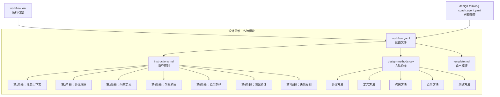

**图表来源**
- [workflow.yaml](file://src/modules/cis/workflows/design-thinking/workflow.yaml#L1-L39)
- [instructions.md](file://src/modules/cis/workflows/design-thinking/instructions.md#L1-L203)
- [design-methods.csv](file://src/modules/cis/workflows/design-thinking/design-methods.csv#L1-L31)

**章节来源**
- [README.md](file://src/modules/cis/workflows/design-thinking/README.md#L1-L57)

## 核心组件

### 工作流配置系统

设计思维工作流的核心配置通过workflow.yaml文件管理，该文件定义了工作流的基本属性、依赖关系和输出配置：

| 配置项 | 类型 | 描述 | 默认值 |
|--------|------|------|--------|
| name | 字符串 | 工作流名称 | "design-thinking" |
| description | 字符串 | 工作流描述 | 人类中心设计过程指南 |
| config_source | 路径 | 外部配置源路径 | "{project-root}/{bmad_folder}/cis/config.yaml" |
| output_folder | 路径 | 输出文件夹路径 | "{config_source}:output_folder" |
| template | 路径 | 模板文件路径 | "{installed_path}/template.md" |
| instructions | 路径 | 指导文件路径 | "{installed_path}/instructions.md" |
| design_methods | 路径 | 方法论CSV文件路径 | "{installed_path}/design-methods.csv" |

### 执行引擎架构

工作流执行基于XML格式的workflow.xml引擎，该引擎提供了完整的步骤管理和用户交互功能：

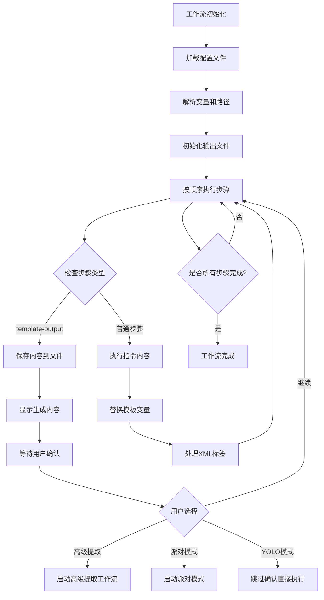

**图表来源**
- [workflow.xml](file://src/core/tasks/workflow.xml#L1-L235)

**章节来源**
- [workflow.yaml](file://src/modules/cis/workflows/design-thinking/workflow.yaml#L1-L39)
- [workflow.xml](file://src/core/tasks/workflow.xml#L1-L235)

## 架构概览

设计思维工作流采用了分层架构设计，确保了模块化、可扩展性和易于维护性：

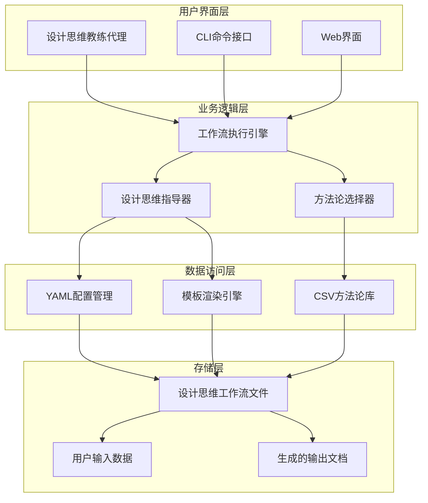

**图表来源**
- [design-thinking-coach.agent.yaml](file://src/modules/cis/agents/design-thinking-coach.agent.yaml#L1-L30)
- [workflow.yaml](file://src/modules/cis/workflows/design-thinking/workflow.yaml#L1-L39)

## 详细组件分析

### 设计思维教练代理

设计思维教练代理（Maya）是工作流的入口点，负责协调整个设计思维过程：

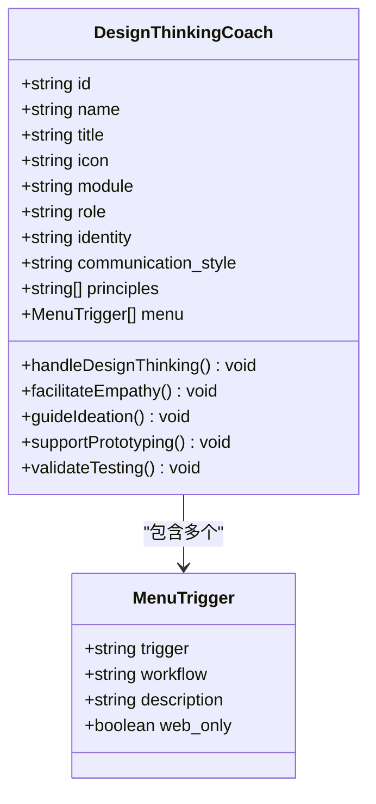

**图表来源**
- [design-thinking-coach.agent.yaml](file://src/modules/cis/agents/design-thinking-coach.agent.yaml#L1-L30)

### 指导原则系统

instructions.md文件定义了七阶段的指导原则，每阶段都有明确的目标和执行策略：

| 阶段 | 目标 | 关键活动 | 输出成果 |
|------|------|----------|----------|
| 1. 收集上下文 | 定义设计挑战 | 用户访谈、背景调研 | 设计挑战声明 |
| 2. 共情理解 | 建立用户洞察 | 用户研究、观察、访谈 | 用户洞察报告 |
| 3. 问题定义 | 清晰的问题框架 | POVD分析、HMW问题 | 问题陈述文档 |
| 4. 创意构思 | 生成多样化解决方案 | 头脑风暴、SCAMPER等 | 解决方案概念 |
| 5. 原型制作 | 让想法变得具体 | 低保真原型、角色扮演 | 原型设计文档 |
| 6. 测试验证 | 与用户验证 | 可用性测试、反馈收集 | 测试结果报告 |
| 7. 迭代规划 | 明确下一步行动 | 成果总结、行动计划 | 迭代计划文档 |

**章节来源**
- [instructions.md](file://src/modules/cis/workflows/design-thinking/instructions.md#L1-L203)

### 方法论库管理系统

design-methods.csv文件提供了结构化的方法论库，按设计思维阶段分类：

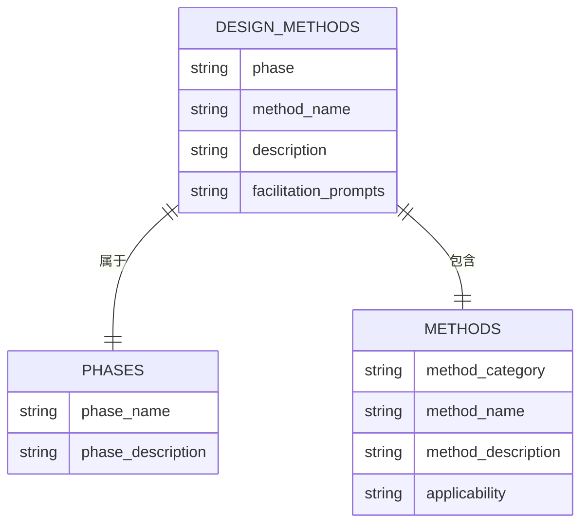

**图表来源**
- [design-methods.csv](file://src/modules/cis/workflows/design-thinking/design-methods.csv#L1-L31)

**章节来源**
- [design-methods.csv](file://src/modules/cis/workflows/design-thinking/design-methods.csv#L1-L31)

## 设计思维五步法详解

### 第一阶段：共情理解（Empathize）

共情阶段是设计思维的核心，要求团队深入理解用户的真实需求和体验：

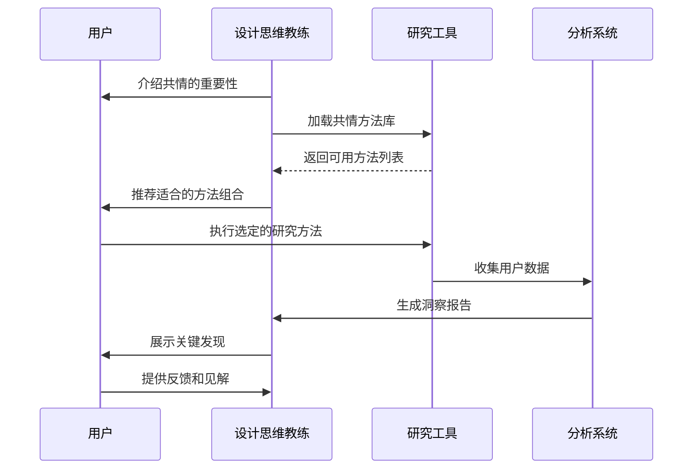

**图表来源**
- [instructions.md](file://src/modules/cis/workflows/design-thinking/instructions.md#L37-L58)

#### 共情方法选择策略

根据不同的项目特征和资源限制，系统会推荐相应的共情方法：

| 方法类别 | 适用场景 | 时间投入 | 用户接触度 | 输出质量 |
|----------|----------|----------|------------|----------|
| 用户访谈 | 新产品概念 | 中等 | 高 | 高 |
| 观察法 | 现有产品改进 | 低 | 中 | 中 |
| 日记研究 | 长期使用模式 | 低 | 中 | 中 |
| 旅程地图 | 复杂用户流程 | 高 | 低 | 高 |
| 同理心地图 | 快速理解 | 低 | 低 | 中 |

### 第二阶段：问题定义（Define）

在收集了充分的用户洞察后，进入问题定义阶段：

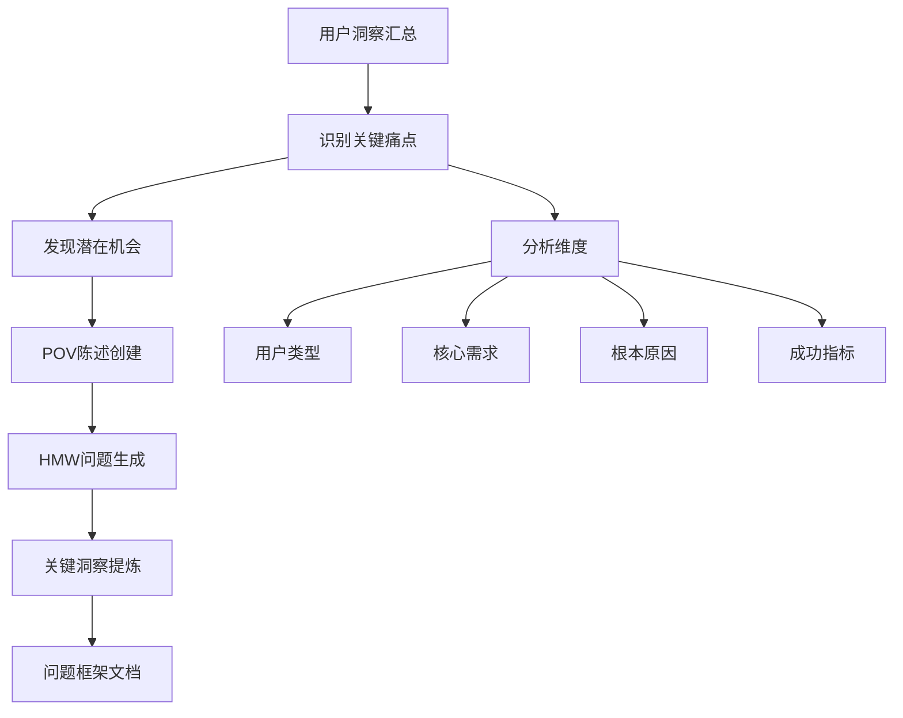

**图表来源**
- [instructions.md](file://src/modules/cis/workflows/design-thinking/instructions.md#L61-L84)

### 第三阶段：创意构思（Ideate）

构思阶段鼓励发散思维，产生大量创新解决方案：

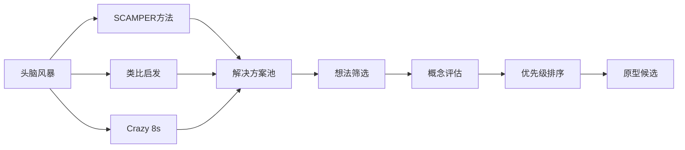

**图表来源**
- [instructions.md](file://src/modules/cis/workflows/design-thinking/instructions.md#L86-L115)

#### 构思方法对比表

| 方法 | 优势 | 劣势 | 适用场景 |
|------|------|------|----------|
| 头脑风暴 | 产生大量想法 | 质量参差不齐 | 初创阶段 |
| SCAMPER | 结构化创新 | 可能受限于现有概念 | 产品改进 |
| 类比启发 | 跨领域创新 | 需要丰富的知识储备 | 突破性创新 |
| Crazy 8s | 快速原型化 | 时间压力大 | 时间紧迫项目 |

### 第四阶段：原型制作（Prototype）

原型阶段将抽象的想法转化为具体的可测试形式：

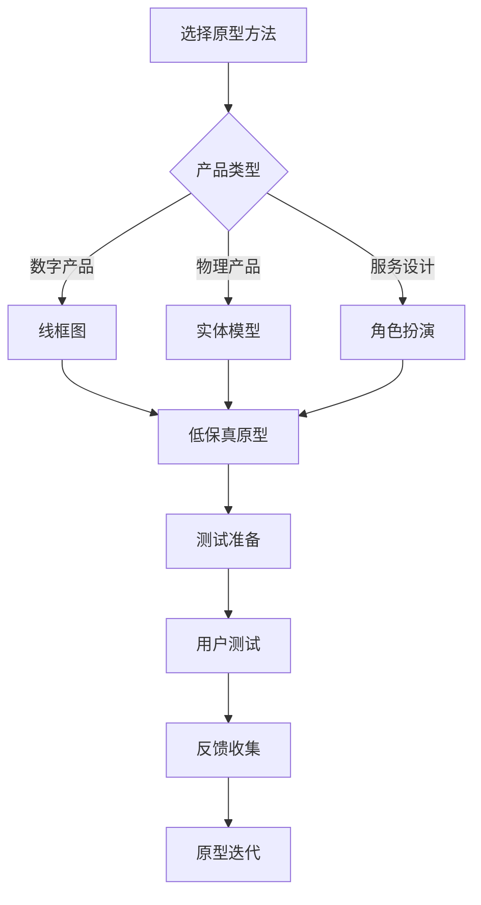

**图表来源**
- [instructions.md](file://src/modules/cis/workflows/design-thinking/instructions.md#L117-L143)

### 第五阶段：测试验证（Test）

测试阶段通过真实用户反馈验证解决方案的有效性：

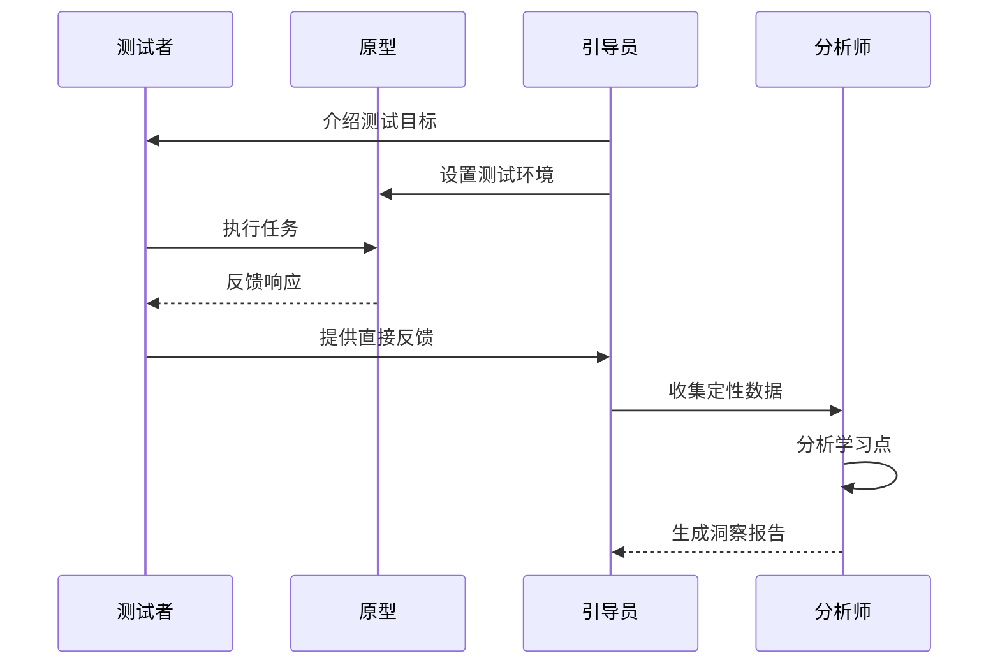

**图表来源**
- [instructions.md](file://src/modules/cis/workflows/design-thinking/instructions.md#L145-L173)

## CSV方法论库分析

### 方法论分类体系

design-methods.csv采用多维分类体系，按阶段、类型和应用场景组织设计方法：

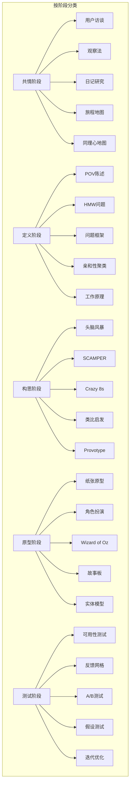

**图表来源**
- [design-methods.csv](file://src/modules/cis/workflows/design-thinking/design-methods.csv#L1-L31)

### 方法论匹配算法

系统根据项目特征自动匹配最适合的设计方法：

| 匹配因素 | 权重 | 评估标准 |
|----------|------|----------|
| 项目类型 | 高 | 数字产品/物理产品/服务设计 |
| 用户接触度 | 中 | 直接用户/间接用户/专家用户 |
| 时间约束 | 高 | 紧急项目/常规项目/长期项目 |
| 资源可用性 | 中 | 预算充足/有限预算/无预算 |
| 团队经验 | 低 | 经验丰富/新手团队/跨学科团队 |

**章节来源**
- [design-methods.csv](file://src/modules/cis/workflows/design-thinking/design-methods.csv#L1-L31)

## 工作流执行机制

### 用户交互流程

工作流采用渐进式交互模式，确保用户充分理解和参与每个阶段：

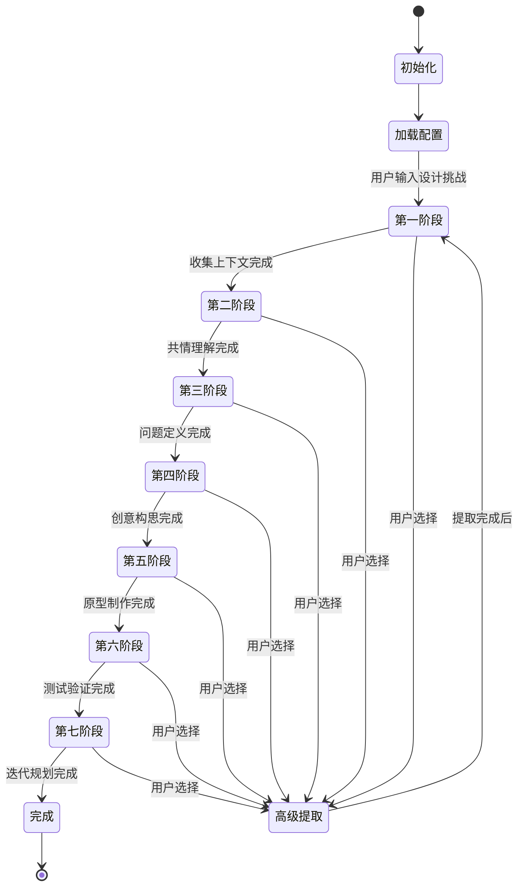

**图表来源**
- [workflow.xml](file://src/core/tasks/workflow.xml#L69-L90)

### 输出文档结构

template.md定义了标准化的输出文档结构，确保每次执行都能生成一致性的设计文档：

| 文档部分 | 占位符 | 内容范围 | 生成时机 |
|----------|--------|----------|----------|
| 封面信息 | project_name, date, user_name | 项目基本信息 | 工作流开始时 |
| 设计挑战 | design_challenge, challenge_statement | 项目目标和挑战 | 第一阶段结束 |
| 共情理解 | user_insights, key_observations, empathy_map | 用户洞察和观察 | 第二阶段结束 |
| 问题定义 | pov_statement, hmw_questions, problem_insights | 问题框架和洞察 | 第三阶段结束 |
| 创意构思 | ideation_methods, generated_ideas, top_concepts | 解决方案和概念 | 第四阶段结束 |
| 原型制作 | prototype_approach, prototype_description, features_to_test | 原型设计和测试计划 | 第五阶段结束 |
| 测试验证 | testing_plan, user_feedback, key_learnings | 测试结果和学习点 | 第六阶段结束 |
| 下一步行动 | refinements, action_items, success_metrics | 迭代计划和成功指标 | 第七阶段结束 |

**章节来源**
- [template.md](file://src/modules/cis/workflows/design-thinking/template.md#L1-L112)

## 最佳实践与集成方式

### 在用户体验设计项目中的最佳实践

#### 1. 项目准备阶段

在启动设计思维工作流之前，建议进行以下准备工作：

- **明确项目目标**：确定设计挑战的具体范围和预期成果
- **组建跨职能团队**：包括设计师、产品经理、开发人员和用户研究人员
- **收集现有资料**：整理已有的用户研究、市场分析和竞争分析
- **设定时间框架**：为每个阶段分配合理的时间预算

#### 2. 方法论应用策略

根据不同项目特点选择合适的方法组合：

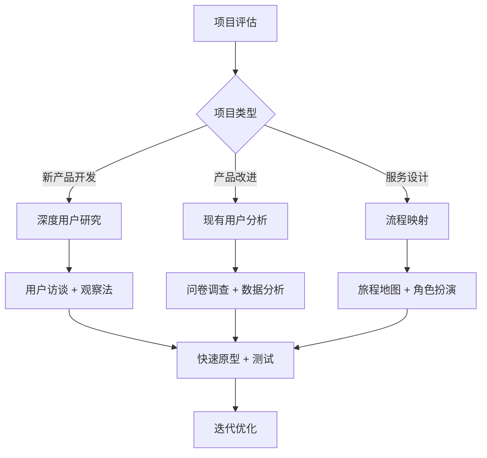

#### 3. 团队协作模式

设计思维工作流支持多种团队协作模式：

| 模式 | 适用场景 | 特点 | 效果 |
|------|----------|------|------|
| 单人主导 | 独立项目 | 个人驱动，效率高 | 快速产出 |
| 小组协作 | 中等复杂度项目 | 分工合作，互补优势 | 平衡质量和效率 |
| 跨部门联合 | 大型复杂项目 | 多视角整合，全面覆盖 | 最高质量保证 |
| 外部咨询 | 专业需求 | 专家指导，外部视角 | 最新方法应用 |

### 与其他工作流的集成

设计思维工作流可以无缝集成到更广泛的BMAD工作流生态系统中：

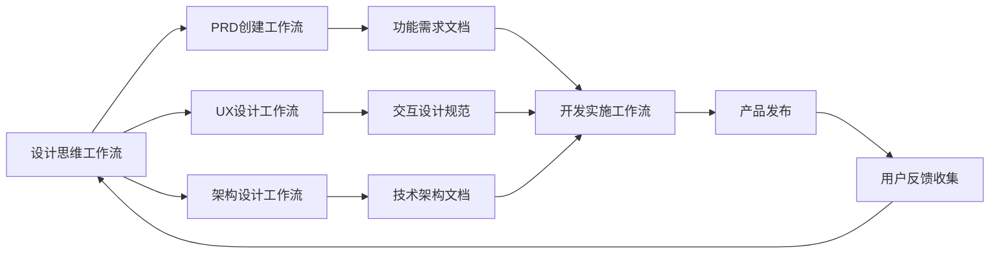

**图表来源**
- [workflow.xml](file://src/core/tasks/workflow.xml#L1-L235)

#### 集成最佳实践

1. **PRD创建工作流集成**
   - 在设计思维工作流完成后，自动触发PRD创建工作流
   - 使用设计思维阶段产生的用户洞察作为PRD的基础
   - 确保设计决策与业务目标的一致性

2. **UX设计工作流集成**
   - 将设计思维阶段的用户洞察直接导入UX设计工作流
   - 利用设计思维产生的概念作为UX设计的起点
   - 实现设计思维与UX设计的无缝衔接

3. **架构设计工作流集成**
   - 基于设计思维阶段的功能需求创建架构文档
   - 确保技术架构支持设计思维阶段提出的功能特性
   - 实现用户体验与技术可行性的平衡

**章节来源**
- [workflow.xml](file://src/core/tasks/workflow.xml#L1-L235)

## 故障排除指南

### 常见问题及解决方案

#### 1. 工作流执行中断

**问题症状**：工作流在某个阶段卡住或无法继续

**可能原因**：
- 配置文件路径错误
- 缺少必要的输入参数
- 文件权限问题
- 系统资源不足

**解决步骤**：
1. 检查workflow.yaml中的路径配置是否正确
2. 验证config_source指向的配置文件是否存在
3. 确认输出目录具有写入权限
4. 检查系统内存和磁盘空间

#### 2. 方法论选择不当

**问题症状**：推荐的设计方法不适合当前项目

**诊断方法**：
- 检查项目类型和约束条件的输入
- 验证设计方法库的完整性
- 确认方法论匹配算法的逻辑

**解决方案**：
- 手动调整方法选择参数
- 更新design-methods.csv文件
- 联系技术支持获取帮助

#### 3. 输出文档格式错误

**问题症状**：生成的文档格式不正确或缺少内容

**排查步骤**：
1. 检查template.md文件的语法
2. 验证占位符的命名一致性
3. 确认输出文件的编码格式

**修复方法**：
- 重新格式化template.md文件
- 检查并修正占位符名称
- 转换文件编码为UTF-8

### 性能优化建议

#### 1. 大型项目的处理策略

对于涉及大量用户数据或复杂分析的大型项目：

- **分阶段执行**：将大型工作流分解为多个小型工作流
- **并行处理**：利用多核处理器同时运行独立的任务
- **缓存机制**：保存中间结果以避免重复计算
- **增量更新**：只处理发生变化的部分

#### 2. 资源使用优化

- **内存管理**：及时释放不再需要的数据结构
- **磁盘I/O优化**：批量处理文件操作
- **网络请求优化**：合并相似的网络请求
- **CPU使用优化**：使用高效的算法和数据结构

**章节来源**
- [workflow.xml](file://src/core/tasks/workflow.xml#L1-L235)

## 结论

设计思维工作流代表了BMAD创意智能套件在用户体验设计领域的创新突破。通过将经典的设计思维五步法与现代AI技术相结合，该工作流为设计师和产品经理提供了一个结构化、可重复且高效的设计方法论。

### 主要优势

1. **系统化设计过程**：从用户研究到原型验证的完整闭环
2. **方法论标准化**：基于CSV的可扩展方法论库
3. **智能化辅助**：AI驱动的指导原则和方法推荐
4. **协作友好**：支持多种团队协作模式
5. **集成性强**：可与其他BMAD工作流无缝集成

### 应用前景

随着AI技术的不断发展，设计思维工作流将在以下方面发挥更大作用：

- **自动化程度提升**：减少人工干预，提高工作效率
- **个性化定制**：根据项目特征自动调整方法组合
- **实时协作**：支持远程团队的实时协作
- **数据分析增强**：利用大数据分析优化设计决策
- **跨平台集成**：与更多设计工具和平台的深度集成

设计思维工作流不仅是一个技术工具，更是推动设计思维普及和标准化的重要载体。它为组织和个人提供了一种科学、系统的方法来解决复杂的用户体验设计问题，最终创造出真正满足用户需求的产品和服务。