# 问题解决

<cite>
**本文档中引用的文件**  
- [solving-methods.csv](file://src/modules/cis/workflows/problem-solving/solving-methods.csv)
- [instructions.md](file://src/modules/cis/workflows/problem-solving/instructions.md)
- [workflow.yaml](file://src/modules/cis/workflows/problem-solving/workflow.yaml)
- [template.md](file://src/modules/cis/workflows/problem-solving/template.md)
- [README.md](file://src/modules/cis/workflows/problem-solving/README.md)
- [create-epics-and-stories/instructions.md](file://src/modules/bmm/workflows/3-solutioning/create-epics-and-stories/instructions.md)
- [create-story/checklist.md](file://src/modules/bmm/workflows/4-implementation/create-story/checklist.md)
- [dev-story/checklist.md](file://src/modules/bmm/workflows/4-implementation/dev-story/checklist.md)
- [sprint-planning/checklist.md](file://src/modules/bmm/workflows/4-implementation/sprint-planning/checklist.md)
- [architecture/workflow.md](file://src/modules/bmm/workflows/3-solutioning/architecture/workflow.md)
</cite>

## 目录
1. [引言](#引言)
2. [问题解决工作流架构](#问题解决工作流架构)
3. [核心组件分析](#核心组件分析)
4. [问题解决工作流步骤详解](#问题解决工作流步骤详解)
5. [与BMM实施阶段的集成](#与bmm实施阶段的集成)
6. [实战演练：故障排除场景](#实战演练故障排除场景)
7. [结论](#结论)

## 引言

问题解决工作流是BMAD方法论中的核心组成部分，旨在通过系统化的方法诊断和解决复杂技术问题。该工作流结合了多种经过验证的分析框架和创造性思维技术，引导用户从问题识别到方案验证的全过程。本技术文档将深入分析该工作流的架构设计，详细描述其如何利用`solving-methods.csv`中的算法和策略库，并说明其如何与BMM（BMAD Methodology）的实施阶段集成，实现从问题发现到代码修复的闭环。

## 问题解决工作流架构

问题解决工作流采用模块化设计，由多个核心组件协同工作。该工作流属于Creative Intelligence System (CIS)模块，通过YAML配置文件定义工作流参数，使用CSV文件存储解决问题的方法库，并通过Markdown模板生成结构化的输出文档。

```mermaid
graph TB
subgraph "问题解决工作流"
A[workflow.yaml] --> B[instructions.md]
A --> C[solving-methods.csv]
A --> D[template.md]
B --> E[执行引擎]
C --> E
D --> E
E --> F[输出: problem-solution-{date}.md]
end
```

**Diagram sources**
- [workflow.yaml](file://src/modules/cis/workflows/problem-solving/workflow.yaml)
- [instructions.md](file://src/modules/cis/workflows/problem-solving/instructions.md)
- [solving-methods.csv](file://src/modules/cis/workflows/problem-solving/solving-methods.csv)
- [template.md](file://src/modules/cis/workflows/problem-solving/template.md)

**Section sources**
- [workflow.yaml](file://src/modules/cis/workflows/problem-solving/workflow.yaml)
- [README.md](file://src/modules/cis/workflows/problem-solving/README.md)

## 核心组件分析

问题解决工作流由四个核心文件组成，每个文件都有明确的职责：

1. **workflow.yaml**: 工作流的配置文件，定义了工作流的元数据、路径和变量引用。
2. **instructions.md**: 详细的执行指南，包含工作流的步骤、原则和模板输出指令。
3. **solving-methods.csv**: 解决问题的方法库，包含多种诊断、分析、综合、评估和实施方法。
4. **template.md**: 输出模板，定义了最终生成文档的结构和格式。

这些组件共同构成了一个完整的系统，确保问题解决过程的系统性和可重复性。

**Section sources**
- [workflow.yaml](file://src/modules/cis/workflows/problem-solving/workflow.yaml)
- [instructions.md](file://src/modules/cis/workflows/problem-solving/instructions.md)
- [solving-methods.csv](file://src/modules/cis/workflows/problem-solving/solving-methods.csv)
- [template.md](file://src/modules/cis/workflows/problem-solving/template.md)

## 问题解决工作流步骤详解

问题解决工作流遵循一个结构化的九步过程，从问题定义到经验总结，确保全面覆盖问题解决的各个方面。

### 问题定义与精炼

工作流的第一步是建立清晰的问题定义。通过引导用户回答一系列问题（如"要解决什么问题？"、"谁遇到这个问题？"、"影响或成本是什么？"），将模糊的抱怨转化为精确的可操作问题陈述。这一步骤参考了`solving-methods.csv`中的"问题陈述精炼"方法，重点关注问题的确切性质、当前状态与期望状态之间的差距以及问题值得解决的原因。

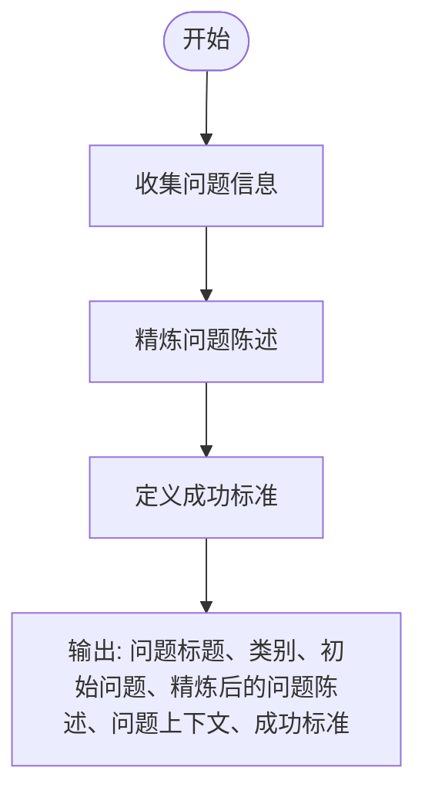

**Diagram sources**
- [instructions.md](file://src/modules/cis/workflows/problem-solving/instructions.md#L21-L47)
- [template.md](file://src/modules/cis/workflows/problem-solving/template.md#L9-L26)

**Section sources**
- [instructions.md](file://src/modules/cis/workflows/problem-solving/instructions.md#L21-L47)

### 问题诊断与边界界定

第二步使用系统诊断方法来理解问题的范围和模式。工作流引导用户通过"是/不是分析"方法，对比问题存在与不存在的地方、时间、受影响人员等，以缩小调查范围并识别出现的模式。这种方法有助于揭示重要的线索，避免在不相关的问题上浪费时间。

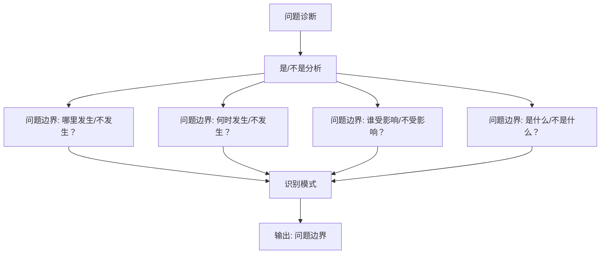

**Diagram sources**
- [instructions.md](file://src/modules/cis/workflows/problem-solving/instructions.md#L49-L62)
- [template.md](file://src/modules/cis/workflows/problem-solving/template.md#L29-L34)

**Section sources**
- [instructions.md](file://src/modules/cis/workflows/problem-solving/instructions.md#L49-L62)

### 根本原因分析

第三步深入挖掘问题的根本原因，而不是仅仅处理症状。工作流从`solving-methods.csv`中选择2-3种适合问题类型的诊断方法，如"五问法根因分析"（适用于线性因果链）、"鱼骨图"（适用于多因素复杂问题）或"系统思维"（适用于相互关联的动态系统）。通过这些方法，逐步钻取到必须解决的根本原因。

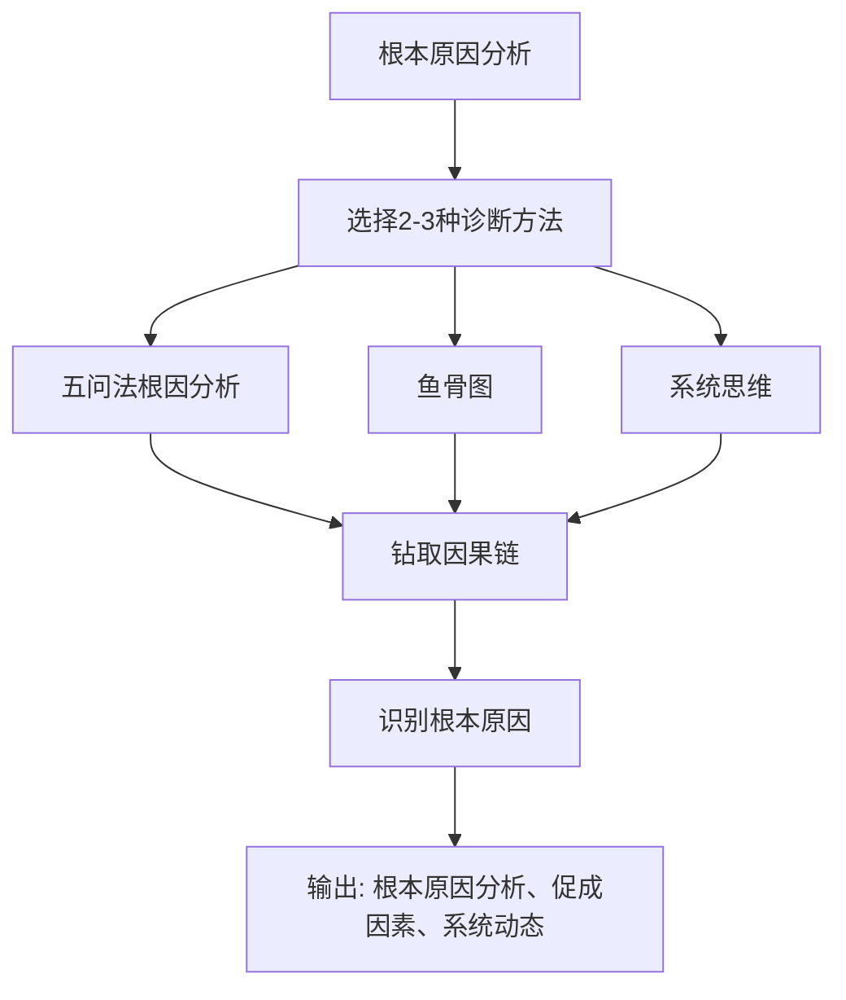

**Diagram sources**
- [solving-methods.csv](file://src/modules/cis/workflows/problem-solving/solving-methods.csv#L2-L6)
- [instructions.md](file://src/modules/cis/workflows/problem-solving/instructions.md#L64-L86)
- [template.md](file://src/modules/cis/workflows/problem-solving/template.md#L35-L46)

**Section sources**
- [solving-methods.csv](file://src/modules/cis/workflows/problem-solving/solving-methods.csv#L2-L6)
- [instructions.md](file://src/modules/cis/workflows/problem-solving/instructions.md#L64-L86)

### 力量与约束分析

第四步分析推动和阻碍解决方案的力量。通过"力场分析"，识别支持解决方案的动力（如动机、资源、支持）和阻碍解决方案的阻力（如惯性、成本、复杂性、政治因素）。同时，通过"约束识别"方法，找出限制解决方案空间的主要瓶颈或约束，区分真实约束和假设约束。

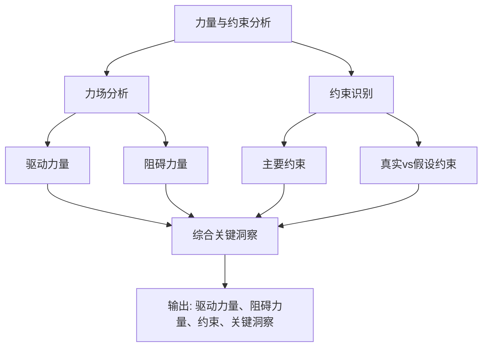

**Diagram sources**
- [solving-methods.csv](file://src/modules/cis/workflows/problem-solving/solving-methods.csv#L7-L10)
- [instructions.md](file://src/modules/cis/workflows/problem-solving/instructions.md#L88-L110)
- [template.md](file://src/modules/cis/workflows/problem-solving/template.md#L49-L65)

**Section sources**
- [solving-methods.csv](file://src/modules/cis/workflows/problem-solving/solving-methods.csv#L7-L10)
- [instructions.md](file://src/modules/cis/workflows/problem-solving/instructions.md#L88-L110)

### 解决方案生成

第五步进入解决方案生成阶段，创建多样化的解决方案替代方案。工作流从`solving-methods.csv`中选择2-4种适合问题背景的创意和系统方法，如"TRIZ矛盾矩阵"、"形态分析"、"横向思维技术"或"假设颠覆"。目标是生成10-15个解决方案想法，包括渐进式和突破性方法，以及挑战假设的"疯狂"想法。

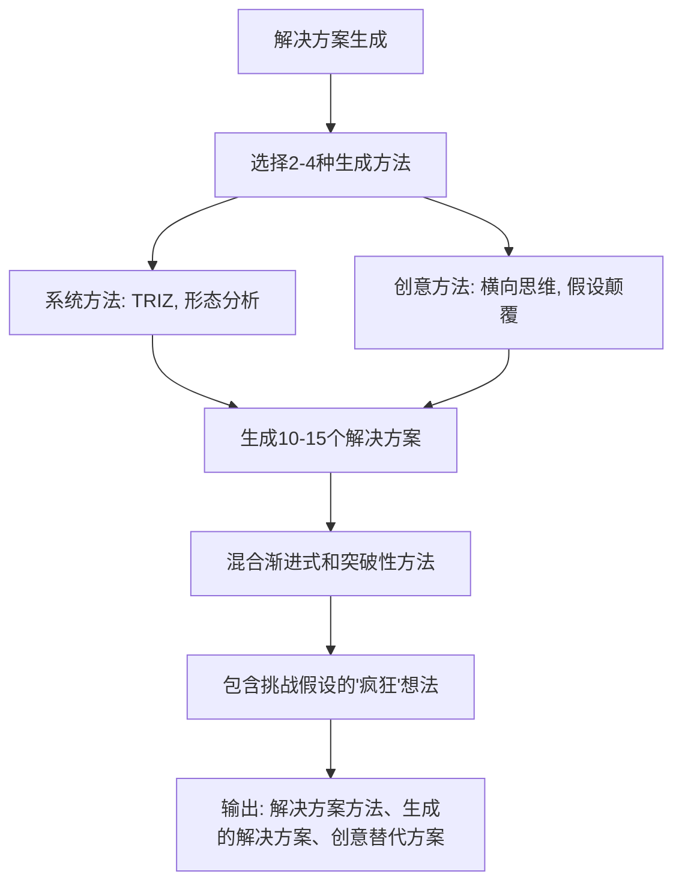

**Diagram sources**
- [solving-methods.csv](file://src/modules/cis/workflows/problem-solving/solving-methods.csv#L12-L16, L27-L31)
- [instructions.md](file://src/modules/cis/workflows/problem-solving/instructions.md#L112-L140)
- [template.md](file://src/modules/cis/workflows/problem-solving/template.md#L69-L82)

**Section sources**
- [solving-methods.csv](file://src/modules/cis/workflows/problem-solving/solving-methods.csv#L12-L16, L27-L31)
- [instructions.md](file://src/modules/cis/workflows/problem-solving/instructions.md#L112-L140)

### 解决方案评估与选择

第六步系统地评估选项以选择最佳方法。工作流与用户合作定义相关的评估标准，如有效性、可行性、成本、时间和风险。然后从`solving-methods.csv`中选择1-2种评估方法，如"决策矩阵"（适用于在多个标准上比较多个选项）、"成本效益分析"（当财务影响是关键时）或"风险评估矩阵"（当风险是主要关注点时）。

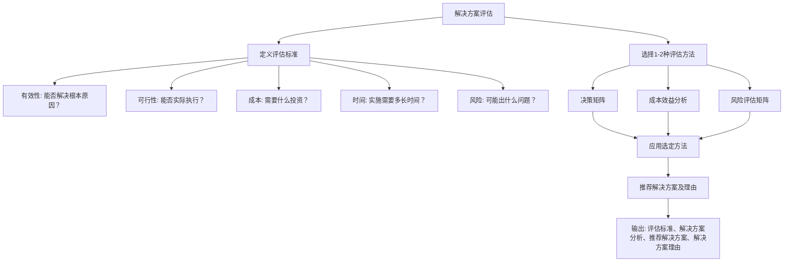

**Diagram sources**
- [solving-methods.csv](file://src/modules/cis/workflows/problem-solving/solving-methods.csv#L17-L21)
- [instructions.md](file://src/modules/cis/workflows/problem-solving/instructions.md#L142-L171)
- [template.md](file://src/modules/cis/workflows/problem-solving/template.md#L85-L102)

**Section sources**
- [solving-methods.csv](file://src/modules/cis/workflows/problem-solving/solving-methods.csv#L17-L21)
- [instructions.md](file://src/modules/cis/workflows/problem-solving/instructions.md#L142-L171)

### 实施计划

第七步创建详细的实施计划，包括明确的行动和责任。工作流定义实施方法（试点、分阶段推出、一次性全面推出），创建包含具体行动步骤、顺序、依赖关系、负责人和所需资源的行动计划。参考`solving-methods.csv`中的"PDCA循环"方法，指导迭代思维。

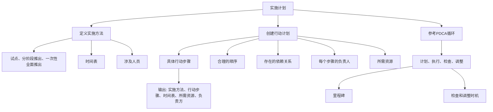

**Diagram sources**
- [solving-methods.csv](file://src/modules/cis/workflows/problem-solving/solving-methods.csv#L22-L26)
- [instructions.md](file://src/modules/cis/workflows/problem-solving/instructions.md#L173-L201)
- [template.md](file://src/modules/cis/workflows/problem-solving/template.md#L105-L126)

**Section sources**
- [solving-methods.csv](file://src/modules/cis/workflows/problem-solving/solving-methods.csv#L22-L26)
- [instructions.md](file://src/modules/cis/workflows/problem-solving/instructions.md#L173-L201)

### 监控与验证

第八步定义如何知道解决方案是否有效以及如果无效该怎么办。创建监控仪表板，定义成功指标、目标或阈值、测量方法和审查频率。计划验证，包括如何验证解决方案的有效性、证明其有效的证据以及需要的试点测试。

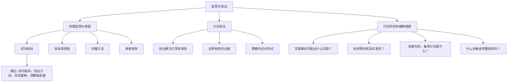

**Diagram sources**
- [instructions.md](file://src/modules/cis/workflows/problem-solving/instructions.md#L203-L234)
- [template.md](file://src/modules/cis/workflows/problem-solving/template.md#L129-L146)

**Section sources**
- [instructions.md](file://src/modules/cis/workflows/problem-solving/instructions.md#L203-L234)

### 经验总结

第九步（可选）反思问题解决过程以改进未来的工作。引导反思：什么工作得好？什么会做得不同？什么见解令人惊讶？出现了什么模式或原则？这有助于持续改进问题解决能力。

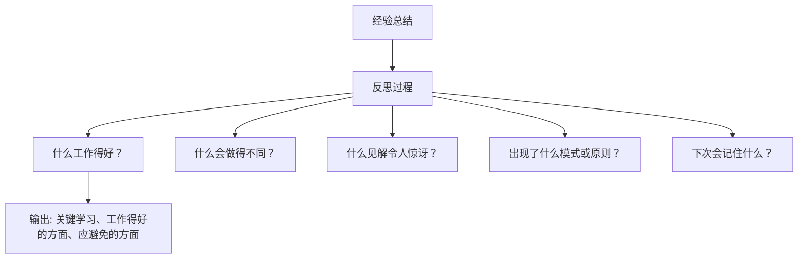

**Diagram sources**
- [instructions.md](file://src/modules/cis/workflows/problem-solving/instructions.md#L236-L250)
- [template.md](file://src/modules/cis/workflows/problem-solving/template.md#L149-L162)

**Section sources**
- [instructions.md](file://src/modules/cis/workflows/problem-solving/instructions.md#L236-L250)

## 与BMM实施阶段的集成

问题解决工作流与BMM（BMAD Methodology）的实施阶段紧密集成，形成从问题发现到代码修复的闭环。这种集成主要通过以下方式实现：

### 从问题解决到史诗和故事创建

问题解决工作流的输出（特别是推荐的解决方案和实施计划）可以直接作为BMM的"3-解决方案"阶段的输入。在`create-epics-and-stories/instructions.md`中，明确要求PRD.md和Architecture.md必须在运行此工作流之前完成，这与问题解决工作流的输出完美匹配。

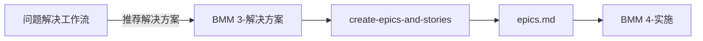

**Diagram sources**
- [instructions.md](file://src/modules/cis/workflows/problem-solving/instructions.md)
- [create-epics-and-stories/instructions.md](file://src/modules/bmm/workflows/3-solutioning/create-epics-and-stories/instructions.md)

**Section sources**
- [create-epics-and-stories/instructions.md](file://src/modules/bmm/workflows/3-solutioning/create-epics-and-stories/instructions.md#L1-L388)

### 实施阶段的质量保证

在BMM的实施阶段，`create-story/checklist.md`和`dev-story/checklist.md`中的检查清单确保了问题解决工作流的输出被正确实施。`create-story/checklist.md`特别强调防止"重新发明轮子"、使用错误的库、错误的文件位置、引入回归、忽略用户体验等灾难。

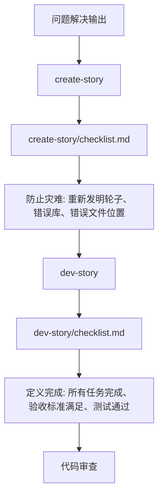

**Diagram sources**
- [create-story/checklist.md](file://src/modules/bmm/workflows/4-implementation/create-story/checklist.md)
- [dev-story/checklist.md](file://src/modules/bmm/workflows/4-implementation/dev-story/checklist.md)

**Section sources**
- [create-story/checklist.md](file://src/modules/bmm/workflows/4-implementation/create-story/checklist.md#L1-L359)
- [dev-story/checklist.md](file://src/modules/bmm/workflows/4-implementation/dev-story/checklist.md#L1-L81)

### 敏捷规划与执行

`sprint-planning/checklist.md`确保问题解决工作流产生的故事被正确地纳入冲刺计划。该检查清单验证每个史诗和故事都出现在`sprint-status.yaml`中，并且没有在史诗文件中不存在的项目。

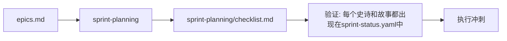

**Diagram sources**
- [sprint-planning/checklist.md](file://src/modules/bmm/workflows/4-implementation/sprint-planning/checklist.md)

**Section sources**
- [sprint-planning/checklist.md](file://src/modules/bmm/workflows/4-implementation/sprint-planning/checklist.md#L1-L34)

## 实战演练：故障排除场景

让我们通过一个具体的故障排除场景来演示问题解决工作流的应用。

### 场景：API性能下降

假设我们遇到一个生产问题：核心API的响应时间从平均200ms增加到2000ms，影响了用户体验。

#### 步骤1：问题定义与精炼

我们首先收集问题信息：
- **问题**：API响应时间从200ms增加到2000ms
- **首次发现**：监控警报在昨天下午3点触发
- **受影响人员**：所有使用API的用户
- **发生时间**：从昨天下午3点开始，持续至今
- **影响**：用户体验严重下降，转化率可能降低
- **成功标准**：API响应时间恢复到200ms以下

通过问题陈述精炼，我们得到精确的问题陈述："自昨天下午3点以来，核心API的平均响应时间从200ms增加到2000ms，影响了所有用户。"

#### 步骤2：问题诊断与边界界定

我们进行"是/不是分析"：
- **哪里发生**：生产环境，特定API端点
- **哪里不发生**：开发和预生产环境，其他API端点
- **何时发生**：从昨天下午3点开始
- **何时不发生**：在此之前
- **谁受影响**：所有用户
- **谁不受影响**：无

模式显示问题与特定API端点和生产环境相关。

#### 步骤3：根本原因分析

我们选择"五问法根因分析"和"系统思维"方法：
- **为什么响应时间增加**？因为数据库查询变慢
- **为什么数据库查询变慢**？因为查询没有使用索引
- **为什么没有使用索引**？因为昨天的部署引入了一个新的查询模式
- **为什么引入了新的查询模式**？因为开发人员没有意识到对性能的影响
- **根本原因**：缺乏对新查询模式的性能影响的评估

#### 步骤4：力量与约束分析

- **驱动力量**：团队有数据库专家，有性能监控工具
- **阻碍力量**：生产数据库不能直接修改，需要变更窗口
- **约束**：必须在下一个变更窗口（明天晚上8点）之前准备好修复

#### 步骤5：解决方案生成

我们生成以下解决方案：
1. 为新查询模式添加数据库索引
2. 优化查询以减少数据库负载
3. 实施缓存层来减轻数据库压力
4. 回滚昨天的部署
5. 在查询前添加性能检查

#### 步骤6：解决方案评估与选择

我们使用决策矩阵评估：
| 解决方案 | 有效性 | 可行性 | 成本 | 时间 | 风险 |
|---------|--------|--------|------|------|------|
| 添加索引 | 高 | 高 | 低 | 低 | 低 |
| 优化查询 | 中 | 中 | 中 | 中 | 中 |
| 实施缓存 | 高 | 低 | 高 | 高 | 高 |
| 回滚部署 | 高 | 高 | 低 | 低 | 中 |
| 性能检查 | 低 | 高 | 低 | 低 | 低 |

我们推荐"添加索引"，因为它在所有标准上都有最佳平衡。

#### 步骤7：实施计划

我们创建实施计划：
- **方法**：在下一个变更窗口（明天晚上8点）添加索引
- **行动步骤**：
  1. 在预生产环境中测试索引
  2. 准备变更请求
  3. 在变更窗口添加索引
  4. 监控性能
- **负责人**：数据库管理员
- **资源**：数据库访问权限，监控工具

#### 步骤8：监控与验证

我们定义监控和验证：
- **成功指标**：API响应时间 < 200ms
- **验证计划**：在添加索引后，运行负载测试
- **风险缓解**：如果索引导致问题，有回滚计划
- **调整触发器**：如果响应时间没有改善，重新评估根本原因

#### 步骤9：经验总结

我们总结经验：
- **工作得好的方面**：快速识别了问题边界和根本原因
- **应避免的方面**：在部署前没有进行性能测试
- **关键学习**：所有数据库查询变更都必须进行性能评估

## 结论

问题解决工作流是一个强大而系统的框架，用于诊断和解决复杂技术问题。通过结合多种经过验证的分析框架和创造性思维技术，它引导用户从问题识别到方案验证的全过程。该工作流与BMM的实施阶段紧密集成，确保问题解决方案能够无缝转化为具体的史诗和故事，并通过严格的质量保证检查清单确保正确实施。通过这种集成，BMAD方法论实现了从问题发现到代码修复的完整闭环，极大地提高了问题解决的效率和质量。