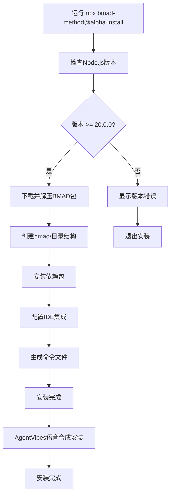
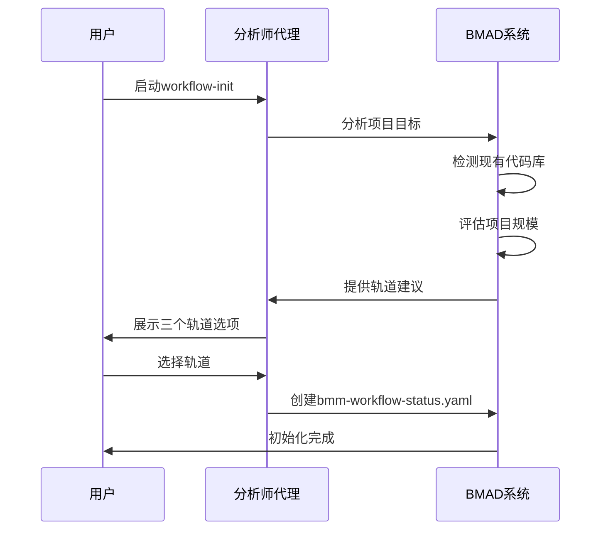

# BMAD-METHOD 快速开始指南

<cite>
**本文档中引用的文件**
- [package.json](file://package.json)
- [README.md](file://README.md)
- [tools/bmad-npx-wrapper.js](file://tools/bmad-npx-wrapper.js)
- [tools/cli/bmad-cli.js](file://tools/cli/bmad-cli.js)
- [tools/cli/commands/install.js](file://tools/cli/commands/install.js)
- [docs/quick-start.zh-CN.md](file://docs/quick-start.zh-CN.md)
- [docs/ide-info/claude-code.md](file://docs/ide-info/claude-code.md)
- [docs/ide-info/cursor.md](file://docs/ide-info/cursor.md)
- [src/modules/bmm/workflows/1-analysis/research/workflow.md](file://src/modules/bmm/workflows/1-analysis/research/workflow.md)
</cite>

## 目录
1. [简介](#简介)
2. [系统要求](#系统要求)
3. [安装过程](#安装过程)
4. [初始化项目](#初始化项目)
5. [基本使用示例](#基本使用示例)
6. [IDE配置指南](#ide配置指南)
7. [常见问题解决](#常见问题解决)
8. [下一步](#下一步)

## 简介

BMAD-METHOD 是一个基于人工智能驱动的敏捷开发方法论，通过19个专业化AI代理和50+个引导式工作流，帮助团队从简单的bug修复到企业级平台开发都能高效协作。本指南将带您在10分钟内完成首次成功运行。

### 核心特性

- **缩放自适应智能** - 从bug修复到企业系统的自动规划深度调整
- **完整的开发生命周期** - 分析 → 规划 → 架构 → 实现
- **专业化专家团队** - 12个专门化的AI代理协同工作
- **证明的方法论** - 基于敏捷最佳实践的AI增强

## 系统要求

### Node.js 版本要求

```bash
# 检查Node.js版本
node --version

# BMAD-METHOD需要 >= 20.0.0
# 推荐使用最新稳定版本
```

### 支持的IDE

- **Claude Code** - 专业AI编程助手
- **Cursor** - AI增强代码编辑器  
- **Windsurf** - AI驱动的代码探索工具
- **VS Code** - 广泛兼容的代码编辑器
- **其他IDE** - 通过插件支持

**节源**
- [package.json](file://package.json#L100-L101)

## 安装过程

### 第一步：使用npx安装

```bash
# 推荐安装v6 Alpha版本（最新功能）
npx bmad-method@alpha install

# 或者安装稳定版v4（生产环境）
npx bmad-method install
```

### 安装过程详解



**图表源**
- [tools/cli/commands/install.js](file://tools/cli/commands/install.js#L1-L125)
- [tools/bmad-npx-wrapper.js](file://tools/bmad-npx-wrapper.js#L1-L39)

### 安装选项

安装程序提供多种选项：

| 选项 | 描述 | 默认值 |
|------|------|--------|
| `--skip-cleanup` | 跳过遗留文件清理 | 否 |
| `--force` | 强制重新安装 | 否 |

### 安装成功标志

安装完成后，您会看到以下输出：

```bash
✨ Installation complete!
BMAD Core and Selected Modules have been installed to: /your/project/path/bmad/
Thank you for helping test the early release version of the new BMad Core and BMad Method!
```

**节源**
- [tools/cli/commands/install.js](file://tools/cli/commands/install.js#L60-L67)

## 初始化项目

### 第一步：加载分析师代理

1. **在IDE中激活分析师代理**
   - **Claude Code**: `/bmad:bmm:agents:analyst`
   - **Cursor**: `@{bmad_folder}/bmm/agents/analyst`
   - **VS Code**: 打开代理文件

2. **等待代理菜单出现**

### 第二步：运行workflow-init

```bash
# 方法1：使用快捷方式
*workflow-init

# 方法2：使用自然语言
"Run workflow-init"

# 方法3：选择菜单项
（选择菜单编号）
```

### workflow-init工作流程



**图表源**
- [src/modules/bmm/workflows/1-analysis/research/workflow.md](file://src/modules/bmm/workflows/1-analysis/research/workflow.md#L1-L199)

### 轨道选择指南

| 轨道 | 适用场景 | 规划深度 | 开始时间 |
|------|----------|----------|----------|
| **快速流** | bug修复、小功能 | 技术规范 | < 5分钟 |
| **BMad Method** | 产品、平台 | PRD + 架构 + UX | < 15分钟 |
| **企业Method** | 合规、大规模 | 完整治理套件 | < 30分钟 |

**节源**
- [docs/quick-start.zh-CN.md](file://docs/quick-start.zh-CN.md#L67-L72)

## 基本使用示例

### 示例1：加载代理并运行简单命令

```bash
# 1. 加载开发代理
@{bmad_folder}/bmm/agents/dev

# 2. 等待菜单出现
# 3. 运行命令
*dev-story  # 开始开发故事
*code-review  # 执行代码审查
```

### 示例2：使用自然语言指令

```bash
# 在任何代理中
"让我们创建一个新的PRD文档"
"请帮我设计系统架构"
"运行sprint-planning工作流"
```

### 示例3：工作流状态查询

```bash
# 查询当前进度
*workflow-status

# 输出示例：
阶段1（分析）完全可选。所有工作流都是可选或推荐的：
  - brainstorm-project - 可选
  - research - 可选
  - product-brief - 推荐（但非必需）

下一个真正必需的步骤是：
  - PRD（产品需求文档）在阶段2 - 计划
  - 代理：pm
  - 命令：prd
```

**节源**
- [docs/quick-start.zh-CN.md](file://docs/quick-start.zh-CN.md#L89-L111)

## IDE配置指南

### Claude Code配置

```bash
# 激活命令格式
/bmad:{module}:{agent}  # 例如：/bmad:bmm:agents:dev
/bmad:{module}:workflows:{workflow}  # 例如：/bmad:bmm:workflows:dev-story
```

**特点：**
- 自动补全命令
- 代理保持活跃直到新对话
- 支持快捷方式（`*command`）

### Cursor配置

```bash
# 引用格式
@{bmad_folder}/{module}/agents/{agent-name}
@{bmad_folder}/{module}  # 包含整个模块
@{bmad_folder}/index  # 所有可用代理
```

**特点：**
- 手动类型规则 - 仅在显式引用时加载
- 无自动上下文污染
- 支持组合多个代理

### Windsurf配置

```bash
# 设置自动执行模式
auto_execution_mode: 3  # 代理推荐
auto_execution_mode: 2  # 任务/工具推荐
auto_execution_mode: 1  # 工作流推荐
```

**节源**
- [docs/ide-info/claude-code.md](file://docs/ide-info/claude-code.md#L1-L26)
- [docs/ide-info/cursor.md](file://docs/ide-info/cursor.md#L1-L26)

## 常见问题解决

### 安装问题

#### 问题1：Node.js版本不兼容

```bash
# 错误信息
Error: BMAD-METHOD requires Node.js >= 20.0.0

# 解决方案
# 升级Node.js到最新版本
nvm install 20
nvm use 20
```

#### 问题2：权限错误

```bash
# 错误信息
Permission denied: /usr/local/bin/bmad

# 解决方案
# 使用sudo或修改权限
sudo chown -R $(whoami) ~/.npm
```

#### 问题3：网络连接问题

```bash
# 错误信息
Network timeout during installation

# 解决方案
# 使用国内镜像源
npm config set registry https://registry.npmmirror.com/
npx bmad-method@alpha install
```

### 使用问题

#### 问题1：代理无法激活

**症状**：代理文件打开后没有反应

**解决方案**：
1. 检查IDE是否支持BMAD格式
2. 确认代理文件路径正确
3. 重启IDE或重新加载代理

#### 问题2：工作流卡住

**症状**：工作流长时间无响应

**解决方案**：
1. **始终使用新聊天** - 每个工作流在新对话中运行
2. 检查代理是否正确激活
3. 确认有足够的上下文空间

#### 问题3：上下文限制

**症状**：代理返回"上下文太长"错误

**解决方案**：
```bash
# 新建聊天窗口
# 重新加载代理
# 重新运行工作流
```

### 性能优化

#### 使用高上下文模型

```bash
# 推荐模型
- Claude Sonnet 4.5
- GPT-4 Turbo
- Gemini Pro
```

#### 最佳实践

1. **每个工作流使用新聊天** - 避免幻觉
2. **及时保存进度** - 使用状态文件跟踪
3. **合理使用文档分片** - 大项目启用

**节源**
- [docs/quick-start.zh-CN.md](file://docs/quick-start.zh-CN.md#L359-L361)

## 下一步

### 学习资源

- **完整文档**：[BMM工作流文档](./README.md#-workflow-guides)
- **视频教程**：[BMad Code YouTube](https://www.youtube.com/@BMadCode)
- **社区支持**：[Discord](https://discord.gg/gk8jAdXWmj)

### 推荐学习路径

1. **熟悉代理** - 了解每个代理的角色和专长
2. **掌握工作流** - 学习核心工作流程的执行
3. **定制化** - 根据团队需求调整配置
4. **扩展应用** - 在实际项目中应用方法论

### 社区参与

- **GitHub Issues**：报告问题、请求功能
- **Discord社区**：获取帮助、分享经验
- **贡献代码**：参与开源项目开发

### 进阶主题

- **代理定制**：修改代理行为和个性
- **自定义工作流**：创建团队专用流程
- **模块开发**：构建领域特定解决方案
- **集成CI/CD**：自动化开发流程

**节源**
- [README.md](file://README.md#L151-L157)

---

通过本指南，您应该能够在10分钟内完成BMAD-METHOD的安装和首次运行。记住使用新聊天进行每个工作流，这样可以获得最佳体验。随着您深入使用，BMAD-METHOD将成为您开发过程中的强大伙伴！