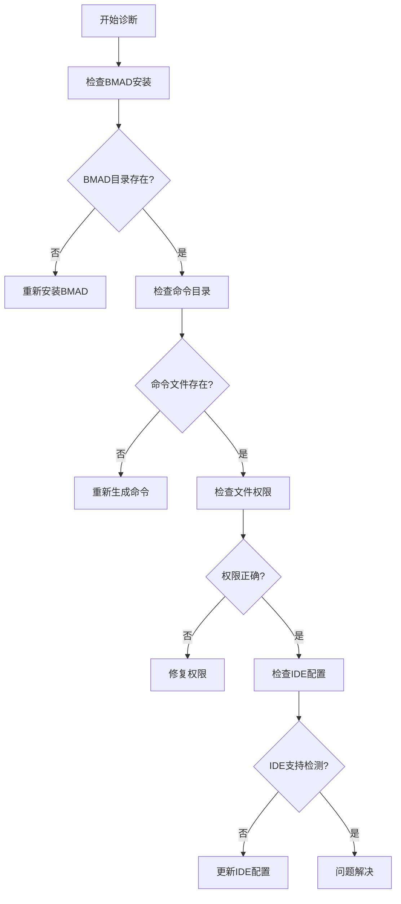
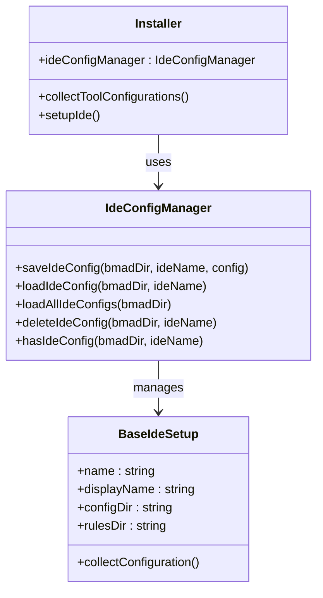
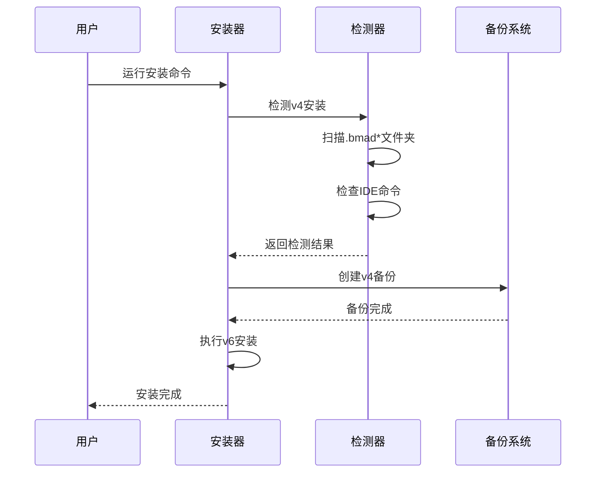
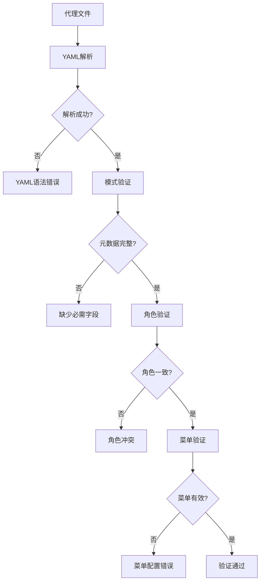
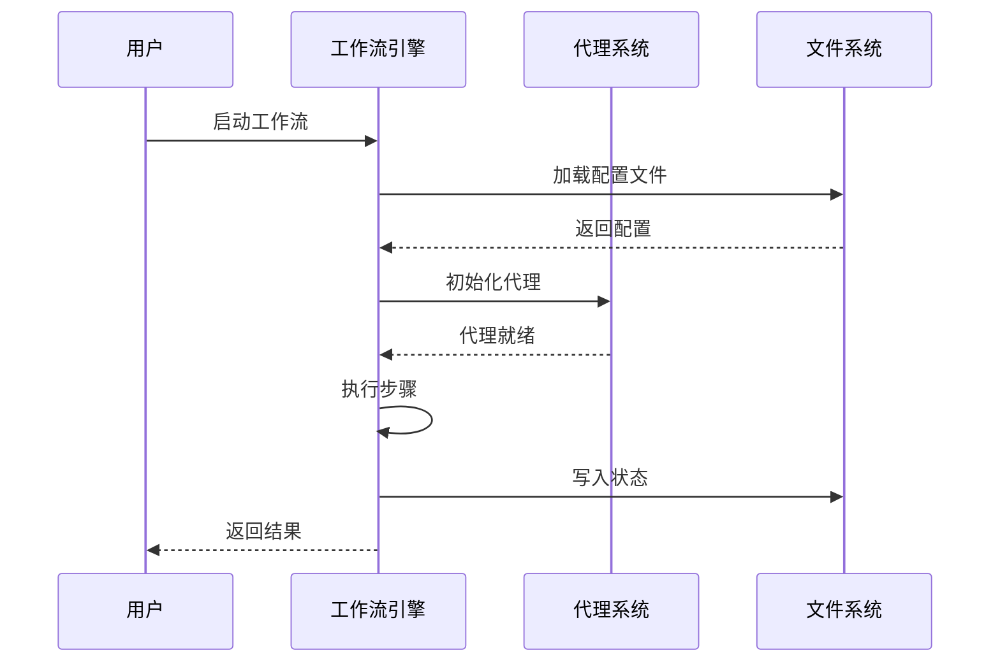

# 故障排除

<cite>
**本文档中引用的文件**
- [README.md](file://README.md)
- [docs/v4-to-v6-upgrade.md](file://docs/v4-to-v6-upgrade.md)
- [tools/validate-agent-schema.js](file://tools/validate-agent-schema.js)
- [tools/schema/agent.js](file://tools/schema/agent.js)
- [test/test-agent-schema.js](file://test/test-agent-schema.js)
- [tools/cli/installers/lib/core/installer.js](file://tools/cli/installers/lib/core/installer.js)
- [tools/cli/lib/ui.js](file://tools/cli/lib/ui.js)
- [src/core/workflows/party-mode/workflow.md](file://src/core/workflows/party-mode/workflow.md)
- [test/fixtures/agent-schema/invalid/yaml-errors/malformed-yaml.agent.yaml](file://test/fixtures/agent-schema/invalid/yaml-errors/malformed-yaml.agent.yaml)
- [test/fixtures/agent-schema/invalid/top-level/missing-agent-key.agent.yaml](file://test/fixtures/agent-schema/invalid/top-level/missing-agent-key.agent.yaml)
- [test/fixtures/agent-schema/invalid/menu/empty-menu.agent.yaml](file://test/fixtures/agent-schema/invalid/menu/empty-menu.agent.yaml)
- [test/fixtures/agent-schema/invalid/metadata/missing-id.agent.yaml](file://test/fixtures/agent-schema/invalid/metadata/missing-id.agent.yaml)
- [test/fixtures/agent-schema/valid/top-level/minimal-core-agent.agent.yaml](file://test/fixtures/agent-schema/valid/top-level/minimal-core-agent.agent.yaml)
- [tools/cli/installers/lib/core/config-collector.js](file://tools/cli/installers/lib/core/config-collector.js)
- [tools/cli/installers/lib/ide/_base-ide.js](file://tools/cli/installers/lib/ide/_base-ide.js)
- [tools/cli/installers/lib/core/ide-config-manager.js](file://tools/cli/installers/lib/core/ide-config-manager.js)
- [tools/cli/installers/lib/core/manifest.js](file://tools/cli/installers/lib/core/manifest.js)
- [docs/ide-info/claude-code.md](file://docs/ide-info/claude-code.md)
</cite>

## 目录
1. [简介](#简介)
2. [常见安装问题](#常见安装问题)
3. [代理加载问题](#代理加载问题)
4. [工作流执行错误](#工作流执行错误)
5. [IDE集成故障](#ide集成故障)
6. [v4到v6升级指南](#v4到v6升级指南)
7. [代理YAML文件验证](#代理yaml文件验证)
8. [调试技巧](#调试技巧)
9. [问题症状到解决方案映射](#问题症状到解决方案映射)
10. [性能优化建议](#性能优化建议)
11. [故障排除工具](#故障排除工具)

## 简介

BMAD-METHOD是一个复杂的AI驱动敏捷开发框架，包含多个模块、代理和工作流。本指南提供了系统性的故障排除方法，帮助用户识别和解决常见的技术问题。

### 故障排除原则

1. **系统性诊断**：按照安装、配置、运行的顺序逐步排查
2. **预防为主**：使用验证工具提前发现问题
3. **分层处理**：从简单到复杂，从表面到根本
4. **记录追踪**：保存错误信息和修复过程

## 常见安装问题

### 权限问题

**症状**：
- 安装过程中出现权限被拒绝错误
- 无法创建目录或写入文件

**诊断步骤**：
```bash
# 检查当前用户权限
ls -la ~/.bmad

# 检查目标目录权限
ls -la /path/to/project
```

**解决方案**：
```bash
# 修改目录权限
chmod -R 755 /path/to/project

# 或者切换到有权限的用户
sudo chown -R $USER:$USER /path/to/project
```

**常见错误码及含义**：
- `EACCES`: 权限不足
- `EPERM`: 操作被禁止
- `ENOENT`: 文件或目录不存在

### 磁盘空间不足

**症状**：
- 安装过程中显示磁盘空间不足
- 部分文件复制失败

**诊断命令**：
```bash
# 检查可用空间
df -h

# 检查特定目录大小
du -sh /path/to/project/.bmad
```

**解决方案**：
- 清理临时文件
- 移除旧的安装备份
- 使用更大的存储设备

### 网络连接问题

**症状**：
- 下载依赖包时超时
- 无法访问远程资源

**诊断方法**：
```bash
# 测试网络连接
ping npmjs.com
curl -I https://registry.npmjs.org/

# 检查代理设置
echo $HTTP_PROXY
echo $HTTPS_PROXY
```

**解决方案**：
- 配置正确的代理服务器
- 使用国内镜像源
- 检查防火墙设置

## 代理加载问题

### YAML语法错误

**症状**：
- 代理文件无法加载
- 显示YAML解析错误

**常见错误类型**：

| 错误类型 | 描述 | 示例 |
|---------|------|------|
| 缩进错误 | YAML对缩进敏感 | 不一致的空格/制表符 |
| 字段缺失 | 必需字段未定义 | 缺少`agent.metadata.id` |
| 类型错误 | 数据类型不匹配 | 字符串值用引号括起来 |
| 格式错误 | 特殊字符处理不当 | 未转义的特殊字符 |

**诊断工具**：
```bash
# 使用内置验证器
node tools/validate-agent-schema.js

# 验证单个文件
node tools/validate-agent-schema.js /path/to/agent.agent.yaml
```

**修复示例**：
```yaml
# 错误的YAML
agent:
  metadata:
    id: test-agent
    name: Test Agent
    title: Test
    icon: 🧪
  persona:
    role: Test
    identity: Test
    communication_style: Test
    principles: - Test principle
  menu: []

# 修复后的YAML
agent:
  metadata:
    id: test-agent
    name: Test Agent
    title: Test
    icon: 🧪
  persona:
    role: Test Agent
    identity: Test Identity
    communication_style: Test Style
    principles:
      - Test Principle
  menu:
    - trigger: help
      description: Show help
      action: display_help
```

### 代理配置错误

**症状**：
- 代理无法正常响应
- 功能异常或返回错误

**检查清单**：
1. **元数据完整性**：确保所有必需字段存在
2. **菜单配置**：验证触发器和动作正确
3. **角色一致性**：检查persona与功能匹配
4. **权限设置**：确认文件权限正确

**验证命令**：
```bash
# 检查代理文件结构
cat /path/to/agent.agent.yaml | grep -E "(metadata|persona|menu)"

# 验证基本语法
python -c "import yaml; print(yaml.safe_load(open('/path/to/agent.agent.yaml')))"
```

## 工作流执行错误

### 工作流状态管理

**症状**：
- 工作流中断后无法恢复
- 状态丢失或损坏

**诊断方法**：
```bash
# 检查工作流状态文件
ls -la /path/to/bmad/_cfg/workflow-manifest.csv

# 查看最近的工作流历史
tail -n 50 /path/to/bmad/_cfg/workflow-manifest.csv
```

**恢复步骤**：
1. 备份当前状态
2. 清理损坏的状态文件
3. 重新初始化工作流

### 资源访问问题

**症状**：
- 无法读取输入文件
- 输出路径不可写

**检查项目**：
- 文件路径是否存在
- 目录权限是否正确
- 磁盘空间是否充足
- 文件格式是否正确

**诊断脚本**：
```bash
#!/bin/bash
# 工作流资源检查脚本

PROJECT_DIR="/path/to/project"
BMAD_DIR="$PROJECT_DIR/.bmad"

echo "检查BMAD安装状态..."
ls -la "$BMAD_DIR"

echo "检查工作流目录..."
ls -la "$BMAD_DIR/_cfg/"

echo "检查文件权限..."
find "$BMAD_DIR" -type f -perm /111 -print
```

### 并发冲突

**症状**：
- 多个工作流同时运行导致冲突
- 资源竞争问题

**解决方案**：
- 实现工作流锁机制
- 使用队列管理系统
- 设置适当的并发限制

## IDE集成故障

### 命令注册失败

**症状**：
- 代理命令无法在IDE中使用
- 命令列表为空

**诊断步骤**：



**图表来源**
- [tools/cli/installers/lib/core/installer.js](file://tools/cli/installers/lib/core/installer.js#L260-L380)
- [tools/cli/lib/ui.js](file://tools/cli/lib/ui.js#L161-L198)

**常见IDE问题**：

| IDE | 常见问题 | 解决方案 |
|-----|----------|----------|
| Claude Code | 命令未显示 | 检查`.claude/commands/bmad/`目录 |
| Cursor | 插件未激活 | 重启IDE并检查插件状态 |
| VS Code | 扩展未安装 | 安装官方BMAD扩展 |

### 配置同步问题

**症状**：
- IDE配置与BMAD不匹配
- 更新后配置丢失

**解决方案**：
```bash
# 重新配置IDE
npx bmad-method install --ide

# 检查配置文件
ls -la ~/.bmad/_cfg/

# 重置配置
rm -rf ~/.bmad/_cfg/ide-configs/
```

**配置管理**：


**图表来源**
- [tools/cli/installers/lib/core/ide-config-manager.js](file://tools/cli/installers/lib/core/ide-config-manager.js#L41-L154)
- [tools/cli/installers/lib/ide/_base-ide.js](file://tools/cli/installers/lib/ide/_base-ide.js#L1-L30)

## v4到v6升级指南

### 升级前准备

**检查清单**：
- [ ] 备份现有项目
- [ ] 记录自定义配置
- [ ] 检查依赖关系
- [ ] 确认系统要求

**自动检测机制**：
BMAD v6安装器会自动检测v4安装并进行迁移：



**图表来源**
- [tools/cli/installers/lib/core/installer.js](file://tools/cli/installers/lib/core/installer.js#L49-L88)
- [docs/v4-to-v6-upgrade.md](file://docs/v4-to-v6-upgrade.md#L9-L28)

### 架构变更

**主要变化**：

| v4 | v6 | 影响 |
|----|----|-----|
| 多个.bmad-*文件夹 | 单一安装目录 | 简化管理 |
| 分离的扩展包 | 统一模块结构 | 更好的依赖管理 |
| 核心文件分散 | 集中化核心 | 提高稳定性 |
| 模块独立部署 | 模块化架构 | 可扩展性增强 |

### 迁移步骤

**1. 自动备份**：
```bash
# v4文件夹会被移动到v4-backup/
ls -la v4-backup/
```

**2. 清理遗留文件**：
```bash
# 手动清理旧的IDE命令文件
rm -rf ~/.claude/commands/.bmad*
rm -rf ~/.cursor/commands/.bmad*
```

**3. 验证迁移**：
```bash
# 检查新安装
ls -la .bmad/
ls -la .bmad/_cfg/
```

**4. 重新配置**：
```bash
# 重新配置IDE集成
npx bmad-method install --ide
```

### 兼容性说明

**已弃用的功能**：
- `.bmad-2d-phaser-game-dev`：集成到BMM
- `.bmad-2d-unity-game-dev`：集成到BMM  
- `.bmad-godot-game-dev`：集成到BMM
- `.bmad-infrastructure-devops`：新DevOps代理即将发布

**新功能特性**：
- BMad Builder模块
- 可视化工作流程
- 更新安全的自定义化
- Web Bundle支持

## 代理YAML文件验证

### 验证工具使用

BMAD提供了专门的代理验证工具：

```bash
# 基本验证
node tools/validate-agent-schema.js

# 验证特定项目
node tools/validate-agent-schema.js /path/to/project

# 详细输出
node tools/validate-agent-schema.js --verbose
```

### 验证规则详解

**核心验证规则**：



**图表来源**
- [tools/schema/agent.js](file://tools/schema/agent.js#L28-L116)
- [tools/validate-agent-schema.js](file://tools/validate-agent-schema.js#L20-L111)

### 常见验证错误

**错误分类**：

| 错误类型 | 错误代码 | 描述 | 示例 |
|---------|----------|------|------|
| 语法错误 | `parse_error` | YAML解析失败 | 缩进错误、格式错误 |
| 结构错误 | `invalid_type` | 数据类型不匹配 | 字符串期望为数字 |
| 内容错误 | `custom` | 业务规则违反 | 触发器格式错误 |
| 必需字段 | `too_small` | 数组长度不足 | menu数组为空 |

**具体错误示例**：

```yaml
# 错误示例1：缺少必需字段
agent:
  metadata:  # 缺少id字段
    name: Test Agent
    title: Test
    icon: 🧪
  # 缺少persona和menu

# 错误示例2：菜单配置错误
menu:
  - trigger: help
    description: Show help
    # 缺少action、workflow等必需字段
```

### 自动修复建议

**语法修复**：
```bash
# 使用YAML验证器
yamllint agent.agent.yaml

# 格式化YAML文件
prettier --write agent.agent.yaml
```

**结构修复**：
```bash
# 使用验证工具生成报告
node tools/validate-agent-schema.js > validation-report.txt
```

## 调试技巧

### 启用详细日志

**环境变量设置**：
```bash
# 启用调试模式
export BMAD_DEBUG=true

# 设置日志级别
export BMAD_LOG_LEVEL=debug

# 输出到文件
export BMAD_LOG_FILE=/tmp/bmad-debug.log
```

**日志分析**：
```bash
# 实时监控日志
tail -f /tmp/bmad-debug.log

# 分析错误模式
grep -i "error\|exception" /tmp/bmad-debug.log
```

### 执行流程分析

**工作流执行跟踪**：


**图表来源**
- [src/core/workflows/party-mode/workflow.md](file://src/core/workflows/party-mode/workflow.md#L1-L208)

### 性能监控

**资源使用监控**：
```bash
# 监控内存使用
ps aux | grep bmad

# 监控CPU使用
top -p $(pgrep -f bmad)

# 监控磁盘I/O
iotop -p $(pgrep -f bmad)
```

**性能分析**：
```bash
# 使用Node.js性能分析器
node --prof tools/cli/bmad-cli.js
```

### 调试工具集合

**内置调试命令**：
```bash
# 检查安装状态
npx bmad-method status

# 验证代理配置
npx bmad-method validate

# 检查IDE集成
npx bmad-method check-ide

# 清理缓存
npx bmad-method cleanup
```

## 问题症状到解决方案映射

### 安装相关问题

| 症状 | 可能原因 | 解决方案 | 预防措施 |
|------|----------|----------|----------|
| 权限被拒绝 | 目录权限不足 | 修改权限或使用sudo | 定期检查权限设置 |
| 网络超时 | 网络连接问题 | 配置代理或更换网络 | 使用稳定的网络环境 |
| 磁盘空间不足 | 存储空间不够 | 清理空间或扩容 | 定期监控磁盘使用 |
| 依赖冲突 | 版本不兼容 | 更新依赖或降级 | 使用版本锁定 |

### 代理相关问题

| 症状 | 可能原因 | 解决方案 | 预防措施 |
|------|----------|----------|----------|
| 代理无法加载 | YAML语法错误 | 使用验证工具修复 | 开发时进行语法检查 |
| 功能异常 | 配置错误 | 检查配置文件 | 使用配置模板 |
| 响应缓慢 | 资源占用过高 | 优化配置或重启 | 监控系统资源 |
| 命令无响应 | 权限或路径问题 | 检查文件权限 | 定期权限检查 |

### 工作流相关问题

| 症状 | 可能原因 | 解决方案 | 预防措施 |
|------|----------|----------|----------|
| 工作流中断 | 状态文件损坏 | 重置状态文件 | 定期备份状态 |
| 输入输出错误 | 路径配置错误 | 检查路径设置 | 使用相对路径 |
| 并发冲突 | 资源竞争 | 实现锁机制 | 控制并发数量 |
| 性能下降 | 资源泄漏 | 重启服务 | 监控资源使用 |

### IDE集成问题

| 症状 | 可能原因 | 解决方案 | 预防措施 |
|------|----------|----------|----------|
| 命令不显示 | 注册失败 | 重新注册命令 | 检查IDE版本兼容性 |
| 配置丢失 | 同步问题 | 重新配置 | 定期备份配置 |
| 插件冲突 | 版本不兼容 | 更新插件 | 使用稳定版本 |
| 性能问题 | 资源占用 | 优化配置 | 监控IDE性能 |

## 性能优化建议

### 系统级优化

**硬件要求**：
- CPU：多核处理器（推荐4核以上）
- 内存：至少8GB RAM
- 存储：SSD硬盘（推荐NVMe）
- 网络：稳定的互联网连接

**操作系统优化**：
```bash
# Linux系统优化
ulimit -n 65536  # 增加文件描述符限制
sysctl vm.swappiness=10  # 减少交换使用

# macOS系统优化
launchctl limit maxfiles 65536 65536
```

### 应用级优化

**内存管理**：
```javascript
// Node.js内存优化
process.env.NODE_OPTIONS = '--max-old-space-size=4096';

// 启用垃圾回收优化
process.on('beforeExit', () => {
  if (global.gc) global.gc();
});
```

**并发控制**：
```javascript
// 工作流并发限制
const MAX_CONCURRENT_WORKFLOWS = 3;

async function runWorkflow(workflow) {
  if (activeWorkflows >= MAX_CONCURRENT_WORKFLOWS) {
    await waitForSlot();
  }
  // 执行工作流...
}
```

### 缓存策略

**文件缓存**：
```javascript
// 代理文件缓存
const agentCache = new Map();

function getCachedAgent(agentId) {
  if (agentCache.has(agentId)) {
    return agentCache.get(agentId);
  }
  
  const agent = loadAgent(agentId);
  agentCache.set(agentId, agent);
  return agent;
}
```

**配置缓存**：
```javascript
// IDE配置缓存
const ideConfigCache = new Map();

function getIdeConfig(ideName) {
  if (ideConfigCache.has(ideName)) {
    return ideConfigCache.get(ideName);
  }
  
  const config = loadIdeConfig(ideName);
  ideConfigCache.set(ideName, config);
  return config;
}
```

## 故障排除工具

### 内置诊断工具

**状态检查**：
```bash
# 检查BMAD状态
npx bmad-method status

# 检查代理健康状况
npx bmad-method health

# 检查依赖完整性
npx bmad-method check-dependencies
```

**验证工具**：
```bash
# 验证代理配置
npx bmad-method validate-agents

# 验证工作流配置
npx bmad-method validate-workflows

# 验证IDE集成
npx bmad-method validate-ide
```

### 第三方工具集成

**代码质量工具**：
```bash
# ESLint代码检查
npx eslint tools/ --ext .js

# Prettier格式化
npx prettier --check tools/

# YAMLLint YAML验证
npx yamllint src/**/*.yaml
```

**性能监控工具**：
```bash
# Node.js性能分析
npx clinic doctor -- node tools/cli/bmad-cli.js

# 内存泄漏检测
npx memwatch-next -- test/

# 性能基准测试
npx benchmark tools/
```

### 自动化故障排除

**故障检测脚本**：
```bash
#!/bin/bash
# BMAD故障排除自动化脚本

echo "=== BMAD故障排除报告 ==="
echo "时间: $(date)"
echo "系统: $(uname -a)"
echo

echo "=== 系统资源 ==="
echo "CPU使用率:"
top -bn1 | grep "Cpu(s)"
echo "内存使用:"
free -h
echo "磁盘空间:"
df -h
echo

echo "=== BMAD状态 ==="
if [ -d ".bmad" ]; then
    echo "BMAD安装: ✓"
    echo "版本: $(cat .bmad/_cfg/manifest.yaml | grep version | head -1)"
else
    echo "BMAD安装: ✗"
fi
echo

echo "=== 代理健康检查 ==="
node tools/validate-agent-schema.js

echo "=== 日志分析 ==="
if [ -f "/tmp/bmad-debug.log" ]; then
    echo "错误统计:"
    grep -c "ERROR" /tmp/bmad-debug.log
    echo "警告统计:"
    grep -c "WARN" /tmp/bmad-debug.log
fi
```

**监控告警系统**：
```javascript
// 故障监控系统
class BMADMonitor {
  constructor() {
    this.alerts = [];
    this.metrics = {
      memoryUsage: 0,
      cpuUsage: 0,
      diskSpace: 100,
      agentCount: 0
    };
  }
  
  checkSystemHealth() {
    // 检查内存使用
    const memory = process.memoryUsage();
    if (memory.heapUsed > 0.8 * memory.heapTotal) {
      this.alerts.push('内存使用率过高');
    }
    
    // 检查CPU使用
    const cpu = process.cpuUsage();
    if (cpu.user > 500000) { // 500ms
      this.alerts.push('CPU使用率过高');
    }
    
    // 检查磁盘空间
    const df = require('child_process').execSync('df -h').toString();
    if (df.includes('90%')) {
      this.alerts.push('磁盘空间不足');
    }
  }
  
  sendAlerts() {
    if (this.alerts.length > 0) {
      console.log('🚨 BMAD系统告警:');
      this.alerts.forEach(alert => console.log(`- ${alert}`));
      this.alerts = [];
    }
  }
}
```

### 社区支持资源

**官方资源**：
- [GitHub Issues](https://github.com/bmad-code-org/BMAD-METHOD/issues) - 报告bug和请求功能
- [Discord社区](https://discord.gg/gk8jAdXWmj) - 实时技术支持
- [YouTube频道](https://www.youtube.com/@BMadCode) - 视频教程和演示

**文档资源**：
- [快速开始指南](file://README.md#L49-L82)
- [v4到v6升级指南](file://docs/v4-to-v6-upgrade.md#L1-L228)
- [IDE集成指南](file://docs/ide-info/claude-code.md#L1-L26)

**最佳实践**：
1. 定期备份重要配置
2. 保持系统和依赖最新
3. 使用版本控制系统管理自定义配置
4. 建立监控和告警机制
5. 制定应急响应计划

通过遵循本故障排除指南，用户可以有效地识别、诊断和解决BMAD-METHOD使用过程中遇到的各种问题，确保系统的稳定运行和高效开发体验。