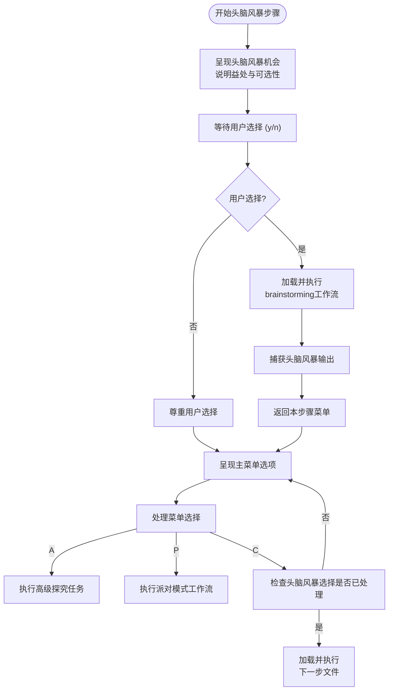

# 代理与工作流

<cite>
**本文档中引用的文件**  
- [bmad-master.agent.yaml](file://src/core/agents/bmad-master.agent.yaml)
- [step-01-brainstorm.md](file://src/modules/bmb/workflows/create-agent/steps/step-01-brainstorm.md)
- [step-02-discover.md](file://src/modules/bmb/workflows/create-agent/steps/step-02-discover.md)
- [step-03-persona.md](file://src/modules/bmb/workflows/create-agent/steps/step-03-persona.md)
- [step-04-commands.md](file://src/modules/bmb/workflows/create-agent/steps/step-04-commands.md)
- [workflow.md](file://src/modules/bmb/workflows/create-agent/workflow.md)
- [brainstorm-context.md](file://src/modules/bmb/workflows/create-agent/data/brainstorm-context.md)
- [communication-presets.csv](file://src/modules/bmb/workflows/create-agent/data/communication-presets.csv)
- [step-05-name.md](file://src/modules/bmb/workflows/create-agent/steps/step-05-name.md)
- [step-06-build.md](file://src/modules/bmb/workflows/create-agent/steps/step-06-build.md)
- [step-07-validate.md](file://src/modules/bmb/workflows/create-agent/steps/step-07-validate.md)
- [step-08-setup.md](file://src/modules/bmb/workflows/create-agent/steps/step-08-setup.md)
- [step-09-customize.md](file://src/modules/bmb/workflows/create-agent/steps/step-09-customize.md)
</cite>

## 目录
1. [引言](#引言)
2. [代理详解](#代理详解)
   1. [代理定义与核心概念](#代理定义与核心概念)
   2. [YAML配置结构](#yaml配置结构)
   3. [角色设定系统](#角色设定系统)
   4. [指令集与菜单命令](#指令集与菜单命令)
3. [工作流详解](#工作流详解)
   1. [工作流执行机制](#工作流执行机制)
   2. [头脑风暴工作流示例](#头脑风暴工作流示例)
4. [代理与工作流的协同模式](#代理与工作流的协同模式)
5. [自定义代理与工作流](#自定义代理与工作流)
6. [性能优化与调试技巧](#性能优化与调试技巧)

## 引言

在BMAD-METHOD框架中，代理（Agent）和工作流（Workflow）是构建智能自动化系统的核心组件。代理是具备特定角色、知识和能力的智能实体，能够理解上下文并执行任务；工作流则是由多个有序步骤组成的执行流程，用于引导复杂任务的完成。本文档将深入探讨这两个关键概念，从基础定义到高级应用，为开发者提供全面的指导。通过分析`bmad-master.agent.yaml`等核心配置文件，我们将揭示如何定义代理的个性、能力与行为，并通过`create-agent`工作流等实例，展示工作流如何分步引导任务执行。无论是初学者还是高级用户，都能从中获得构建高效、可靠智能系统的知识与技巧。

## 代理详解

### 代理定义与核心概念

在BMAD-METHOD框架中，代理（Agent）被定义为一个具备特定领域知识、角色和行为模式的智能软件实体。它不仅仅是一个简单的脚本或函数，而是一个拥有“人格”的虚拟专家，能够根据其设定的角色、身份、沟通风格和原则来响应用户请求并执行任务。代理的核心在于其“人格”（Persona）系统，该系统通过四个关键字段来塑造其独特性：角色（Role）、身份（Identity）、沟通风格（Communication_Style）和原则（Principles）。这四个字段共同作用，决定了代理如何理解世界、如何与用户互动以及如何做出决策。

代理的运作依赖于一个结构化的YAML配置文件，该文件定义了其所有属性和能力。例如，`bmad-master.agent.yaml`文件中的`persona`部分明确指定了该代理的角色为“Master Task Executor + BMad Expert + Guiding Facilitator Orchestrator”，这定义了它的核心功能。其身份描述了它作为“BMAD Core Platform和所有加载模块的专家级知识库”的背景，这赋予了它权威性。沟通风格被设定为“直接且全面，以第三人称自称”，这决定了它的表达方式。最后，其原则如“在运行时加载资源，从不预加载，并始终呈现编号列表供选择”，则为其行为提供了指导方针。这种人格化的设计使得代理不再是冷冰冰的工具，而是能够提供一致、可预测且富有个性的交互体验的智能伙伴。

**Section sources**
- [bmad-master.agent.yaml](file://src/core/agents/bmad-master.agent.yaml#L11-L23)
- [step-03-persona.md](file://src/modules/bmb/workflows/create-agent/steps/step-03-persona.md#L70-L93)

### YAML配置结构

代理的配置完全基于YAML（YAML Ain't Markup Language）格式，这是一种人类可读的数据序列化语言，非常适合用于配置文件。一个典型的代理YAML文件包含几个核心部分：`metadata`、`persona`、`critical_actions`、`menu`和`prompts`。`metadata`部分定义了代理的基本信息，如唯一ID、名称、标题和图标。`persona`部分是代理人格的核心，如上所述，包含角色、身份、沟通风格和原则。

`critical_actions`部分定义了代理在激活时必须立即执行的关键操作，这些操作通常涉及加载配置、设置环境变量或建立上下文。例如，`bmad-master.agent.yaml`中的关键操作包括加载核心配置文件并设置`project_name`、`output_folder`等变量，确保代理从一开始就拥有正确的运行环境。`menu`部分定义了用户可以与代理交互的命令菜单，每个菜单项都有一个`trigger`（触发词）、一个`action`或`exec`（执行动作）以及一个`description`（描述）。`action`通常用于执行简单的指令，而`exec`则用于加载并执行另一个工作流文件。最后，`prompts`部分可以包含预定义的提示词，用于引导代理在特定情境下的响应，尽管在`bmad-master`代理中此部分为空，表明其行为主要由其人格和菜单驱动。

**Section sources**
- [bmad-master.agent.yaml](file://src/core/agents/bmad-master.agent.yaml#L4-L39)
- [step-04-commands.md](file://src/modules/bmb/workflows/create-agent/steps/step-04-commands.md#L112-L125)

### 角色设定系统

代理的角色设定系统是其行为的基石。如`step-03-persona.md`文件中所强调的，角色（Role）回答了“代理做什么”这个问题。它被LLM解释为“我拥有哪些知识、技能和能力？”。一个清晰、专业的角色定义是代理有效工作的前提。例如，在创建新代理的工作流中，系统会引导用户将代理的核心能力提炼成一个1-2行的专业头衔，如“战略业务分析师+需求专家”或“代码审查专家”。

这个角色必须与代理的其他人格字段保持清晰的界限。身份（Identity）回答“代理是谁”，它建立代理的背景和可信度，例如“拥有8年以上连接市场洞察与战略经验的高级分析师”。沟通风格（Communication_Style）回答“代理如何说话”，它规定了代理的语言模式和语调，例如“像硬汉侦探一样说话，充满怀疑和智慧”。原则（Principles）则回答“什么指导代理的决策”，它们是代理的信念和行动准则，例如“每个业务挑战都有根本原因。让发现基于证据”。这四个字段的分离确保了代理的人格是结构化且无冲突的，避免了角色与身份的混淆或沟通风格与原则的混合。

**Section sources**
- [step-03-persona.md](file://src/modules/bmb/workflows/create-agent/steps/step-03-persona.md#L70-L93)
- [brainstorm-context.md](file://src/modules/bmb/workflows/create-agent/data/brainstorm-context.md#L13-L37)

### 指令集与菜单命令

代理的指令集通过其`menu`部分实现，这是一个用户与代理交互的主要界面。每个菜单项都由一个`trigger`（触发词）激活。在BMAD-METHOD中，触发词通常采用kebab-case（短横线分隔）命名法，如`list-tasks`或`party-mode`，这保证了命名的一致性和可读性。当用户输入`*`时，代理会显示其所有可用的菜单选项。

菜单项的执行方式有两种：`action`和`exec`。`action`字段用于执行直接的、内联的指令，例如`bmad-master`代理的`list-tasks`命令会直接执行一个指令来列出所有任务。`exec`字段则用于启动更复杂的工作流，它会加载并执行一个指定的`.md`工作流文件。例如，`party-mode`命令通过`exec`字段加载并执行`{project-root}/{bmad_folder}/core/workflows/party-mode/workflow.md`，从而启动一个涉及多个代理的群聊会话。这种设计将简单的命令与复杂的工作流解耦，使得代理既能快速响应简单查询，又能协调执行多步骤的复杂任务。

**Section sources**
- [bmad-master.agent.yaml](file://src/core/agents/bmad-master.agent.yaml#L25-L37)
- [step-01-brainstorm.md](file://src/modules/bmb/workflows/create-agent/steps/step-01-brainstorm.md#L108-L110)

## 工作流详解

### 工作流执行机制

工作流（Workflow）是BMAD-METHOD中用于管理复杂、多步骤任务的执行框架。其核心架构是“分步文件架构”（step-file architecture），如`create-agent/workflow.md`文件所述。这种架构将一个完整的工作流分解为多个独立的、自包含的步骤文件（如`step-01-brainstorm.md`、`step-02-discover.md`等）。每个步骤文件都包含该步骤的完整指令、规则和上下文，确保了执行的纪律性和可维护性。

工作流的执行是严格顺序且条件化的。系统会按顺序加载并执行每个步骤文件，但只有在用户明确选择“继续”（C）时，才会加载下一个步骤。这种“仅在需要时加载”（Just-In-Time Loading）的模式确保了内存效率，并强制执行了步骤的顺序。每个步骤文件都遵循一套严格的执行协议，包括必须完整阅读文件、按顺序执行指令、在菜单处暂停等待用户输入等。这种设计防止了步骤的跳过或优化，保证了流程的完整性和可靠性。工作流的成功完成依赖于用户在每个步骤中做出明确的选择，系统通过菜单（如[A]高级探究 [P]派对模式 [C]继续）来引导用户进行决策。

**Section sources**
- [workflow.md](file://src/modules/bmb/workflows/create-agent/workflow.md#L17-L45)
- [step-01-brainstorm.md](file://src/modules/bmb/workflows/create-agent/steps/step-01-brainstorm.md#L64-L123)

### 头脑风暴工作流示例

以`create-agent`工作流中的第一步`step-01-brainstorm.md`为例，可以清晰地看到工作流的执行机制。该步骤的目标是为创建新代理提供一个可选的头脑风暴环节。其执行流程是高度结构化的：首先，向用户呈现头脑风暴的益处和可选性；然后，等待用户明确回答“是”或“否”；最后，根据用户的回答执行不同的路径。

如果用户选择“是”，工作流会加载并执行`{brainstormWorkflow}`（即`brainstorming/workflow.md`），并将`{brainstormContext}`作为上下文数据传递进去。这展示了工作流如何通过`exec`指令来调用其他工作流，实现功能的模块化和复用。如果用户选择“否”，则直接跳过此步骤。在整个过程中，系统会反复显示一个菜单选项（[A]高级探究 [P]派对模式 [C]继续），允许用户在任何时候中断主流程去执行其他任务，但只有当用户选择“C”时，才会真正进入下一个步骤。这种设计既保证了流程的引导性，又给予了用户充分的控制权和灵活性。

**Diagram sources**
- [step-01-brainstorm.md](file://src/modules/bmb/workflows/create-agent/steps/step-01-brainstorm.md#L66-L123)

## 代理与工作流的协同模式

代理与工作流的协同是BMAD-METHOD框架的核心动力。它们之间的关系是动态且互补的：代理是执行者，而工作流是指挥者。这种协同模式主要体现在三个方面：调用、参数传递和上下文管理。

首先，代理通过其`menu`中的`exec`指令来调用工作流。例如，`bmad-master`代理的`party-mode`菜单项直接调用`party-mode/workflow.md`。这使得代理能够将复杂的、多步骤的任务委托给专门设计的工作流来处理，从而保持了代理自身配置的简洁性。其次，参数传递通过YAML文件中的变量替换机制实现。在`step-01-brainstorm.md`中，`{brainstormContext}`和`{brainstormWorkflow}`等占位符会在运行时被实际的文件路径替换，从而将上下文数据和目标工作流传递给被调用的工作流。最后，上下文管理是通过工作流的分步执行和状态保存来完成的。每个步骤都会将用户的输入和决策结果保存到输出文件（如`{outputFile}`）中，这些文件作为上下文被后续步骤读取，确保了整个流程的状态连续性和信息一致性。这种协同模式使得系统能够处理从简单查询到复杂项目创建的广泛任务。

**Section sources**
- [bmad-master.agent.yaml](file://src/core/agents/bmad-master.agent.yaml#L34-L36)
- [step-01-brainstorm.md](file://src/modules/bmb/workflows/create-agent/steps/step-01-brainstorm.md#L91-L95)
- [step-02-discover.md](file://src/modules/bmb/workflows/create-agent/steps/step-02-discover.md#L165)

## 自定义代理与工作流

创建自定义代理和工作流是BMAD-METHOD框架的核心功能。`create-agent`工作流提供了一个完整的、交互式的向导，引导用户从零开始构建一个符合BMAD标准的代理。该过程始于可选的头脑风暴，然后通过一系列步骤系统地确定代理的目的、类型、人格、能力、名称，并最终生成YAML配置文件。

关键字段的使用方法如下：`persona`字段用于定义代理的四个核心人格维度，确保其行为的一致性。`prompts`字段可以包含复杂的提示词，用于引导代理在特定场景下的深度思考，尽管在许多核心代理中它可能为空。`menu`字段是用户交互的入口，通过定义清晰的`trigger`和`action/exec`来构建代理的能力集。`actions`字段（在`critical_actions`中）则用于定义代理启动时必须执行的初始化操作。整个创建过程是高度协作的，系统作为“代理架构师”引导用户进行发现，而不是直接生成内容。例如，在`step-04-commands.md`中，系统会引导用户将自然语言描述的能力转化为结构化的YAML命令，并规划工作流集成。最终，`step-06-build.md`会根据所有收集到的信息生成完整的YAML文件，`step-07-validate.md`会进行质量检查，确保其符合所有技术标准。

**Section sources**
- [workflow.md](file://src/modules/bmb/workflows/create-agent/workflow.md#L9-L25)
- [step-04-commands.md](file://src/modules/bmb/workflows/create-agent/steps/step-04-commands.md#L72-L85)
- [step-06-build.md](file://src/modules/bmb/workflows/create-agent/steps/step-06-build.md#L98-L114)
- [step-07-validate.md](file://src/modules/bmb/workflows/create-agent/steps/step-07-validate.md#L70-L97)

## 性能优化与调试技巧

为了确保代理和工作流的高效与稳定，开发者应遵循一系列性能优化和调试技巧。对于初学者，核心建议是遵循框架的约定和最佳实践。例如，在定义`persona`时，务必保持四个字段的分离，避免将沟通风格与角色混合。在创建`menu`时，使用清晰、一致的kebab-case触发词，并确保每个命令都有明确的描述。

对于高级用户，性能优化的关键在于理解工作流的“分步文件架构”。避免在单个步骤中塞入过多逻辑，而应将其分解为更小、更专注的步骤，这有助于提高可读性和可维护性。在调试时，应充分利用工作流中的“系统成功/失败指标”（SYSTEM SUCCESS/FAILURE METRICS）。这些指标为每个步骤定义了明确的成功和失败标准，是验证流程正确性的黄金准则。例如，在`step-03-persona.md`中，系统失败的条件包括“混合人格字段”或“沟通风格过长”，这为调试提供了精确的检查点。此外，利用`party-mode`工作流进行多代理协作调试，或使用`advanced-elicitation`任务进行深度探究，都是有效的高级调试技巧。始终记住，框架的“禁止跳过步骤”规则是保证系统可靠性的基石，任何优化都不应以牺牲流程完整性为代价。

**Section sources**
- [step-03-persona.md](file://src/modules/bmb/workflows/create-agent/steps/step-03-persona.md#L240-L260)
- [step-07-validate.md](file://src/modules/bmb/workflows/create-agent/steps/step-07-validate.md#L212-L234)
- [step-01-brainstorm.md](file://src/modules/bmb/workflows/create-agent/steps/step-01-brainstorm.md#L139-L145)