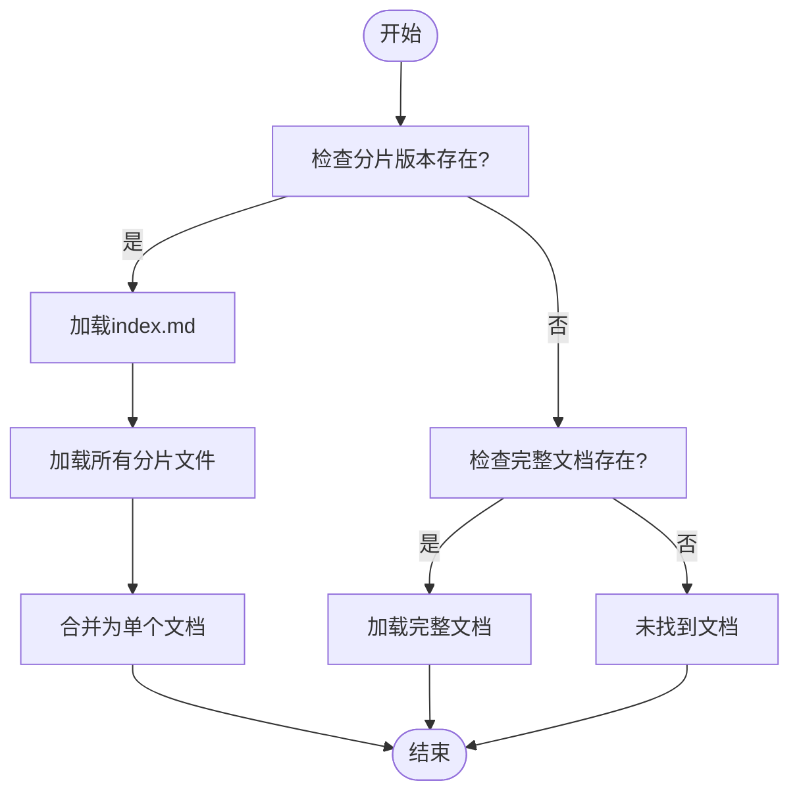
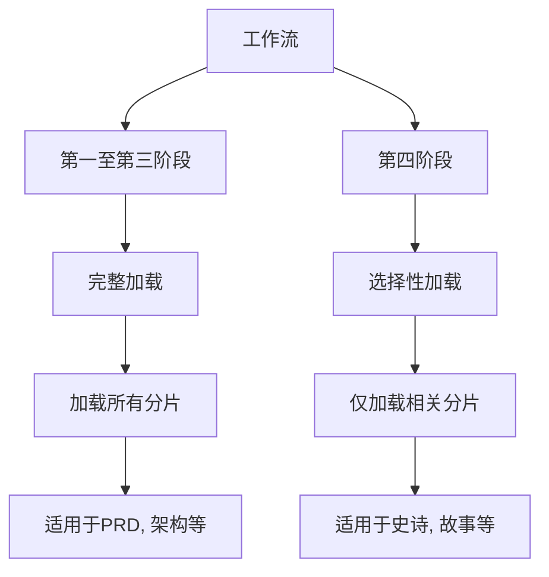
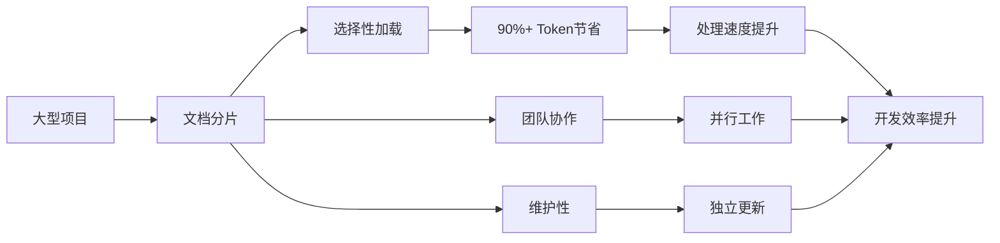

# 文档分片

<cite>
**本文档中引用的文件**  
- [document-sharding-guide.md](file://docs/document-sharding-guide.md)
- [shard-doc.xml](file://src/core/tools/shard-doc.xml)
- [workflow.xml](file://src/core/tasks/workflow.xml)
- [create-epics-and-stories/workflow.yaml](file://src/modules/bmm/workflows/3-solutioning/create-epics-and-stories/workflow.yaml)
- [sprint-planning/workflow.yaml](file://src/modules/bmm/workflows/4-implementation/sprint-planning/workflow.yaml)
- [code-review/workflow.yaml](file://src/modules/bmgd/workflows/4-production/code-review/workflow.yaml)
- [glossary.md](file://src/modules/bmm/docs/glossary.md)
- [ci-burn-in.md](file://src/modules/bmm/testarch/knowledge/ci-burn-in.md)
</cite>

## 目录
1. [引言](#引言)
2. [文档分片技术概述](#文档分片技术概述)
3. [分片策略与边界检测](#分片策略与边界检测)
4. [shard-doc工具的工作原理](#shard-doc工具的工作原理)
5. [上下文保留机制](#上下文保留机制)
6. [工作流中的实际应用](#工作流中的实际应用)
7. [性能数据与最佳实践](#性能数据与最佳实践)
8. [大型项目开发效率提升](#大型项目开发效率提升)
9. [结论](#结论)

## 引言

文档分片技术是BMad方法论中用于管理大型规划和架构文档的核心机制。该技术通过将大型Markdown文件分解为基于二级标题（`## Heading`）的较小文件，实现了对大型代码库和文档集的高效处理。文档分片不仅解决了大型文档处理中的性能瓶颈问题，还为AI代理提供了更精细的上下文管理能力。在大型项目开发中，文档分片技术能够显著提升处理速度和准确性，为项目文档生成和代码理解任务提供了强有力的支持。

**文档分片技术概述**
- [document-sharding-guide.md](file://docs/document-sharding-guide.md#what-is-document-sharding)

## 文档分片技术概述

文档分片技术是一种将大型文档分解为可管理片段的方法，旨在优化AI代理对大型代码库和文档集的处理效率。该技术通过将大型Markdown文件按二级标题分割为多个独立文件，同时生成包含文档结构和描述的索引文件，实现了文档的组织化管理。

文档分片的主要优势包括：
- **选择性加载**：工作流可以仅加载所需的部分，避免加载整个大型文档
- **减少Token使用**：对于大型项目可实现显著的效率提升
- **更好的组织性**：基于逻辑部分的文件结构
- **保持上下文**：索引文件保留了原始文档的结构信息

文档分片适用于大型多史诗项目，如包含多个系统层的大型复杂PRD、架构文档或包含4个以上史诗的史诗文件。当文档超过20k tokens时建议考虑分片，超过40k tokens时强烈推荐，超过60k tokens时对效率至关重要。

**文档分片技术概述**
- [document-sharding-guide.md](file://docs/document-sharding-guide.md#what-is-document-sharding)
- [glossary.md](file://src/modules/bmm/docs/glossary.md#shard--sharding)

## 分片策略与边界检测

文档分片技术采用基于二级标题的分片策略，通过精确的边界检测规则确保文档内容的完整性和逻辑性。分片过程以二级标题（`##`）作为主要分割点，将大型文档分解为多个独立的文件。

分片策略的核心原则包括：
- **分片时机**：在规划阶段完成后进行分片，避免对正在进行的文档进行分片
- **标题组织**：保持二级标题的良好组织，使用描述性的部分名称
- **分片时机**：在第四阶段实施前进行分片
- **备份策略**：最初保留原始文件作为备份

边界检测规则确保了分片的准确性和有效性。系统通过识别Markdown文档中的二级标题来确定分片边界，每个二级标题及其后续内容构成一个独立的分片文件。这种基于语义边界的检测方法确保了每个分片都包含完整的逻辑单元。

不推荐分片的情况包括：正在进行的工作文档、每日更新的文档以及需要整体上下文的文档。此外，对于小于10k tokens的文档或单史诗项目，分片可能不会带来显著的效率提升。

**分片策略与边界检测**
- [document-sharding-guide.md](file://docs/document-sharding-guide.md#when-to-use-sharding)
- [document-sharding-guide.md](file://docs/document-sharding-guide.md#best-practices)

## shard-doc工具的工作原理

shard-doc工具是文档分片技术的核心实现，通过`npx @kayvan/markdown-tree-parser`命令将大型Markdown文档自动按二级标题分割并生成索引。该工具的工作流程包括五个关键步骤：

1. **获取源文档**：用户指定要分片的文档路径，工具验证文件存在且为Markdown格式
2. **确定目标文件夹**：默认目标为源文件所在位置，文件夹名称为源文件名（不含.md扩展名）
3. **执行分片**：运行`npx @kayvan/markdown-tree-parser explode [source-document] [destination-folder]`命令
4. **验证输出**：检查目标文件夹是否包含分片文件，验证index.md是否创建
5. **报告完成**：向用户显示完成报告，包括源文档路径、目标文件夹路径、创建的文件数量等信息

工具的XML配置文件定义了详细的执行流程和关键上下文。`<critical-context>`标签明确指出使用`npx @kayvan/markdown-tree-parser`工具自动按二级标题分片并生成索引。执行流程严格按照顺序进行，任何步骤失败都会立即停止并显示错误信息。

分片完成后，工具会提示用户处理原始文档，提供删除、移动到归档或保留的选项。强烈建议删除或归档原始文档，因为同时保留原始和分片版本会违背分片的目的并造成混淆。

**shard-doc工具的工作原理**
- [shard-doc.xml](file://src/core/tools/shard-doc.xml)
- [document-sharding-guide.md](file://docs/document-sharding-guide.md#using-the-shard-doc-tool)

## 上下文保留机制

文档分片技术通过智能的上下文保留机制确保分片后的文档仍能保持完整的语义和结构信息。核心机制是生成`index.md`文件，该文件包含所有分片的目录结构和描述，使工作流能够理解文档的整体架构。

上下文保留机制的关键组件包括：
- **索引文件**：`index.md`文件包含所有分片的链接和描述，保持了原始文档的结构
- **双重发现系统**：BMad工作流使用双重发现系统，首先尝试加载整个文档，如果不存在则检查分片版本
- **优先级规则**：当同时存在完整文档和分片版本时，优先使用完整文档

工作流通过`input_file_patterns`配置实现智能文件发现。例如，在`create-epics-and-stories`工作流中，配置了PRD、架构和UX设计文档的输入模式，支持完整文档和分片版本的自动检测。

**Diagram sources**
- [document-sharding-guide.md](file://docs/document-sharding-guide.md#workflow-support)
- [workflow.xml](file://src/core/tasks/workflow.xml#discover_inputs)

**Section sources**
- [document-sharding-guide.md](file://docs/document-sharding-guide.md#workflow-support)
- [workflow.xml](file://src/core/tasks/workflow.xml#discover_inputs)

## 工作流中的实际应用

文档分片技术在BMad方法论的工作流中得到了广泛应用，特别是在项目文档生成和代码理解任务中发挥了关键作用。不同阶段的工作流采用不同的加载策略，以优化处理效率。

### 第一至第三阶段（完整加载）

在第一至第三阶段，工作流采用完整加载策略，加载整个分片文档。这些工作流包括：
- `product-brief`：研究和头脑风暴文档
- `prd`：产品简报和研究
- `gdd`：游戏简报和研究
- `create-ux-design`：PRD、简报和架构（如果可用）
- `tech-spec`：简报和研究
- `architecture`：PRD和UX设计（如果可用）
- `create-epics-and-stories`：PRD和架构
- `implementation-readiness`：所有规划文档

### 第四阶段（选择性加载）

在第四阶段，工作流采用选择性加载策略，仅加载所需的部分。这种策略在处理大型项目时可实现90%以上的Token节省。例如，在`sprint-planning`工作流中，需要加载所有史诗以构建完整状态，而在`epic-tech-context`、`create-story`、`story-context`和`code-review`工作流中，仅加载相关史诗。

**Diagram sources**
- [document-sharding-guide.md](file://docs/document-sharding-guide.md#workflow-support)
- [create-epics-and-stories/workflow.yaml](file://src/modules/bmm/workflows/3-solutioning/create-epics-and-stories/workflow.yaml)
- [sprint-planning/workflow.yaml](file://src/modules/bmm/workflows/4-implementation/sprint-planning/workflow.yaml)

**Section sources**
- [document-sharding-guide.md](file://docs/document-sharding-guide.md#workflow-support)
- [create-epics-and-stories/workflow.yaml](file://src/modules/bmm/workflows/3-solutioning/create-epics-and-stories/workflow.yaml)
- [sprint-planning/workflow.yaml](file://src/modules/bmm/workflows/4-implementation/sprint-planning/workflow.yaml)

## 性能数据与最佳实践

文档分片技术在实际应用中展现了显著的性能优势。对于包含15个史诗的大型项目，45k tokens的PRD文档经过分片后，架构工作流和UX设计工作流可以仅加载所需的部分，实现显著的Token节省。

### 性能数据

- **大型PRD示例**：15史诗项目，45k tokens的PRD文档
  - 分片前：每个工作流加载整个45k tokens的PRD
  - 分片后：工作流可选择性加载特定部分
  - 结果：大型需求文档的显著Token减少

- **史诗文件分片示例**：8个史诗，35k tokens总计
  - 处理史诗5的故事时：
    - 旧方式：加载所有8个史诗（35k tokens）
    - 新方式：仅加载epic-5.md（4k tokens）
    - 节省：88%的减少

- **架构文档示例**：多层系统架构，28k tokens
  - 代码审查工作流可以引用特定的架构层，而无需加载整个架构文档

### 最佳实践

**分片策略**：
- ✅ 在规划阶段完成后进行分片
- ✅ 保持二级标题的良好组织
- ✅ 使用描述性的部分名称
- ✅ 在第四阶段实施前进行分片
- ✅ 最初保留原始文件作为备份

**命名约定**：
- 良好的部分名称：`## Epic 1: User Authentication`、`## Technical Requirements`、`## System Architecture`
- 不良的部分名称：`## Section 1`、`## Part A`、`## Details`

**文件管理**：
- 当文档发生重大结构性变化、添加/删除主要部分或重大重构后，需要重新分片
- 更新分片文档时，可以直接编辑各个部分文件，或编辑原始文件后删除分片文件夹并重新分片
- 不要手动编辑index.md

**Section sources**
- [document-sharding-guide.md](file://docs/document-sharding-guide.md#examples)
- [document-sharding-guide.md](file://docs/document-sharding-guide.md#best-practices)

## 大型项目开发效率提升

文档分片技术对大型项目开发效率的提升是显著的。通过将大型文档分解为可管理的片段，该技术解决了AI代理处理大型代码库和文档集时的性能瓶颈问题。

在大型项目中，文档分片技术通过选择性加载机制实现了巨大的效率提升。例如，在处理包含10个史诗的项目时，选择性加载可实现90%以上的Token节省。这种效率提升不仅减少了处理时间，还降低了计算资源的消耗。

文档分片技术还促进了团队协作。不同的团队成员可以同时处理不同的文档部分，而不会产生冲突。此外，分片后的文档更容易维护和更新，因为每个部分都是独立的文件。

在测试环境中，文档分片技术同样展现了其价值。通过将测试分片并并行执行，可以显著缩短测试时间。例如，在CI/CD管道中，测试可以分为4个分片并行运行，目标是每个分片的执行时间少于10分钟。

**Diagram sources**
- [document-sharding-guide.md](file://docs/document-sharding-guide.md#examples)
- [ci-burn-in.md](file://src/modules/bmm/testarch/knowledge/ci-burn-in.md)

**Section sources**
- [document-sharding-guide.md](file://docs/document-sharding-guide.md#examples)
- [ci-burn-in.md](file://src/modules/bmm/testarch/knowledge/ci-burn-in.md)

## 结论

文档分片技术是BMad方法论中的一项关键创新，通过将大型文档分解为基于二级标题的可管理片段，实现了对大型代码库和文档集的高效处理。该技术不仅解决了AI代理处理大型文档时的性能瓶颈，还为项目文档生成和代码理解任务提供了强有力的支持。

通过shard-doc工具的自动化处理，文档分片变得简单高效。智能的上下文保留机制确保了分片后的文档仍能保持完整的语义和结构信息。在实际工作流中，不同阶段采用不同的加载策略，第一至第三阶段采用完整加载，第四阶段采用选择性加载，实现了处理效率的最优化。

性能数据显示，文档分片技术在大型项目中可实现88%以上的Token节省，显著提升了处理速度和开发效率。最佳实践指南为正确使用该技术提供了明确的指导，包括分片时机、命名约定和文件管理策略。

文档分片技术对大型项目开发效率的提升是全方位的，不仅减少了处理时间和计算资源消耗，还促进了团队协作和文档维护。作为可选但强大的工具，文档分片技术在需要为大型项目提高效率时具有重要价值。