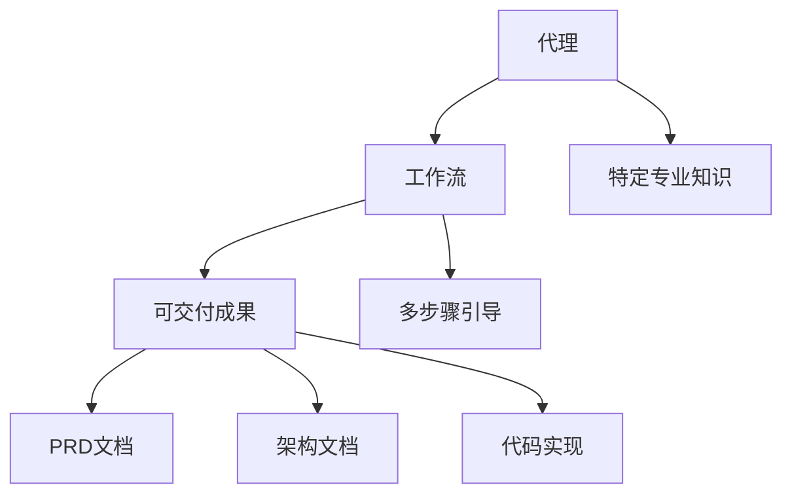
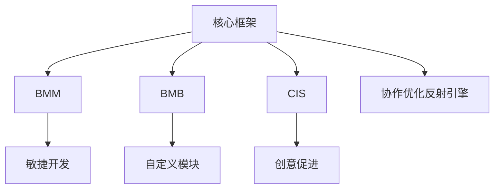
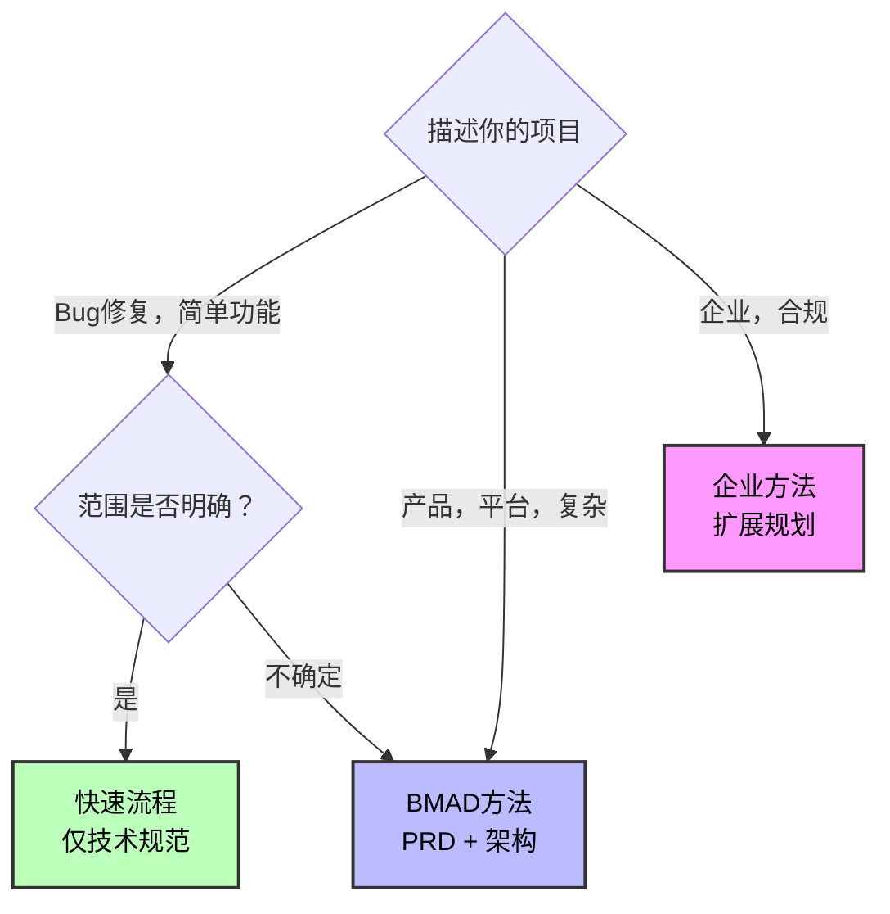
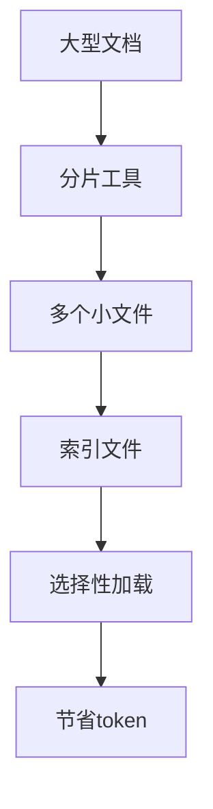
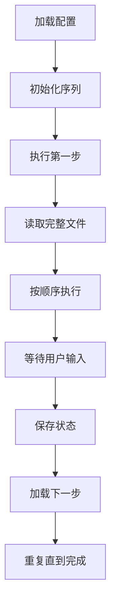

# 核心概念

<cite>
**本文档引用的文件**   
- [bmad-master.agent.yaml](file://src/core/agents/bmad-master.agent.yaml)
- [architect.agent.yaml](file://src/modules/bmm/agents/architect.agent.yaml)
- [dev.agent.yaml](file://src/modules/bmm/agents/dev.agent.yaml)
- [research.workflow.md](file://src/modules/bmm/workflows/1-analysis/research/workflow.md)
- [prd.workflow.md](file://src/modules/bmm/workflows/2-plan-workflows/prd/workflow.md)
- [architecture.workflow.md](file://src/modules/bmm/workflows/3-solutioning/architecture/workflow.md)
- [shard-doc.xml](file://src/core/tools/shard-doc.xml)
- [scale-adaptive-system.md](file://src/modules/bmm/docs/scale-adaptive-system.md)
- [glossary.md](file://src/modules/bmm/docs/glossary.md)
- [commit-poet.agent.yaml](file://custom/src/agents/commit-poet/commit-poet.agent.yaml)
- [toolsmith.agent.yaml](file://custom/src/agents/toolsmith/toolsmith.agent.yaml)
- [architecture.md](file://src/modules/bmb/docs/workflows/architecture.md)
</cite>

## 目录
1. [代理与工作流](#代理与工作流)
2. [模块化设计原则](#模块化设计原则)
3. [规模自适应智能](#规模自适应智能)
4. [文档分片技术](#文档分片技术)
5. [代理配置示例](#代理配置示例)
6. [工作流执行示例](#工作流执行示例)

## 代理与工作流

在BMAD-METHOD框架中，代理（Agent）和工作流（Workflow）是构成开发框架的两个核心概念。代理是具有特定专业知识的AI角色，而工作流是指导用户完成特定任务的多步骤引导过程。

代理是专门的AI角色，每个代理都有特定的专业知识和角色。例如，架构师代理（Architect）是系统架构和技术设计领导者，具有分布式系统、云基础设施和API设计方面的专业知识。开发代理（Dev）是高级软件工程师，负责执行已批准的故事，严格遵守验收标准。BMad Master代理是核心系统代理，负责任务执行和资源管理，作为BMAD操作的主要执行引擎。

工作流是多步骤的引导过程，用于协调AI代理活动以产生特定的可交付成果。工作流是交互式的，并根据用户上下文进行调整。例如，研究工作流（Research Workflow）通过当前网络数据和验证来源进行全面的市场、技术或领域研究。PRD工作流（PRD Workflow）通过协作的逐步发现过程创建全面的产品需求文档。

代理和工作流之间的关系是协同的。代理通过工作流菜单项触发工作流的执行。例如，架构师代理的菜单中包含"create-architecture"触发器，执行架构工作流。这种设计确保了代理可以引导用户通过复杂的开发过程，同时保持对特定任务的专注。



**图示来源**
- [bmad-master.agent.yaml](file://src/core/agents/bmad-master.agent.yaml)
- [architect.agent.yaml](file://src/modules/bmm/agents/architect.agent.yaml)
- [dev.agent.yaml](file://src/modules/bmm/agents/dev.agent.yaml)

**本节来源**
- [bmad-master.agent.yaml](file://src/core/agents/bmad-master.agent.yaml#L1-L40)
- [architect.agent.yaml](file://src/modules/bmm/agents/architect.agent.yaml#L1-L53)
- [dev.agent.yaml](file://src/modules/bmm/agents/dev.agent.yaml#L1-L45)

## 模块化设计原则

BMAD-METHOD采用模块化设计原则，将框架划分为核心框架、BMM、BMB和CIS模块，每个模块都有明确的职责划分。

核心框架（Core Framework）是BMAD方法的基础，提供通用的协作优化反射引擎（CORE）。它包含核心代理、任务和工作流，为整个系统提供基础支持。核心框架中的BMad Master代理负责任务执行和资源管理，是所有模块的协调中心。

BMAD Method模块（BMM）是AI驱动敏捷开发的核心编排系统，提供通过专门代理和工作流进行的全面生命周期管理。BMM包含12个专门的AI代理，如项目经理、架构师、开发人员、UX设计师等，以及34个工作流，覆盖分析、规划、解决方案和实施四个阶段。

BMAD Builder模块（BMB）是创建、定制和扩展BMAD组件的专用工具和工作流，包括代理、工作流和完整模块。BMB允许用户创建从简单代理到复杂模块的任何内容，为法律、医疗、金融、教育等领域的特定解决方案构建专门的AI团队。

创意智能套件（CIS）是通过专家教练在五个专门领域（头脑风暴、设计思维、问题解决、创新战略和讲故事）中转变战略思维的AI驱动创意促进工具。CIS提供150多种创意技术，帮助用户进行创新和战略思考。



**图示来源**
- [README.md](file://README.md#L29-L37)
- [bmm/README.md](file://src/modules/bmm/README.md#L1-L129)
- [bmb/README.md](file://src/modules/bmb/README.md#L1-L262)
- [cis/README.md](file://src/modules/cis/README.md#L1-L154)

**本节来源**
- [README.md](file://README.md#L29-L37)
- [bmm/README.md](file://src/modules/bmm/README.md#L1-L129)
- [bmb/README.md](file://src/modules/bmb/README.md#L1-L262)
- [cis/README.md](file://src/modules/cis/README.md#L1-L154)

## 规模自适应智能

规模自适应智能是BMAD-METHOD的核心特性，它能够根据项目复杂性自动调整工作流，从快速修复到企业级系统。

传统的开发方法对每个项目应用相同的流程，导致bug修复需要完整的设计文档，而企业级系统却以最小的规划构建。BMAD-METHOD通过三种不同的规划轨道解决了这个问题：快速流程（Quick Flow）、BMAD方法（BMAD Method）和企业方法（Enterprise Method）。

快速流程适用于简单的功能、bug修复和范围明确的变更。它采用技术规范规划，实施立即进行，通常涉及1-15个故事。BMAD方法适用于产品、平台和复杂功能，采用PRD+架构的结构化方法，通常涉及10-50+个故事。企业方法适用于企业需求、合规性、多租户系统，采用包含安全/运维/测试的扩展规划，通常涉及30+个故事。

当用户运行`workflow-init`时，系统会分析项目描述中的复杂性指标，并建议适当的轨道。系统会展示所有三个轨道，包括时间投入、规划方法、收益和权衡、AI代理支持水平和具体示例，然后提供基于复杂性关键词、绿场与棕场、用户描述的诚实建议。最终由用户选择适合其情况的轨道。



**图示来源**
- [scale-adaptive-system.md](file://src/modules/bmm/docs/scale-adaptive-system.md#L43-L57)

**本节来源**
- [scale-adaptive-system.md](file://src/modules/bmm/docs/scale-adaptive-system.md#L1-L619)
- [glossary.md](file://src/modules/bmm/docs/glossary.md#L30-L32)

## 文档分片技术

文档分片技术是BMAD-METHOD处理大型代码库的关键技术，它通过将大型规划文档分割成较小的基于部分的文件来优化运行时LLM效率。

对于运行时LLM优化，文档分片技术将大型规划文档（PRD、史诗、架构）分割成较小的基于部分的文件。第1-3阶段的工作流透明地加载整个分片文档，而第4阶段的工作流则选择性地只加载所需的部分，从而实现巨大的token节省。

分片工具`shard-doc.xml`使用`@kayvan/markdown-tree-parser`工具自动按二级标题分割文档并生成索引。该工具首先获取源文档，然后确定目标文件夹，执行分片命令，验证输出，报告完成情况，并处理原始文档。

分片技术在CI/CD管道中也有应用，通过并行分片执行测试，将测试分成N个并行作业以实现更快的执行。例如，在GitHub Actions中，可以通过矩阵策略将测试分片为多个并行作业。



**图示来源**
- [shard-doc.xml](file://src/core/tools/shard-doc.xml#L1-L110)
- [glossary.md](file://src/modules/bmm/docs/glossary.md#L272-L274)

**本节来源**
- [shard-doc.xml](file://src/core/tools/shard-doc.xml#L1-L110)
- [glossary.md](file://src/modules/bmm/docs/glossary.md#L272-L274)
- [testarch/ci/instructions.md](file://src/modules/bmm/workflows/testarch/ci/instructions.md#L118-L129)

## 代理配置示例

代理YAML配置文件定义了代理的元数据、角色、菜单和提示。以下是一个简单的代理配置示例：

```yaml
agent:
  metadata:
    id: .bmad/agents/commit-poet/commit-poet.md
    name: "Inkwell Von Comitizen"
    title: "Commit Message Artisan"
    icon: "📜"
    type: simple

  persona:
    role: |
      I am a Commit Message Artisan - transforming code changes into clear, meaningful commit history.

    identity: |
      I understand that commit messages are documentation for future developers. Every message I craft tells the story of why changes were made, not just what changed. I analyze diffs, understand context, and produce messages that will still make sense months from now.

    communication_style: "Poetic drama and flair with every turn of a phrase. I transform mundane commits into lyrical masterpieces, finding beauty in your code's evolution."

    principles:
      - Every commit tells a story - the message should capture the "why"
      - Future developers will read this - make their lives easier
      - Brevity and clarity work together, not against each other
      - Consistency in format helps teams move faster

  prompts:
    - id: write-commit
      content: |
        <instructions>
        I'll craft a commit message for your changes. Show me:
        - The diff or changed files, OR
        - A description of what you changed and why

        I'll analyze the changes and produce a message in conventional commit format.
        </instructions>

        <process>
        1. Understand the scope and nature of changes
        2. Identify the primary intent (feature, fix, refactor, etc.)
        3. Determine appropriate scope/module
        4. Craft subject line (imperative mood, concise)
        5. Add body explaining "why" if non-obvious
        6. Note breaking changes or closed issues
        </process>

        Show me your changes and I'll craft the message.

  menu:
    - trigger: write
      action: "#write-commit"
      description: "Craft a commit message for your changes"

    - trigger: analyze
      action: "#analyze-changes"
      description: "Analyze changes before writing the message"

    - trigger: improve
      action: "#improve-message"
      description: "Improve an existing commit message"
```

**本节来源**
- [commit-poet.agent.yaml](file://custom/src/agents/commit-poet/commit-poet.agent.yaml#L1-L130)

## 工作流执行示例

工作流执行遵循严格的顺序和规则，确保每个步骤都按预期完成。以下是一个工作流执行的示例：



工作流架构的核心原则包括微文件设计、即时加载、顺序执行、状态跟踪和仅追加构建。每个步骤都是一个自包含的指令文件，必须完全按照顺序执行。只有当前步骤文件在内存中，永远不会加载未来的步骤文件。文档进度在输出文件的前言中通过`stepsCompleted`数组进行跟踪。

```yaml
---
name: PRD Workflow
description: Creates a comprehensive PRDs through collaborative step-by-step discovery between two product managers working as peers.
main_config: `{project-root}/{bmad_folder}/bmm/config.yaml`
web_bundle: true
---

# PRD Workflow

**Goal:** Create comprehensive PRDs through collaborative step-by-step discovery between two product managers working as peers.

**Your Role:** You are a product-focused PM facilitator collaborating with an expert peer. This is a partnership, not a client-vendor relationship. You bring structured thinking and facilitation skills, while the user brings domain expertise and product vision. Work together as equals. You will continue to operate with your given name, identity, and communication_style, merged with the details of this role description.

## WORKFLOW ARCHITECTURE

This uses **step-file architecture** for disciplined execution:

### Core Principles

- **Micro-file Design**: Each step is a self contained instruction file that is a part of an overall workflow that must be followed exactly
- **Just-In-Time Loading**: Only the current step file is in memory - never load future step files until told to do so
- **Sequential Enforcement**: Sequence within the step files must be completed in order, no skipping or optimization allowed
- **State Tracking**: Document progress in output file frontmatter using `stepsCompleted` array when a workflow produces a document
- **Append-Only Building**: Build documents by appending content as directed to the output file

### Step Processing Rules

1. **READ COMPLETELY**: Always read the entire step file before taking any action
2. **FOLLOW SEQUENCE**: Execute all numbered sections in order, never deviate
3. **WAIT FOR INPUT**: If a menu is presented, halt and wait for user selection
4. **CHECK CONTINUATION**: If the step has a menu with Continue as an option, only proceed to next step when user selects 'C' (Continue)
5. **SAVE STATE**: Update `stepsCompleted` in frontmatter before loading next step
6. **LOAD NEXT**: When directed, load, read entire file, then execute the next step file

### Critical Rules (NO EXCEPTIONS)

- 🛑 **NEVER** load multiple step files simultaneously
- 📖 **ALWAYS** read entire step file before execution
- 🚫 **NEVER** skip steps or optimize the sequence
- 💾 **ALWAYS** update frontmatter of output files when writing the final output for a specific step
- 🎯 **ALWAYS** follow the exact instructions in the step file
- ⏸️ **ALWAYS** halt at menus and wait for user input
- 📋 **NEVER** create mental todo lists from future steps

## INITIALIZATION SEQUENCE

### 1. Configuration Loading

Load and read full config from {main_config} and resolve:

- `project_name`, `output_folder`, `user_name`
- `communication_language`, `document_output_language`, `user_skill_level`
- `date` as system-generated current datetime

### 2. First Step EXECUTION

Load, read the full file and then execute `steps/step-01-init.md` to begin the workflow.
```

**图示来源**
- [architecture.md](file://src/modules/bmb/docs/workflows/architecture.md#L41-L51)

**本节来源**
- [prd.workflow.md](file://src/modules/bmm/workflows/2-plan-workflows/prd/workflow.md#L1-L62)
- [architecture.md](file://src/modules/bmb/docs/workflows/architecture.md#L1-L221)