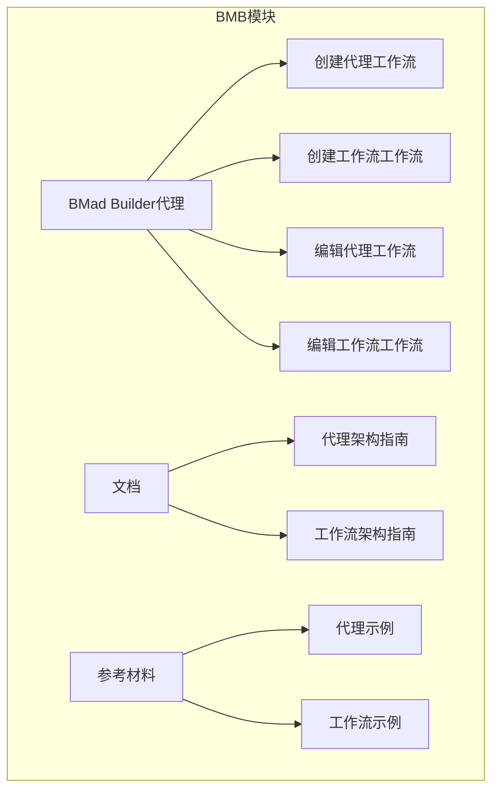

# BMad Builder (BMB)

<cite>
**本文档中引用的文件**  
- [bmad-builder.agent.yaml](file://src/modules/bmb/agents/bmad-builder.agent.yaml)
- [create-agent/workflow.md](file://src/modules/bmb/workflows/create-agent/workflow.md)
- [create-workflow/workflow.md](file://src/modules/bmb/workflows/create-workflow/workflow.md)
- [edit-agent/workflow.md](file://src/modules/bmb/workflows/edit-agent/workflow.md)
- [edit-workflow/workflow.md](file://src/modules/bmb/workflows/edit-workflow/workflow.md)
- [step-01-brainstorm.md](file://src/modules/bmb/workflows/create-agent/steps/step-01-brainstorm.md)
- [step-02-discover.md](file://src/modules/bmb/workflows/create-agent/steps/step-02-discover.md)
- [step-03-persona.md](file://src/modules/bmb/workflows/create-agent/steps/step-03-persona.md)
- [step-04-commands.md](file://src/modules/bmb/workflows/create-agent/steps/step-04-commands.md)
- [step-05-name.md](file://src/modules/bmb/workflows/create-agent/steps/step-05-name.md)
- [README.md](file://src/modules/bmb/README.md)
- [agent-validation-checklist.md](file://src/modules/bmb/workflows/create-agent/data/agent-validation-checklist.md)
</cite>

## 目录
1. [简介](#简介)
2. [BMB模块架构](#bmb模块架构)
3. [核心功能概述](#核心功能概述)
4. [创建代理工作流详解](#创建代理工作流详解)
5. [创建工作流工作流](#创建工作流工作流)
6. [编辑代理与工作流](#编辑代理与工作流)
7. [配置驱动设计与代码生成](#配置驱动设计与代码生成)
8. [与BMM模块的协同关系](#与bmm模块的协同关系)
9. [自定义代理创建示例](#自定义代理创建示例)
10. [验证机制与质量保证](#验证机制与质量保证)

## 简介

BMad Builder (BMB) 是BMAD-METHOD框架中的核心元编程工具，专门用于创建和修改代理（agents）与工作流（workflows）。作为系统的主要构建和维护工具，BMB通过一系列结构化的、交互式的工作流，帮助用户从头脑风暴到最终构建，系统地创建高质量的代理和工作流。BMB不仅是一个代码生成器，更是一个遵循最佳实践的设计伙伴，确保所有创建的组件都符合BMAD框架的架构标准和质量要求。BMB创建的代理和工作流可以被其他模块（如BMM）在开发流程中调用，从而扩展整个BMAD-METHOD的功能。

**Section sources**
- [README.md](file://src/modules/bmb/README.md#L1-L262)

## BMB模块架构

BMB模块采用模块化架构，其核心由一个主代理（bmad-builder.agent.yaml）和多个工作流组成。主代理作为用户与BMB功能的交互入口，通过其菜单系统提供创建、编辑和验证代理与工作流的能力。工作流则采用“步骤文件架构”（step-file architecture），将复杂的创建过程分解为一系列独立的、自包含的步骤文件。这种架构实现了“即时加载”（Just-In-Time Loading），即在执行时只加载当前步骤，确保了执行的纪律性和状态的可追踪性。BMB的文档和参考材料也组织得非常清晰，为用户提供全面的指导。

**Diagram sources**
- [README.md](file://src/modules/bmb/README.md#L15-L122)

**Section sources**
- [README.md](file://src/modules/bmb/README.md#L15-L122)
- [bmad-builder.agent.yaml](file://src/modules/bmb/agents/bmad-builder.agent.yaml#L1-L72)

## 核心功能概述

BMB的核心功能围绕四个主要工作流展开：创建代理（create-agent）、创建工作流（create-workflow）、编辑代理（edit-agent）和编辑工作流（edit-workflow）。这些工作流都遵循“步骤文件架构”的核心原则：微文件设计、即时加载、顺序执行、状态追踪和追加式构建。每个工作流都是一个协作过程，BMB代理扮演专家架构师的角色，与用户平等合作，引导用户完成设计决策。这种设计确保了创建过程的系统性和高质量，同时保持了足够的灵活性来适应不同的用户需求。

**Section sources**
- [README.md](file://src/modules/bmb/README.md#L77-L114)
- [create-agent/workflow.md](file://src/modules/bmb/workflows/create-agent/workflow.md#L1-L92)
- [create-workflow/workflow.md](file://src/modules/bmb/workflows/create-workflow/workflow.md#L1-L59)

## 创建代理工作流详解

创建代理工作流是一个包含11个步骤的详细过程，从头脑风暴开始，到最终庆祝构建完成。该工作流旨在通过引导式发现，帮助用户构建符合BMAD Core标准的代理。

### 步骤1：头脑风暴 (step-01-brainstorm.md)

此步骤是可选的创意探索环节。BMB会询问用户是否希望先进行头脑风暴，以激发创意和探索可能的代理概念。如果用户同意，BMB将调用专门的头脑风暴工作流（`core/workflows/brainstorming/workflow.md`）来引导用户生成想法。此步骤强调用户选择的自由，绝不强制进行。

**Section sources**
- [step-01-brainstorm.md](file://src/modules/bmb/workflows/create-agent/steps/step-01-brainstorm.md#L1-L146)
- [create-agent/workflow.md](file://src/modules/bmb/workflows/create-agent/workflow.md#L58)

### 步骤2：发现 (step-02-discover.md)

在此步骤中，BMB引导用户明确代理的核心目的和目标用户。通过自然对话，BMB帮助用户探索代理要解决的问题、主要用户以及其独特价值。随后，BMB会根据发现的目的，推荐合适的代理类型（简单、专家或模块代理），并解释其架构差异。关键在于，代理类型的选择基于架构需求而非能力限制。

**Section sources**
- [step-02-discover.md](file://src/modules/bmb/workflows/create-agent/steps/step-02-discover.md#L1-L211)

### 步骤3：角色设定 (step-03-persona.md)

此步骤专注于塑造代理的完整角色设定，使用四个独立的字段：
- **角色 (role)**：定义代理的功能（“做什么”）。
- **身份 (identity)**：定义代理的背景和可信度（“是谁”）。
- **沟通风格 (communication_style)**：定义代理的说话方式（“如何说”），必须简洁且纯粹，仅描述口头模式。
- **原则 (principles)**：定义指导代理决策的信念（“由什么引导”）。
BMB会引导用户分别发展这四个字段，确保它们各司其职，不互相混淆。

**Section sources**
- [step-03-persona.md](file://src/modules/bmb/workflows/create-agent/steps/step-03-persona.md#L1-L261)

### 步骤4：命令 (step-04-commands.md)

在此步骤中，BMB将用户期望的能力转化为结构化的YAML命令系统。它会根据代理类型加载相应的架构文档（简单、专家或模块），并指导用户设计菜单项。每个命令都需要一个触发短语、描述和实现方式（引用工作流或直接执行）。BMB还会讨论工作流集成和高级功能，如复杂分析提示或错误处理。

**Section sources**
- [step-04-commands.md](file://src/modules/bmb/workflows/create-agent/steps/step-04-commands.md#L1-L238)

### 步骤5：命名 (step-05-name.md)

在了解了代理的所有特性后，BMB引导用户为其命名。这个过程包括确定个人名称、专业头衔、视觉图标（emoji）和用于文件生成的技术文件名（kebab-case格式）。命名是基于之前发现的代理特性自然产生的，确保名称能捕捉到代理的本质。

**Section sources**
- [step-05-name.md](file://src/modules/bmb/workflows/create-agent/steps/step-05-name.md#L1-L232)

### 后续步骤 (6-11)

后续步骤包括构建（生成YAML）、验证（使用`agent-validation-checklist.md`进行质量检查）、设置、自定义、构建工具、庆祝等，最终完成代理的创建和部署。

**Section sources**
- [create-agent/workflow.md](file://src/modules/bmb/workflows/create-agent/workflow.md#L8-L92)

## 创建工作流工作流

创建工作流工作流（create-workflow）旨在帮助用户设计和构建新的、结构化的独立工作流。与创建代理工作流类似，它也采用步骤文件架构，通过12个结构化步骤，从初始化到最终审查，引导用户完成工作流的设计。BMB在此过程中扮演工作流架构师和系统设计师的角色，与用户合作，利用工作流设计模式和协作促进技巧，共同创建出可重复、高质量的工作流。该工作流特别强调“意图与规定性谱系”（Intent vs Prescriptive Spectrum），允许创建从高度用户主导的创意工作流到严格合规的验证工作流。

**Section sources**
- [create-workflow/workflow.md](file://src/modules/bmb/workflows/create-workflow/workflow.md#L1-L59)
- [README.md](file://src/modules/bmb/README.md#L87-L91)

## 编辑代理与工作流

BMB提供了专门的`edit-agent`和`edit-workflow`工作流，用于分析和改进现有组件。
- **编辑代理 (edit-agent)**：此工作流首先分析现有代理的意图，然后进行验证和更新。它帮助用户识别改进点，确保代理符合最新的最佳实践和规范。
- **编辑工作流 (edit-workflow)**：此工作流以分析现有工作流为起点，然后进行修改和合规性检查。它确保工作流的结构得到维护，模板得到一致更新，从而保持整个系统的一致性。

这两个编辑工作流同样遵循步骤文件架构，确保了修改过程的系统性和可追溯性。

**Section sources**
- [edit-agent/workflow.md](file://src/modules/bmb/workflows/edit-agent/workflow.md#L1-L59)
- [edit-workflow/workflow.md](file://src/modules/bmb/workflows/edit-workflow/workflow.md#L1-L59)

## 配置驱动设计与代码生成

BMB采用模块化架构和配置驱动设计来实现代码生成。整个创建过程不依赖于硬编码的模板填充，而是基于用户在交互式对话中做出的设计决策。这些决策（如代理目的、角色设定、命令结构）被逐步记录和确认，最终作为配置输入到生成过程中。BMB的“步骤文件架构”本身就是一种配置驱动的设计，每个步骤文件都定义了该步骤的精确指令、路径和模板引用。这种设计使得BMB能够生成高度定制化且符合规范的YAML文件，同时保持了工作流本身的灵活性和可维护性。

**Section sources**
- [create-agent/workflow.md](file://src/modules/bmb/workflows/create-agent/workflow.md#L17-L45)
- [README.md](file://src/modules/bmb/README.md#L220-L227)

## 与BMM模块的协同关系

BMB与BMM（BMad Method Module）模块有着紧密的协同关系。BMB负责创建和维护代理与工作流，而BMM则利用这些组件来执行具体的开发流程。例如，BMB可以创建一个用于项目管理的“项目协调员”代理，这个代理随后可以被BMM在“绿色场”（greenfield）或“棕色场”（brownfield）开发工作流中调用。同样，BMB创建的“代码审查”工作流也可以被BMM的实现工作流所集成。这种分工使得BMB成为扩展BMAD-METHOD功能的关键，它创建的组件为BMM等模块提供了可复用的、高质量的构建块。

**Section sources**
- [README.md](file://src/modules/bmb/README.md#L244-L250)
- [bmad-builder.agent.yaml](file://src/modules/bmb/agents/bmad-builder.agent.yaml#L65-L71)

## 自定义代理创建示例

创建一个自定义代理的完整示例如下：
1.  **定义角色设定**：首先，通过`create-agent`工作流的步骤3，定义代理的`role`（如“代码审查专家”）、`identity`（如“资深开发者，拥有10年经验”）、`communication_style`（如“直接、简洁，像军事简报”）和`principles`（如“安全第一，性能至上”）。
2.  **配置命令**：在步骤4中，配置命令，例如，创建一个触发词为“review”的菜单项，该命令引用BMM模块中的`code-review/workflow.yaml`工作流。
3.  **工作流集成**：在命令配置中，明确指定工作流路径（使用`{project-root}`变量确保可移植性），将新代理无缝集成到现有的BMM开发流程中。
此过程突显了BMB在扩展BMAD-METHOD功能方面的关键作用，允许用户创建针对特定需求的专用代理。

**Section sources**
- [step-03-persona.md](file://src/modules/bmb/workflows/create-agent/steps/step-03-persona.md#L74-L93)
- [step-04-commands.md](file://src/modules/bmb/workflows/create-agent/steps/step-04-commands.md#L116-L145)

## 验证机制与质量保证

BMB内置了强大的验证机制来保证质量。最核心的工具是`agent-validation-checklist.md`，这是一个详尽的检查清单，涵盖了YAML结构、代理结构、角色设定（特别是沟通风格的纯度）、菜单、提示等多个方面的验证标准。在`create-agent`工作流的第7步“验证”中，会系统地应用此清单。此外，`workflow-compliance-check`工作流提供了对工作流的系统性验证。这些验证机制确保了所有通过BMB创建的组件都具有高一致性、高质量，并且没有常见的错误，如路径错误或角色设定混淆。

**Section sources**
- [agent-validation-checklist.md](file://src/modules/bmb/workflows/create-agent/data/agent-validation-checklist.md#L1-L175)
- [create-agent/workflow.md](file://src/modules/bmb/workflows/create-agent/workflow.md#L8-L92)