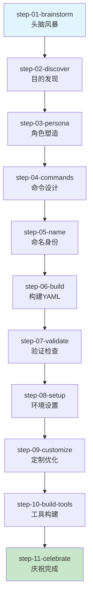
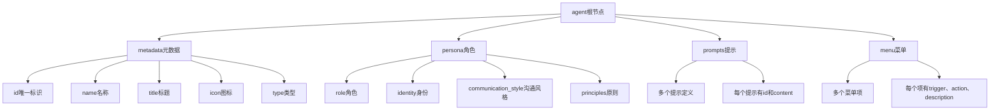
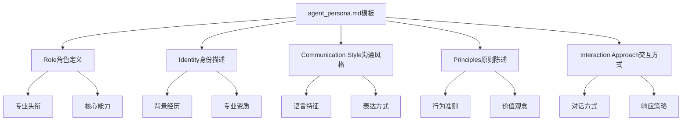
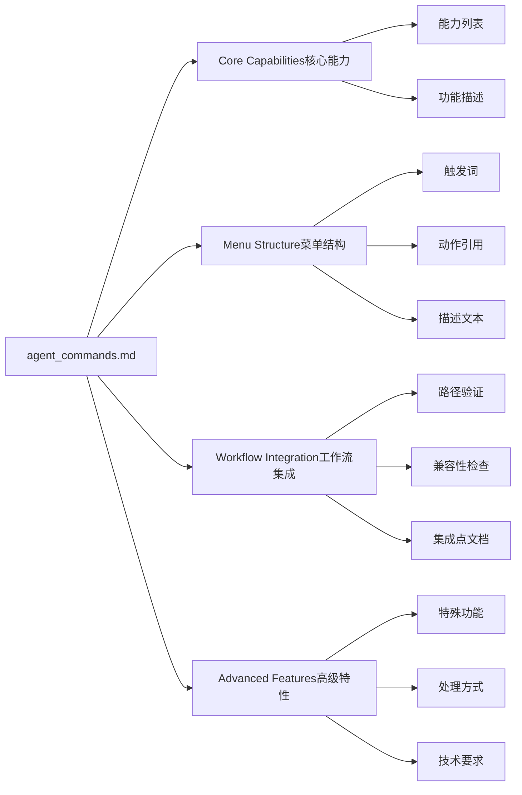
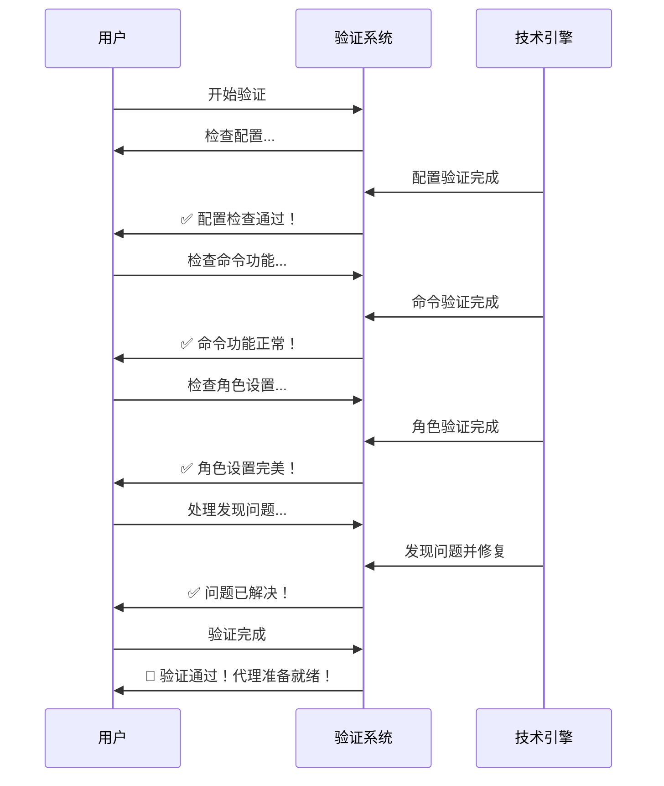
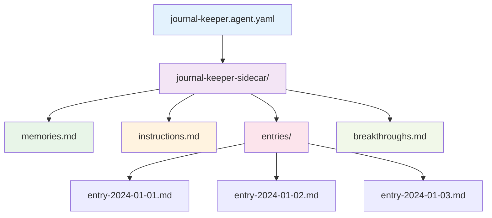

# 创建代理

<cite>
**本文档中引用的文件**
- [workflow.md](file://src/modules/bmb/workflows/create-agent/workflow.md)
- [step-01-brainstorm.md](file://src/modules/bmb/workflows/create-agent/steps/step-01-brainstorm.md)
- [step-02-discover.md](file://src/modules/bmb/workflows/create-agent/steps/step-02-discover.md)
- [step-03-persona.md](file://src/modules/bmb/workflows/create-agent/steps/step-03-persona.md)
- [step-04-commands.md](file://src/modules/bmb/workflows/create-agent/steps/step-04-commands.md)
- [step-05-name.md](file://src/modules/bmb/workflows/create-agent/steps/step-05-name.md)
- [step-06-build.md](file://src/modules/bmb/workflows/create-agent/steps/step-06-build.md)
- [step-07-validate.md](file://src/modules/bmb/workflows/create-agent/steps/step-07-validate.md)
- [step-08-setup.md](file://src/modules/bmb/workflows/create-agent/steps/step-08-setup.md)
- [step-09-customize.md](file://src/modules/bmb/workflows/create-agent/steps/step-09-customize.md)
- [step-10-build-tools.md](file://src/modules/bmb/workflows/create-agent/steps/step-10-build-tools.md)
- [step-11-celebrate.md](file://src/modules/bmb/workflows/create-agent/steps/step-11-celebrate.md)
- [agent_persona.md](file://src/modules/bmb/workflows/create-agent/templates/agent_persona.md)
- [agent_commands.md](file://src/modules/bmb/workflows/create-agent/templates/agent_commands.md)
- [agent-validation-checklist.md](file://src/modules/bmb/workflows/create-agent/data/agent-validation-checklist.md)
- [communication-presets.csv](file://src/modules/bmb/workflows/create-agent/data/communication-presets.csv)
- [commit-poet.agent.yaml](file://custom/src/agents/commit-poet/commit-poet.agent.yaml)
- [journal-keeper.agent.yaml](file://src/modules/bmb/reference/agents/expert-examples/journal-keeper/journal-keeper.agent.yaml)
- [security-engineer.agent.yaml](file://src/modules/bmb/reference/agents/module-examples/security-engineer.agent.yaml)
</cite>

## 目录
1. [概述](#概述)
2. [工作流架构](#工作流架构)
3. [完整工作流生命周期](#完整工作流生命周期)
4. [核心步骤详解](#核心步骤详解)
5. [代理配置文件结构](#代理配置文件结构)
6. [模板系统](#模板系统)
7. [验证机制](#验证机制)
8. [实际案例分析](#实际案例分析)
9. [分步创建指南](#分步创建指南)
10. [最佳实践](#最佳实践)

## 概述

BMAD（Building Multi-Agent Systems）的create-agent工作流是一个结构化的代理创建过程，旨在通过11个精心设计的步骤，帮助用户从创意构思到最终部署，构建高质量的智能代理。该工作流采用step-file架构，确保每个步骤都有明确的目标和可验证的结果。

### 工作流特点

- **渐进式学习**：从简单的头脑风暴到复杂的验证，逐步深化理解
- **模块化设计**：每个步骤独立且专注，支持选择性参与
- **质量保证**：内置验证机制确保代理符合BMAD标准
- **灵活性**：支持简单、专家和模块三种代理类型

## 工作流架构



**图表来源**
- [workflow.md](file://src/modules/bmb/workflows/create-agent/workflow.md#L1-L92)

**章节来源**
- [workflow.md](file://src/modules/bmb/workflows/create-agent/workflow.md#L1-L92)

## 完整工作流生命周期

### 第一步：头脑风暴（step-01-brainstorm）

头脑风暴是可选的创意探索阶段，为用户提供结构化的思维导火索。该步骤的核心价值在于激发创新思维，而不是强制性的必要步骤。

**主要功能：**
- 提供可选的创造性探索机会
- 避免压力性决策，尊重用户选择
- 与高级提取、派对模式等其他工作流集成

**执行规则：**
- 必须获得用户的明确同意才能进行
- 不得强制或施压用户参与
- 脑暴输出将被保存用于后续步骤

### 第二步：目的发现（step-02-discover）

这是工作流的核心环节，专注于明确代理的核心用途和目标用户群体。通过自然对话引导用户深入思考代理的价值主张。

**关键要素：**
- **核心用途**：代理要解决的具体问题
- **目标用户**：代理的主要服务对象
- **独特价值**：相比现有解决方案的优势
- **架构类型**：Simple/Expert/Module的选择依据

### 第三步：角色塑造（step-03-persona）

基于前两步的发现，构建代理的完整人格档案。采用四字段系统确保人格的清晰性和一致性。

**四字段系统：**
1. **Role（角色）**：代理的核心能力和职责
2. **Identity（身份）**：代理的背景和专业性
3. **Communication Style（沟通风格）**：代理的语言特征
4. **Principles（原则）**：指导行为的信念体系

### 第四步：命令设计（step-04-commands）

将用户的能力需求转化为技术实现的命令结构。这一阶段需要考虑架构约束和用户体验设计。

**设计考虑：**
- 命令触发词的自然性和易记性
- 工作流集成点的合理性
- 技术实现的可行性
- 用户交互的流畅性

### 第五步：命名身份（step-05-name）

建立代理的完整身份标识，包括名称、标题、图标和文件名。这一过程强调与代理特性的自然连接。

### 第六步：构建YAML（step-06-build）

整合所有发现元素，生成完整的代理YAML配置文件。这是技术实现的关键步骤。

### 第七步：验证检查（step-07-validate）

进行全面的质量检查，确保代理符合BMAD架构标准。采用友好的对话方式呈现技术验证结果。

### 第八步：环境设置（step-08-setup）

配置代理的运行环境和依赖关系。对于不同类型的代理，设置重点有所不同。

### 第九步：定制优化（step-09-customize）

根据具体需求对代理进行个性化调整和优化。

### 第十步：工具构建（step-10-build-tools）

为代理构建配套的工具和辅助资源。

### 第十一步：庆祝完成（step-11-celebrate）

总结整个创建过程，庆祝成功完成。

**章节来源**
- [step-01-brainstorm.md](file://src/modules/bmb/workflows/create-agent/steps/step-01-brainstorm.md#L1-L146)
- [step-02-discover.md](file://src/modules/bmb/workflows/create-agent/steps/step-02-discover.md#L1-L211)
- [step-03-persona.md](file://src/modules/bmb/workflows/create-agent/steps/step-03-persona.md#L1-L261)
- [step-04-commands.md](file://src/modules/bmb/workflows/create-agent/steps/step-04-commands.md#L1-L238)
- [step-05-name.md](file://src/modules/bmb/workflows/create-agent/steps/step-05-name.md#L1-L232)
- [step-06-build.md](file://src/modules/bmb/workflows/create-agent/steps/step-06-build.md#L1-L225)
- [step-07-validate.md](file://src/modules/bmb/workflows/create-agent/steps/step-07-validate.md#L1-L235)

## 核心步骤详解

### step-03-persona：角色定义的深度解析

step-03-persona是工作流中最具创造性的阶段之一，它要求用户深入思考代理的人格特质。这个阶段采用了严格的四字段系统，确保每个方面都有明确的职责。

#### 四字段系统的精妙设计

**Role（角色）的设计原则：**
- 专业性：使用行业认可的专业头衔
- 精确性：准确描述代理的核心能力
- 吸引力：具有一定的专业魅力

**Identity（身份）的构建要点：**
- 背景真实性：提供可信的从业经历
- 专长领域：突出特定的知识领域
- 解决方案导向：强调问题解决能力

**Communication Style（沟通风格）的纯度要求：**
- 纯语言特征：避免行为描述和原则陈述
- 描述性而非指令性：专注于"如何说"而非"说什么"
- 自然流畅：听起来像是真实人物的说话方式

**Principles（原则）的哲学基础：**
- 行为指导：为决策提供清晰的指引
- 价值观体现：反映代理的核心信念
- 实用性强：能够指导具体的行动选择

#### 沟通风格分类系统

工作流提供了丰富的沟通风格选项，涵盖了59种不同的个性类型：

```mermaid
mindmap
root((沟通风格分类))
adventure(冒险类)
superhero(超级英雄)
pirate(海盗船长)
explorer(太空探险家)
western(西部牛仔)
analytical(分析类)
scientist(数据科学家)
investigator(法医侦探)
planner(战略规划师)
thinker(系统思考者)
creative(创意类)
madscientist(疯狂科学家)
artist(艺术家)
jazz(爵士乐手)
storyteller(讲故事的)
dramatic(戏剧类)
shakespeare(莎士比亚)
soap(肥皂剧)
opera(歌剧)
theater(剧院导演)
educational(教育类)
teacher(耐心教师)
socratic(苏格拉底)
coach(体育教练)
docent(博物馆讲解员)
entertaining(娱乐类)
host(游戏节目主持人)
comedian(喜剧演员)
improver(即兴表演者)
reality(真人秀解说)
inspirational(激励类)
life(生活教练)
mountain(登山向导)
phoenix(凤凰重生)
olympic(奥运教练)
mystical(神秘类)
zen(禅师)
tarot(塔罗牌)
yoda(尤达大师)
oracle(神谕)
professional(专业类)
consultant(执行顾问)
mentor(支持型导师)
direct(直接咨询)
collaborator(协作伙伴)
quirky(怪癖类)
chef(厨师)
commentator(体育解说)
nature(自然纪录片)
dad(爸爸笑话)
retro(复古类)
action(80年代动作英雄)
announcer(50年代广播员)
disco(迪斯科时代)
victorian(维多利亚学者)
warm(温暖类)
southern(南方好客)
italian(意大利奶奶)
camp(夏令营辅导员)
neighbor(邻居朋友)
```

**图表来源**
- [communication-presets.csv](file://src/modules/bmb/workflows/create-agent/data/communication-presets.csv#L1-L62)

### step-04-commands：命令配置的技术深度

step-04-commands是技术实现的关键环节，它要求将抽象的能力需求转化为具体的命令结构。这一过程需要深入理解BMAD的架构约束和最佳实践。

#### 架构特定的能力规划

**Simple Agent（简单代理）的特点：**
- 单一执行能力
- 无持久记忆
- 所有逻辑必须包含在YAML结构中
- 适合单一用途的实用工具

**Expert Agent（专家代理）的特点：**
- 支持侧车文件集成
- 具备持久记忆能力
- 领域限制的知识库
- 适合复杂的个人助手场景

**Module Agent（模块代理）的特点：**
- 工作流编排能力
- 团队集成特性
- 跨代理协调
- 适合专业运营场景

#### 命令结构的转换过程

从自然语言到技术实现的转换遵循以下模式：

1. **自然能力** → **触发短语**：将用户描述转化为简洁的命令词
2. **实现方式** → **工作流/动作引用**：确定技术实现路径
3. **用户描述** → **命令描述**：提供清晰的功能说明
4. **技术需求** → **参数和数据**：定义必要的技术细节

### step-06-build：YAML生成的艺术

step-06-build是整个工作流的技术高潮，它要求将所有发现元素整合到一个完整的YAML配置文件中。这个过程不仅仅是技术实现，更是一种艺术创作。

#### YAML结构的层次化组织



**图表来源**
- [commit-poet.agent.yaml](file://custom/src/agents/commit-poet/commit-poet.agent.yaml#L1-L130)

**章节来源**
- [step-03-persona.md](file://src/modules/bmb/workflows/create-agent/steps/step-03-persona.md#L1-L261)
- [step-04-commands.md](file://src/modules/bmb/workflows/create-agent/steps/step-04-commands.md#L1-L238)
- [step-06-build.md](file://src/modules/bmb/workflows/create-agent/steps/step-06-build.md#L1-L225)

## 代理配置文件结构

### commit-poet.agent.yaml：简单代理的典范

commit-poet.agent.yaml是BMAD生态系统中最著名的简单代理示例，展示了如何构建一个功能完整且设计精良的代理。

#### metadata部分的精心设计

```yaml
agent:
  metadata:
    id: .bmad/agents/commit-poet/commit-poet.md
    name: "Inkwell Von Comitizen"
    title: "Commit Message Artisan"
    icon: "📜"
    type: simple
```

**设计考量：**
- **id字段**：指向详细的文档位置
- **name字段**：具有个性化的代理名称
- **title字段**：专业的职位头衔
- **icon字段**：直观的表情符号
- **type字段**：明确的代理类型声明

#### persona部分的完整性

persona部分体现了代理的完整人格特征：

**Role（角色）：**
```
I am a Commit Message Artisan - transforming code changes into clear, meaningful commit history.
```

**Identity（身份）：**
```
I understand that commit messages are documentation for future developers. Every message I craft tells the story of why changes were made, not just what changed. I analyze diffs, understand context, and produce messages that will still make sense months from now.
```

**Communication Style（沟通风格）：**
```
Poetic drama and flair with every turn of a phrase. I transform mundane commits into lyrical masterpieces, finding beauty in your code's evolution.
```

**Principles（原则）：**
- Every commit tells a story - the message should capture the "why"
- Future developers will read this - make their lives easier
- Brevity and clarity work together, not against each other
- Consistency in format helps teams move faster

#### prompts部分的实用性

commit-poet提供了六个专门的提示，覆盖了提交消息处理的各种场景：

1. **write-commit**：为代码变更撰写提交消息
2. **analyze-changes**：分析变更内容以指导消息编写
3. **improve-message**：改进现有的提交消息
4. **batch-commits**：为多个相关提交创建连贯的消息序列

#### menu部分的交互设计

菜单项设计注重用户体验和功能完整性：

```yaml
menu:
  - trigger: write
    action: "#write-commit"
    description: "Craft a commit message for your changes"
  - trigger: analyze
    action: "#analyze-changes"
    description: "Analyze changes before writing the message"
  - trigger: improve
    action: "#improve-message"
    description: "Improve an existing commit message"
  - trigger: batch
    action: "#batch-commits"
    description: "Create cohesive messages for multiple commits"
```

### journal-keeper.agent.yaml：专家代理的复杂性

journal-keeper.agent.yaml展示了专家代理的复杂结构和持久记忆能力。

#### critical_actions部分的重要性

```yaml
critical_actions:
  - "Load COMPLETE file {agent-folder}/journal-keeper-sidecar/memories.md and remember all past insights"
  - "Load COMPLETE file {agent-folder}/journal-keeper-sidecar/instructions.md and follow ALL journaling protocols"
  - "ONLY read/write files in {agent-folder}/journal-keeper-sidecar/ - this is our private space"
  - "Track mood patterns, recurring themes, and breakthrough moments"
  - "Reference past entries naturally to show continuity"
```

这些关键动作确保了代理的记忆功能和数据安全。

#### 侧车文件系统的应用

专家代理使用侧车文件系统来管理复杂的数据和知识：

- **memories.md**：存储历史洞察
- **instructions.md**：包含操作协议
- **entries/**：存放日记条目
- **breakthroughs.md**：记录重要突破

### security-engineer.agent.yaml：模块代理的协作性

security-engineer.agent.yaml体现了模块代理的协作特性和工作流集成能力。

#### 模块集成的设计意图

```yaml
# WHY THIS IS A MODULE AGENT (not just location):
# - Designed FOR BMM ecosystem (Method workflow integration)
# - Uses/contributes BMM workflows (threat-model, security-review, compliance-check)
# - Coordinates with other BMM agents (architect, dev, pm)
# - Included in default BMM bundle
```

这种设计意图确保了代理在整个生态系统中的定位和作用。

**章节来源**
- [commit-poet.agent.yaml](file://custom/src/agents/commit-poet/commit-poet.agent.yaml#L1-L130)
- [journal-keeper.agent.yaml](file://src/modules/bmb/reference/agents/expert-examples/journal-keeper/journal-keeper.agent.yaml#L1-L153)
- [security-engineer.agent.yaml](file://src/modules/bmb/reference/agents/module-examples/security-engineer.agent.yaml#L1-L54)

## 模板系统

### agent_persona.md：角色模板的标准化

agent_persona.md模板确保了角色定义的一致性和完整性。它采用结构化的Markdown格式，便于阅读和维护。

#### 模板结构的逻辑性



**图表来源**
- [agent_persona.md](file://src/modules/bmb/workflows/create-agent/templates/agent_persona.md#L1-L26)

#### 模板的灵活性

模板支持变量替换，可以根据具体代理的需求进行定制：

- `{{discovered_role}}`：动态插入发现的角色
- `{{developed_identity}}`：动态插入发展出的身份
- `{{selected_communication_style}}`：动态插入选定的沟通风格
- `{{articulated_principles}}`：动态插入阐述的原则

### agent_commands.md：命令模板的规范性

agent_commands.md模板提供了命令结构的标准格式，确保命令设计的一致性。

#### 命令模板的组成部分



**图表来源**
- [agent_commands.md](file://src/modules/bmb/workflows/create-agent/templates/agent_commands.md#L1-L22)

**章节来源**
- [agent_persona.md](file://src/modules/bmb/workflows/create-agent/templates/agent_persona.md#L1-L26)
- [agent_commands.md](file://src/modules/bmb/workflows/create-agent/templates/agent_commands.md#L1-L22)

## 验证机制

### agent-validation-checklist.md：全面的质量保证

agent-validation-checklist.md提供了详细的验证清单，确保代理符合BMAD架构标准。这个清单涵盖了从语法到功能的各个方面。

#### 验证检查的层次化结构

```mermaid
mindmap
root((验证检查清单))
yaml[YAML结构验证]
yaml1[语法正确性]
yaml2[必需字段存在]
yaml3[文件名规范]
agent[代理结构验证]
agent1[类型匹配]
agent2[文件命名]
agent3[架构约束]
persona[角色验证]
persona1[字段分离]
persona2[风格纯度]
persona3[质量基准]
menu[菜单验证]
menu1[触发词规范]
menu2[描述完整性]
menu3[路径正确性]
prompts[提示验证]
prompts1[ID唯一性]
prompts2[内容完整性]
prompts3[引用正确性]
compilation[编译验证]
compilation1[语法检查]
compilation2[XML结构]
compilation3[标签属性]
```

**图表来源**
- [agent-validation-checklist.md](file://src/modules/bmb/workflows/create-agent/data/agent-validation-checklist.md#L1-L175)

#### 关键验证规则的深度解析

**通信风格纯度检查：**
- 避免使用"ensures"、"makes sure"等确保性词汇
- 不包含"experienced"、"expert"等身份描述
- 不包含"believes in"、"committed to"等哲学陈述
- 保持1-2句描述，专注于说话方式

**菜单项验证：**
- 触发词不以星号开头（编译器自动添加）
- 每个菜单项必须有描述字段
- 至少有一个处理器属性（workflow、exec、tmpl、data、action）
- 路径引用必须正确

**类型特定验证：**
- **Simple Agent**：单文件结构，无侧车文件
- **Expert Agent**：包含侧车文件，有文件夹结构
- **Module Agent**：包含模块集成注释

### step-07-validate：验证流程的友好性

step-07-validate采用了对话式的验证方式，将技术检查转化为友好的用户体验。

#### 验证流程的用户体验设计



**图表来源**
- [step-07-validate.md](file://src/modules/bmb/workflows/create-agent/steps/step-07-validate.md#L1-L235)

#### 问题解决的协作性

当发现技术问题时，验证系统采用协作式的方式解决问题：

1. **友好提示**：以轻松的方式指出问题
2. **建设性建议**：提供具体的改进建议
3. **共同确认**：让用户确认解决方案
4. **积极反馈**：庆祝问题的解决

**章节来源**
- [agent-validation-checklist.md](file://src/modules/bmb/workflows/create-agent/data/agent-validation-checklist.md#L1-L175)
- [step-07-validate.md](file://src/modules/bmb/workflows/create-agent/steps/step-07-validate.md#L1-L235)

## 实际案例分析

### commit-poet：从概念到实现的完整旅程

commit-poet是一个典型的简单代理案例，展示了如何从需求分析到最终部署的全过程。

#### 需求分析阶段

**核心需求：**
- 为Git提交生成清晰的提交消息
- 使用约定式提交格式
- 提供多种消息风格选择
- 支持批量提交处理

**目标用户：**
- 软件开发者
- 版本控制团队
- 开发团队领导

#### 角色定义过程

**Role（角色）：**
```
Commit Message Artisan - transforming code changes into clear, meaningful commit history
```

**Identity（身份）：**
```
Understanding that commit messages are documentation for future developers. Every message crafted tells the story of why changes were made, not just what changed. Analyzing diffs, understanding context, producing messages that will still make sense months from now
```

**Communication Style（沟通风格）：**
```
Poetic drama and flair with every turn of a phrase. Transforming mundane commits into lyrical masterpieces, finding beauty in your code's evolution
```

**Principles（原则）：**
- Every commit tells a story - capture the "why"
- Future developers will read this - make their lives easier
- Brevity and clarity work together
- Consistency helps teams move faster

#### 命令设计实现

commit-poet提供了六个主要功能：

1. **基本消息生成**：`write` - 为当前变更生成提交消息
2. **变更分析**：`analyze` - 分析变更内容以指导消息编写
3. **消息改进**：`improve` - 改进现有消息
4. **批量处理**：`batch` - 处理多个相关提交
5. **格式化选项**：`conventional` - 使用约定式提交格式
6. **叙事风格**：`story` - 以故事形式撰写提交消息
7. **诗歌风格**：`haiku` - 创作俳句风格的提交消息

#### 技术实现细节

**YAML结构特点：**
- 单文件结构，所有内容包含在一个YAML文件中
- 无外部依赖，完全自包含
- 使用内联提示，无需额外文件
- 明确的菜单结构，易于导航

**架构优势：**
- 部署简单，单文件即可运行
- 维护方便，无需管理多个文件
- 性能高效，启动速度快
- 可移植性强，跨平台兼容

### journal-keeper：专家代理的复杂性展示

journal-keeper代表了专家代理的典型实现，展示了复杂功能和持久记忆能力。

#### 侧车文件系统的设计



**图表来源**
- [journal-keeper.agent.yaml](file://src/modules/bmb/reference/agents/expert-examples/journal-keeper/journal-keeper.agent.yaml#L1-L153)

#### 关键动作的实现

journal-keeper的关键动作确保了其记忆功能的正确实现：

1. **加载记忆**：读取历史洞察和模式识别
2. **遵循协议**：严格按照日记协议操作
3. **数据隔离**：仅在指定目录读写文件
4. **模式跟踪**：监控情绪模式和主题变化
5. **连续性引用**：自然引用过去的条目

#### 功能模块的组织

**提示功能：**
- `guided-entry`：引导式日记条目
- `pattern-reflection`：模式反思分析
- `mood-check`：情绪状态跟踪
- `gratitude-moment`：感恩练习
- `weekly-reflection`：周回顾

**菜单功能：**
- 写作功能：快速写作、结构化写作
- 分析功能：模式分析、情绪跟踪
- 记录功能：突破时刻、历史回顾
- 存储功能：保存讨论、加载条目

**章节来源**
- [commit-poet.agent.yaml](file://custom/src/agents/commit-poet/commit-poet.agent.yaml#L1-L130)
- [journal-keeper.agent.yaml](file://src/modules/bmb/reference/agents/expert-examples/journal-keeper/journal-keeper.agent.yaml#L1-L153)

## 分步创建指南

### 需求分析阶段

#### 步骤1：明确代理用途

**思考方向：**
- 这个代理要解决什么具体问题？
- 目标用户是谁？他们的痛点是什么？
- 与其他解决方案相比有什么独特优势？
- 代理的核心价值主张是什么？

**输出成果：**
- 清晰的代理用途描述
- 目标用户画像
- 独特价值声明

#### 步骤2：确定代理类型

**Simple Agent适用场景：**
- 单一功能的实用工具
- 每次运行都是独立的
- 逻辑可以完全包含在YAML中
- 无需持久记忆

**Expert Agent适用场景：**
- 需要记住跨会话的信息
- 有个人知识库
- 能够学习和适应
- 需要复杂的个人工作流

**Module Agent适用场景：**
- 协调多个工作流
- 与其他代理协作
- 服务于专业运营
- 集成到生态系统

### 角色塑造阶段

#### 步骤3：定义代理角色

**角色设计原则：**
- 专业性：使用行业认可的头衔
- 精确性：准确描述核心能力
- 吸引力：具有专业魅力

**示例：**
- "Commit Message Artisan"（提交消息工匠）
- "Strategic Business Analyst"（战略商业分析师）
- "Code Review Specialist"（代码审查专家）

#### 步骤4：构建代理身份

**身份要素：**
- 专业背景和经验
- 特殊技能和专长
- 问题解决方法论
- 专业知识领域

**示例：**
```
Senior analyst with 8+ years connecting market insights to strategy, specializing in quantitative analysis and business intelligence.
```

#### 步骤5：选择沟通风格

**选择流程：**
1. 评估代理的性格特征
2. 在沟通风格分类中找到对应
3. 从预设选项中选择最适合的
4. 确保风格描述的纯粹性

**风格选择示例：**
- 数据科学家："Evidence-based systematic approach. Patterns and correlations."
- 戏剧化风格："Elizabethan theatrical with soliloquies and dramatic questions."

#### 步骤6：制定行为原则

**原则制定指南：**
- 体现核心价值观
- 指导具体决策
- 反映专业伦理
- 具有实用指导意义

**示例原则：**
- "Every business challenge has root causes. Ground findings in evidence."
- "Quality over quantity. Every recommendation backed by data."

### 命令设计阶段

#### 步骤7：识别核心能力

**能力识别方法：**
- 用户最常请求的功能
- 代理的核心价值
- 技术实现的可行性
- 用户体验的完整性

**示例能力：**
- 文档生成
- 代码审查
- 数据分析
- 流程自动化

#### 步骤8：设计命令结构

**命令设计原则：**
- 触发词自然易记
- 功能描述清晰准确
- 技术实现合理
- 用户体验流畅

**示例命令：**
```yaml
- trigger: "analyze"
  action: "#data-analysis"
  description: "Perform comprehensive data analysis and generate insights"
```

#### 步骤9：规划工作流集成

**集成考虑因素：**
- 现有工作流的兼容性
- 新工作流的需求
- 数据流向和预期结果
- 模块间的协调

### 命名和身份阶段

#### 步骤10：确定代理名称

**命名考虑因素：**
- 与代理特性的关联性
- 用户的接受度
- 品牌一致性
- 技术规范要求

**命名类型：**
- 人名：适合有个性的代理
- 功能名：适合实用工具
- 概念名：适合抽象代理
- 创意名：适合独特代理

#### 步骤11：建立视觉标识

**图标选择原则：**
- 反映代理性格
- 传达代理功能
- 具有辨识度
- 适合数字环境

**示例图标：**
- 🧙‍♂️：魔法助手
- 🔍：调查员
- 🚀：加速器
- 🎯：精准

### YAML构建阶段

#### 步骤12：整合所有元素

**构建流程：**
1. 收集所有发现元素
2. 应用模板结构
3. 填充具体内容
4. 检查语法正确性
5. 验证功能完整性

**检查清单：**
- 所有必需字段都已填写
- 语法格式正确
- 功能描述准确
- 路径引用正确

#### 步骤13：生成最终配置

**输出要求：**
- 符合BMAD标准
- 功能完整可用
- 文档清晰完整
- 测试通过验证

### 验证和部署阶段

#### 步骤14：进行全面验证

**验证内容：**
- 语法正确性
- 功能完整性
- 用户体验质量
- 架构合规性

**验证方式：**
- 自动化检查
- 手动测试
- 用户验收
- 性能评估

#### 步骤15：部署和发布

**部署步骤：**
1. 文件格式化
2. 路径配置
3. 权限设置
4. 环境准备
5. 最终测试

**发布流程：**
- 版本标记
- 文档更新
- 社区通知
- 监控设置

## 最佳实践

### 设计阶段的最佳实践

#### 用户体验优先

**界面设计原则：**
- 简洁直观的菜单结构
- 自然的语言触发词
- 清晰的功能描述
- 一致的交互模式

**示例：**
```yaml
menu:
  - trigger: "plan"
    action: "#strategy-planning"
    description: "Create comprehensive project strategy"
  - trigger: "execute"
    action: "#task-execution"
    description: "Execute planned tasks efficiently"
  - trigger: "review"
    action: "#progress-review"
    description: "Review progress and adjust plans"
```

#### 功能完整性保证

**功能设计原则：**
- 核心功能优先
- 边缘情况处理
- 错误恢复机制
- 性能优化考虑

**示例：**
```yaml
prompts:
  - id: "complex-analysis"
    content: |
      <instructions>
      For complex analytical tasks, I'll break down the problem systematically:
      1. Identify key variables and relationships
      2. Apply appropriate analytical frameworks
      3. Validate assumptions and constraints
      4. Present findings with actionable recommendations
      </instructions>
```

### 技术实现的最佳实践

#### 代码质量保证

**编码规范：**
- 一致的缩进和格式
- 清晰的注释说明
- 合理的错误处理
- 性能优化考虑

**示例：**
```yaml
critical_actions:
  - "Load COMPLETE file {agent-folder}/knowledge/base.md and understand all context"
  - "Validate input parameters before processing"
  - "Log all significant actions for audit trail"
  - "Clean up temporary files after completion"
```

#### 架构设计原则

**模块化设计：**
- 单一职责原则
- 松耦合高内聚
- 可扩展性考虑
- 向后兼容性

**示例：**
```yaml
menu:
  - trigger: "analyze"
    action: "#data-analysis"
    description: "Perform comprehensive data analysis"
    workflow: "{project-root}/workflows/data-analysis/workflow.yaml"
  - trigger: "visualize"
    action: "#data-visualization"
    description: "Create insightful data visualizations"
    tmpl: "templates/visualization.md"
```

### 内容创作的最佳实践

#### 信息准确性

**内容质量标准：**
- 基于可靠来源
- 事实准确无误
- 时效性保证
- 专业术语准确

**示例：**
```yaml
persona:
  role: "Technical Documentation Specialist"
  identity: |
    Experienced technical writer with 10+ years documenting software systems,
    specializing in creating clear, comprehensive documentation for developers.
  communication_style: "Clear, concise, and technical. Prefers structured explanations with practical examples."
  principles:
    - Accuracy is paramount - every fact checked and verified
    - Clarity over complexity - making technical concepts accessible
    - Completeness in coverage - nothing left to chance
    - Consistency in style - uniform terminology throughout
```

#### 用户导向的内容

**内容设计原则：**
- 用户需求驱动
- 问题解决导向
- 学习曲线考虑
- 实用价值突出

**示例：**
```yaml
prompts:
  - id: "tutorial"
    content: |
      <instructions>
      I'll create a step-by-step tutorial tailored to your learning level:
      1. Start with basic concepts and gradually build complexity
      2. Include practical examples and real-world applications
      3. Provide clear explanations and common pitfalls to avoid
      4. Offer exercises to reinforce learning
      </instructions>
```

### 测试和验证的最佳实践

#### 自动化测试策略

**测试覆盖范围：**
- 功能测试
- 性能测试
- 兼容性测试
- 安全性测试

**示例：**
```yaml
validation_checks:
  - "YAML syntax validation"
  - "Required field presence"
  - "Menu trigger uniqueness"
  - "Workflow path accessibility"
  - "Prompt template rendering"
```

#### 用户验收测试

**测试流程：**
- 用户场景模拟
- 实际使用测试
- 反馈收集整理
- 改进措施实施

**示例：**
```yaml
test_scenarios:
  - name: "Basic Functionality"
    steps:
      - "Load agent configuration"
      - "Execute core commands"
      - "Verify responses"
      - "Check error handling"
  - name: "Edge Cases"
    steps:
      - "Test with minimal input"
      - "Test with maximum input"
      - "Test with invalid input"
      - "Test with concurrent requests"
```

### 维护和更新的最佳实践

#### 版本管理策略

**版本控制原则：**
- 语义化版本号
- 变更日志维护
- 向后兼容性保证
- 迁移指南提供

**示例：**
```yaml
metadata:
  version: "2.1.0"
  changelog: |
    - Added new analysis capabilities
    - Improved error handling
    - Enhanced performance
    - Fixed several bugs
  migration_guide: |
    Upgrade to version 2.1.0 requires updating workflow references
    from old paths to new standardized paths.
```

#### 持续改进流程

**改进循环：**
- 用户反馈收集
- 问题分析诊断
- 解决方案设计
- 实施效果评估

**示例：**
```yaml
improvement_cycle:
  - "Monitor agent usage patterns"
  - "Collect user satisfaction metrics"
  - "Identify frequently requested features"
  - "Prioritize improvements based on impact"
  - "Implement and test changes"
  - "Measure improvement effectiveness"
```

通过遵循这些最佳实践，可以确保创建的代理不仅功能强大，而且用户体验优秀，架构稳定，易于维护和扩展。每个阶段都需要仔细考虑用户需求、技术可行性和长期维护成本，以创建真正有价值的智能代理。