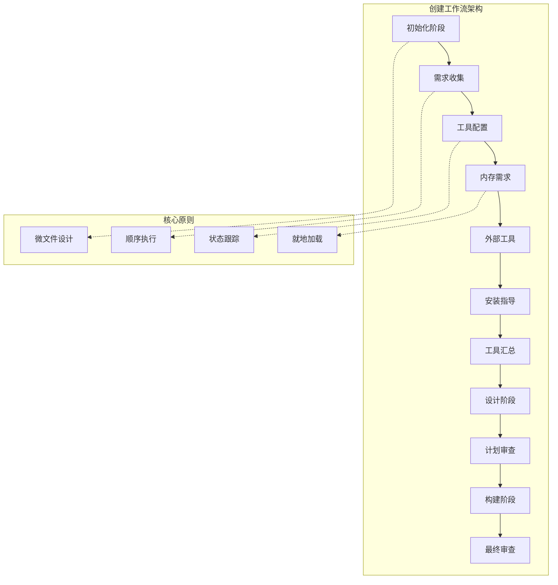
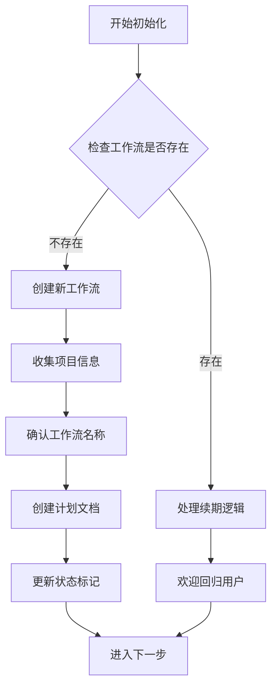
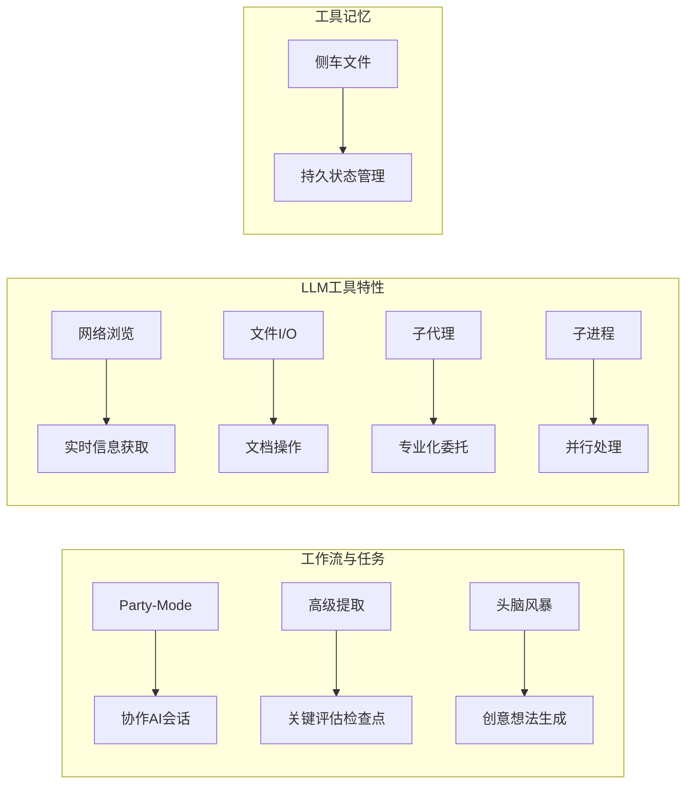
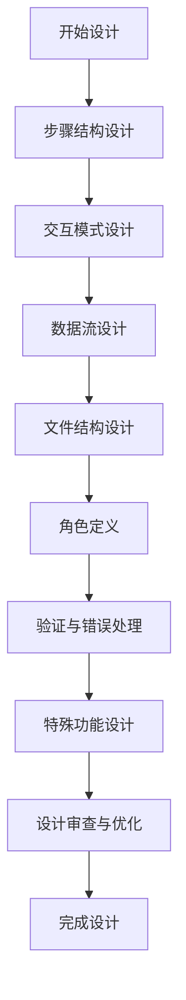
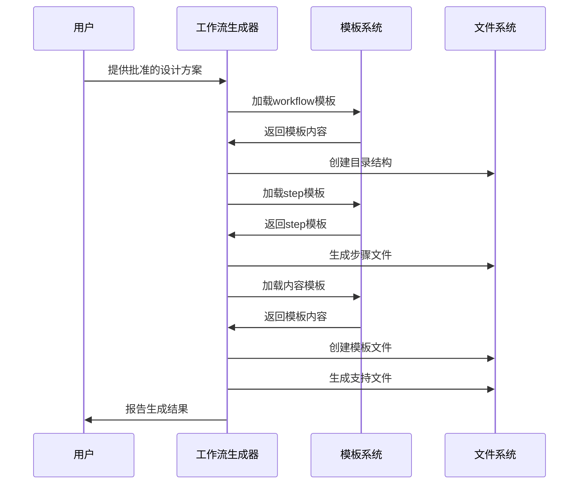
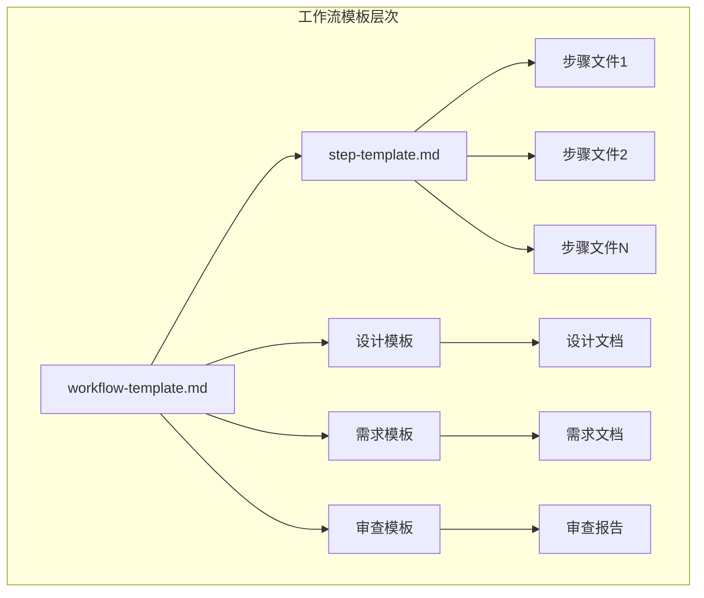
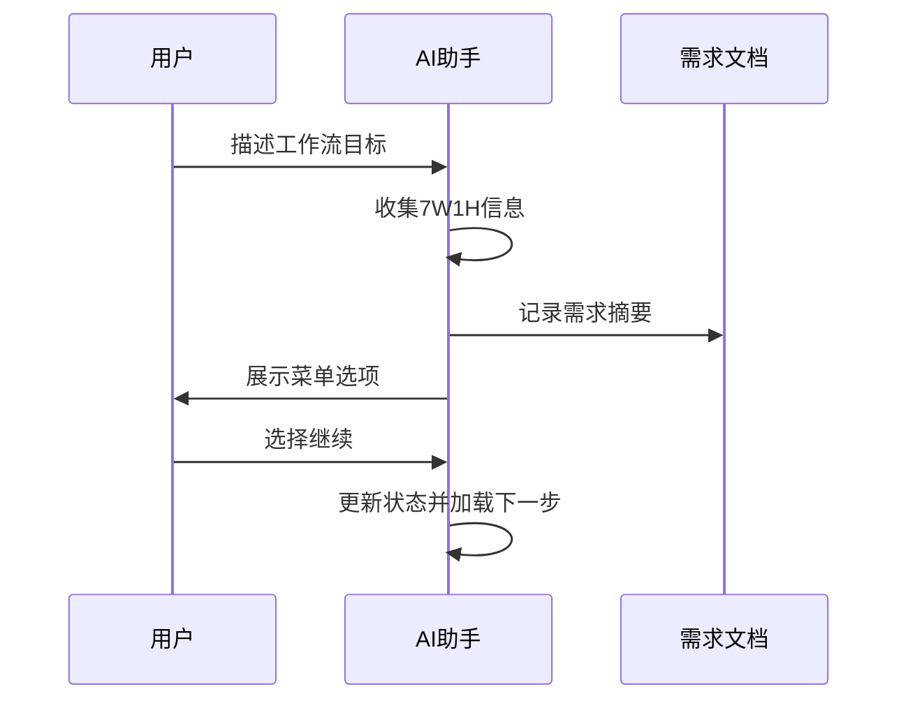
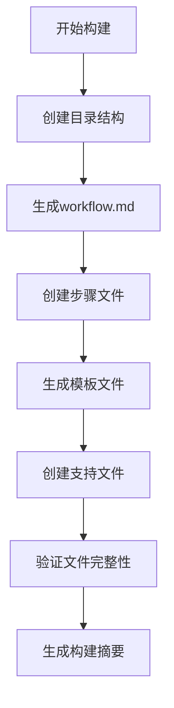
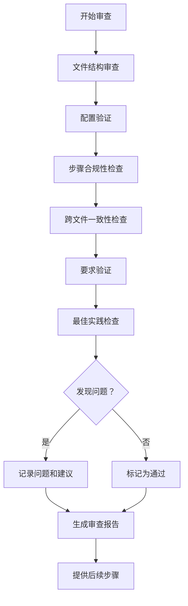

# 创建工作流

<cite>
**本文档中引用的文件**
- [workflow.md](file://src/modules/bmb/workflows/create-workflow/workflow.md)
- [step-01-init.md](file://src/modules/bmb/workflows/create-workflow/steps/step-01-init.md)
- [step-02-gather.md](file://src/modules/bmb/workflows/create-workflow/steps/step-02-gather.md)
- [step-04-core-tools.md](file://src/modules/bmb/workflows/create-workflow/steps/step-04-core-tools.md)
- [step-09-design.md](file://src/modules/bmb/workflows/create-workflow/steps/step-09-design.md)
- [step-11-build.md](file://src/modules/bmb/workflows/create-workflow/steps/step-11-build.md)
- [step-12-review.md](file://src/modules/bmb/workflows/create-workflow/steps/step-12-review.md)
- [workflow-template.md](file://src/modules/bmb/docs/workflows/workflow-template.md)
- [step-template.md](file://src/modules/bmb/docs/workflows/step-template.md)
- [requirements-section.md](file://src/modules/bmb/workflows/create-workflow/templates/requirements-section.md)
- [design-section.md](file://src/modules/bmb/workflows/create-workflow/templates/design-section.md)
- [review-section.md](file://src/modules/bmb/workflows/create-workflow/templates/review-section.md)
- [meal-prep-nutrition/workflow.md](file://src/modules/bmb/reference/workflows/meal-prep-nutrition/workflow.md)
- [meal-prep-nutrition/steps/step-01-init.md](file://src/modules/bmb/reference/workflows/meal-prep-nutrition/steps/step-01-init.md)
- [meal-prep-nutrition/steps/step-02-profile.md](file://src/modules/bmb/reference/workflows/meal-prep-nutrition/steps/step-02-profile.md)
</cite>

## 目录
1. [简介](#简介)
2. [工作流架构概述](#工作流架构概述)
3. [12个步骤详解](#12个步骤详解)
4. [核心组件分析](#核心组件分析)
5. [工作流设计原则](#工作流设计原则)
6. [简单与复杂工作流对比](#简单与复杂工作流对比)
7. [创建自定义工作流示例](#创建自定义工作流示例)
8. [审查机制](#审查机制)
9. [最佳实践](#最佳实践)
10. [总结](#总结)

## 简介

BMAD-METHOD的创建工作流功能是一个高度结构化和协作式的工作流程，旨在通过12个精心设计的步骤帮助用户创建高质量、可维护的BMAD工作流。该系统采用step-file架构，强调微文件设计、顺序执行和状态跟踪等核心原则。

创建工作流过程包含从需求收集到最终审查的完整生命周期管理，确保每个工作流都遵循BMAD-METHOD的架构规范和最佳实践。系统提供了丰富的模板、工具集成和质量保证机制，使用户能够创建出既满足业务需求又符合技术标准的工作流解决方案。

## 工作流架构概述

BMAD-METHOD创建工作流采用了严格的step-file架构，这一架构是整个系统的基础设计原则。

**图表来源**
- [workflow.md](file://src/modules/bmb/workflows/create-workflow/workflow.md#L17-L45)
- [step-01-init.md](file://src/modules/bmb/workflows/create-workflow/steps/step-01-init.md#L25-L61)

**章节来源**
- [workflow.md](file://src/modules/bmb/workflows/create-workflow/workflow.md#L1-L59)

## 12个步骤详解

创建工作流过程分为12个严格定义的步骤，每个步骤都有明确的目标、规则和输出要求。

### 步骤1：初始化 (step-01-init)

初始化阶段负责检测现有工作流状态，确认项目上下文，并为协作式工作流设计做好准备。

**图表来源**
- [step-01-init.md](file://src/modules/bmb/workflows/create-workflow/steps/step-01-init.md#L70-L148)

### 步骤2：需求收集 (step-02-gather)

step-02-gather是创建工作流过程中最关键的环节之一，专门负责通过协作对话收集全面的需求信息。

#### 需求收集框架

系统设计了完整的7W1H框架来确保需求收集的完整性：

| 需求类别 | 具体问题 | 设计考虑 |
|---------|---------|---------|
| 目的与范围 | 解决什么问题？主要用户是谁？预期成果是什么？ | 明确工作流的核心价值和目标用户群 |
| 类型分类 | 文档工作流、行动工作流、交互工作流还是自主工作流？ | 决定工作流的基本架构模式 |
| 流程结构 | 线性、循环、分支还是迭代模式？ | 影响步骤设计和用户交互方式 |
| 交互风格 | 高度协作还是主要自主？决策点在哪里？ | 确定AI与用户的协作程度 |
| 指令风格 | 基于意图还是处方式方法？ | 影响工作流的灵活性和可控性 |
| 输入要求 | 需要哪些前置文档或数据？ | 确保工作流的可行性 |
| 输出规格 | 主要输出是什么？格式要求如何？ | 定义工作流的交付物 |

**章节来源**
- [step-02-gather.md](file://src/modules/bmb/workflows/create-workflow/steps/step-02-gather.md#L1-L234)

### 步骤4：核心工具配置 (step-04-core-tools)

step-04-core-tools专注于配置BMAD系统提供的核心工具集，这些工具是工作流功能的基础支撑。

#### 核心工具分类与集成

**图表来源**
- [step-04-core-tools.md](file://src/modules/bmb/workflows/create-workflow/steps/step-04-core-tools.md#L53-L90)

**章节来源**
- [step-04-core-tools.md](file://src/modules/bmb/workflows/create-workflow/steps/step-04-core-tools.md#L1-L146)

### 步骤9：设计 (step-09-design)

step-09-design是协作式设计阶段，专注于基于收集到的需求和工具配置来设计工作流结构。

#### 设计原则应用

设计阶段严格遵循以下核心原则：

1. **微文件架构**：每个步骤都是独立且自包含的指令文件
2. **协作对话**：设计面向对话而非命令响应模式  
3. **顺序强制**：确保步骤间的逻辑依赖得到正确处理
4. **错误预防**：在设计阶段就考虑常见失败场景

**图表来源**
- [step-09-design.md](file://src/modules/bmb/workflows/create-workflow/steps/step-09-design.md#L78-L218)

**章节来源**
- [step-09-design.md](file://src/modules/bmb/workflows/create-workflow/steps/step-09-design.md#L1-L240)

### 步骤11：构建 (step-11-build)

step-11-build负责根据批准的设计方案生成所有工作流文件，包括主workflow.md文件、步骤文件、模板和支持文件。

#### 文件生成序列

**图表来源**
- [step-11-build.md](file://src/modules/bmb/workflows/create-workflow/steps/step-11-build.md#L78-L222)

**章节来源**
- [step-11-build.md](file://src/modules/bmb/workflows/create-workflow/steps/step-11-build.md#L1-L263)

### 步骤12：审查 (step-12-review)

step-12-review是创建工作流的最后阶段，负责全面审查生成的工作流，确保其符合BMAD-METHOD的架构规范和最佳实践。

#### 审查检查清单

| 审查维度 | 检查项目 | 质量标准 |
|---------|---------|---------|
| 文件结构 | 所有必需文件是否完整？目录结构是否正确？命名约定是否一致？ | 100% 符合 |
| 配置验证 | 元数据是否正确填写？路径变量格式是否正确？依赖声明是否完整？ | 100% 符合 |
| 步骤合规 | 每个步骤是否遵循模板结构？是否包含所有必需规则？菜单处理是否正确？ | 100% 符合 |
| 跨文件一致性 | 变量名称是否跨文件一致？路径引用是否统一？步骤序列是否逻辑正确？ | 100% 符合 |
| 要求验证 | 是否解决了原始问题？是否支持所有用户类型？输入输出是否符合指定？ | 100% 符合 |
| 最佳实践 | 文件大小是否合理？是否实现了协作对话？是否包含适当的错误处理？ | 95%以上 |

**章节来源**
- [step-12-review.md](file://src/modules/bmb/workflows/create-workflow/steps/step-12-review.md#L1-L271)

## 核心组件分析

### 工作流模板系统

BMAD-METHOD提供了标准化的模板系统来确保工作流的一致性和质量。

#### 模板层次结构

**图表来源**
- [workflow-template.md](file://src/modules/bmb/docs/workflows/workflow-template.md#L1-L153)
- [step-template.md](file://src/modules/bmb/docs/workflows/step-template.md#L1-L284)

**章节来源**
- [workflow-template.md](file://src/modules/bmb/docs/workflows/workflow-template.md#L1-L153)
- [step-template.md](file://src/modules/bmb/docs/workflows/step-template.md#L1-L284)

### 工具集成机制

系统提供了灵活的工具集成机制，允许工作流根据需要选择和配置不同的工具。

#### 工具配置流程

**图表来源**
- [step-04-core-tools.md](file://src/modules/bmb/workflows/create-workflow/steps/step-04-core-tools.md#L46-L90)

## 工作流设计原则

### 微文件设计原则

每个步骤都被设计为独立的、自包含的指令文件，这种设计带来了以下优势：

1. **可维护性**：单个文件易于理解和修改
2. **可重用性**：步骤可以在不同工作流中重复使用
3. **可测试性**：每个步骤可以独立测试
4. **可扩展性**：新步骤可以轻松添加到现有工作流中

### 顺序执行原则

系统严格遵循步骤顺序执行，不允许跳过或优化序列：

### 状态跟踪原则

每个工作流都维护详细的进度状态，通过frontmatter中的`stepsCompleted`数组来跟踪已完成的步骤。

**章节来源**
- [workflow.md](file://src/modules/bmb/workflows/create-workflow/workflow.md#L17-L45)

## 简单与复杂工作流对比

### 简单工作流示例：Meal Prep & Nutrition Plan

Meal Prep工作流展示了线性工作流的最佳实践：

#### 结构特点
- **步骤数量**：6个主要步骤
- **执行模式**：线性顺序执行
- **交互风格**：高度协作对话
- **文件组织**：简洁明了的目录结构

#### 步骤序列
1. 初始化 → 2. 用户档案 → 3. 评估 → 4. 策略制定 → 5. 购物清单 → 6. 准备计划

### 复杂工作流示例：Create Workflow

创建工作流本身就是一个复杂的多阶段工作流：

#### 结构特点
- **步骤数量**：12个详细步骤
- **执行模式**：包含设计、构建、审查等多个阶段
- **交互风格**：协作设计 + 自动化生成
- **文件组织**：包含模板、参考文件、支持文件等

#### 步骤序列
1. 初始化 → 2. 需求收集 → 3. 工具概览 → 4. 核心工具 → 5. 内存需求 → 6. 外部工具 → 7. 安装指导 → 8. 工具汇总 → 9. 设计 → 10. 计划审查 → 11. 构建 → 12. 审查

### 结构差异分析

| 特征 | 简单工作流 | 复杂工作流 |
|------|-----------|-----------|
| 步骤数量 | 3-6步 | 8-12步 |
| 设计复杂度 | 直接实现 | 协作设计 |
| 自动生成 | 否 | 是 |
| 审查阶段 | 简单验证 | 详细检查 |
| 工具集成 | 基础工具 | 全面工具链 |
| 输出形式 | 最终产品 | 中间产物+最终产品 |

**章节来源**
- [meal-prep-nutrition/workflow.md](file://src/modules/bmb/reference/workflows/meal-prep-nutrition/workflow.md#L1-L59)
- [meal-prep-nutrition/steps/step-01-init.md](file://src/modules/bmb/reference/workflows/meal-prep-nutrition/steps/step-01-init.md#L1-L178)

## 创建自定义工作流示例

以下是一个完整的创建工作流示例，展示从需求收集到最终审查的全过程：

### 示例：用户故事生成器工作流

#### 第一步：需求收集阶段

**图表来源**
- [step-02-gather.md](file://src/modules/bmb/workflows/create-workflow/steps/step-02-gather.md#L192-L208)

#### 第二步：设计阶段

基于收集到的需求，设计工作流结构：

1. **工作流类型**：文档生成工作流
2. **执行模式**：线性顺序执行
3. **交互风格**：协作对话
4. **步骤规划**：
   - 步骤1：项目背景收集
   - 步骤2：用户故事模板选择
   - 步骤3：用户故事编写
   - 步骤4：用户故事审查
   - 步骤5：输出生成

#### 第三步：构建阶段

按照设计生成实际文件：

**图表来源**
- [step-11-build.md](file://src/modules/bmb/workflows/create-workflow/steps/step-11-build.md#L78-L222)

#### 第四步：审查阶段

进行全面的质量检查：

1. **文件结构检查**：确认所有必需文件存在
2. **配置验证**：检查元数据和路径设置
3. **步骤合规性**：验证每个步骤的模板遵循情况
4. **跨文件一致性**：确保变量和路径引用一致
5. **要求验证**：确认解决了原始需求
6. **最佳实践**：检查是否遵循设计原则

**章节来源**
- [step-02-gather.md](file://src/modules/bmb/workflows/create-workflow/steps/step-02-gather.md#L192-L234)
- [step-09-design.md](file://src/modules/bmb/workflows/create-workflow/steps/step-09-design.md#L191-L240)
- [step-11-build.md](file://src/modules/bmb/workflows/create-workflow/steps/step-11-build.md#L78-L263)
- [step-12-review.md](file://src/modules/bmb/workflows/create-workflow/steps/step-12-review.md#L68-L271)

## 审查机制

BMAD-METHOD的审查机制确保每个创建工作流都符合架构规范和质量标准。

### 审查流程

**图表来源**
- [step-12-review.md](file://src/modules/bmb/workflows/create-workflow/steps/step-12-review.md#L68-L221)

### 合规检查指导

审查完成后，系统提供详细的合规检查指导：

1. **启动新对话上下文**：确保客观验证
2. **运行合规检查命令**：使用特定的检查工具
3. **提供工作流路径**：指向具体的工作流文件
4. **遵循验证流程**：识别和修复违规项

**章节来源**
- [step-12-review.md](file://src/modules/bmb/workflows/create-workflow/steps/step-12-review.md#L221-L271)

## 最佳实践

### 工作流设计最佳实践

1. **保持步骤聚焦**：每个步骤应该有一个明确的目标
2. **遵循模板结构**：严格按照模板格式创建文件
3. **确保命名一致性**：使用一致的变量和文件命名约定
4. **包含适当错误处理**：在每个步骤中考虑可能的失败场景
5. **维护协作对话**：避免命令式语言，使用对话式交互

### 开发过程最佳实践

1. **逐步验证**：在每个阶段完成后进行验证
2. **文档驱动**：始终以文档为中心进行开发
3. **用户参与**：在整个过程中保持用户的积极参与
4. **质量优先**：优先考虑质量而非速度
5. **持续改进**：基于反馈不断优化工作流

### 工具使用最佳实践

1. **合理选择工具**：根据工作流需求选择合适的工具
2. **正确配置集成**：确保工具在合适的位置集成
3. **充分利用模板**：使用现有的模板减少重复工作
4. **保持工具更新**：定期更新和维护使用的工具
5. **文档化工具使用**：清楚记录工具的使用方式和目的

## 总结

BMAD-METHOD的创建工作流功能代表了现代软件工程中工作流设计的最佳实践。通过12个精心设计的步骤，系统提供了一个从需求收集到最终部署的完整生命周期管理方案。

### 核心优势

1. **结构化方法**：严格的步骤顺序确保工作流的质量和一致性
2. **协作导向**：强调用户和AI之间的协作关系
3. **质量保证**：多层次的审查机制确保输出质量
4. **可扩展性**：模块化设计支持各种复杂度的工作流
5. **标准化**：统一的模板和规范确保系统的一致性

### 应用价值

创建工作流功能不仅适用于BMAD-METHOD生态系统内部的工作流创建，其设计理念和方法论也可以应用于其他领域的工作流设计和开发。通过遵循这些原则和最佳实践，开发者可以创建出更加健壮、可维护和用户友好的工作流解决方案。

该系统证明了在人工智能时代，通过合理的架构设计和严格的流程控制，可以有效地将复杂的软件开发过程标准化和自动化，同时保持足够的灵活性来适应不同的业务需求和技术挑战。