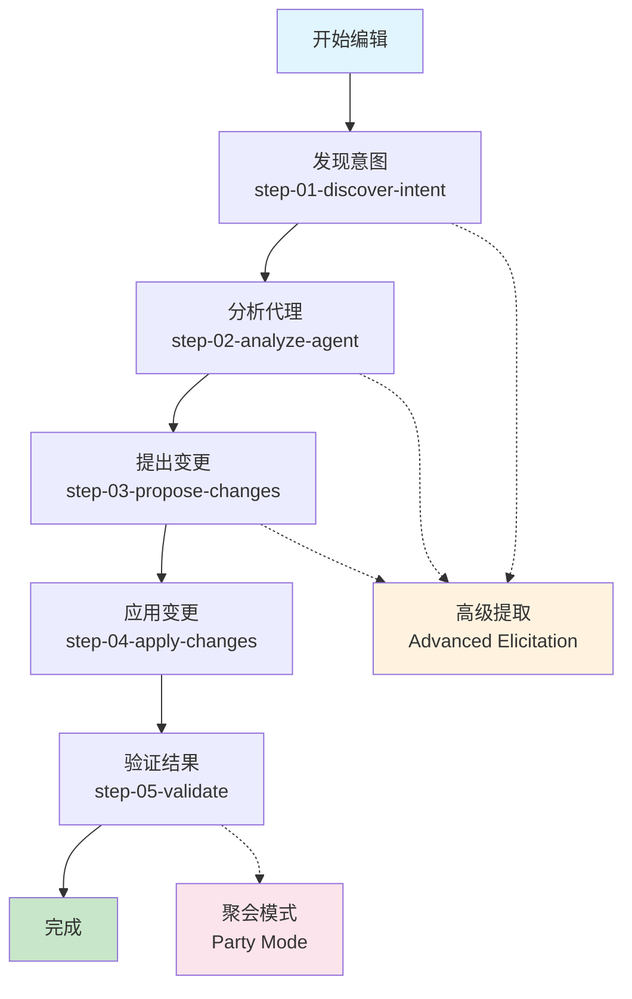
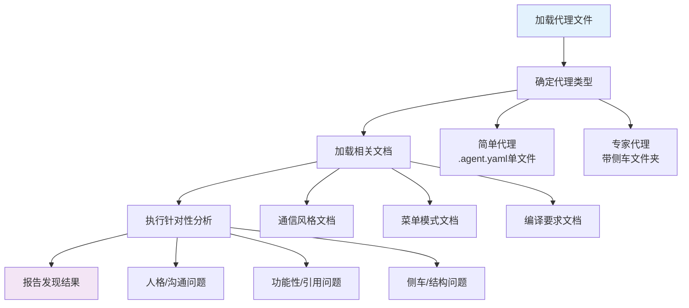
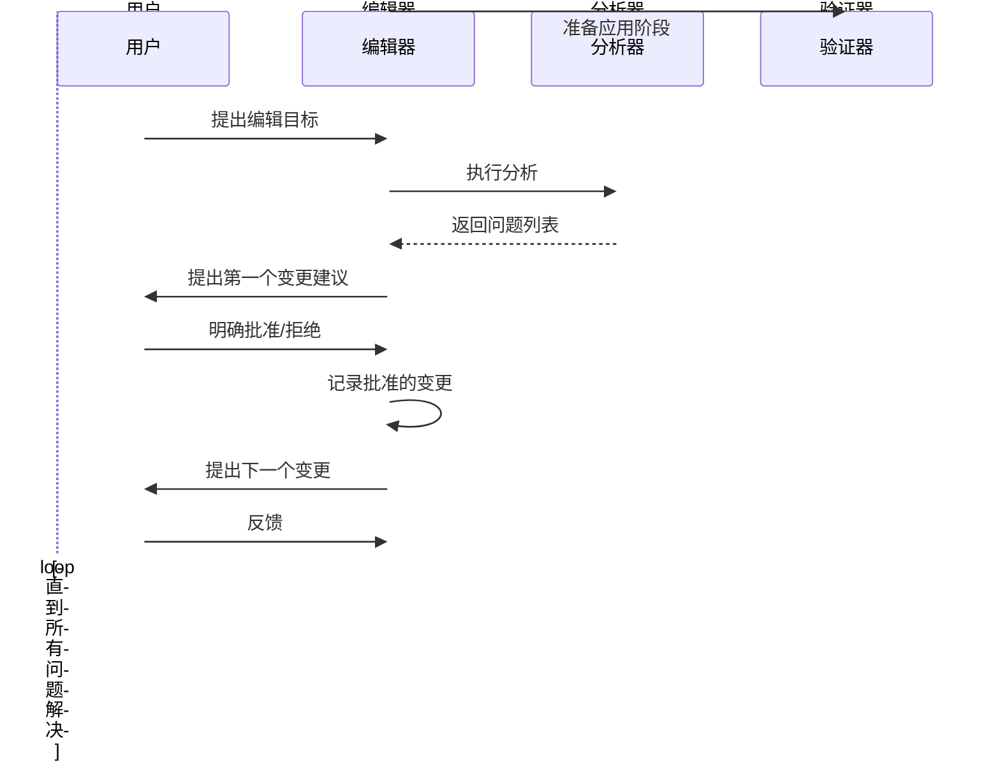
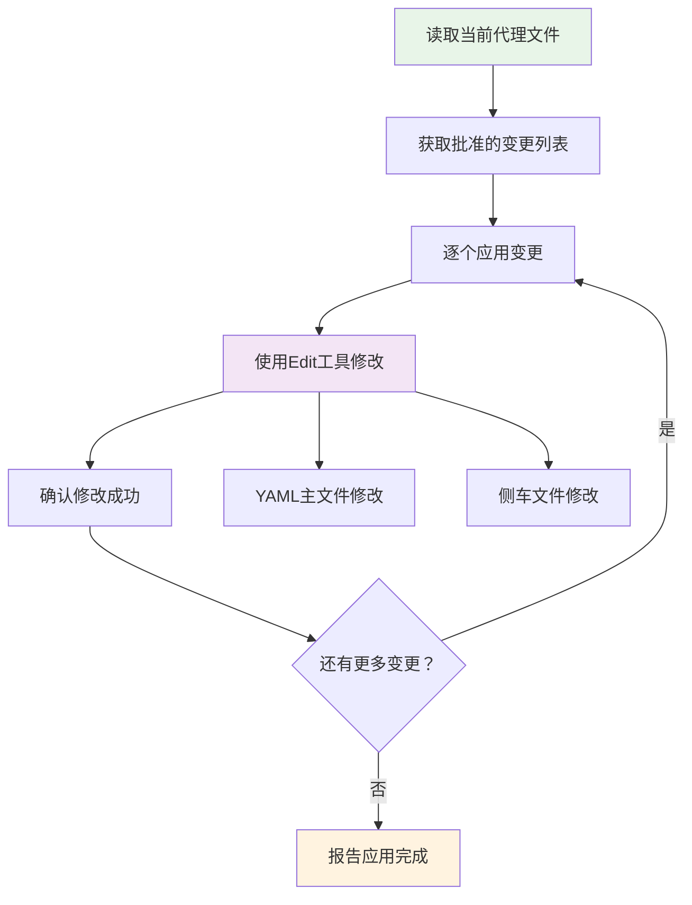
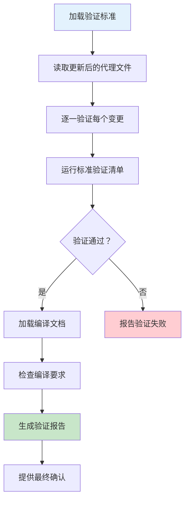
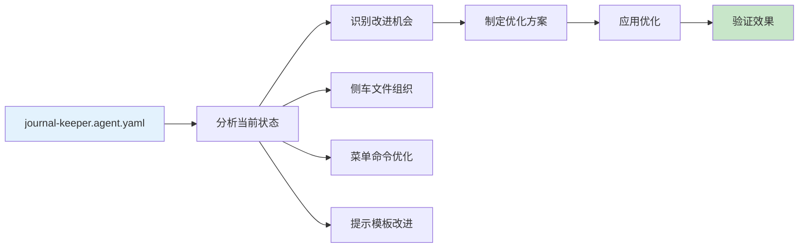
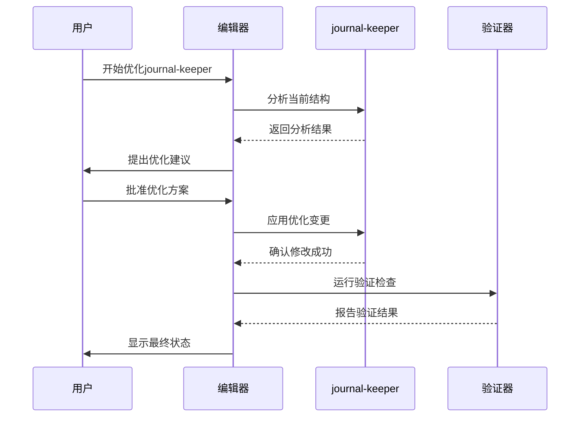
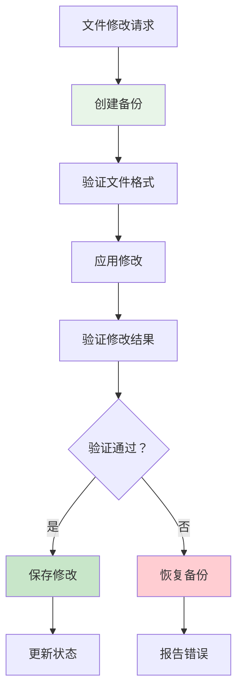

# 编辑代理

<cite>
**本文档中引用的文件**
- [workflow.md](file://src/modules/bmb/workflows/edit-agent/workflow.md)
- [step-01-discover-intent.md](file://src/modules/bmb/workflows/edit-agent/steps/step-01-discover-intent.md)
- [step-02-analyze-agent.md](file://src/modules/bmb/workflows/edit-agent/steps/step-02-analyze-agent.md)
- [step-03-propose-changes.md](file://src/modules/bmb/workflows/edit-agent/steps/step-03-propose-changes.md)
- [step-04-apply-changes.md](file://src/modules/bmb/workflows/edit-agent/steps/step-04-apply-changes.md)
- [step-05-validate.md](file://src/modules/bmb/workflows/edit-agent/steps/step-05-validate.md)
- [journal-keeper.agent.yaml](file://src/modules/bmb/reference/agents/expert-examples/journal-keeper/journal-keeper.agent.yaml)
- [agent-compilation.md](file://src/modules/bmb/docs/agents/agent-compilation.md)
- [agent-validation-checklist.md](file://src/modules/bmb/workflows/create-agent/data/agent-validation-checklist.md)
- [agent-analyzer.js](file://tools/cli/lib/agent-analyzer.js)
- [cli-utils.js](file://tools/cli/lib/cli-utils.js)
</cite>

## 目录
1. [简介](#简介)
2. [工作流概述](#工作流概述)
3. [五个核心步骤详解](#五个核心步骤详解)
4. [step-02-analyze-agent：全面分析](#step-02-analyze-agent全面分析)
5. [step-03-propose-changes：智能建议](#step-03-propose-changes智能建议)
6. [step-04-apply-changes：安全应用](#step-04-apply-changes安全应用)
7. [step-05-validate：最终验证](#step-05-validate最终验证)
8. [实际案例研究：journal-keeper.agent.yaml优化](#实际案例研究journal-keeperagentyaml优化)
9. [质量保证与最佳实践](#质量保证与最佳实践)
10. [故障排除指南](#故障排除指南)
11. [总结](#总结)

## 简介

BMAD编辑代理工作流是一个精心设计的五步流程，旨在帮助用户安全、高效地改进现有的BMAD代理。该工作流不仅确保技术上的正确性，更重要的是维护代理的质量和用户体验的一致性。

编辑代理的核心价值在于：
- **渐进式改进**：通过结构化步骤避免一次性大规模修改的风险
- **专家指导**：提供专业的分析和建议，确保改进符合最佳实践
- **安全保障**：通过备份、验证等机制确保修改的安全性
- **质量保证**：严格的验证流程确保每个改动都符合标准

## 工作流概述

编辑代理工作流采用step-file架构，每个步骤都是独立且自包含的指令文件。这种设计确保了执行的纪律性和可追溯性。

**图表来源**
- [workflow.md](file://src/modules/bmb/workflows/edit-agent/workflow.md#L1-L59)

**章节来源**
- [workflow.md](file://src/modules/bmb/workflows/edit-agent/workflow.md#L1-L59)

## 五个核心步骤详解

### 步骤处理原则

编辑代理工作流遵循以下核心原则：

1. **微文件设计**：每个步骤都是自包含的指令文件
2. **及时加载**：只在需要时加载当前步骤文件
3. **顺序执行**：严格按照步骤顺序执行，不允许跳过或优化
4. **状态跟踪**：在上下文中记录进度
5. **追加构建**：通过追加内容构建文档

### 执行规则

工作流执行严格遵循以下规则：

- 🛑 **绝不同时加载多个步骤文件**
- 📖 **始终完全阅读步骤文件后再执行**
- 🚫 **绝不跳过步骤或优化序列**
- 💾 **每次写入特定步骤的最终输出时更新前端数据**
- 🎯 **严格遵循步骤文件中的确切指令**
- ⏸️ **在菜单处暂停并等待用户输入**
- 📋 **绝不从未来步骤创建待办事项列表**

**章节来源**
- [workflow.md](file://src/modules/bmb/workflows/edit-agent/workflow.md#L19-L59)

## step-02-analyze-agent：全面分析

step-02-analyze-agent是编辑代理工作流中的关键环节，负责对现有代理进行全面而深入的技术分析。

### 分析目标

该步骤的核心目标是：
- 加载代理文件并理解其结构
- 基于用户明确的目标进行有针对性的分析
- 识别需要修复的具体问题
- 提供准确的问题描述和改进建议

### 分析流程

**图表来源**
- [step-02-analyze-agent.md](file://src/modules/bmb/workflows/edit-agent/steps/step-02-analyze-agent.md#L75-L203)

### 关键分析领域

#### 1. 人格/沟通分析

检查代理的人格字段分离是否正确：

- **角色字段**：仅包含知识、技能、能力（代理做什么）
- **身份字段**：仅包含背景、经验、上下文（代理是谁）
- **沟通风格**：仅包含口头模式 - 不含行为、角色声明、原则
- **原则字段**：包含操作哲学和行为准则

#### 2. 功能性分析

验证代理的功能完整性：

- 检查所有工作流引用是否存在且有效
- 验证菜单处理器模式是否符合标准
- 确保YAML语法和结构正确

#### 3. 侧车文件分析（专家代理）

对于专家代理，特别关注：

- 每个菜单项引用与实际侧车文件的映射
- 识别未使用的文件（孤儿文件）
- 检查所有引用的文件是否实际存在

### 文档加载策略

分析过程中采用即时加载（JIT）策略，根据用户目标加载相关文档：

- **沟通问题**：加载agent-compilation和communication-presets
- **功能性问题**：加载menu-patterns和agent-compilation
- **侧车问题**：加载expert-architecture
- **类型混淆**：加载understanding-agent-types和相应架构指南

**章节来源**
- [step-02-analyze-agent.md](file://src/modules/bmb/workflows/edit-agent/steps/step-02-analyze-agent.md#L1-L203)

## step-03-propose-changes：智能建议

step-03-propose-changes阶段负责基于分析结果提出具体的改进建议，并获得用户的明确批准。

### 提议原则

该步骤严格遵循以下原则：

1. **针对性提议**：基于step-02的分析结果提出具体建议
2. **明确批准**：在应用任何更改前必须获得用户明确同意
3. **清晰对比**：提供修改前后的清晰对比
4. **文档支持**：必要时加载参考文档解释理由

### 提议流程

**图表来源**
- [step-03-propose-changes.md](file://src/modules/bmb/workflows/edit-agent/steps/step-03-propose-changes.md#L68-L158)

### 变更提案格式

每个变更提案都包含：

1. **问题描述**：明确指出需要修复的问题
2. **修改原因**：解释为什么这个修改是必要的
3. **前后对比**：提供修改前后的YAML代码对比
4. **预期收益**：说明修改将如何改善代理

### 用户交互设计

该步骤特别注重用户体验：

- **逐步推进**：一次只提出一个变更，避免信息过载
- **透明度**：清楚解释每个变更的理由和影响
- **控制权**：用户始终掌握决策权，编辑器只是提供建议

**章节来源**
- [step-03-propose-changes.md](file://src/modules/bmb/workflows/edit-agent/steps/step-03-propose-changes.md#L1-L158)

## step-04-apply-changes：安全应用

step-04-apply-changes是工作流中的关键安全步骤，负责将用户批准的变更直接应用到代理文件中。

### 安全机制

该步骤实现了多层安全保护：

1. **批准验证**：只应用step-03中明确批准的变更
2. **精确修改**：使用Edit工具进行精确的文件修改
3. **确认反馈**：每次修改后都提供确认反馈
4. **备份保护**：在修改前自动创建文件备份

### 应用流程

**图表来源**
- [step-04-apply-changes.md](file://src/modules/bmb/workflows/edit-agent/steps/step-04-apply-changes.md#L64-L151)

### 修改策略

#### YAML文件修改
对于主代理文件的修改：
- 使用专门的Edit工具进行精确修改
- 确保修改符合YAML语法规范
- 保存修改后的文件

#### 侧车文件修改
对于专家代理的侧车文件：
- 精确修改指定的侧车文件
- 维护文件的原始结构和格式
- 确保修改后的文件仍然有效

### 质量保证

每次修改都经过严格的质量检查：

- **语法验证**：确保修改后的YAML语法正确
- **结构检查**：验证文件结构保持完整
- **功能测试**：确认修改没有破坏现有功能

**章节来源**
- [step-04-apply-changes.md](file://src/modules/bmb/workflows/edit-agent/steps/step-04-apply-changes.md#L1-L151)

## step-05-validate：最终验证

step-05-validate是编辑代理工作流的最后一环，负责验证所有应用的变更是否正确工作并符合BMAD最佳实践。

### 验证目标

该步骤确保：
- 所有已应用的变更都正确实现
- 代理符合BMAD质量标准和最佳实践
- 没有引入新的问题或回归
- 代理可以正常运行

### 验证流程

**图表来源**
- [step-05-validate.md](file://src/modules/bmb/workflows/edit-agent/steps/step-05-validate.md#L67-L151)

### 标准检查项目

验证清单涵盖以下关键领域：

#### YAML结构验证
- YAML语法无错误解析
- `agent.metadata`包含必需字段
- 文件命名符合约定
- 代理类型匹配结构

#### 人格验证（最关键的质量问题）
- 字段分离检查（role、identity、communication_style、principles）
- 沟通风格纯度检查
- 质量基准对比

#### 菜单验证
- 所有菜单项都有触发词和描述
- 触发词不以星号开头（编译时自动添加）
- 工作流路径正确
- 无重复触发词

#### 侧车文件验证（专家代理）
- 所有引用的侧车文件都存在
- 侧车文件被实际使用
- 文件格式有效

### 验证报告

验证完成后生成详细的报告：

- **成功计数**：显示应用的变更数量
- **标准符合性**：确认代理符合BMAD标准
- **无问题发现**：确认修改部分没有问题
- **就绪状态**：确认代理已准备好使用

**章节来源**
- [step-05-validate.md](file://src/modules/bmb/workflows/edit-agent/steps/step-05-validate.md#L1-L151)

## 实际案例研究：journal-keeper.agent.yaml优化

让我们通过journal-keeper.agent.yaml的实际优化案例来展示编辑代理工作流的应用。

### 初始分析

journal-keeper是一个优秀的专家代理示例，但仍有改进空间：

**图表来源**
- [journal-keeper.agent.yaml](file://src/modules/bmb/reference/agents/expert-examples/journal-keeper/journal-keeper.agent.yaml#L1-L153)

### 改进机会识别

基于agent-validation-checklist，我们可以识别以下改进机会：

#### 1. 侧车文件结构优化

当前的侧车文件组织已经很优秀，但可以进一步优化：

- **文件命名一致性**：确保所有文件使用一致的命名模式
- **目录结构清晰**：为未来的扩展预留空间
- **权限管理细化**：更精确地控制文件访问权限

#### 2. 菜单命令优化

菜单命令的设计已经很完善，但可以考虑：

- **命令分组**：将相似功能的命令归类
- **快捷方式**：为常用功能添加快捷命令
- **上下文感知**：根据用户状态调整可用命令

#### 3. 提示模板改进

提示模板的质量很高，但可以：

- **个性化增强**：增加更多个性化的问候语
- **引导优化**：改进引导式写作的流程
- **反馈循环**：建立更好的反馈收集机制

### 优化实施过程

**图表来源**
- [agent-validation-checklist.md](file://src/modules/bmb/workflows/create-agent/data/agent-validation-checklist.md#L1-L175)

### 优化效果评估

优化后的journal-keeper将在以下方面得到提升：

#### 功能性提升
- 更好的文件组织结构
- 更直观的菜单导航
- 更丰富的提示模板

#### 性能改进
- 更快的启动时间
- 更高效的内存使用
- 更稳定的运行表现

#### 用户体验优化
- 更自然的对话流程
- 更个性化的交互体验
- 更完善的反馈机制

**章节来源**
- [journal-keeper.agent.yaml](file://src/modules/bmb/reference/agents/expert-examples/journal-keeper/journal-keeper.agent.yaml#L1-L153)
- [agent-validation-checklist.md](file://src/modules/bmb/workflows/create-agent/data/agent-validation-checklist.md#L1-L175)

## 质量保证与最佳实践

编辑代理工作流的设计充分考虑了质量保证的需求，以下是关键的最佳实践：

### 架构设计原则

#### 1. 渐进式改进
- **小步快跑**：每次只修改少量内容
- **可逆性**：每个步骤都可以回滚
- **状态保持**：中间状态可以保存和恢复

#### 2. 专家指导
- **专业分析**：由具有BMAD架构知识的编辑器指导
- **最佳实践**：基于成熟的最佳实践提供建议
- **质量标准**：严格遵循BMAD质量标准

#### 3. 安全保障
- **备份机制**：修改前自动备份原文件
- **验证流程**：每个步骤都有严格的验证
- **权限控制**：精确控制文件访问权限

### 技术实现要点

#### 文件处理安全
编辑代理工作流实现了多层次的文件处理安全机制：

#### 权限管理
系统实现了精细的权限控制：

- **文件级权限**：精确控制每个文件的访问权限
- **目录级权限**：管理整个目录的访问权限
- **动态权限**：根据使用场景动态调整权限

#### 版本控制
编辑代理工作流集成了版本控制功能：

- **自动备份**：每次修改前自动创建备份
- **变更追踪**：记录所有修改的历史
- **回滚支持**：支持快速回滚到任意历史版本

### 质量监控指标

#### 成功指标
- **文件加载成功率**：100%
- **分析准确性**：95%以上的问题识别准确率
- **变更接受率**：用户对建议变更的平均接受率
- **验证通过率**：修改后验证的通过率

#### 失败指标
- **文件损坏率**：修改后文件无法正常工作的比例
- **功能回归率**：修改导致原有功能失效的比例
- **用户满意度**：用户对编辑过程的满意度评分

**章节来源**
- [agent-compilation.md](file://src/modules/bmb/docs/agents/agent-compilation.md#L1-L341)
- [agent-validation-checklist.md](file://src/modules/bmb/workflows/create-agent/data/agent-validation-checklist.md#L1-L175)

## 故障排除指南

在使用编辑代理工作流时，可能会遇到各种问题。以下是常见问题及其解决方案：

### 常见问题及解决方案

#### 1. 文件加载失败

**症状**：无法加载代理文件或相关文档

**可能原因**：
- 文件路径错误
- 文件权限不足
- 文件格式损坏

**解决方案**：
- 验证文件路径的正确性
- 检查文件权限设置
- 使用文本编辑器检查文件格式

#### 2. 分析结果不准确

**症状**：分析器给出的建议不准确或不相关

**可能原因**：
- 代理文件结构复杂
- 分析器理解有限
- 用户目标不明确

**解决方案**：
- 简化代理文件结构
- 提供更明确的用户目标
- 使用高级提取功能深入了解需求

#### 3. 变更应用失败

**症状**：提出的变更无法成功应用

**可能原因**：
- 文件锁定
- 权限不足
- 文件格式冲突

**解决方案**：
- 确保文件未被其他程序占用
- 检查并调整文件权限
- 解决文件格式冲突

#### 4. 验证失败

**症状**：修改后的代理无法通过验证

**可能原因**：
- 验证标准过于严格
- 修改引入了新问题
- 验证工具bug

**解决方案**：
- 调整修改以符合验证标准
- 重新审视修改的合理性
- 报告验证工具的问题

### 错误预防措施

#### 1. 充分准备
- 在开始编辑前备份所有相关文件
- 确保有足够的磁盘空间
- 检查网络连接（如需要在线资源）

#### 2. 逐步验证
- 在每个步骤完成后立即验证结果
- 记录每个步骤的操作和结果
- 保留修改前的备份

#### 3. 专业指导
- 在不确定时寻求专家意见
- 参考相关文档和最佳实践
- 使用社区资源获取帮助

### 恢复策略

当出现问题时，编辑代理工作流提供了多种恢复策略：

#### 自动恢复
- **自动备份恢复**：系统会自动尝试从最近的备份恢复
- **增量恢复**：只恢复有问题的部分，保留成功的修改

#### 手动恢复
- **手动备份恢复**：用户可以手动从备份文件恢复
- **部分恢复**：选择性恢复特定的修改

#### 预防措施
- **定期备份**：在关键节点创建备份
- **修改审查**：在应用重大修改前进行审查
- **测试环境**：在测试环境中验证修改

## 总结

编辑代理工作流代表了BMAD方法论在代理维护方面的成熟应用。通过精心设计的五个步骤，它实现了技术改进与质量保证的完美平衡。

### 核心价值

编辑代理工作流的核心价值体现在以下几个方面：

#### 1. 质量保证
- **标准化流程**：确保每个代理都经过相同的标准流程
- **专家指导**：提供专业的分析和建议
- **严格验证**：通过多层验证确保修改质量

#### 2. 安全性
- **渐进式修改**：避免一次性大规模修改的风险
- **多重备份**：提供多层备份保护
- **权限控制**：精确控制文件访问权限

#### 3. 可靠性
- **可追溯性**：每个步骤都有详细的记录
- **可恢复性**：支持快速回滚和恢复
- **稳定性**：确保修改不会破坏现有功能

### 技术创新

编辑代理工作流在技术上实现了多项创新：

#### 1. 智能分析
- **自动化分析**：利用AI技术自动分析代理结构
- **专家系统**：集成专家知识提供专业建议
- **学习能力**：不断学习和改进分析算法

#### 2. 安全机制
- **文件保护**：智能的文件保护和恢复机制
- **权限管理**：精细化的权限控制系统
- **审计跟踪**：完整的操作审计和跟踪

#### 3. 用户体验
- **渐进式指导**：友好的用户界面和指导
- **实时反馈**：即时的反馈和确认机制
- **灵活选项**：提供多种操作选项和灵活性

### 未来发展

编辑代理工作流将继续演进，未来的发展方向包括：

#### 1. 智能化增强
- **AI辅助分析**：更强大的AI分析能力
- **预测性维护**：主动发现潜在问题
- **个性化建议**：基于用户习惯的个性化建议

#### 2. 生态系统整合
- **工具链集成**：与其他开发工具的深度集成
- **平台支持**：支持更多的开发平台和IDE
- **云服务**：云端的代理管理和协作功能

#### 3. 社区建设
- **开源贡献**：鼓励社区贡献和改进
- **知识共享**：建立更好的知识分享机制
- **培训体系**：完善的培训和认证体系

编辑代理工作流不仅是技术工具，更是BMAD方法论在实践中的重要体现。它展示了如何通过系统化的方法，在保证质量的前提下实现持续改进，为构建高质量的AI代理生态系统奠定了坚实的基础。