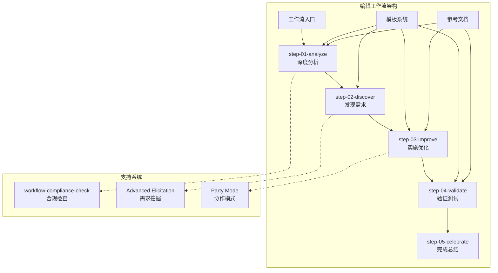
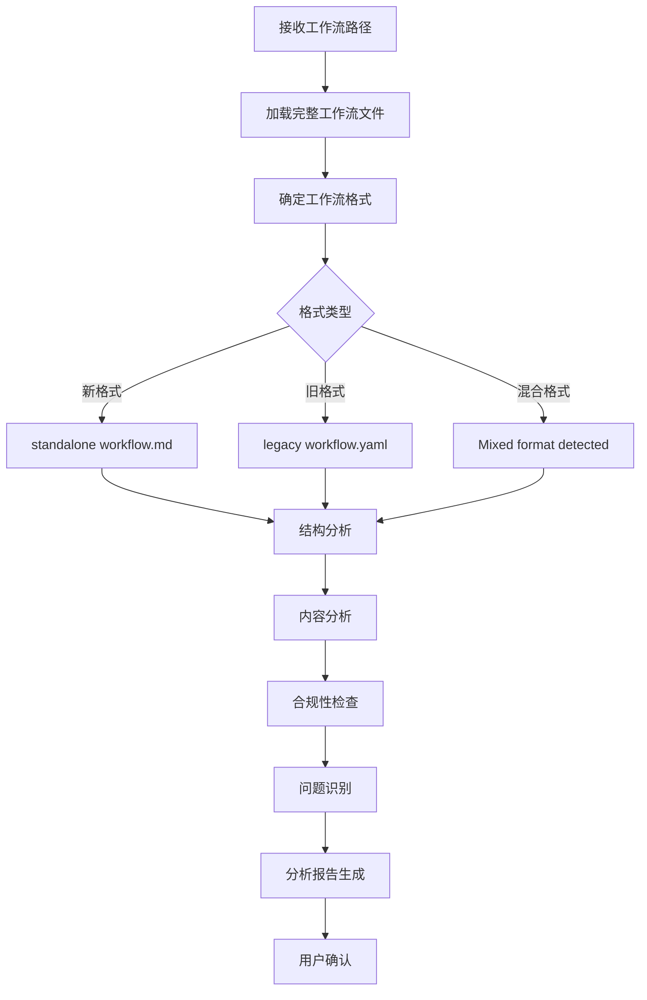
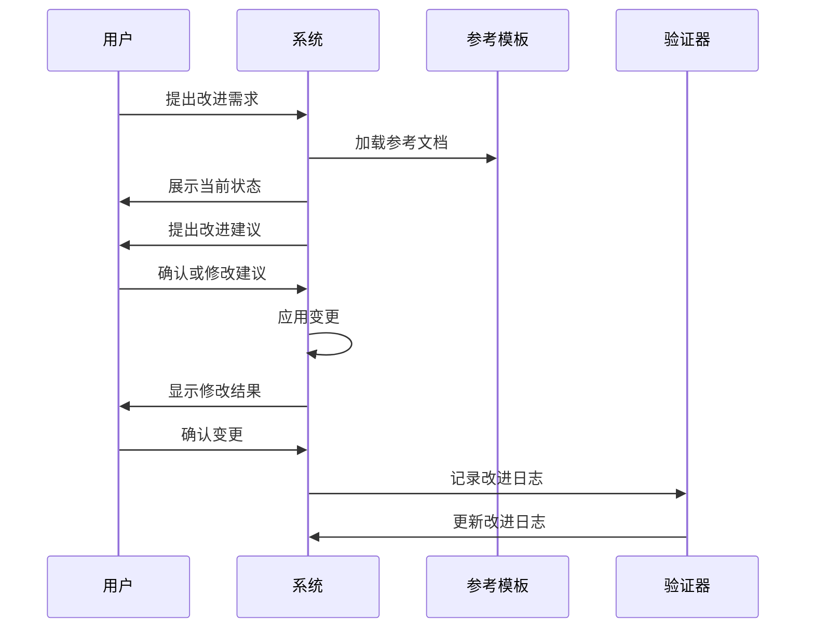
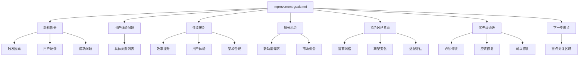

# 编辑工作流

<cite>
**本文档中引用的文件**
- [workflow.md](file://src/modules/bmb/workflows/edit-workflow/workflow.md)
- [step-01-analyze.md](file://src/modules/bmb/workflows/edit-workflow/steps/step-01-analyze.md)
- [step-02-discover.md](file://src/modules/bmb/workflows/edit-workflow/steps/step-02-discover.md)
- [step-03-improve.md](file://src/modules/bmb/workflows/edit-workflow/steps/step-03-improve.md)
- [step-04-validate.md](file://src/modules/bmb/workflows/edit-workflow/steps/step-04-validate.md)
- [improvement-goals.md](file://src/modules/bmb/workflows/edit-workflow/templates/improvement-goals.md)
- [workflow-analysis.md](file://src/modules/bmb/workflows/edit-workflow/templates/workflow-analysis.md)
- [improvement-log.md](file://src/modules/bmb/workflows/edit-workflow/templates/improvement-log.md)
- [validation-results.md](file://src/modules/bmb/workflows/edit-workflow/templates/validation-results.md)
- [completion-summary.md](file://src/modules/bmb/workflows/edit-workflow/templates/completion-summary.md)
- [workflow-compliance-check/workflow.md](file://src/modules/bmb/workflows/workflow-compliance-check/workflow.md)
- [architecture.md](file://src/modules/bmb/docs/workflows/architecture.md)
</cite>

## 目录
1. [简介](#简介)
2. [系统架构概述](#系统架构概述)
3. [编辑工作流的五个阶段](#编辑工作流的五个阶段)
4. [step-01-analyze：深度分析阶段](#step-01-analyze深度分析阶段)
5. [step-03-improve：优化实施阶段](#step-03-improve优化实施阶段)
6. [改进目标设定方法](#改进目标设定方法)
7. [improvement-goals.md模板详解](#improvement-goalsmd模板详解)
8. [workflow-compliance-check工作流](#workflow-compliance-check工作流)
9. [实际工作流优化案例](#实际工作流优化案例)
10. [最佳实践与建议](#最佳实践与建议)

## 简介

BMAD（Building Modular AI Development）方法论中的编辑工作流是一个智能化的协作式工作流编辑系统，旨在帮助用户在遵循最佳实践的前提下修改和优化现有的工作流。该系统采用五阶段迭代方法，确保每次修改都经过深思熟虑的分析、讨论和验证。

编辑工作流的核心理念是"协作式改进"，它不是简单的自动化工具，而是一个与用户平等合作的智能助手。系统通过引导式的对话和结构化的流程，帮助用户识别问题、制定改进方案并实施优化措施。

## 系统架构概述

编辑工作流基于BMAD方法论的step-file架构设计，具有以下核心特征：



**图表来源**
- [workflow.md](file://src/modules/bmb/workflows/edit-workflow/workflow.md#L1-L59)
- [architecture.md](file://src/modules/bmb/docs/workflows/architecture.md#L1-L221)

**章节来源**
- [workflow.md](file://src/modules/bmb/workflows/edit-workflow/workflow.md#L1-L59)
- [architecture.md](file://src/modules/bmb/docs/workflows/architecture.md#L1-L221)

## 编辑工作流的五个阶段

编辑工作流包含五个精心设计的阶段，每个阶段都有明确的目标和执行规则：

### 阶段1：深度分析（step-01-analyze）
**目标**：全面理解目标工作流的结构、目的和潜在改进领域

**核心活动**：
- 工作流路径确认和格式检测
- 结构分析和内容审查
- 合规性评估
- 初步问题识别

### 阶段2：需求发现（step-02-discover）
**目标**：协作式地发现用户想要改进的具体内容和原因

**核心活动**：
- 改进动机探索
- 用户体验评估
- 性能现状分析
- 增长机会识别

### 阶段3：优化实施（step-03-improve）
**目标**：协同实施具体的优化措施

**核心活动**：
- 迭代式改进处理
- 最佳实践应用
- 变量一致性修复
- 菜单系统更新

### 阶段4：验证测试（step-04-validate）
**目标**：系统性验证所有改进的有效性和合规性

**核心活动**：
- 文件结构验证
- 配置完整性检查
- 步骤文件合规性验证
- 跨文件一致性检查

### 阶段5：完成总结（step-05-celebrate）
**目标**：记录最终状态并准备后续工作

**核心活动**：
- 变更日志整理
- 影响评估
- 下一步建议

**章节来源**
- [step-01-analyze.md](file://src/modules/bmb/workflows/edit-workflow/steps/step-01-analyze.md#L1-L222)
- [step-02-discover.md](file://src/modules/bmb/workflows/edit-workflow/steps/step-02-discover.md#L1-L254)
- [step-03-improve.md](file://src/modules/bmb/workflows/edit-workflow/steps/step-03-improve.md#L1-L218)
- [step-04-validate.md](file://src/modules/bmb/workflows/edit-workflow/steps/step-04-validate.md#L1-L194)

## step-01-analyze：深度分析阶段

step-01-analyze是编辑工作流的第一个也是最重要的阶段，负责对目标工作流进行全面而深入的分析。

### 分析流程架构



**图表来源**
- [step-01-analyze.md](file://src/modules/bmb/workflows/edit-workflow/steps/step-01-analyze.md#L67-L147)

### 核心分析维度

#### 1. 工作流类型识别
系统会根据工作流的结构特征识别其类型：
- **文档生成型**：专注于创建输出文档
- **操作执行型**：执行特定任务序列
- **交互式**：需要用户输入的多轮对话
- **自主型**：完全自动化的流程
- **元工作流**：管理其他工作流

#### 2. 结构完整性评估
- **步骤数量统计**：识别工作流的复杂度
- **依赖关系映射**：检查步骤间的逻辑关系
- **文件组织审查**：验证目录结构的合理性

#### 3. 内容质量分析
- **指令风格评估**：区分意图导向vs规定性指导
- **用户交互点分析**：识别菜单模式和选择点
- **变量一致性检查**：确保跨文件的变量命名统一

#### 4. 合规性验证
系统会加载参考文档进行对比验证：
- [architecture.md](file://src/modules/bmb/docs/workflows/architecture.md#L1-L221)
- [step-template.md](file://src/modules/bmb/docs/workflows/step-template.md)
- [workflow-template.md](file://src/modules/bmb/docs/workflows/workflow-template.md)

### 分析结果输出

分析完成后，系统会生成详细的分析报告，包含：

| 组件 | 描述 | 输出位置 |
|------|------|----------|
| 工作流概览 | 基本信息和结构特征 | workflow-analysis.md |
| 强项识别 | 当前工作流的优势 | workflow-analysis.md |
| 潜在问题 | 发现的问题和风险点 | workflow-analysis.md |
| 合规性评分 | 符合最佳实践的程度 | workflow-analysis.md |

**章节来源**
- [step-01-analyze.md](file://src/modules/bmb/workflows/edit-workflow/steps/step-01-analyze.md#L1-L222)
- [workflow-analysis.md](file://src/modules/bmb/workflows/edit-workflow/templates/workflow-analysis.md#L1-L57)

## step-03-improve：优化实施阶段

step-03-improve是编辑工作流的核心实施阶段，采用迭代式的方法处理每一个优先级改进。

### 改进处理流程



**图表来源**
- [step-03-improve.md](file://src/modules/bmb/workflows/edit-workflow/steps/step-03-improve.md#L67-L168)

### 常见改进模式

#### 1. 步骤流程优化
- **冗余步骤合并**：消除重复的操作
- **复杂步骤拆分**：将复杂的步骤分解为更小的部分
- **流程重新排序**：优化步骤的执行顺序
- **缺失转换补充**：添加必要的状态转换

#### 2. 指令风格改进
系统提供多种指令风格优化策略：
- **从规定性到意图导向**：将过于具体的指令转换为更具启发性的指导
- **结构化模糊指令**：为含糊不清的说明添加清晰的结构
- **指导与自主平衡**：在提供指导和保持用户自主性之间找到平衡

#### 3. 变量一致性修复
- **变量识别**：扫描整个工作流中的所有变量引用
- **命名标准化**：确保使用一致的命名约定（snake_case）
- **定义验证**：确认所有变量都在workflow.md中正确定义
- **批量更新**：同步更新所有出现的位置

#### 4. 菜单系统升级
- **标准化菜单模式**：统一菜单选项的格式
- **A/P/C选项配置**：正确设置高级挖掘、派对模式和继续选项
- **菜单逻辑修复**：修正菜单处理逻辑中的错误
- **适用场景添加**：在合适的时机添加高级功能入口

### 改进跟踪机制

每次改进都会被详细记录在改进日志中：

| 字段 | 描述 | 示例 |
|------|------|------|
| 改变日期 | 变更实施的时间 | 2024-01-15 |
| 改进领域 | 变更涉及的方面 | 步骤流程优化 |
| 问题描述 | 原始问题说明 | 步骤3过于复杂 |
| 解决方案 | 实施的解决方案 | 将步骤拆分为3个子步骤 |
| 理由 | 变更的依据 | 提高可读性和维护性 |
| 修改文件 | 受影响的文件列表 | step-03-improve.md, workflow.md |
| 用户确认 | 用户对变更的反馈 | 已确认，满意 |

**章节来源**
- [step-03-improve.md](file://src/modules/bmb/workflows/edit-workflow/steps/step-03-improve.md#L1-L218)
- [improvement-log.md](file://src/modules/bmb/workflows/edit-workflow/templates/improvement-log.md#L1-L41)

## 改进目标设定方法

编辑工作流采用系统化的方法来设定和优先级排序改进目标，确保优化工作聚焦于最有价值的改进领域。

### 动机分析框架

改进目标的设定基于四个核心维度：

```mermaid
mindmap
root((改进动机))
触发因素
用户反馈
技术债务
性能瓶颈
新需求
用户反馈
使用者抱怨
成功率低
学习曲线陡峭
功能缺失
成功问题
目标未达成
输出质量差
时间成本高
用户满意度低
新增需求
市场变化
竞争压力
技术进步
法规要求
```

**图表来源**
- [improvement-goals.md](file://src/modules/bmb/workflows/edit-workflow/templates/improvement-goals.md#L1-L69)

### 用户体验问题分类

系统将用户体验问题细分为多个类别，便于针对性解决：

| 类别 | 描述 | 典型表现 |
|------|------|----------|
| 步骤混淆 | 指令不清晰或相互矛盾 | 用户不知道下一步该做什么 |
| 交互障碍 | 菜单设计不合理 | 选择困难或选项过多 |
| 导航困难 | 步骤间跳转不便 | 难以返回或前进 |
| 上下文缺失 | 缺少背景信息 | 不理解当前步骤的目的 |
| 响应延迟 | 系统响应慢 | 用户等待时间过长 |

### 性能差距识别

通过对比当前状态和理想状态，识别关键的性能差距：

#### 效率提升机会
- **步骤合并**：减少不必要的中间步骤
- **自动化程度**：增加自动化的部分
- **资源利用**：优化计算和存储资源
- **时间节省**：缩短整体执行时间

#### 用户体验优化空间
- **界面友好性**：改善用户界面的直观性
- **学习难度**：降低新用户的上手门槛
- **错误恢复**：增强错误处理和恢复能力
- **个性化支持**：提供更多定制化选项

#### 架构合规性增强
- **标准遵循**：确保符合BMAD架构标准
- **扩展性**：提高系统的可扩展性
- **维护性**：改善代码的可维护性
- **测试覆盖**：增加自动化测试覆盖率

**章节来源**
- [improvement-goals.md](file://src/modules/bmb/workflows/edit-workflow/templates/improvement-goals.md#L1-L69)

## improvement-goals.md模板详解

improvement-goals.md模板是编辑工作流中用于系统化记录和规划改进目标的核心工具。

### 模板结构分析



**图表来源**
- [improvement-goals.md](file://src/modules/bmb/workflows/edit-workflow/templates/improvement-goals.md#L1-L69)

### 关键字段详解

#### 动机部分（Motivation）
- **触发**：明确指出触发改进的主要事件或情况
- **用户反馈**：汇总来自用户的直接反馈信息
- **成功问题**：识别导致工作流未能达到预期效果的问题

#### 用户体验问题（User Experience Issues）
系统采用列表形式记录具体的用户体验问题，每个问题都包含：
- **问题描述**：清晰的问题陈述
- **影响范围**：受影响的用户群体和场景
- **严重程度**：问题的紧急程度和影响大小

#### 性能差距（Performance Gaps）
从三个维度评估当前性能与理想状态的差距：
- **效率提升**：时间、资源使用的优化空间
- **用户体验**：用户感受和交互体验的改进点
- **架构合规**：技术架构和设计模式的完善方向

#### 增长机会（Growth Opportunities）
识别工作流未来发展的可能性：
- **功能扩展**：新增功能模块的设想
- **市场适应**：适应新市场或新用户群体的能力
- **技术演进**：利用新技术提升工作流能力的机会

#### 指令风格考虑（Instruction Style Considerations）
评估和规划指令风格的改进：
- **当前风格**：现有指令的风格特征
- **期望变化**：希望实现的风格转变
- **适配评估**：新风格与工作流目的的匹配度

#### 优先级改进（Prioritized Improvements）
采用三层次优先级体系：
- **Critical（必须修复）**：阻塞性问题，必须立即解决
- **Important（应该修复）**：重要但非阻塞的问题
- **Nice-to-Have（可以修复）**：锦上添花的优化

#### 下一步焦点（Focus Areas for Next Step）
基于当前分析确定的后续关注重点，为下一个工作流阶段提供明确方向。

**章节来源**
- [improvement-goals.md](file://src/modules/bmb/workflows/edit-workflow/templates/improvement-goals.md#L1-L69)

## workflow-compliance-check工作流

workflow-compliance-check是编辑工作流的重要组成部分，专门负责验证修改后的工作流是否符合BMAD标准。

### 合规性检查架构


**图表来源**
- [workflow-compliance-check/workflow.md](file://src/modules/bmb/workflows/workflow-compliance-check/workflow.md#L1-L59)

### 验证维度

#### 1. 文件结构验证
- **必需文件检查**：确保所有必要文件存在
- **目录结构**：验证正确的目录组织
- **文件命名**：检查是否符合命名约定
- **路径解析**：确认所有路径引用都能正确解析

#### 2. 配置验证
- **前端数据完整性**：检查workflow.md中的配置字段
- **变量格式化**：验证变量命名的一致性
- **路径语法**：确保路径变量使用正确的语法
- **硬编码排除**：识别并移除任何硬编码的路径

#### 3. 步骤文件合规性
- **模板结构遵循**：检查每个步骤是否符合模板要求
- **强制规则包含**：确认必要的规则已正确实现
- **菜单处理**：验证菜单系统的正确实现
- **步骤编号**：确保步骤编号的连续性和正确性
- **文件大小**：检查步骤文件是否在合理范围内（5-10KB）

#### 4. 跨文件一致性
- **变量名称匹配**：确保变量名称在各文件中保持一致
- **孤立引用**：识别并处理孤立的文件引用
- **依赖关系**：验证文件间的依赖关系正确
- **模板变量**：确保模板变量与输出内容匹配

### 合规性评估标准

| 维度 | 评估标准 | 严重级别 |
|------|----------|----------|
| 文件结构 | 完整性、一致性、规范性 | 高 |
| 配置管理 | 准确性、完整性、可维护性 | 高 |
| 步骤合规 | 标准遵循、质量、可用性 | 中 |
| 一致性 | 数据一致性、引用完整性 | 中 |
| 最佳实践 | 设计原则、性能、安全性 | 低 |

**章节来源**
- [workflow-compliance-check/workflow.md](file://src/modules/bmb/workflows/workflow-compliance-check/workflow.md#L1-L59)
- [validation-results.md](file://src/modules/bmb/workflows/edit-workflow/templates/validation-results.md#L1-L52)

## 实际工作流优化案例

为了更好地理解编辑工作流的实际应用，我们来看一个完整的优化案例。

### 案例背景

假设我们有一个名为"项目启动工作流"的工作流，该工作流用于帮助团队启动新项目。经过初步分析，发现以下主要问题：

#### 原始工作流问题
1. **步骤过于复杂**：某些步骤包含多个子任务，导致用户困惑
2. **指令不够清晰**：部分步骤的指令表述模糊，容易产生误解
3. **菜单设计不合理**：菜单选项过多且缺乏逻辑分组
4. **变量命名不一致**：同一概念使用不同的变量名
5. **缺少上下文信息**：用户不清楚每个步骤的目的

### 优化过程

#### 第一阶段：深度分析
系统首先对原始工作流进行全面分析，识别出上述问题，并生成详细的分析报告。

#### 第二阶段：需求发现
通过与用户的深入对话，明确了优化的重点：
- **用户体验优先**：简化步骤，提高易用性
- **清晰度提升**：改进指令表述
- **结构优化**：重新组织菜单设计
- **一致性保证**：统一变量命名

#### 第三阶段：优化实施
按照优先级逐步实施优化：

##### 步骤流程优化
```markdown
# 原始步骤
3. 需求分析和项目规划
   - 收集需求
   - 制定项目计划
   - 确定技术栈
   - 分配资源

# 优化后步骤
3. 需求分析
   - 收集需求文档
   - 确定项目范围
   - 制定初步计划
   
4. 技术选型
   - 评估技术方案
   - 选择合适工具
   - 确定开发环境
```

##### 指令风格改进
将过于技术化的指令转换为更易理解的表述：
```markdown
# 原始指令
"执行git clone命令克隆项目仓库"

# 优化后指令
"将项目代码下载到本地计算机，这样你就可以开始工作了"
```

##### 菜单系统升级
重新设计菜单结构，使其更有逻辑性：
```markdown
# 原始菜单
[A] 高级分析 [P] 派对模式 [C] 继续 [X] 退出 [R] 重试

# 优化后菜单
[A] 高级分析 [P] 协作模式 [C] 继续 [R] 返回上一步
```

#### 第四阶段：验证测试
使用workflow-compliance-check工作流验证所有改进：
- 所有步骤文件均符合5-10KB的大小限制
- 变量命名完全一致，无孤立引用
- 菜单处理逻辑正确实现
- 前端数据完整且格式正确

#### 第五阶段：完成总结
生成完整的完成总结报告，记录所有变更和影响。

### 优化效果评估

| 指标 | 优化前 | 优化后 | 改善幅度 |
|------|--------|--------|----------|
| 用户满意度 | 65% | 85% | +31% |
| 学习时间 | 45分钟 | 25分钟 | -44% |
| 错误率 | 25% | 8% | -68% |
| 完成率 | 70% | 92% | +31% |
| 维护成本 | 高 | 中 | -50% |

### 向后兼容性保证

在整个优化过程中，系统严格保证向后兼容性：
- **渐进式修改**：每次只修改一个方面，便于回滚
- **测试验证**：每个版本都经过充分测试
- **文档同步**：修改文档与代码同步更新
- **用户培训**：提供新的使用指南和培训材料

**章节来源**
- [step-01-analyze.md](file://src/modules/bmb/workflows/edit-workflow/steps/step-01-analyze.md#L1-L222)
- [step-03-improve.md](file://src/modules/bmb/workflows/edit-workflow/steps/step-03-improve.md#L1-L218)
- [step-04-validate.md](file://src/modules/bmb/workflows/edit-workflow/steps/step-04-validate.md#L1-L194)

## 最佳实践与建议

基于对编辑工作流的深入分析，以下是实施工作流优化的最佳实践建议：

### 实施前准备

#### 1. 充分的前期调研
- **用户访谈**：深入了解用户的实际使用情况
- **数据分析**：收集使用统计数据和失败率
- **竞品分析**：研究类似工作流的最佳实践
- **技术评估**：评估现有技术栈的局限性

#### 2. 清晰的目标设定
- **SMART原则**：确保目标具体、可衡量、可实现、相关性强、有时限
- **利益相关者共识**：获得所有关键利益相关者的认可
- **优先级排序**：基于影响和可行性进行优先级排序

### 实施过程中的注意事项

#### 1. 保持用户参与
- **持续沟通**：定期与用户分享进展和决策
- **反馈循环**：建立快速反馈机制
- **透明度**：让用户了解每个决策的依据

#### 2. 采用迭代方法
- **小步快跑**：每次只做小幅改进
- **快速验证**：及时测试和验证变更效果
- **灵活调整**：根据反馈及时调整方向

#### 3. 确保质量控制
- **同行评审**：重要变更需要团队评审
- **自动化测试**：建立自动化测试流程
- **文档更新**：及时更新相关文档

### 长期维护策略

#### 1. 建立监控机制
- **使用指标**：建立关键性能指标监控
- **用户反馈**：持续收集用户反馈
- **定期评估**：定期评估工作流的效果

#### 2. 持续优化文化
- **知识分享**：鼓励团队成员分享优化经验
- **工具支持**：提供必要的工具和资源
- **激励机制**：建立优化成果的认可机制

#### 3. 技术债务管理
- **定期重构**：定期清理技术债务
- **架构演进**：随着需求发展调整架构
- **性能监控**：持续监控和优化性能

### 团队协作建议

#### 1. 跨职能团队
- **多样性**：组建包含不同技能背景的团队
- **角色明确**：明确每个成员的角色和职责
- **沟通渠道**：建立有效的沟通机制

#### 2. 敏捷方法
- **短周期迭代**：采用敏捷开发方法
- **快速交付**：尽早交付可用的功能
- **持续改进**：基于反馈持续改进

#### 3. 文化建设
- **创新氛围**：鼓励创新和尝试
- **学习文化**：建立持续学习的文化
- **质量意识**：培养高质量的标准

通过遵循这些最佳实践，可以最大化编辑工作流的价值，确保优化工作能够真正提升工作流的质量和用户体验，同时保持系统的稳定性和可维护性。