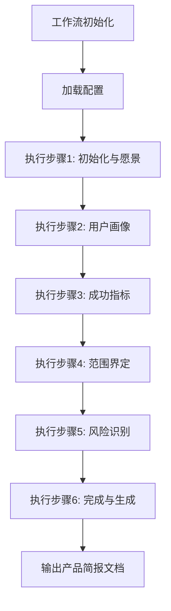
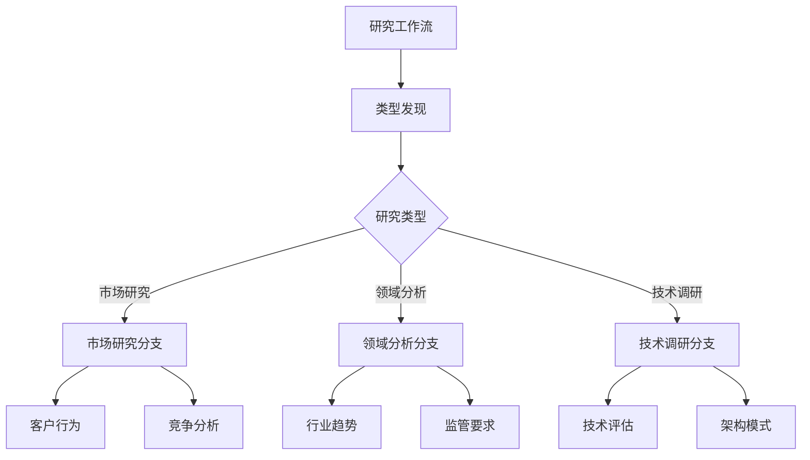

# 分析阶段

<cite>
**本文档中引用的文件**   
- [analyst.agent.yaml](file://src/modules/bmm/agents/analyst.agent.yaml)
- [product-brief.template.md](file://src/modules/bmm/workflows/1-analysis/product-brief/product-brief.template.md)
- [workflow.md](file://src/modules/bmm/workflows/1-analysis/product-brief/workflow.md)
- [step-01-init.md](file://src/modules/bmm/workflows/1-analysis/product-brief/steps/step-01-init.md)
- [step-02-vision.md](file://src/modules/bmm/workflows/1-analysis/product-brief/steps/step-02-vision.md)
- [step-03-users.md](file://src/modules/bmm/workflows/1-analysis/product-brief/steps/step-03-users.md)
- [step-04-metrics.md](file://src/modules/bmm/workflows/1-analysis/product-brief/steps/step-04-metrics.md)
- [step-05-scope.md](file://src/modules/bmm/workflows/1-analysis/product-brief/steps/step-05-scope.md)
- [step-06-complete.md](file://src/modules/bmm/workflows/1-analysis/product-brief/steps/step-06-complete.md)
- [research.template.md](file://src/modules/bmm/workflows/1-analysis/research/research.template.md)
- [workflow.md](file://src/modules/bmm/workflows/1-analysis/research/workflow.md)
- [step-01-init.md](file://src/modules/bmm/workflows/1-analysis/research/market-steps/step-01-init.md)
- [step-02-customer-behavior.md](file://src/modules/bmm/workflows/1-analysis/research/market-steps/step-02-customer-behavior.md)
- [step-05-competitive-analysis.md](file://src/modules/bmm/workflows/1-analysis/research/market-steps/step-05-competitive-analysis.md)
- [step-01-init.md](file://src/modules/bmm/workflows/1-analysis/research/domain-steps/step-01-init.md)
- [step-02-domain-analysis.md](file://src/modules/bmm/workflows/1-analysis/research/domain-steps/step-02-domain-analysis.md)
- [step-04-regulatory-focus.md](file://src/modules/bmm/workflows/1-analysis/research/domain-steps/step-04-regulatory-focus.md)
- [step-01-init.md](file://src/modules/bmm/workflows/1-analysis/research/technical-steps/step-01-init.md)
- [step-02-technical-overview.md](file://src/modules/bmm/workflows/1-analysis/research/technical-steps/step-02-technical-overview.md)
- [step-04-architectural-patterns.md](file://src/modules/bmm/workflows/1-analysis/research/technical-steps/step-04-architectural-patterns.md)
- [workflows-analysis.md](file://src/modules/bmm/docs/workflows-analysis.md)
</cite>

## 目录
1. [引言](#引言)
2. [产品简报工作流](#产品简报工作流)
3. [研究工作流](#研究工作流)
4. [分析代理的角色](#分析代理的角色)
5. [数据文件在决策中的作用](#数据文件在决策中的作用)
6. [实际应用示例](#实际应用示例)
7. [分析阶段输出与后续阶段的衔接](#分析阶段输出与后续阶段的衔接)

## 引言
BMad Method (BMM)的分析阶段是产品开发过程中的关键初始阶段，旨在通过系统化的方法收集需求并进行市场与技术调研。该阶段主要通过两个核心工作流——"产品简报"和"研究"——来实现。产品简报工作流通过六个结构化步骤，从愿景定义到范围界定，确保产品战略的清晰性。研究工作流则分为领域分析、市场研究和技术调研三大分支，提供全面的外部环境洞察。本阶段由analyst.agent.yaml代理驱动，利用CSV数据文件辅助决策，最终输出将作为后续计划阶段的重要输入。

## 产品简报工作流
产品简报工作流是一个交互式的、逐步引导的流程，旨在与用户协作创建全面的产品简报文档。该工作流遵循严格的步骤文件架构，确保每个步骤都按顺序执行，不跳过或优化任何环节。

### 工作流初始化
工作流的启动始于加载配置文件`config.yaml`，解析项目名称、输出文件夹、用户名等关键参数。随后，系统加载并执行第一个步骤文件`step-01-init.md`，正式开启工作流。

**工作流架构原则**
- **微文件设计**：每个步骤都是一个独立的指令文件，构成整体工作流的一部分。
- **即时加载**：仅在需要时加载当前步骤文件，避免预加载未来步骤。
- **顺序执行**：必须严格按照顺序完成所有步骤，不允许跳过或重新排序。
- **状态跟踪**：在输出文件的前言中使用`stepsCompleted`数组记录已完成的步骤。
- **追加式构建**：通过追加内容的方式逐步构建最终文档。

**关键执行规则**
- 严禁同时加载多个步骤文件
- 必须完整阅读整个步骤文件后才能执行
- 严禁跳过步骤或优化执行顺序
- 在加载下一个步骤前，必须更新输出文件的前言
- 必须严格遵循步骤文件中的精确指令
- 在菜单处必须暂停并等待用户输入
- 严禁创建来自未来步骤的心理待办事项列表

**Section sources**
- [workflow.md](file://src/modules/bmm/workflows/1-analysis/product-brief/workflow.md#L1-L59)

### 步骤一：初始化与愿景定义
此步骤通过`step-01-init.md`文件执行，主要任务是与用户建立协作关系，并开始定义产品愿景。分析师代理以平等的合作伙伴身份与用户互动，通过提问引导用户思考产品的核心目标和长期愿景。

**Section sources**
- [step-01-init.md](file://src/modules/bmm/workflows/1-analysis/product-brief/steps/step-01-init.md)

### 步骤二：用户画像与目标群体
在`step-02-vision.md`中，工作流深入探讨产品的目标用户。通过一系列引导性问题，帮助用户定义用户画像，包括用户特征、行为模式、痛点和需求。这一步骤确保产品开发始终以用户为中心。

**Section sources**
- [step-02-vision.md](file://src/modules/bmm/workflows/1-analysis/product-brief/steps/step-02-vision.md)

### 步骤三：成功指标与价值衡量
`step-03-users.md`专注于定义衡量产品成功的关键指标。这包括财务指标（如收入、利润）、用户指标（如活跃用户数、留存率）和技术指标（如系统性能、可靠性）。明确的成功指标为后续的产品决策提供了量化依据。

**Section sources**
- [step-03-users.md](file://src/modules/bmm/workflows/1-analysis/product-brief/steps/step-03-users.md)

### 步骤四：范围界定与MVP定义
在`step-04-metrics.md`中，工作流引导用户界定产品范围，特别是最小可行产品（MVP）的范围。通过优先级排序和可行性评估，帮助用户确定MVP的核心功能，确保产品能够快速推向市场并验证假设。

**Section sources**
- [step-04-metrics.md](file://src/modules/bmm/workflows/1-analysis/product-brief/steps/step-04-metrics.md)

### 步骤五：风险与假设识别
`step-05-scope.md`关注于识别项目中的潜在风险和未验证的假设。通过系统性地列出技术风险、市场风险和运营风险，帮助团队提前规划应对策略，降低项目失败的可能性。

**Section sources**
- [step-05-scope.md](file://src/modules/bmm/workflows/1-analysis/product-brief/steps/step-05-scope.md)

### 步骤六：完成与文档生成
最后，在`step-06-complete.md`中，工作流汇总所有收集到的信息，生成最终的产品简报文档。该文档遵循`product-brief.template.md`的结构，包含项目名称、日期、作者等元数据，并逐步追加各步骤的内容。

**Diagram sources**
- [workflow.md](file://src/modules/bmm/workflows/1-analysis/product-brief/workflow.md#L1-L59)
- [product-brief.template.md](file://src/modules/bmm/workflows/1-analysis/product-brief/product-brief.template.md)

**Section sources**
- [step-06-complete.md](file://src/modules/bmm/workflows/1-analysis/product-brief/steps/step-06-complete.md)

## 研究工作流
研究工作流是一个综合性的研究系统，支持市场、技术、领域等多种类型的研究。该工作流采用微文件架构和基于路由的发现机制，能够根据研究类型动态路由到相应的子工作流。

### 工作流初始化与类型发现
研究工作流的启动同样始于加载`config.yaml`配置文件。随后，系统进入研究类型发现阶段，通过与用户的协作对话，明确研究主题和目标。基于这些信息，系统推荐最合适的研究类型（市场、领域或技术研究）。

**研究行为准则**
- **仅使用当前数据**：所有网络搜索必须使用当前年份的数据
- **来源验证**：所有事实性声明都必须引用来源
- **反幻觉协议**：绝不呈现未经验证来源的信息
- **多来源要求**：关键声明需要至少两个独立来源
- **冲突解决**：呈现相互矛盾的观点并注明差异
- **置信度级别**：用[高/中/低置信度]标记不确定的数据

**Section sources**
- [workflow.md](file://src/modules/bmm/workflows/1-analysis/research/workflow.md#L1-L199)

### 市场研究分支
市场研究分支通过`market-steps`目录下的步骤文件执行，专注于市场规模、增长、竞争格局和客户洞察。

#### 步骤一：初始化与目标市场
`step-01-init.md`文件引导用户定义研究的具体市场和地理范围，建立研究的边界和目标。

**Section sources**
- [step-01-init.md](file://src/modules/bmm/workflows/1-analysis/research/market-steps/step-01-init.md)

#### 步骤二：客户行为与洞察
`step-02-customer-behavior.md`和`step-02-customer-insights.md`深入分析目标客户的购买行为、决策过程和心理动机，为产品定位提供依据。

**Section sources**
- [step-02-customer-behavior.md](file://src/modules/bmm/workflows/1-analysis/research/market-steps/step-02-customer-behavior.md)
- [step-02-customer-insights.md](file://src/modules/bmm/workflows/1-analysis/research/market-steps/step-02-customer-insights.md)

#### 步骤三：竞争分析
`step-05-competitive-analysis.md`系统性地分析主要竞争对手的优势、劣势、市场份额和战略动向，帮助用户找到市场切入点和差异化策略。

**Section sources**
- [step-05-competitive-analysis.md](file://src/modules/bmm/workflows/1-analysis/research/market-steps/step-05-competitive-analysis.md)

### 领域分析分支
领域分析分支通过`domain-steps`目录下的步骤文件执行，专注于特定行业的深度分析。

#### 步骤一：初始化与行业背景
`step-01-init.md`文件引导用户定义研究的具体行业和背景，为后续的深度分析奠定基础。

**Section sources**
- [step-01-init.md](file://src/modules/bmm/workflows/1-analysis/research/domain-steps/step-01-init.md)

#### 步骤二：领域分析与趋势
`step-02-domain-analysis.md`分析行业的整体格局、关键参与者、技术趋势和未来发展方向。

**Section sources**
- [step-02-domain-analysis.md](file://src/modules/bmm/workflows/1-analysis/research/domain-steps/step-02-domain-analysis.md)

#### 步骤三：监管重点
`step-04-regulatory-focus.md`深入研究行业相关的法律法规、合规要求和政策变化，确保产品开发符合监管环境。

**Section sources**
- [step-04-regulatory-focus.md](file://src/modules/bmm/workflows/1-analysis/research/domain-steps/step-04-regulatory-focus.md)

### 技术调研分支
技术调研分支通过`technical-steps`目录下的步骤文件执行，专注于技术评估和架构决策。

#### 步骤一：初始化与技术范围
`step-01-init.md`文件引导用户定义技术研究的具体范围，如特定技术栈、框架或平台。

**Section sources**
- [step-01-init.md](file://src/modules/bmm/workflows/1-analysis/research/technical-steps/step-01-init.md)

#### 步骤二：技术概述与评估
`step-02-technical-overview.md`提供所研究技术的全面概述，包括其优势、劣势、适用场景和社区支持。

**Section sources**
- [step-02-technical-overview.md](file://src/modules/bmm/workflows/1-analysis/research/technical-steps/step-02-technical-overview.md)

#### 步骤三：架构模式
`step-04-architectural-patterns.md`分析不同的架构模式（如微服务、单体、事件驱动等），并根据项目需求推荐最佳实践。

**Section sources**
- [step-04-architectural-patterns.md](file://src/modules/bmm/workflows/1-analysis/research/technical-steps/step-04-architectural-patterns.md)

**Diagram sources**
- [workflow.md](file://src/modules/bmm/workflows/1-analysis/research/workflow.md#L1-L199)

## 分析代理的角色
analyst.agent.yaml代理是驱动分析阶段两大核心工作流的关键角色。作为战略业务分析师和需求专家，该代理具备市场研究、竞争分析和需求挖掘的深厚专业知识。

### 代理配置与元数据
代理的元数据定义了其身份和功能，包括ID、名称、头衔和所属模块。其核心功能通过菜单项触发，每个菜单项对应一个特定的工作流或执行任务。

**关键菜单项**
- **workflow-status**：获取工作流状态或初始化工作流
- **brainstorm-project**：引导项目头脑风暴
- **research**：启动研究工作流
- **product-brief**：创建产品简报
- **document-project**：记录现有项目
- **party-mode**：与其他专家代理协作

**Section sources**
- [analyst.agent.yaml](file://src/modules/bmm/agents/analyst.agent.yaml#L1-L50)

### 代理行为准则
代理的行为准则强调将分析视为寻宝游戏，对每一个线索都充满兴奋，并在结构化洞察的同时提出能激发"顿悟时刻"的问题。其核心原则包括：
- 每个业务挑战都有待发现的根本原因，发现结果必须基于可验证的证据
- 以绝对精确的方式阐述需求，确保所有利益相关者的声音都被听到
- 始终将`project-context.md`文件视为执行计划的圣经

## 数据文件在决策中的作用
在分析阶段，CSV数据文件和其他结构化数据在决策过程中发挥着重要作用。虽然具体的`domain-complexity.csv`文件未在代码库中找到，但系统设计表明这类数据文件可用于量化领域复杂性、技术难度和市场风险。

### 数据驱动的决策支持
通过分析CSV文件中的结构化数据，代理可以：
- 量化不同技术方案的复杂性和实施难度
- 评估不同市场细分的潜力和竞争强度
- 预测不同产品策略的财务影响和ROI
- 识别高风险领域并优先进行深入研究

### 数据标准与集成
`csv-data-file-standards.md`文件定义了CSV数据文件的标准格式和最佳实践，确保数据的一致性和可读性。这些数据文件与工作流无缝集成，为决策提供客观依据。

**Section sources**
- [analyst.agent.yaml](file://src/modules/bmm/agents/analyst.agent.yaml#L1-L50)

## 实际应用示例
### 软件项目启动场景
假设团队要启动一个新的SaaS项目管理工具。分析阶段的应用流程如下：

1. **产品简报工作流**：
   - 定义愿景：成为中小企业的首选项目管理平台
   - 用户画像：项目经理、团队负责人、远程工作者
   - 成功指标：6个月内达到10,000名活跃用户，ARR达到100万美元
   - 范围界定：MVP包含任务管理、团队协作和基本报告功能

2. **研究工作流**：
   - **市场研究**：分析TAM（总可寻址市场）为500亿美元，SAM（可服务市场）为50亿美元，识别主要竞争对手Asana和Monday
   - **技术调研**：评估React vs Vue、Node.js vs Python等技术栈，推荐微服务架构
   - **领域分析**：研究SaaS行业的订阅模式、客户获取成本和流失率

这些研究成果被整合到产品简报中，为后续的详细规划提供了坚实基础。

### 技术选型决策场景
当团队需要在多个技术方案中做出选择时，分析阶段提供系统化的评估框架：

1. 启动`research`工作流，选择"technical"类型
2. 定义研究主题：如"Serverless架构 vs 传统云部署"
3. 代理系统性地比较两种方案的成本、性能、可扩展性和维护复杂性
4. 生成技术研究报告，包含详细的优缺点分析和推荐建议
5. 将研究结果作为架构决策记录（ADR）的输入

## 分析阶段输出与后续阶段的衔接
分析阶段的输出是后续计划阶段的重要输入，确保产品开发建立在坚实的战略基础之上。

### 输出到输入的映射
| 分析阶段输出 | 计划阶段输入 |
|------------|------------|
| product-brief.md | PRD工作流 |
| market-research.md | PRD上下文 |
| domain-research.md | PRD上下文 |
| technical-research.md | 架构设计（第三阶段） |
| competitive-intelligence.md | PRD定位策略 |

### 自动化集成
规划工作流会自动检测并加载分析阶段生成的文档。如果这些文档存在于输出文件夹中，它们将被自动作为上下文信息加载，确保知识的无缝传递。

### 最佳实践
- **避免过度分析**：如果需求已经明确，可以直接跳过分析阶段进入规划
- **迭代式工作**：在头脑风暴、研究和简报之间迭代，不断验证和优化想法
- **记录假设**：明确记录所有假设，以便在规划阶段进行挑战和验证
- **保持战略聚焦**：专注于"做什么"和"为什么"，将"如何做"留给后续阶段
- **利益相关者参与**：利用分析工作流与利益相关者对齐，确保共识

**Section sources**
- [workflows-analysis.md](file://src/modules/bmm/docs/workflows-analysis.md#L1-L267)