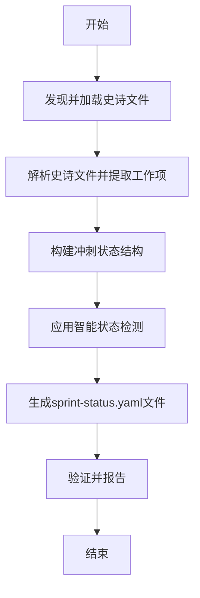
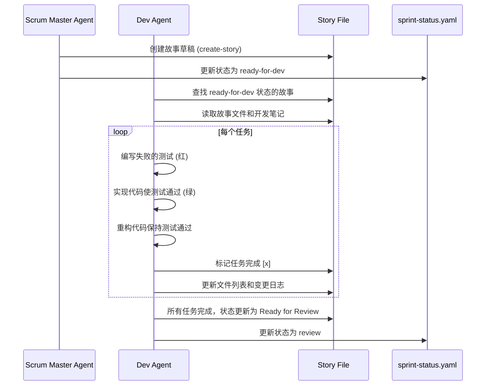
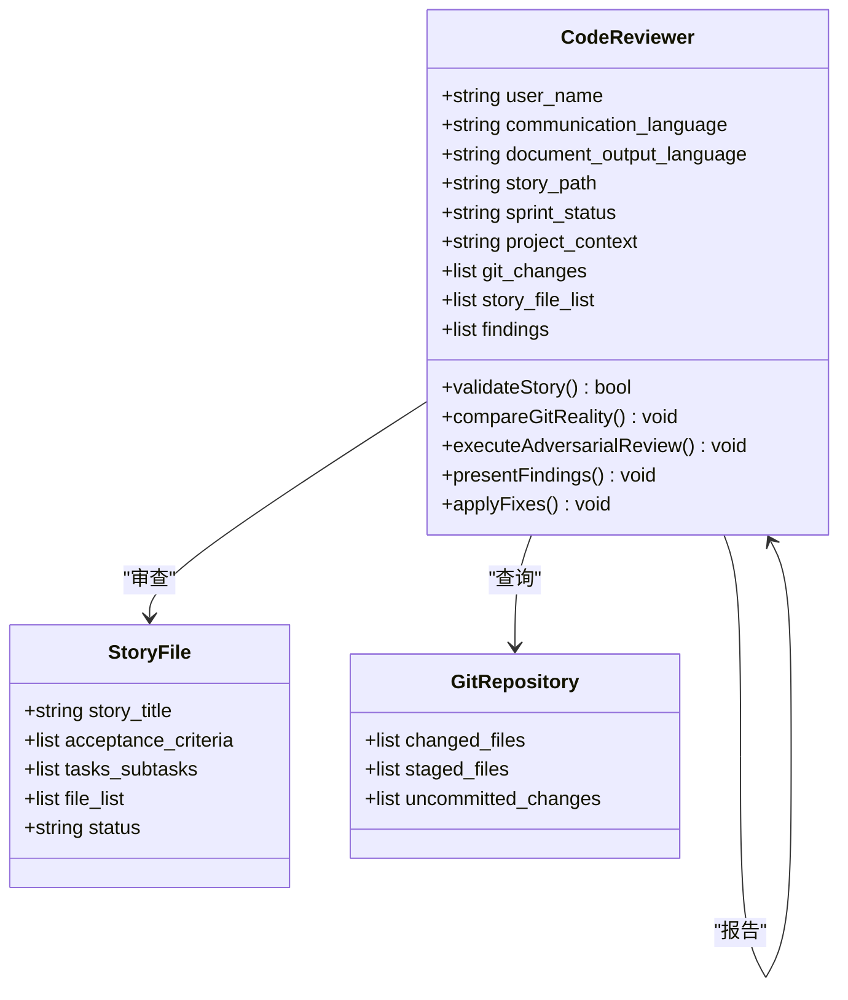

# 实现阶段

<cite>
**本文档中引用的文件**  
- [sprint-planning/workflow.yaml](file://src/modules/bmm/workflows/4-implementation/sprint-planning/workflow.yaml)
- [sprint-planning/instructions.md](file://src/modules/bmm/workflows/4-implementation/sprint-planning/instructions.md)
- [sprint-planning/sprint-status-template.yaml](file://src/modules/bmm/workflows/4-implementation/sprint-planning/sprint-status-template.yaml)
- [sprint-planning/checklist.md](file://src/modules/bmm/workflows/4-implementation/sprint-planning/checklist.md)
- [create-story/workflow.yaml](file://src/modules/bmm/workflows/4-implementation/create-story/workflow.yaml)
- [create-story/instructions.xml](file://src/modules/bmm/workflows/4-implementation/create-story/instructions.xml)
- [create-story/checklist.md](file://src/modules/bmm/workflows/4-implementation/create-story/checklist.md)
- [create-story/template.md](file://src/modules/bmm/workflows/4-implementation/create-story/template.md)
- [dev-story/workflow.yaml](file://src/modules/bmm/workflows/4-implementation/dev-story/workflow.yaml)
- [dev-story/instructions.xml](file://src/modules/bmm/workflows/4-implementation/dev-story/instructions.xml)
- [dev-story/checklist.md](file://src/modules/bmm/workflows/4-implementation/dev-story/checklist.md)
- [code-review/workflow.yaml](file://src/modules/bmm/workflows/4-implementation/code-review/workflow.yaml)
- [code-review/instructions.xml](file://src/modules/bmm/workflows/4-implementation/code-review/instructions.xml)
- [dev.agent.yaml](file://src/modules/bmm/agents/dev.agent.yaml)
- [sm.agent.yaml](file://src/modules/bmm/agents/sm.agent.yaml)
</cite>

## 目录
1. [引言](#引言)
2. [冲刺规划工作流](#冲刺规划工作流)
3. [开发故事与创建故事工作流](#开发故事与创建故事工作流)
4. [代码审查工作流](#代码审查工作流)
5. [实际开发场景示例](#实际开发场景示例)
6. [结论](#结论)

## 引言

BMad Method (BMM)的实现阶段是敏捷开发执行过程的核心，通过一系列精心设计的工作流来确保开发的高效性和代码质量。本阶段主要依赖于三个核心工作流：代码审查、冲刺规划和开发故事。这些工作流协同工作，从任务分配、状态跟踪到代码实现和审查，形成一个完整的开发闭环。Scrum Master代理（sm.agent.yaml）和开发代理（dev.agent.yaml）在这些工作流中扮演关键角色，协调和执行各项任务。特别是`sprint-status-template.yaml`文件，作为冲刺状态的模板，为整个开发过程提供了统一的跟踪标准。本文将深入分析这些工作流的流程和机制，展示它们如何支持敏捷开发的顺利执行。

## 冲刺规划工作流

冲刺规划工作流是实现阶段的起点，负责生成和管理冲刺状态跟踪文件，确保所有史诗（epics）和故事（stories）的状态在整个开发生命周期中得到准确跟踪。该工作流的核心是`sprint-planning/workflow.yaml`文件，它定义了工作流的名称、描述、配置源和输出文件夹等关键变量。工作流通过`instructions.md`文件中的详细指令来执行，首先进行全面的史诗文件加载，采用“完整加载”（FULL_LOAD）策略，确保获取所有史诗和故事的完整信息。

工作流的执行过程分为几个关键步骤：首先，解析史诗文件并提取所有工作项，包括史诗编号、故事ID和标题，并将故事格式转换为kebab-case键；其次，构建冲刺状态结构，为每个史诗、故事和回顾条目创建条目；然后，应用智能状态检测，通过检查文件是否存在来自动升级状态，例如，如果存在`epic-{num}-context.md`文件，则将史诗状态设置为`contexted`；最后，生成`sprint-status.yaml`文件，该文件不仅包含状态信息，还包含详细的元数据和状态定义，确保所有团队成员对状态有统一的理解。

**图示来源**
- [workflow.yaml](file://src/modules/bmm/workflows/4-implementation/sprint-planning/workflow.yaml#L1-L54)
- [instructions.md](file://src/modules/bmm/workflows/4-implementation/sprint-planning/instructions.md#L1-L235)
- [sprint-status-template.yaml](file://src/modules/bmm/workflows/4-implementation/sprint-planning/sprint-status-template.yaml#L1-L57)

**本节来源**
- [workflow.yaml](file://src/modules/bmm/workflows/4-implementation/sprint-planning/workflow.yaml#L1-L54)
- [instructions.md](file://src/modules/bmm/workflows/4-implementation/sprint-planning/instructions.md#L1-L235)
- [sprint-status-template.yaml](file://src/modules/bmm/workflows/4-implementation/sprint-planning/sprint-status-template.yaml#L1-L57)
- [checklist.md](file://src/modules/bmm/workflows/4-implementation/sprint-planning/checklist.md#L1-L34)

## 开发故事与创建故事工作流

开发故事（dev-story）和创建故事（create-story）工作流是实现阶段的核心，它们与`dev.agent.yaml`代理协同工作，实现从用户故事到代码实现的无缝转化。`create-story`工作流负责创建下一个用户故事，它从史诗和故事文件中提取信息，并结合PRD、架构和UX设计等上下文，生成一个包含详尽上下文的草稿故事。该工作流的关键在于其`instructions.xml`文件，它定义了一个严格的流程，包括确定目标故事、加载和分析核心工件、进行架构分析、网络研究以获取最新的技术细节，最后创建综合的故事文件。

`dev.agent.yaml`代理是执行`dev-story`工作流的主体，其角色是高级软件工程师。该代理遵循“红-绿-重构”循环，严格按照故事文件中的任务/子任务序列进行实现。代理的关键行动包括：在实现前阅读整个故事文件，按顺序执行任务/子任务，为每个任务编写失败的测试，确保所有现有测试通过后才继续，并在开发代理记录中记录实现细节。`dev-story`工作流的`instructions.xml`文件详细规定了开发过程，从查找下一个准备开发的故事，到加载项目上下文，再到实施任务、编写测试、运行验证，直至故事完成并标记为“准备审查”。

**图示来源**
- [create-story/workflow.yaml](file://src/modules/bmm/workflows/4-implementation/create-story/workflow.yaml#L1-L61)
- [create-story/instructions.xml](file://src/modules/bmm/workflows/4-implementation/create-story/instructions.xml#L1-L324)
- [dev-story/workflow.yaml](file://src/modules/bmm/workflows/4-implementation/dev-story/workflow.yaml#L1-L28)
- [dev-story/instructions.xml](file://src/modules/bmm/workflows/4-implementation/dev-story/instructions.xml#L1-L406)
- [dev.agent.yaml](file://src/modules/bmm/agents/dev.agent.yaml#L1-L45)

**本节来源**
- [create-story/workflow.yaml](file://src/modules/bmm/workflows/4-implementation/create-story/workflow.yaml#L1-L61)
- [create-story/instructions.xml](file://src/modules/bmm/workflows/4-implementation/create-story/instructions.xml#L1-L324)
- [create-story/checklist.md](file://src/modules/bmm/workflows/4-implementation/create-story/checklist.md#L1-L359)
- [create-story/template.md](file://src/modules/bmm/workflows/4-implementation/create-story/template.md#L1-L100)
- [dev-story/workflow.yaml](file://src/modules/bmm/workflows/4-implementation/dev-story/workflow.yaml#L1-L28)
- [dev-story/instructions.xml](file://src/modules/bmm/workflows/4-implementation/dev-story/instructions.xml#L1-L406)
- [dev-story/checklist.md](file://src/modules/bmm/workflows/4-implementation/dev-story/checklist.md#L1-L81)
- [dev.agent.yaml](file://src/modules/bmm/agents/dev.agent.yaml#L1-L45)

## 代码审查工作流

代码审查工作流是确保代码质量的最后一道防线，由`sm.agent.yaml`代理协调执行。该工作流被设计为一种“对抗性”审查，旨在发现每个故事中3-10个具体问题，绝不接受“看起来不错”的敷衍评价。其核心是`code-review/instructions.xml`文件，它定义了审查的严格流程。审查过程首先加载故事文件并发现变更，通过`git`命令检查实际的代码变更，然后将故事文件中声称的变更与`git`现实进行交叉比对，识别出文件列表不匹配等严重问题。

审查的攻击计划分为四个关键部分：验收标准（AC）验证、任务审计、代码质量和测试质量。审查员会逐一验证每个验收标准是否真正实现，审计每个标记为完成的任务是否真实完成（未完成即为关键发现），并深入检查代码的安全性、性能和可维护性。审查流程强制要求至少发现3个问题，如果发现的问题少于3个，系统会提示审查员“没有足够努力地寻找问题”，并要求重新检查边缘情况、架构违规等。审查结果会以高、中、低严重性分类，并提供三种处理选项：自动修复问题、创建待办事项或深入查看具体问题细节。

**图示来源**
- [code-review/workflow.yaml](file://src/modules/bmm/workflows/4-implementation/code-review/workflow.yaml#L1-L55)
- [code-review/instructions.xml](file://src/modules/bmm/workflows/4-implementation/code-review/instructions.xml#L1-L176)
- [sm.agent.yaml](file://src/modules/bmm/agents/sm.agent.yaml#L1-L56)

**本节来源**
- [code-review/workflow.yaml](file://src/modules/bmm/workflows/4-implementation/code-review/workflow.yaml#L1-L55)
- [code-review/instructions.xml](file://src/modules/bmm/workflows/4-implementation/code-review/instructions.xml#L1-L176)
- [sm.agent.yaml](file://src/modules/bmm/agents/sm.agent.yaml#L1-L56)

## 实际开发场景示例

在一个典型的开发场景中，团队首先运行`sprint-planning`工作流，生成`sprint-status.yaml`文件，该文件自动检测并列出所有史诗和故事的初始状态（backlog）。接着，Scrum Master代理（sm.agent.yaml）运行`create-story`工作流，根据`sprint-status.yaml`中状态为`backlog`的第一个故事，创建一个包含详尽上下文的草稿故事。此过程会分析架构文件、之前的开发故事和最新的技术文档，确保新故事的开发代理拥有所有必要的信息，从而避免重复造轮子或使用错误的库。

随后，开发代理（dev.agent.yaml）通过`dev-story`工作流接手。它首先检查`sprint-status.yaml`，找到状态为`ready-for-dev`的故事，将其状态更新为`in-progress`，然后严格按照故事文件中的任务列表，遵循“红-绿-重构”循环进行开发。每完成一个任务，它都会更新故事文件中的复选框、文件列表和变更日志。当所有任务完成后，故事状态被更新为“Ready for Review”，并同步更新`sprint-status.yaml`中的状态为`review`。

最后，启动`code-review`工作流。审查代理加载故事文件和`git`历史，进行对抗性审查。它会发现诸如“任务标记为完成但实际未实现”或“验收标准未完全满足”等关键问题，并向用户报告。用户可以选择让代理自动修复这些问题，或将其作为待办事项添加回故事中。一旦所有问题解决，审查代理将故事状态更新为`done`，完成整个开发周期。这个闭环流程极大地提高了开发效率和代码质量，确保了每个故事都经过了严格的验证和审查。

**本节来源**
- [sprint-planning/workflow.yaml](file://src/modules/bmm/workflows/4-implementation/sprint-planning/workflow.yaml#L1-L54)
- [create-story/workflow.yaml](file://src/modules/bmm/workflows/4-implementation/create-story/workflow.yaml#L1-L61)
- [dev-story/workflow.yaml](file://src/modules/bmm/workflows/4-implementation/dev-story/workflow.yaml#L1-L28)
- [code-review/workflow.yaml](file://src/modules/bmm/workflows/4-implementation/code-review/workflow.yaml#L1-L55)
- [sm.agent.yaml](file://src/modules/bmm/agents/sm.agent.yaml#L1-L56)
- [dev.agent.yaml](file://src/modules/bmm/agents/dev.agent.yaml#L1-L45)

## 结论

BMad Method的实现阶段通过`冲刺规划`、`开发故事`和`代码审查`三大核心工作流，构建了一个高度自动化和严谨的敏捷开发执行框架。`sprint-status-template.yaml`作为状态跟踪的基石，为整个过程提供了清晰的可视化和管理能力。`create-story`和`dev-story`工作流与`dev.agent.yaml`代理的深度集成，实现了从用户需求到代码实现的高效转化，而`sm.agent.yaml`代理在`代码审查`工作流中的对抗性角色，则确保了代码质量的高标准。这些工作流共同作用，不仅规范了开发流程，还通过自动化检查和智能上下文分析，显著减少了人为错误和返工，为交付高质量的软件产品提供了强有力的保障。