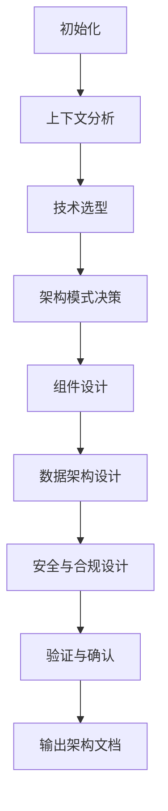
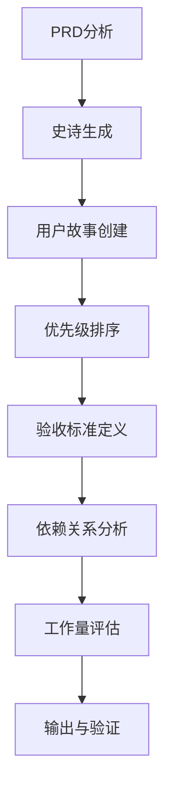

# 解决方案阶段

<cite>
**本文档引用文件**  
- [architect.agent.yaml](file://src/modules/bmm/agents/architect.agent.yaml)
- [pm.agent.yaml](file://src/modules/bmm/agents/pm.agent.yaml)
- [workflow.md](file://src/modules/bmm/workflows/3-solutioning/architecture/workflow.md)
- [architecture-decision-template.md](file://src/modules/bmm/workflows/3-solutioning/architecture/data/architecture-decision-template.md)
- [epics-template.md](file://src/modules/bmm/workflows/3-solutioning/create-epics-and-stories/epics-template.md)
- [instructions.md](file://src/modules/bmm/workflows/3-solutioning/create-epics-and-stories/instructions.md)
</cite>

## 目录
1. [引言](#引言)
2. [解决方案阶段概述](#解决方案阶段概述)
3. [架构设计工作流](#架构设计工作流)
4. [创建史诗和用户故事工作流](#创建史诗和用户故事工作流)
5. [代理角色分析](#代理角色分析)
6. [输出文档格式](#输出文档格式)
7. [与实现阶段的衔接](#与实现阶段的衔接)
8. [结论](#结论)

## 引言
解决方案阶段是BMad Method (BMM)方法论中的关键环节，负责将产品需求转化为可执行的技术实现方案。该阶段通过系统化的架构设计和需求分解流程，确保技术决策与业务目标保持一致，并为后续开发提供清晰的指导。

## 解决方案阶段概述
解决方案阶段位于规划阶段之后、实现阶段之前，主要目标是将产品需求文档（PRD）转化为具体的技术实现路径。该阶段包含两个核心工作流：**架构设计**和**创建史诗与用户故事**。这两个工作流协同工作，确保技术方案既能满足功能需求，又具备良好的可扩展性和可维护性。

**Section sources**
- [workflow.md](file://src/modules/bmm/workflows/3-solutioning/architecture/workflow.md#L8-L9)

## 架构设计工作流
架构设计工作流是一个结构化的八步流程，旨在通过系统化的方法做出高质量的技术决策。该工作流强调协作式决策，确保AI代理在实施过程中保持一致性。

### 八个步骤概述
1. **初始化与配置加载**：加载项目配置参数，包括项目名称、输出目录、用户技能水平等。
2. **上下文分析**：分析项目背景、用户需求和业务目标，建立架构决策的基础。
3. **技术选型**：根据项目需求评估和选择合适的技术栈。
4. **架构模式决策**：确定系统整体架构模式（如微服务、单体等）。
5. **组件设计**：定义系统主要组件及其交互方式。
6. **数据架构设计**：规划数据存储、访问和管理策略。
7. **安全与合规设计**：制定安全策略和合规性要求。
8. **验证与确认**：对架构决策进行验证，确保其满足所有需求。

该工作流采用**微文件架构**（micro-file architecture）进行有序执行，每个步骤都由独立的文件管理，确保流程的纪律性和可追溯性。

**Diagram sources**
- [workflow.md](file://src/modules/bmm/workflows/3-solutioning/architecture/workflow.md#L16-L21)

**Section sources**
- [workflow.md](file://src/modules/bmm/workflows/3-solutioning/architecture/workflow.md#L6-L49)

## 创建史诗和用户故事工作流
该工作流负责将PRD中的高层次需求分解为可执行的开发任务，包括史诗（Epics）和用户故事（Stories）。

### 工作流执行流程
1. **PRD分析**：深入理解产品需求文档中的功能和非功能需求。
2. **史诗生成**：将大型功能模块分解为史诗级别的任务。
3. **用户故事创建**：将史诗进一步细化为具体的用户故事。
4. **优先级排序**：根据业务价值和技术依赖关系对故事进行排序。
5. **验收标准定义**：为每个用户故事定义明确的验收标准。
6. **依赖关系分析**：识别故事之间的依赖关系。
7. **工作量评估**：估算每个故事的开发工作量。
8. **输出与验证**：生成最终的史诗和故事文档并进行验证。

该工作流确保需求分解过程系统化，避免遗漏关键功能点。

**Diagram sources**
- [instructions.md](file://src/modules/bmm/workflows/3-solutioning/create-epics-and-stories/instructions.md#L1-L20)

**Section sources**
- [instructions.md](file://src/modules/bmm/workflows/3-solutioning/create-epics-and-stories/instructions.md)
- [epics-template.md](file://src/modules/bmm/workflows/3-solutioning/create-epics-and-stories/epics-template.md)

## 代理角色分析
解决方案阶段依赖两个关键代理：架构师代理（architect.agent.yaml）和产品经理代理（pm.agent.yaml），它们在技术决策和需求分解中扮演重要角色。

### 架构师代理（Winston）
架构师代理负责技术决策和系统设计，其核心职责包括：
- 创建架构文档以指导开发
- 验证架构决策的合理性
- 确保技术方案与业务目标对齐
- 促进开发准备状态的评估

该代理强调"用户旅程驱动技术决策"和"拥抱稳定可靠的技术"的原则。

### 产品经理代理（John）
产品经理代理负责需求管理和优先级排序，其核心职责包括：
- 创建产品需求文档（PRD）
- 验证PRD的完整性和一致性
- 从PRD生成史诗和用户故事
- 识别潜在风险并进行路线校正

该代理以"不断追问'为什么'"和"基于数据的决策"为原则。

**Section sources**
- [architect.agent.yaml](file://src/modules/bmm/agents/architect.agent.yaml#L11-L18)
- [pm.agent.yaml](file://src/modules/bmm/agents/pm.agent.yaml#L13-L18)

## 输出文档格式
解决方案阶段产生两种关键输出文档，分别采用标准化模板。

### 架构决策文档格式
以`architecture-decision-template.md`为模板，包含以下核心部分：
- **决策背景**：描述做出该架构决策的上下文
- **考虑的选项**：列出评估过的技术方案
- **最终选择**：明确选定的技术方案
- **决策理由**：解释选择该方案的原因
- **影响分析**：评估该决策对系统各方面的影响
- **验证方法**：说明如何验证该决策的有效性

### 史诗和用户故事文档格式
以`epics-template.md`为模板，包含以下核心部分：
- **史诗描述**：高层次的功能模块描述
- **包含的故事**：属于该史诗的具体用户故事列表
- **业务价值**：说明该史诗带来的商业价值
- **验收标准**：定义史诗完成的标准
- **优先级**：标明史诗的开发优先级
- **依赖关系**：列出相关的技术或业务依赖

**Section sources**
- [architecture-decision-template.md](file://src/modules/bmm/workflows/3-solutioning/architecture/data/architecture-decision-template.md)
- [epics-template.md](file://src/modules/bmm/workflows/3-solutioning/create-epics-and-stories/epics-template.md)

## 与实现阶段的衔接
解决方案阶段的输出直接作为实现阶段的输入，确保开发工作有据可依。

### 输入传递机制
1. **架构文档**：为开发团队提供技术蓝图，指导系统实现。
2. **史诗和用户故事**：作为敏捷开发的任务清单，用于迭代规划。
3. **验收标准**：作为测试和质量保证的依据。
4. **依赖关系图**：帮助团队识别开发顺序和潜在瓶颈。

这种结构化的输出确保了从设计到实现的平滑过渡，减少了沟通成本和误解风险。

**Section sources**
- [architect.agent.yaml](file://src/modules/bmm/agents/architect.agent.yaml#L33-L35)
- [pm.agent.yaml](file://src/modules/bmm/agents/pm.agent.yaml#L34-L36)

## 结论
解决方案阶段通过系统化的架构设计和需求分解流程，成功地将抽象的产品需求转化为具体的技术实现方案。该阶段的两个核心工作流——架构设计和创建史诗与用户故事——相互配合，确保技术决策既满足业务需求又具备实施可行性。架构师代理和产品经理代理的协同工作，保证了技术方案与产品愿景的一致性。最终输出的标准化文档为实现阶段提供了清晰的指导，形成了从需求到实现的完整闭环。