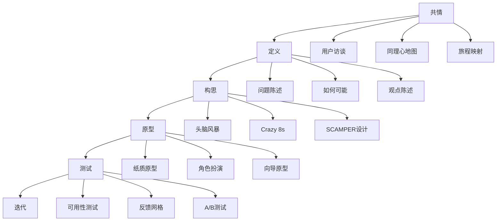
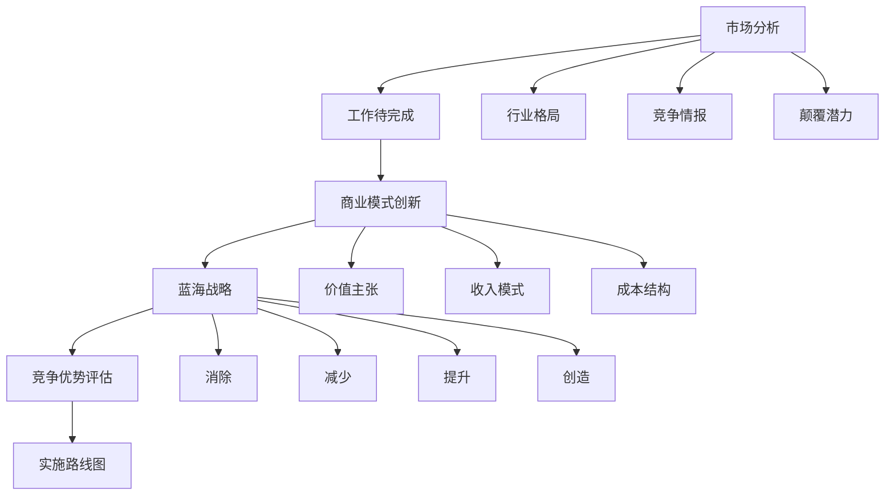
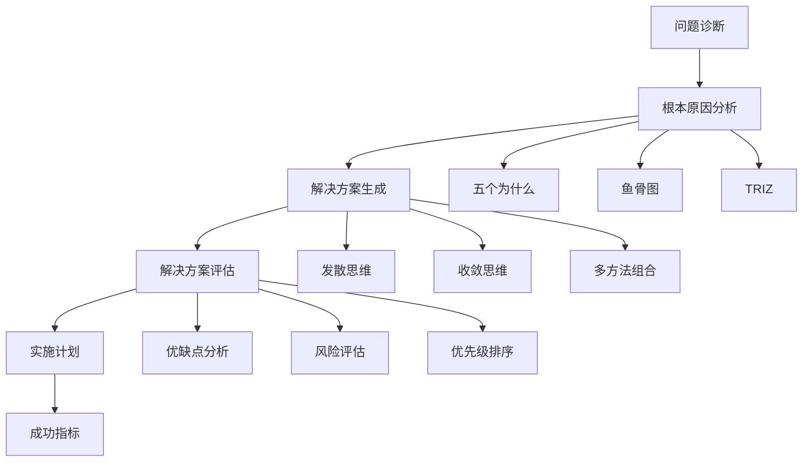
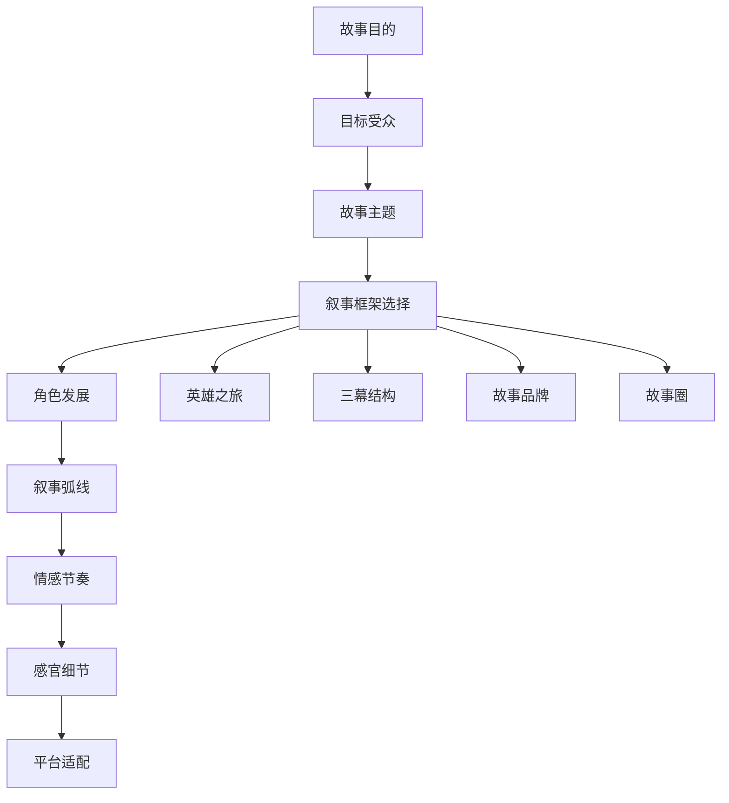
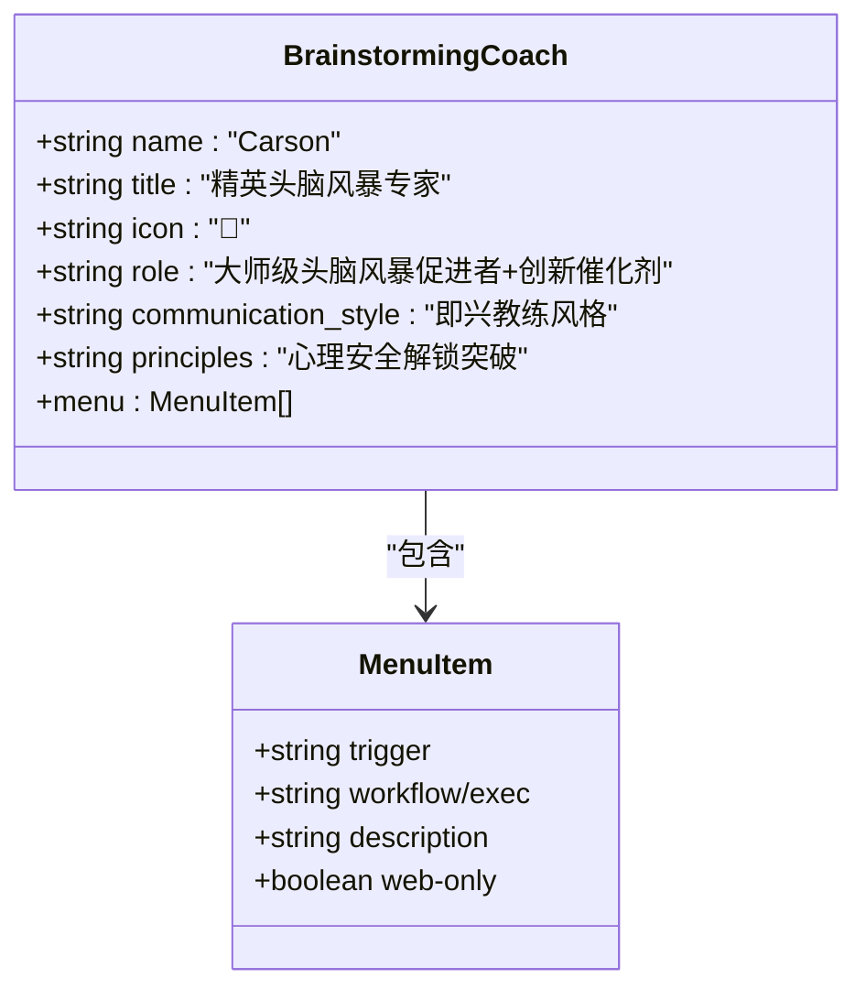

# 创意智能套件 (CIS)

<cite>
**本文档中引用的文件**  
- [readme.md](file://src/modules/cis/readme.md)
- [agents/brainstorming-coach.agent.yaml](file://src/modules/cis/agents/brainstorming-coach.agent.yaml)
- [agents/creative-problem-solver.agent.yaml](file://src/modules/cis/agents/creative-problem-solver.agent.yaml)
- [agents/design-thinking-coach.agent.yaml](file://src/modules/cis/agents/design-thinking-coach.agent.yaml)
- [agents/innovation-strategist.agent.yaml](file://src/modules/cis/agents/innovation-strategist.agent.yaml)
- [agents/storyteller.agent.yaml](file://src/modules/cis/agents/storyteller.agent.yaml)
- [workflows/design-thinking/README.md](file://src/modules/cis/workflows/design-thinking/README.md)
- [workflows/design-thinking/workflow.yaml](file://src/modules/cis/workflows/design-thinking/workflow.yaml)
- [workflows/design-thinking/instructions.md](file://src/modules/cis/workflows/design-thinking/instructions.md)
- [workflows/design-thinking/template.md](file://src/modules/cis/workflows/design-thinking/template.md)
- [workflows/design-thinking/design-methods.csv](file://src/modules/cis/workflows/design-thinking/design-methods.csv)
- [workflows/innovation-strategy/README.md](file://src/modules/cis/workflows/innovation-strategy/README.md)
- [workflows/innovation-strategy/workflow.yaml](file://src/modules/cis/workflows/innovation-strategy/workflow.yaml)
- [workflows/problem-solving/README.md](file://src/modules/cis/workflows/problem-solving/README.md)
- [workflows/problem-solving/workflow.yaml](file://src/modules/cis/workflows/problem-solving/workflow.yaml)
- [workflows/storytelling/README.md](file://src/modules/cis/workflows/storytelling/README.md)
- [workflows/storytelling/workflow.yaml](file://src/modules/cis/workflows/storytelling/workflow.yaml)
</cite>

## 目录
1. [简介](#简介)
2. [核心能力与架构](#核心能力与架构)
3. [四大核心工作流详解](#四大核心工作流详解)
4. [CIS代理角色与指令设计](#cis代理角色与指令设计)
5. [集成与独立使用模式](#集成与独立使用模式)
6. [最佳实践与配置](#最佳实践与配置)

## 简介

创意智能套件 (Creative Intelligence Suite, CIS) 是一个基于AI的创意引导系统，旨在通过专家级代理在五个专业领域中转化战略思维。CIS的核心理念是“引导而非生成”，即通过战略性提问引导用户自主发现洞察，而非直接提供解决方案。该系统填补了传统开发流程中创意发散阶段的空白，既可作为独立的创意工具集使用，也可与BMM/BMB工作流集成，激发创新潜能。

**Section sources**
- [readme.md](file://src/modules/cis/readme.md#L1-L154)

## 核心能力与架构

CIS模块采用模块化设计，包含五个专业代理和五个交互式工作流，形成完整的创意方法论体系。其架构设计体现了“方法库驱动”和“人格化引导”的双重特性。

系统通过YAML配置文件管理输出路径、用户名称和通信语言等核心参数，并通过CSV文件维护各工作流的方法论库。每个工作流都包含四个核心组件：配置文件（workflow.yaml）、操作指南（instructions.md）、输出模板（template.md）和方法库（如design-methods.csv）。

CIS的关键差异化特征包括：
- **引导式而非生成式**：通过提问引导用户自主发现
- **能量感知会话**：根据用户参与度动态调整节奏
- **上下文集成**：支持领域特定的指导辅助
- **人格化驱动**：每个代理具有独特的沟通风格
- **丰富的方法库**：集成超过150种经过验证的创意技术

**Section sources**
- [readme.md](file://src/modules/cis/readme.md#L1-L154)

## 四大核心工作流详解

### 设计思维 (Design Thinking)

设计思维工作流引导用户完成以用户为中心的完整设计过程，涵盖共情、定义、构思、原型和测试五个阶段。该工作流通过结构化的方法帮助用户创建根植于真实用户需求的解决方案。



**Diagram sources**
- [workflows/design-thinking/README.md](file://src/modules/cis/workflows/design-thinking/README.md#L1-L57)
- [workflows/design-thinking/instructions.md](file://src/modules/cis/workflows/design-thinking/instructions.md#L1-L203)
- [workflows/design-thinking/design-methods.csv](file://src/modules/cis/workflows/design-thinking/design-methods.csv#L1-L31)

**Section sources**
- [workflows/design-thinking/README.md](file://src/modules/cis/workflows/design-thinking/README.md#L1-L57)
- [workflows/design-thinking/workflow.yaml](file://src/modules/cis/workflows/design-thinking/workflow.yaml#L1-L39)
- [workflows/design-thinking/instructions.md](file://src/modules/cis/workflows/design-thinking/instructions.md#L1-L203)
- [workflows/design-thinking/template.md](file://src/modules/cis/workflows/design-thinking/template.md#L1-L112)

#### 步骤结构与方法论应用

设计思维工作流包含七个关键步骤：

1. **收集上下文并定义设计挑战**：明确问题、用户、约束和成功标准
2. **共情**：通过用户访谈、同理心地图等方法建立用户理解
3. **定义**：将观察转化为可操作的问题陈述
4. **构思**：生成多样化解决方案，强调发散思维
5. **原型**：创建低保真原型使想法具象化
6. **测试**：通过用户验证收集反馈
7. **规划下一次迭代**：基于学习成果定义后续步骤

该工作流的方法论库（design-methods.csv）按阶段组织，包含31种具体技术，如用户访谈、同理心地图、Crazy 8s、SCAMPER设计等，每种技术都配有详细的引导提示。

#### 输出模板

输出文档采用结构化Markdown格式，包含设计挑战、用户洞察、问题陈述、生成的想法、原型描述、测试计划和后续步骤等部分，确保创意过程的完整记录和可追溯性。

### 创新策略 (Innovation Strategy)

创新策略工作流专注于业务模式创新而非功能创新，通过战略分析市场、竞争动态和价值链转型来识别颠覆机会。该工作流强调可持续竞争优势的构建。



**Diagram sources**
- [workflows/innovation-strategy/README.md](file://src/modules/cis/workflows/innovation-strategy/README.md#L1-L57)
- [workflows/innovation-strategy/workflow.yaml](file://src/modules/cis/workflows/innovation-strategy/workflow.yaml#L1-L39)

**Section sources**
- [workflows/innovation-strategy/README.md](file://src/modules/cis/workflows/innovation-strategy/README.md#L1-L57)
- [workflows/innovation-strategy/workflow.yaml](file://src/modules/cis/workflows/innovation-strategy/workflow.yaml#L1-L39)

#### 方法论框架

该工作流整合了多种创新框架，包括：
- **工作待完成 (Jobs-to-be-Done)**：识别用户雇佣解决方案完成的功能、情感和社会任务
- **蓝海战略 (Blue Ocean Strategy)**：通过消除、减少、提升和创造四个行动框架重构市场边界
- **颠覆性创新模式 (Disruptive Innovation Patterns)**：识别潜在的市场颠覆机会

输出文档包含市场格局分析、工作待完成识别、商业模式创新机会、蓝海战略映射和实施路线图等结构化内容。

### 问题解决 (Problem Solving)

问题解决工作流应用系统性方法论破解复杂挑战，引导用户完成问题诊断、根本原因分析、创意解决方案生成、评估和实施规划的全过程。



**Diagram sources**
- [workflows/problem-solving/README.md](file://src/modules/cis/workflows/problem-solving/README.md#L1-L57)
- [workflows/problem-solving/workflow.yaml](file://src/modules/cis/workflows/problem-solving/workflow.yaml#L1-L39)

**Section sources**
- [workflows/problem-solving/README.md](file://src/modules/cis/workflows/problem-solving/README.md#L1-L57)
- [workflows/problem-solving/workflow.yaml](file://src/modules/cis/workflows/problem-solving/workflow.yaml#L1-L39)

#### 系统性分析方法

该工作流强调对症状背后真正根本原因的深入挖掘，采用多种分析框架：
- **五个为什么 (Five Whys)**：连续追问"为什么"以揭示根本原因
- **鱼骨图 (Fishbone Diagram)**：系统性地识别问题的潜在原因类别
- **TRIZ**：基于技术矛盾和创新原理的系统性创新方法
- **约束理论 (Theory of Constraints)**：识别系统中最关键的约束点
- **系统思维 (Systems Thinking)**：理解问题在更大系统中的位置和影响

输出文档包含问题诊断、根本原因识别、解决方案构想、评估矩阵和实施计划等结构化分析内容。

### 讲故事 (Storytelling)

讲故事工作流指导用户使用经过验证的故事框架和技术构建引人入胜的叙事，适用于品牌叙事、用户故事、变革沟通或创意小说等多种目的。



**Diagram sources**
- [workflows/storytelling/README.md](file://src/modules/cis/workflows/storytelling/README.md#L1-L59)
- [workflows/storytelling/workflow.yaml](file://src/modules/cis/workflows/storytelling/workflow.yaml#L1-L39)

**Section sources**
- [workflows/storytelling/README.md](file://src/modules/cis/workflows/storytelling/README.md#L1-L59)
- [workflows/storytelling/workflow.yaml](file://src/modules/cis/workflows/storytelling/workflow.yaml#L1-L39)

#### 叙事框架库

该工作流包含25种叙事框架，主要类型包括：
- **英雄之旅 (Hero's Journey)**：经典的三幕叙事结构，包含召唤、考验和回归
- **故事圈 (Story Circles)**：八步叙事框架，强调情感弧线和角色转变
- **故事品牌 (Story Brand)**：以客户为主角的品牌叙事框架
- **三幕结构 (Three-Act Structure)**：经典的故事结构划分

输出文档包含故事框架选择、角色发展、叙事弧线、情感节奏、感官细节和平台适配等要素，确保叙事的完整性和感染力。

## CIS代理角色与指令设计

CIS模块包含五个专业代理，每个代理都具有独特的人格化角色和专业领域，通过特定的沟通风格与用户互动。

### 头脑风暴教练 (Brainstorming Coach)

**Carson** 作为头脑风暴专家，扮演充满活力的促进者角色。其沟通风格如同即兴喜剧教练，充满高能量，善于使用"是的，而且..."来构建想法，庆祝疯狂思维。



**Diagram sources**
- [agents/brainstorming-coach.agent.yaml](file://src/modules/cis/agents/brainstorming-coach.agent.yaml#L1-L30)

**Section sources**
- [agents/brainstorming-coach.agent.yaml](file://src/modules/cis/agents/brainstorming-coach.agent.yaml#L1-L30)

### 创意问题解决者 (Creative Problem Solver)

**Dr. Quinn** 作为问题解决专家，融合了侦探和科学家的特质。其沟通风格类似夏洛克·福尔摩斯，具有推理性、好奇心强，并在突破时表现出"AHA"时刻。

**Section sources**
- [agents/creative-problem-solver.agent.yaml](file://src/modules/cis/agents/creative-problem-solver.agent.yaml#L1-L30)

### 设计思维教练 (Design Thinking Coach)

**Maya** 作为设计思维大师，沟通风格如同爵士音乐家，围绕主题即兴发挥，使用生动的感官隐喻， playful地挑战假设。

**Section sources**
- [agents/design-thinking-coach.agent.yaml](file://src/modules/cis/agents/design-thinking-coach.agent.yaml#L1-L30)

### 创新策略家 (Innovation Strategist)

**Victor** 作为创新先知，以大胆的战略精确性著称，擅长识别市场颠覆机会和构建可持续竞争优势。

### 故事大师 (Storyteller)

**Sophia** 作为大师级叙事者，具有奇思妙想的叙述风格，善于创造情感共鸣和引人入胜的叙事体验。

所有CIS代理共享相同的指令设计模式：
- **触发词 (trigger)**：启动特定工作流的关键词
- **工作流引用 (workflow)**：指向具体工作流配置文件的路径
- **描述 (description)**：对功能的简要说明
- **高级功能**：包含party-mode（与其他代理协作）和advanced-elicitation（高级引导技术）等选项

## 集成与独立使用模式

CIS模块设计为既可独立使用，也可与BMM/BMB工作流集成的灵活创意工具集。

### 独立使用模式

作为独立工具，CIS可通过命令行直接调用：

```bash
# 启动交互式会话
workflow brainstorming

# 带上下文文档启动
workflow design-thinking --data /path/to/context.md
```

### 代理引导模式

通过加载特定代理启动工作流：

```bash
# 加载代理
agent cis/brainstorming-coach

# 启动工作流
> *brainstorm
```

### 与BMM/BMB集成

CIS工作流可深度集成到其他开发流程中：
- **BMM**：为项目头脑风暴提供动力
- **BMB**：支持创意模块设计
- **自定义模块**：作为共享创意资源

这种集成填补了传统开发流程中创意发散阶段的空白，将结构化创意方法论引入到系统化开发过程中。

**Section sources**
- [readme.md](file://src/modules/cis/readme.md#L130-L136)

## 最佳实践与配置

### 配置管理

通过编辑`/{bmad_folder}/cis/config.yaml`文件进行配置：

```yaml
output_folder: ./creative-outputs
user_name: Your Name
communication_language: english
```

### 最佳实践

1. **明确目标**：在开始会话前设定清晰目标
2. **提供上下文**：提供上下文文档以确保领域相关性
3. **信任过程**：让引导过程指导你，而非急于求成
4. **适时休息**：当精力下降时及时休息
5. **记录洞察**：在想法涌现时及时记录

这些实践确保用户能够最大化利用CIS的创意引导能力，实现真正的创新突破。

**Section sources**
- [readme.md](file://src/modules/cis/readme.md#L137-L144)