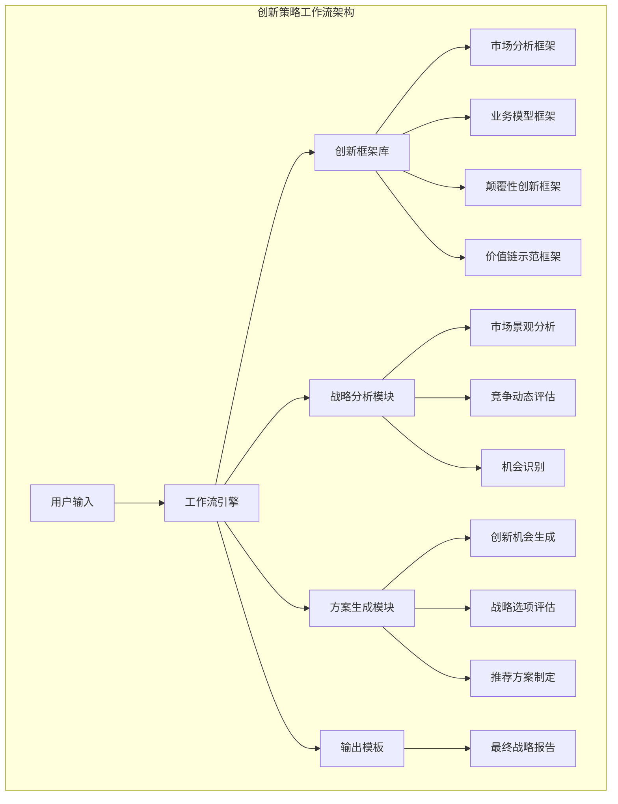
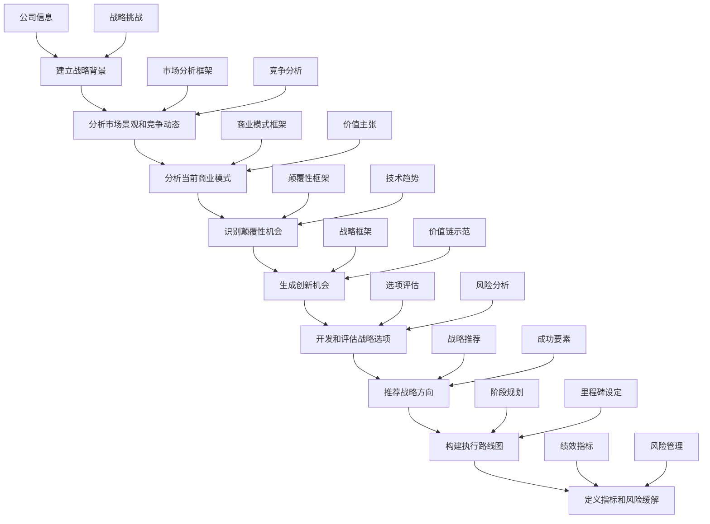
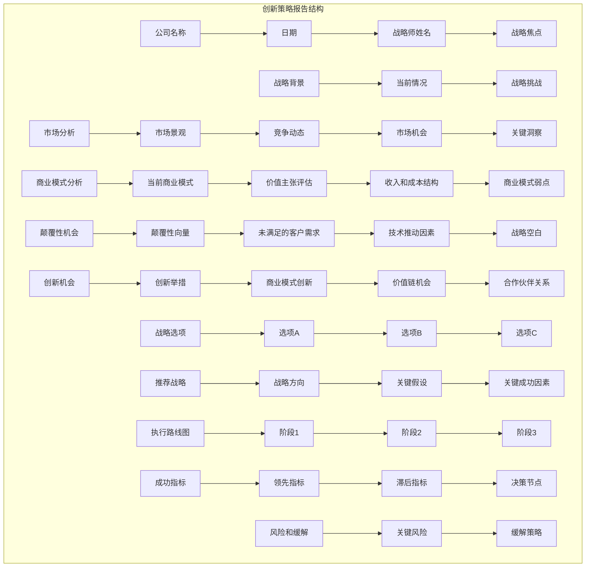
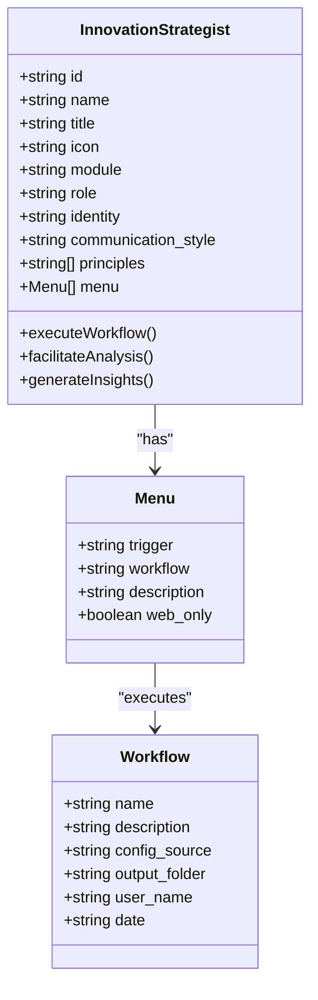
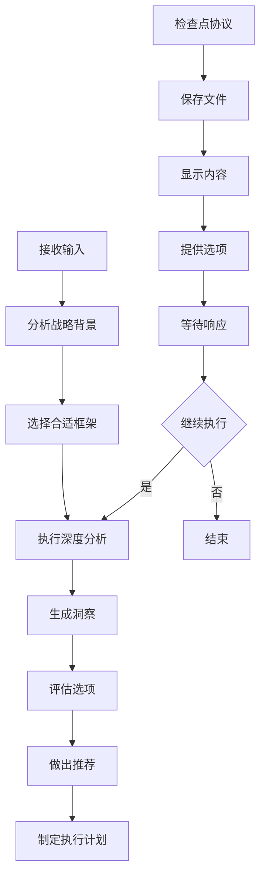

# 创新策略工作流详细文档

<cite>
**本文档引用的文件**
- [innovation-frameworks.csv](file://src/modules/cis/workflows/innovation-strategy/innovation-frameworks.csv)
- [workflow.yaml](file://src/modules/cis/workflows/innovation-strategy/workflow.yaml)
- [instructions.md](file://src/modules/cis/workflows/innovation-strategy/instructions.md)
- [template.md](file://src/modules/cis/workflows/innovation-strategy/template.md)
- [innovation-strategist.agent.yaml](file://src/modules/cis/agents/innovation-strategist.agent.yaml)
- [README.md](file://src/modules/cis/workflows/innovation-strategy/README.md)
- [design-thinking/workflow.yaml](file://src/modules/cis/workflows/design-thinking/workflow.yaml)
- [design-thinking/instructions.md](file://src/modules/cis/workflows/design-thinking/instructions.md)
- [design-thinking/template.md](file://src/modules/cis/workflows/design-thinking/template.md)
</cite>

## 目录
1. [概述](#概述)
2. [系统架构](#系统架构)
3. [创新框架库](#创新框架库)
4. [工作流结构](#工作流结构)
5. [战略思考指导](#战略思考指导)
6. [方案输出格式](#方案输出格式)
7. [代理专业知识配置](#代理专业知识配置)
8. [跨行业应用示例](#跨行业应用示例)
9. [实施指南](#实施指南)
10. [总结](#总结)

## 概述

创新策略工作流是一个基于人工智能的系统化战略创新方法论，旨在通过科学的框架和工具帮助组织识别颠覆性机会、设计业务模型创新，并制定可持续的竞争优势战略。该工作流建立在成熟的创新理论基础之上，结合了BMAD创意智能套件的技术能力，为不同行业的企业提供灵活的战略创新解决方案。

### 核心价值主张

- **系统化创新**：基于经过验证的创新理论框架，确保战略思考的系统性和科学性
- **跨行业适用**：通用的创新方法论可适配不同行业和业务场景
- **实践导向**：强调从洞察到行动的完整转化过程
- **AI增强**：利用人工智能技术提升创新效率和质量

## 系统架构

创新策略工作流采用模块化架构设计，包含核心组件、创新框架库、执行引擎和输出模板四个主要层次。



**图表来源**
- [workflow.yaml](file://src/modules/cis/workflows/innovation-strategy/workflow.yaml#L1-L39)
- [instructions.md](file://src/modules/cis/workflows/innovation-strategy/instructions.md#L1-L277)

### 架构特点

1. **分层设计**：清晰的层次结构确保各模块职责明确
2. **框架驱动**：基于标准化的创新框架保证分析质量
3. **流程控制**：严格的步骤管理和检查点机制确保输出质量
4. **模板化输出**：统一的输出格式便于理解和应用

**章节来源**
- [workflow.yaml](file://src/modules/cis/workflows/innovation-strategy/workflow.yaml#L1-L39)
- [README.md](file://src/modules/cis/workflows/innovation-strategy/README.md#L1-L57)

## 创新框架库

创新框架库是工作流的核心知识资产，包含了31种经过验证的创新理论和分析方法，按类别分为四个主要维度。

### 框架分类体系

```mermaid
mindmap
root((创新框架库))
disruptioon(颠覆性创新)
Disruptive Innovation Theory(颠覆性创新理论)
Jobs to be Done(工作至完成理论)
Blue Ocean Strategy(蓝海战略)
Crossing the Chasm(跨越鸿沟)
Platform Revolution(平台革命)
business_model(商业模式)
Business Model Canvas(商业模式画布)
Value Proposition Canvas(价值主张画布)
Business Model Patterns(商业模式模式)
Revenue Model Innovation(收入模式创新)
Cost Structure Innovation(成本结构创新)
market_analysis(市场分析)
TAM SAM SOM Analysis(总市场分析)
Five Forces Analysis(五力分析)
PESTLE Analysis(PESTLE分析)
Market Timing Assessment(市场时机评估)
Competitive Positioning Map(竞争定位图)
strategic(战略规划)
Three Horizons Framework(三重边界框架)
Lean Startup Methodology(精益创业方法论)
Innovation Ambition Matrix(创新雄心矩阵)
Strategic Intent Development(战略意图发展)
Scenario Planning(情景规划)
value_chain(价值链)
Value Chain Analysis(价值链分析)
Unbundling Analysis(解耦分析)
Platform Ecosystem Design(平台生态系统设计)
Make vs Buy Analysis(自制与外包分析)
Partnership Strategy(合作伙伴关系策略)
technology(技术创新)
Technology Adoption Lifecycle(技术采用生命周期)
S-Curve Analysis(S曲线分析)
Technology Roadmapping(技术路线图)
Open Innovation Strategy(开放式创新战略)
Digital Transformation Framework(数字化转型框架)
```

**图表来源**
- [innovation-frameworks.csv](file://src/modules/cis/workflows/innovation-strategy/innovation-frameworks.csv#L1-L31)

### 关键框架详解

#### 颠覆性创新理论 (Disruptive Innovation Theory)
- **核心思想**：新进入者通过简化、低价解决方案颠覆现有市场
- **关键问题**：谁是非消费者？什么对他们来说足够好？
- **应用场景**：新兴市场进入、传统行业转型

#### 工作至完成理论 (Jobs to be Done)
- **核心思想**：深入理解客户雇佣产品解决的具体问题
- **关键问题**：客户雇佣这个产品来做什么？他们寻求什么进展？
- **应用场景**：产品开发、市场细分

#### 蓝海战略 (Blue Ocean Strategy)
- **核心思想**：创造无竞争的市场空间，通过价值创新实现差异化
- **关键问题**：我们应该消除哪些因素？应该减少什么？
- **应用场景**：市场重新定位、品牌重塑

**章节来源**
- [innovation-frameworks.csv](file://src/modules/cis/workflows/innovation-strategy/innovation-frameworks.csv#L1-L31)

## 工作流结构

创新策略工作流采用线性但迭代的方法，包含九个关键步骤，每个步骤都有明确的目标和产出要求。

### 工作流步骤详解



**图表来源**
- [instructions.md](file://src/modules/cis/workflows/innovation-strategy/instructions.md#L21-L277)

### 步骤详细说明

#### 第一步：建立战略背景
- **目标**：明确分析范围和战略重点
- **输入**：公司信息、战略挑战、约束条件
- **产出**：清晰的战略框架和分析边界

#### 第二步：分析市场景观和竞争动态
- **目标**：理解市场环境和竞争格局
- **方法**：使用TAM/SAM/SOM分析、五力分析等框架
- **产出**：市场洞察和竞争态势图

#### 第三步：分析当前商业模式
- **目标**：评估现有商业模式的有效性
- **方法**：商业模式画布、价值主张画布
- **产出**：商业模式弱点和改进机会

#### 第四步：识别颠覆性机会
- **目标**：发现潜在的颠覆性创新机会
- **方法**：颠覆性创新理论、蓝海战略
- **产出**：颠覆性机会清单和战略空白点

#### 第五步：生成创新机会
- **目标**：基于识别的机会生成具体创新方案
- **方法**：三重边界框架、合作伙伴关系策略
- **产出**：多个创新机会和实施方案

**章节来源**
- [instructions.md](file://src/modules/cis/workflows/innovation-strategy/instructions.md#L21-L277)

## 战略思考指导

创新策略工作流提供了系统化的战略思考指导原则，确保参与者能够进行深度和批判性的战略思考。

### 核心思考原则

```mermaid
mindmap
root((战略思考指导))
brutal_truth[残酷真相原则]
market_realities[市场现实]
assumptions_ruthlessly[假设挑战]
comfortable_illusions[舒适幻觉]
balanced_vision[平衡愿景原则]
bold_vision[大胆愿景]
pragmatic_execution[务实执行]
sustainable_advantage[可持续优势]
evidence_based[证据基础原则]
empirical_data[实证数据]
logical_reasoning[逻辑推理]
hopeful_guesses[希望猜测]
celebrate_clarity[庆祝清晰原则]
strategic_clarity[战略清晰]
achievement_celebration[成就庆祝]
clarity_motivation[清晰激励]
```

**图表来源**
- [instructions.md](file://src/modules/cis/workflows/innovation-strategy/instructions.md#L9-L17)

### 关键提问清单

工作流提供了系统的关键问题清单，引导深入的战略思考：

#### 市场分析关键问题
- 市场细分存在哪些以及它们如何演变？
- 真正的竞争对手是谁（包括非明显者）？
- 什么替代品威胁你的价值主张？
- 市场中什么变化创造了机会或威胁？

#### 商业模式关键问题
- 你真正服务的是谁，他们雇佣你来解决什么工作？
- 你今天如何创造、交付和捕获价值？
- 你的防御性竞争优势是什么（要诚实）？
- 你的商业模式在哪些方面容易受到颠覆？

#### 颠覆性机会关键问题
- 你可以服务的非消费者是谁？
- 哪些客户工作被严重忽视？
- 新群体需要"足够好"的是什么？
- 什么技术使突然的战略开放成为可能？

**章节来源**
- [instructions.md](file://src/modules/cis/workflows/innovation-strategy/instructions.md#L24-L162)

## 方案输出格式

创新策略工作流采用标准化的输出格式，确保战略方案的结构化和可操作性。

### 输出结构框架



**图表来源**
- [template.md](file://src/modules/cis/workflows/innovation-strategy/template.md#L1-L190)

### 输出模板特点

1. **结构化格式**：清晰的标题层次和内容组织
2. **可追踪性**：每个部分都有明确的输出要求
3. **实用性**：直接支持后续的战略执行
4. **完整性**：涵盖战略制定的所有关键环节

**章节来源**
- [template.md](file://src/modules/cis/workflows/innovation-strategy/template.md#L1-L190)

## 代理专业知识配置

创新策略代理（Victor）是专门设计的战略创新顾问，具有独特的专业知识配置和沟通风格。

### 代理配置详解



**图表来源**
- [innovation-strategist.agent.yaml](file://src/modules/cis/agents/innovation-strategist.agent.yaml#L1-L30)

### 专业知识配置

#### 角色定位
- **角色**：商业模型创新者 + 战略颠覆专家
- **身份**：曾领导过数十亿美元转型的传奇战略家
- **专业背景**：麦肯锡前顾问，专注于Jobs-to-be-Done和蓝海战略

#### 沟通风格
- **风格**：象棋大师般的沟通方式 - 大胆声明、战略沉默、毁灭性简单问题
- **特点**：直击要害、挑战假设、注重结果
- **目标**：在战略创新中追求清晰和执行力

#### 核心原则
1. **市场奖励真正的新增价值**：创新必须创造真实的价值
2. **没有商业模型思考的创新是表演**：关注商业模式而非表面创新
3. **增量思维意味着过时**：追求根本性变革而非渐进式改进

### 决策逻辑

创新策略代理采用以下决策逻辑：



**图表来源**
- [instructions.md](file://src/modules/cis/workflows/innovation-strategy/instructions.md#L6-L8)

**章节来源**
- [innovation-strategist.agent.yaml](file://src/modules/cis/agents/innovation-strategist.agent.yaml#L1-L30)

## 跨行业应用示例

创新策略工作流展示了强大的跨行业适应性，以下是几个典型的应用案例。

### 制造业应用案例

#### 行业背景
一家传统制造业公司面临数字化转型压力，需要寻找新的增长机会。

#### 应用框架
1. **市场分析**：PESTLE分析（政治经济社会技术法律环境）
2. **商业模式**：商业模式画布
3. **颠覆性机会**：技术采用生命周期
4. **创新机会**：数字化转型框架

#### 实施效果
- 发现了智能制造服务的新商业模式
- 识别了工业互联网平台的颠覆性机会
- 制定了从硬件销售到服务订阅的转型路线图

### 金融服务应用案例

#### 行业背景
一家传统银行需要应对金融科技公司的竞争压力。

#### 应用框架
1. **市场分析**：五力分析
2. **商业模式**：收入模式创新
3. **颠覆性机会**：平台革命
4. **创新机会**：合作伙伴关系策略

#### 实施效果
- 设计了开放银行API生态系统的战略
- 开发了基于区块链的支付解决方案
- 建立了金融科技加速器伙伴关系

### 医疗健康应用案例

#### 行业背景
一家医疗设备公司需要突破现有市场限制。

#### 应用框架
1. **市场分析**：TAM SAM SOM分析
2. **商业模式**：成本结构创新
3. **颠覆性机会**：蓝海战略
4. **创新机会**：价值链分析

#### 实施效果
- 发现了远程医疗设备市场的蓝海机会
- 设计了按使用付费的新型商业模式
- 优化了供应链成本结构

### 教育科技应用案例

#### 行业背景
一家教育机构需要适应在线学习的快速变化。

#### 应用框架
1. **市场分析**：市场时机评估
2. **商业模式**：业务模型模式
3. **颠覆性机会**：Jobs to be Done
4. **创新机会**：技术路线图

#### 实施效果
- 识别了个性化学习的未满足需求
- 设计了订阅制在线课程模式
- 制定了混合式学习的实施路径

### 跨行业共性特征

尽管行业差异很大，但创新策略工作流在所有应用中都展现出以下共性特征：

1. **系统性思考**：从整体视角审视业务和市场
2. **客户中心**：深入理解客户的真实需求
3. **创新驱动**：超越现状，寻找根本性解决方案
4. **执行导向**：将战略思考转化为可操作的行动计划

**章节来源**
- [instructions.md](file://src/modules/cis/workflows/innovation-strategy/instructions.md#L24-L162)

## 实施指南

为了有效实施创新策略工作流，建议遵循以下最佳实践指南。

### 准备阶段

#### 数据收集
1. **市场情报**：收集行业报告、竞争分析、技术趋势
2. **内部资料**：整理现有的业务分析、财务数据、战略文档
3. **客户研究**：获取客户反馈、市场调研、用户访谈记录

#### 团队准备
1. **跨部门参与**：确保有来自不同职能部门的代表
2. **知识培训**：对团队成员进行创新框架的基础培训
3. **资源分配**：确定项目的时间、预算和人力资源

### 执行阶段

#### 工作流管理
1. **严格遵循步骤**：按照既定的九个步骤顺序执行
2. **定期检查点**：在每个关键节点进行成果审查
3. **灵活调整**：根据实际情况适当调整分析深度

#### 质量控制
1. **证据验证**：确保所有结论都有充分的数据支持
2. **多角度验证**：使用不同的框架交叉验证结论
3. **外部咨询**：必要时引入外部专家进行评审

### 后续跟进

#### 战略落地
1. **行动计划**：将战略方案转化为具体的行动计划
2. **资源配置**：确保必要的资源和支持到位
3. **时间表制定**：建立明确的时间进度安排

#### 绩效监控
1. **关键指标**：建立战略执行的关键绩效指标
2. **定期回顾**：设立定期的战略回顾会议
3. **灵活调整**：根据执行情况及时调整战略

### 常见挑战及解决方案

#### 挑战1：组织抵触变革
**解决方案**：通过成功的试点项目展示价值，建立变革文化

#### 挑战2：数据不足
**解决方案**：优先关注最重要的问题，使用替代数据源

#### 挑战3：执行不力
**解决方案**：建立强有力的项目治理机制，明确责任分工

## 总结

创新策略工作流代表了战略创新方法论的重要发展，它将成熟的创新理论与先进的AI技术相结合，为企业提供了系统化、可操作的战略创新解决方案。

### 核心优势

1. **理论基础扎实**：基于经过验证的创新理论框架
2. **方法论系统**：提供完整的战略创新流程
3. **跨行业适用**：适用于各种类型的组织和行业
4. **AI增强**：利用人工智能提升创新效率和质量
5. **实践导向**：强调从洞察到行动的完整转化

### 应用前景

随着商业环境的快速变化和技术的持续进步，创新策略工作流将在以下方面发挥更大作用：

- **加速创新进程**：显著缩短从想法到实施的时间周期
- **降低创新风险**：通过系统化分析减少战略决策的风险
- **提升创新能力**：培养组织的系统性创新思维
- **支持数字化转型**：为企业的数字化转型提供战略指导

### 发展方向

未来，创新策略工作流将继续演进，可能的发展方向包括：

- **实时数据分析**：集成实时市场数据和趋势分析
- **预测性分析**：利用机器学习预测创新机会和市场变化
- **协作平台**：提供更强大的团队协作和知识共享功能
- **个性化定制**：根据不同组织的特点提供更加个性化的解决方案

创新策略工作流不仅是一个工具，更是一种思维方式的转变。它鼓励组织跳出传统的思维框架，以更加开放和系统的方式面对创新挑战，为组织的可持续发展奠定坚实的战略基础。